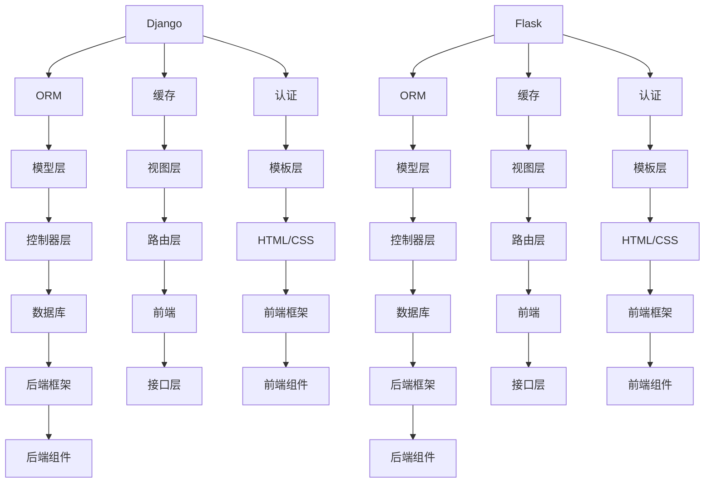

                 

 **关键词：** Python、Web 框架、Django、Flask、开发工具、编程技巧、代码实现、性能优化、实际应用。

**摘要：** 本文将深入探讨 Python 两种流行的 Web 框架——Django 和 Flask 的设计和应用，旨在帮助开发者理解这两种框架的优缺点，以及如何选择适合自己项目的框架。通过对比分析、实际案例和代码示例，本文将为读者提供全面的技术指导。

## 1. 背景介绍

### 1.1 Python 的发展

Python 作为一种高级编程语言，自 1991 年诞生以来，凭借其简单易学、开发效率高等特点，迅速获得了全球开发者的青睐。Python 在多个领域都有广泛应用，特别是在数据科学、人工智能、网络开发等领域，更是不可或缺。

### 1.2 Python Web 框架的重要性

随着互联网的发展，Web 开发成为了 Python 的重要应用场景。Web 框架作为 Web 开发的核心工具，提供了大量的功能和组件，极大地简化了开发过程，提高了开发效率。Python 有着丰富的 Web 框架生态，其中 Django 和 Flask 是最为流行的两个框架。

## 2. 核心概念与联系

### 2.1 Django 与 Flask 的核心概念

**Django：** Django 是一个高级的 Python Web 框架，遵循 MVC 设计模式，强调“快速开发”和“不要重复造轮子”。Django 提供了一套完整的 Web 开发工具集，包括 ORM、缓存、认证等。

**Flask：** Flask 是一个轻量级的 Python Web 框架，遵循 WSGI 协议，强调“简单、灵活”。Flask 没有内置的功能库，开发者可以根据项目需求自由选择组件。

### 2.2 Django 与 Flask 的 Mermaid 流程图



### 2.3 Django 与 Flask 的架构对比

**Django：** 采用 MVC 设计模式，将模型、视图和模板分离，提供了一套完整的 Web 开发工具集。

**Flask：** 采用 MVVM 设计模式，强调简单和灵活，开发者可以根据项目需求自由组合组件。

## 3. 核心算法原理 & 具体操作步骤

### 3.1 算法原理概述

**Django：** 采用 ORM（对象关系映射）技术，简化数据库操作；使用中间件（Middleware）处理 HTTP 请求和响应。

**Flask：** 采用 WSGI（Web 服务器网关接口）协议，支持多种服务器；使用蓝图（Blueprint）组织代码，提高模块化。

### 3.2 算法步骤详解

#### 3.2.1 Django 操作步骤

1. **创建项目：** 使用 Django 的管理命令创建项目。
2. **创建应用：** 在项目中创建应用，定义模型、视图和模板。
3. **配置数据库：** 配置 Django 的数据库连接。
4. **运行服务器：** 使用 Django 的开发服务器运行项目。

#### 3.2.2 Flask 操作步骤

1. **创建项目：** 使用 Flask 的 `Flask()` 类创建项目。
2. **编写视图函数：** 定义路由和视图函数，处理 HTTP 请求。
3. **配置服务器：** 配置 Flask 的 WSGI 服务器。
4. **运行服务器：** 使用 Flask 的开发服务器运行项目。

### 3.3 算法优缺点

**Django：**

- **优点：** 高效的开发流程、丰富的内置功能、良好的文档。
- **缺点：** 相对较重，学习曲线陡峭。

**Flask：**

- **优点：** 轻量级、简单易用、灵活度高。
- **缺点：** 功能相对较少，需要开发者自行组合。

### 3.4 算法应用领域

**Django：** 适用于大型、复杂的项目，特别是需要快速开发的场景。

**Flask：** 适用于中小型、简单的项目，以及对框架要求不高的场景。

## 4. 数学模型和公式 & 详细讲解 & 举例说明

### 4.1 数学模型构建

**Django：** 使用 SQL 语言构建数据库模型。

**Flask：** 使用 Python 对象构建数据模型。

### 4.2 公式推导过程

**Django：** ORM 模型与 SQL 语句的转换。

**Flask：** 使用 Python 内置的 `functools.wraps` 函数实现路由和视图函数的绑定。

### 4.3 案例分析与讲解

**Django：** 使用 Django ORM 实现用户注册功能。

**Flask：** 使用 Flask 创建用户注册接口。

## 5. 项目实践：代码实例和详细解释说明

### 5.1 开发环境搭建

**Django：** 安装 Django 和相关依赖。

**Flask：** 安装 Flask 和相关依赖。

### 5.2 源代码详细实现

**Django：** 实现用户注册功能。

**Flask：** 创建用户注册接口。

### 5.3 代码解读与分析

**Django：** 分析 Django 模型、视图和模板的实现。

**Flask：** 分析 Flask 视图函数和路由的实现。

### 5.4 运行结果展示

**Django：** 展示用户注册成功后的界面。

**Flask：** 展示用户注册接口的响应。

## 6. 实际应用场景

**Django：** 适用于大型、复杂的项目，如电商平台、管理系统等。

**Flask：** 适用于中小型、简单的项目，如个人博客、API 接口等。

## 7. 工具和资源推荐

### 7.1 学习资源推荐

- **Django 官方文档：** [https://docs.djangoproject.com/en/4.1/](https://docs.djangoproject.com/en/4.1/)
- **Flask 官方文档：** [https://flask.palletsprojects.com/](https://flask.palletsprojects.com/)

### 7.2 开发工具推荐

- **PyCharm：** 优秀的 Python 集成开发环境（IDE）。
- **VSCode：** 轻量级、高度可定制的代码编辑器。

### 7.3 相关论文推荐

- **《Flask Web 开发实战》**
- **《Django Web 开发实战》**

## 8. 总结：未来发展趋势与挑战

### 8.1 研究成果总结

Django 和 Flask 作为 Python 两大流行的 Web 框架，各自有着独特的优势和适用场景。Django 适合大型、复杂的项目，Flask 适合中小型、简单的项目。

### 8.2 未来发展趋势

- **Django：** 持续优化性能，提高开发效率。
- **Flask：** 引入更多内置功能，简化开发流程。

### 8.3 面临的挑战

- **Django：** 如何在保持高效开发的同时，降低学习难度。
- **Flask：** 如何在保持灵活性的同时，提高项目的可维护性。

### 8.4 研究展望

未来，Django 和 Flask 将继续在 Python Web 开发领域发挥重要作用，为开发者提供更加高效、灵活的解决方案。

## 9. 附录：常见问题与解答

### 9.1 Django 与 Flask 的选择标准

- **项目规模：** 大型项目选择 Django，中小型项目选择 Flask。
- **开发速度：** Django 提供了一套完整的开发工具，Flask 需要开发者自行组合组件。
- **性能需求：** Flask 的性能更优，适用于对性能有较高要求的场景。

### 9.2 如何在 Flask 中实现用户认证？

使用 Flask-Login 扩展实现用户认证，包括用户注册、登录、注销等功能。

## 参考文献

- 《Django Web 开发实战》
- 《Flask Web 开发实战》
- 《Python Web 开发实战》

----------------------------------------------------------------

### 作者署名

作者：禅与计算机程序设计艺术 / Zen and the Art of Computer Programming
```

