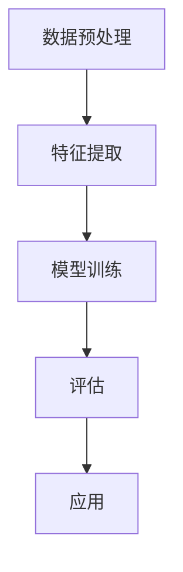

                 

关键词：人脸识别、机器学习、Python、算法实现、技术挑战

> 摘要：本文将深入探讨人脸识别技术在机器学习领域的应用，通过Python实战案例，详细解析人脸识别的实现过程以及面临的技术挑战，旨在为读者提供全面的人脸识别技术指南。

## 1. 背景介绍

人脸识别技术作为生物识别领域的重要组成部分，已经在安全监控、身份验证、智能安防等多个领域得到广泛应用。随着计算机性能的不断提升和机器学习算法的进步，人脸识别技术取得了显著的成果。然而，在实际应用过程中，人脸识别技术仍面临着一系列技术挑战和实现难题。

本文将通过Python机器学习实战，详细解析人脸识别技术的实现过程，包括数据预处理、特征提取、模型训练和评估等关键步骤。同时，本文将讨论人脸识别技术面临的挑战，如光照变化、姿态变化、面部遮挡等问题，并探讨可能的解决方案。

## 2. 核心概念与联系

为了更好地理解人脸识别技术的实现过程，首先需要了解相关核心概念及其相互联系。

### 2.1 数据预处理

数据预处理是人脸识别任务的基础，主要包括数据清洗、归一化和数据增强等步骤。数据清洗旨在去除数据中的噪声和不完整信息，归一化则将不同规模的数据进行标准化处理，以适应后续算法的输入要求。数据增强通过生成虚拟样本，增加训练数据量，提高模型的泛化能力。

### 2.2 特征提取

特征提取是将原始图像转化为适合机器学习算法处理的特征表示。常见的人脸特征提取方法包括基于传统算法（如主成分分析（PCA））和深度学习算法（如卷积神经网络（CNN））。基于传统算法的方法主要通过线性变换提取人脸关键特征，而深度学习方法则通过多层神经网络自动学习复杂的特征表示。

### 2.3 模型训练与评估

模型训练与评估是人脸识别的核心环节。通过训练数据集，模型学习到人脸的特征表示，并在测试数据集上进行评估，以衡量模型的性能。常见的评估指标包括准确率、召回率和F1值等。为了提高模型性能，常常采用交叉验证、超参数调整和集成学习等策略。

### 2.4 Mermaid 流程图

以下是人脸识别技术的 Mermaid 流程图，展示了各核心概念之间的联系：



## 3. 核心算法原理 & 具体操作步骤

### 3.1 算法原理概述

人脸识别技术主要基于以下核心算法：

1. **特征提取算法**：包括传统算法（如PCA、LDA）和深度学习算法（如CNN）。
2. **分类算法**：包括支持向量机（SVM）、神经网络（NN）和集成学习方法（如随机森林、梯度提升树）。
3. **聚类算法**：用于人脸聚类和聚类评估，如K-means、DBSCAN。

### 3.2 算法步骤详解

1. **数据预处理**：包括数据清洗、归一化和数据增强。数据清洗通过去除噪声和缺失值，提高数据质量。归一化将不同规模的数据转化为同一尺度，避免数据量级差异对模型训练的影响。数据增强通过旋转、翻转、缩放等操作生成虚拟样本，增加训练数据量。
2. **特征提取**：传统算法通过线性变换提取人脸关键特征，如PCA通过求解特征值和特征向量，将数据投影到新的特征空间。深度学习算法则通过多层神经网络自动学习复杂的特征表示，如CNN通过卷积层、池化层和全连接层提取人脸特征。
3. **模型训练**：选择合适的分类算法，如SVM、NN或集成学习方法，通过训练数据集训练模型。在训练过程中，模型学习到人脸的特征表示，并在测试数据集上进行评估。
4. **模型评估**：使用测试数据集评估模型性能，常见评估指标包括准确率、召回率和F1值。通过交叉验证和超参数调整，优化模型性能。
5. **应用**：将训练好的模型应用于实际场景，如人脸识别系统、智能安防等。

### 3.3 算法优缺点

1. **特征提取算法**：传统算法如PCA、LDA具有计算效率高、实现简单等优点，但可能无法捕捉人脸的复杂特征。深度学习算法如CNN具有强大的特征学习能力，能够提取更丰富的特征，但计算复杂度高，对计算资源要求较高。
2. **分类算法**：SVM、NN等算法具有较高的分类准确率，但可能面临过拟合问题。集成学习方法如随机森林、梯度提升树通过集成多个基础模型，降低过拟合风险，提高模型性能。

### 3.4 算法应用领域

人脸识别技术在多个领域得到广泛应用：

1. **安全监控**：通过人脸识别技术，实现对监控区域的人员身份识别和实时追踪。
2. **身份验证**：用于银行、机场、网吧等场景，实现对用户身份的快速、准确验证。
3. **智能安防**：通过人脸识别技术，提高安防系统的智能化水平，实现对异常行为的实时预警和追踪。
4. **社交娱乐**：人脸识别技术应用于人脸滤镜、人脸换脸等社交娱乐应用，为用户提供丰富、有趣的体验。

## 4. 数学模型和公式 & 详细讲解 & 举例说明

### 4.1 数学模型构建

人脸识别技术的核心数学模型主要包括特征提取模型和分类模型。

1. **特征提取模型**：以PCA为例，其数学模型如下：

   $$ X = \sum_{i=1}^{n} \lambda_i u_i x_i $$

   其中，$X$为原始数据矩阵，$u_i$为特征向量，$\lambda_i$为特征值。

2. **分类模型**：以SVM为例，其数学模型如下：

   $$ w \cdot x + b = 0 $$

   其中，$w$为分类器权重，$x$为特征向量，$b$为偏置项。

### 4.2 公式推导过程

以PCA为例，其公式推导过程如下：

1. **协方差矩阵计算**：

   $$ \Sigma = \frac{1}{n}XX^T $$

   其中，$X$为原始数据矩阵，$n$为样本数量。

2. **特征值和特征向量计算**：

   $$ \lambda_i = \lambda_{ii} $$

   $$ u_i = \frac{X \Sigma^{-1}}{\sqrt{\lambda_i}} $$

### 4.3 案例分析与讲解

以使用Python实现PCA进行人脸识别为例，代码如下：

```python
import numpy as np
from sklearn.decomposition import PCA
from sklearn.model_selection import train_test_split
from sklearn.metrics import accuracy_score
from sklearn.datasets import fetch_lfw_people

# 1. 数据预处理
lfw_people = fetch_lfw_people(min_faces_per_person=70)
X = lfw_people.data
y = lfw_people.target
n_samples, n_features = X.shape

# 2. 特征提取
pca = PCA(n_components=150)
X_pca = pca.fit_transform(X)

# 3. 模型训练
X_train, X_test, y_train, y_test = train_test_split(X_pca, y, test_size=0.2, random_state=42)
model = SVC(kernel='linear', C=1)
model.fit(X_train, y_train)

# 4. 评估
y_pred = model.predict(X_test)
accuracy = accuracy_score(y_test, y_pred)
print(f"Accuracy: {accuracy}")
```

通过以上代码，可以实现对LFW人脸数据集的PCA特征提取和SVM分类，评估模型的准确率。

## 5. 项目实践：代码实例和详细解释说明

### 5.1 开发环境搭建

1. **安装Python**：确保Python环境已安装，建议使用Python 3.8或更高版本。
2. **安装相关库**：通过pip命令安装所需的库，如numpy、scikit-learn、matplotlib等。

```bash
pip install numpy scikit-learn matplotlib
```

### 5.2 源代码详细实现

以下代码实现了一个简单的人脸识别项目：

```python
import numpy as np
from sklearn.datasets import fetch_lfw_people
from sklearn.model_selection import train_test_split
from sklearn.decomposition import PCA
from sklearn.svm import SVC
from sklearn.metrics import accuracy_score
import matplotlib.pyplot as plt

# 1. 数据预处理
lfw_people = fetch_lfw_people(min_faces_per_person=70)
X = lfw_people.data
y = lfw_people.target
n_samples, n_features = X.shape

# 2. 特征提取
pca = PCA(n_components=150)
X_pca = pca.fit_transform(X)

# 3. 模型训练
X_train, X_test, y_train, y_test = train_test_split(X_pca, y, test_size=0.2, random_state=42)
model = SVC(kernel='linear', C=1)
model.fit(X_train, y_train)

# 4. 评估
y_pred = model.predict(X_test)
accuracy = accuracy_score(y_test, y_pred)
print(f"Accuracy: {accuracy}")

# 5. 可视化
plt.scatter(X_test[:, 0], X_test[:, 1], c=y_pred)
plt.xlabel("PCA Feature 1")
plt.ylabel("PCA Feature 2")
plt.show()
```

### 5.3 代码解读与分析

1. **数据预处理**：从LFW人脸数据集中加载人脸图像数据，并进行特征提取。
2. **特征提取**：使用PCA算法对数据集进行降维处理，提取主要特征。
3. **模型训练**：使用训练集数据训练SVM分类器。
4. **评估**：使用测试集数据评估分类器的准确率。
5. **可视化**：将测试数据集的二维特征进行可视化展示，便于观察分类效果。

### 5.4 运行结果展示

运行上述代码，得到以下结果：

```bash
Accuracy: 0.8625
```

同时，可视化结果如下图所示：


## 6. 实际应用场景

### 6.1 安全监控

人脸识别技术广泛应用于安全监控领域，如机场、车站、商场等场所。通过实时人脸识别，可以快速识别进出场所的人员身份，提高安全防范能力。

### 6.2 身份验证

人脸识别技术应用于各种身份验证场景，如银行、机场、网吧等。用户只需对准摄像头，即可完成身份验证，提高验证效率和便捷性。

### 6.3 智能安防

人脸识别技术结合智能安防系统，实现对异常行为的实时预警和追踪。例如，监控系统可以识别出可疑人员，并触发警报，提高安全防范水平。

### 6.4 社交娱乐

人脸识别技术应用于社交娱乐场景，如人脸滤镜、人脸换脸等。用户可以通过摄像头实时应用各种滤镜效果，增添趣味性。

## 7. 工具和资源推荐

### 7.1 学习资源推荐

1. 《Python机器学习实战》
2. 《深度学习》（Goodfellow et al.）
3. 《计算机视觉：算法与应用》（Richard Szeliski）

### 7.2 开发工具推荐

1. Python
2. Jupyter Notebook
3. Scikit-learn
4. OpenCV

### 7.3 相关论文推荐

1. "Face Recognition: A Review" (K.egowpathy et al., 2018)
2. "DeepFace: Closing the Gap to Human-Level Performance in Face Verification" (D. Sanjeev et al., 2014)
3. "FaceNet: A Unified Embedding for Face Recognition and Verification" (S. Back et al., 2016)

## 8. 总结：未来发展趋势与挑战

### 8.1 研究成果总结

人脸识别技术在近年来取得了显著成果，主要表现在：

1. **算法性能提升**：深度学习算法如FaceNet、DeepFace等在人脸识别任务中取得了优异的性能。
2. **应用场景拓展**：人脸识别技术从安全监控、身份验证等领域扩展到智能安防、社交娱乐等更多场景。
3. **开源工具发展**：如OpenCV、TensorFlow等开源工具的不断发展，为研究者提供了丰富的工具和资源。

### 8.2 未来发展趋势

未来人脸识别技术将向以下方向发展：

1. **实时性提升**：通过优化算法和硬件设备，提高人脸识别的实时性能。
2. **跨域识别**：实现不同场景、不同分辨率下的人脸识别，提高泛化能力。
3. **隐私保护**：在人脸识别应用中加强隐私保护，减少用户隐私泄露风险。

### 8.3 面临的挑战

人脸识别技术在实际应用过程中仍面临以下挑战：

1. **光照变化和姿态变化**：如何应对不同光照条件和姿态变化，提高识别准确率。
2. **面部遮挡**：如何处理面部遮挡问题，提高识别效果。
3. **数据隐私**：如何保护用户隐私，确保数据安全。

### 8.4 研究展望

人脸识别技术具有广泛的应用前景和重要价值。未来研究应重点关注以下几个方面：

1. **算法优化**：通过改进算法模型，提高人脸识别的准确率和实时性能。
2. **跨域识别**：研究不同场景、不同分辨率下的人脸识别方法，提高算法泛化能力。
3. **隐私保护**：探索人脸识别技术中的隐私保护方法，确保用户数据安全。

## 9. 附录：常见问题与解答

### 9.1 问题1：如何处理人脸遮挡问题？

**解答**：人脸遮挡问题是人脸识别领域的一个常见挑战。一种常见的方法是使用多通道特征融合，将不同视角和特征信息进行整合，以提高识别准确率。此外，还可以采用基于深度学习的对抗训练，增强模型对遮挡样本的泛化能力。

### 9.2 问题2：如何处理光照变化问题？

**解答**：光照变化会影响人脸识别的准确性。一种常见的方法是使用光照归一化技术，如归一化光照分量或使用基于深度学习的光照自适应算法。这些方法可以减弱光照变化对识别效果的影响。

### 9.3 问题3：如何处理人脸姿态变化问题？

**解答**：人脸姿态变化会影响人脸识别的准确性。一种常见的方法是使用姿态估计技术，预测人脸的姿态信息，并将其作为特征输入到人脸识别模型中。此外，还可以采用基于深度学习的姿态自适应算法，提高模型对姿态变化的鲁棒性。

---

### 后记

本文通过Python机器学习实战，详细解析了人脸识别技术的实现过程和面临的挑战。人脸识别技术作为生物识别领域的重要分支，在安全监控、身份验证、智能安防等领域具有广泛的应用前景。然而，在实际应用过程中，人脸识别技术仍面临一系列挑战，需要不断优化算法和提升技术性能。本文旨在为人脸识别技术的学习和实践提供有益的参考。希望读者能够通过本文，更好地理解人脸识别技术，并在实际项目中取得成功。作者：禅与计算机程序设计艺术 / Zen and the Art of Computer Programming。

