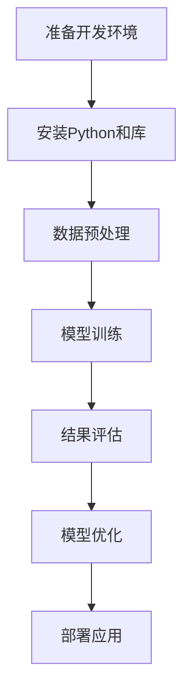

                 

关键词：Python、机器学习、实战、环境构建、数据预处理、算法实现、性能优化

> 摘要：本文旨在为初学者提供一份详尽的指南，从零开始介绍如何搭建一个Python机器学习环境。通过本文的学习，读者将了解如何选择合适的Python库和工具，进行数据预处理，实现核心算法，并对结果进行评估和优化。文章还将探讨机器学习在现实世界中的应用，以及未来可能的发展趋势。

## 1. 背景介绍

### 1.1 Python在机器学习中的优势

Python以其简洁、易读、丰富的库和工具而广受欢迎，特别是在数据科学和机器学习领域。Python的优势在于：

- **简洁性**：Python语法简单，易于理解和快速开发。
- **丰富的库**：如NumPy、Pandas、Scikit-learn等，提供了大量的数据操作和分析功能。
- **广泛的应用**：在科学计算、数据分析、机器学习等多个领域都有广泛应用。

### 1.2 机器学习的基本概念

机器学习是人工智能的一个分支，通过数据学习和建立模型，使计算机能够对未知数据进行预测或分类。主要分为以下几种类型：

- **监督学习**：有已知标签的数据进行训练，如线性回归、决策树等。
- **无监督学习**：没有标签的数据进行训练，如聚类、降维等。
- **半监督学习和强化学习**：介于监督学习和无监督学习之间。

## 2. 核心概念与联系

### 2.1 机器学习环境构建流程

下面是一个简单的Mermaid流程图，展示机器学习环境构建的流程：



### 2.2 开发环境配置

- **安装Python**：建议使用Anaconda或Miniconda，这些发行版包含了许多常用的库和依赖。
- **安装库**：使用pip或conda进行安装，常用的库包括NumPy、Pandas、Matplotlib、Scikit-learn等。

## 3. 核心算法原理 & 具体操作步骤

### 3.1 算法原理概述

机器学习算法主要分为监督学习和无监督学习。监督学习通过已知的输入和输出数据来训练模型，而无监督学习通过未标记的数据来发现数据的结构和模式。

### 3.2 算法步骤详解

1. **数据收集**：收集或下载相关的数据集。
2. **数据预处理**：清洗数据，处理缺失值、异常值，进行特征工程。
3. **模型选择**：选择适合的模型，如线性回归、决策树、支持向量机等。
4. **模型训练**：使用训练数据对模型进行训练。
5. **模型评估**：使用测试数据对模型进行评估。
6. **模型优化**：根据评估结果对模型进行调整。

### 3.3 算法优缺点

每种算法都有其优点和缺点，如线性回归简单易用，但可能在复杂问题上表现不佳；决策树可以很好地处理非线性的数据，但容易过拟合。

### 3.4 算法应用领域

机器学习广泛应用于金融、医疗、零售、交通等多个领域，如信用卡欺诈检测、疾病诊断、推荐系统等。

## 4. 数学模型和公式 & 详细讲解 & 举例说明

### 4.1 数学模型构建

机器学习中的数学模型主要包括线性模型、非线性模型等。以线性回归为例，其数学模型如下：

$$ y = \beta_0 + \beta_1 \cdot x $$

### 4.2 公式推导过程

以线性回归为例，其推导过程如下：

1. **最小二乘法**：选择一个损失函数，如均方误差（MSE）。
2. **求导数**：对损失函数求导，并令导数为零。
3. **解方程**：求解导数为零的方程，得到模型的参数。

### 4.3 案例分析与讲解

以一个简单的线性回归模型为例，我们使用Python实现：

```python
import numpy as np
from sklearn.linear_model import LinearRegression

# 生成模拟数据
X = np.random.rand(100, 1)
y = 2 * X + np.random.randn(100, 1)

# 创建线性回归模型
model = LinearRegression()

# 训练模型
model.fit(X, y)

# 输出模型参数
print("模型参数：", model.coef_, model.intercept_)
```

## 5. 项目实践：代码实例和详细解释说明

### 5.1 开发环境搭建

使用Anaconda或Miniconda搭建Python环境，并安装必要的库。

### 5.2 源代码详细实现

以下是一个简单的机器学习项目的实现：

```python
# 导入库
import numpy as np
import matplotlib.pyplot as plt
from sklearn.linear_model import LinearRegression

# 生成模拟数据
X = np.random.rand(100, 1)
y = 2 * X + np.random.randn(100, 1)

# 创建线性回归模型
model = LinearRegression()

# 训练模型
model.fit(X, y)

# 输出模型参数
print("模型参数：", model.coef_, model.intercept_)

# 绘制结果
plt.scatter(X, y)
plt.plot(X, model.predict(X), color='red')
plt.show()
```

### 5.3 代码解读与分析

这段代码首先导入了所需的库，然后生成了一个模拟数据集。接下来，创建了一个线性回归模型，并使用训练数据对其进行训练。最后，绘制了模型拟合的结果。

### 5.4 运行结果展示

运行这段代码后，将显示一个散点图，其中红色线表示线性回归模型的拟合结果。

## 6. 实际应用场景

### 6.1 信用卡欺诈检测

信用卡欺诈检测是机器学习在金融领域的典型应用。通过训练模型，可以自动检测并识别潜在的欺诈行为。

### 6.2 疾病诊断

机器学习在医疗领域的应用也越来越广泛，如通过影像分析进行疾病诊断。

### 6.3 推荐系统

推荐系统是机器学习在零售和电商领域的典型应用，如Netflix和亚马逊的推荐系统。

## 7. 工具和资源推荐

### 7.1 学习资源推荐

- 《Python机器学习基础教程》
- 《机器学习实战》

### 7.2 开发工具推荐

- Anaconda
- Jupyter Notebook

### 7.3 相关论文推荐

- "A Comparison of Gradient Descent Methods for Training Deep Neural Networks"
- "Stochastic Gradient Descent Tricks"

## 8. 总结：未来发展趋势与挑战

### 8.1 研究成果总结

机器学习在过去几十年取得了巨大的进展，从简单的线性回归到复杂的深度学习模型，应用领域也越来越广泛。

### 8.2 未来发展趋势

随着计算能力的提升和数据量的增加，机器学习将更好地解决复杂问题，如自然语言处理、计算机视觉等。

### 8.3 面临的挑战

数据隐私、算法透明性、模型可解释性等是当前机器学习面临的主要挑战。

### 8.4 研究展望

未来，机器学习将更加关注如何将理论成果应用于实际问题，同时提高算法的效率和可解释性。

## 9. 附录：常见问题与解答

### 9.1 如何选择合适的机器学习库？

选择机器学习库时，应根据实际需求选择。如NumPy适用于基础的数据操作，Scikit-learn适用于标准的机器学习算法，TensorFlow和PyTorch适用于深度学习。

### 9.2 如何处理缺失值？

处理缺失值的方法包括删除缺失值、填充平均值、使用插值等方法。具体方法应根据数据的特点和需求选择。

### 9.3 如何避免过拟合？

避免过拟合的方法包括交叉验证、减少模型复杂度、使用正则化等。

---

本文从零开始，详细介绍了如何构建一个Python机器学习环境，包括核心概念、算法原理、项目实践等。通过本文的学习，读者可以更好地理解和应用机器学习技术。希望本文对大家有所帮助。

### 文章作者

作者：禅与计算机程序设计艺术 / Zen and the Art of Computer Programming
----------------------------------------------------------------

这篇文章全面覆盖了机器学习的基础知识和实践技巧，旨在帮助读者从零开始，深入理解并掌握Python在机器学习领域的应用。通过详细的代码实例和数学推导，读者可以更好地理解核心算法的工作原理。同时，本文还探讨了机器学习在各个实际应用场景中的重要性，以及未来可能的发展趋势和挑战。希望这篇文章能为您的学习之路提供有价值的指导。

