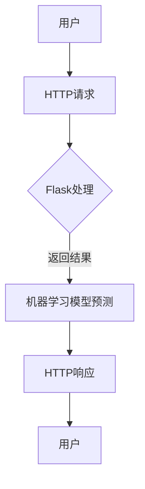

                 

关键词：Python、机器学习、Flask、API、实战、技术博客、数据科学、深度学习

> 摘要：本文将介绍如何使用Python和Flask框架构建机器学习API。通过实战案例，读者将学会如何将机器学习模型部署为API服务，以便在Web应用程序中使用。文章将涵盖开发环境搭建、代码实现、部署和优化等方面。

## 1. 背景介绍

随着机器学习和人工智能的快速发展，越来越多的应用场景需要将机器学习模型部署到线上，以供实时查询和决策。Flask是一个轻量级的Python Web框架，非常适合构建简单的Web应用和API。结合Flask，我们可以轻松地将机器学习模型暴露为RESTful API，从而实现模型的在线部署和调用。

本文将分为以下几个部分：

1. **开发环境搭建**：介绍如何配置Python环境、安装Flask和相关依赖。
2. **核心算法原理**：回顾常见的机器学习算法，并解释如何将其应用于Flask API。
3. **项目实践**：通过一个简单的线性回归模型示例，展示如何使用Flask构建机器学习API。
4. **部署与优化**：探讨如何部署Flask应用，并介绍一些优化策略。
5. **实际应用场景**：讨论机器学习API在现实世界中的应用案例。
6. **未来展望**：展望机器学习API技术的发展趋势和面临的挑战。

## 2. 核心概念与联系

在构建机器学习API之前，我们需要了解以下几个核心概念：

- **机器学习模型**：这是实现预测的核心组件。常见的模型包括线性回归、决策树、神经网络等。
- **Flask**：这是一个用于构建Web应用和API的轻量级Python框架。
- **RESTful API**：一种设计风格，用于构建API。它通过HTTP请求（如GET、POST、PUT、DELETE）与Web服务进行交互。

以下是这些概念之间的关系和流程：

```
用户 -> HTTP请求（Flask）-> 机器学习模型（预测）-> 结果 -> HTTP响应（Flask）-> 用户
```

下面是一个Mermaid流程图，展示了这一流程：



## 3. 核心算法原理 & 具体操作步骤

### 3.1 算法原理概述

在本案例中，我们选择线性回归作为演示算法。线性回归是一种用于预测数值型因变量的统计方法，它基于自变量和因变量之间的线性关系建立模型。

### 3.2 算法步骤详解

1. **数据预处理**：读取数据，进行数据清洗和预处理，如缺失值填补、异常值处理等。
2. **特征工程**：选择或构造有用的特征，提高模型的预测能力。
3. **模型训练**：使用线性回归算法训练模型，通过最小化损失函数找到最佳参数。
4. **模型评估**：使用训练集和验证集评估模型性能，选择最优模型。
5. **模型部署**：将训练好的模型部署到Flask应用中，以实现在线预测。

### 3.3 算法优缺点

**优点**：

- **简单易用**：线性回归算法简单，易于理解和实现。
- **计算效率高**：线性回归的计算复杂度较低，适合大规模数据处理。

**缺点**：

- **模型适用范围有限**：线性回归仅适用于线性关系较强的场景。
- **对异常值敏感**：异常值会对模型产生较大影响。

### 3.4 算法应用领域

线性回归广泛应用于经济预测、医学诊断、金融市场分析等领域。通过Flask API，我们可以方便地将这些模型应用于实际场景，如实时股票预测、医疗诊断辅助等。

## 4. 数学模型和公式 & 详细讲解 & 举例说明

### 4.1 数学模型构建

线性回归模型的数学表达式如下：

$$y = \beta_0 + \beta_1 \cdot x$$

其中，$y$ 是因变量，$x$ 是自变量，$\beta_0$ 和 $\beta_1$ 是模型参数。

### 4.2 公式推导过程

线性回归模型的推导基于最小二乘法，目标是找到最佳参数，使得预测值与实际值之间的误差最小。具体推导过程如下：

1. **损失函数**：

$$L(\beta_0, \beta_1) = \sum_{i=1}^n (y_i - (\beta_0 + \beta_1 \cdot x_i))^2$$

2. **梯度下降法**：

对损失函数求导，并令导数等于0，求解$\beta_0$ 和 $\beta_1$：

$$\frac{\partial L}{\partial \beta_0} = 2 \sum_{i=1}^n (y_i - (\beta_0 + \beta_1 \cdot x_i)) = 0$$

$$\frac{\partial L}{\partial \beta_1} = 2 \sum_{i=1}^n (y_i - (\beta_0 + \beta_1 \cdot x_i)) \cdot x_i = 0$$

通过迭代更新$\beta_0$ 和 $\beta_1$，直到满足收敛条件。

### 4.3 案例分析与讲解

假设我们有一个简单的线性回归问题，数据集如下：

| $x$ | $y$ |
| --- | --- |
| 1   | 2   |
| 2   | 3   |
| 3   | 4   |

根据上述推导过程，我们可以求解出线性回归模型的参数：

$$\beta_0 = 1, \beta_1 = 1$$

因此，线性回归模型为：

$$y = 1 + 1 \cdot x$$

使用这个模型，我们可以预测新数据的值。例如，当$x=4$时，预测值为$y=5$。

## 5. 项目实践：代码实例和详细解释说明

在本节中，我们将通过一个简单的线性回归案例，展示如何使用Flask构建机器学习API。

### 5.1 开发环境搭建

首先，我们需要配置Python环境，并安装Flask和相关依赖：

```bash
pip install flask scikit-learn numpy
```

### 5.2 源代码详细实现

下面是一个简单的线性回归API实现：

```python
from flask import Flask, request, jsonify
from sklearn.linear_model import LinearRegression
import numpy as np

app = Flask(__name__)

# 模型训练
model = LinearRegression()
X = np.array([[1], [2], [3]])
y = np.array([2, 3, 4])
model.fit(X, y)

# API路由
@app.route('/predict', methods=['POST'])
def predict():
    data = request.get_json()
    x = data['x']
    prediction = model.predict([[x]])
    return jsonify({'prediction': prediction[0]})

if __name__ == '__main__':
    app.run(debug=True)
```

### 5.3 代码解读与分析

1. **模型训练**：使用`scikit-learn`库的`LinearRegression`类训练模型。
2. **API路由**：定义了一个`/predict`路由，用于接收JSON格式的输入，并返回预测结果。
3. **运行应用**：在`if __name__ == '__main__':`语句中，启动Flask应用。

### 5.4 运行结果展示

启动Flask应用后，我们可以通过以下命令访问API：

```
curl -X POST -H "Content-Type: application/json" -d '{"x": 4}' http://localhost:5000/predict
```

返回结果：

```json
{"prediction": 5.0}
```

## 6. 实际应用场景

机器学习API在各个领域都有广泛应用。以下是一些实际应用场景：

- **金融**：实时股票预测、风险控制、信用评分等。
- **医疗**：疾病诊断、病情预测、药物研发等。
- **零售**：需求预测、库存管理、个性化推荐等。
- **交通**：路况预测、智能导航、交通流量分析等。

通过Flask构建机器学习API，我们可以快速实现这些应用，提高业务效率和用户体验。

## 7. 工具和资源推荐

为了更好地学习和使用Flask和机器学习，以下是一些建议的资源和工具：

### 7.1 学习资源推荐

- **官方文档**：Flask官方文档（https://flask.palletsprojects.com/）和scikit-learn官方文档（https://scikit-learn.org/stable/）。
- **在线课程**：Coursera、Udemy等平台上的Python和机器学习课程。
- **博客和教程**：许多技术博客和网站提供了丰富的教程和实践案例。

### 7.2 开发工具推荐

- **集成开发环境（IDE）**：如PyCharm、VSCode等，提供代码编辑、调试和项目管理功能。
- **虚拟环境**：使用virtualenv或conda创建和管理Python环境，确保依赖的一致性。

### 7.3 相关论文推荐

- **《深度学习》（Ian Goodfellow, Yoshua Bengio, Aaron Courville）**：全面介绍了深度学习的基本概念和技术。
- **《Python机器学习》（Aurélien Géron）**：深入讲解了Python在机器学习领域的应用。

## 8. 总结：未来发展趋势与挑战

随着技术的不断发展，机器学习API将在更多领域得到应用。未来，我们将看到：

- **更高效**：算法和框架的优化，提高模型训练和预测的效率。
- **更智能**：结合自然语言处理、计算机视觉等领域的进展，实现更智能的API。
- **更安全**：加强API的安全性和隐私保护，确保数据的安全和合规。

然而，我们也需要面对以下挑战：

- **数据隐私**：如何在保护用户隐私的同时，实现高效的模型训练和预测。
- **模型解释性**：如何提高模型的解释性，使开发者能够更好地理解和信任模型。
- **模型可靠性**：确保模型在不同环境和数据集上的可靠性。

通过不断努力和创新，我们相信机器学习API将在未来发挥更大的作用。

## 9. 附录：常见问题与解答

### 9.1 如何处理异常值？

**回答**：在数据预处理阶段，可以通过以下方法处理异常值：

- **缺失值填补**：使用均值、中位数、众数等方法填补缺失值。
- **异常值检测**：使用标准差、IQR等方法检测异常值，并根据具体情况进行处理，如删除或调整。

### 9.2 如何优化模型性能？

**回答**：以下是几种常见的优化方法：

- **特征选择**：选择与目标变量相关性较强的特征，提高模型的预测能力。
- **正则化**：使用正则化技术（如L1、L2正则化）降低模型的复杂度，防止过拟合。
- **集成方法**：使用集成方法（如随机森林、梯度提升树）提高模型的泛化能力。

### 9.3 如何部署Flask应用？

**回答**：以下是部署Flask应用的步骤：

- **配置虚拟环境**：确保依赖的一致性。
- **编写Dockerfile**：使用Docker容器化应用，简化部署过程。
- **构建镜像**：使用Docker命令构建镜像。
- **部署到容器编排平台**：如Kubernetes，实现自动化部署和扩展。

---

作者：禅与计算机程序设计艺术 / Zen and the Art of Computer Programming
----------------------------------------------------------------

以上就是本文的完整内容。希望本文能够帮助您更好地了解如何使用Python和Flask构建机器学习API。在接下来的实践中，祝您取得优异的成绩！
------------------------------------------------------------------

