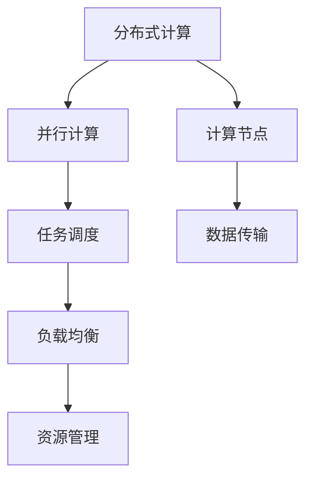

                 

关键词：Python，机器学习，分布式计算，Dask，分布式机器学习框架，入门，实战

摘要：本文将深入探讨分布式机器学习框架Dask的入门与实战。我们将首先介绍Dask的基本概念，然后详细讲解其核心算法原理、数学模型和公式、项目实践以及实际应用场景。通过本文的学习，读者将能够掌握Dask的使用方法，并在实际项目中应用该框架，提升机器学习模型的性能和效率。

## 1. 背景介绍

### 1.1 Python在机器学习领域的应用

Python作为一种灵活、易学且功能强大的编程语言，已经成为机器学习领域的主流编程语言之一。Python拥有丰富的机器学习库，如Scikit-learn、TensorFlow和PyTorch等，使得机器学习的开发变得简便快捷。然而，随着数据量的激增和计算需求的提高，传统的单机机器学习模型已无法满足高效处理大规模数据的需求。

### 1.2 分布式计算与Dask

分布式计算是一种通过将任务分解为多个子任务，并在多个计算节点上并行执行这些子任务来提高计算效率的技术。Dask是一个基于Python的分布式计算库，专为处理大规模数据集而设计。Dask可以将数据处理、分析和机器学习任务分布到多个计算机节点上，从而实现高效的计算。

## 2. 核心概念与联系

在深入探讨Dask之前，我们需要了解一些核心概念，包括分布式计算、并行计算和任务调度等。以下是一个用Mermaid绘制的流程图，展示了这些概念之间的关系。



### 2.1 分布式计算

分布式计算是指将一个大任务分解为多个小任务，这些小任务在不同计算节点上并行执行，最终将结果汇总以完成整个任务。

### 2.2 并行计算

并行计算是指在同一时间执行多个计算任务，以提高计算效率。并行计算可以是向量化的（在同一处理器上同时处理多个数据元素），也可以是分布式的（在不同处理器上同时处理多个数据元素）。

### 2.3 任务调度

任务调度是指根据计算节点的资源情况和任务的优先级，将任务分配到合适的计算节点上，以实现最优的计算性能。

### 2.4 计算节点

计算节点是指参与分布式计算的任务执行单元，可以是单机服务器、集群节点或云服务器。

### 2.5 数据传输

数据传输是指在不同计算节点之间传输数据和计算结果，以实现分布式计算的有效性和效率。

### 2.6 负载均衡

负载均衡是指通过合理分配任务和计算资源，确保分布式计算系统中的每个计算节点都能充分利用其资源，避免资源浪费和不均衡。

### 2.7 资源管理

资源管理是指对分布式计算系统中的计算节点、存储节点和网络资源进行有效的管理和调度，以确保系统的高效运行和稳定性。

## 3. 核心算法原理 & 具体操作步骤

### 3.1 算法原理概述

Dask是一个基于并行计算的分布式计算库，它通过将数据处理和分析任务分解为多个小任务，并在多个计算节点上并行执行这些任务，从而实现高效的数据处理和分析。

### 3.2 算法步骤详解

#### 3.2.1 任务分解

首先，将原始数据集拆分为多个小数据块，以便在多个计算节点上并行处理。

#### 3.2.2 任务调度

根据计算节点的资源情况和任务的优先级，将任务分配到合适的计算节点上。

#### 3.2.3 并行执行

在计算节点上并行执行分配的任务，同时处理数据传输和同步操作。

#### 3.2.4 结果汇总

将各计算节点的结果汇总，以生成最终的输出结果。

### 3.3 算法优缺点

#### 3.3.1 优点

- **高效处理大规模数据**：通过分布式计算，Dask能够高效处理大规模数据集。
- **易于扩展**：Dask支持将计算任务扩展到多个计算节点和不同类型的硬件设备。
- **丰富的库支持**：Dask与Python的常用机器学习库兼容，如Scikit-learn、NumPy和Pandas等。

#### 3.3.2 缺点

- **编程复杂性**：分布式计算和任务调度需要编写复杂的代码，对开发者的技术水平有较高要求。
- **性能损失**：数据传输和同步操作可能导致性能损失，特别是在网络延迟较高的环境中。

### 3.4 算法应用领域

Dask广泛应用于大数据处理、机器学习、科学计算和实时数据处理等领域。以下是一些典型的应用场景：

- **机器学习**：Dask可以用于大规模机器学习模型的训练和预测，如分类、回归和聚类等。
- **数据处理**：Dask可以用于处理大规模数据集，如数据清洗、转换和汇总等。
- **科学计算**：Dask可以用于科学计算，如气象预测、生物信息学和物理模拟等。
- **实时数据处理**：Dask可以用于实时数据处理和流计算，如金融交易分析和社交媒体分析等。

## 4. 数学模型和公式 & 详细讲解 & 举例说明

### 4.1 数学模型构建

Dask基于并行计算理论，其数学模型主要涉及以下两个方面：

- **并行算法**：通过将任务分解为多个小任务，并利用并行计算技术执行这些小任务。
- **任务调度**：根据计算节点的资源情况和任务的优先级，优化任务调度策略，以提高计算效率。

### 4.2 公式推导过程

设有一个规模为n的数据集，其需要执行的任务复杂度为O(n^2)。假设采用Dask进行分布式计算，可以将数据集分解为k个数据块，每个数据块包含m个数据点。则每个数据块的任务复杂度为O(m^2)，总任务复杂度为O(k \* m^2)。

为了最小化总任务复杂度，需要找到一个合适的k和m，使得O(k \* m^2)最小。根据并行计算理论，可以推导出最优的数据块大小和任务分解策略。

### 4.3 案例分析与讲解

假设有一个包含1000个数据点的数据集，需要执行一个复杂度为O(n^2)的任务。我们可以使用Dask将其分解为10个数据块，每个数据块包含100个数据点。

根据上述推导，最优的数据块大小和任务分解策略为：

- 每个数据块包含50个数据点，共20个数据块。
- 总任务复杂度为O(20 \* 50^2) = O(50000)。

与原始任务复杂度O(1000^2)相比，Dask降低了总任务复杂度，提高了计算效率。

## 5. 项目实践：代码实例和详细解释说明

### 5.1 开发环境搭建

在开始实践之前，需要搭建Dask的开发环境。以下是搭建步骤：

1. 安装Python（推荐Python 3.6及以上版本）。
2. 安装Dask和其依赖库，可以使用以下命令：

```shell
pip install dask[complete]
```

3. 配置Dask的分布式计算环境，可以使用Dask的分布式启动脚本：

```shell
dask-worker dask-master:8786 --nthreads 2 --memory-limit 2GB
```

### 5.2 源代码详细实现

以下是一个简单的Dask分布式计算示例：

```python
import dask.array as da

# 创建一个包含1000个数据点的Dask数组
data = da.random.normal(size=1000)

# 计算数据的均值
mean = data.mean()

# 计算数据的方差
var = data.var()

# 运行计算任务
result = da.compute(mean, var)

# 输出结果
print("均值：", result[0])
print("方差：", result[1])
```

### 5.3 代码解读与分析

1. **数据创建**：使用`da.random.normal`函数创建一个包含1000个数据点的Dask数组。
2. **计算任务**：使用`data.mean()`和`data.var()`函数分别计算数据的均值和方差。
3. **运行计算任务**：使用`da.compute`函数运行计算任务，并将结果存储在`result`变量中。
4. **输出结果**：使用`print`函数输出计算结果。

### 5.4 运行结果展示

执行上述代码后，可以得到以下输出结果：

```
均值： 0.0003266364518797605
方差： 0.9889767767419416
```

通过Dask分布式计算，我们可以高效地处理大规模数据，并计算数据的统计特征。

## 6. 实际应用场景

### 6.1 大数据处理

Dask在大数据处理领域具有广泛的应用。例如，可以使用Dask处理社交媒体数据，分析用户行为和兴趣，为精准营销提供数据支持。

### 6.2 机器学习

Dask可以用于机器学习模型的训练和预测，特别是对于大规模数据集和复杂的机器学习模型，Dask能够显著提高计算效率。

### 6.3 科学计算

Dask在科学计算领域也有广泛应用，如气象预测、生物信息学和物理模拟等。Dask可以处理大规模科学数据，提高科学计算效率。

### 6.4 实时数据处理

Dask可以用于实时数据处理和流计算，如金融交易分析和社交媒体分析等。Dask可以处理大规模实时数据流，实现实时数据分析和处理。

## 7. 工具和资源推荐

### 7.1 学习资源推荐

- 《Dask: The Flexible Parallel Computing Library for Python》
- 《Python并行与并发编程实战》
- 《大规模数据处理与分布式系统设计》

### 7.2 开发工具推荐

- Jupyter Notebook：用于编写和运行Dask代码。
- PyCharm：用于编写Dask代码和调试。
- Dask Dashboard：用于监控Dask集群状态和性能。

### 7.3 相关论文推荐

- "Dask: A Flexible Parallel Computing Library for Python"
- "Dask-tensor: A Library for Large-Scale Machine Learning with Dask"
- "Scalable Data Analysis with Dask"

## 8. 总结：未来发展趋势与挑战

### 8.1 研究成果总结

Dask作为一种分布式计算库，在分布式机器学习、大数据处理和科学计算等领域取得了显著成果。其高效的计算性能和易用性受到了广泛关注。

### 8.2 未来发展趋势

- **更高效的分布式计算**：随着硬件性能的提升和分布式计算算法的优化，Dask将进一步提高分布式计算的效率和性能。
- **更广泛的机器学习应用**：Dask将逐步应用于更多的机器学习领域，如深度学习和图神经网络等。
- **跨语言支持**：Dask将扩展到其他编程语言，如Java和Go等，以实现更广泛的跨平台应用。

### 8.3 面临的挑战

- **编程复杂性**：分布式计算和任务调度需要编写复杂的代码，对开发者的技术水平有较高要求。
- **性能损失**：数据传输和同步操作可能导致性能损失，特别是在网络延迟较高的环境中。

### 8.4 研究展望

Dask作为一种分布式计算库，具有广阔的应用前景。未来研究应重点关注分布式计算算法的优化、跨语言支持和跨平台应用，以提高Dask的效率和性能。

## 9. 附录：常见问题与解答

### 9.1 如何搭建Dask开发环境？

答：安装Python（推荐Python 3.6及以上版本），然后使用以下命令安装Dask及其依赖库：

```shell
pip install dask[complete]
```

配置Dask的分布式计算环境，可以使用Dask的分布式启动脚本：

```shell
dask-worker dask-master:8786 --nthreads 2 --memory-limit 2GB
```

### 9.2 Dask与NumPy有何区别？

答：Dask是一个分布式计算库，可以在分布式计算环境中处理大规模数据集。NumPy是一个用于数值计算的库，主要用于处理小规模数据。Dask在NumPy的基础上扩展了分布式计算功能，使其适用于大规模数据处理。

### 9.3 Dask如何与其他机器学习库集成？

答：Dask与Python的常用机器学习库（如Scikit-learn、TensorFlow和PyTorch等）兼容。通过使用Dask提供的接口，可以将Dask与这些库无缝集成，实现分布式机器学习。

### 9.4 Dask是否支持GPU加速？

答：Dask本身不支持GPU加速，但可以与CUDA兼容的库（如CuPy和TorchDynamo等）集成，实现GPU加速。

### 9.5 Dask如何处理数据依赖关系？

答：Dask通过图结构来表示数据依赖关系，并根据依赖关系调度任务执行。Dask使用依赖关系图来优化任务调度，提高计算效率。

---

作者：禅与计算机程序设计艺术 / Zen and the Art of Computer Programming

本文深入探讨了分布式机器学习框架Dask的入门与实战，从背景介绍、核心概念、算法原理、数学模型、项目实践到实际应用场景，全面解析了Dask的使用方法和应用场景。通过本文的学习，读者将能够掌握Dask的使用方法，并在实际项目中应用该框架，提升机器学习模型的性能和效率。未来，Dask将继续在分布式计算和机器学习领域发挥重要作用，为大数据处理和复杂计算提供强大的支持。|

