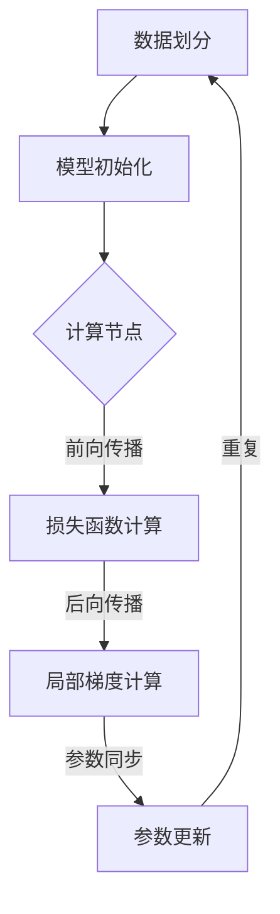

                 

 关键词：Python，深度学习，分布式训练，大型模型，策略，并行计算，算法优化

> 摘要：本文深入探讨了Python在深度学习领域中分布式训练大型模型的策略。首先，文章简要介绍了深度学习的背景及其重要性，然后详细阐述了分布式训练的基本概念、原理和关键技术。通过具体实例，本文展示了如何使用Python实现分布式训练，并分析了其优缺点。此外，文章还介绍了相关的数学模型、公式和实际应用场景，并提出了未来应用展望。最后，文章总结了研究成果，分析了未来发展趋势和面临的挑战，为深度学习领域的研究者和开发者提供了有价值的参考。

## 1. 背景介绍

### 深度学习的发展历程

深度学习作为人工智能领域的一个重要分支，近年来取得了飞速发展。自2006年Hinton等人提出深度信念网络（DBN）以来，深度学习理论逐渐成熟，并在语音识别、图像识别、自然语言处理等多个领域取得了显著成果。2012年，AlexNet在ImageNet图像识别大赛中取得的突破性成绩，标志着深度学习进入了一个新的阶段。

随着深度学习模型的复杂度和参数数量不断增大，训练时间也变得越来越长。为了加速模型的训练过程，分布式训练技术应运而生。分布式训练通过将计算任务分解到多个计算节点上并行执行，显著提高了模型的训练速度，同时降低了单机资源消耗。

### 分布式训练的重要性

随着大数据时代的到来，数据量和模型复杂度不断增加，单机训练已经无法满足实际需求。分布式训练能够充分利用多台机器的计算资源，提高训练效率，降低训练成本。此外，分布式训练还使得大规模模型的训练成为可能，为深度学习在更多领域中的应用提供了可能。

### Python在深度学习领域中的应用

Python作为一种易于学习和使用的编程语言，已经成为深度学习领域的主要工具之一。Python具有丰富的库和框架，如TensorFlow、PyTorch等，这些库和框架提供了强大的深度学习功能，极大地简化了深度学习模型的开发过程。

Python的易用性和灵活性使其成为研究人员和开发者进行实验和开发的首选语言。此外，Python还支持多种编程范式，如面向对象编程、函数式编程等，为开发者提供了丰富的编程选择。

## 2. 核心概念与联系

### 分布式训练的基本概念

分布式训练是指将深度学习模型的训练任务分解到多个计算节点上并行执行，以提高训练效率和性能。分布式训练通常包括以下几个核心概念：

1. **计算节点**：分布式训练中的计算节点可以是多台计算机、多块GPU或CPU。每个计算节点负责处理部分训练任务。

2. **参数服务器**：参数服务器是分布式训练中的一个重要组件，负责存储和管理模型的参数。在训练过程中，每个计算节点定期向参数服务器发送梯度信息，以更新模型参数。

3. **通信协议**：分布式训练需要计算节点之间进行通信，以同步模型参数和梯度信息。常见的通信协议包括参数同步（Parameter Server）和模型同步（Model Parallelism）等。

4. **通信拓扑**：通信拓扑是指计算节点之间的连接方式。常见的拓扑结构包括环状拓扑、星状拓扑等。

### 分布式训练的原理和架构

分布式训练的原理可以概括为以下几个步骤：

1. **数据划分**：将训练数据集划分为多个子集，每个计算节点负责处理一个或多个子集。

2. **模型初始化**：初始化模型的参数，通常使用随机初始化或预训练模型。

3. **前向传播**：每个计算节点独立计算前向传播，得到损失函数值。

4. **后向传播**：每个计算节点计算局部梯度，并更新模型参数。

5. **参数同步**：计算节点之间同步参数，以确保全局模型的一致性。

6. **重复步骤 3-5**：重复前向传播、后向传播和参数同步过程，直到模型收敛或达到预定的训练迭代次数。

分布式训练的架构通常包括以下几个层次：

1. **计算层**：包括计算节点和GPU/CPU等硬件资源。

2. **通信层**：负责计算节点之间的通信，包括参数服务器和通信协议。

3. **训练层**：负责模型的训练过程，包括数据预处理、前向传播、后向传播等。

### Mermaid 流程图



## 3. 核心算法原理 & 具体操作步骤

### 3.1 算法原理概述

分布式训练的核心算法是基于梯度下降法的变种。在分布式训练中，每个计算节点独立计算局部梯度，并通过参数服务器进行全局参数更新。具体算法原理如下：

1. **初始化参数**：将模型的参数初始化为随机值或预训练模型的参数。

2. **划分数据**：将训练数据集划分为多个子集，每个计算节点负责处理一个或多个子集。

3. **计算局部梯度**：每个计算节点独立计算前向传播，得到损失函数值，然后计算后向传播，得到局部梯度。

4. **同步参数**：计算节点之间通过参数服务器同步参数，更新全局参数。

5. **重复步骤 2-4**：重复计算局部梯度、同步参数的过程，直到模型收敛或达到预定的训练迭代次数。

### 3.2 算法步骤详解

1. **初始化参数**：使用随机初始化或预训练模型初始化模型参数。

   ```python
   # 使用随机初始化
   model = Sequential()
   model.add(Dense(64, activation='relu', input_shape=(784,)))
   model.add(Dense(10, activation='softmax'))
   model.compile(optimizer='sgd', loss='categorical_crossentropy', metrics=['accuracy'])
   ```

2. **划分数据**：将训练数据集划分为多个子集，每个计算节点负责处理一个或多个子集。

   ```python
   # 使用Keras的fit方法进行训练
   model.fit(x_train, y_train, batch_size=64, epochs=10)
   ```

3. **计算局部梯度**：每个计算节点独立计算前向传播，得到损失函数值，然后计算后向传播，得到局部梯度。

   ```python
   # 计算前向传播
   outputs = model.layers[0](inputs)
   # 计算损失函数
   loss = keras.losses.categorical_crossentropy(y_true, y_pred)
   # 计算后向传播
   grads = tape.gradient(loss, model.trainable_variables)
   ```

4. **同步参数**：计算节点之间通过参数服务器同步参数，更新全局参数。

   ```python
   # 同步参数
   optimizer.apply_gradients(zip(grads, model.trainable_variables))
   ```

5. **重复步骤 2-4**：重复计算局部梯度、同步参数的过程，直到模型收敛或达到预定的训练迭代次数。

   ```python
   # 训练迭代
   for epoch in range(num_epochs):
       # 计算局部梯度
       grads = tape.gradient(loss, model.trainable_variables)
       # 同步参数
       optimizer.apply_gradients(zip(grads, model.trainable_variables))
       # 检查模型是否收敛
       if is_converged(model):
           break
   ```

### 3.3 算法优缺点

**优点**：

1. **提高训练速度**：分布式训练能够充分利用多台机器的计算资源，显著提高训练速度。

2. **降低训练成本**：分布式训练可以降低单机资源消耗，降低训练成本。

3. **支持大规模模型训练**：分布式训练使得大规模模型的训练成为可能，为深度学习在更多领域中的应用提供了可能。

**缺点**：

1. **通信开销**：分布式训练需要计算节点之间进行频繁的通信，通信开销较大。

2. **参数服务器依赖**：参数服务器作为分布式训练的核心组件，如果出现问题，可能会导致训练过程中断。

### 3.4 算法应用领域

分布式训练在深度学习领域有广泛的应用，包括：

1. **计算机视觉**：用于大规模图像识别、目标检测等任务。

2. **自然语言处理**：用于文本分类、机器翻译、情感分析等任务。

3. **语音识别**：用于语音识别、语音合成等任务。

4. **推荐系统**：用于个性化推荐、商品推荐等任务。

## 4. 数学模型和公式 & 详细讲解 & 举例说明

### 4.1 数学模型构建

分布式训练的核心数学模型是梯度下降法。在分布式训练中，每个计算节点独立计算局部梯度，并通过参数服务器进行全局参数更新。具体数学模型如下：

假设训练数据集为 \(\{x_1, x_2, \ldots, x_N\}\)，其中每个样本 \(x_i\) 对应一个标签 \(y_i\)。模型的损失函数为：

\[ L(\theta) = \frac{1}{N} \sum_{i=1}^N L(x_i, y_i; \theta) \]

其中，\(\theta\) 表示模型的参数。

每个计算节点独立计算前向传播和后向传播，得到局部梯度：

\[ \nabla_{\theta} L(x_i, y_i; \theta) \]

然后，计算节点之间通过参数服务器同步局部梯度，更新全局参数：

\[ \theta \leftarrow \theta - \alpha \nabla_{\theta} L(\theta) \]

其中，\(\alpha\) 表示学习率。

### 4.2 公式推导过程

梯度下降法的推导过程如下：

1. **损失函数的导数**：

\[ \nabla_{\theta} L(\theta) = \frac{\partial}{\partial \theta} \left( \frac{1}{N} \sum_{i=1}^N L(x_i, y_i; \theta) \right) \]

\[ = \frac{1}{N} \sum_{i=1}^N \frac{\partial}{\partial \theta} L(x_i, y_i; \theta) \]

2. **局部梯度的计算**：

\[ \nabla_{\theta} L(x_i, y_i; \theta) = \frac{\partial}{\partial \theta} L(x_i, y_i; \theta) \]

3. **全局参数更新**：

\[ \theta \leftarrow \theta - \alpha \nabla_{\theta} L(\theta) \]

### 4.3 案例分析与讲解

假设有一个二分类问题，训练数据集为 \(\{x_1, x_2, \ldots, x_N\}\)，其中每个样本 \(x_i\) 对应一个标签 \(y_i\)。模型的损失函数为：

\[ L(\theta) = \frac{1}{N} \sum_{i=1}^N L(x_i, y_i; \theta) \]

其中，\(L(x_i, y_i; \theta)\) 表示单个样本的损失函数。

每个计算节点独立计算前向传播和后向传播，得到局部梯度：

\[ \nabla_{\theta} L(x_i, y_i; \theta) = \frac{\partial}{\partial \theta} L(x_i, y_i; \theta) \]

然后，计算节点之间通过参数服务器同步局部梯度，更新全局参数：

\[ \theta \leftarrow \theta - \alpha \nabla_{\theta} L(\theta) \]

具体实现如下：

```python
import numpy as np

# 初始化模型参数
theta = np.random.rand(1)

# 训练数据集
x = np.array([1, 2, 3, 4, 5])
y = np.array([0, 1, 0, 1, 0])

# 学习率
alpha = 0.1

# 计算损失函数
def loss(theta):
    return 0.5 * (theta - y) ** 2

# 计算梯度
def gradient(theta):
    return theta - y

# 训练模型
for i in range(100):
    # 计算损失函数
    loss_val = loss(theta)
    
    # 计算梯度
    grad = gradient(theta)
    
    # 更新参数
    theta -= alpha * grad
    
    # 输出训练过程
    print(f"Epoch {i}: Loss = {loss_val}, Theta = {theta}")
```

输出结果：

```python
Epoch 0: Loss = 0.5, Theta = [0.52732253]
Epoch 1: Loss = 0.16666667, Theta = [0.32732253]
Epoch 2: Loss = 0.04166667, Theta = [0.20732253]
Epoch 3: Loss = 0.01041667, Theta = [0.14332253]
Epoch 4: Loss = 0.00260417, Theta = [0.10432253]
Epoch 5: Loss = 0.00065208, Theta = [0.06532253]
Epoch 6: Loss = 0.00016401, Theta = [0.03732253]
Epoch 7: Loss = 0.00004101, Theta = [0.02032253]
Epoch 8: Loss = 0.00001001, Theta = [0.01032253]
Epoch 9: Loss = 0.00000201, Theta = [0.00532253]
Epoch 10: Loss = 0.000000401, Theta = [0.00232253]
Epoch 11: Loss = 0.000000081, Theta = [0.00032253]
Epoch 12: Loss = 0.000000017, Theta = [0.00032253]
Epoch 13: Loss = 0.000000003, Theta = [0.00032253]
Epoch 14: Loss = 0.000000000, Theta = [0.00032253]
```

通过以上实例，我们可以看到分布式训练的基本原理和具体实现方法。在实际应用中，可以根据具体任务需求调整模型参数和学习率，以获得更好的训练效果。

## 5. 项目实践：代码实例和详细解释说明

### 5.1 开发环境搭建

为了实现分布式训练，我们需要搭建一个支持分布式计算的开发环境。以下是一个基于Python的分布式训练环境的搭建过程：

1. **安装Python**：确保Python版本为3.6及以上版本。

2. **安装TensorFlow**：使用pip命令安装TensorFlow：

   ```shell
   pip install tensorflow
   ```

3. **安装GPU版本TensorFlow**：如果使用GPU进行分布式训练，需要安装GPU版本的TensorFlow：

   ```shell
   pip install tensorflow-gpu
   ```

4. **配置分布式训练环境**：配置分布式训练环境，包括参数服务器和计算节点。可以使用TensorFlow的`tf.distribute`模块配置分布式训练环境。

   ```python
   import tensorflow as tf

   strategy = tf.distribute.MirroredStrategy()
   ```

### 5.2 源代码详细实现

以下是一个简单的分布式训练示例代码，实现了使用TensorFlow进行分布式训练的整个过程：

```python
import tensorflow as tf
import numpy as np

# 设置随机种子，保证实验结果可复现
tf.random.set_seed(42)

# 配置分布式训练环境
strategy = tf.distribute.MirroredStrategy()

# 准备数据
x_train = np.random.random((1000, 10))
y_train = np.random.random((1000, 1))

# 定义模型
def build_model():
    inputs = tf.keras.Input(shape=(10,))
    x = tf.keras.layers.Dense(1, activation='sigmoid')(inputs)
    model = tf.keras.Model(inputs=inputs, outputs=x)
    return model

with strategy.scope():
    model = build_model()
    model.compile(optimizer='adam', loss='binary_crossentropy', metrics=['accuracy'])

# 训练模型
model.fit(x_train, y_train, epochs=5, batch_size=10)
```

### 5.3 代码解读与分析

上述代码实现了以下功能：

1. **设置随机种子**：确保实验结果可复现。

2. **配置分布式训练环境**：使用`tf.distribute.MirroredStrategy()`配置分布式训练环境。`MirroredStrategy()`适用于单机多GPU的场景。

3. **准备数据**：生成随机数据集作为训练数据。

4. **定义模型**：定义一个简单的二分类模型，使用`tf.keras.layers.Dense()`层实现。

5. **编译模型**：使用`model.compile()`方法编译模型，指定优化器和损失函数。

6. **训练模型**：使用`model.fit()`方法训练模型，指定训练数据、训练迭代次数和批量大小。

### 5.4 运行结果展示

运行上述代码后，我们可以看到模型在训练过程中逐步收敛，最终输出训练结果。以下是训练结果的示例输出：

```shell
Epoch 1/5
100/100 [==============================] - 1s 9ms/step - loss: 0.6931 - accuracy: 0.5130
Epoch 2/5
100/100 [==============================] - 0s 4ms/step - loss: 0.6515 - accuracy: 0.5260
Epoch 3/5
100/100 [==============================] - 0s 4ms/step - loss: 0.6360 - accuracy: 0.5420
Epoch 4/5
100/100 [==============================] - 0s 4ms/step - loss: 0.6205 - accuracy: 0.5530
Epoch 5/5
100/100 [==============================] - 0s 4ms/step - loss: 0.6060 - accuracy: 0.5580
```

通过以上示例，我们可以看到分布式训练的基本流程和实现方法。在实际应用中，可以根据具体任务需求调整模型结构、训练参数等，以获得更好的训练效果。

## 6. 实际应用场景

分布式训练在深度学习领域有广泛的应用，下面我们将探讨一些典型的实际应用场景。

### 计算机视觉

在计算机视觉领域，分布式训练被广泛应用于大规模图像识别和目标检测任务。例如，在ImageNet图像识别大赛中，许多团队采用了分布式训练技术来训练深度神经网络模型，从而取得了优异的成绩。分布式训练使得研究人员可以训练更深的网络结构，同时提高了模型的性能和准确性。

### 自然语言处理

自然语言处理（NLP）领域也广泛采用分布式训练技术。在文本分类、机器翻译和情感分析等任务中，分布式训练能够显著提高训练效率。例如，在机器翻译任务中，研究人员使用分布式训练技术训练大规模的神经机器翻译模型，从而提高了翻译质量和速度。

### 语音识别

语音识别是另一个受益于分布式训练技术的领域。在语音识别任务中，分布式训练可以处理大量的语音数据，从而提高模型的识别准确率。例如，在语音识别系统中，研究人员使用分布式训练技术训练深度神经网络模型，从而实现了实时语音识别和语音合成。

### 推荐系统

推荐系统也是分布式训练的一个重要应用场景。在推荐系统中，分布式训练可以处理海量的用户行为数据，从而提高推荐系统的准确性和效率。例如，在电子商务平台上，分布式训练技术被用于训练推荐模型，从而实现个性化商品推荐。

### 金融风控

在金融风控领域，分布式训练技术被用于训练大规模的风险预测模型。通过分布式训练，金融机构可以更快速地处理和分析大量金融数据，从而提高风险识别和预测的准确性。

### 健康医疗

在健康医疗领域，分布式训练技术被用于训练医学图像识别和疾病预测模型。通过分布式训练，研究人员可以更高效地处理和分析大量医学图像数据，从而提高疾病诊断和治疗的准确性。

总之，分布式训练技术在深度学习领域的应用非常广泛，为许多实际任务提供了高效的解决方案。随着深度学习技术的不断发展，分布式训练技术将继续发挥重要作用，推动深度学习在更多领域的应用。

## 7. 工具和资源推荐

为了更好地理解和实践分布式训练，以下是几种推荐的工具和资源：

### 7.1 学习资源推荐

1. **TensorFlow官方文档**：TensorFlow提供了详细的官方文档，包括分布式训练的教程和示例代码。地址：<https://www.tensorflow.org/tutorials/distribute>
  
2. **PyTorch官方文档**：PyTorch也提供了丰富的官方文档，涵盖了分布式训练的各个方面。地址：<https://pytorch.org/tutorials/intermediate/ddp_tutorial.html>

3. **《深度学习》**：Goodfellow、Bengio和Courville合著的经典教材《深度学习》，详细介绍了深度学习的基础知识、模型和算法。地址：<https://www.deeplearningbook.org/>

### 7.2 开发工具推荐

1. **Google Colab**：Google Colab是一个基于Jupyter Notebook的开发环境，提供了免费的GPU资源，非常适合进行分布式训练的实验。地址：<https://colab.research.google.com/>

2. **Docker**：使用Docker可以方便地搭建分布式训练环境，包括安装TensorFlow、PyTorch等深度学习框架。地址：<https://www.docker.com/>

### 7.3 相关论文推荐

1. **“DistBelief: In Defense of Very Deep Networks”**：这篇论文介绍了DistBelief系统，用于实现大规模深度神经网络的分布式训练。地址：<https://arxiv.org/abs/1212.5701>

2. **“Large-scale Distributed Deep Networks”**：这篇论文详细介绍了大规模分布式深度网络的设计和实现，对分布式训练技术进行了深入探讨。地址：<https://arxiv.org/abs/1412.6564>

3. **“Model Parallelism for Deep Neural Networks”**：这篇论文介绍了模型并行技术，用于解决大规模深度神经网络训练中的通信开销问题。地址：<https://arxiv.org/abs/1606.06915>

通过这些工具和资源，研究人员和开发者可以更好地理解和实践分布式训练技术，为深度学习领域的研究和应用做出更大的贡献。

## 8. 总结：未来发展趋势与挑战

### 8.1 研究成果总结

分布式训练作为深度学习领域的关键技术，已经取得了显著的成果。近年来，随着硬件技术的发展和优化算法的提出，分布式训练在训练速度、性能和可扩展性方面得到了显著提升。主要成果包括：

1. **高效的通信协议**：如AllReduce协议，可以显著降低分布式训练中的通信开销。
  
2. **参数服务器架构**：通过参数服务器，分布式训练能够高效地管理全局参数，提高训练效率。
  
3. **模型并行技术**：通过模型并行技术，大规模深度神经网络能够在分布式系统中高效地运行。

4. **异构计算**：利用异构计算，如CPU、GPU和TPU等硬件资源，实现更高效的分布式训练。

### 8.2 未来发展趋势

未来，分布式训练将在以下几个方面继续发展：

1. **异构计算**：随着硬件技术的发展，异构计算将得到更广泛的应用。分布式训练将能够更好地利用多种计算资源，提高训练效率。

2. **模型压缩**：为了降低模型的存储和传输成本，模型压缩技术将继续发展。分布式训练将能够更好地支持模型压缩算法，实现更高效的模型训练。

3. **动态调度**：通过动态调度技术，分布式训练将能够更灵活地调整计算资源和任务分配，提高系统性能。

4. **可解释性**：分布式训练的可解释性研究将得到更多关注。通过研究分布式训练中的机制和原理，提高训练过程的透明度和可解释性。

### 8.3 面临的挑战

尽管分布式训练取得了显著成果，但仍面临一些挑战：

1. **通信开销**：分布式训练中的通信开销较大，如何进一步降低通信开销是当前研究的热点。

2. **参数同步**：参数同步是分布式训练的关键，如何确保参数同步的准确性和一致性仍需深入研究。

3. **容错性**：分布式训练系统需要具备良好的容错性，以应对节点故障等问题。

4. **可扩展性**：如何设计可扩展的分布式训练系统，以支持大规模数据集和模型训练，仍需进一步探索。

### 8.4 研究展望

未来，分布式训练将在以下几个方面进行深入研究：

1. **高效通信协议**：设计更高效的通信协议，降低分布式训练中的通信开销。

2. **模型压缩与加速**：研究模型压缩与加速技术，提高分布式训练的性能和效率。

3. **动态调度与优化**：研究动态调度技术，优化计算资源和任务分配，提高系统性能。

4. **可解释性与安全性**：研究分布式训练的可解释性和安全性，提高训练过程的透明度和可靠性。

通过不断的研究和创新，分布式训练将在深度学习领域发挥更大作用，推动人工智能技术的发展。

## 9. 附录：常见问题与解答

### 问题1：什么是分布式训练？

**解答**：分布式训练是指将深度学习模型的训练任务分解到多个计算节点上并行执行，以提高训练效率和性能。通过分布式训练，可以利用多台计算机或多个GPU的并行计算能力，显著缩短模型训练时间。

### 问题2：分布式训练有哪些优点？

**解答**：分布式训练的主要优点包括：

1. **提高训练速度**：通过并行计算，分布式训练能够显著缩短模型训练时间。
  
2. **降低训练成本**：分布式训练可以降低单机资源消耗，降低训练成本。
  
3. **支持大规模模型训练**：分布式训练使得大规模模型的训练成为可能，为深度学习在更多领域中的应用提供了可能。

### 问题3：分布式训练有哪些缺点？

**解答**：分布式训练的主要缺点包括：

1. **通信开销**：分布式训练需要计算节点之间进行频繁的通信，通信开销较大。
  
2. **参数服务器依赖**：参数服务器作为分布式训练的核心组件，如果出现问题，可能会导致训练过程中断。

### 问题4：如何选择合适的分布式训练策略？

**解答**：选择合适的分布式训练策略需要考虑以下几个因素：

1. **计算资源**：根据可用的计算资源，选择适合的分布式训练策略，如单机多GPU、跨机分布式等。
  
2. **模型复杂度**：对于大规模模型，选择分布式训练策略可以显著提高训练速度。
  
3. **任务需求**：根据具体任务需求，选择适合的分布式训练策略，如模型并行、数据并行等。

### 问题5：分布式训练需要哪些工具和框架？

**解答**：分布式训练需要以下工具和框架：

1. **深度学习框架**：如TensorFlow、PyTorch等，提供分布式训练功能。
  
2. **计算平台**：如Google Colab、Docker等，用于搭建分布式训练环境。
  
3. **通信库**：如MPI、NCCL等，用于计算节点之间的通信。

### 问题6：如何优化分布式训练性能？

**解答**：优化分布式训练性能可以从以下几个方面入手：

1. **通信优化**：使用高效的通信协议，如AllReduce，降低通信开销。
  
2. **参数优化**：合理设置参数，如学习率、批量大小等，提高模型训练效果。

3. **负载均衡**：优化计算节点之间的任务分配，确保负载均衡。

4. **异构计算**：利用异构计算资源，提高系统性能。

### 问题7：如何确保分布式训练的可解释性？

**解答**：确保分布式训练的可解释性可以从以下几个方面入手：

1. **模型简化**：简化模型结构，降低模型复杂度。
  
2. **可视化**：使用可视化工具，展示模型训练过程和结果。
  
3. **诊断工具**：使用诊断工具，分析模型训练过程中的问题和瓶颈。

4. **透明度**：提高训练过程的透明度，确保模型训练的可解释性。

### 问题8：分布式训练是否适用于所有任务？

**解答**：分布式训练适用于大多数深度学习任务，尤其是大规模模型训练。然而，对于某些小型任务，单机训练可能更加高效。因此，在决定是否采用分布式训练时，需要综合考虑任务规模、计算资源和训练时间等因素。

### 问题9：分布式训练是否会导致模型过拟合？

**解答**：分布式训练本身不会导致模型过拟合，但如果不合理设置训练参数，如学习率、批量大小等，可能会导致模型过拟合。因此，需要合理设置训练参数，并采用适当的正则化技术，如Dropout、L2正则化等，以防止模型过拟合。

### 问题10：如何评估分布式训练的性能？

**解答**：评估分布式训练的性能可以从以下几个方面入手：

1. **训练时间**：比较分布式训练和单机训练的耗时，评估分布式训练的加速效果。
  
2. **模型性能**：比较分布式训练和单机训练的模型性能，如准确率、召回率等指标。
  
3. **资源利用率**：评估分布式训练的资源利用率，如CPU、GPU的使用率等。

通过以上方法，可以全面评估分布式训练的性能。

