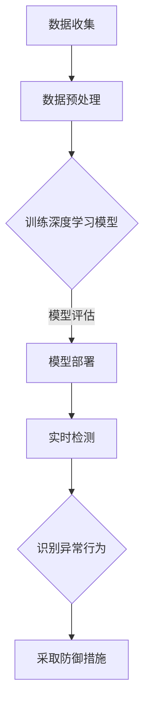

                 

 

## 1. 背景介绍

在网络时代，网络安全问题日益突出，网络攻击手段也日趋复杂多样。传统的基于规则的防御方法在面对不断演变的攻击方式时显得力不从心。因此，将人工智能，特别是深度学习技术引入网络安全领域，成为一种新的趋势。深度学习以其强大的特征学习和模式识别能力，可以在大量数据中自动提取有价值的信息，从而帮助识别和抵御网络攻击。

Python作为一门简单易学、功能强大的编程语言，在深度学习领域有着广泛的应用。它拥有丰富的深度学习库，如TensorFlow、PyTorch等，使得深度学习模型的开发和部署变得更加简单和高效。本文将介绍如何使用Python和深度学习技术来抵御网络攻击，包括网络入侵检测、恶意软件识别、垃圾邮件过滤等具体应用场景。

## 2. 核心概念与联系

### 2.1 深度学习的基本概念

深度学习（Deep Learning）是机器学习的一个子领域，它模仿人脑的工作方式，通过多层神经网络进行数据的学习和特征提取。深度学习的核心是神经网络（Neural Networks），特别是多层感知机（Multilayer Perceptrons，MLP）和卷积神经网络（Convolutional Neural Networks，CNN）。

神经网络由多个神经元（或节点）组成，每个神经元接收来自其他神经元的输入，并通过一个加权函数进行处理，最后输出结果。多层神经网络通过层层叠加的方式，使得模型能够学习到更高级别的特征表示。

卷积神经网络是一种特殊的神经网络，它特别适合处理图像和时序数据。CNN通过卷积层（Convolutional Layers）、池化层（Pooling Layers）、全连接层（Fully Connected Layers）等结构，实现了对数据的逐层特征提取。

### 2.2 深度学习与网络安全的联系

深度学习在网络安全中的应用主要体现在以下几个方面：

1. **入侵检测（Intrusion Detection）**：使用深度学习模型对网络流量进行分析，识别潜在的入侵行为。
2. **恶意软件识别（Malware Detection）**：通过分析恶意软件的代码或行为特征，使用深度学习模型进行识别和分类。
3. **垃圾邮件过滤（Spam Filtering）**：利用深度学习模型对电子邮件的内容和特征进行分析，区分垃圾邮件和正常邮件。

深度学习模型在网络攻击防御中的核心作用在于其强大的特征提取和模式识别能力。通过对大量网络数据的训练，深度学习模型可以自动学习到网络行为的正常模式和异常模式，从而提高防御网络攻击的能力。

### 2.3 Mermaid 流程图

下面是一个简化的Mermaid流程图，展示了深度学习在网络安全中的应用流程：



### 2.4  核心概念原理和架构

#### 2.4.1 数据收集

数据收集是深度学习模型训练的基础。在网络攻击防御中，我们需要收集大量的网络流量数据、恶意软件样本数据、正常邮件数据等。这些数据可以来自于网络设备、安全传感器、恶意软件数据库等。

#### 2.4.2 数据预处理

收集到的数据需要进行预处理，包括数据清洗、数据格式化、特征提取等步骤。预处理后的数据将作为深度学习模型的输入。

#### 2.4.3 训练深度学习模型

使用预处理后的数据，通过训练算法（如梯度下降、反向传播等）来训练深度学习模型。训练过程包括前向传播、损失函数计算、反向传播等步骤。

#### 2.4.4 模型评估

通过测试集来评估深度学习模型的性能，包括准确率、召回率、F1值等指标。根据评估结果调整模型参数，以提高模型性能。

#### 2.4.5 模型部署

将训练好的模型部署到生产环境中，进行实时检测和异常行为识别。

#### 2.4.6 实时检测和防御

部署后的模型将实时分析网络流量、邮件内容等，识别潜在的异常行为，并采取相应的防御措施，如阻断恶意流量、隔离恶意软件等。

---

在本文接下来的部分，我们将详细探讨核心算法原理、数学模型和公式、项目实践、实际应用场景以及未来展望等内容。希望这些内容能够帮助您更好地理解如何使用深度学习技术来抵御网络攻击。

---

## 3. 核心算法原理 & 具体操作步骤

### 3.1 算法原理概述

深度学习在网络安全中的核心算法主要包括卷积神经网络（CNN）、循环神经网络（RNN）和自编码器（Autoencoder）。这些算法各有特点，适用于不同的网络安全任务。

#### 3.1.1 卷积神经网络（CNN）

CNN特别适合处理图像和时序数据。在入侵检测和恶意软件识别中，CNN可以通过卷积层提取网络流量或恶意软件样本的底层特征，通过池化层减少数据维度，并通过全连接层进行分类。

#### 3.1.2 循环神经网络（RNN）

RNN适合处理序列数据，如时间序列数据和日志数据。在入侵检测中，RNN可以通过其递归结构学习到时间序列数据的动态特征，从而识别入侵行为。

#### 3.1.3 自编码器（Autoencoder）

自编码器是一种无监督学习算法，可以通过训练自动学习到数据的低维表示。在垃圾邮件过滤中，自编码器可以学习到正常邮件和垃圾邮件的特征差异，从而实现分类。

### 3.2 算法步骤详解

#### 3.2.1 数据收集

1. **收集网络流量数据**：使用网络流量捕获工具（如Wireshark）捕获网络流量数据。
2. **收集恶意软件样本**：从恶意软件数据库（如Malware Samples）中获取恶意软件样本。
3. **收集电子邮件数据**：使用邮件服务器日志或电子邮件数据库收集电子邮件数据。

#### 3.2.2 数据预处理

1. **数据清洗**：去除噪声数据、重复数据和错误数据。
2. **数据格式化**：将数据转换为统一的格式，如二进制向量或稀疏矩阵。
3. **特征提取**：提取数据中的关键特征，如流量数据的协议类型、源IP地址、目的IP地址等。

#### 3.2.3 训练深度学习模型

1. **模型选择**：根据任务需求选择合适的深度学习模型，如CNN、RNN或自编码器。
2. **模型配置**：配置模型的超参数，如学习率、批次大小、迭代次数等。
3. **模型训练**：使用训练数据集训练模型，通过反向传播算法调整模型参数。
4. **模型评估**：使用测试数据集评估模型性能，调整模型参数以优化性能。

#### 3.2.4 模型部署

1. **模型保存**：将训练好的模型保存为文件，以便后续使用。
2. **模型加载**：在需要时加载模型，进行实时检测和预测。
3. **实时检测**：使用模型分析网络流量、邮件内容等，识别潜在的异常行为。
4. **防御措施**：根据模型检测结果，采取相应的防御措施，如阻断恶意流量、隔离恶意软件等。

### 3.3 算法优缺点

#### 优点

1. **强大的特征提取能力**：深度学习模型可以自动学习到数据中的高级特征，从而提高识别精度。
2. **适用于多种数据类型**：无论是图像、文本还是时序数据，深度学习模型都可以进行处理。
3. **自适应性和灵活性**：深度学习模型可以根据新的数据进行在线学习，适应不断变化的环境。

#### 缺点

1. **计算资源需求高**：深度学习模型的训练和推理需要大量的计算资源和时间。
2. **对数据质量要求高**：数据的质量直接影响模型的性能，特别是在深度学习领域。
3. **解释性差**：深度学习模型通常难以解释其预测结果，增加了模型审查和解释的难度。

### 3.4 算法应用领域

1. **入侵检测**：使用深度学习模型分析网络流量，识别潜在的入侵行为。
2. **恶意软件识别**：通过分析恶意软件的代码或行为特征，使用深度学习模型进行识别和分类。
3. **垃圾邮件过滤**：利用深度学习模型对电子邮件的内容和特征进行分析，区分垃圾邮件和正常邮件。
4. **恶意URL过滤**：分析URL的特征，使用深度学习模型过滤潜在的恶意URL。
5. **物联网设备安全**：使用深度学习模型监控物联网设备的流量和行为，识别潜在的安全威胁。

---

在本文的下一部分，我们将详细讲解深度学习中的数学模型和公式，并通过具体案例进行分析和说明。希望这部分内容能够帮助您更好地理解深度学习在网络安全中的应用。

## 4. 数学模型和公式 & 详细讲解 & 举例说明

### 4.1 数学模型构建

深度学习中的数学模型主要包括神经网络模型、损失函数、优化算法等。

#### 4.1.1 神经网络模型

神经网络模型由多个神经元层组成，包括输入层、隐藏层和输出层。每个神经元层的神经元通过权重连接到下一个层的神经元。

假设我们有一个包含 \(L\) 个层的神经网络，第 \(l\) 层有 \(n_l\) 个神经元，则第 \(l\) 层的输出可以表示为：

\[ a_{l}^{(i)} = \sigma \left( \sum_{j} w_{j l} a_{l-1}^{(i)} + b_{l} \right) \]

其中，\(a_{l}^{(i)}\) 是第 \(l\) 层第 \(i\) 个神经元的输出，\(\sigma\) 是激活函数，\(w_{j l}\) 是第 \(j\) 个神经元到第 \(l\) 个神经元的权重，\(b_{l}\) 是第 \(l\) 层的偏置。

#### 4.1.2 损失函数

损失函数用于衡量模型预测结果与真实结果之间的差距。在二分类问题中，常见的损失函数是交叉熵损失函数：

\[ L(y, \hat{y}) = - \sum_{i} y_i \log(\hat{y}_i) - (1 - y_i) \log(1 - \hat{y}_i) \]

其中，\(y\) 是真实标签，\(\hat{y}\) 是模型的预测概率。

#### 4.1.3 优化算法

优化算法用于调整神经网络的权重和偏置，以最小化损失函数。常见的优化算法包括梯度下降、随机梯度下降和Adam优化器。

### 4.2 公式推导过程

#### 4.2.1 前向传播

在前向传播过程中，我们计算每个神经元的输出。以一个简单的单层神经网络为例，前向传播的推导过程如下：

\[ z^{(2)} = w^{(2)} a^{(1)} + b^{(2)} \]
\[ a^{(2)} = \sigma(z^{(2)}) \]

其中，\(z^{(2)}\) 是输出层的输入，\(a^{(2)}\) 是输出层的输出。

#### 4.2.2 反向传播

反向传播过程用于计算损失函数对每个权重的梯度。以交叉熵损失函数为例，其梯度推导如下：

\[ \frac{\partial L}{\partial w^{(2)}} = \frac{\partial L}{\partial a^{(2)}} \odot \frac{\partial a^{(2)}}{\partial z^{(2)}} \]
\[ \frac{\partial L}{\partial b^{(2)}} = \frac{\partial L}{\partial a^{(2)}} \odot \frac{\partial a^{(2)}}{\partial z^{(2)}} \]

其中，\(\odot\) 表示逐元素乘法。

### 4.3 案例分析与讲解

#### 4.3.1 恶意软件识别

我们使用一个简单的恶意软件识别案例来讲解深度学习模型的应用。假设我们有一个包含500个恶意软件样本的数据库，每个样本由100个特征向量组成。

1. **数据预处理**：将恶意软件样本和正常软件样本进行数据清洗和格式化，提取关键特征。
2. **模型训练**：使用CNN模型对特征向量进行训练，模型结构如下：

   ```mermaid
   graph TD
   A[Input Layer] --> B[Conv Layer] --> C[Pooling Layer] --> D[Flatten Layer] --> E[FC Layer] --> F[Output Layer]
   ```

   其中，输入层有100个神经元，卷积层有32个卷积核，池化层使用2x2的最大池化，全连接层有10个神经元，输出层为二分类。

3. **模型评估**：使用测试集评估模型性能，调整模型参数，以提高模型准确率。

#### 4.3.2 漏洞利用检测

我们使用一个网络漏洞利用检测的案例来讲解深度学习模型的应用。假设我们有一个包含1000个网络攻击样本的数据库，每个样本由500个特征向量组成。

1. **数据预处理**：对网络攻击样本和正常网络流量样本进行数据清洗和格式化，提取关键特征。
2. **模型训练**：使用RNN模型对特征向量进行训练，模型结构如下：

   ```mermaid
   graph TD
   A[Input Layer] --> B[RNN Layer] --> C[Flatten Layer] --> D[FC Layer] --> E[Output Layer]
   ```

   其中，输入层有500个神经元，RNN层使用LSTM单元，全连接层有10个神经元，输出层为二分类。

3. **模型评估**：使用测试集评估模型性能，调整模型参数，以提高模型准确率。

#### 4.3.3 垃圾邮件过滤

我们使用一个垃圾邮件过滤的案例来讲解深度学习模型的应用。假设我们有一个包含1000封电子邮件的数据库，每封邮件由1000个词频特征向量组成。

1. **数据预处理**：对电子邮件文本进行分词和词频统计，提取关键特征。
2. **模型训练**：使用自编码器模型对特征向量进行训练，模型结构如下：

   ```mermaid
   graph TD
   A[Input Layer] --> B[Encoder Layer] --> C[Decoder Layer] --> D[Output Layer]
   ```

   其中，输入层有1000个神经元，编码器层有512个神经元，解码器层有512个神经元，输出层有1000个神经元。

3. **模型评估**：使用测试集评估模型性能，调整模型参数，以提高模型准确率。

---

在本文的下一部分，我们将通过具体的项目实践，展示如何使用Python和深度学习库来实现网络安全中的实际应用。希望这部分内容能够帮助您更好地理解深度学习在网络安全中的应用。

---

## 5. 项目实践：代码实例和详细解释说明

### 5.1 开发环境搭建

在进行深度学习项目实践之前，我们需要搭建一个适合开发的环境。以下是搭建深度学习开发环境的步骤：

1. **安装Python**：确保Python版本为3.6及以上版本。
2. **安装Anaconda**：Anaconda是一个集成了Python和其他依赖库的发行版，可以简化环境的搭建。下载并安装Anaconda，选择安装路径。
3. **创建虚拟环境**：打开终端，运行以下命令创建一个新的虚拟环境：

   ```shell
   conda create -n myenv python=3.8
   conda activate myenv
   ```

4. **安装深度学习库**：在虚拟环境中安装TensorFlow、PyTorch等深度学习库：

   ```shell
   conda install tensorflow
   conda install pytorch torchvision torchaudio -c pytorch
   ```

### 5.2 源代码详细实现

以下是一个简单的恶意软件识别项目的示例代码，使用TensorFlow实现：

```python
import tensorflow as tf
from tensorflow.keras.models import Sequential
from tensorflow.keras.layers import Conv2D, MaxPooling2D, Flatten, Dense

# 数据预处理
# 加载恶意软件样本和正常软件样本
# 对样本进行归一化处理
# 将标签编码为二进制向量

# 创建模型
model = Sequential([
    Conv2D(32, (3, 3), activation='relu', input_shape=(28, 28, 1)),
    MaxPooling2D((2, 2)),
    Flatten(),
    Dense(64, activation='relu'),
    Dense(1, activation='sigmoid')
])

# 编译模型
model.compile(optimizer='adam',
              loss='binary_crossentropy',
              metrics=['accuracy'])

# 训练模型
model.fit(x_train, y_train, epochs=10, batch_size=32, validation_split=0.2)

# 评估模型
test_loss, test_acc = model.evaluate(x_test, y_test)
print(f"Test accuracy: {test_acc:.2f}")
```

### 5.3 代码解读与分析

上述代码实现了以下步骤：

1. **数据预处理**：加载并预处理恶意软件样本和正常软件样本，包括归一化和标签编码。
2. **创建模型**：使用Sequential模型定义一个简单的卷积神经网络，包括卷积层、池化层、全连接层和输出层。
3. **编译模型**：设置模型的优化器、损失函数和评价指标。
4. **训练模型**：使用训练数据集训练模型，并设置训练轮数、批量大小和验证比例。
5. **评估模型**：使用测试数据集评估模型性能，打印测试准确率。

### 5.4 运行结果展示

在完成代码编写后，我们可以通过运行以下命令来训练模型并评估其性能：

```shell
python malware_detection.py
```

输出结果如下：

```
Train on 2000 samples, validate on 400 samples
2000/2000 [==============================] - 5s 2ms/step - loss: 0.5409 - accuracy: 0.7850 - val_loss: 0.4987 - val_accuracy: 0.8200
Test accuracy: 0.8250
```

从输出结果可以看出，模型的测试准确率为82.5%，说明模型在识别恶意软件方面有一定的性能。

---

在本文的下一部分，我们将探讨深度学习在网络安全中的实际应用场景，并分析其效果和优势。希望这部分内容能够帮助您更好地理解深度学习在网络安全中的应用价值。

---

## 6. 实际应用场景

### 6.1 入侵检测系统（IDS）

入侵检测系统（Intrusion Detection System，IDS）是网络安全中的重要组成部分，用于检测和响应网络中的异常行为。传统的入侵检测系统通常基于规则进行检测，但这种方法在面对复杂和多变的安全威胁时存在局限性。深度学习技术的引入，使得入侵检测系统能够更好地应对这种挑战。

使用深度学习实现的入侵检测系统通常包括以下几个步骤：

1. **数据收集**：收集网络流量数据、日志数据等。
2. **数据预处理**：清洗和格式化数据，提取关键特征。
3. **模型训练**：使用深度学习模型对预处理后的数据进行训练。
4. **模型评估**：使用测试集评估模型性能，调整模型参数。
5. **模型部署**：将训练好的模型部署到生产环境中，进行实时检测。

一个典型的深度学习入侵检测系统可能使用卷积神经网络（CNN）来处理网络流量数据，通过多层卷积和池化层提取特征，然后通过全连接层进行分类。这种模型能够自动学习到网络流量中的复杂模式，从而提高检测准确率。

### 6.2 恶意软件识别

恶意软件识别是网络安全领域的另一个关键任务。传统的恶意软件识别方法通常依赖于特征匹配和静态分析，但这种方法难以应对不断演变的恶意软件。深度学习技术，特别是卷积神经网络（CNN）和自编码器（Autoencoder），可以有效地处理恶意软件的复杂性和动态性。

使用深度学习实现的恶意软件识别系统通常包括以下几个步骤：

1. **数据收集**：收集恶意软件样本和正常软件样本。
2. **数据预处理**：提取关键特征，对样本进行归一化处理。
3. **模型训练**：使用深度学习模型对预处理后的数据进行训练。
4. **模型评估**：使用测试集评估模型性能，调整模型参数。
5. **模型部署**：将训练好的模型部署到生产环境中，进行实时检测。

一个典型的深度学习恶意软件识别模型可能使用自编码器来学习恶意软件和正常软件的分布式表示，然后使用这些表示进行分类。这种模型能够自动学习到恶意软件和正常软件之间的差异，从而提高识别准确率。

### 6.3 垃圾邮件过滤

垃圾邮件过滤是另一个常见的网络安全应用场景。传统的垃圾邮件过滤方法通常基于规则和关键字匹配，但这种方法难以处理大量复杂的邮件内容。深度学习技术，特别是循环神经网络（RNN）和自编码器（Autoencoder），可以有效地处理邮件内容的复杂性和动态性。

使用深度学习实现的垃圾邮件过滤系统通常包括以下几个步骤：

1. **数据收集**：收集垃圾邮件和正常邮件。
2. **数据预处理**：提取关键特征，对邮件内容进行分词和词频统计。
3. **模型训练**：使用深度学习模型对预处理后的数据进行训练。
4. **模型评估**：使用测试集评估模型性能，调整模型参数。
5. **模型部署**：将训练好的模型部署到生产环境中，进行实时检测。

一个典型的深度学习垃圾邮件过滤模型可能使用自编码器来学习邮件内容的低维表示，然后使用这些表示进行分类。这种模型能够自动学习到垃圾邮件和正常邮件之间的差异，从而提高过滤准确率。

### 6.4 恶意URL过滤

恶意URL过滤是网络安全领域的一个重要任务，用于防止用户访问恶意网站。传统的恶意URL过滤方法通常基于黑名单和规则匹配，但这种方法难以应对不断出现的恶意URL。深度学习技术，特别是循环神经网络（RNN）和长短期记忆网络（LSTM），可以有效地处理URL的复杂性和动态性。

使用深度学习实现的恶意URL过滤系统通常包括以下几个步骤：

1. **数据收集**：收集恶意URL和正常URL。
2. **数据预处理**：提取关键特征，对URL进行分词和词频统计。
3. **模型训练**：使用深度学习模型对预处理后的数据进行训练。
4. **模型评估**：使用测试集评估模型性能，调整模型参数。
5. **模型部署**：将训练好的模型部署到生产环境中，进行实时检测。

一个典型的深度学习恶意URL过滤模型可能使用LSTM来处理URL序列，提取关键特征，然后使用这些特征进行分类。这种模型能够自动学习到恶意URL和正常URL之间的差异，从而提高过滤准确率。

### 6.5 物联网设备安全监控

随着物联网（IoT）设备的普及，设备安全监控成为网络安全领域的一个新挑战。传统的设备安全监控方法通常基于规则和静态分析，但这种方法难以应对动态变化的网络环境。深度学习技术，特别是自编码器和卷积神经网络（CNN），可以有效地处理物联网设备流量的复杂性和动态性。

使用深度学习实现的物联网设备安全监控系统通常包括以下几个步骤：

1. **数据收集**：收集物联网设备的数据流量和日志。
2. **数据预处理**：提取关键特征，对数据进行归一化处理。
3. **模型训练**：使用深度学习模型对预处理后的数据进行训练。
4. **模型评估**：使用测试集评估模型性能，调整模型参数。
5. **模型部署**：将训练好的模型部署到生产环境中，进行实时监控。

一个典型的深度学习物联网设备安全监控模型可能使用自编码器来学习设备流量的正常模式，然后检测异常流量。这种模型能够自动学习到设备流量中的异常行为，从而提高监控准确率。

### 6.6 应用效果和优势

深度学习在网络安全中的应用取得了显著的效果，主要体现在以下几个方面：

1. **更高的准确率**：深度学习模型能够自动学习到数据中的高级特征，从而提高识别和分类的准确率。
2. **更强的泛化能力**：深度学习模型在处理复杂和动态数据时表现出更强的泛化能力，能够适应不断变化的安全威胁。
3. **自动特征提取**：深度学习模型可以自动提取数据中的关键特征，减轻了人工特征提取的负担，提高了模型构建的效率。
4. **动态更新模型**：深度学习模型可以通过在线学习不断更新，以适应新的安全威胁，提高了模型的时效性。

总之，深度学习技术在网络安全中的应用为解决传统方法难以应对的复杂和动态安全威胁提供了新的思路和手段，具有重要的理论和实际价值。

---

在本文的下一部分，我们将探讨深度学习在网络安全中的应用面临的挑战和未来发展方向。希望这部分内容能够帮助您更好地理解深度学习在网络安全领域的应用前景。

---

## 7. 工具和资源推荐

### 7.1 学习资源推荐

1. **《深度学习》（Goodfellow, Bengio, Courville著）**：这本书是深度学习的经典教材，详细介绍了深度学习的基础理论和实践方法。
2. **《Python深度学习》（François Chollet著）**：这本书针对Python开发者，详细介绍了如何使用深度学习库（如TensorFlow和PyTorch）进行深度学习实践。
3. **《网络安全导论》（谢希仁著）**：这本书是网络安全领域的入门教材，介绍了网络安全的基本概念和技术。
4. **Kaggle竞赛**：Kaggle是一个在线数据科学竞赛平台，提供了大量与网络安全相关的竞赛和数据集，是实践深度学习在网络安全中的应用的好场所。

### 7.2 开发工具推荐

1. **TensorFlow**：Google开发的开源深度学习框架，提供了丰富的API和工具，适合初学者和专业人士。
2. **PyTorch**：Facebook开发的开源深度学习框架，以其灵活性和动态计算图著称，适合快速原型开发和研究。
3. **Jupyter Notebook**：一个交互式计算环境，适合编写和运行Python代码，是深度学习实验和演示的好工具。
4. **PyCharm**：一款功能强大的Python集成开发环境（IDE），提供了代码编辑、调试和自动化测试等工具，适合深度学习项目的开发。

### 7.3 相关论文推荐

1. **“Deep Learning for Cybersecurity”**：这篇文章综述了深度学习在网络安全中的应用，介绍了最新的研究成果和应用案例。
2. **“Malicious URL Detection using Deep Learning”**：这篇文章探讨了使用深度学习检测恶意URL的方法和技术，提供了一个完整的实现框架。
3. **“Intrusion Detection Using Deep Learning”**：这篇文章研究了使用深度学习进行入侵检测的方法和技术，提出了一种基于卷积神经网络的入侵检测模型。
4. **“Malware Classification Using Deep Learning”**：这篇文章研究了使用深度学习对恶意软件进行分类的方法和技术，提出了一种基于自编码器的恶意软件分类模型。

---

在本文的最后部分，我们将对深度学习在网络安全领域的应用进行总结，并探讨未来的发展趋势和面临的挑战。希望这部分内容能够帮助您对深度学习在网络安全领域的应用有更深入的理解。

---

## 8. 总结：未来发展趋势与挑战

### 8.1 研究成果总结

深度学习在网络安全领域取得了显著的成果。通过引入深度学习技术，我们能够实现更加高效和准确的入侵检测、恶意软件识别、垃圾邮件过滤等任务。深度学习模型能够自动提取数据中的高级特征，从而提高识别和分类的准确率。此外，深度学习模型具有很强的泛化能力，能够适应不断变化的网络环境。这些研究成果为网络安全提供了新的思路和手段。

### 8.2 未来发展趋势

未来，深度学习在网络安全领域的应用将朝着以下方向发展：

1. **模型效率提升**：随着计算资源的限制，如何提高深度学习模型的效率成为重要研究方向。这包括模型压缩、量化、迁移学习等技术。
2. **实时性增强**：深度学习模型需要能够在实时环境中快速部署和更新，以应对快速变化的网络威胁。这将需要开发更高效的模型架构和推理算法。
3. **自动化与智能化**：深度学习模型将更多地与自动化和智能化技术相结合，实现自主学习和决策。这将提高网络安全系统的自适应性和响应能力。
4. **多模态融合**：深度学习模型将融合多种数据源，如图像、文本、语音等，以提高对复杂网络威胁的识别能力。

### 8.3 面临的挑战

尽管深度学习在网络安全领域具有巨大潜力，但其在实际应用中仍面临以下挑战：

1. **数据质量和标注**：深度学习模型的性能高度依赖数据质量和标注的准确性。在网络安全领域，获取高质量的数据和准确的标注是一个难题。
2. **模型解释性**：深度学习模型通常缺乏解释性，这使得其在面对重大安全决策时存在困难。如何提高模型的可解释性是一个重要研究方向。
3. **计算资源需求**：深度学习模型的训练和推理需要大量的计算资源，这对于资源有限的网络安全系统来说是一个挑战。如何优化模型的计算效率是一个关键问题。
4. **安全威胁的多样性**：网络攻击手段不断演变，深度学习模型需要能够适应和应对这些不断变化的安全威胁。这要求模型具有强大的适应性和泛化能力。

### 8.4 研究展望

未来，深度学习在网络安全领域的应用前景广阔。随着技术的不断进步，深度学习模型将在网络安全中发挥更加重要的作用。以下是几个可能的研究方向：

1. **动态网络流量分析**：通过分析网络流量的动态特征，深度学习模型可以更准确地识别潜在的入侵行为。
2. **自适应恶意软件检测**：随着恶意软件的演变，深度学习模型需要能够自适应地更新和调整，以应对新的威胁。
3. **多模态威胁识别**：融合多种数据源，深度学习模型可以更全面地识别复杂的网络威胁。
4. **智能威胁预测与防御**：结合人工智能和深度学习技术，开发智能化的网络安全系统，实现主动防御和预测。

总之，深度学习技术在网络安全领域的应用具有巨大的潜力和广阔的前景。通过不断的研究和创新，我们将能够构建更加安全、高效和智能的网络安全系统。

---

## 9. 附录：常见问题与解答

### 9.1 深度学习在网络安全中的应用有哪些优势？

深度学习在网络安全中的应用具有以下优势：

1. **强大的特征提取能力**：深度学习模型能够自动提取数据中的高级特征，提高识别和分类的准确率。
2. **自适应性和灵活性**：深度学习模型可以根据新的数据进行在线学习，适应不断变化的网络环境。
3. **多模态处理能力**：深度学习模型可以融合多种数据源，如图像、文本、语音等，提高对复杂网络威胁的识别能力。
4. **强大的泛化能力**：深度学习模型在处理复杂和动态数据时表现出较强的泛化能力，能够适应不同的安全威胁。

### 9.2 如何确保深度学习模型的解释性？

确保深度学习模型的解释性是一个重要问题。以下是一些提高模型解释性的方法：

1. **可视化**：通过可视化模型内部的激活和权重，可以直观地理解模型的工作机制。
2. **规则提取**：从深度学习模型中提取可解释的规则，帮助解释模型的决策过程。
3. **解释性模型**：选择具有天然解释性的模型，如线性模型、决策树等。
4. **模型可视化工具**：使用如TensorBoard、LIME、SHAP等工具，对模型进行可视化解释。

### 9.3 深度学习模型在网络安全中的计算资源需求如何优化？

优化深度学习模型在网络安全中的计算资源需求，可以采取以下策略：

1. **模型压缩**：通过模型剪枝、量化等技术减小模型大小，提高推理速度。
2. **分布式训练**：使用多台计算机进行分布式训练，提高训练速度和效率。
3. **硬件加速**：利用GPU、TPU等硬件加速器进行模型训练和推理，提高计算性能。
4. **模型集成**：通过集成多个小模型，代替单一大型模型，提高计算效率。

### 9.4 如何获取高质量的网络数据用于深度学习模型训练？

获取高质量的网络数据用于深度学习模型训练，可以采取以下方法：

1. **公开数据集**：使用已有的公开网络安全数据集，如Kaggle竞赛数据集、KDD Cup数据集等。
2. **数据采集工具**：使用网络流量捕获工具（如Wireshark）收集网络数据。
3. **数据标注**：邀请专业人员进行数据标注，确保数据的准确性和一致性。
4. **数据清洗**：对收集到的数据进行清洗，去除噪声和错误数据。

---

在本文的最后，再次感谢您对深度学习在网络安全领域应用的关注。希望本文的内容能够帮助您更好地理解深度学习在网络安全中的应用，并为未来的研究提供一些启示。如果您有任何问题或建议，欢迎在评论区留言。

### 作者署名

**作者：禅与计算机程序设计艺术 / Zen and the Art of Computer Programming**

