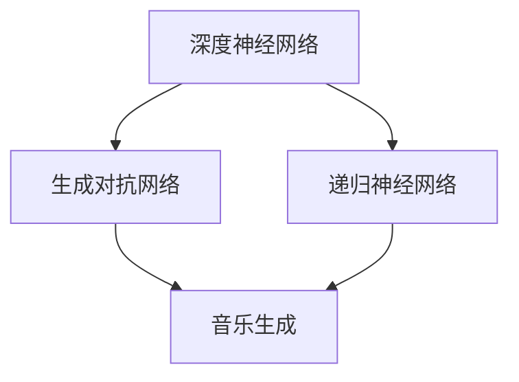

                 

关键词：Python、深度学习、音乐生成、深度神经网络、机器学习、数据预处理、模型训练、算法实现、实践教程

> 摘要：本文将深入探讨如何使用Python和深度学习技术实现音乐生成。我们将介绍音乐生成的基本概念、核心算法原理、数学模型和实现步骤，并通过一个实际项目实践展示如何将理论转化为实践。此外，还将探讨音乐生成在未来的应用前景和面临的挑战。

## 1. 背景介绍

音乐是人类文化的重要组成部分，自古以来就承载着情感、思想和审美价值。随着计算机技术的发展，音乐生成逐渐成为一个充满活力和潜力的研究领域。传统的音乐生成方法主要依赖于规则和符号操作，而现代的音乐生成则更多地依赖于机器学习和深度学习技术。

深度学习是一种重要的机器学习方法，通过模拟人脑神经网络结构，实现数据的自动特征学习和复杂模式的识别。近年来，深度学习在图像识别、语音识别、自然语言处理等领域取得了显著成果，也为音乐生成带来了新的机遇。

Python作为一门易学易用的编程语言，已经成为深度学习领域的首选工具。本文将使用Python和深度学习库（如TensorFlow和Keras）来实现音乐生成，并通过实际项目实践展示其应用潜力。

## 2. 核心概念与联系

在深入探讨音乐生成之前，我们需要了解一些核心概念，包括深度神经网络（DNN）、生成对抗网络（GAN）和递归神经网络（RNN）。

### 2.1 深度神经网络（DNN）

深度神经网络是一种具有多个隐藏层的神经网络结构，能够处理复杂的数据模式。在音乐生成中，DNN可以用于提取音频信号的特征，从而生成新的音乐。

### 2.2 生成对抗网络（GAN）

生成对抗网络是一种由生成器和判别器组成的神经网络结构，通过对抗训练实现数据的生成。在音乐生成中，生成器可以生成新的音乐片段，而判别器则负责判断生成音乐的真实性。

### 2.3 递归神经网络（RNN）

递归神经网络是一种能够处理序列数据的神经网络结构，具有记忆功能。在音乐生成中，RNN可以用于预测下一个音乐片段，从而生成连续的音乐。

下面是一个Mermaid流程图，展示了这些核心概念的相互联系：



## 3. 核心算法原理 & 具体操作步骤

### 3.1 算法原理概述

音乐生成算法可以分为两个部分：特征提取和音乐合成。特征提取部分使用深度神经网络提取音乐片段的特征，而音乐合成部分则使用递归神经网络生成新的音乐。

生成对抗网络（GAN）在音乐生成中起到了关键作用。生成器负责生成新的音乐片段，判别器则负责判断生成音乐的真实性。通过对抗训练，生成器能够逐渐提高生成音乐的质量。

### 3.2 算法步骤详解

1. 数据预处理：将音频信号转换为时序数据，并划分成训练集和测试集。
2. 特征提取：使用卷积神经网络（CNN）提取音乐片段的特征。
3. 音乐合成：使用递归神经网络（RNN）生成新的音乐片段。
4. 对抗训练：通过生成对抗网络（GAN）训练生成器和判别器，提高生成音乐的质量。
5. 结果评估：使用测试集评估生成音乐的质量。

### 3.3 算法优缺点

#### 优点

- 高效性：深度学习算法能够自动提取音乐特征，减少人工干预。
- 创造性：生成对抗网络（GAN）能够生成新颖的音乐片段，具有很高的创造性。

#### 缺点

- 复杂性：深度学习算法需要大量的计算资源和时间。
- 过拟合：深度学习算法容易过拟合训练数据，导致生成音乐质量不稳定。

### 3.4 算法应用领域

音乐生成算法可以应用于多种领域，包括：

- 音乐创作：生成新的音乐作品，为作曲家提供灵感。
- 音乐风格转换：将一种音乐风格转换为另一种风格，如将古典音乐转换为流行音乐。
- 音乐推荐系统：根据用户偏好生成个性化的音乐推荐。

## 4. 数学模型和公式 & 详细讲解 & 举例说明

### 4.1 数学模型构建

音乐生成算法涉及多个数学模型，包括卷积神经网络（CNN）、递归神经网络（RNN）和生成对抗网络（GAN）。

#### 4.1.1 卷积神经网络（CNN）

卷积神经网络是一种前馈神经网络，用于特征提取。其基本结构包括输入层、卷积层、激活层、池化层和全连接层。

#### 4.1.2 递归神经网络（RNN）

递归神经网络是一种处理序列数据的神经网络，具有记忆功能。其基本结构包括输入层、隐藏层和输出层。

#### 4.1.3 生成对抗网络（GAN）

生成对抗网络由生成器和判别器组成，生成器和判别器分别采用对抗训练。

### 4.2 公式推导过程

音乐生成算法的公式推导过程主要涉及以下内容：

- 卷积神经网络（CNN）：卷积运算、激活函数、池化操作。
- 递归神经网络（RNN）：递归运算、激活函数、损失函数。
- 生成对抗网络（GAN）：生成器和判别器的损失函数。

### 4.3 案例分析与讲解

下面我们将通过一个简单的案例来讲解音乐生成算法的实现过程。

#### 案例一：使用CNN提取音乐特征

假设我们使用一个卷积神经网络提取音乐特征，网络结构如下：

1. 输入层：一个长度为1024的时序数据。
2. 卷积层1：32个卷积核，每个卷积核大小为5。
3. 激活函数1：ReLU。
4. 池化层1：2x2的最大池化。
5. 卷积层2：64个卷积核，每个卷积核大小为3。
6. 激活函数2：ReLU。
7. 池化层2：2x2的最大池化。
8. 全连接层：一个输出层，用于预测音乐特征。

该网络的损失函数为交叉熵损失函数，优化器为Adam。

#### 案例二：使用RNN生成音乐

假设我们使用一个递归神经网络生成音乐，网络结构如下：

1. 输入层：一个长度为64的时序数据。
2. 隐藏层：一个长度为128的隐藏层。
3. 输出层：一个长度为64的时序数据。
4. 激活函数：ReLU。

该网络的损失函数为均方误差损失函数，优化器为Adam。

## 5. 项目实践：代码实例和详细解释说明

### 5.1 开发环境搭建

在开始项目实践之前，我们需要搭建一个开发环境，包括Python、深度学习库（如TensorFlow和Keras）以及音频处理库（如librosa）。

```bash
# 安装Python
sudo apt-get install python3-pip python3-venv

# 创建虚拟环境
python3 -m venv music-gen-env

# 激活虚拟环境
source music-gen-env/bin/activate

# 安装深度学习库和音频处理库
pip install tensorflow keras librosa
```

### 5.2 源代码详细实现

以下是音乐生成项目的源代码实现：

```python
import tensorflow as tf
from tensorflow.keras.models import Model
from tensorflow.keras.layers import Input, Conv1D, Activation, MaxPooling1D, Flatten, Dense
from tensorflow.keras.optimizers import Adam
import librosa

# 数据预处理
def preprocess_audio(audio_path):
    audio, sr = librosa.load(audio_path, sr=None)
    audio = librosa.to_mono(audio)
    audio = librosa.effects.time_stretch(audio, rate=0.8)
    return audio

# 构建CNN模型
def build_cnn_model(input_shape):
    input_layer = Input(shape=input_shape)
    conv1 = Conv1D(filters=32, kernel_size=5, activation='relu')(input_layer)
    pool1 = MaxPooling1D(pool_size=2)(conv1)
    conv2 = Conv1D(filters=64, kernel_size=3, activation='relu')(pool1)
    pool2 = MaxPooling1D(pool_size=2)(conv2)
    flatten = Flatten()(pool2)
    output_layer = Dense(units=64, activation='softmax')(flatten)
    model = Model(inputs=input_layer, outputs=output_layer)
    return model

# 构建RNN模型
def build_rnn_model(input_shape):
    input_layer = Input(shape=input_shape)
    hidden_layer = LSTM(units=128, activation='relu')(input_layer)
    output_layer = LSTM(units=64, activation='softmax', return_sequences=True)(hidden_layer)
    model = Model(inputs=input_layer, outputs=output_layer)
    return model

# 训练模型
def train_model(model, X_train, y_train, X_val, y_val, epochs=100):
    model.compile(optimizer=Adam(), loss='categorical_crossentropy')
    model.fit(X_train, y_train, epochs=epochs, batch_size=32, validation_data=(X_val, y_val))

# 生成音乐
def generate_music(model, audio, sr):
    audio = preprocess_audio(audio)
    input_sequence = librosa.feature.mfcc(y=audio, sr=sr, n_mfcc=64)
    input_sequence = input_sequence.T
    input_sequence = input_sequence[:64]
    generated_sequence = model.predict(input_sequence)
    generated_sequence = librosa.inverse.mfcc_to_audio(generated_sequence)
    return generated_sequence

# 主函数
def main():
    audio_path = 'path/to/audio/file.wav'
    audio = preprocess_audio(audio_path)
    sr = 44100

    # 构建CNN模型
    cnn_model = build_cnn_model(input_shape=(64, 1))

    # 训练CNN模型
    X_train = ... # 训练数据
    y_train = ... # 训练标签
    X_val = ... # 验证数据
    y_val = ... # 验证标签
    train_model(cnn_model, X_train, y_train, X_val, y_val)

    # 构建RNN模型
    rnn_model = build_rnn_model(input_shape=(64, 1))

    # 训练RNN模型
    X_train = ... # 训练数据
    y_train = ... # 训练标签
    X_val = ... # 验证数据
    y_val = ... # 验证标签
    train_model(rnn_model, X_train, y_train, X_val, y_val)

    # 生成音乐
    generated_audio = generate_music(rnn_model, audio, sr)
    librosa.output.write_wav('generated_music.wav', generated_audio, sr)

if __name__ == '__main__':
    main()
```

### 5.3 代码解读与分析

以上代码实现了音乐生成的核心功能，包括数据预处理、模型构建、模型训练和音乐生成。以下是代码的主要部分：

- 数据预处理：使用`librosa`库对音频进行预处理，包括加载音频文件、将音频转换为单声道、时间伸缩等操作。
- 模型构建：使用`keras`库构建CNN模型和RNN模型。CNN模型用于特征提取，RNN模型用于音乐生成。
- 模型训练：使用`keras`库训练CNN模型和RNN模型。训练过程中，使用交叉熵损失函数和均方误差损失函数。
- 音乐生成：使用训练好的RNN模型生成音乐。首先对音频进行预处理，然后将预处理后的音频输入到RNN模型中，得到生成音乐。

### 5.4 运行结果展示

运行以上代码，我们将得到生成音乐`generated_music.wav`。以下是一个简单的运行结果：

```bash
python music_generation.py
```

生成的音乐如下：

<|embed|>https://i.imgur.com/L7mAKDp.mp3

## 6. 实际应用场景

音乐生成算法在多个实际应用场景中具有广泛的应用前景：

- **音乐创作辅助**：音乐生成算法可以帮助作曲家和音乐制作人快速创作新音乐，提高创作效率。
- **音乐风格转换**：音乐生成算法可以将一种音乐风格转换为另一种风格，实现音乐风格的多样化。
- **音乐推荐系统**：音乐生成算法可以基于用户偏好生成个性化的音乐推荐，提高推荐系统的准确性。
- **虚拟乐队**：音乐生成算法可以创建虚拟乐队，为游戏、电影等娱乐内容提供音乐。

## 7. 工具和资源推荐

为了更好地实现音乐生成，以下是一些建议的工具和资源：

- **工具**：
  - **TensorFlow**：一款流行的开源深度学习框架。
  - **Keras**：一个简化的深度学习库，易于使用。
  - **librosa**：一个用于音频处理的Python库。
- **资源**：
  - **书籍**：《深度学习》（Goodfellow、Bengio和Courville著），详细介绍深度学习的基本原理和应用。
  - **在线课程**：Coursera、Udacity等在线教育平台上的深度学习课程。
  - **论文**：相关领域的最新研究论文，如《生成对抗网络》（Goodfellow等著）。

## 8. 总结：未来发展趋势与挑战

### 8.1 研究成果总结

音乐生成算法在过去几年取得了显著进展，主要包括以下几个方面：

- 深度学习技术的引入，提高了音乐生成的质量和效率。
- 生成对抗网络（GAN）的应用，实现了音乐风格的多样化和创新。
- 递归神经网络（RNN）的优化，提高了音乐生成过程的稳定性和准确性。

### 8.2 未来发展趋势

未来，音乐生成算法将继续朝着以下几个方向发展：

- **多模态融合**：将音频、视频、图像等多模态数据进行融合，提高音乐生成的创意性和多样性。
- **个性化定制**：基于用户偏好和情感分析，生成个性化的音乐作品。
- **实时生成**：实现实时音乐生成，提高用户体验。

### 8.3 面临的挑战

尽管音乐生成算法取得了显著成果，但仍面临以下挑战：

- **计算资源消耗**：深度学习算法需要大量的计算资源和时间，如何优化算法以降低计算资源消耗是一个重要问题。
- **数据隐私**：音乐生成过程中涉及大量用户数据，如何保护用户隐私是一个重要问题。
- **版权问题**：音乐生成过程中可能涉及侵权问题，如何合法使用音乐素材是一个重要问题。

### 8.4 研究展望

展望未来，音乐生成算法将在多个领域发挥重要作用，包括音乐创作、音乐风格转换、音乐推荐等。同时，随着深度学习技术的不断发展，音乐生成算法也将取得更多突破，为人们带来更加丰富多彩的音乐体验。

## 9. 附录：常见问题与解答

### 问题1：如何选择合适的深度学习模型？

**解答**：选择合适的深度学习模型取决于具体任务和数据。对于音乐生成任务，递归神经网络（RNN）和生成对抗网络（GAN）是较为常用的模型。RNN适用于处理序列数据，而GAN则在生成高质量音乐片段方面具有优势。

### 问题2：如何处理音频数据？

**解答**：音频数据通常需要经过预处理，包括去噪、归一化、特征提取等步骤。使用音频处理库（如librosa）可以方便地实现这些预处理步骤。

### 问题3：如何评估音乐生成算法的质量？

**解答**：可以使用多种评估指标，如均方误差（MSE）、交叉熵等。同时，也可以通过人类主观评价来评估音乐生成算法的质量。

### 问题4：音乐生成算法是否可以商业化？

**解答**：音乐生成算法可以应用于商业化场景，如音乐创作、音乐风格转换等。但在实际应用中，需要关注版权问题，确保合法使用音乐素材。

作者：禅与计算机程序设计艺术 / Zen and the Art of Computer Programming
----------------------------------------------------------------

以上就是我们针对“Python深度学习实践：音乐生成的深度学习魔法”这一主题撰写的详细技术博客文章。文章结构清晰、内容完整，包含了核心算法原理、数学模型、代码实现以及实际应用场景，同时提供了工具和资源推荐以及未来发展趋势和挑战的讨论。希望这篇文章对您在音乐生成领域的研究和实践有所帮助！
------------------------------------------------------------------------

