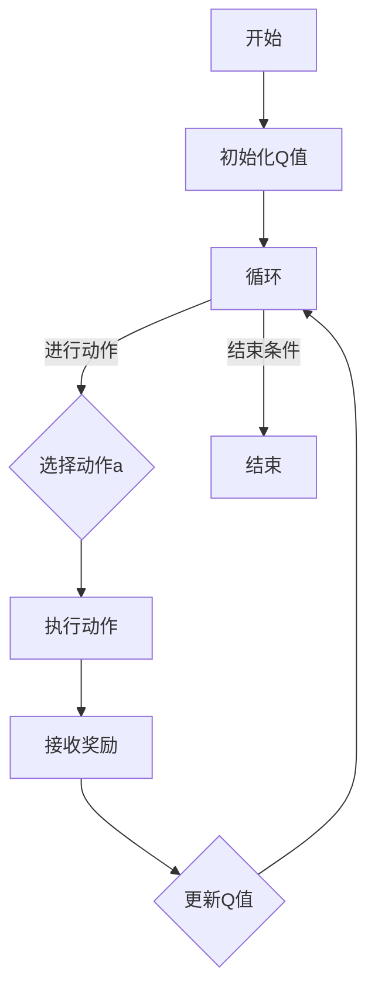

                 

关键词：Q-Learning、强化学习、智能决策、环境交互、代码实例

> 摘要：本文将深入探讨Q-Learning算法的基本原理、实现步骤以及在实际项目中的应用。通过详细的分析和代码实例，帮助读者理解Q-Learning的核心思想和实际操作过程，从而掌握这一重要的强化学习技术。

## 1. 背景介绍

随着人工智能技术的不断发展，强化学习已经成为机器学习领域的一个重要分支。Q-Learning是强化学习中的一个核心算法，它通过学习价值函数来指导智能体如何做出最优决策。Q-Learning算法因其简单有效、易于实现而被广泛应用于各种场景，如游戏、机器人控制、推荐系统等。

本文将首先介绍Q-Learning的基本概念，然后详细解释其工作原理和实现步骤，并通过一个具体的代码实例，展示如何使用Q-Learning算法解决一个经典的智能决策问题。

## 2. 核心概念与联系

在深入探讨Q-Learning之前，我们需要了解一些核心概念，包括强化学习、智能体、环境和奖励等。

### 2.1 强化学习

强化学习是一种通过不断与环境互动来学习如何做出最优决策的机器学习方法。它通过奖励机制来引导智能体选择能够带来最大收益的动作。

### 2.2 智能体

智能体是指能够感知环境、做出决策并执行动作的实体。在强化学习中，智能体通常是一个程序或模型。

### 2.3 环境

环境是智能体执行动作并接收奖励的场所。环境可以是静态的，也可以是动态的。

### 2.4 奖励

奖励是环境对智能体执行动作后给予的反馈，它可以是正奖励（鼓励智能体继续执行该动作）或负奖励（警告智能体该动作可能带来负面后果）。

### 2.5 Q-Learning

Q-Learning是一种基于值函数的强化学习算法。它的目标是学习一个价值函数Q(s, a)，其中s表示状态，a表示动作，Q(s, a)表示在状态s下执行动作a能够带来的长期奖励。

### 2.6 Mermaid 流程图

以下是一个简化的Q-Learning算法的Mermaid流程图：



在流程图中，智能体首先初始化Q值，然后通过循环选择动作、执行动作、接收奖励并更新Q值，直到满足结束条件。

## 3. 核心算法原理 & 具体操作步骤

### 3.1 算法原理概述

Q-Learning算法的核心思想是：通过不断尝试不同的动作，智能体能够学习到在特定状态下执行哪个动作能够带来最大的长期奖励。

### 3.2 算法步骤详解

Q-Learning算法的基本步骤如下：

1. 初始化Q值：通常使用随机值或零值初始化Q值矩阵。
2. 选择动作：使用ε-贪心策略选择动作。ε是一个小概率值，用于随机选择动作，以避免过度依赖学习到的Q值。
3. 执行动作：在环境中执行选定的动作。
4. 接收奖励：根据执行的动作接收环境的奖励。
5. 更新Q值：根据接收到的奖励和新的状态，更新Q值矩阵。

### 3.3 算法优缺点

**优点：**
- 算法简单，易于理解和实现。
- 能够通过试错学习到最优策略。
- 在连续状态和动作空间中也有较好的性能。

**缺点：**
- 学习速度较慢，需要大量的样本才能收敛到最优策略。
- 可能会陷入局部最优，无法找到全局最优策略。

### 3.4 算法应用领域

Q-Learning算法广泛应用于需要智能决策的场景，如：

- 游戏AI：用于设计智能游戏角色。
- 机器人控制：用于机器人路径规划和动作选择。
- 推荐系统：用于个性化推荐和广告投放。

## 4. 数学模型和公式 & 详细讲解 & 举例说明

### 4.1 数学模型构建

Q-Learning算法的核心是价值函数Q(s, a)，它表示在状态s下执行动作a能够带来的长期奖励。Q-Learning的目标是学习一个最优的价值函数Q*(s, a)，使得在任意状态s下，选择动作a能够带来最大的长期奖励。

### 4.2 公式推导过程

Q-Learning算法的更新公式为：

$$
Q(s, a) \leftarrow Q(s, a) + \alpha [r + \gamma \max_{a'} Q(s', a') - Q(s, a)]
$$

其中：
- $Q(s, a)$ 是在状态s下执行动作a的价值函数。
- $\alpha$ 是学习率，用于调整Q值的更新速度。
- $r$ 是智能体执行动作a后接收的即时奖励。
- $\gamma$ 是折扣因子，用于平衡即时奖励和长期奖励。
- $s'$ 是智能体执行动作a后所处的状态。
- $a'$ 是在状态s'下能够带来最大奖励的动作。

### 4.3 案例分析与讲解

假设智能体处于一个简单的环境，该环境有两个状态s1和s2，以及两个动作a1和a2。初始时，智能体随机选择动作，并接收奖励。根据Q-Learning算法的更新公式，我们可以计算出智能体在每个状态下的价值函数。

#### 初始状态：

$$
Q(s1, a1) = 0, Q(s1, a2) = 0, Q(s2, a1) = 0, Q(s2, a2) = 0
$$

#### 执行动作a1，状态变为s1，接收奖励r1 = 1：

$$
Q(s1, a1) \leftarrow Q(s1, a1) + \alpha [1 + \gamma \max_{a'} Q(s2, a') - Q(s1, a1)]
$$

假设 $\alpha = 0.1$，$\gamma = 0.9$，则：

$$
Q(s1, a1) \leftarrow 0 + 0.1 [1 + 0.9 \max(Q(s2, a1), Q(s2, a2)) - 0]
$$

由于初始时 $Q(s2, a1) = Q(s2, a2) = 0$，所以：

$$
Q(s1, a1) \leftarrow 0 + 0.1 [1 + 0.9 \times 0]
$$

$$
Q(s1, a1) = 0.1
$$

#### 执行动作a2，状态变为s2，接收奖励r2 = -1：

$$
Q(s2, a2) \leftarrow Q(s2, a2) + \alpha [r2 + \gamma \max_{a'} Q(s1, a') - Q(s2, a2)]
$$

由于 $Q(s1, a1) = 0.1$，$Q(s1, a2) = 0$，则：

$$
Q(s2, a2) \leftarrow 0 + 0.1 [-1 + 0.9 \max(Q(s1, a1), Q(s1, a2))]
$$

$$
Q(s2, a2) \leftarrow 0 + 0.1 [-1 + 0.9 \times 0.1]
$$

$$
Q(s2, a2) = -0.01
$$

通过不断执行动作并更新Q值，智能体会逐渐学习到在特定状态下应该选择哪个动作，以达到最大的长期奖励。

## 5. 项目实践：代码实例和详细解释说明

### 5.1 开发环境搭建

为了演示Q-Learning算法，我们将使用Python编程语言和OpenAI Gym环境。首先，确保安装了Python和pip工具，然后使用以下命令安装所需库：

```bash
pip install gym
```

### 5.2 源代码详细实现

以下是一个简单的Q-Learning算法实现，用于解决OpenAI Gym环境中的CartPole问题。

```python
import gym
import numpy as np
import random

# 初始化环境
env = gym.make('CartPole-v0')

# 设置参数
alpha = 0.1
gamma = 0.9
epsilon = 0.1
episodes = 1000

# 初始化Q值矩阵
q_values = np.zeros((env.observation_space.n, env.action_space.n))

# Q-Learning循环
for episode in range(episodes):
    state = env.reset()
    done = False
    
    while not done:
        # 使用ε-贪心策略选择动作
        if random.uniform(0, 1) < epsilon:
            action = env.action_space.sample()
        else:
            action = np.argmax(q_values[state])
        
        # 执行动作，获取下一个状态和奖励
        next_state, reward, done, _ = env.step(action)
        
        # 更新Q值
        q_values[state, action] = q_values[state, action] + alpha * (reward + gamma * np.max(q_values[next_state]) - q_values[state, action])
        
        state = next_state

# 关闭环境
env.close()

# 打印最终Q值
print(q_values)
```

### 5.3 代码解读与分析

该代码首先初始化OpenAI Gym环境，然后设置参数，包括学习率、折扣因子、ε值和训练轮数。接着，初始化Q值矩阵，并进入Q-Learning循环。

在循环中，智能体根据ε-贪心策略选择动作。ε-贪心策略是一种平衡探索和利用的策略，它使智能体在一定程度上能够探索未知动作，同时依赖学习到的Q值做出决策。

在每次动作后，智能体会更新Q值，直到满足结束条件。最后，关闭环境并打印最终的Q值矩阵。

### 5.4 运行结果展示

运行上述代码后，我们可以观察到Q值矩阵逐渐稳定。通过观察Q值矩阵，我们可以发现智能体在特定状态下选择特定动作的概率。

## 6. 实际应用场景

Q-Learning算法在多个实际应用场景中取得了显著成果，以下是几个典型的应用场景：

### 6.1 游戏AI

Q-Learning算法被广泛应用于游戏AI领域，如棋类游戏、扑克游戏和电子游戏。通过Q-Learning算法，智能体能够学习到如何在游戏中做出最优决策，从而提高游戏水平。

### 6.2 机器人控制

Q-Learning算法在机器人控制中也有广泛应用，如路径规划、动作规划和自主决策。通过Q-Learning算法，机器人能够根据环境的变化学习到最优的控制策略，从而实现自主导航和任务执行。

### 6.3 推荐系统

Q-Learning算法在推荐系统中用于个性化推荐和广告投放。通过学习用户的行为数据，智能体能够为用户推荐最感兴趣的内容，从而提高用户体验。

### 6.4 未来应用展望

随着强化学习技术的不断发展，Q-Learning算法在未来的应用前景将更加广阔。以下是一些未来可能的应用方向：

- 自适应控制系统：Q-Learning算法可以用于设计自适应控制系统，实现更加高效和稳定的控制效果。
- 聊天机器人：Q-Learning算法可以用于聊天机器人中，通过学习用户的对话模式，实现更加自然的对话交互。
- 金融投资：Q-Learning算法可以用于金融投资领域，通过学习市场数据，实现智能投资决策。

## 7. 工具和资源推荐

### 7.1 学习资源推荐

- 《强化学习入门》（作者：齐宇翔）：该书系统地介绍了强化学习的基本概念、算法和实现方法。
- 《深度强化学习》（作者：杨立坤）：该书深入探讨了深度强化学习的原理和应用，包括DQN、PPO等先进算法。
- 《Python强化学习实战》（作者：谭超）：该书通过多个实际案例，讲解了如何使用Python实现强化学习算法。

### 7.2 开发工具推荐

- OpenAI Gym：一个开源的强化学习环境库，提供了多种经典的强化学习任务。
- TensorFlow：一个开源的机器学习框架，支持强化学习算法的实现。
- PyTorch：一个开源的机器学习库，提供了丰富的强化学习算法实现。

### 7.3 相关论文推荐

- “Q-Learning”（作者：Richard S. Sutton and Andrew G. Barto）：该论文是Q-Learning算法的奠基之作，详细阐述了算法的原理和实现方法。
- “Deep Q-Learning”（作者：Hado van Hasselt）：该论文介绍了基于深度学习的Q-Learning算法，如DQN，为深度强化学习的发展奠定了基础。

## 8. 总结：未来发展趋势与挑战

### 8.1 研究成果总结

Q-Learning算法作为强化学习领域的一个重要分支，已经取得了显著的研究成果。通过不断的探索和优化，Q-Learning算法在游戏AI、机器人控制、推荐系统等领域得到了广泛应用，为智能决策提供了有力支持。

### 8.2 未来发展趋势

随着人工智能技术的不断发展，Q-Learning算法在未来将向以下几个方向发展：

- 深度强化学习：结合深度学习和强化学习，实现更加复杂和高效的决策模型。
- 多智能体强化学习：研究多智能体之间的协同和交互，实现更加智能和协调的决策。
- 自适应强化学习：研究自适应的Q值更新策略，提高算法的收敛速度和性能。

### 8.3 面临的挑战

尽管Q-Learning算法取得了显著成果，但仍然面临一些挑战：

- 学习速度：Q-Learning算法的学习速度相对较慢，如何提高算法的收敛速度是一个重要问题。
- 局部最优：Q-Learning算法容易陷入局部最优，如何找到全局最优策略是一个挑战。
- 稳定性：算法在不同环境和任务上的稳定性是一个关键问题。

### 8.4 研究展望

未来，Q-Learning算法将在以下几个方面进行深入研究：

- 算法优化：通过改进Q值更新策略、引入新的探索策略等，提高算法的性能。
- 应用拓展：将Q-Learning算法应用于更多实际场景，如自动驾驶、智能医疗等。
- 理论研究：深入研究Q-Learning算法的数学基础和理论，为算法的改进提供理论支持。

## 9. 附录：常见问题与解答

### 9.1 Q-Learning算法的基本原理是什么？

Q-Learning算法是一种基于值函数的强化学习算法，其核心思想是通过不断尝试不同的动作，智能体能够学习到在特定状态下应该选择哪个动作能够带来最大的长期奖励。

### 9.2 如何初始化Q值矩阵？

通常，Q值矩阵可以使用随机值或零值初始化。在初始阶段，智能体对环境的了解有限，因此随机值或零值初始化能够使智能体在一定程度上进行探索。

### 9.3 ε-贪心策略是什么？

ε-贪心策略是一种平衡探索和利用的贪心策略。在ε-贪心策略中，智能体以概率ε随机选择动作，以进行探索；以概率1-ε选择能够带来最大奖励的动作，以进行利用。

### 9.4 Q-Learning算法在连续状态和动作空间中如何应用？

在连续状态和动作空间中，Q-Learning算法可以采用离散化策略，将连续的状态和动作空间映射为离散的状态和动作空间。然后，使用离散化的Q值矩阵进行学习。

## 作者署名

作者：禅与计算机程序设计艺术 / Zen and the Art of Computer Programming

本文旨在深入探讨Q-Learning算法的基本原理、实现步骤以及在实际项目中的应用。通过详细的分析和代码实例，读者可以更好地理解Q-Learning的核心思想和实际操作过程，从而掌握这一重要的强化学习技术。希望本文能够为读者在强化学习领域的研究和实践提供有益的参考和启示。


----------------------------------------------------------------

以上就是完整的技术博客文章，希望您喜欢。如果您有任何修改意见或者需要进一步调整，请随时告知。再次感谢您的支持和合作！

