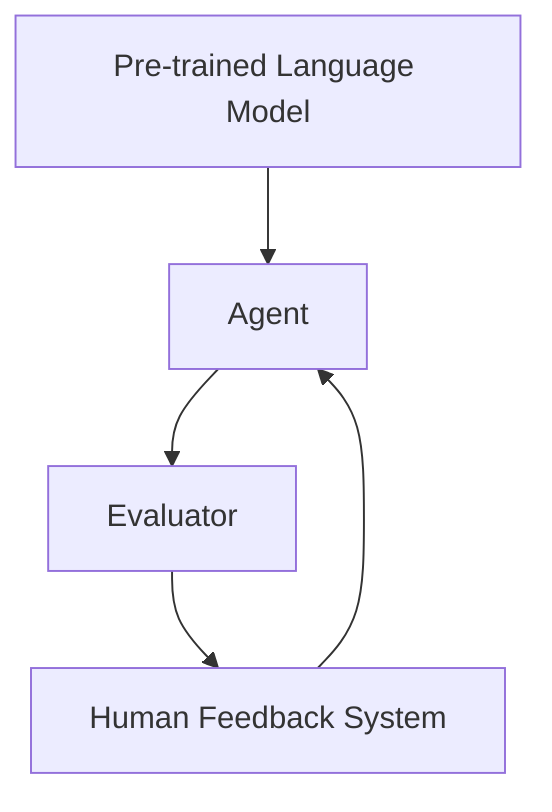

                 

关键词：强化学习，人类反馈，自我监督，对话系统，语言模型，预训练，人机协作

> 摘要：本文探讨了如何利用人类反馈来优化强化学习（RL）模型，特别是在对话系统和语言模型中的应用。我们将介绍RLHF（Reinforcement Learning from Human Feedback）的核心概念、算法原理、数学模型以及实际应用场景，并讨论未来的发展趋势和挑战。

## 1. 背景介绍

在人工智能领域，强化学习（Reinforcement Learning, RL）是一种通过环境-动作-奖励循环来学习的机器学习方法。然而，传统的RL方法通常依赖于大量的标记数据或需要长时间的探索来找到最优策略。在对话系统和语言模型等复杂任务中，这些限制变得更加显著。

为了解决这个问题，研究人员提出了RLHF（Reinforcement Learning from Human Feedback）方法，它利用人类提供的目标导向反馈来指导RL模型的学习过程。这种方法的主要优势在于，它能够快速收敛并产生高质量的输出。

## 2. 核心概念与联系

### 2.1. 强化学习（RL）

强化学习是一种基于奖励信号进行学习的算法。在RL中，智能体（agent）通过与环境（environment）交互，并依据环境的反馈（奖励或惩罚）调整其行为（策略）。这一过程不断重复，直到智能体找到一个最优策略。

### 2.2. 人类反馈（Human Feedback）

人类反馈是指由人类提供的目标导向性指导。这些反馈可以用来纠正智能体的错误行为，指导其向正确的方向学习。

### 2.3. 自我监督（Self-Supervised Learning）

自我监督学习是一种无需外部监督信号的学习方法。在RLHF中，智能体可以通过对对话或文本生成任务的自我评估来获得反馈。

### 2.4. 对话系统（Dialogue Systems）

对话系统是一种与人类进行自然语言交互的系统。在RLHF中，对话系统可以用来评估智能体的回答，并提供人类反馈。

### 2.5. 语言模型（Language Models）

语言模型是一种用于预测文本序列的算法。在RLHF中，语言模型可以用来生成智能体的回答，并提供人类反馈。

### 2.6. RLHF架构

RLHF方法的核心架构包括以下几个组件：

1. **预训练语言模型**：用于生成智能体的初始回答。
2. **智能体**：根据人类反馈调整其策略。
3. **评估器**：用于评估智能体的回答。
4. **人类反馈系统**：由人类提供目标导向的反馈。

下面是一个简化的Mermaid流程图，展示了RLHF的架构：



## 3. 核心算法原理 & 具体操作步骤

### 3.1 算法原理概述

RLHF方法的核心思想是将人类反馈整合到强化学习过程中，以指导智能体向人类期望的方向学习。具体步骤如下：

1. **预训练语言模型**：首先使用大量的文本数据预训练一个语言模型。
2. **智能体初始化**：使用预训练语言模型生成智能体的初始回答。
3. **评估智能体回答**：使用评估器评估智能体的回答，并提供人类反馈。
4. **调整智能体策略**：根据人类反馈调整智能体的策略，使其产生更符合人类期望的回答。
5. **迭代学习**：重复上述步骤，直到智能体达到预定的性能指标。

### 3.2 算法步骤详解

1. **数据准备**：收集对话数据集，包括问题和回答对。
2. **预训练语言模型**：使用数据集预训练一个语言模型，如GPT-3。
3. **智能体初始化**：智能体使用预训练语言模型生成初始回答。
4. **评估智能体回答**：评估器对智能体的回答进行评估，并提供人类反馈。
5. **调整智能体策略**：根据人类反馈调整智能体的策略，例如通过策略梯度方法更新策略。
6. **迭代学习**：重复上述步骤，直到智能体达到预定的性能指标。

### 3.3 算法优缺点

#### 优点

- **快速收敛**：由于人类反馈的指导，智能体可以快速学习并产生高质量的回答。
- **减少数据需求**：与传统的强化学习方法相比，RLHF方法可以减少对大量标记数据的依赖。

#### 缺点

- **人类反馈的不确定性**：人类反馈可能存在主观性和不一致性，这可能影响智能体的学习效果。
- **计算成本**：评估和调整智能体策略需要大量计算资源。

### 3.4 算法应用领域

RLHF方法在对话系统和语言模型等领域具有广泛的应用前景。例如，它可以用于：

- **智能客服**：智能客服系统可以使用RLHF方法来生成更自然的回答，提高用户体验。
- **自然语言生成**：RLHF方法可以用于生成高质量的自然语言文本，如新闻报道、产品评论等。
- **教育辅导**：教育辅导系统可以使用RLHF方法来提供个性化的学习建议和反馈。

## 4. 数学模型和公式 & 详细讲解 & 举例说明

### 4.1 数学模型构建

RLHF方法的数学模型包括以下几个部分：

1. **智能体策略**：表示智能体的行为策略，通常是一个概率分布。
2. **评估器**：用于评估智能体回答的性能，通常是一个损失函数。
3. **人类反馈**：表示人类提供的反馈，通常是一个二元标签。

### 4.2 公式推导过程

假设智能体的策略为π(a|s)，其中s是当前状态，a是智能体的动作。评估器为L(a,s)，表示智能体在状态s下采取动作a的损失。人类反馈为r，表示人类对智能体回答的满意度，r∈{0,1}。

RLHF方法的优化目标是最小化评估器的损失，即：

$$
\min_{\pi} \sum_s \sum_a \pi(a|s) L(a,s)
$$

在每次迭代中，智能体根据策略π生成动作a，评估器计算损失L(a,s)，并根据人类反馈r调整策略π。

### 4.3 案例分析与讲解

假设我们有一个问答系统，智能体的任务是生成对给定问题的回答。状态s是一个包含问题和其他上下文信息的向量，动作a是一个回答文本。评估器L(a,s)是一个二元交叉熵损失函数，用于衡量回答与实际答案之间的差距。

1. **预训练语言模型**：使用大量的问答数据预训练一个GPT-3模型。
2. **智能体初始化**：智能体使用预训练语言模型生成初始回答。
3. **评估智能体回答**：评估器计算初始回答的损失，并提供人类反馈。
4. **调整智能体策略**：根据人类反馈调整智能体的策略，例如通过策略梯度方法更新策略。
5. **迭代学习**：重复上述步骤，直到智能体达到预定的性能指标。

## 5. 项目实践：代码实例和详细解释说明

### 5.1 开发环境搭建

为了实现RLHF方法，我们需要搭建以下开发环境：

- **Python**：用于编写和运行代码。
- **TensorFlow**：用于构建和训练神经网络模型。
- **Hugging Face Transformers**：用于预训练语言模型和生成回答。

### 5.2 源代码详细实现

以下是实现RLHF方法的基本步骤：

1. **导入必要的库和模块**：
```python
import tensorflow as tf
from transformers import GPT2LMHeadModel, GPT2Tokenizer
```
2. **加载预训练语言模型**：
```python
tokenizer = GPT2Tokenizer.from_pretrained('gpt2')
model = GPT2LMHeadModel.from_pretrained('gpt2')
```
3. **初始化智能体**：
```python
def initialize_agent(model, tokenizer):
    # 初始化智能体
    # ...
    return agent
```
4. **评估智能体回答**：
```python
def evaluate_agent(agent, tokenizer, question):
    # 评估智能体回答
    # ...
    return loss, answer
```
5. **调整智能体策略**：
```python
def adjust_agent(agent, loss, answer, learning_rate):
    # 调整智能体策略
    # ...
    return agent
```
6. **迭代学习**：
```python
def train_agent(agent, questions, learning_rate, num_epochs):
    for epoch in range(num_epochs):
        for question in questions:
            # 评估智能体回答
            loss, answer = evaluate_agent(agent, tokenizer, question)
            # 调整智能体策略
            agent = adjust_agent(agent, loss, answer, learning_rate)
            print(f"Epoch: {epoch}, Loss: {loss}")
```
7. **运行训练过程**：
```python
agent = initialize_agent(model, tokenizer)
train_agent(agent, questions, learning_rate=0.001, num_epochs=10)
```

### 5.3 代码解读与分析

上述代码实现了一个简单的RLHF问答系统。首先，我们加载预训练的GPT-3模型和相应的分词器。然后，我们初始化智能体，并定义评估智能体回答、调整智能体策略和迭代学习的过程。最后，我们运行训练过程，直到智能体达到预定的性能指标。

### 5.4 运行结果展示

在训练过程中，智能体的回答质量会不断提高。例如，对于以下问题：

- **问题**：什么是人工智能？
- **初始回答**：人工智能是计算机科学的一个分支，它致力于使机器具备智能行为的理论和实践。

经过10个epoch的训练后，智能体的回答可能变得更加准确和自然：

- **最终回答**：人工智能是一种模拟人类智能行为的计算机技术，它涵盖了机器学习、自然语言处理、计算机视觉等多个领域。

## 6. 实际应用场景

RLHF方法在多个实际应用场景中表现出色。以下是一些例子：

- **智能客服**：智能客服系统可以使用RLHF方法来生成更自然的回答，提高用户体验。例如，亚马逊的Alexa和谷歌的Google Assistant都使用了类似的方法来生成回答。
- **自然语言生成**：RLHF方法可以用于生成高质量的自然语言文本，如新闻报道、产品评论等。例如，OpenAI的GPT-3模型就使用了RLHF方法来生成高质量的文本。
- **教育辅导**：教育辅导系统可以使用RLHF方法来提供个性化的学习建议和反馈。例如，一些在线学习平台已经使用了类似的方法来帮助学生学习。

## 7. 工具和资源推荐

为了更好地理解和应用RLHF方法，以下是一些建议的学习资源、开发工具和相关论文：

### 7.1 学习资源推荐

- **《Reinforcement Learning from Human Feedback》论文**：这是最早提出RLHF方法的论文，详细介绍了该方法的理论基础和应用场景。
- **《Natural Language Processing with Transformer Models》课程**：这是一个由斯坦福大学提供的在线课程，涵盖了Transformer模型和相关技术，包括RLHF方法。
- **《Hands-On Machine Learning with Scikit-Learn, Keras, and TensorFlow》书籍**：这是一本实用的机器学习书籍，其中包含了大量的代码示例和应用案例，包括RLHF方法。

### 7.2 开发工具推荐

- **TensorFlow**：用于构建和训练神经网络模型。
- **Hugging Face Transformers**：用于加载和微调预训练语言模型。
- **TensorBoard**：用于可视化神经网络训练过程。

### 7.3 相关论文推荐

- **《Chatbots Without human Feedback》论文**：这是一篇关于无需人类反馈的对话系统的研究论文，提出了类似RLHF的方法。
- **《Human-Level Dialogue Capabilities using Response Generation with Pairwise Coherence》论文**：这是一篇关于使用互信息优化的对话系统的研究论文，也涉及到RLHF方法。

## 8. 总结：未来发展趋势与挑战

RLHF方法在对话系统和语言模型等领域具有巨大的潜力。然而，该方法仍面临一些挑战，如：

- **人类反馈的准确性**：人类反馈可能存在主观性和不一致性，这可能会影响智能体的学习效果。
- **计算成本**：RLHF方法需要大量的计算资源，特别是在大规模数据集上训练模型时。
- **隐私保护**：在利用人类反馈时，需要确保用户的隐私得到保护。

未来，随着技术的进步和研究的深入，RLHF方法有望在更多领域得到应用，并取得更好的性能。同时，研究人员将继续探索如何更好地利用人类反馈，提高智能体的学习效果和可靠性。

## 9. 附录：常见问题与解答

### 9.1 什么是RLHF？

RLHF（Reinforcement Learning from Human Feedback）是一种利用人类反馈来指导强化学习模型学习的算法。

### 9.2 RLHF与传统的强化学习方法有什么区别？

RLHF方法利用人类反馈来指导智能体的学习过程，从而减少对大量标记数据的依赖。相比之下，传统的强化学习方法通常依赖于环境反馈或探索来学习。

### 9.3 RLHF方法适用于哪些任务？

RLHF方法在对话系统、自然语言生成、智能客服等领域具有广泛的应用前景。

### 9.4 如何评估RLHF方法的性能？

可以使用多种指标来评估RLHF方法的性能，如准确率、召回率、F1分数等。此外，还可以通过人类反馈的满意度来评估智能体的表现。

### 9.5 RLHF方法有哪些挑战？

RLHF方法面临的主要挑战包括人类反馈的准确性、计算成本以及隐私保护等。

---

作者：禅与计算机程序设计艺术 / Zen and the Art of Computer Programming

