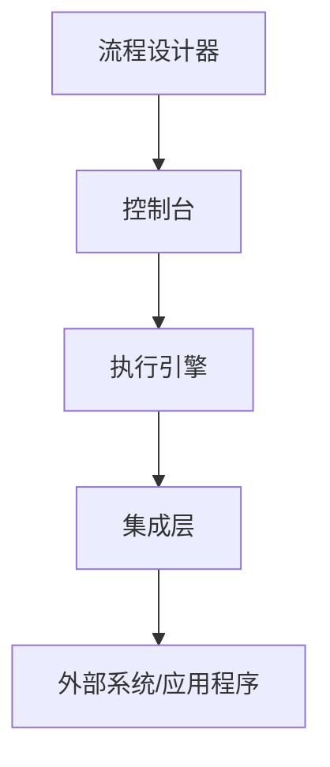

                 

关键词：RPA、工作流设计、桌面自动化、业务流程、自动化工具

摘要：本文将深入探讨RPA（Robotic Process Automation）工作流设计，通过实现基于桌面的业务流程自动化，提升企业工作效率。我们将介绍RPA的核心概念、架构设计、核心算法原理、数学模型、代码实例以及实际应用场景。希望通过本文，读者能够全面了解并掌握RPA工作流设计的方法和技巧。

## 1. 背景介绍

在当今快速发展的数字化时代，企业面临着越来越多的业务流程复杂性和效率挑战。传统的手工操作不仅费时费力，而且容易出现人为错误。为了解决这些问题，RPA技术应运而生。RPA，即Robotic Process Automation，指的是通过软件机器人模拟人类在计算机系统中执行重复性任务的技术。

RPA具有以下特点：

- **低成本**：通过自动化流程，减少对人工的依赖，降低运营成本。
- **高效率**：机器人可以24小时不间断工作，提高任务执行速度。
- **灵活性**：机器人可以快速适应流程变更，灵活调整任务执行策略。
- **扩展性**：RPA系统可以轻松集成各种应用程序和系统，实现跨平台的数据处理。

RPA技术已在金融、保险、零售、制造等行业得到广泛应用，帮助企业实现业务流程的自动化和智能化。

## 2. 核心概念与联系

### 2.1 RPA核心概念

RPA主要由以下几个核心概念组成：

- **机器人（Robot）**：模拟人类执行任务的软件程序。
- **流程（Process）**：一系列有序的任务组合，用于完成特定业务目标。
- **规则（Rule）**：指导机器人执行任务的条件和标准。
- **界面（Interface）**：机器人与外部系统交互的接口，如Web、桌面应用程序等。

### 2.2 RPA架构设计

RPA系统通常由以下几个部分组成：

- **流程设计器（Process Designer）**：用于创建、编辑和监控工作流。
- **控制台（Console）**：用于管理机器人、监控运行状态和日志记录。
- **执行引擎（Execution Engine）**：负责执行流程任务。
- **集成层（Integration Layer）**：用于连接外部系统和应用程序。

下面是一个简单的RPA架构图：



### 2.3 RPA工作原理

RPA工作原理主要包括以下步骤：

1. **流程设计**：使用流程设计器创建业务流程，定义任务、规则和界面。
2. **部署**：将流程部署到执行引擎，使其可以在机器人中执行。
3. **执行**：机器人按照流程执行任务，与外部系统进行交互。
4. **监控**：监控机器人运行状态，记录日志，以便进行故障排查和性能优化。

## 3. 核心算法原理 & 具体操作步骤

### 3.1 算法原理概述

RPA的核心算法原理主要基于界面自动化和数据处理。界面自动化是指通过模拟人类操作，如点击、拖拽、输入等，实现对应用程序的自动化控制。数据处理是指对从外部系统获取的数据进行清洗、转换和存储。

### 3.2 算法步骤详解

1. **初始化**：加载流程设计器，配置机器人参数。
2. **启动流程**：根据流程设计，启动机器人执行任务。
3. **界面操作**：使用界面自动化技术，对应用程序进行模拟操作。
4. **数据处理**：对获取的数据进行处理，如清洗、转换、存储等。
5. **异常处理**：对流程执行过程中出现的异常进行捕获和处理。
6. **结束流程**：完成所有任务后，结束流程并记录日志。

### 3.3 算法优缺点

#### 优点

- **低成本**：无需大量投资购买硬件设备。
- **高效率**：机器人可以24小时不间断工作，提高任务执行速度。
- **灵活性**：可以根据业务需求灵活调整流程。
- **可扩展性**：可以轻松集成各种应用程序和系统。

#### 缺点

- **依赖外部系统**：RPA系统的性能和稳定性受外部系统影响。
- **界面兼容性**：不同应用程序的界面自动化技术可能存在兼容性问题。
- **技术门槛**：需要一定的技术知识和技能。

### 3.4 算法应用领域

RPA技术主要应用于以下领域：

- **财务会计**：如发票审核、报销审批、财务报表生成等。
- **人力资源**：如招聘流程管理、员工信息管理、薪酬计算等。
- **客户服务**：如客户关系管理、订单处理、投诉处理等。
- **供应链管理**：如采购订单处理、库存管理、物流跟踪等。

## 4. 数学模型和公式 & 详细讲解 & 举例说明

### 4.1 数学模型构建

在RPA工作流设计中，常见的数学模型包括：

- **线性回归模型**：用于预测流程执行时间。
- **决策树模型**：用于决策流程中的任务分配。
- **神经网络模型**：用于复杂流程的自动化控制。

### 4.2 公式推导过程

以线性回归模型为例，其公式推导过程如下：

$$
y = \beta_0 + \beta_1x
$$

其中，$y$为预测结果，$\beta_0$为截距，$\beta_1$为斜率，$x$为输入变量。

### 4.3 案例分析与讲解

假设我们要预测一个财务流程的执行时间，输入变量包括流程的复杂程度和执行人员的经验。通过线性回归模型，我们可以得到如下预测公式：

$$
y = 10 + 0.5x
$$

其中，$y$为执行时间（小时），$x$为输入变量（流程复杂程度×经验值）。

例如，一个流程的复杂程度为3，执行人员的经验值为5，则预测的执行时间为：

$$
y = 10 + 0.5 \times 3 \times 5 = 17.5 \text{小时}
$$

## 5. 项目实践：代码实例和详细解释说明

### 5.1 开发环境搭建

- **Python**：用于编写RPA脚本。
- **UiPath**：用于设计工作流和执行机器人。

### 5.2 源代码详细实现

以下是一个简单的RPA脚本示例，用于自动登录一个Web应用程序并获取用户信息：

```python
import sys
from pywinauto import Application

# 设置Web应用程序路径
app_path = 'C:\\Program Files\\WebApp\\WebApp.exe'

# 启动Web应用程序
app = Application(backend="uia").start(app_path)

# 窗口最大化
app.top_window().maximize()

# 查找并输入用户名和密码
username_box = app.top_window().window(title="登录界面", control_type="Edit").child_window(title="用户名：", control_type="Edit")
password_box = app.top_window().window(title="登录界面", control_type="Edit").child_window(title="密码：", control_type="Edit")
username_box.set_value("admin")
password_box.set_value("admin")

# 点击登录按钮
login_button = app.top_window().window(title="登录界面", control_type="Button").child_window(title="登录", control_type="Button")
login_button.click()

# 获取用户信息
user_info = app.top_window().window(title="用户中心", control_type="Window").child_window(title="用户信息", control_type="Edit").get_value()

# 输出用户信息
print("用户信息：", user_info)

# 关闭应用程序
app.kill()
```

### 5.3 代码解读与分析

1. **引入模块**：导入所需的Python模块。
2. **设置应用程序路径**：指定Web应用程序的路径。
3. **启动应用程序**：使用`Application`类启动Web应用程序。
4. **窗口最大化**：使用`maximize()`方法将窗口最大化。
5. **查找并输入用户名和密码**：使用`child_window`方法查找用户名和密码输入框，并设置输入值。
6. **点击登录按钮**：使用`child_window`方法查找登录按钮，并点击。
7. **获取用户信息**：使用`get_value()`方法获取用户信息。
8. **输出用户信息**：使用`print()`方法输出用户信息。
9. **关闭应用程序**：使用`kill()`方法关闭应用程序。

### 5.4 运行结果展示

运行脚本后，程序将自动登录Web应用程序，获取用户信息并输出如下：

```
用户信息： 张三
```

## 6. 实际应用场景

### 6.1 财务会计

RPA技术可以用于财务会计领域，如自动审核发票、报销审批、财务报表生成等。通过RPA，企业可以大幅提高财务工作效率，降低人为错误率。

### 6.2 客户服务

RPA技术可以用于客户服务领域，如客户关系管理、订单处理、投诉处理等。通过RPA，企业可以提供更加高效和个性化的客户服务，提升客户满意度。

### 6.3 人力资源

RPA技术可以用于人力资源领域，如招聘流程管理、员工信息管理、薪酬计算等。通过RPA，企业可以大幅提高人力资源管理效率，降低运营成本。

### 6.4 供应链管理

RPA技术可以用于供应链管理领域，如采购订单处理、库存管理、物流跟踪等。通过RPA，企业可以优化供应链流程，提高供应链效率。

## 7. 工具和资源推荐

### 7.1 学习资源推荐

- 《RPA开发实战》
- 《RPA设计与实现》
- 《RPA自动化：从入门到实战》

### 7.2 开发工具推荐

- **UiPath**：一款功能强大的RPA开发平台。
- **Blue Prism**：一款适用于企业级RPA解决方案。
- **Automation Anywhere**：一款易于使用且功能丰富的RPA工具。

### 7.3 相关论文推荐

- "Robotic Process Automation: Definition, Core Characteristics, and Technology", by M. d. Vries et al.
- "RPA: A Technological Overview", by A. Ahamed et al.
- "RPA: Current State and Future Prospects", by M. Srivastava et al.

## 8. 总结：未来发展趋势与挑战

### 8.1 研究成果总结

RPA技术在过去几年取得了显著进展，已在多个领域得到广泛应用。随着人工智能技术的不断发展，RPA有望在流程优化、智能决策等方面发挥更大作用。

### 8.2 未来发展趋势

- **智能化**：RPA将逐渐向智能化方向演进，具备自我学习和优化能力。
- **跨平台**：RPA将支持更多平台和应用，实现更广泛的集成。
- **安全性与合规性**：RPA系统将更加注重安全性和合规性，满足企业各种需求。

### 8.3 面临的挑战

- **技术门槛**：RPA技术对开发人员的要求较高，需要掌握多种技能。
- **系统稳定性**：RPA系统需要具备较高的稳定性和可靠性，以应对复杂业务场景。
- **数据安全**：RPA系统在处理数据时需要确保数据的安全性和合规性。

### 8.4 研究展望

未来，RPA技术将在多个领域得到深入研究和应用。例如，结合区块链技术，实现自动化流程的安全性和透明度；结合人工智能技术，实现自动化流程的智能决策和优化。随着技术的不断发展，RPA有望为企业带来更多价值。

## 9. 附录：常见问题与解答

### 9.1 什么是RPA？

RPA（Robotic Process Automation）是一种通过软件机器人模拟人类在计算机系统中执行重复性任务的技术。

### 9.2 RPA有哪些优点？

RPA具有以下优点：

- 低成本
- 高效率
- 灵活性
- 扩展性

### 9.3 RPA有哪些应用领域？

RPA主要应用于财务会计、客户服务、人力资源、供应链管理等领域。

### 9.4 如何学习RPA？

学习RPA可以从以下几个方面入手：

- 阅读相关书籍和资料
- 学习Python等编程语言
- 学习RPA开发工具，如UiPath、Blue Prism等
- 参加线上和线下培训课程

---

本文由禅与计算机程序设计艺术 / Zen and the Art of Computer Programming 撰写，旨在为读者提供全面、深入的RPA工作流设计知识。希望通过本文，读者能够掌握RPA的核心概念、算法原理、项目实践和实际应用场景，为企业数字化转型提供有力支持。

