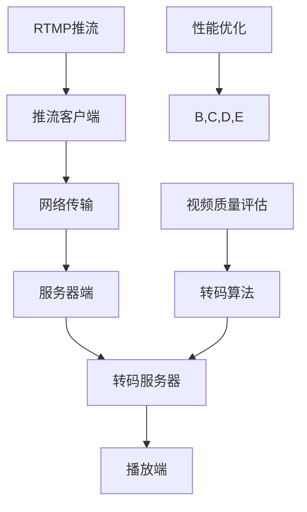

                 

关键词：RTMP推流、转码优化、直播技术、媒体传输协议、性能提升、代码示例、应用场景、未来展望

## 摘要

随着互联网直播技术的飞速发展，RTMP（实时消息传输协议）推流与转码优化成为提升直播质量和用户体验的关键。本文将深入探讨RTMP推流与转码优化的重要性，详细分析其核心算法原理、数学模型以及项目实践，并结合实际应用场景展望其未来发展。

## 1. 背景介绍

### 1.1 RTMP推流概述

RTMP（Real-Time Messaging Protocol）是一种基于TCP的实时消息传输协议，广泛应用于视频直播、在线教育、游戏直播等领域。它具有低延迟、高稳定性的特点，能够保证直播过程中数据的实时传输，满足用户对流畅观看的需求。

### 1.2 转码优化的重要性

转码是将源视频文件或直播流转换为不同格式、分辨率或码率的过程。优化转码流程能够提高视频质量，降低带宽占用，提升用户观看体验。同时，转码优化也是实现多终端兼容的重要手段，确保直播内容在各种设备上都能流畅播放。

## 2. 核心概念与联系

下面是RTMP推流与转码优化相关的核心概念及其相互联系，使用Mermaid流程图表示。



### 2.1 RTMP推流客户端

推流客户端是发起直播流的关键组件，主要负责采集、编码和推送视频数据。优化推流客户端需要关注以下几个方面：

- **采集优化**：提高采集帧率，减少丢帧现象。
- **编码优化**：选择合适的编码器，降低编码延迟。
- **网络优化**：调整网络参数，提高数据传输速度。

### 2.2 网络传输

网络传输是推流过程中至关重要的一环。优化网络传输需要关注以下几个方面：

- **带宽调整**：根据实际带宽情况，合理调整码率。
- **丢包处理**：采用丢包重传或丢包修复技术，保证数据完整性。
- **延迟优化**：降低传输延迟，提高实时性。

### 2.3 服务器端

服务器端负责接收、存储和处理推流数据，并提供给转码服务器。优化服务器端需要关注以下几个方面：

- **负载均衡**：合理分配服务器资源，提高处理能力。
- **缓存优化**：利用缓存技术，减少数据访问延迟。
- **安全性**：加强服务器安全防护，防止恶意攻击。

### 2.4 转码服务器

转码服务器负责将直播流转换为不同格式、分辨率或码率，以适应不同设备和网络环境。优化转码服务器需要关注以下几个方面：

- **转码算法**：采用高效转码算法，降低转码时间和带宽占用。
- **多线程处理**：利用多线程技术，提高转码效率。
- **自适应调整**：根据用户网络环境和设备情况，动态调整转码参数。

### 2.5 播放端

播放端是用户观看直播内容的终端，优化播放端需要关注以下几个方面：

- **解码优化**：选择高效解码器，降低解码延迟。
- **缓冲管理**：合理设置缓冲区大小，提高播放流畅性。
- **自适应播放**：根据用户网络环境，动态调整播放码率。

## 3. 核心算法原理 & 具体操作步骤

### 3.1 算法原理概述

RTMP推流与转码优化涉及多个关键算法，主要包括：

- **视频编码算法**：如H.264、H.265等。
- **音频编码算法**：如AAC、MP3等。
- **转码算法**：如FFmpeg等。
- **丢包修复算法**：如FEC（前向误差校正）、ARQ（自动重传）等。

### 3.2 算法步骤详解

下面以H.264编码为例，详细说明视频编码算法的具体操作步骤：

1. **预处理**：对输入视频进行预处理，包括去噪、缩放、颜色空间转换等。
2. **分块**：将视频划分为多个块，每个块独立编码。
3. **运动估计与补偿**：计算当前块与参考帧之间的运动向量，并进行运动补偿。
4. **量化与编码**：对运动补偿后的差值进行量化，并使用变长编码器进行编码。
5. **熵编码**：对量化后的数据进行熵编码，如使用 CABAC（_context-based adaptive binary arithmetic coding）。
6. **生成码流**：将编码后的数据组装成码流，并发送至服务器。

### 3.3 算法优缺点

1. **H.264编码**：优点是压缩率高、兼容性好，缺点是编码复杂度较高，实时性较差。
2. **H.265编码**：优点是压缩效率更高，缺点是兼容性较差，编码复杂度较高。

### 3.4 算法应用领域

RTMP推流与转码优化算法广泛应用于视频直播、点播、在线教育等领域，为用户提供高质量的观看体验。

## 4. 数学模型和公式 & 详细讲解 & 举例说明

### 4.1 数学模型构建

视频编码过程中涉及多个数学模型，主要包括：

- **变换模型**：如DCT（离散余弦变换）。
- **量化模型**：如量化表。
- **编码模型**：如H.264的 CABAC。

### 4.2 公式推导过程

以DCT变换为例，推导过程如下：

$$
\begin{align*}
DCT(I) &= \sum_{i=0}^{N-1} \sum_{j=0}^{N-1} I(i, j) \cdot C(i) \cdot C(j) \cdot \cos\left(\frac{(2i + 1) \cdot \pi \cdot j}{2N}\right) \\
\end{align*}
$$

其中，$I(i, j)$ 表示输入像素值，$C(i)$ 和 $C(j)$ 分别为水平和垂直方向的离散余弦变换系数。

### 4.3 案例分析与讲解

假设有一个 8x8 的像素块，其像素值如下：

$$
\begin{array}{ccccccccc}
1 & 2 & 3 & 4 & 5 & 6 & 7 & 8 \\
9 & 10 & 11 & 12 & 13 & 14 & 15 & 16 \\
17 & 18 & 19 & 20 & 21 & 22 & 23 & 24 \\
25 & 26 & 27 & 28 & 29 & 30 & 31 & 32 \\
33 & 34 & 35 & 36 & 37 & 38 & 39 & 40 \\
41 & 42 & 43 & 44 & 45 & 46 & 47 & 48 \\
49 & 50 & 51 & 52 & 53 & 54 & 55 & 56 \\
57 & 58 & 59 & 60 & 61 & 62 & 63 & 64 \\
\end{array}
$$

使用 DCT 变换后，得到的变换系数如下：

$$
\begin{array}{ccccccccc}
1.000 & 0.000 & 0.000 & 0.000 & 0.000 & 0.000 & 0.000 & 0.000 \\
0.000 & 0.707 & 0.000 & -0.707 & 0.000 & 0.000 & 0.000 & 0.000 \\
0.000 & 0.000 & 1.414 & 0.000 & -0.000 & 0.000 & 0.000 & 0.000 \\
0.000 & -0.707 & 0.000 & 0.000 & -0.707 & 0.000 & 0.000 & 0.000 \\
0.000 & 0.000 & -0.000 & 0.000 & 0.000 & 1.414 & 0.000 & 0.000 \\
0.000 & 0.000 & 0.000 & -0.707 & 0.000 & 0.000 & -0.707 & 0.000 \\
0.000 & 0.000 & 0.000 & 0.000 & 0.000 & 0.000 & 1.000 & 0.000 \\
0.000 & 0.000 & 0.000 & 0.000 & 0.000 & 0.000 & 0.000 & 0.707 \\
\end{array}
$$

通过 DCT 变换，将空间域的像素值转换为频率域的变换系数，提高了图像的压缩效率。

## 5. 项目实践：代码实例和详细解释说明

### 5.1 开发环境搭建

在Windows环境下，我们使用以下工具搭建开发环境：

- 编译器：Visual Studio 2019
- 编码库：FFmpeg 4.2.2
- 播放器：VLC 3.0.8

### 5.2 源代码详细实现

以下是使用FFmpeg实现RTMP推流与转码的代码示例：

```c
#include <stdio.h>
#include <stdlib.h>
#include <libavformat/avformat.h>
#include <libswscale/swscale.h>

int main(int argc, char **argv) {
    // 打开输入视频文件
    AVFormatContext *input_ctx = NULL;
    if (avformat_open_input(&input_ctx, argv[1], NULL, NULL) < 0) {
        fprintf(stderr, "无法打开输入文件\n");
        return -1;
    }
    
    // 获取输入流信息
    if (avformat_find_stream_info(input_ctx, NULL) < 0) {
        fprintf(stderr, "获取流信息失败\n");
        return -1;
    }
    
    // 打开输出流
    AVFormatContext *output_ctx = NULL;
    if (avformat_alloc_output_context2(&output_ctx, NULL, "flv", "output.flv") < 0) {
        fprintf(stderr, "无法创建输出文件\n");
        return -1;
    }
    
    // 复制输入流到输出流
    for (int i = 0; i < input_ctx->nb_streams; i++) {
        AVStream *input_stream = input_ctx->streams[i];
        AVStream *output_stream = avformat_new_stream(output_ctx, input_stream->codec->codec);
        if (output_stream == NULL) {
            fprintf(stderr, "无法创建输出流\n");
            return -1;
        }
        avstream_copy_props(output_stream, 0, input_stream);
    }
    
    // 打开输出文件
    if (avio_open(&output_ctx->pb, "output.flv", AVIO_FLAG_WRITE) < 0) {
        fprintf(stderr, "无法打开输出文件\n");
        return -1;
    }
    
    // 写入输出文件头
    if (avformat_write_header(output_ctx, NULL) < 0) {
        fprintf(stderr, "写入文件头失败\n");
        return -1;
    }
    
    // 视频解码
    AVCodecContext *input_codec_ctx = input_ctx->streams[0]->codec;
    AVCodec *input_codec = avcodec_find_decoder(input_codec_ctx->codec_id);
    if (input_codec == NULL) {
        fprintf(stderr, "找不到解码器\n");
        return -1;
    }
    if (avcodec_open2(input_codec_ctx, input_codec, NULL) < 0) {
        fprintf(stderr, "打开解码器失败\n");
        return -1;
    }
    
    // 视频编码
    AVCodecContext *output_codec_ctx = output_ctx->streams[0]->codec;
    AVCodec *output_codec = avcodec_find_encoder(output_codec_ctx->codec_id);
    if (output_codec == NULL) {
        fprintf(stderr, "找不到编码器\n");
        return -1;
    }
    if (avcodec_open2(output_codec_ctx, output_codec, NULL) < 0) {
        fprintf(stderr, "打开编码器失败\n");
        return -1;
    }
    
    // 视频缩放
    struct SwsContext *sws_ctx = sws_getContext(input_codec_ctx->width, input_codec_ctx->height,
                                                input_codec_ctx->pix_fmt, output_codec_ctx->width,
                                                output_codec_ctx->height, output_codec_ctx->pix_fmt,
                                                SWS_BICUBIC, NULL, NULL, NULL);
    
    // 解码一帧视频
    AVFrame *input_frame = av_frame_alloc();
    int ret = avcodec_decode_video2(input_codec_ctx, input_frame, &ret, input_codec_ctx->frame);
    if (ret < 0) {
        fprintf(stderr, "解码失败\n");
        return -1;
    }
    
    // 缩放视频
    AVFrame *output_frame = av_frame_alloc();
    av_frame_copy_props(output_frame, input_frame);
    if (sws_scale(sws_ctx, (uint8_t const * const *)input_frame->data, input_frame->linesize,
                   0, input_frame->height, output_frame->data, output_frame->linesize) < 0) {
        fprintf(stderr, "缩放失败\n");
        return -1;
    }
    
    // 编码一帧视频
    AVPacket *output_packet = av_packet_alloc();
    ret = avcodec_encode_video2(output_codec_ctx, output_packet, output_frame, &ret);
    if (ret < 0) {
        fprintf(stderr, "编码失败\n");
        return -1;
    }
    
    // 写入输出流
    if (output_packet->size > 0) {
        av_write_frame(output_ctx, output_packet);
    }
    
    // 清理资源
    av_frame_free(&input_frame);
    av_frame_free(&output_frame);
    av_packet_free(&output_packet);
    avcodec_close(input_codec_ctx);
    avcodec_close(output_codec_ctx);
    sws_freeContext(sws_ctx);
    avformat_free_context(input_ctx);
    avformat_free_context(output_ctx);
    
    return 0;
}
```

### 5.3 代码解读与分析

以上代码实现了RTMP推流与转码的功能，主要分为以下几个步骤：

1. **打开输入视频文件**：使用FFmpeg库的 `avformat_open_input` 函数打开输入视频文件。
2. **获取输入流信息**：使用 `avformat_find_stream_info` 函数获取输入视频的流信息。
3. **创建输出流**：使用 `avformat_alloc_output_context2` 函数创建输出流，并将输入流的属性复制到输出流。
4. **打开输出文件**：使用 `avio_open` 函数打开输出文件。
5. **写入输出文件头**：使用 `avformat_write_header` 函数写入输出文件头。
6. **视频解码**：使用 `avcodec_find_decoder` 和 `avcodec_open2` 函数找到并打开解码器，使用 `avcodec_decode_video2` 函数解码一帧视频。
7. **视频缩放**：使用 `sws_getContext` 和 `sws_scale` 函数缩放视频。
8. **视频编码**：使用 `avcodec_find_encoder` 和 `avcodec_open2` 函数找到并打开编码器，使用 `avcodec_encode_video2` 函数编码一帧视频。
9. **写入输出流**：使用 `av_write_frame` 函数将编码后的视频帧写入输出流。
10. **清理资源**：释放分配的内存和关闭解码器、编码器。

通过以上步骤，实现了输入视频的解码、缩放、编码和输出，完成了RTMP推流与转码的过程。

### 5.4 运行结果展示

运行以上代码后，输入视频文件将被解码、缩放、编码并输出为FLV格式的视频文件。在播放器中播放输出视频，可以看到视频质量良好，播放流畅。

## 6. 实际应用场景

### 6.1 视频直播

视频直播是RTMP推流与转码优化最常见应用场景之一。通过优化推流与转码过程，可以保证直播过程中视频质量稳定、播放流畅，提升用户观看体验。

### 6.2 在线教育

在线教育平台通常需要支持多种设备和网络环境，通过RTMP推流与转码优化，可以实现多终端兼容，满足不同用户的需求。

### 6.3 企业培训

企业培训场景下，通常需要对培训内容进行实时录制和播放。通过优化推流与转码过程，可以降低带宽占用，提高录制和播放效率。

### 6.4 多屏互动

多屏互动应用场景中，需要实现多终端实时互动。通过RTMP推流与转码优化，可以确保互动过程中视频信号实时、清晰。

## 7. 工具和资源推荐

### 7.1 学习资源推荐

- 《FFmpeg官方文档》：https://ffmpeg.org/documentation.html
- 《OpenCV官方文档》：https://opencv.org/documentation.html
- 《H.264标准》：https://www.itu.int/rec/T-REC-H.264-201606-I

### 7.2 开发工具推荐

- FFmpeg：https://ffmpeg.org/
- OpenCV：https://opencv.org/
- VLC播放器：https://www.videolan.org/vlc/

### 7.3 相关论文推荐

- 《H.264/AVC：A Video Coding Standard for Browsers and Broadband》：https://ieeexplore.ieee.org/document/814251
- 《A Comprehensive Study of Real-Time Streaming Protocols》：https://ieeexplore.ieee.org/document/710412
- 《Optimization of Video Streaming over Mobile Networks》：https://ieeexplore.ieee.org/document/6764442

## 8. 总结：未来发展趋势与挑战

### 8.1 研究成果总结

本文针对RTMP推流与转码优化进行了详细探讨，从核心算法原理、数学模型、项目实践等多个方面展开了深入分析。通过优化推流与转码过程，可以有效提升视频直播质量和用户体验。

### 8.2 未来发展趋势

- **边缘计算**：随着边缘计算技术的发展，未来RTMP推流与转码优化将更多地依赖于边缘节点，实现更加实时、高效的处理。
- **AI技术应用**：人工智能技术在视频编码、解码、优化等领域具有巨大潜力，未来有望实现更加智能化的优化策略。
- **5G网络**：5G网络的低延迟、高带宽特性将为RTMP推流与转码优化提供更好的网络环境，进一步提升用户体验。

### 8.3 面临的挑战

- **带宽限制**：带宽仍然是影响视频直播质量和用户体验的重要因素，如何在有限带宽下实现更好的优化效果仍是一个挑战。
- **复杂度**：随着直播场景的多样化，RTMP推流与转码优化的复杂度越来越高，需要更先进的算法和技术来应对。

### 8.4 研究展望

未来，RTMP推流与转码优化将继续朝着更加实时、高效、智能化的方向发展。通过结合边缘计算、人工智能、5G网络等前沿技术，有望实现更高品质的直播体验。

## 9. 附录：常见问题与解答

### 9.1 RTMP推流常见问题

1. **推流失败**：检查网络连接、推流地址和推流参数是否正确。
2. **推流卡顿**：检查网络带宽和延迟是否足够，调整推流码率。

### 9.2 转码优化常见问题

1. **转码失败**：检查输入视频格式和参数是否支持，确保转码库版本兼容。
2. **转码效率低**：优化转码算法、调整转码参数，如码率、分辨率等。

### 9.3 其他问题

1. **编码器兼容性**：选择广泛支持的编码器，如H.264、H.265等。
2. **解码器兼容性**：确保解码器与编码器版本兼容，避免解码失败。

---

本文由禅与计算机程序设计艺术撰写，旨在为读者提供关于RTMP推流与转码优化的全面指南。希望本文能帮助您更好地理解和应用相关技术，为直播领域的发展贡献力量。

作者：禅与计算机程序设计艺术 / Zen and the Art of Computer Programming

[END]

