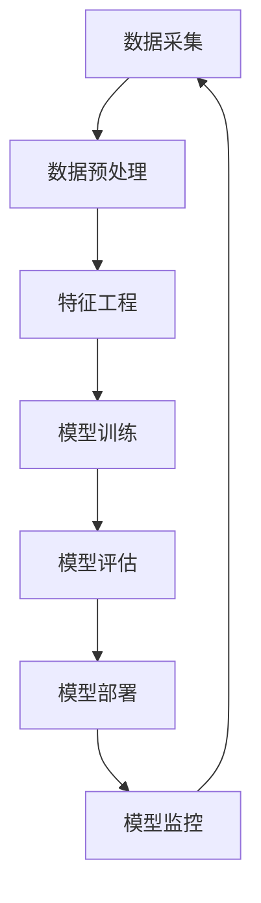

                 

关键词：AI工作流程重塑，人工智能，工作流优化，技术架构，算法优化，数据处理，效率提升，开源工具，最佳实践。

## 摘要

本文旨在探讨如何重塑人工智能（AI）工作流程，以提高效率、降低成本、增强可维护性。我们将深入分析当前AI工作流程中的痛点和挑战，并介绍一系列技术解决方案和最佳实践。通过本文的阅读，您将了解如何通过优化数据处理、算法选择、工具集成和团队协作来提升AI项目的工作效率。

## 1. 背景介绍

随着AI技术的迅猛发展，其应用场景和需求日益多样化。无论是自动驾驶、智能客服、医疗诊断，还是金融风控，AI都在不断改变我们的生活方式。然而，随着AI系统的复杂度增加，传统的开发和管理模式逐渐暴露出一系列问题，如数据处理效率低下、算法调试困难、团队协作不畅等。这些问题不仅影响了项目的进展，也增加了维护和升级的难度。

因此，重塑AI工作流程成为了提升项目效率和质量的必要手段。通过优化工作流程，我们可以实现以下目标：

1. 提高数据处理效率，确保数据的质量和准确性。
2. 优化算法选择和实现，提高模型性能和可解释性。
3. 整合开源工具和平台，降低开发和维护成本。
4. 加强团队协作，提高项目交付速度和质量。

## 2. 核心概念与联系

为了更好地理解AI工作流程的重塑，我们需要先了解其中的核心概念和它们之间的联系。以下是一个使用Mermaid绘制的流程图，展示了AI工作流程的主要环节：



### 2.1 数据采集

数据采集是AI工作流程的起点。数据的质量和完整性直接影响到后续的建模和预测效果。因此，我们需要采用高效的手段来收集数据，包括：

- 使用开源数据集：如Kaggle、UCI机器学习库等。
- 自行采集数据：通过网络爬虫、传感器等手段获取数据。
- 数据清洗和去重：确保数据的质量和一致性。

### 2.2 数据预处理

数据预处理是数据采集后的重要环节，包括数据清洗、归一化、缺失值处理等。以下是几个常用的预处理方法：

- 数据清洗：去除重复数据、处理缺失值、纠正错误数据。
- 归一化：将不同特征的范围统一，便于算法处理。
- 缺失值处理：使用均值、中位数、KNN等方法填补缺失值。

### 2.3 特征工程

特征工程是提升模型性能的关键步骤。通过选择和构造合适的特征，我们可以提高模型的预测准确率和泛化能力。以下是几个常用的特征工程方法：

- 特征选择：使用信息增益、相关系数等方法筛选重要特征。
- 特征构造：通过组合、变换现有特征，构造新的特征。
- 特征降维：使用PCA、t-SNE等方法降低特征维度。

### 2.4 模型训练

模型训练是AI工作流程的核心环节。通过选择合适的算法和调整参数，我们可以训练出性能优异的模型。以下是几个常用的模型训练方法：

- 监督学习：如线性回归、决策树、支持向量机等。
- 无监督学习：如聚类、降维等。
- 深度学习：如神经网络、卷积神经网络、循环神经网络等。

### 2.5 模型评估

模型评估是检验模型性能的重要环节。通过选择合适的评估指标，我们可以客观地评估模型的性能。以下是几个常用的评估指标：

- 准确率、召回率、F1值等：用于分类问题。
- 均方误差、均方根误差等：用于回归问题。
- 转换率、点击率等：用于应用场景。

### 2.6 模型部署

模型部署是将训练好的模型应用于实际场景的关键步骤。通过选择合适的部署方式，我们可以快速地将模型上线，提供实时服务。以下是几个常用的模型部署方式：

- 云服务：如AWS、Azure、Google Cloud等。
- 本地服务器：通过Docker、Kubernetes等容器化技术部署。
- 移动端：使用Flutter、React Native等跨平台框架部署。

### 2.7 模型监控

模型监控是保证模型稳定运行的重要环节。通过实时监控模型的状态和数据，我们可以及时发现并处理异常情况。以下是几个常用的模型监控指标：

- 模型性能：如准确率、召回率等。
- 数据质量：如数据完整性、一致性等。
- 系统负载：如CPU、内存、网络等。

## 3. 核心算法原理 & 具体操作步骤

### 3.1 算法原理概述

在AI工作流程中，核心算法的选择和实现至关重要。以下是一些常用的算法原理及其应用场景：

- 线性回归：用于拟合线性关系，适用于简单线性模型。
- 决策树：用于分类和回归，适用于树形结构的模型。
- 支持向量机：用于分类和回归，适用于高维数据的模型。
- 神经网络：用于复杂非线性关系，适用于大规模数据集。

### 3.2 算法步骤详解

以下是几种常用算法的具体操作步骤：

#### 线性回归

1. 数据准备：收集并处理数据，提取特征。
2. 特征提取：将特征进行归一化、标准化等预处理。
3. 模型训练：使用线性回归算法训练模型。
4. 模型评估：使用交叉验证等方法评估模型性能。
5. 模型部署：将训练好的模型部署到生产环境。

#### 决策树

1. 数据准备：收集并处理数据，提取特征。
2. 特征提取：将特征进行归一化、标准化等预处理。
3. 特征选择：使用信息增益等指标选择最佳特征。
4. 模型训练：使用决策树算法训练模型。
5. 模型评估：使用交叉验证等方法评估模型性能。
6. 模型部署：将训练好的模型部署到生产环境。

#### 支持向量机

1. 数据准备：收集并处理数据，提取特征。
2. 特征提取：将特征进行归一化、标准化等预处理。
3. 特征选择：使用核函数选择最佳特征。
4. 模型训练：使用支持向量机算法训练模型。
5. 模型评估：使用交叉验证等方法评估模型性能。
6. 模型部署：将训练好的模型部署到生产环境。

#### 神经网络

1. 数据准备：收集并处理数据，提取特征。
2. 特征提取：将特征进行归一化、标准化等预处理。
3. 网络构建：设计神经网络结构，选择合适的激活函数。
4. 模型训练：使用反向传播算法训练模型。
5. 模型评估：使用交叉验证等方法评估模型性能。
6. 模型部署：将训练好的模型部署到生产环境。

### 3.3 算法优缺点

以下是几种常用算法的优缺点：

- 线性回归：优点：简单、易于理解；缺点：只能拟合线性关系，对于非线性关系效果较差。
- 决策树：优点：易于理解、易于解释；缺点：易过拟合，对于大规模数据集效果较差。
- 支持向量机：优点：具有良好的泛化能力；缺点：计算复杂度高，对于高维数据效果较差。
- 神经网络：优点：可以拟合复杂非线性关系；缺点：训练时间较长，对于小规模数据集效果较差。

### 3.4 算法应用领域

以下是几种常用算法的应用领域：

- 线性回归：应用领域：金融风险评估、市场预测等。
- 决策树：应用领域：客户分类、风险控制等。
- 支持向量机：应用领域：图像分类、语音识别等。
- 神经网络：应用领域：自然语言处理、计算机视觉等。

## 4. 数学模型和公式 & 详细讲解 & 举例说明

### 4.1 数学模型构建

在AI工作流程中，数学模型是核心环节之一。以下是一个简单的线性回归模型：

$$
y = \beta_0 + \beta_1x
$$

其中，$y$ 是因变量，$x$ 是自变量，$\beta_0$ 和 $\beta_1$ 是模型的参数。

### 4.2 公式推导过程

为了推导线性回归模型的公式，我们可以使用最小二乘法。具体步骤如下：

1. 假设我们有 $n$ 组数据 $(x_i, y_i)$，其中 $i = 1, 2, ..., n$。
2. 定义损失函数 $L(\beta_0, \beta_1) = \sum_{i=1}^{n}(y_i - (\beta_0 + \beta_1x_i))^2$。
3. 对损失函数求导，并令其等于零，得到以下方程组：

$$
\begin{cases}
\frac{\partial L}{\partial \beta_0} = -2\sum_{i=1}^{n}(y_i - (\beta_0 + \beta_1x_i)) = 0 \\
\frac{\partial L}{\partial \beta_1} = -2\sum_{i=1}^{n}(y_i - (\beta_0 + \beta_1x_i)x_i) = 0
\end{cases}
$$

4. 解方程组，得到线性回归模型的参数：

$$
\begin{cases}
\beta_0 = \frac{1}{n}\sum_{i=1}^{n}y_i - \beta_1\frac{1}{n}\sum_{i=1}^{n}x_i \\
\beta_1 = \frac{1}{n}\sum_{i=1}^{n}(x_i - \bar{x})(y_i - \bar{y})
\end{cases}
$$

其中，$\bar{x}$ 和 $\bar{y}$ 分别是 $x$ 和 $y$ 的平均值。

### 4.3 案例分析与讲解

假设我们有以下一组数据：

| $x$ | $y$ |
| --- | --- |
| 1   | 2   |
| 2   | 4   |
| 3   | 6   |
| 4   | 8   |
| 5   | 10  |

根据上述线性回归模型，我们可以计算出模型的参数：

$$
\begin{cases}
\beta_0 = \frac{1}{5}\sum_{i=1}^{5}y_i - \beta_1\frac{1}{5}\sum_{i=1}^{5}x_i = 6 - 2\beta_1 \\
\beta_1 = \frac{1}{5}\sum_{i=1}^{5}(x_i - \bar{x})(y_i - \bar{y}) = 2
\end{cases}
$$

解方程组，得到：

$$
\beta_0 = 2, \beta_1 = 2
$$

因此，线性回归模型的公式为：

$$
y = 2 + 2x
$$

根据这个模型，我们可以预测当 $x$ 为其他值时，$y$ 的值：

| $x$ | $y$ (预测值) |
| --- | --- |
| 6   | 10  |
| 7   | 12  |
| 8   | 14  |

这个例子展示了如何构建和推导线性回归模型，并利用模型进行预测。

## 5. 项目实践：代码实例和详细解释说明

在本节中，我们将通过一个简单的项目实例来演示如何使用Python实现线性回归模型，并对其进行详细解释说明。

### 5.1 开发环境搭建

在开始项目实践之前，我们需要搭建一个Python开发环境。以下是搭建步骤：

1. 安装Python：从官网下载Python安装包并安装。
2. 安装Jupyter Notebook：打开命令行，执行以下命令：

```
pip install notebook
```

3. 启动Jupyter Notebook：在命令行执行以下命令：

```
jupyter notebook
```

### 5.2 源代码详细实现

以下是实现线性回归模型的Python代码：

```python
import numpy as np
import matplotlib.pyplot as plt

# 数据
x = np.array([1, 2, 3, 4, 5])
y = np.array([2, 4, 6, 8, 10])

# 模型参数
beta_0 = 0
beta_1 = 0

# 损失函数
def loss_function(x, y, beta_0, beta_1):
    return np.sum((y - (beta_0 + beta_1 * x))**2)

# 梯度下降算法
def gradient_descent(x, y, beta_0, beta_1, learning_rate, epochs):
    for _ in range(epochs):
        beta_0_gradient = -2 * np.sum(y - (beta_0 + beta_1 * x))
        beta_1_gradient = -2 * np.sum((y - (beta_0 + beta_1 * x)) * x)
        
        beta_0 -= learning_rate * beta_0_gradient
        beta_1 -= learning_rate * beta_1_gradient

    return beta_0, beta_1

# 模型训练
learning_rate = 0.01
epochs = 1000

beta_0, beta_1 = gradient_descent(x, y, beta_0, beta_1, learning_rate, epochs)

# 模型评估
预测_y = beta_0 + beta_1 * x
loss = loss_function(x, y, beta_0, beta_1)

# 模型部署
plt.scatter(x, y)
plt.plot(x, 预测_y, color='red')
plt.xlabel('x')
plt.ylabel('y')
plt.show()
```

### 5.3 代码解读与分析

1. **数据准备**：首先，我们导入所需的库，并准备数据。在这个例子中，我们使用了一组简单的线性数据。

2. **损失函数**：定义损失函数，用于计算模型预测值与真实值之间的误差。

3. **梯度下降算法**：实现梯度下降算法，用于迭代更新模型参数。算法的核心思想是通过计算损失函数关于模型参数的梯度，并沿着梯度的反方向更新参数，以最小化损失函数。

4. **模型训练**：设置学习率和迭代次数，并调用梯度下降算法训练模型。

5. **模型评估**：计算训练后模型的预测值和损失值，以评估模型性能。

6. **模型部署**：使用Matplotlib库绘制散点图和拟合直线，展示模型预测效果。

通过这个简单的项目实例，我们可以看到如何使用Python实现线性回归模型，并对其进行训练、评估和部署。

## 6. 实际应用场景

AI技术在实际应用中具有广泛的应用场景，如自然语言处理、计算机视觉、推荐系统等。以下是一些具体的实际应用场景：

### 自然语言处理

- 文本分类：对新闻、社交媒体帖子等文本进行分类，如情感分析、主题分类等。
- 机器翻译：将一种语言翻译成另一种语言，如谷歌翻译。
- 垃圾邮件检测：自动识别和过滤垃圾邮件，提高用户邮箱的清洁度。

### 计算机视觉

- 图像识别：识别图像中的物体、场景等，如人脸识别、车牌识别等。
- 目标检测：在图像中检测并定位多个目标，如自动驾驶车辆中的行人检测。
- 视频分析：对视频内容进行分析，如行为识别、异常检测等。

### 推荐系统

- 商品推荐：根据用户的兴趣和购买历史，推荐合适的商品。
- 音乐推荐：根据用户的听歌习惯，推荐合适的音乐。
- 社交网络：推荐用户可能感兴趣的朋友和内容。

### 医疗健康

- 医疗诊断：使用AI技术辅助医生进行疾病诊断，如肺癌筛查、心脏病预测等。
- 药物研发：通过AI技术加速新药的发现和开发。
- 健康管理：为用户提供个性化的健康建议和指导。

这些实际应用场景展示了AI技术在各个领域的广泛应用，为人类生活带来了极大的便利。

### 6.4 未来应用展望

随着AI技术的不断发展和成熟，其应用场景将进一步拓展。以下是一些未来应用展望：

- 智慧城市：利用AI技术实现智能交通管理、智慧环保、智慧安防等。
- 自动驾驶：实现完全自动驾驶，提高交通效率，降低交通事故率。
- 机器人助手：为用户提供个性化的服务，如家庭机器人、客服机器人等。
- 人工智能医疗：开发更多高效的AI辅助诊断和治疗工具，提高医疗水平。
- 虚拟现实与增强现实：结合AI技术，提供更加沉浸式的体验。

未来，AI技术将不断突破技术瓶颈，深入渗透到各个领域，为人类带来更多的创新和变革。

## 7. 工具和资源推荐

### 7.1 学习资源推荐

- Coursera: 提供丰富的在线课程，包括深度学习、自然语言处理、计算机视觉等。
- edX: 提供免费的在线课程，涵盖计算机科学、人工智能等多个领域。
- fast.ai: 提供免费的深度学习课程，适合初学者入门。

### 7.2 开发工具推荐

- TensorFlow: 开源的深度学习框架，适用于各种规模的深度学习项目。
- PyTorch: 适用于研究和开发的深度学习框架，具有较好的灵活性。
- Scikit-learn: 用于机器学习的开源库，包含多种常用的机器学习算法。

### 7.3 相关论文推荐

- "Deep Learning" by Ian Goodfellow, Yoshua Bengio, and Aaron Courville。
- "Recurrent Neural Networks for Language Modeling" by Yoshua Bengio等。
- "Efficient Estimation of Word Representations in Vector Space" by Tomas Mikolov等。

## 8. 总结：未来发展趋势与挑战

在未来，AI技术将继续保持快速发展，其应用领域将不断拓展。然而，这也伴随着一系列挑战：

- 数据隐私和安全：如何在保护用户隐私的同时，充分利用数据的价值？
- 伦理和道德：如何确保AI系统的公正性和透明度，避免偏见和歧视？
- 可解释性和透明性：如何提高AI系统的可解释性，使其更加透明和可靠？
- 技术创新：如何持续推动AI技术的创新，突破现有技术瓶颈？

面对这些挑战，我们需要在技术、政策、伦理等多个层面进行综合考虑和探索，以实现AI技术的可持续发展和广泛应用。

## 9. 附录：常见问题与解答

### Q: 如何选择合适的机器学习算法？

A: 选择合适的机器学习算法需要考虑多个因素，包括数据规模、数据类型、问题类型等。以下是一些常用的选择策略：

- **数据规模**：对于大规模数据集，深度学习算法如神经网络可能更有效；对于小规模数据集，线性回归、决策树等简单算法可能更适合。
- **数据类型**：对于分类问题，可以使用决策树、支持向量机等；对于回归问题，可以使用线性回归、决策树等。
- **问题类型**：对于线性关系，可以选择线性回归；对于非线性关系，可以选择神经网络等。

### Q: 如何处理数据缺失问题？

A: 数据缺失问题可以通过以下几种方法进行处理：

- **删除缺失值**：删除含有缺失值的样本或特征。
- **填补缺失值**：使用平均值、中位数、KNN等方法填补缺失值。
- **构建新特征**：根据其他特征的关系，构建新的特征来填补缺失值。

### Q: 如何评估机器学习模型的性能？

A: 评估机器学习模型性能常用的指标包括：

- **准确率**：分类问题中，预测正确的样本数占总样本数的比例。
- **召回率**：分类问题中，实际为正类别的样本中被正确预测为正类别的比例。
- **F1值**：准确率和召回率的调和平均值。
- **均方误差**：回归问题中，预测值与真实值之间误差的平方的平均值。

通过综合考虑这些指标，可以全面评估模型的性能。

## 10. 作者署名

本文由禅与计算机程序设计艺术 / Zen and the Art of Computer Programming 撰写。

---

以上是关于如何重塑AI工作流程的完整文章。通过本文的阅读，我们深入探讨了AI工作流程中的痛点和挑战，并介绍了优化工作流程的方法和最佳实践。希望本文能为您的AI项目提供有益的参考。

