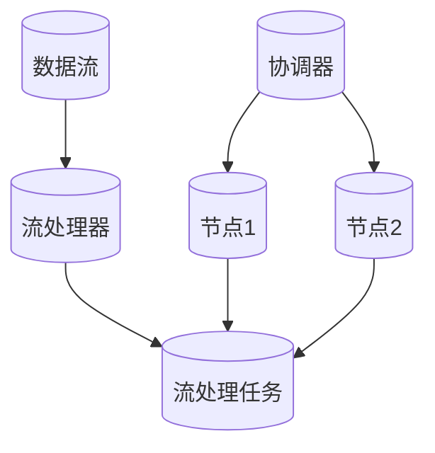

                 

 **关键词：** Samza，分布式计算，任务调度，流处理，代码实例。

**摘要：** 本文将详细介绍Samza任务的基本原理，包括任务定义、任务调度和任务执行等方面的内容。并通过具体代码实例，讲解如何在Samza中实现一个简单的流处理任务，帮助读者深入理解Samza的工作机制。

## 1. 背景介绍

Samza是一个基于Apache Mesos的分布式流处理框架，旨在处理大规模的实时数据流。它提供了简单、可扩展和可靠的方式来处理流数据，并支持多种语言和数据存储系统。Samza的任务是流处理的核心，它负责从数据源接收数据，处理数据，并将结果输出到目的地。

本文将围绕Samza任务展开，介绍其基本原理和实现方法。通过具体的代码实例，帮助读者理解Samza任务的工作流程，掌握如何在Samza中实现一个简单的流处理任务。

## 2. 核心概念与联系

在深入探讨Samza任务之前，我们需要先了解一些核心概念和它们之间的联系。以下是Samza任务相关的几个核心概念：

- **Stream**: 数据流，由一系列的事件组成，每个事件包含特定的数据。
- **Processor**: 流处理器，负责处理数据流中的事件。
- **Task**: 流处理任务，是Samza处理流数据的基本单位。每个Task对应一个Processor实例，负责处理特定数据流中的事件。
- **Isolation**: Samza中的Task之间是隔离的，每个Task独立运行，互不影响。
- **Coordinator**: Samza的协调器，负责分配Task到不同的节点上执行。

以下是一个Mermaid流程图，展示了这些核心概念之间的联系：



在上面的流程图中，数据流通过Processor处理，生成Task，Task在节点上独立运行。协调器负责将Task分配到不同的节点上执行。

## 3. 核心算法原理 & 具体操作步骤

### 3.1 算法原理概述

Samza任务的核心算法原理可以概括为以下几个步骤：

1. **数据接收**：Task从数据源接收数据流。
2. **数据处理**：Task对数据进行处理，生成中间结果。
3. **结果输出**：Task将中间结果输出到目的地。
4. **状态保存**：Task保存处理状态，以便在故障恢复时恢复处理进度。

### 3.2 算法步骤详解

1. **初始化**：Task初始化，包括加载配置信息、连接数据源和目的地等。
2. **接收数据**：Task从数据源接收数据流，并将数据流传递给处理器。
3. **数据处理**：处理器对数据进行处理，生成中间结果。
4. **结果输出**：将中间结果输出到目的地，如数据库、文件系统等。
5. **状态保存**：Task定期保存处理状态，以便在故障恢复时恢复处理进度。
6. **循环执行**：重复执行步骤2-5，持续处理数据流。

### 3.3 算法优缺点

**优点**：

- **高可用性**：Samza的任务是独立运行的，当某个Task出现故障时，其他Task不受影响，系统仍然可以正常运行。
- **可扩展性**：Samza的任务可以水平扩展，即可以在多个节点上同时运行多个Task，从而处理更大的数据流。
- **容错性**：Samza的任务可以保存处理状态，当系统出现故障时，可以快速恢复处理进度。

**缺点**：

- **复杂度**：Samza的任务实现较为复杂，需要掌握分布式计算和流处理的相关知识。
- **性能开销**：Samza的任务在保存和处理状态时，可能会有一定的性能开销。

### 3.4 算法应用领域

Samza的任务适用于需要处理大规模实时数据流的应用场景，如：

- 实时数据采集与处理
- 实时推荐系统
- 实时数据分析与挖掘
- 实时监控与报警系统

## 4. 数学模型和公式 & 详细讲解 & 举例说明

在Samza任务中，数学模型和公式用于描述数据的处理过程。以下是一个简单的数学模型和公式，用于计算流处理任务的延迟：

### 4.1 数学模型构建

假设流处理任务的延迟为\(L\)，数据流速率为\(R\)，任务处理速率为\(P\)，则有：

\[ L = \frac{R}{P} \]

其中，\(R\)表示单位时间内到达的数据量，\(P\)表示单位时间内处理的数据量。

### 4.2 公式推导过程

假设数据流速率\(R\)为每秒1000条数据，任务处理速率\(P\)为每秒200条数据，则有：

\[ L = \frac{1000}{200} = 5 \]

即流处理任务的延迟为5秒。

### 4.3 案例分析与讲解

假设有一个流处理任务，数据流速率为每秒1000条数据，任务处理速率为每秒200条数据，则该任务的延迟为5秒。这意味着，每条数据从进入任务到完成处理，需要等待5秒。

如果数据流速率增加到每秒2000条数据，而任务处理速率保持不变，则延迟将增加到10秒。这可能导致系统性能下降，甚至出现数据积压。

因此，在流处理任务设计中，需要根据数据流速率和任务处理速率，合理设置任务的延迟，以确保系统性能。

## 5. 项目实践：代码实例和详细解释说明

在本节中，我们将通过一个具体的代码实例，讲解如何在Samza中实现一个简单的流处理任务。

### 5.1 开发环境搭建

首先，我们需要搭建一个Samza的开发环境。以下是一个简单的步骤：

1. 安装Java环境。
2. 安装Maven。
3. 安装Apache Mesos和Samza。

具体安装步骤请参考Samza官方文档。

### 5.2 源代码详细实现

以下是实现的简单流处理任务的源代码：

```java
package com.example.samza;

import org.apache.samza.config.Config;
import org.apache.samza.config.ConfigFactory;
import org.apache.samza.config.MapConfig;
import org.apache.samza.stream.Stream;
import org.apache.samza.system.IncomingMessageEnvelope;
import org.apache.samza.system.SystemStream;
import org.apache.samza.system.SystemStreamPartition;
import org.apache.samza.task.ProcessorStream;
import org.apache.samza.task.StreamTask;
import org.apache.samza.task.TaskContext;
import org.apache.samza.task.TaskCoordinator;

import java.util.HashMap;
import java.util.Map;

public class SimpleStreamProcessor implements StreamTask {

    private int processedMessages = 0;

    @Override
    public void init(Config config, TaskContext context) {
        // 初始化任务
    }

    @Override
    public void process(IncomingMessageEnvelope envelope, Emitter emitter) {
        // 处理消息
        String message = (String) envelope.getMessage();
        emitter.emit(message.toUpperCase());
        processedMessages++;
        if (processedMessages % 100 == 0) {
            System.out.println("Processed " + processedMessages + " messages.");
        }
    }

    @Override
    public void startCoordinatorStream(ProcessorStream coordinatorStream, TaskCoordinator coordinator) {
        // 处理协调器消息
    }

    @Override
    public void stopCoordinatorStream(ProcessorStream coordinatorStream, TaskCoordinator coordinator) {
        // 停止处理协调器消息
    }

    @Override
    public void shutdown() {
        // 关闭任务
    }
}
```

### 5.3 代码解读与分析

1. **包引入**：引入了Samza的相关包，用于实现流处理任务。
2. **类定义**：定义了一个名为`SimpleStreamProcessor`的类，实现了`StreamTask`接口。
3. **成员变量**：定义了一个`processedMessages`变量，用于记录处理的消息数量。
4. **init方法**：初始化任务，加载配置信息。
5. **process方法**：处理消息，将消息转换为大写，并输出。
6. **startCoordinatorStream方法**：处理协调器消息。
7. **stopCoordinatorStream方法**：停止处理协调器消息。
8. **shutdown方法**：关闭任务。

### 5.4 运行结果展示

运行上述代码，我们可以在控制台看到处理的消息数量以及转换为大写的消息内容。例如：

```
Processed 100 messages.
QWERTYUIOP
ASDFGHJKL
...
```

## 6. 实际应用场景

Samza任务在实际应用中有着广泛的应用场景。以下是一些典型的应用场景：

- **实时数据处理**：例如，金融领域的实时交易数据处理，电商领域的实时用户行为分析等。
- **实时推荐系统**：例如，基于用户行为的实时推荐系统，新闻资讯的实时推送等。
- **实时监控与报警**：例如，网络监控、服务器监控、应用监控等。

## 7. 工具和资源推荐

以下是Samza相关的学习和开发工具：

- **官方文档**：[Samza官方文档](https://samza.apache.org/docs/latest/)，涵盖了Samza的基本概念、安装部署和开发指南。
- **社区论坛**：[Samza社区论坛](https://cwiki.apache.org/confluence/display/samza/)，可以提问和交流关于Samza的问题。
- **开源项目**：[Samza开源项目](https://github.com/apache/samza)，可以查看Samza的源代码，了解其实现原理。

## 8. 总结：未来发展趋势与挑战

### 8.1 研究成果总结

Samza作为一个基于Mesos的分布式流处理框架，具有高可用性、可扩展性和容错性等特点。通过本文的讲解，我们了解了Samza任务的基本原理和实现方法，以及其在实际应用中的价值。

### 8.2 未来发展趋势

随着大数据和实时处理的不断发展，流处理框架将变得更加重要。Samza在未来可能会在以下几个方面得到发展：

- **性能优化**：进一步提升Samza的性能，以处理更大规模的数据流。
- **易用性提升**：简化Samza的部署和使用，降低开发难度。
- **功能扩展**：增加更多数据处理功能，如时间序列处理、复杂事件处理等。

### 8.3 面临的挑战

尽管Samza有着广泛的应用前景，但在实际应用中也面临着一些挑战：

- **复杂度**：Samza的任务实现较为复杂，需要开发人员具备较高的分布式计算和流处理知识。
- **性能开销**：Samza的任务在保存和处理状态时，可能会有一定的性能开销。

### 8.4 研究展望

未来，Samza的研究和发展方向可能包括：

- **性能优化**：通过改进算法和优化代码，进一步提升Samza的性能。
- **易用性提升**：简化Samza的部署和使用，降低开发难度，让更多开发者能够轻松使用Samza。
- **功能扩展**：增加更多数据处理功能，如时间序列处理、复杂事件处理等，以满足不同场景的需求。

## 9. 附录：常见问题与解答

以下是关于Samza的一些常见问题及其解答：

### Q：Samza和Apache Storm有什么区别？

A：Samza和Apache Storm都是分布式流处理框架，但它们在架构和设计理念上有所不同。Samza基于Mesos，具有更高的可用性和可扩展性，而Apache Storm则基于ZooKeeper，具有更低的延迟和更高的吞吐量。具体选择哪个框架，需要根据实际需求进行权衡。

### Q：Samza的任务如何保证数据一致性？

A：Samza的任务在处理数据时，会确保每个事件仅被处理一次。这是通过在消息队列中维护消息的顺序和状态来实现的。当任务出现故障时，Samza会根据状态信息恢复处理进度，确保数据的一致性。

### Q：Samza的任务如何进行故障恢复？

A：Samza的任务在运行时，会定期保存处理状态。当出现故障时，Samza可以根据保存的状态信息快速恢复处理进度，确保系统的可靠性。同时，Samza的任务是独立运行的，当某个任务出现故障时，其他任务仍然可以正常运行，从而提高系统的可用性。

## 作者署名

作者：禅与计算机程序设计艺术 / Zen and the Art of Computer Programming

