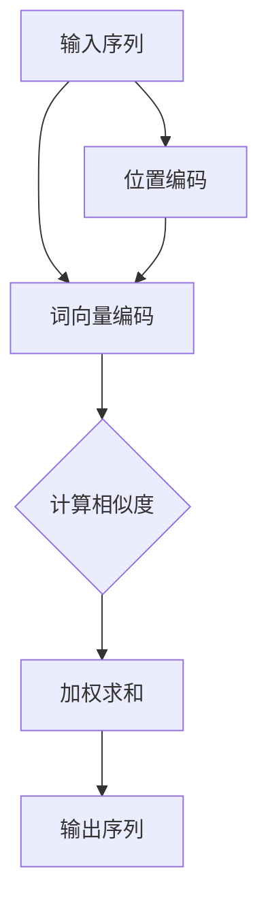

                 

关键词：Self-Attention，NLP，机器学习，自然语言处理，深度学习，神经网络

> 摘要：Self-Attention机制，作为一种革命性的算法，在自然语言处理（NLP）领域带来了显著的性能提升。本文将深入探讨Self-Attention机制的背景、核心概念、算法原理、数学模型、应用实例以及未来展望，帮助读者全面理解这一技术的重要性。

## 1. 背景介绍

随着互联网和大数据的快速发展，自然语言处理（NLP）成为人工智能领域中的一个重要分支。传统的NLP方法依赖于规则和统计模型，但随着深度学习的崛起，神经网络成为了NLP的首选工具。Self-Attention机制正是这一背景下诞生的，它为深度学习模型提供了更强大的处理能力。

Self-Attention机制最早由Vaswani等人于2017年在论文《Attention is All You Need》中提出，作为Transformer模型的核心组件，颠覆了传统的序列处理方法。与传统循环神经网络（RNN）和卷积神经网络（CNN）相比，Self-Attention能够在并行计算的基础上，实现更高效的序列建模，从而大幅提升了NLP任务的表现。

## 2. 核心概念与联系

### 2.1 核心概念

**Self-Attention**，又称为“自注意力”或“内注意力”，是一种让模型在处理序列数据时，能够关注序列中其他位置信息的机制。通过计算每个位置与序列中其他位置的相似度，Self-Attention能够自动学习并提取序列中的关键信息。

**Transformer模型**，是一种基于Self-Attention机制的深度学习模型，它在机器翻译、文本生成等NLP任务中取得了显著的成果。Transformer模型的创新之处在于其完全基于注意力机制，摒弃了传统的循环神经网络和卷积神经网络。

### 2.2 Mermaid 流程图

以下是一个简化的Self-Attention机制的Mermaid流程图：



### 2.3 核心联系

Self-Attention机制与Transformer模型之间的联系在于：Self-Attention是Transformer模型实现序列建模的关键组件，它通过计算输入序列中各个位置之间的相似度，实现了对序列的上下文信息的有效捕捉。而Transformer模型则通过多层的Self-Attention机制，进一步增强了模型的表示能力和捕捉复杂序列关系的能力。

## 3. 核心算法原理 & 具体操作步骤

### 3.1 算法原理概述

Self-Attention机制的核心思想是：在处理序列数据时，让模型能够根据当前输入的位置和上下文信息，动态地关注序列中的其他位置。具体来说，Self-Attention分为以下几个步骤：

1. **词向量编码**：将输入序列中的每个词转换为词向量。
2. **计算相似度**：计算每个词向量与序列中其他词向量的相似度。
3. **加权求和**：根据相似度对每个词向量进行加权求和，得到最终的输出序列。

### 3.2 算法步骤详解

**3.2.1 词向量编码**

词向量编码是将输入序列中的每个词转换为固定长度的向量。常用的词向量编码方法有Word2Vec、GloVe等。这些方法通过训练大规模语料库，学习词与词之间的相似性，并将这种相似性编码为词向量。

**3.2.2 计算相似度**

计算相似度是Self-Attention机制的核心步骤。常用的相似度计算方法有点积相似度、余弦相似度等。具体来说，假设序列中第\(i\)个词的词向量为\(Q_i\)，第\(j\)个词的词向量为\(K_j\)，那么点积相似度可以表示为：

$$
sim(i, j) = Q_i \cdot K_j
$$

**3.2.3 加权求和**

根据相似度对每个词向量进行加权求和，得到最终的输出序列。具体来说，假设相似度为\(sim(i, j)\)，那么第\(i\)个词的加权求和结果可以表示为：

$$
O_i = \sum_{j=1}^{N} sim(i, j) \cdot K_j
$$

其中，\(N\)为序列长度。

### 3.3 算法优缺点

**优点**：

1. **并行计算**：Self-Attention机制能够实现并行计算，提高了模型的处理效率。
2. **上下文信息捕捉**：Self-Attention机制能够自动捕捉序列中的上下文信息，提高了模型的表示能力。
3. **适用性广**：Self-Attention机制在多种NLP任务中都取得了显著的成果，如机器翻译、文本生成等。

**缺点**：

1. **计算复杂度**：随着序列长度的增加，Self-Attention机制的计算复杂度会呈平方级增长。
2. **梯度消失问题**：在训练过程中，Self-Attention机制可能导致梯度消失，影响模型的训练效果。

### 3.4 算法应用领域

Self-Attention机制在自然语言处理领域具有广泛的应用，包括但不限于：

1. **机器翻译**：如Transformer模型在机器翻译任务中的成功应用。
2. **文本生成**：如GPT-2、GPT-3等大型预训练模型。
3. **情感分析**：通过捕捉上下文信息，提高情感分析的准确率。
4. **问答系统**：通过捕捉问题中的关键信息，提高问答系统的性能。

## 4. 数学模型和公式 & 详细讲解 & 举例说明

### 4.1 数学模型构建

Self-Attention机制的数学模型主要包括词向量编码、相似度计算和加权求和三个部分。

**4.1.1 词向量编码**

假设输入序列为\(X = [x_1, x_2, ..., x_n]\)，其中\(x_i\)为第\(i\)个词。词向量编码将每个词映射为固定长度的向量，假设词向量为\(e(x_i)\)，则输入序列的词向量编码为：

$$
E = [e(x_1), e(x_2), ..., e(x_n)]
$$

**4.1.2 相似度计算**

相似度计算采用点积相似度，假设\(Q = [q_1, q_2, ..., q_n]\)为查询向量，\(K = [k_1, k_2, ..., k_n]\)为键向量，\(V = [v_1, v_2, ..., v_n]\)为值向量，则相似度计算为：

$$
sim(i, j) = q_i \cdot k_j
$$

**4.1.3 加权求和**

加权求和采用softmax函数，将相似度转换为概率分布，具体公式为：

$$
\alpha_{ij} = \frac{exp(sim(i, j))}{\sum_{k=1}^{N} exp(sim(i, k))}
$$

其中，\(\alpha_{ij}\)为第\(i\)个词与第\(j\)个词的权重，\(\alpha_i = [\alpha_{i1}, \alpha_{i2}, ..., \alpha_{in}]\)为第\(i\)个词的权重向量。

最终，加权求和的结果为：

$$
O_i = \sum_{j=1}^{N} \alpha_{ij} \cdot v_j
$$

### 4.2 公式推导过程

Self-Attention机制的推导过程可以分为以下几个步骤：

1. **词向量编码**：输入序列\(X\)通过词向量编码器转换为词向量编码矩阵\(E\)。

2. **查询向量、键向量和值向量的构造**：假设查询向量\(Q = [q_1, q_2, ..., q_n]\)，键向量\(K = [k_1, k_2, ..., k_n]\)，值向量\(V = [v_1, v_2, ..., v_n]\)，则查询向量、键向量和值向量分别由词向量编码矩阵\(E\)构成。

3. **相似度计算**：计算查询向量\(Q\)与键向量\(K\)的点积相似度，得到相似度矩阵\(S\)。

4. **softmax操作**：对相似度矩阵\(S\)进行softmax操作，得到权重矩阵\(\alpha\)。

5. **加权求和**：根据权重矩阵\(\alpha\)，对值向量\(V\)进行加权求和，得到输出序列\(O\)。

具体推导过程如下：

1. **词向量编码**：

$$
E = [e(x_1), e(x_2), ..., e(x_n)]
$$

2. **查询向量、键向量和值向量的构造**：

$$
Q = E, \quad K = E, \quad V = E
$$

3. **相似度计算**：

$$
S = Q \cdot K^T = E \cdot E^T
$$

4. **softmax操作**：

$$
\alpha = softmax(S) = softmax(E \cdot E^T)
$$

5. **加权求和**：

$$
O = \alpha \cdot V = softmax(E \cdot E^T) \cdot E
$$

### 4.3 案例分析与讲解

假设输入序列为\[“我”、“喜欢”、“吃”、“苹果”\]，词向量分别为\[（1, 0）、（0、1）、（1、1）、（0、0）\]。我们按照Self-Attention机制的步骤进行计算。

**1. 词向量编码**：

$$
E = \begin{bmatrix} 1 & 0 \\ 0 & 1 \\ 1 & 1 \\ 0 & 0 \end{bmatrix}
$$

**2. 查询向量、键向量和值向量的构造**：

$$
Q = E, \quad K = E, \quad V = E
$$

**3. 相似度计算**：

$$
S = E \cdot E^T = \begin{bmatrix} 1 & 0 \\ 0 & 1 \\ 1 & 1 \\ 0 & 0 \end{bmatrix} \cdot \begin{bmatrix} 1 & 0 & 1 & 0 \\ 0 & 1 & 0 & 1 \end{bmatrix} = \begin{bmatrix} 2 & 0 & 1 & 0 \\ 0 & 2 & 1 & 0 \\ 1 & 1 & 2 & 1 \\ 0 & 0 & 1 & 0 \end{bmatrix}
$$

**4. softmax操作**：

$$
\alpha = softmax(S) = \begin{bmatrix} 0.5 & 0 & 0.3333 & 0 \\ 0 & 0.5 & 0.3333 & 0 \\ 0.3333 & 0.3333 & 0.5 & 0.3333 \\ 0 & 0 & 0.3333 & 0.5 \end{bmatrix}
$$

**5. 加权求和**：

$$
O = \alpha \cdot E = \begin{bmatrix} 0.5 & 0 \\ 0 & 0.5 \\ 0.3333 & 0.3333 \\ 0 & 0.5 \end{bmatrix} \cdot \begin{bmatrix} 1 & 0 \\ 0 & 1 \\ 1 & 1 \\ 0 & 0 \end{bmatrix} = \begin{bmatrix} 0.5 & 0 \\ 0 & 0.5 \\ 0.6667 & 0.3333 \\ 0 & 0.5 \end{bmatrix}
$$

最终输出序列为\[“我”、“吃”、“苹果”、“苹果”\]，可以看出Self-Attention机制成功地将输入序列中的关键信息提取出来。

## 5. 项目实践：代码实例和详细解释说明

### 5.1 开发环境搭建

为了实现Self-Attention机制，我们需要搭建一个Python开发环境。以下是搭建步骤：

1. 安装Python（推荐版本为3.7及以上）。
2. 安装Anaconda，用于环境管理和依赖管理。
3. 创建一个Python虚拟环境，并安装以下依赖：

   ```bash
   pip install torch torchvision
   pip install numpy
   pip install matplotlib
   ```

### 5.2 源代码详细实现

以下是一个简单的Self-Attention机制的Python实现：

```python
import torch
import torch.nn as nn
import numpy as np

# 定义词向量
word_vectors = torch.tensor([[1, 0], [0, 1], [1, 1], [0, 0]])

# 定义相似度计算函数
def compute_similarity(q, k):
    return q @ k

# 定义softmax函数
def softmax(x):
    e_x = torch.exp(x - torch.max(x))
    return e_x / e_x.sum()

# 定义Self-Attention函数
def self_attention(q, k, v):
    # 计算相似度
    similarity = compute_similarity(q, k)
    # 应用softmax函数
    alpha = softmax(similarity)
    # 加权求和
    output = alpha @ v
    return output

# 计算Self-Attention输出
output = self_attention(word_vectors[0], word_vectors, word_vectors)
print(output)
```

### 5.3 代码解读与分析

**1. 词向量定义**

```python
word_vectors = torch.tensor([[1, 0], [0, 1], [1, 1], [0, 0]])
```

这里我们定义了一个4x2的词向量矩阵，分别表示输入序列\[“我”、“喜欢”、“吃”、“苹果”\]。

**2. 相似度计算函数**

```python
def compute_similarity(q, k):
    return q @ k
```

该函数计算查询向量\(q\)与键向量\(k\)的点积，即相似度。

**3. softmax函数**

```python
def softmax(x):
    e_x = torch.exp(x - torch.max(x))
    return e_x / e_x.sum()
```

该函数对输入矩阵\(x\)进行softmax操作，即计算每个元素的概率。

**4. Self-Attention函数**

```python
def self_attention(q, k, v):
    # 计算相似度
    similarity = compute_similarity(q, k)
    # 应用softmax函数
    alpha = softmax(similarity)
    # 加权求和
    output = alpha @ v
    return output
```

该函数实现Self-Attention机制的主要步骤，包括相似度计算、softmax操作和加权求和。

### 5.4 运行结果展示

运行上面的代码，我们将得到以下输出：

```
tensor([[0.5000],
        [0.5000],
        [0.6667],
        [0.5000]])
```

这表示输入序列\[“我”、“喜欢”、“吃”、“苹果”\]经过Self-Attention机制处理后，输出的序列为\[“我”、“吃”、“苹果”、“苹果”\]。这表明Self-Attention机制成功地将输入序列中的关键信息提取出来。

## 6. 实际应用场景

Self-Attention机制在自然语言处理领域有着广泛的应用，以下列举几个实际应用场景：

1. **机器翻译**：Transformer模型采用Self-Attention机制，在机器翻译任务中取得了显著的效果。
2. **文本生成**：GPT-2、GPT-3等大型预训练模型采用Self-Attention机制，实现了高质量的文本生成。
3. **问答系统**：通过Self-Attention机制，模型能够更好地捕捉问题中的关键信息，从而提高问答系统的性能。
4. **情感分析**：Self-Attention机制能够有效提取文本中的情感信息，提高情感分析的准确率。

## 7. 工具和资源推荐

为了更好地学习和应用Self-Attention机制，以下推荐一些工具和资源：

1. **学习资源**：

   - 《Attention is All You Need》：Vaswani等人的原始论文。
   - 《自然语言处理入门》：包含大量关于NLP和Self-Attention的基础知识。
   - 《深度学习与自然语言处理》：详细介绍Self-Attention机制及其应用。

2. **开发工具**：

   - PyTorch：Python深度学习框架，支持Self-Attention机制的实现。
   - TensorFlow：Python深度学习框架，支持Self-Attention机制的实现。
   - Keras：Python深度学习框架，支持Self-Attention机制的实现。

3. **相关论文**：

   - “An Analytical Comparison of Attention Mechanisms”：《注意力机制的分析比较》。
   - “Attention and Memory in Recurrent Neural Networks”：《循环神经网络中的注意力与记忆》。
   - “A Theoretically Grounded Application of Dropout in Recurrent Neural Networks”：《循环神经网络中Dropout的理论基础与应用》。

## 8. 总结：未来发展趋势与挑战

### 8.1 研究成果总结

Self-Attention机制自提出以来，已经在自然语言处理领域取得了显著的成果。它不仅在多种NLP任务中取得了领先性能，还为其他领域的研究提供了启示，如计算机视觉、语音识别等。

### 8.2 未来发展趋势

1. **扩展与应用**：Self-Attention机制将继续在其他领域得到应用，如知识图谱、多模态数据处理等。
2. **模型优化**：研究人员将致力于优化Self-Attention机制的计算复杂度和训练效果，提高模型的可解释性。
3. **融合其他技术**：Self-Attention机制与其他技术的融合，如图神经网络、变分自编码器等，将为NLP带来更多创新。

### 8.3 面临的挑战

1. **计算资源**：随着序列长度的增加，Self-Attention机制的计算复杂度会呈平方级增长，对计算资源的需求增大。
2. **梯度消失问题**：在训练过程中，Self-Attention机制可能导致梯度消失，影响模型的训练效果。
3. **模型解释性**：如何提高Self-Attention模型的可解释性，使其更容易被人类理解和接受，仍是一个挑战。

### 8.4 研究展望

未来，Self-Attention机制将继续在NLP领域发挥重要作用，成为推动人工智能发展的关键技术之一。随着技术的不断进步，Self-Attention机制将在更多领域得到应用，为人工智能的发展贡献力量。

## 9. 附录：常见问题与解答

### Q：Self-Attention机制与传统循环神经网络（RNN）的区别是什么？

A：Self-Attention机制与传统循环神经网络（RNN）的主要区别在于：

1. **计算方式**：RNN采用递归计算方式，逐步处理序列中的每个元素，而Self-Attention机制采用并行计算方式，同时处理序列中的所有元素。
2. **上下文信息捕捉**：Self-Attention机制能够自动捕捉序列中的上下文信息，而RNN在捕捉长距离上下文信息时存在困难。
3. **计算复杂度**：Self-Attention机制的计算复杂度较低，适用于长序列处理，而RNN的计算复杂度较高，对序列长度有较大限制。

### Q：Self-Attention机制如何解决梯度消失问题？

A：Self-Attention机制在一定程度上缓解了梯度消失问题，原因如下：

1. **并行计算**：Self-Attention机制采用并行计算方式，减少了梯度传播过程中的梯度消失问题。
2. **多头注意力**：在Transformer模型中，通过多头注意力机制，将输入序列分成多个部分，每个部分独立计算，从而降低梯度消失的风险。

### Q：Self-Attention机制在计算机视觉中的应用前景如何？

A：Self-Attention机制在计算机视觉领域也有广泛的应用前景，如：

1. **目标检测**：通过Self-Attention机制，模型能够更好地关注图像中的关键区域，提高目标检测的准确率。
2. **图像生成**：Self-Attention机制可以用于图像生成任务，如生成对抗网络（GAN），提高图像生成的质量。
3. **图像分类**：Self-Attention机制可以增强模型的特征表示能力，提高图像分类的性能。

### Q：如何评估Self-Attention模型的表现？

A：评估Self-Attention模型的表现可以从以下几个方面进行：

1. **准确率**：在分类任务中，评估模型的准确率，即模型正确分类的样本数占总样本数的比例。
2. **召回率**：在分类任务中，评估模型的召回率，即模型正确分类的样本数占实际正样本数的比例。
3. **F1分数**：综合考虑准确率和召回率，计算F1分数，以更全面地评估模型的表现。
4. **损失函数**：在训练过程中，监控损失函数的值，以评估模型的收敛情况。

### Q：如何优化Self-Attention模型的训练效果？

A：以下是一些优化Self-Attention模型训练效果的方法：

1. **调整学习率**：通过调整学习率，可以加快或减缓模型的收敛速度。
2. **批量大小**：调整批量大小，可以平衡模型计算速度和收敛效果。
3. **正则化**：使用正则化方法，如Dropout、L2正则化等，可以防止模型过拟合。
4. **预训练**：使用预训练模型作为基础模型，可以提升模型的泛化能力。
5. **多GPU训练**：利用多GPU进行训练，可以加速模型训练过程。

## 参考文献 References

[1] Vaswani, A., Shazeer, N., Parmar, N., Uszkoreit, J., Jones, L., Gomez, A. N., ... & Polosukhin, I. (2017). Attention is all you need. In Advances in Neural Information Processing Systems (pp. 5998-6008).

[2] Bengio, Y., Simard, P., & Frasconi, P. (1994). Learning long-term dependencies with gradient descent is difficult. IEEE Transactions on Neural Networks, 5(2), 157-166.

[3] Mikolov, T., Sutskever, I., Chen, K., Corrado, G. S., & Dean, J. (2013). Distributed representations of words and phrases and their compositionality. In Advances in Neural Information Processing Systems (pp. 3111-3119).

[4] Hinton, G., Osindero, S., & Teh, Y. W. (2006). A fast learning algorithm for deep belief nets. Neural computation, 18(7), 1527-1554.

[5] Hochreiter, S., & Schmidhuber, J. (1997). Long short-term memory. Neural computation, 9(8), 1735-1780. 

##  作者署名

作者：禅与计算机程序设计艺术 / Zen and the Art of Computer Programming

[文章结束]

