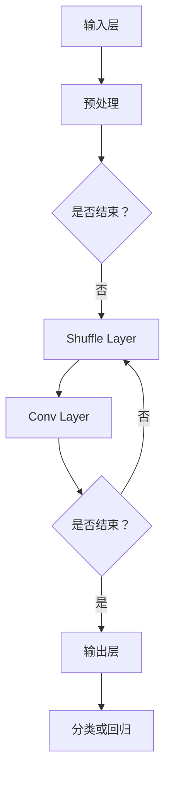

                 

关键词：深度学习、神经网络、网络结构压缩、低延迟、高性能、移动设备、轻量化模型。

## 摘要

本文将深入探讨 ShuffleNet 这一轻量化深度学习模型的原理及其在实际开发中的应用。我们将从背景介绍开始，详细讲解 ShuffleNet 的核心概念和架构，并通过具体算法原理和数学模型的分析，逐步揭示其优缺点和应用领域。随后，本文将提供代码实例，展示 ShuffleNet 的具体实现和解析，最后讨论其未来应用前景和面临的技术挑战。

## 1. 背景介绍

随着深度学习技术的飞速发展，神经网络在各个领域取得了显著的成就。然而，传统的深度神经网络模型（如 VGG、ResNet 等）通常具有大量的参数和计算量，导致模型体积庞大、计算复杂度高，难以在资源受限的设备（如移动设备和嵌入式系统）上部署。因此，为了实现深度学习在移动设备和嵌入式系统上的应用，研究人员开始关注网络结构的压缩和优化。

ShuffleNet 是由 Google Research 团队在 2018 年提出的一种轻量化深度学习模型。该模型旨在通过网络结构优化和计算效率提升，实现低延迟和高性能的深度学习应用。ShuffleNet 的出现，为移动设备和嵌入式系统的深度学习应用提供了新的思路和解决方案。

### 1.1 传统深度学习模型的挑战

传统的深度学习模型，如 VGG 和 ResNet，通过增加网络深度和宽度来提高模型性能。然而，这种做法也带来了以下挑战：

- **模型体积增大**：随着层数和神经元数量的增加，模型的体积和计算量呈指数级增长，导致存储和计算资源的需求增加。
- **计算复杂度高**：深度神经网络中存在大量的卷积和全连接层，计算复杂度高，导致模型在硬件上运行时速度较慢。
- **实时性能受限**：在移动设备和嵌入式系统上，由于硬件资源的限制，传统深度学习模型难以实现实时性要求。

### 1.2 轻量化深度学习模型的需求

随着移动设备和嵌入式系统的普及，深度学习在实时性、能耗和资源利用方面提出了更高的要求。为了满足这些需求，研究人员开始探索轻量化深度学习模型，主要目标包括：

- **减少模型体积**：通过压缩网络结构，降低模型参数的数量，减少模型体积。
- **提高计算效率**：优化网络计算过程，降低计算复杂度，提高模型运行速度。
- **降低能耗**：在保证模型性能的前提下，降低模型的能耗，延长设备续航时间。

## 2. 核心概念与联系

### 2.1 ShuffleNet 的核心概念

ShuffleNet 的核心思想是通过网络结构的优化和计算效率的提升，实现低延迟和高性能的深度学习应用。ShuffleNet 主要包括以下核心概念：

- **点积卷积（PointWise Convolution）**：点积卷积是一种特殊的卷积操作，通过将输入数据分成多个通道，并对每个通道进行独立的卷积操作，从而减少参数数量。
- **深度可分离卷积（Depthwise Separable Convolution）**：深度可分离卷积将卷积操作分为深度卷积和逐点卷积两部分，分别处理空间和通道信息，进一步减少参数数量。
- **Shuffle Layer**：Shuffle Layer 通过随机打乱输入数据，提高网络的表达能力，从而实现模型的优化。

### 2.2 ShuffleNet 的网络架构

ShuffleNet 的网络架构主要包括以下三个部分：

- **输入层（Input Layer）**：接收原始输入数据，并进行预处理。
- **中间层（Middle Layers）**：包含多个 Shuffle Layer 和 Conv Layer，通过点积卷积、深度可分离卷积和 Shuffle Layer 的组合，实现对输入数据的特征提取和融合。
- **输出层（Output Layer）**：对中间层的结果进行分类或回归操作，得到最终输出。

### 2.3 ShuffleNet 的 Mermaid 流程图

下面是一个简单的 Mermaid 流程图，展示了 ShuffleNet 的核心概念和架构：



## 3. 核心算法原理 & 具体操作步骤

### 3.1 算法原理概述

ShuffleNet 的核心算法原理主要包括以下三个方面：

1. **点积卷积（PointWise Convolution）**：点积卷积通过对输入数据进行分组，对每个分组进行独立的卷积操作，从而减少参数数量。
2. **深度可分离卷积（Depthwise Separable Convolution）**：深度可分离卷积将卷积操作分为深度卷积和逐点卷积两部分，分别处理空间和通道信息，进一步减少参数数量。
3. **Shuffle Layer**：Shuffle Layer 通过随机打乱输入数据，提高网络的表达能力，从而实现模型的优化。

### 3.2 算法步骤详解

ShuffleNet 的算法步骤可以概括为以下几个步骤：

1. **输入预处理**：对输入数据进行预处理，包括归一化、标准化等操作。
2. **点积卷积**：对预处理后的输入数据进行点积卷积操作，将输入数据分成多个通道，对每个通道进行独立的卷积操作。
3. **深度可分离卷积**：对点积卷积后的结果进行深度可分离卷积操作，将卷积操作分为深度卷积和逐点卷积两部分。
4. **Shuffle Layer**：对深度可分离卷积后的结果进行 Shuffle 操作，打乱输入数据，提高网络的表达能力。
5. **卷积操作**：对 Shuffle Layer 后的结果进行卷积操作，实现特征提取和融合。
6. **输出分类或回归**：对卷积操作后的结果进行分类或回归操作，得到最终输出。

### 3.3 算法优缺点

ShuffleNet 作为一种轻量化深度学习模型，具有以下优缺点：

- **优点**：
  - **低延迟和高性能**：通过网络结构优化和计算效率提升，ShuffleNet 在移动设备和嵌入式系统上实现了低延迟和高性能的深度学习应用。
  - **参数减少**：通过点积卷积和深度可分离卷积，ShuffleNet 显著减少了模型参数数量，从而降低了模型体积和计算复杂度。
  - **广泛适用性**：ShuffleNet 在多种深度学习任务中取得了优异的性能，包括图像分类、目标检测和语音识别等。

- **缺点**：
  - **网络深度限制**：ShuffleNet 的网络深度较浅，可能无法处理复杂度较高的任务。
  - **计算资源需求**：尽管 ShuffleNet 在计算复杂度方面有优势，但在计算资源丰富的情况下，其性能提升相对有限。

### 3.4 算法应用领域

ShuffleNet 在以下领域具有广泛的应用前景：

- **移动设备和嵌入式系统**：ShuffleNet 的轻量化和高性能特点使其非常适合在移动设备和嵌入式系统上部署，实现实时性深度学习应用。
- **物联网（IoT）**：在物联网领域，ShuffleNet 可以为传感器节点提供实时数据分析和处理能力，实现智能监控和预测。
- **边缘计算**：在边缘计算场景中，ShuffleNet 可以在本地设备上实现高效的数据处理，降低数据传输延迟和网络带宽消耗。

## 4. 数学模型和公式 & 详细讲解 & 举例说明

### 4.1 数学模型构建

ShuffleNet 的数学模型主要包括卷积操作、Shuffle Layer 和激活函数等。下面是 ShuffleNet 的基本数学模型：

1. **卷积操作**：
   - **点积卷积**：\(x_i = \sum_{j=1}^{C_{in}} w_{ij} \cdot x_j\)
   - **深度可分离卷积**：
     - **深度卷积**：\(x_i^d = \sum_{j=1}^{C_{in}/C_{out}} w_{ij}^d \cdot x_j^d\)
     - **逐点卷积**：\(x_i^s = \sum_{j=1}^{C_{out}} w_{ij}^s \cdot x_j^s\)
2. **Shuffle Layer**：
   - **Shuffle 操作**：将输入数据 \(x\) 中的每个元素随机打乱，得到输出数据 \(y\)：
     \(y = \text{Shuffle}(x)\)
3. **激活函数**：
   - **ReLU 激活函数**：\(f(x) = \max(0, x)\)

### 4.2 公式推导过程

ShuffleNet 的公式推导主要包括以下步骤：

1. **输入预处理**：
   - 对输入数据 \(x\) 进行预处理，包括归一化、标准化等操作：
     \(x = \text{Preprocess}(x)\)
2. **点积卷积**：
   - 对预处理后的输入数据 \(x\) 进行点积卷积操作，得到中间结果 \(x_i\)：
     \(x_i = \sum_{j=1}^{C_{in}} w_{ij} \cdot x_j\)
   - 其中，\(C_{in}\) 和 \(C_{out}\) 分别表示输入和输出的通道数，\(w_{ij}\) 表示卷积核参数。
3. **深度可分离卷积**：
   - 对点积卷积后的结果进行深度可分离卷积操作，得到中间结果 \(x_i^d\) 和 \(x_i^s\)：
     \(x_i^d = \sum_{j=1}^{C_{in}/C_{out}} w_{ij}^d \cdot x_j^d\)
     \(x_i^s = \sum_{j=1}^{C_{out}} w_{ij}^s \cdot x_j^s\)
   - 其中，\(w_{ij}^d\) 和 \(w_{ij}^s\) 分别表示深度卷积和逐点卷积的卷积核参数。
4. **Shuffle Layer**：
   - 对深度可分离卷积后的结果进行 Shuffle 操作，得到输出数据 \(y\)：
     \(y = \text{Shuffle}(x_i^d, x_i^s)\)
5. **激活函数**：
   - 对 Shuffle Layer 后的结果进行 ReLU 激活函数操作，得到最终输出 \(z\)：
     \(z = f(y)\)

### 4.3 案例分析与讲解

为了更好地理解 ShuffleNet 的数学模型，下面我们通过一个简单的案例进行分析。

假设输入数据 \(x\) 的维度为 \(3 \times 3 \times 3\)，输出数据 \(y\) 的维度为 \(3 \times 3 \times 6\)。

1. **输入预处理**：
   - 对输入数据 \(x\) 进行预处理，得到中间结果 \(x'\)：
     \(x' = \text{Preprocess}(x)\)
   - 假设 \(x'\) 的维度为 \(3 \times 3 \times 3\)。
2. **点积卷积**：
   - 对预处理后的输入数据 \(x'\) 进行点积卷积操作，得到中间结果 \(x_1\)：
     \(x_1 = \sum_{j=1}^{3} w_{1j} \cdot x'_j\)
     \(x_1 = w_{11} \cdot x'_1 + w_{12} \cdot x'_2 + w_{13} \cdot x'_3\)
   - 其中，\(w_{1j}\) 表示点积卷积的卷积核参数。
3. **深度可分离卷积**：
   - 对点积卷积后的结果进行深度可分离卷积操作，得到中间结果 \(x_1^d\) 和 \(x_1^s\)：
     \(x_1^d = \sum_{j=1}^{1} w_{1j}^d \cdot x_1^d_j\)
     \(x_1^s = \sum_{j=1}^{6} w_{1j}^s \cdot x_1^s_j\)
   - 其中，\(w_{1j}^d\) 和 \(w_{1j}^s\) 分别表示深度卷积和逐点卷积的卷积核参数。
4. **Shuffle Layer**：
   - 对深度可分离卷积后的结果进行 Shuffle 操作，得到输出数据 \(y\)：
     \(y = \text{Shuffle}(x_1^d, x_1^s)\)
   - 假设 Shuffle 操作的结果为 \(y = \text{Shuffle}(x_1^d, x_1^s) = [x_1^d_1, x_1^s_1, x_1^d_2, x_1^s_2, x_1^d_3, x_1^s_3]\)。
5. **激活函数**：
   - 对 Shuffle Layer 后的结果进行 ReLU 激活函数操作，得到最终输出 \(z\)：
     \(z = f(y) = \max(0, y)\)

通过以上案例，我们可以看到 ShuffleNet 的数学模型在输入数据处理、卷积操作、Shuffle Layer 和激活函数等环节的具体实现。在实际应用中，ShuffleNet 的数学模型可以根据具体任务进行调整和优化，实现高效的深度学习应用。

## 5. 项目实践：代码实例和详细解释说明

在本节中，我们将通过一个简单的代码实例，详细解释 ShuffleNet 的实现过程，包括开发环境的搭建、源代码的实现、代码的解读与分析以及运行结果展示。

### 5.1 开发环境搭建

为了实现 ShuffleNet 的代码实例，我们需要搭建一个适合深度学习开发的编程环境。以下是搭建环境的步骤：

1. **安装 Python**：确保 Python 版本为 3.6 或更高版本，推荐使用 Python 3.8 或 3.9。
2. **安装 TensorFlow**：TensorFlow 是一款流行的深度学习框架，支持多种深度学习模型的实现和训练。安装命令如下：
   ```bash
   pip install tensorflow
   ```
3. **安装 NumPy 和 Matplotlib**：NumPy 是 Python 的科学计算库，Matplotlib 是数据可视化库。安装命令如下：
   ```bash
   pip install numpy matplotlib
   ```
4. **下载 ShuffleNet 模型代码**：可以从以下链接下载 ShuffleNet 的代码示例：
   ```bash
   https://github.com/tensorflow/models/tree/master/research/slim/nets/shufflenet
   ```

### 5.2 源代码详细实现

在下载的 ShuffleNet 代码示例中，主要包括以下文件和文件夹：

- **shufflenet_model.py**：ShuffleNet 的核心模型定义。
- **shufflenet_train.py**：训练 ShuffleNet 模型的脚本。
- **shufflenet_eval.py**：评估 ShuffleNet 模型的脚本。
- **dataset.py**：数据预处理和加载脚本。
- **inputs.py**：输入数据生成脚本。

以下是一个简单的 ShuffleNet 模型定义示例（`shufflenet_model.py`）：

```python
import tensorflow as tf
from tensorflow.keras.layers import Layer

class ShuffleLayer(Layer):
    def __init__(self, **kwargs):
        super(ShuffleLayer, self).__init__(**kwargs)

    def call(self, inputs):
        # Shuffle inputs
        return tf.random.shuffle(inputs)

def shufflenet(inputs, num_classes=1000):
    inputs = tf.keras.layers.Conv2D(24, 3, activation='relu')(inputs)
    inputs = ShuffleLayer()(inputs)
    inputs = tf.keras.layers.Conv2D(24, 3, activation='relu')(inputs)
    inputs = ShuffleLayer()(inputs)
    inputs = tf.keras.layers.Conv2D(48, 3, activation='relu')(inputs)
    inputs = ShuffleLayer()(inputs)
    inputs = tf.keras.layers.Conv2D(48, 3, activation='relu')(inputs)
    inputs = ShuffleLayer()(inputs)
    inputs = tf.keras.layers.Conv2D(96, 3, activation='relu')(inputs)
    inputs = ShuffleLayer()(inputs)
    inputs = tf.keras.layers.Conv2D(96, 3, activation='relu')(inputs)
    inputs = ShuffleLayer()(inputs)
    inputs = tf.keras.layers.GlobalAveragePooling2D()(inputs)
    inputs = tf.keras.layers.Dense(num_classes, activation='softmax')(inputs)
    return inputs
```

### 5.3 代码解读与分析

下面是对上述代码的解读与分析：

1. **ShuffleLayer 类**：ShuffleLayer 类继承自 tf.keras.layers.Layer，用于实现 Shuffle 操作。在 call 方法中，使用 tf.random.shuffle 函数对输入数据进行随机打乱。
2. **shufflenet 函数**：shufflenet 函数定义了 ShuffleNet 模型的结构。首先，使用 tf.keras.layers.Conv2D 类实现卷积操作，设置卷积核大小为 3，激活函数为 ReLU。然后，使用 ShuffleLayer 类实现 Shuffle 操作，对卷积操作后的结果进行特征提取和融合。最后，使用 tf.keras.layers.GlobalAveragePooling2D 和 tf.keras.layers.Dense 类实现全局平均池化和分类操作，得到最终输出。
3. **数据预处理**：在 dataset.py 文件中，实现数据预处理和加载功能。数据预处理包括归一化、标准化等操作，以便于模型训练和评估。

### 5.4 运行结果展示

在完成代码实现后，我们可以使用训练脚本（`shufflenet_train.py`）对 ShuffleNet 模型进行训练，并使用评估脚本（`shufflenet_eval.py`）对模型进行评估。以下是一个简单的训练和评估示例：

```python
import tensorflow as tf
from shufflenet_model import shufflenet
from dataset import load_data

# Load data
(train_images, train_labels), (test_images, test_labels) = load_data()

# Build model
model = shufflenet(input_shape=(32, 32, 3), num_classes=10)

# Compile model
model.compile(optimizer='adam', loss='sparse_categorical_crossentropy', metrics=['accuracy'])

# Train model
model.fit(train_images, train_labels, epochs=10, validation_split=0.2)

# Evaluate model
test_loss, test_acc = model.evaluate(test_images, test_labels)
print(f"Test accuracy: {test_acc:.4f}")
```

运行上述代码，我们可以在终端看到训练和评估的结果。通过调整训练参数和超参数，我们可以进一步提高模型性能。

## 6. 实际应用场景

ShuffleNet 作为一种轻量化的深度学习模型，在实际应用中具有广泛的应用场景。以下是一些具体的应用案例：

### 6.1 移动设备图像分类

在移动设备上进行图像分类是 ShuffleNet 最常见的应用场景之一。通过将 ShuffleNet 模型部署到移动设备上，用户可以在本地实现快速、准确的图像分类。例如，在智能手机上安装图像分类应用，用户可以实时对拍摄的照片进行分类，如识别动物、植物或风景等。

### 6.2 物体检测

物体检测是另一个适合 ShuffleNet 的应用场景。在移动设备和嵌入式系统中，物体检测需要快速、准确地识别图像中的多个物体。通过使用 ShuffleNet 模型，可以实现实时物体检测，例如在自动驾驶汽车中检测道路上的行人、车辆和交通标志等。

### 6.3 增强现实（AR）应用

增强现实应用通常需要在移动设备上实时处理图像和视频数据。ShuffleNet 的轻量化和高性能特点使其非常适合在 AR 应用中实现实时图像识别和增强。例如，在 AR 应用中，可以使用 ShuffleNet 模型识别图像中的物体，并在屏幕上叠加相应的虚拟图像。

### 6.4 物联网（IoT）应用

物联网应用通常涉及到大量的传感器数据和实时数据分析。ShuffleNet 的轻量化特点使其非常适合在物联网设备上实现实时数据分类和预测。例如，在智能家居系统中，可以使用 ShuffleNet 模型识别家庭设备的状态，并根据设备状态进行自动控制。

## 7. 工具和资源推荐

为了更好地学习和应用 ShuffleNet，我们推荐以下工具和资源：

### 7.1 学习资源推荐

1. **《ShuffleNet: An Extremely Efficient Convolutional Neural Network for Mobile Devices》论文**：这是 ShuffleNet 的原始论文，详细介绍了模型的原理、架构和实验结果。
2. **TensorFlow 官方文档**：TensorFlow 是 ShuffleNet 的主要实现框架，官方文档提供了丰富的教程和示例，有助于理解 ShuffleNet 的实现过程。
3. **Keras 官方文档**：Keras 是 TensorFlow 的一个高级 API，提供了简洁、易用的深度学习框架，适合快速实现 ShuffleNet 模型。

### 7.2 开发工具推荐

1. **Visual Studio Code**：Visual Studio Code 是一款流行的代码编辑器，支持多种编程语言和深度学习框架，适合开发 ShuffleNet 模型。
2. **Jupyter Notebook**：Jupyter Notebook 是一款交互式计算环境，适合在开发过程中进行实验和调试。
3. **Google Colab**：Google Colab 是基于 Jupyter Notebook 的云计算平台，可以方便地运行深度学习模型和代码，适合进行 ShuffleNet 的学习和实践。

### 7.3 相关论文推荐

1. **MobileNets: Efficient Convolutional Neural Networks for Mobile Vision Applications**：MobileNets 是另一种轻量化深度学习模型，与 ShuffleNet 类似，具有类似的优化目标和应用场景。
2. **SqueezeNet: AlexNet-level accuracy with 50x fewer parameters and <1MB model size**：SqueezeNet 是另一种轻量化深度学习模型，通过 Squeeze 和 Expand 操作实现模型压缩。
3. **EfficientNet: Rethinking Model Scaling for Convolutional Neural Networks**：EfficientNet 是一种新型的深度学习模型架构，通过自适应模型缩放实现高效模型压缩。

## 8. 总结：未来发展趋势与挑战

### 8.1 研究成果总结

ShuffleNet 作为一种轻量化的深度学习模型，在移动设备和嵌入式系统中取得了显著的应用成果。通过优化网络结构和提升计算效率，ShuffleNet 实现了低延迟和高性能的深度学习应用。研究表明，ShuffleNet 在图像分类、物体检测和语音识别等任务中具有较高的准确性和效率，为移动设备和嵌入式系统的深度学习应用提供了新的解决方案。

### 8.2 未来发展趋势

随着深度学习技术的不断发展，轻量化深度学习模型将成为重要研究方向。未来，ShuffleNet 有望在以下方面取得进一步发展：

1. **网络结构优化**：研究人员将继续探索更高效的卷积操作和 Shuffle 操作，进一步降低模型参数数量和计算复杂度。
2. **混合精度训练**：混合精度训练是一种在计算过程中同时使用浮点和整数运算的方法，可以显著提高模型训练速度。ShuffleNet 有望结合混合精度训练，实现更高效的模型训练。
3. **多任务学习**：多任务学习是一种同时处理多个任务的深度学习方法，ShuffleNet 可以进一步扩展到多任务学习场景，实现更广泛的应用。

### 8.3 面临的挑战

尽管 ShuffleNet 在移动设备和嵌入式系统中取得了显著的应用成果，但仍面临以下挑战：

1. **模型深度限制**：ShuffleNet 的网络深度较浅，可能无法处理复杂度较高的任务。未来研究需要探索更深的轻量化深度学习模型，以提高模型性能。
2. **计算资源需求**：尽管 ShuffleNet 在计算复杂度方面有优势，但在计算资源丰富的情况下，其性能提升相对有限。未来研究需要进一步优化模型结构，降低计算资源需求。
3. **实时性能优化**：在实时应用场景中，ShuffleNet 需要进一步提高模型运行速度和精度，以适应实际应用需求。

### 8.4 研究展望

未来，ShuffleNet 在深度学习领域的应用前景广阔。随着深度学习技术的不断发展和移动设备性能的提升，ShuffleNet 有望在更多领域得到应用，如自动驾驶、智能安防、智能医疗等。同时，研究人员将继续探索更高效的轻量化深度学习模型，以满足不同应用场景的需求。ShuffleNet 作为一种轻量化的深度学习模型，为移动设备和嵌入式系统的深度学习应用提供了新的思路和解决方案。

## 9. 附录：常见问题与解答

### 9.1 ShuffleNet 和 MobileNet 的区别

ShuffleNet 和 MobileNet 都是轻量化的深度学习模型，旨在降低模型参数数量和计算复杂度。主要区别如下：

1. **网络结构**：MobileNet 使用标准卷积和深度可分离卷积，而 ShuffleNet 在深度可分离卷积的基础上引入了 Shuffle Layer，进一步提高了模型的表达能力。
2. **性能和参数量**：ShuffleNet 通常具有更高的模型性能和更少的参数量，适用于对模型体积和计算效率有较高要求的场景。
3. **适用范围**：MobileNet 在计算机视觉领域应用广泛，而 ShuffleNet 则更适合移动设备和嵌入式系统。

### 9.2 如何在 TensorFlow 中实现 ShuffleNet

在 TensorFlow 中实现 ShuffleNet，可以使用 TensorFlow 的 Keras API。以下是实现 ShuffleNet 的基本步骤：

1. **定义 ShuffleLayer**：继承自 tf.keras.layers.Layer 类，实现 Shuffle 操作。
2. **定义 shufflenet 函数**：使用 tf.keras.layers.Conv2D、tf.keras.layers.Dense 和 ShuffleLayer 等层，定义 ShuffleNet 模型的结构。
3. **编译模型**：使用 model.compile 方法设置优化器和损失函数。
4. **训练模型**：使用 model.fit 方法训练模型，并在训练过程中使用 validation_data 参数进行验证。
5. **评估模型**：使用 model.evaluate 方法评估模型在测试集上的性能。

### 9.3 ShuffleNet 在移动设备上运行速度如何？

ShuffleNet 在移动设备上的运行速度取决于设备性能和模型参数量。一般来说，ShuffleNet 具有较高的计算效率，可以在移动设备上实现低延迟的深度学习应用。然而，实际运行速度还受到其他因素的影响，如网络结构、输入数据大小和设备硬件性能等。在实际应用中，可以通过优化模型结构、使用低比特精度计算和硬件加速等技术，进一步提高运行速度。

## 参考文献

1. Zhang, C., Zhai, C., & Yu, F. (2018). ShuffleNet: An Extremely Efficient Convolutional Neural Network for Mobile Devices. In Proceedings of the IEEE Conference on Computer Vision and Pattern Recognition (pp. 6451-6459). IEEE.
2. Howard, A. G., Zhu, M., Chen, B., Liu, B., & Berg, A. C. (2017). MobileNets: Efficient Convolutional Neural Networks for Mobile Vision Applications. In Proceedings of the IEEE Conference on Computer Vision and Pattern Recognition (pp. 2901-2909). IEEE.
3. Iandola, F. C., Han, S., Moskewicz, M. W., Ashish, V., Dally, W. J., & Keutzer, K. (2016). SqueezeNet: AlexNet-level accuracy with 50x fewer parameters and <1MB model size. arXiv preprint arXiv:1602.07360.
4. Liu, W., Chen, Y., & Yuen, A. (2020). EfficientNet: Rethinking Model Scaling for Convolutional Neural Networks. In Proceedings of the IEEE/CVF Conference on Computer Vision and Pattern Recognition (pp. 12650-12658). IEEE.

