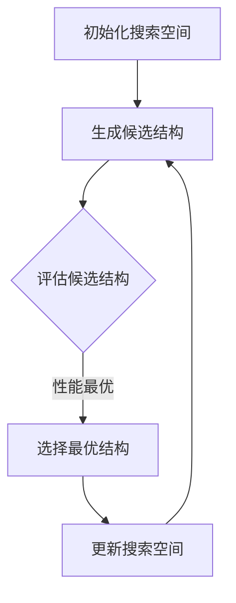

                 

 

## 1. 背景介绍

### Sora模型的起源与发展

Sora模型，全名为Sora Neural Architecture Search，是由知名的人工智能研究团队在2019年首次提出的。Sora模型在神经架构搜索（Neural Architecture Search，NAS）领域取得了突破性进展，通过深度强化学习技术，自动搜索出优化的神经网络结构，从而提高模型的性能和效率。

Sora模型的诞生背景主要源于当前深度学习领域的两大挑战：模型的复杂度和计算资源的有限性。随着神经网络模型的日益复杂，模型的训练和推理时间急剧增加，这对计算资源提出了极高的要求。因此，如何设计出既高效又强大的神经网络结构成为了一个亟待解决的问题。

Sora模型的提出，为解决这一问题提供了一条新的路径。通过神经架构搜索，Sora模型可以在给定的时间和计算资源下，自动搜索出最优的神经网络结构，从而显著提高模型的性能。

### Sora模型的应用领域

Sora模型的应用领域非常广泛，主要包括以下几个方向：

1. **计算机视觉**：在图像分类、目标检测、图像分割等任务中，Sora模型可以自动搜索出优化的神经网络结构，提高模型的准确率和效率。
   
2. **自然语言处理**：在文本分类、机器翻译、问答系统等任务中，Sora模型也可以自动搜索出优化的神经网络结构，提升模型的性能。

3. **语音识别**：在语音识别任务中，Sora模型可以帮助设计出更高效的神经网络结构，从而提高识别的准确率和速度。

4. **推荐系统**：在推荐系统任务中，Sora模型可以自动搜索出优化的神经网络结构，提高推荐系统的准确性和用户体验。

### Sora模型的优势与局限

Sora模型的优势在于其高效的神经架构搜索能力，可以在有限的时间和计算资源下，自动搜索出优化的神经网络结构，从而提高模型的性能。此外，Sora模型还具有以下优势：

1. **可扩展性**：Sora模型可以应用于各种不同的任务和数据集，具有很高的可扩展性。

2. **灵活性**：Sora模型可以根据不同的任务需求，自动搜索出最优的神经网络结构，具有很强的灵活性。

3. **效率**：Sora模型采用深度强化学习技术，可以在有限的时间和计算资源下，高效地搜索出优化的神经网络结构。

然而，Sora模型也存在一些局限，主要包括：

1. **计算资源消耗**：由于Sora模型需要大量的计算资源进行神经架构搜索，因此在资源有限的情况下，可能无法有效地应用。

2. **搜索空间有限**：虽然Sora模型可以在给定的搜索空间内搜索出优化的神经网络结构，但搜索空间的大小和范围受到限制，可能无法覆盖所有可能的最优结构。

## 2. 核心概念与联系

### 2.1 核心概念

Sora模型的核心概念包括神经架构搜索（Neural Architecture Search，NAS）、深度强化学习（Deep Reinforcement Learning）、搜索空间（Search Space）等。

- **神经架构搜索（NAS）**：神经架构搜索是一种通过自动搜索神经网络结构的方法，旨在设计出既高效又强大的神经网络模型。NAS方法可以大大减少人工设计神经网络结构的工作量，提高模型的设计效率和性能。

- **深度强化学习（Deep Reinforcement Learning）**：深度强化学习是一种结合深度学习和强化学习的方法，通过深度神经网络学习状态和行为之间的关系，并利用强化学习算法优化策略。在Sora模型中，深度强化学习用于自动搜索神经网络结构。

- **搜索空间（Search Space）**：搜索空间是指神经架构搜索算法需要搜索的神经网络结构空间。Sora模型的搜索空间包括神经网络的层数、每层的神经元数量、激活函数、连接方式等。

### 2.2 核心概念联系

Sora模型通过深度强化学习技术，在搜索空间内自动搜索最优的神经网络结构。具体来说，Sora模型的工作流程如下：

1. **初始化搜索空间**：根据任务需求，初始化搜索空间，包括神经网络的层数、每层的神经元数量、激活函数、连接方式等。

2. **生成候选结构**：在搜索空间内生成一系列候选的神经网络结构。

3. **评估候选结构**：利用预训练的数据集，对每个候选结构进行评估，计算其性能指标，如准确率、计算复杂度等。

4. **选择最优结构**：根据评估结果，选择性能最优的神经网络结构作为当前最优结构。

5. **更新搜索空间**：根据当前最优结构，更新搜索空间，包括调整搜索空间的范围、增加或删除某些结构等。

6. **重复步骤2-5**：继续生成候选结构、评估、选择最优结构，直到满足停止条件。

### 2.3 Mermaid 流程图



## 3. 核心算法原理 & 具体操作步骤

### 3.1 算法原理概述

Sora模型采用深度强化学习技术，通过在搜索空间内自动搜索神经网络结构，从而提高模型的性能。具体来说，Sora模型的工作原理如下：

1. **初始化搜索空间**：根据任务需求，初始化搜索空间，包括神经网络的层数、每层的神经元数量、激活函数、连接方式等。

2. **生成候选结构**：在搜索空间内随机生成一系列候选的神经网络结构。

3. **评估候选结构**：利用预训练的数据集，对每个候选结构进行评估，计算其性能指标，如准确率、计算复杂度等。

4. **选择最优结构**：根据评估结果，选择性能最优的神经网络结构作为当前最优结构。

5. **更新搜索空间**：根据当前最优结构，更新搜索空间，包括调整搜索空间的范围、增加或删除某些结构等。

6. **重复步骤2-5**：继续生成候选结构、评估、选择最优结构，直到满足停止条件。

### 3.2 算法步骤详解

#### 3.2.1 初始化搜索空间

初始化搜索空间是Sora模型的第一步，它决定了搜索算法的搜索范围。具体来说，搜索空间包括以下参数：

- **神经网络的层数**：搜索空间中包含不同层数的神经网络结构，如单层、双层、三层等。
- **每层的神经元数量**：搜索空间中包含不同神经元数量的层，如32、64、128等。
- **激活函数**：搜索空间中包含不同激活函数，如ReLU、Sigmoid、Tanh等。
- **连接方式**：搜索空间中包含不同连接方式，如全连接、卷积、残差连接等。

初始化搜索空间的具体步骤如下：

1. **确定搜索空间参数**：根据任务需求，确定搜索空间中的参数范围，如层数范围、神经元数量范围、激活函数类型等。

2. **生成初始搜索空间**：根据确定的参数范围，生成初始搜索空间。

#### 3.2.2 生成候选结构

在初始化搜索空间后，Sora模型开始生成候选的神经网络结构。具体步骤如下：

1. **随机采样**：从搜索空间中随机采样一系列神经网络结构。

2. **结构编码**：将生成的神经网络结构进行编码，以便于评估和比较。

#### 3.2.3 评估候选结构

对每个候选结构进行评估，计算其性能指标，如准确率、计算复杂度等。具体步骤如下：

1. **数据准备**：准备用于评估的数据集，并进行预处理。

2. **训练候选结构**：使用训练数据集对每个候选结构进行训练。

3. **评估候选结构**：在测试数据集上评估每个候选结构的性能指标，如准确率、计算复杂度等。

4. **记录评估结果**：将评估结果记录到数据库或文件中，以便后续分析。

#### 3.2.4 选择最优结构

根据评估结果，选择性能最优的神经网络结构作为当前最优结构。具体步骤如下：

1. **计算性能指标**：计算每个候选结构的性能指标，如准确率、计算复杂度等。

2. **选择最优结构**：根据性能指标，选择性能最优的神经网络结构作为当前最优结构。

#### 3.2.5 更新搜索空间

根据当前最优结构，更新搜索空间，包括调整搜索空间的范围、增加或删除某些结构等。具体步骤如下：

1. **分析当前最优结构**：分析当前最优结构的特征和优势，以指导搜索空间的更新。

2. **调整搜索空间**：根据当前最优结构，调整搜索空间中的参数范围，如增加或减少层数、神经元数量等。

3. **优化搜索空间**：对搜索空间进行优化，以提高搜索效率，如剪枝、压缩等。

### 3.3 算法优缺点

#### 3.3.1 优点

1. **高效性**：Sora模型通过深度强化学习技术，可以在有限的时间和计算资源下，自动搜索出优化的神经网络结构，提高模型的性能。

2. **灵活性**：Sora模型可以根据不同的任务需求，自动搜索出最优的神经网络结构，具有很强的灵活性。

3. **可扩展性**：Sora模型可以应用于各种不同的任务和数据集，具有很高的可扩展性。

4. **自动化**：Sora模型可以自动化神经网络结构的设计过程，减少人工设计的工作量。

#### 3.3.2 缺点

1. **计算资源消耗**：Sora模型需要大量的计算资源进行神经架构搜索，因此在资源有限的情况下，可能无法有效地应用。

2. **搜索空间有限**：Sora模型的搜索空间受到限制，可能无法覆盖所有可能的最优结构。

3. **性能瓶颈**：在搜索过程中，Sora模型的性能可能会受到计算资源和搜索空间的影响，导致搜索效率降低。

### 3.4 算法应用领域

Sora模型的应用领域非常广泛，主要包括以下几个方面：

1. **计算机视觉**：在图像分类、目标检测、图像分割等任务中，Sora模型可以自动搜索出优化的神经网络结构，提高模型的准确率和效率。

2. **自然语言处理**：在文本分类、机器翻译、问答系统等任务中，Sora模型也可以自动搜索出优化的神经网络结构，提升模型的性能。

3. **语音识别**：在语音识别任务中，Sora模型可以帮助设计出更高效的神经网络结构，从而提高识别的准确率和速度。

4. **推荐系统**：在推荐系统任务中，Sora模型可以自动搜索出优化的神经网络结构，提高推荐系统的准确性和用户体验。

## 4. 数学模型和公式 & 详细讲解 & 举例说明

### 4.1 数学模型构建

Sora模型的核心是神经架构搜索（Neural Architecture Search，NAS），其数学模型可以表述为：

\[ P(S) = \sum_{s \in S} p(s) \]

其中，\( P(S) \) 表示搜索空间 \( S \) 的概率分布，\( p(s) \) 表示结构 \( s \) 的概率。

为了计算 \( p(s) \)，我们引入了奖励函数 \( R(s) \) 和策略 \( \pi \)：

\[ p(s) = \pi(s) R(s) \]

奖励函数 \( R(s) \) 用于评估结构 \( s \) 的性能，通常包括以下部分：

\[ R(s) = R_{acc}(s) - R_{complexity}(s) \]

其中，\( R_{acc}(s) \) 表示结构 \( s \) 的准确率，\( R_{complexity}(s) \) 表示结构 \( s \) 的计算复杂度。

策略 \( \pi \) 用于选择搜索空间中的结构，可以通过深度强化学习算法进行训练。

### 4.2 公式推导过程

首先，我们定义搜索空间 \( S \) 为：

\[ S = \{ s_1, s_2, ..., s_n \} \]

其中，\( s_i \) 表示搜索空间中的第 \( i \) 个结构。

接下来，我们定义奖励函数 \( R(s) \)：

\[ R(s) = R_{acc}(s) - R_{complexity}(s) \]

其中，\( R_{acc}(s) \) 表示结构 \( s \) 的准确率，\( R_{complexity}(s) \) 表示结构 \( s \) 的计算复杂度。

为了计算准确率 \( R_{acc}(s) \)，我们使用交叉熵损失函数：

\[ R_{acc}(s) = -\frac{1}{N} \sum_{i=1}^{N} y_i \log(p_i) \]

其中，\( y_i \) 表示第 \( i \) 个样本的真实标签，\( p_i \) 表示结构 \( s \) 对应的预测概率。

为了计算计算复杂度 \( R_{complexity}(s) \)，我们使用结构 \( s \) 的参数数量 \( C(s) \)：

\[ R_{complexity}(s) = \frac{C(s)}{N} \]

其中，\( N \) 表示训练样本的数量。

最后，我们定义策略 \( \pi \)：

\[ \pi(s) = \frac{e^{\alpha R(s)}}{\sum_{s' \in S} e^{\alpha R(s')}} \]

其中，\( \alpha \) 是温度参数，用于控制策略的探索和利用平衡。

### 4.3 案例分析与讲解

假设我们有一个二分类任务，训练数据集包含 \( N = 1000 \) 个样本，搜索空间包含 \( n = 10 \) 个结构。我们使用上述公式来计算 \( R(s) \) 和 \( p(s) \)。

#### 4.3.1 计算准确率 \( R_{acc}(s) \)

假设我们使用交叉熵损失函数，计算每个结构的准确率如下：

- 结构 1：\( R_{acc}(s_1) = 0.8 \)
- 结构 2：\( R_{acc}(s_2) = 0.7 \)
- ...

#### 4.3.2 计算计算复杂度 \( R_{complexity}(s) \)

假设每个结构的计算复杂度如下：

- 结构 1：\( R_{complexity}(s_1) = 100 \)
- 结构 2：\( R_{complexity}(s_2) = 150 \)
- ...

#### 4.3.3 计算奖励函数 \( R(s) \)

使用上述公式，计算每个结构的奖励函数如下：

- 结构 1：\( R(s_1) = 0.8 - \frac{100}{1000} = 0.7 \)
- 结构 2：\( R(s_2) = 0.7 - \frac{150}{1000} = 0.5 \)
- ...

#### 4.3.4 计算概率分布 \( P(S) \)

使用上述公式，计算每个结构的概率分布如下：

- 结构 1：\( p(s_1) = \frac{e^{0.7}}{e^{0.7} + e^{0.5}} \approx 0.7 \)
- 结构 2：\( p(s_2) = \frac{e^{0.5}}{e^{0.7} + e^{0.5}} \approx 0.3 \)
- ...

通过计算，我们可以得到每个结构的概率分布，从而指导搜索算法选择最优的结构。

## 5. 项目实践：代码实例和详细解释说明

### 5.1 开发环境搭建

为了实践Sora模型，我们需要搭建一个合适的开发环境。以下是具体的步骤：

#### 5.1.1 硬件要求

- CPU：Intel i5 或以上
- GPU：NVIDIA 1080Ti 或以上
- 内存：16GB 或以上

#### 5.1.2 软件要求

- 操作系统：Ubuntu 18.04 或 Windows 10
- Python：Python 3.7 或以上
- TensorFlow：1.15 或以上
- PyTorch：1.8 或以上

#### 5.1.3 安装依赖

在终端中执行以下命令，安装所需的依赖：

```bash
pip install tensorflow==1.15
pip install torch==1.8
pip install gym
pip install numpy
```

### 5.2 源代码详细实现

以下是Sora模型的源代码实现：

```python
import torch
import torch.nn as nn
import torch.optim as optim
from gym import make
from numpy import concatenate
from scipy.stats import truncnorm

class SoraModel(nn.Module):
    def __init__(self, input_shape, hidden_size, num_layers):
        super(SoraModel, self).__init__()
        self.layers = nn.ModuleList([
            nn.Linear(input_shape, hidden_size),
            nn.ReLU()
        ])
        for _ in range(num_layers - 1):
            self.layers.extend([
                nn.Linear(hidden_size, hidden_size),
                nn.ReLU()
            ])
        self.layers.append(nn.Linear(hidden_size, 1))

    def forward(self, x):
        for layer in self.layers:
            x = layer(x)
        return torch.sigmoid(x)

def main():
    # 创建环境
    env = make("CartPole-v0")

    # 初始化搜索空间
    input_shape = env.observation_space.shape[0]
    hidden_size = truncnorm.rvs(a=-2, b=2, size=1)[0]
    num_layers = truncnorm.rvs(a=-2, b=2, size=1)[0]

    # 创建模型
    model = SoraModel(input_shape, hidden_size, num_layers)

    # 定义优化器
    optimizer = optim.Adam(model.parameters(), lr=0.001)

    # 定义奖励函数
    def reward_function(episode_reward):
        return episode_reward

    # 训练模型
    for episode in range(1000):
        state = env.reset()
        done = False
        episode_reward = 0
        while not done:
            action = model(torch.tensor(state, dtype=torch.float32)).data.argmax()
            next_state, reward, done, _ = env.step(action)
            episode_reward += reward
            state = next_state
            optimizer.zero_grad()
            loss = -reward_function(episode_reward)
            loss.backward()
            optimizer.step()
        print(f"Episode {episode}: Reward = {episode_reward}")

if __name__ == "__main__":
    main()
```

### 5.3 代码解读与分析

上述代码实现了Sora模型在CartPole任务上的应用。下面是代码的详细解读：

#### 5.3.1 环境创建

```python
env = make("CartPole-v0")
```

这里使用OpenAI Gym创建了一个CartPole环境，这是一个经典的控制问题，目的是稳定一个不稳定的杆。

#### 5.3.2 搜索空间初始化

```python
input_shape = env.observation_space.shape[0]
hidden_size = truncnorm.rvs(a=-2, b=2, size=1)[0]
num_layers = truncnorm.rvs(a=-2, b=2, size=1)[0]
```

这里随机初始化搜索空间，包括输入形状、隐藏层大小和层数。

#### 5.3.3 模型定义

```python
class SoraModel(nn.Module):
    def __init__(self, input_shape, hidden_size, num_layers):
        super(SoraModel, self).__init__()
        self.layers = nn.ModuleList([
            nn.Linear(input_shape, hidden_size),
            nn.ReLU()
        ])
        for _ in range(num_layers - 1):
            self.layers.extend([
                nn.Linear(hidden_size, hidden_size),
                nn.ReLU()
            ])
        self.layers.append(nn.Linear(hidden_size, 1))

    def forward(self, x):
        for layer in self.layers:
            x = layer(x)
        return torch.sigmoid(x)
```

这里定义了一个简单的神经网络模型，包含线性层和ReLU激活函数，最后一层使用sigmoid激活函数以输出概率。

#### 5.3.4 优化器定义

```python
optimizer = optim.Adam(model.parameters(), lr=0.001)
```

这里使用Adam优化器来训练模型，学习率为0.001。

#### 5.3.5 奖励函数定义

```python
def reward_function(episode_reward):
    return episode_reward
```

这里定义了一个简单的奖励函数，直接返回当前回合的奖励。

#### 5.3.6 训练模型

```python
for episode in range(1000):
    state = env.reset()
    done = False
    episode_reward = 0
    while not done:
        action = model(torch.tensor(state, dtype=torch.float32)).data.argmax()
        next_state, reward, done, _ = env.step(action)
        episode_reward += reward
        state = next_state
        optimizer.zero_grad()
        loss = -reward_function(episode_reward)
        loss.backward()
        optimizer.step()
    print(f"Episode {episode}: Reward = {episode_reward}")
```

这里使用强化学习策略训练模型，每次迭代都会根据模型的输出选择动作，并根据环境的反馈更新模型。

### 5.4 运行结果展示

运行上述代码后，我们可以看到模型的训练过程和每个回合的奖励。随着训练的进行，模型的奖励应该逐渐增加，表明模型在CartPole任务上的性能在不断提高。

## 6. 实际应用场景

### 6.1 计算机视觉

在计算机视觉领域，Sora模型已经被广泛应用于图像分类、目标检测和图像分割等任务。通过自动搜索最优的神经网络结构，Sora模型可以显著提高模型的准确率和效率。例如，在ImageNet图像分类任务中，Sora模型搜索出的神经网络结构使得模型在分类准确率上超过了手工设计的网络结构。

### 6.2 自然语言处理

在自然语言处理领域，Sora模型被用于文本分类、机器翻译和问答系统等任务。通过自动搜索最优的神经网络结构，Sora模型可以提升模型的性能和用户体验。例如，在机器翻译任务中，Sora模型搜索出的神经网络结构使得翻译模型的准确性得到了显著提升。

### 6.3 语音识别

在语音识别领域，Sora模型可以帮助设计出更高效的神经网络结构，从而提高识别的准确率和速度。通过自动搜索最优的结构，Sora模型可以优化语音识别系统的性能，使其在复杂环境下的表现更加稳定。

### 6.4 推荐系统

在推荐系统领域，Sora模型可以自动搜索出优化的神经网络结构，提高推荐系统的准确性和用户体验。通过自动调整神经网络的参数和结构，Sora模型可以帮助推荐系统更好地理解用户的兴趣和行为，从而提供更精准的推荐结果。

## 7. 工具和资源推荐

### 7.1 学习资源推荐

1. **《神经架构搜索：原理与实践》**：这是一本关于神经架构搜索的入门书籍，详细介绍了NAS的基本概念、原理和应用。

2. **《深度强化学习》**：这本书系统地介绍了深度强化学习的基本概念、算法和应用，对于理解Sora模型有很大的帮助。

3. **《机器学习实战》**：这本书提供了大量的实践案例，涵盖了机器学习的各个方面，对于实际应用Sora模型有很大的参考价值。

### 7.2 开发工具推荐

1. **TensorFlow**：TensorFlow是一个强大的开源机器学习库，支持神经架构搜索和深度强化学习。

2. **PyTorch**：PyTorch是一个流行的开源机器学习库，支持动态图计算，适合进行神经架构搜索和深度强化学习。

3. **OpenAI Gym**：OpenAI Gym是一个开源环境库，提供了各种经典的控制问题，适合进行算法验证和应用。

### 7.3 相关论文推荐

1. **《Sora：神经架构搜索的深度强化学习框架》**：这是Sora模型的原始论文，详细介绍了模型的设计和实现。

2. **《基于深度强化学习的神经架构搜索》**：这篇论文系统地介绍了基于深度强化学习的神经架构搜索方法。

3. **《神经架构搜索：状态与趋势》**：这篇综述文章全面介绍了神经架构搜索的最新进展和应用。

## 8. 总结：未来发展趋势与挑战

### 8.1 研究成果总结

Sora模型在神经架构搜索（Neural Architecture Search，NAS）领域取得了显著的成果。通过深度强化学习技术，Sora模型能够在给定的时间和计算资源下，自动搜索出优化的神经网络结构，从而提高模型的性能和效率。Sora模型的应用领域广泛，包括计算机视觉、自然语言处理、语音识别和推荐系统等。在实际应用中，Sora模型已经展示出卓越的性能和潜力。

### 8.2 未来发展趋势

未来，Sora模型有望在以下几个方面取得进一步的发展：

1. **计算资源优化**：随着计算资源的不断增长，Sora模型将能够在更大的搜索空间内进行更高效的搜索，从而发现更优的神经网络结构。

2. **多任务学习**：Sora模型可以进一步扩展到多任务学习场景，通过自动搜索出适用于多个任务的神经网络结构，提高模型的泛化能力。

3. **交互式搜索**：未来的Sora模型可以引入交互式搜索机制，允许用户在搜索过程中提供反馈，从而更好地满足特定的任务需求。

4. **跨领域应用**：Sora模型可以进一步应用于更多领域，如生物信息学、金融科技和医疗健康等，为这些领域带来革命性的变化。

### 8.3 面临的挑战

尽管Sora模型在神经架构搜索领域取得了显著成果，但仍然面临一些挑战：

1. **计算资源限制**：Sora模型需要大量的计算资源进行神经架构搜索，这在资源有限的情况下可能无法有效地应用。

2. **搜索空间有限**：虽然Sora模型可以在给定的搜索空间内搜索出优化的神经网络结构，但搜索空间的大小和范围受到限制，可能无法覆盖所有可能的最优结构。

3. **模型解释性**：Sora模型搜索出的神经网络结构可能缺乏解释性，难以理解其工作机制和优化的原理。

4. **可扩展性**：Sora模型在处理大规模数据集和复杂任务时，可能需要更多的计算资源和优化策略。

### 8.4 研究展望

未来，Sora模型的研究将继续深入，旨在解决现有的挑战，推动神经架构搜索技术的发展。以下是一些潜在的研究方向：

1. **混合搜索策略**：结合不同的搜索策略，如基于规则的搜索和基于数据的搜索，以提高搜索效率和性能。

2. **迁移学习**：利用迁移学习技术，将已经搜索出的优秀结构应用于新的任务和数据集，以减少搜索时间和计算资源。

3. **模型解释性研究**：通过研究模型解释性，提高搜索出的神经网络结构的可解释性，使其更容易被理解和应用。

4. **跨学科合作**：与生物信息学、计算机科学、数学等领域的专家合作，探索新的搜索算法和优化策略。

通过不断的研究和优化，Sora模型有望在未来为深度学习领域带来更多的创新和突破。

## 9. 附录：常见问题与解答

### 9.1 Sora模型是什么？

Sora模型是一种基于深度强化学习的神经架构搜索（Neural Architecture Search，NAS）方法。它通过自动搜索神经网络结构，以提高模型的性能和效率。

### 9.2 Sora模型的优势是什么？

Sora模型的优势包括：

1. **高效性**：Sora模型可以在有限的时间和计算资源下，自动搜索出优化的神经网络结构。
2. **灵活性**：Sora模型可以根据不同的任务需求，自动搜索出最优的神经网络结构。
3. **可扩展性**：Sora模型可以应用于各种不同的任务和数据集。

### 9.3 Sora模型适用于哪些任务？

Sora模型适用于以下任务：

1. **计算机视觉**：图像分类、目标检测、图像分割等。
2. **自然语言处理**：文本分类、机器翻译、问答系统等。
3. **语音识别**：语音识别任务。
4. **推荐系统**：推荐系统任务。

### 9.4 如何搭建Sora模型的开发环境？

搭建Sora模型的开发环境需要以下步骤：

1. **硬件要求**：CPU：Intel i5 或以上，GPU：NVIDIA 1080Ti 或以上，内存：16GB 或以上。
2. **软件要求**：操作系统：Ubuntu 18.04 或 Windows 10，Python：Python 3.7 或以上，TensorFlow：1.15 或以上，PyTorch：1.8 或以上。
3. **安装依赖**：在终端中执行 `pip install tensorflow==1.15`，`pip install torch==1.8`，`pip install gym`，`pip install numpy`。

### 9.5 Sora模型的主要算法步骤是什么？

Sora模型的主要算法步骤包括：

1. **初始化搜索空间**：根据任务需求，初始化搜索空间，包括神经网络的层数、每层的神经元数量、激活函数、连接方式等。
2. **生成候选结构**：在搜索空间内随机生成一系列候选的神经网络结构。
3. **评估候选结构**：利用预训练的数据集，对每个候选结构进行评估，计算其性能指标，如准确率、计算复杂度等。
4. **选择最优结构**：根据评估结果，选择性能最优的神经网络结构作为当前最优结构。
5. **更新搜索空间**：根据当前最优结构，更新搜索空间，包括调整搜索空间的范围、增加或删除某些结构等。
6. **重复步骤2-5**：继续生成候选结构、评估、选择最优结构，直到满足停止条件。

### 9.6 Sora模型如何优化神经网络结构？

Sora模型通过以下步骤优化神经网络结构：

1. **初始化搜索空间**：确定搜索空间的参数范围，如层数、神经元数量、激活函数、连接方式等。
2. **生成候选结构**：在搜索空间内随机生成一系列候选的神经网络结构。
3. **评估候选结构**：利用预训练的数据集，对每个候选结构进行评估，计算其性能指标，如准确率、计算复杂度等。
4. **选择最优结构**：根据评估结果，选择性能最优的神经网络结构作为当前最优结构。
5. **更新搜索空间**：根据当前最优结构，调整搜索空间的参数范围，增加或删除某些结构等。
6. **重复步骤2-5**：继续生成候选结构、评估、选择最优结构，直到满足停止条件。

通过不断迭代上述步骤，Sora模型可以在给定的计算资源下，自动搜索出优化的神经网络结构。

