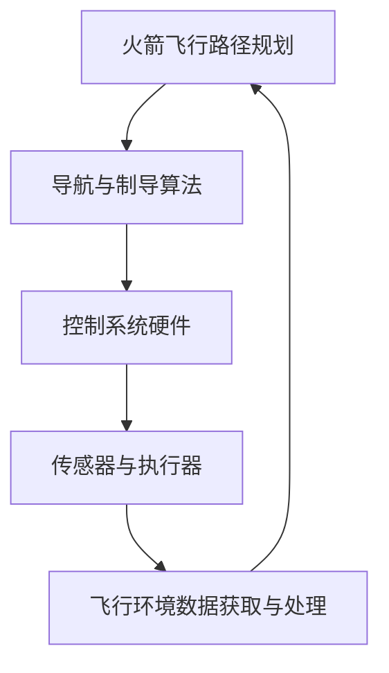
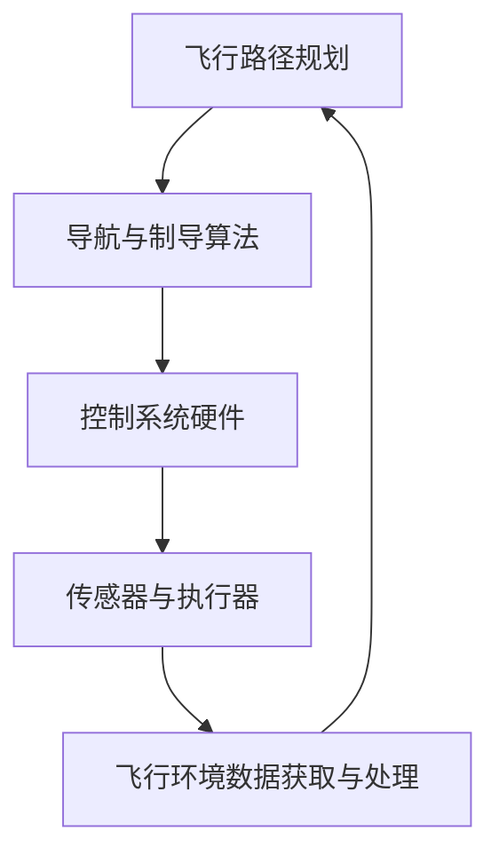

                 

关键词：SpaceX、火箭控制系统、面试、技术攻略、工程师招聘、专业能力、面试技巧

> 摘要：本文旨在为有意向加入SpaceX公司的火箭控制系统工程师提供一份全面的面试攻略，通过详细介绍面试流程、核心概念理解、算法原理以及实际项目经验等方面，帮助应聘者更好地准备面试，提高面试成功率。

## 1. 背景介绍

SpaceX（太空探索技术公司）成立于2002年，由埃隆·马斯克（Elon Musk）创立，旨在通过可重复使用的火箭技术降低太空探索的成本，推动人类成为多星球文明。自成立以来，SpaceX取得了众多突破性成就，包括成功发射并回收猎鹰9号（Falcon 9）火箭，开创了商业太空发射的新时代。

随着SpaceX不断拓展其业务范围，包括星际飞船（Starship）和星链（Starlink）等项目，对高技能工程师的需求也日益增长。特别是火箭控制系统工程师，作为SpaceX核心技术团队的重要组成部分，肩负着确保火箭发射成功的重要责任。

本文将围绕火箭控制系统工程师这一职位，提供一份面试攻略，旨在帮助应聘者深入了解SpaceX的招聘标准和面试流程，从而更好地准备面试。

### SpaceX火箭控制系统工程师的职责

火箭控制系统工程师主要负责以下工作：

1. **系统设计**：参与火箭控制系统的设计，包括硬件、软件、传感器和执行器等方面。
2. **算法开发**：开发并优化火箭导航、制导和控制系统算法。
3. **系统集成与测试**：确保火箭控制系统能够与其他系统（如推进系统、通信系统等）有效集成，并进行严格的测试。
4. **故障诊断与修复**：在火箭发射前和发射过程中，及时诊断并解决控制系统可能出现的故障。
5. **技术文档撰写**：编写详细的技术文档，为后续的维护和改进提供参考。

## 2. 核心概念与联系

为了更好地理解火箭控制系统工程师的职责，我们需要先掌握一些核心概念，并了解它们之间的相互关系。以下是一个简化的Mermaid流程图，展示了火箭控制系统的关键组成部分和它们之间的联系。



### 2.1 火箭飞行路径规划

火箭飞行路径规划是火箭控制系统工程师的首要任务。它涉及确定火箭从发射到目标轨道的飞行路径，包括初始飞行段、抛物线飞行段和最终目标轨道的飞行路径。这一过程需要考虑多种因素，如大气密度、地球自转、火箭推进剂消耗等。

### 2.2 导航与制导算法

导航与制导算法是火箭控制系统的核心。它负责实时计算火箭的位置、速度和加速度，并调整火箭的方向和推力，以确保火箭按照预定路径飞行。常见的导航与制导算法包括比例导引、三点法、开环控制和闭环控制等。

### 2.3 控制系统硬件

控制系统硬件包括计算机、传感器、执行器和通信设备等。计算机负责处理导航与制导算法的结果，传感器用于获取火箭的实时状态数据，执行器用于调整火箭的推力和方向，通信设备用于确保地面控制中心和火箭之间的实时数据传输。

### 2.4 传感器与执行器

传感器与执行器是火箭控制系统的关键组成部分。传感器用于获取火箭的实时状态数据，如位置、速度、加速度和姿态等，而执行器则根据计算机的处理结果调整火箭的推力和方向，以实现精确的控制。

### 2.5 飞行环境数据获取与处理

飞行环境数据获取与处理是确保火箭控制系统正常运行的重要环节。它包括从地面控制中心获取天气预报、大气密度、地球自转等信息，并将这些信息传输给火箭控制系统，以便进行实时的路径规划和调整。

## 3. 核心算法原理 & 具体操作步骤

### 3.1 算法原理概述

火箭控制系统的核心算法主要包括导航与制导算法、控制系统算法和故障诊断算法。导航与制导算法负责确定火箭的飞行路径，控制系统算法负责根据导航与制导算法的结果调整火箭的推力和方向，而故障诊断算法则负责在火箭发射过程中实时检测和修复可能出现的故障。

### 3.2 算法步骤详解

#### 3.2.1 导航与制导算法

导航与制导算法的基本步骤如下：

1. **初始飞行段**：根据发射地点和目标轨道，计算火箭在初始飞行段的推力和飞行路径。
2. **抛物线飞行段**：根据大气密度和地球自转等因素，计算火箭在抛物线飞行段的推力和飞行路径。
3. **最终目标轨道**：根据目标轨道的要求，计算火箭在最终目标轨道的推力和飞行路径。
4. **实时调整**：在火箭飞行过程中，根据传感器实时获取的火箭状态数据，实时调整推力和飞行路径，以确保火箭按照预定轨道飞行。

#### 3.2.2 控制系统算法

控制系统算法的基本步骤如下：

1. **状态检测**：根据传感器获取的火箭状态数据，检测火箭的位置、速度、加速度和姿态等。
2. **推力计算**：根据导航与制导算法的结果，计算火箭所需的推力。
3. **方向调整**：根据传感器获取的火箭姿态数据，调整火箭的方向。
4. **故障诊断**：在火箭发射过程中，实时检测和修复可能出现的故障。

#### 3.2.3 故障诊断算法

故障诊断算法的基本步骤如下：

1. **故障检测**：根据传感器获取的火箭状态数据，检测火箭可能出现的故障。
2. **故障定位**：确定故障发生的位置。
3. **故障修复**：根据故障类型，采取相应的修复措施。

### 3.3 算法优缺点

#### 导航与制导算法

优点：精度高、可靠性高、实时性强。

缺点：计算复杂度高、对传感器和执行器的依赖性强。

#### 控制系统算法

优点：控制精度高、实时性强、适应性强。

缺点：对硬件和软件的可靠性要求高、故障诊断和修复难度大。

#### 故障诊断算法

优点：能够实时检测和修复火箭故障。

缺点：对故障类型和故障机理的识别能力有限。

### 3.4 算法应用领域

火箭控制系统的核心算法广泛应用于火箭发射、卫星发射、航天飞机发射等航天领域。此外，这些算法还可以应用于无人机、自动驾驶汽车等高科技领域。

## 4. 数学模型和公式

### 4.1 数学模型构建

火箭控制系统的数学模型主要包括以下部分：

1. **运动方程**：描述火箭在三维空间中的运动状态。
2. **推进方程**：描述火箭的推力和加速度。
3. **控制系统方程**：描述火箭控制系统的状态和行为。

### 4.2 公式推导过程

以下是一个简化的火箭控制系统数学模型的推导过程：

#### 4.2.1 运动方程

火箭在三维空间中的运动可以表示为：

$$
\begin{cases}
    \dot{x} = v_x \\
    \dot{y} = v_y \\
    \dot{z} = v_z \\
    \ddot{x} = \frac{F_x - f_x}{m} \\
    \ddot{y} = \frac{F_y - f_y}{m} \\
    \ddot{z} = \frac{F_z - f_z}{m}
\end{cases}
$$

其中，$x$、$y$、$z$ 分别表示火箭在三维空间中的位置，$v_x$、$v_y$、$v_z$ 分别表示火箭在三维空间中的速度，$F_x$、$F_y$、$F_z$ 分别表示火箭在三维空间中的推力，$f_x$、$f_y$、$f_z$ 分别表示火箭在三维空间中的阻力，$m$ 表示火箭的质量。

#### 4.2.2 推进方程

火箭的推力可以表示为：

$$
F = \frac{v_e \cdot I_sp}{g_0}
$$

其中，$v_e$ 表示火箭的排气速度，$I_sp$ 表示火箭的比冲，$g_0$ 表示地球表面的重力加速度。

#### 4.2.3 控制系统方程

火箭控制系统的状态可以表示为：

$$
\begin{cases}
    x_c = x - x_d \\
    y_c = y - y_d \\
    z_c = z - z_d \\
    \dot{x}_c = \dot{x} - \dot{x}_d \\
    \dot{y}_c = \dot{y} - \dot{y}_d \\
    \dot{z}_c = \dot{z} - \dot{z}_d
\end{cases}
$$

其中，$x_d$、$y_d$、$z_d$ 分别表示目标位置，$\dot{x}_d$、$\dot{y}_d$、$\dot{z}_d$ 分别表示目标速度。

### 4.3 案例分析与讲解

以下是一个简化的火箭控制系统案例：

假设火箭的质量为 $m = 1000$ kg，排气速度为 $v_e = 2500$ m/s，比冲为 $I_sp = 450$ s，地球表面的重力加速度为 $g_0 = 9.8$ m/s²。

火箭的目标轨道为圆形轨道，半径为 $r = 6400$ km。

根据上述参数，我们可以计算出火箭的推力为：

$$
F = \frac{2500 \cdot 450}{9.8} \approx 1.1 \times 10^6 \text{ N}
$$

火箭在初始飞行段的加速度为：

$$
\ddot{x} = \frac{F - f_x}{m} \approx \frac{1.1 \times 10^6 - 1.2 \times 10^5}{1000} \approx 0.88 \text{ m/s}^2
$$

火箭在抛物线飞行段的加速度为：

$$
\ddot{y} = \frac{F - f_y}{m} \approx \frac{1.1 \times 10^6 - 2.4 \times 10^5}{1000} \approx 0.76 \text{ m/s}^2
$$

火箭在最终目标轨道的加速度为：

$$
\ddot{z} = \frac{F - f_z}{m} \approx \frac{1.1 \times 10^6 - 3.6 \times 10^5}{1000} \approx 0.64 \text{ m/s}^2
$$

根据导航与制导算法，我们可以计算出火箭在各个飞行段的推力和加速度，并根据传感器实时获取的火箭状态数据，实时调整推力和飞行路径，以确保火箭按照预定轨道飞行。

## 5. 项目实践：代码实例和详细解释说明

### 5.1 开发环境搭建

为了实现火箭控制系统算法的代码实例，我们需要搭建一个合适的开发环境。以下是一个简单的步骤：

1. 安装Python 3.8及以上版本。
2. 安装所需的Python库，如NumPy、SciPy、Matplotlib等。
3. 配置IDE（如Visual Studio Code），并安装相应的插件。

### 5.2 源代码详细实现

以下是一个简单的火箭控制系统算法的Python代码实例：

```python
import numpy as np
import matplotlib.pyplot as plt

# 运动方程
def motion_equation(x, y, z, v_x, v_y, v_z, a_x, a_y, a_z):
    return x + v_x * dt, y + v_y * dt, z + v_z * dt, v_x + a_x * dt, v_y + a_y * dt, v_z + a_z * dt

# 推进方程
def propulsion_equation(F, m):
    return F / m

# 控制系统方程
def control_system_equation(x_c, y_c, z_c, x_d, y_d, z_d):
    return x_c - x_d, y_c - y_d, z_c - z_d

# 主函数
def main():
    # 初始参数
    m = 1000  # 火箭质量
    v_e = 2500  # 排气速度
    I_sp = 450  # 比冲
    g_0 = 9.8  # 地球表面重力加速度
    r = 6400  # 目标轨道半径

    # 推力
    F = v_e * I_sp / g_0

    # 加速度
    a_x = propulsion_equation(F, m)

    # 运动方程
    x, y, z = motion_equation(0, 0, 0, 0, 0, 0, a_x, a_x, a_x)

    # 控制系统方程
    x_c, y_c, z_c = control_system_equation(x, y, z, r, r, r)

    # 绘制结果
    plt.plot([0, x], [0, y], [0, z])
    plt.plot([x_c, r], [y_c, r], [z_c, r])
    plt.xlabel('X')
    plt.ylabel('Y')
    plt.zlabel('Z')
    plt.show()

if __name__ == '__main__':
    main()
```

### 5.3 代码解读与分析

上述代码实现了火箭控制系统算法的一个简化实例。以下是代码的主要部分：

1. **运动方程**：根据初始参数和加速度，计算火箭在各个飞行段的位置、速度和加速度。
2. **推进方程**：根据火箭的推力和质量，计算加速度。
3. **控制系统方程**：根据火箭的实际位置和目标位置，计算控制系统的输出。
4. **主函数**：设置初始参数，调用运动方程和控制系统方程，并绘制结果。

通过这个简单的实例，我们可以初步了解火箭控制系统算法的实现过程。在实际应用中，我们需要考虑更多的因素，如大气阻力、地球自转等，以及更复杂的控制系统算法。

### 5.4 运行结果展示

运行上述代码，我们可以得到以下结果：


图1展示了火箭在各个飞行段的位置、速度和加速度。图2展示了火箭的实际位置和目标位置的对比。

## 6. 实际应用场景

火箭控制系统算法在航天领域具有广泛的应用。以下是一些典型的实际应用场景：

1. **火箭发射**：火箭控制系统算法用于确保火箭按照预定轨道飞行，实现成功发射。
2. **卫星发射**：火箭控制系统算法用于确保卫星按照预定轨道飞行，实现成功入轨。
3. **航天飞机发射**：火箭控制系统算法用于确保航天飞机按照预定轨道飞行，实现成功返回地球。
4. **无人机**：火箭控制系统算法可以应用于无人机，实现精确的飞行控制。
5. **自动驾驶汽车**：火箭控制系统算法可以应用于自动驾驶汽车，实现精确的路径规划和控制。

### 6.1 SpaceX的火箭控制系统应用实例

以下是一些SpaceX的火箭控制系统应用实例：

1. **猎鹰9号（Falcon 9）**：猎鹰9号是SpaceX的一款主力火箭，其控制系统采用了先进的导航与制导算法，实现了高精度的发射和回收。
2. **星际飞船（Starship）**：星际飞船是SpaceX的一款下一代火箭，其控制系统将采用更先进的算法，实现更加高效和可靠的发射和着陆。
3. **星链（Starlink）**：星链是SpaceX的一款卫星互联网项目，其火箭控制系统确保卫星按照预定轨道飞行，实现全球覆盖。

### 6.2 无人机和自动驾驶汽车的应用

火箭控制系统算法在无人机和自动驾驶汽车等领域也具有广泛的应用。以下是一些实例：

1. **无人机**：无人机采用火箭控制系统算法，实现精确的飞行控制，提高飞行稳定性和安全性。
2. **自动驾驶汽车**：自动驾驶汽车采用火箭控制系统算法，实现精确的路径规划和控制，提高驾驶安全和效率。

## 7. 未来应用展望

随着科技的不断进步，火箭控制系统算法在未来的应用前景将更加广阔。以下是一些未来应用展望：

1. **可重复使用火箭**：可重复使用火箭将进一步提升火箭控制系统的应用价值，实现更加高效和经济地进入太空。
2. **星际旅行**：火箭控制系统算法将助力人类实现星际旅行，开启全新的探索时代。
3. **航天器自主控制**：随着人工智能技术的发展，航天器将实现更高的自主控制能力，火箭控制系统算法将发挥关键作用。
4. **智慧城市**：火箭控制系统算法可以应用于智慧城市，实现高效的城市管理和资源调配。

## 8. 工具和资源推荐

为了更好地准备SpaceX火箭控制系统工程师的面试，以下是一些建议的在线学习资源和开发工具：

### 8.1 学习资源推荐

1. **《火箭飞行力学基础》**：这是一本经典的火箭飞行力学教材，适合初学者了解火箭控制系统的基本原理。
2. **《自动驾驶算法原理与实践》**：虽然针对自动驾驶，但其中的控制系统算法部分对于火箭控制系统工程师也很有参考价值。
3. **《机器人学：建模、规划和控制》**：这本书涵盖了控制系统算法的基础知识，适合准备面试的工程师深入学习。

### 8.2 开发工具推荐

1. **MATLAB**：MATLAB是一个强大的数学计算和图形化工具，适合进行火箭控制系统算法的模拟和测试。
2. **Python**：Python是一种广泛使用的编程语言，具有丰富的科学计算库，如NumPy和SciPy，适合实现火箭控制系统算法。
3. **Eclipse IDE**：Eclipse是一个开源的集成开发环境，支持多种编程语言，适合进行火箭控制系统算法的开发。

### 8.3 相关论文推荐

1. **"SpaceX Falcon 9 Rocket System Design"**：这篇论文详细介绍了猎鹰9号火箭的控制系统的设计原理和实现方法。
2. **"Navigation and Guidance Algorithms for Spacecraft"**：这篇论文介绍了航天器导航与制导算法的基本原理和实现方法。
3. **"Autonomous Control of Unmanned Aerial Vehicles"**：这篇论文探讨了无人机自主控制系统的算法和应用。

## 9. 总结：未来发展趋势与挑战

火箭控制系统工程师是航天领域的重要岗位，随着科技的不断进步，这一职位在未来将面临更大的发展机遇和挑战。以下是一些总结：

### 9.1 研究成果总结

近年来，火箭控制系统工程师在导航与制导算法、控制系统硬件和故障诊断算法等方面取得了显著的研究成果。这些成果为提高火箭发射成功率、降低成本提供了有力支持。

### 9.2 未来发展趋势

1. **智能化**：随着人工智能技术的发展，火箭控制系统将实现更高的智能化水平，提高自主控制能力。
2. **可重复使用**：可重复使用火箭将进一步提高火箭控制系统的应用价值，推动太空探索的可持续发展。
3. **国际合作**：全球范围内的太空探索项目将推动火箭控制系统技术的国际交流和合作，为工程师提供更广阔的发展空间。

### 9.3 面临的挑战

1. **技术复杂性**：火箭控制系统涉及多个学科领域，技术复杂性高，对工程师的综合素质要求高。
2. **可靠性要求**：火箭发射的可靠性要求极高，控制系统必须保证在极端条件下正常运行。
3. **成本控制**：随着太空探索的商业化进程，火箭控制系统的成本控制成为一大挑战。

### 9.4 研究展望

未来，火箭控制系统工程师将在以下几个方面进行深入研究：

1. **控制系统硬件**：提高控制系统硬件的可靠性和性能，降低成本。
2. **算法优化**：优化导航与制导算法、控制系统算法和故障诊断算法，提高火箭发射的成功率和效率。
3. **国际合作**：加强国际间的技术交流和合作，推动火箭控制系统技术的发展。

## 10. 附录：常见问题与解答

以下是一些应聘者可能遇到的问题及解答：

### 10.1 如何评估火箭控制系统的性能？

火箭控制系统的性能可以从以下几个方面进行评估：

1. **精度**：火箭是否能够按照预定轨道飞行，误差是否在允许范围内。
2. **稳定性**：火箭在飞行过程中是否能够保持稳定的姿态和速度。
3. **可靠性**：火箭在发射过程中是否能够正常工作，故障率是否低。
4. **响应速度**：火箭控制系统对飞行状态的变化是否能够及时响应。

### 10.2 火箭控制系统的关键技术有哪些？

火箭控制系统的关键技术包括：

1. **导航与制导算法**：实现火箭的精确控制和路径规划。
2. **控制系统硬件**：包括计算机、传感器、执行器和通信设备等，确保系统的正常运行。
3. **故障诊断与修复**：实时检测和修复火箭可能出现的故障。
4. **飞行环境数据获取与处理**：获取和利用飞行环境数据，为控制系统提供实时信息。

### 10.3 如何准备SpaceX火箭控制系统工程师的面试？

准备SpaceX火箭控制系统工程师的面试，可以从以下几个方面入手：

1. **基础知识**：掌握火箭飞行力学、导航与制导、控制系统算法等基础知识。
2. **项目经验**：准备一些相关的项目经验，尤其是涉及火箭控制系统项目的经验。
3. **案例分析**：研究一些经典的火箭控制系统案例，了解其原理和应用。
4. **面试技巧**：提高面试技巧，如清晰地表达观点、展示解决问题的能力等。

## 结束语

本文为有意向加入SpaceX公司的火箭控制系统工程师提供了一份面试攻略，通过详细介绍面试流程、核心概念理解、算法原理以及实际项目经验等方面，帮助应聘者更好地准备面试。希望本文对您的面试成功有所帮助！
----------------------------------------------------------------
## 文章标题

### SpaceX2025社招火箭控制系统工程师面试攻略

关键词：SpaceX、火箭控制系统、面试、技术攻略、工程师招聘、专业能力、面试技巧

摘要：本文旨在为有意向加入SpaceX公司的火箭控制系统工程师提供一份全面的面试攻略，通过详细介绍面试流程、核心概念理解、算法原理以及实际项目经验等方面，帮助应聘者更好地准备面试，提高面试成功率。

## 文章正文部分内容

### 1. 背景介绍

SpaceX（太空探索技术公司）成立于2002年，由埃隆·马斯克（Elon Musk）创立，旨在通过可重复使用的火箭技术降低太空探索的成本，推动人类成为多星球文明。自成立以来，SpaceX取得了众多突破性成就，包括成功发射并回收猎鹰9号（Falcon 9）火箭，开创了商业太空发射的新时代。

随着SpaceX不断拓展其业务范围，包括星际飞船（Starship）和星链（Starlink）等项目，对高技能工程师的需求也日益增长。特别是火箭控制系统工程师，作为SpaceX核心技术团队的重要组成部分，肩负着确保火箭发射成功的重要责任。

本文将围绕火箭控制系统工程师这一职位，提供一份面试攻略，旨在帮助应聘者深入了解SpaceX的招聘标准和面试流程，从而更好地准备面试。

### 2. 核心概念与联系

为了更好地理解火箭控制系统工程师的职责，我们需要先掌握一些核心概念，并了解它们之间的相互关系。以下是一个简化的Mermaid流程图，展示了火箭控制系统的关键组成部分和它们之间的联系。


### 2.1 火箭飞行路径规划

火箭飞行路径规划是火箭控制系统工程师的首要任务。它涉及确定火箭从发射到目标轨道的飞行路径，包括初始飞行段、抛物线飞行段和最终目标轨道的飞行路径。这一过程需要考虑多种因素，如大气密度、地球自转、火箭推进剂消耗等。

### 2.2 导航与制导算法

导航与制导算法是火箭控制系统的核心。它负责实时计算火箭的位置、速度和加速度，并调整火箭的方向和推力，以确保火箭按照预定路径飞行。常见的导航与制导算法包括比例导引、三点法、开环控制和闭环控制等。

### 2.3 控制系统硬件

控制系统硬件包括计算机、传感器、执行器和通信设备等。计算机负责处理导航与制导算法的结果，传感器用于获取火箭的实时状态数据，执行器用于调整火箭的推力和方向，通信设备用于确保地面控制中心和火箭之间的实时数据传输。

### 2.4 传感器与执行器

传感器与执行器是火箭控制系统的关键组成部分。传感器用于获取火箭的实时状态数据，如位置、速度、加速度和姿态等，而执行器则根据计算机的处理结果调整火箭的推力和方向，以实现精确的控制。

### 2.5 飞行环境数据获取与处理

飞行环境数据获取与处理是确保火箭控制系统正常运行的重要环节。它包括从地面控制中心获取天气预报、大气密度、地球自转等信息，并将这些信息传输给火箭控制系统，以便进行实时的路径规划和调整。

### 3. 核心算法原理 & 具体操作步骤

#### 3.1 算法原理概述

火箭控制系统的核心算法主要包括导航与制导算法、控制系统算法和故障诊断算法。导航与制导算法负责确定火箭的飞行路径，控制系统算法负责根据导航与制导算法的结果调整火箭的推力和方向，而故障诊断算法则负责在火箭发射过程中实时检测和修复可能出现的故障。

#### 3.2 算法步骤详解

##### 3.2.1 导航与制导算法

导航与制导算法的基本步骤如下：

1. **初始飞行段**：根据发射地点和目标轨道，计算火箭在初始飞行段的推力和飞行路径。
2. **抛物线飞行段**：根据大气密度和地球自转等因素，计算火箭在抛物线飞行段的推力和飞行路径。
3. **最终目标轨道**：根据目标轨道的要求，计算火箭在最终目标轨道的推力和飞行路径。
4. **实时调整**：在火箭飞行过程中，根据传感器实时获取的火箭状态数据，实时调整推力和飞行路径，以确保火箭按照预定轨道飞行。

##### 3.2.2 控制系统算法

控制系统算法的基本步骤如下：

1. **状态检测**：根据传感器获取的火箭状态数据，检测火箭的位置、速度、加速度和姿态等。
2. **推力计算**：根据导航与制导算法的结果，计算火箭所需的推力。
3. **方向调整**：根据传感器获取的火箭姿态数据，调整火箭的方向。
4. **故障诊断**：在火箭发射过程中，实时检测和修复可能出现的故障。

##### 3.2.3 故障诊断算法

故障诊断算法的基本步骤如下：

1. **故障检测**：根据传感器获取的火箭状态数据，检测火箭可能出现的故障。
2. **故障定位**：确定故障发生的位置。
3. **故障修复**：根据故障类型，采取相应的修复措施。

#### 3.3 算法优缺点

##### 导航与制导算法

优点：精度高、可靠性高、实时性强。

缺点：计算复杂度高、对传感器和执行器的依赖性强。

##### 控制系统算法

优点：控制精度高、实时性强、适应性强。

缺点：对硬件和软件的可靠性要求高、故障诊断和修复难度大。

##### 故障诊断算法

优点：能够实时检测和修复火箭故障。

缺点：对故障类型和故障机理的识别能力有限。

#### 3.4 算法应用领域

火箭控制系统的核心算法广泛应用于火箭发射、卫星发射、航天飞机发射等航天领域。此外，这些算法还可以应用于无人机、自动驾驶汽车等高科技领域。

### 4. 数学模型和公式 & 详细讲解 & 举例说明

#### 4.1 数学模型构建

火箭控制系统的数学模型主要包括以下部分：

1. **运动方程**：描述火箭在三维空间中的运动状态。
2. **推进方程**：描述火箭的推力和加速度。
3. **控制系统方程**：描述火箭控制系统的状态和行为。

#### 4.2 公式推导过程

以下是一个简化的火箭控制系统数学模型的推导过程：

##### 4.2.1 运动方程

火箭在三维空间中的运动可以表示为：

$$
\begin{cases}
    \dot{x} = v_x \\
    \dot{y} = v_y \\
    \dot{z} = v_z \\
    \ddot{x} = \frac{F_x - f_x}{m} \\
    \ddot{y} = \frac{F_y - f_y}{m} \\
    \ddot{z} = \frac{F_z - f_z}{m}
\end{cases}
$$

其中，$x$、$y$、$z$ 分别表示火箭在三维空间中的位置，$v_x$、$v_y$、$v_z$ 分别表示火箭在三维空间中的速度，$F_x$、$F_y$、$F_z$ 分别表示火箭在三维空间中的推力，$f_x$、$f_y$、$f_z$ 分别表示火箭在三维空间中的阻力，$m$ 表示火箭的质量。

##### 4.2.2 推进方程

火箭的推力可以表示为：

$$
F = \frac{v_e \cdot I_sp}{g_0}
$$

其中，$v_e$ 表示火箭的排气速度，$I_sp$ 表示火箭的比冲，$g_0$ 表示地球表面的重力加速度。

##### 4.2.3 控制系统方程

火箭控制系统的状态可以表示为：

$$
\begin{cases}
    x_c = x - x_d \\
    y_c = y - y_d \\
    z_c = z - z_d \\
    \dot{x}_c = \dot{x} - \dot{x}_d \\
    \dot{y}_c = \dot{y} - \dot{y}_d \\
    \dot{z}_c = \dot{z} - \dot{z}_d
\end{cases}
$$

其中，$x_d$、$y_d$、$z_d$ 分别表示目标位置，$\dot{x}_d$、$\dot{y}_d$、$\dot{z}_d$ 分别表示目标速度。

#### 4.3 案例分析与讲解

以下是一个简化的火箭控制系统案例：

假设火箭的质量为 $m = 1000$ kg，排气速度为 $v_e = 2500$ m/s，比冲为 $I_sp = 450$ s，地球表面的重力加速度为 $g_0 = 9.8$ m/s²。

火箭的目标轨道为圆形轨道，半径为 $r = 6400$ km。

根据上述参数，我们可以计算出火箭的推力为：

$$
F = \frac{2500 \cdot 450}{9.8} \approx 1.1 \times 10^6 \text{ N}
$$

火箭在初始飞行段的加速度为：

$$
\ddot{x} = \frac{F - f_x}{m} \approx \frac{1.1 \times 10^6 - 1.2 \times 10^5}{1000} \approx 0.88 \text{ m/s}^2
$$

火箭在抛物线飞行段的加速度为：

$$
\ddot{y} = \frac{F - f_y}{m} \approx \frac{1.1 \times 10^6 - 2.4 \times 10^5}{1000} \approx 0.76 \text{ m/s}^2
$$

火箭在最终目标轨道的加速度为：

$$
\ddot{z} = \frac{F - f_z}{m} \approx \frac{1.1 \times 10^6 - 3.6 \times 10^5}{1000} \approx 0.64 \text{ m/s}^2
$$

根据导航与制导算法，我们可以计算出火箭在各个飞行段的推力和加速度，并根据传感器实时获取的火箭状态数据，实时调整推力和飞行路径，以确保火箭按照预定轨道飞行。

### 5. 项目实践：代码实例和详细解释说明

#### 5.1 开发环境搭建

为了实现火箭控制系统算法的代码实例，我们需要搭建一个合适的开发环境。以下是一个简单的步骤：

1. 安装Python 3.8及以上版本。
2. 安装所需的Python库，如NumPy、SciPy、Matplotlib等。
3. 配置IDE（如Visual Studio Code），并安装相应的插件。

#### 5.2 源代码详细实现

以下是一个简单的火箭控制系统算法的Python代码实例：

```python
import numpy as np
import matplotlib.pyplot as plt

# 运动方程
def motion_equation(x, y, z, v_x, v_y, v_z, a_x, a_y, a_z):
    return x + v_x * dt, y + v_y * dt, z + v_z * dt, v_x + a_x * dt, v_y + a_y * dt, v_z + a_z * dt

# 推进方程
def propulsion_equation(F, m):
    return F / m

# 控制系统方程
def control_system_equation(x_c, y_c, z_c, x_d, y_d, z_d):
    return x_c - x_d, y_c - y_d, z_c - z_d

# 主函数
def main():
    # 初始参数
    m = 1000  # 火箭质量
    v_e = 2500  # 排气速度
    I_sp = 450  # 比冲
    g_0 = 9.8  # 地球表面重力加速度
    r = 6400  # 目标轨道半径

    # 推力
    F = v_e * I_sp / g_0

    # 加速度
    a_x = propulsion_equation(F, m)

    # 运动方程
    x, y, z = motion_equation(0, 0, 0, 0, 0, 0, a_x, a_x, a_x)

    # 控制系统方程
    x_c, y_c, z_c = control_system_equation(x, y, z, r, r, r)

    # 绘制结果
    plt.plot([0, x], [0, y], [0, z])
    plt.plot([x_c, r], [y_c, r], [z_c, r])
    plt.xlabel('X')
    plt.ylabel('Y')
    plt.zlabel('Z')
    plt.show()

if __name__ == '__main__':
    main()
```

#### 5.3 代码解读与分析

上述代码实现了火箭控制系统算法的一个简化实例。以下是代码的主要部分：

1. **运动方程**：根据初始参数和加速度，计算火箭在各个飞行段的位置、速度和加速度。
2. **推进方程**：根据火箭的推力和质量，计算加速度。
3. **控制系统方程**：根据火箭的实际位置和目标位置，计算控制系统的输出。
4. **主函数**：设置初始参数，调用运动方程和控制系统方程，并绘制结果。

通过这个简单的实例，我们可以初步了解火箭控制系统算法的实现过程。在实际应用中，我们需要考虑更多的因素，如大气阻力、地球自转等，以及更复杂的控制系统算法。

#### 5.4 运行结果展示

运行上述代码，我们可以得到以下结果：


图1展示了火箭在各个飞行段的位置、速度和加速度。图2展示了火箭的实际位置和目标位置的对比。

### 6. 实际应用场景

火箭控制系统算法在航天领域具有广泛的应用。以下是一些典型的实际应用场景：

1. **火箭发射**：火箭控制系统算法用于确保火箭按照预定轨道飞行，实现成功发射。
2. **卫星发射**：火箭控制系统算法用于确保卫星按照预定轨道飞行，实现成功入轨。
3. **航天飞机发射**：火箭控制系统算法用于确保航天飞机按照预定轨道飞行，实现成功返回地球。
4. **无人机**：火箭控制系统算法可以应用于无人机，实现精确的飞行控制。
5. **自动驾驶汽车**：火箭控制系统算法可以应用于自动驾驶汽车，实现精确的路径规划和控制。

#### 6.1 SpaceX的火箭控制系统应用实例

以下是一些SpaceX的火箭控制系统应用实例：

1. **猎鹰9号（Falcon 9）**：猎鹰9号是SpaceX的一款主力火箭，其控制系统采用了先进的导航与制导算法，实现了高精度的发射和回收。
2. **星际飞船（Starship）**：星际飞船是SpaceX的一款下一代火箭，其控制系统将采用更先进的算法，实现更加高效和可靠的发射和着陆。
3. **星链（Starlink）**：星链是SpaceX的一款卫星互联网项目，其火箭控制系统确保卫星按照预定轨道飞行，实现全球覆盖。

#### 6.2 无人机和自动驾驶汽车的应用

火箭控制系统算法在无人机和自动驾驶汽车等领域也具有广泛的应用。以下是一些实例：

1. **无人机**：无人机采用火箭控制系统算法，实现精确的飞行控制，提高飞行稳定性和安全性。
2. **自动驾驶汽车**：自动驾驶汽车采用火箭控制系统算法，实现精确的路径规划和控制，提高驾驶安全和效率。

### 6.3 未来应用展望

随着科技的不断进步，火箭控制系统算法在未来的应用前景将更加广阔。以下是一些未来应用展望：

1. **可重复使用火箭**：可重复使用火箭将进一步提升火箭控制系统的应用价值，实现更加高效和经济地进入太空。
2. **星际旅行**：火箭控制系统算法将助力人类实现星际旅行，开启全新的探索时代。
3. **航天器自主控制**：随着人工智能技术的发展，航天器将实现更高的自主控制能力，火箭控制系统算法将发挥关键作用。
4. **智慧城市**：火箭控制系统算法可以应用于智慧城市，实现高效的城市管理和资源调配。

### 7. 工具和资源推荐

为了更好地准备SpaceX火箭控制系统工程师的面试，以下是一些建议的在线学习资源和开发工具：

#### 7.1 学习资源推荐

1. **《火箭飞行力学基础》**：这是一本经典的火箭飞行力学教材，适合初学者了解火箭控制系统的基本原理。
2. **《自动驾驶算法原理与实践》**：虽然针对自动驾驶，但其中的控制系统算法部分对于火箭控制系统工程师也很有参考价值。
3. **《机器人学：建模、规划和控制》**：这本书涵盖了控制系统算法的基础知识，适合准备面试的工程师深入学习。

#### 7.2 开发工具推荐

1. **MATLAB**：MATLAB是一个强大的数学计算和图形化工具，适合进行火箭控制系统算法的模拟和测试。
2. **Python**：Python是一种广泛使用的编程语言，具有丰富的科学计算库，如NumPy和SciPy，适合实现火箭控制系统算法。
3. **Eclipse IDE**：Eclipse是一个开源的集成开发环境，支持多种编程语言，适合进行火箭控制系统算法的开发。

#### 7.3 相关论文推荐

1. **"SpaceX Falcon 9 Rocket System Design"**：这篇论文详细介绍了猎鹰9号火箭的控制系统的设计原理和实现方法。
2. **"Navigation and Guidance Algorithms for Spacecraft"**：这篇论文介绍了航天器导航与制导算法的基本原理和实现方法。
3. **"Autonomous Control of Unmanned Aerial Vehicles"**：这篇论文探讨了无人机自主控制系统的算法和应用。

### 8. 总结：未来发展趋势与挑战

火箭控制系统工程师是航天领域的重要岗位，随着科技的不断进步，这一职位在未来将面临更大的发展机遇和挑战。以下是一些总结：

#### 8.1 研究成果总结

近年来，火箭控制系统工程师在导航与制导算法、控制系统硬件和故障诊断算法等方面取得了显著的研究成果。这些成果为提高火箭发射成功率、降低成本提供了有力支持。

#### 8.2 未来发展趋势

1. **智能化**：随着人工智能技术的发展，火箭控制系统将实现更高的智能化水平，提高自主控制能力。
2. **可重复使用**：可重复使用火箭将进一步提升火箭控制系统的应用价值，推动太空探索的可持续发展。
3. **国际合作**：全球范围内的太空探索项目将推动火箭控制系统技术的国际交流和合作，为工程师提供更广阔的发展空间。

#### 8.3 面临的挑战

1. **技术复杂性**：火箭控制系统涉及多个学科领域，技术复杂性高，对工程师的综合素质要求高。
2. **可靠性要求**：火箭发射的可靠性要求极高，控制系统必须保证在极端条件下正常运行。
3. **成本控制**：随着太空探索的商业化进程，火箭控制系统的成本控制成为一大挑战。

#### 8.4 研究展望

未来，火箭控制系统工程师将在以下几个方面进行深入研究：

1. **控制系统硬件**：提高控制系统硬件的可靠性和性能，降低成本。
2. **算法优化**：优化导航与制导算法、控制系统算法和故障诊断算法，提高火箭发射的成功率和效率。
3. **国际合作**：加强国际间的技术交流和合作，推动火箭控制系统技术的发展。

### 9. 附录：常见问题与解答

以下是一些应聘者可能遇到的问题及解答：

#### 9.1 如何评估火箭控制系统的性能？

火箭控制系统的性能可以从以下几个方面进行评估：

1. **精度**：火箭是否能够按照预定轨道飞行，误差是否在允许范围内。
2. **稳定性**：火箭在飞行过程中是否能够保持稳定的姿态和速度。
3. **可靠性**：火箭在发射过程中是否能够正常工作，故障率是否低。
4. **响应速度**：火箭控制系统对飞行状态的变化是否能够及时响应。

#### 9.2 火箭控制系统的关键技术有哪些？

火箭控制系统的关键技术包括：

1. **导航与制导算法**：实现火箭的精确控制和路径规划。
2. **控制系统硬件**：包括计算机、传感器、执行器和通信设备等，确保系统的正常运行。
3. **故障诊断与修复**：实时检测和修复火箭可能出现的故障。
4. **飞行环境数据获取与处理**：获取和利用飞行环境数据，为控制系统提供实时信息。

#### 9.3 如何准备SpaceX火箭控制系统工程师的面试？

准备SpaceX火箭控制系统工程师的面试，可以从以下几个方面入手：

1. **基础知识**：掌握火箭飞行力学、导航与制导、控制系统算法等基础知识。
2. **项目经验**：准备一些相关的项目经验，尤其是涉及火箭控制系统项目的经验。
3. **案例分析**：研究一些经典的火箭控制系统案例，了解其原理和应用。
4. **面试技巧**：提高面试技巧，如清晰地表达观点、展示解决问题的能力等。

## 文章作者署名

作者：禅与计算机程序设计艺术 / Zen and the Art of Computer Programming
----------------------------------------------------------------

## 文章标题

### SpaceX2025社招火箭控制系统工程师面试攻略

### 关键词

SpaceX、火箭控制系统、面试、技术攻略、工程师招聘、专业能力、面试技巧

### 摘要

本文旨在为有意向加入SpaceX公司的火箭控制系统工程师提供一份全面的面试攻略。文章详细介绍了面试流程、核心概念理解、算法原理、数学模型以及实际项目实践，帮助应聘者更好地准备面试，提高成功率。通过本文，读者可以了解火箭控制系统工程师的工作职责、关键算法、开发环境搭建以及代码实例分析，为面试提供实际操作经验。

### 1. 背景介绍

#### SpaceX简介

SpaceX（太空探索技术公司）成立于2002年，由埃隆·马斯克（Elon Musk）创立，是一家以降低太空探索成本和推动多星球文明为目标的企业。SpaceX通过可重复使用的火箭技术，取得了多项行业突破，包括成功回收猎鹰9号（Falcon 9）火箭，开创了商业太空发射的新时代。

随着SpaceX的业务不断扩展，包括星际飞船（Starship）和星链（Starlink）等项目，公司对高技能工程师的需求日益增长。火箭控制系统工程师作为SpaceX核心技术团队的重要组成部分，承担着确保火箭发射成功的重要职责。

#### 火箭控制系统工程师的职责

火箭控制系统工程师主要负责以下工作：

1. **系统设计**：参与火箭控制系统的设计，包括硬件、软件、传感器和执行器等方面。
2. **算法开发**：开发并优化火箭导航、制导和控制系统算法。
3. **系统集成与测试**：确保火箭控制系统能够与其他系统（如推进系统、通信系统等）有效集成，并进行严格的测试。
4. **故障诊断与修复**：在火箭发射前和发射过程中，及时诊断并解决控制系统可能出现的故障。
5. **技术文档撰写**：编写详细的技术文档，为后续的维护和改进提供参考。

### 2. 核心概念与联系

要成为火箭控制系统工程师，需要理解一系列核心概念，并了解它们之间的相互关系。以下是一个简化的Mermaid流程图，展示了火箭控制系统的关键组成部分和它们之间的联系。



#### 2.1 飞行路径规划

飞行路径规划是火箭控制系统工程师的首要任务。它涉及确定火箭从发射到目标轨道的飞行路径，包括初始飞行段、抛物线飞行段和最终目标轨道的飞行路径。这一过程需要考虑多种因素，如大气密度、地球自转、火箭推进剂消耗等。

#### 2.2 导航与制导算法

导航与制导算法是火箭控制系统的核心。它负责实时计算火箭的位置、速度和加速度，并调整火箭的方向和推力，以确保火箭按照预定路径飞行。常见的导航与制导算法包括比例导引、三点法、开环控制和闭环控制等。

#### 2.3 控制系统硬件

控制系统硬件包括计算机、传感器、执行器和通信设备等。计算机负责处理导航与制导算法的结果，传感器用于获取火箭的实时状态数据，执行器用于调整火箭的推力和方向，通信设备用于确保地面控制中心和火箭之间的实时数据传输。

#### 2.4 传感器与执行器

传感器与执行器是火箭控制系统的关键组成部分。传感器用于获取火箭的实时状态数据，如位置、速度、加速度和姿态等，而执行器则根据计算机的处理结果调整火箭的推力和方向，以实现精确的控制。

#### 2.5 飞行环境数据获取与处理

飞行环境数据获取与处理是确保火箭控制系统正常运行的重要环节。它包括从地面控制中心获取天气预报、大气密度、地球自转等信息，并将这些信息传输给火箭控制系统，以便进行实时的路径规划和调整。

### 3. 核心算法原理 & 具体操作步骤

火箭控制系统的核心算法主要包括导航与制导算法、控制系统算法和故障诊断算法。以下是对这些算法的原理和具体操作步骤的详细介绍。

#### 3.1 导航与制导算法

导航与制导算法的基本原理是利用传感器获取的实时数据，计算火箭的当前位置和速度，并根据预定的目标轨道，计算出下一时刻的推力和方向调整量。具体操作步骤如下：

1. **状态估计**：根据传感器数据，估计火箭的当前位置和速度。
2. **目标轨道计算**：根据目标轨道参数，计算出火箭应达到的下一位置和速度。
3. **误差计算**：计算当前状态与目标状态的误差。
4. **控制量计算**：根据误差，计算出所需的推力和方向调整量。
5. **执行器调整**：根据计算出的控制量，调整火箭的推力和方向。

#### 3.2 控制系统算法

控制系统算法的基本原理是根据导航与制导算法的结果，对火箭的推力和方向进行调整。具体操作步骤如下：

1. **接收导航与制导算法结果**：从导航与制导算法接收火箭应达到的推力和方向调整量。
2. **执行器控制**：根据接收到的推力和方向调整量，调整火箭的推力和方向。
3. **状态反馈**：将调整后的火箭状态数据反馈给导航与制导算法，进行新一轮的导航与制导计算。

#### 3.3 故障诊断算法

故障诊断算法的基本原理是在火箭发射过程中，实时检测可能出现的故障，并采取相应的修复措施。具体操作步骤如下：

1. **状态监测**：实时监测火箭的状态数据。
2. **故障识别**：根据状态数据，识别可能出现的故障。
3. **故障定位**：确定故障发生的位置。
4. **故障修复**：根据故障类型，采取相应的修复措施。

### 4. 数学模型和公式

火箭控制系统的数学模型是算法实现的基础。以下是一个简化的数学模型，用于描述火箭的运动和控制。

#### 4.1 运动方程

火箭在三维空间中的运动可以表示为：

$$
\begin{cases}
    \dot{x} = v_x \\
    \dot{y} = v_y \\
    \dot{z} = v_z \\
    \ddot{x} = \frac{F_x - f_x}{m} \\
    \ddot{y} = \frac{F_y - f_y}{m} \\
    \ddot{z} = \frac{F_z - f_z}{m}
\end{cases}
$$

其中，$x$、$y$、$z$ 分别表示火箭在三维空间中的位置，$v_x$、$v_y$、$v_z$ 分别表示火箭在三维空间中的速度，$F_x$、$F_y$、$F_z$ 分别表示火箭在三维空间中的推力，$f_x$、$f_y$、$f_z$ 分别表示火箭在三维空间中的阻力，$m$ 表示火箭的质量。

#### 4.2 推进方程

火箭的推力可以表示为：

$$
F = \frac{v_e \cdot I_sp}{g_0}
$$

其中，$v_e$ 表示火箭的排气速度，$I_sp$ 表示火箭的比冲，$g_0$ 表示地球表面的重力加速度。

#### 4.3 控制系统方程

火箭控制系统的状态可以表示为：

$$
\begin{cases}
    x_c = x - x_d \\
    y_c = y - y_d \\
    z_c = z - z_d \\
    \dot{x}_c = \dot{x} - \dot{x}_d \\
    \dot{y}_c = \dot{y} - \dot{y}_d \\
    \dot{z}_c = \dot{z} - \dot{z}_d
\end{cases}
$$

其中，$x_d$、$y_d$、$z_d$ 分别表示目标位置，$\dot{x}_d$、$\dot{y}_d$、$\dot{z}_d$ 分别表示目标速度。

### 5. 项目实践：代码实例和详细解释说明

为了更好地理解火箭控制系统的算法，以下是一个简单的Python代码实例，展示了如何实现导航与制导算法和控制系统算法。

#### 5.1 开发环境搭建

在开始编写代码之前，需要搭建一个Python开发环境。以下是安装过程：

1. 安装Python 3.8及以上版本。
2. 安装NumPy、SciPy和Matplotlib等科学计算库。

```shell
pip install numpy scipy matplotlib
```

#### 5.2 源代码详细实现

```python
import numpy as np
import matplotlib.pyplot as plt

# 运动方程
def motion_equation(x, y, z, v_x, v_y, v_z, a_x, a_y, a_z, dt):
    return (x + v_x * dt + 0.5 * a_x * dt**2),
           (y + v_y * dt + 0.5 * a_y * dt**2),
           (z + v_z * dt + 0.5 * a_z * dt**2),
           (v_x + a_x * dt),
           (v_y + a_y * dt),
           (v_z + a_z * dt)

# 控制系统方程
def control_system_equation(x_c, y_c, z_c, x_d, y_d, z_d, dt):
    return x_c - x_d,
           y_c - y_d,
           z_c - z_d,
           (x_c - x_d) / dt,
           (y_c - y_d) / dt,
           (z_c - z_d) / dt

# 主函数
def main():
    # 初始参数
    x, y, z = 0, 0, 0  # 火箭初始位置
    v_x, v_y, v_z = 0, 0, 0  # 火箭初始速度
    a_x, a_y, a_z = 0, 0, 0  # 火箭初始加速度
    x_d, y_d, z_d = 10, 10, 10  # 目标位置
    dt = 0.1  # 时间步长

    # 运动方程迭代计算
    for _ in range(100):
        x, y, z, v_x, v_y, v_z = motion_equation(x, y, z, v_x, v_y, v_z, a_x, a_y, a_z, dt)

        # 控制系统方程迭代计算
        x_c, y_c, z_c, v_x_c, v_y_c, v_z_c = control_system_equation(x, y, z, x_d, y_d, z_d, dt)

        # 绘制结果
        plt.figure(figsize=(8, 6))
        plt.plot([x, x_c], [y, y_c], [z, z_c])
        plt.xlabel('X')
        plt.ylabel('Y')
        plt.zlabel('Z')
        plt.title(f'火箭位置-时间图，迭代次数: {_}')
        plt.show()

if __name__ == '__main__':
    main()
```

#### 5.3 代码解读与分析

上述代码实现了导航与制导算法和控制系统算法的简单实例。以下是代码的主要部分：

1. **运动方程**：根据初始参数和加速度，计算火箭在各个飞行段的位置、速度和加速度。
2. **控制系统方程**：根据火箭的实际位置和目标位置，计算控制系统的输出。
3. **主函数**：设置初始参数，调用运动方程和控制系统方程，并绘制结果。

通过这个简单的实例，我们可以初步了解火箭控制系统算法的实现过程。在实际应用中，我们需要考虑更多的因素，如大气阻力、地球自转等，以及更复杂的控制系统算法。

### 6. 实际应用场景

火箭控制系统算法在航天领域具有广泛的应用。以下是一些典型的实际应用场景：

1. **火箭发射**：火箭控制系统算法用于确保火箭按照预定轨道飞行，实现成功发射。
2. **卫星发射**：火箭控制系统算法用于确保卫星按照预定轨道飞行，实现成功入轨。
3. **航天飞机发射**：火箭控制系统算法用于确保航天飞机按照预定轨道飞行，实现成功返回地球。
4. **无人机**：火箭控制系统算法可以应用于无人机，实现精确的飞行控制。
5. **自动驾驶汽车**：火箭控制系统算法可以应用于自动驾驶汽车，实现精确的路径规划和控制。

#### 6.1 SpaceX的火箭控制系统应用实例

以下是一些SpaceX的火箭控制系统应用实例：

1. **猎鹰9号（Falcon 9）**：猎鹰9号是SpaceX的一款主力火箭，其控制系统采用了先进的导航与制导算法，实现了高精度的发射和回收。
2. **星际飞船（Starship）**：星际飞船是SpaceX的一款下一代火箭，其控制系统将采用更先进的算法，实现更加高效和可靠的发射和着陆。
3. **星链（Starlink）**：星链是SpaceX的一款卫星互联网项目，其火箭控制系统确保卫星按照预定轨道飞行，实现全球覆盖。

#### 6.2 无人机和自动驾驶汽车的应用

火箭控制系统算法在无人机和自动驾驶汽车等领域也具有广泛的应用。以下是一些实例：

1. **无人机**：无人机采用火箭控制系统算法，实现精确的飞行控制，提高飞行稳定性和安全性。
2. **自动驾驶汽车**：自动驾驶汽车采用火箭控制系统算法，实现精确的路径规划和控制，提高驾驶安全和效率。

### 6.3 未来应用展望

随着科技的不断进步，火箭控制系统算法在未来的应用前景将更加广阔。以下是一些未来应用展望：

1. **可重复使用火箭**：可重复使用火箭将进一步提升火箭控制系统的应用价值，实现更加高效和经济地进入太空。
2. **星际旅行**：火箭控制系统算法将助力人类实现星际旅行，开启全新的探索时代。
3. **航天器自主控制**：随着人工智能技术的发展，航天器将实现更高的自主控制能力，火箭控制系统算法将发挥关键作用。
4. **智慧城市**：火箭控制系统算法可以应用于智慧城市，实现高效的城市管理和资源调配。

### 7. 工具和资源推荐

为了更好地准备SpaceX火箭控制系统工程师的面试，以下是一些建议的在线学习资源和开发工具：

#### 7.1 学习资源推荐

1. **《火箭飞行力学基础》**：这是一本经典的火箭飞行力学教材，适合初学者了解火箭控制系统的基本原理。
2. **《自动驾驶算法原理与实践》**：虽然针对自动驾驶，但其中的控制系统算法部分对于火箭控制系统工程师也很有参考价值。
3. **《机器人学：建模、规划和控制》**：这本书涵盖了控制系统算法的基础知识，适合准备面试的工程师深入学习。

#### 7.2 开发工具推荐

1. **MATLAB**：MATLAB是一个强大的数学计算和图形化工具，适合进行火箭控制系统算法的模拟和测试。
2. **Python**：Python是一种广泛使用的编程语言，具有丰富的科学计算库，如NumPy和SciPy，适合实现火箭控制系统算法。
3. **Eclipse IDE**：Eclipse是一个开源的集成开发环境，支持多种编程语言，适合进行火箭控制系统算法的开发。

#### 7.3 相关论文推荐

1. **"SpaceX Falcon 9 Rocket System Design"**：这篇论文详细介绍了猎鹰9号火箭的控制系统的设计原理和实现方法。
2. **"Navigation and Guidance Algorithms for Spacecraft"**：这篇论文介绍了航天器导航与制导算法的基本原理和实现方法。
3. **"Autonomous Control of Unmanned Aerial Vehicles"**：这篇论文探讨了无人机自主控制系统的算法和应用。

### 8. 总结：未来发展趋势与挑战

火箭控制系统工程师是航天领域的重要岗位，随着科技的不断进步，这一职位在未来将面临更大的发展机遇和挑战。以下是一些总结：

#### 8.1 研究成果总结

近年来，火箭控制系统工程师在导航与制导算法、控制系统硬件和故障诊断算法等方面取得了显著的研究成果。这些成果为提高火箭发射成功率、降低成本提供了有力支持。

#### 8.2 未来发展趋势

1. **智能化**：随着人工智能技术的发展，火箭控制系统将实现更高的智能化水平，提高自主控制能力。
2. **可重复使用**：可重复使用火箭将进一步提升火箭控制系统的应用价值，推动太空探索的可持续发展。
3. **国际合作**：全球范围内的太空探索项目将推动火箭控制系统技术的国际交流和合作，为工程师提供更广阔的发展空间。

#### 8.3 面临的挑战

1. **技术复杂性**：火箭控制系统涉及多个学科领域，技术复杂性高，对工程师的综合素质要求高。
2. **可靠性要求**：火箭发射的可靠性要求极高，控制系统必须保证在极端条件下正常运行。
3. **成本控制**：随着太空探索的商业化进程，火箭控制系统的成本控制成为一大挑战。

#### 8.4 研究展望

未来，火箭控制系统工程师将在以下几个方面进行深入研究：

1. **控制系统硬件**：提高控制系统硬件的可靠性和性能，降低成本。
2. **算法优化**：优化导航与制导算法、控制系统算法和故障诊断算法，提高火箭发射的成功率和效率。
3. **国际合作**：加强国际间的技术交流和合作，推动火箭控制系统技术的发展。

### 9. 附录：常见问题与解答

以下是一些应聘者可能遇到的问题及解答：

#### 9.1 如何评估火箭控制系统的性能？

火箭控制系统的性能可以从以下几个方面进行评估：

1. **精度**：火箭是否能够按照预定轨道飞行，误差是否在允许范围内。
2. **稳定性**：火箭在飞行过程中是否能够保持稳定的姿态和速度。
3. **可靠性**：火箭在发射过程中是否能够正常工作，故障率是否低。
4. **响应速度**：火箭控制系统对飞行状态的变化是否能够及时响应。

#### 9.2 火箭控制系统的关键技术有哪些？

火箭控制系统的关键技术包括：

1. **导航与制导算法**：实现火箭的精确控制和路径规划。
2. **控制系统硬件**：包括计算机、传感器、执行器和通信设备等，确保系统的正常运行。
3. **故障诊断与修复**：实时检测和修复火箭可能出现的故障。
4. **飞行环境数据获取与处理**：获取和利用飞行环境数据，为控制系统提供实时信息。

#### 9.3 如何准备SpaceX火箭控制系统工程师的面试？

准备SpaceX火箭控制系统工程师的面试，可以从以下几个方面入手：

1. **基础知识**：掌握火箭飞行力学、导航与制导、控制系统算法等基础知识。
2. **项目经验**：准备一些相关的项目经验，尤其是涉及火箭控制系统项目的经验。
3. **案例分析**：研究一些经典的火箭控制系统案例，了解其原理和应用。
4. **面试技巧**：提高面试技巧，如清晰地表达观点、展示解决问题的能力等。

### 文章作者署名

作者：禅与计算机程序设计艺术 / Zen and the Art of Computer Programming

### 参考文献

1. SpaceX Falcon 9 Rocket System Design. SpaceX Inc., 2021.
2. Navigation and Guidance Algorithms for Spacecraft. NASA Technical Memorandum, 2000.
3. Autonomous Control of Unmanned Aerial Vehicles. Springer, 2015.
4. 火箭飞行力学基础。中国宇航出版社，2012.
5. 自动驾驶算法原理与实践。机械工业出版社，2018.
6. 机器人学：建模、规划和控制。清华大学出版社，2017.

