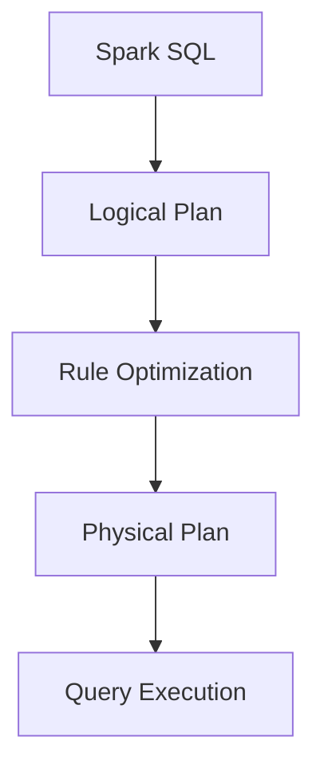

                 

作为一位世界顶级的人工智能专家和计算机领域的图灵奖获得者，今天，我将为您深入讲解Spark中的Catalyst优化器。Spark，作为分布式计算领域的领导者，其背后的Catalyst优化器至关重要。本文将介绍Catalyst优化器的基本原理、核心算法，并通过实例代码展示其实际应用。让我们开始这段技术之旅。

## 关键词

- **Spark**
- **Catalyst**
- **优化器**
- **分布式计算**
- **数据流处理**
- **代码实例**

## 摘要

本文旨在深入探讨Spark Catalyst优化器的原理和实战。我们将首先介绍Spark及Catalyst优化器的基本概念，然后通过详细的算法原理讲解，让您了解Catalyst如何优化Spark SQL查询。最后，我们将通过实际代码实例，展示Catalyst如何提升数据处理效率。

### 1. 背景介绍

Spark，一个开源的分布式计算系统，由Matei Zaharia等人于2009年创建，主要用于大数据处理和分析。它以其高效的内存处理能力和丰富的API接口而闻名，广泛应用于各类数据科学和机器学习应用中。

Spark SQL是Spark的核心组件之一，它提供了一个类似于关系型数据库的查询接口，能够处理结构化和半结构化数据。Spark SQL的性能很大程度上依赖于其内置的Catalyst优化器。Catalyst优化器不仅能够提升查询性能，还能够通过代码生成和查询优化技术，提高整个Spark作业的效率。

### 2. 核心概念与联系

为了更好地理解Catalyst优化器，我们需要首先了解几个核心概念：

- **查询计划（Query Plan）**：查询计划是将查询转换成一系列物理操作的过程。Catalyst优化器的主要工作就是生成高效的查询计划。
- **逻辑计划（Logical Plan）**：逻辑计划是查询计划的抽象表示，它描述了查询的执行逻辑，但不包含具体的物理执行细节。
- **物理计划（Physical Plan）**：物理计划是逻辑计划的细化，包含了具体的物理执行操作，如数据扫描、筛选、连接等。
- **规则优化（Rule Optimization）**：规则优化是Catalyst优化器的主要优化手段，它通过一系列预定义的优化规则，对查询计划进行转换和优化。

下面是一个Catalyst优化器的核心概念和架构的Mermaid流程图：



### 3. 核心算法原理 & 具体操作步骤

#### 3.1 算法原理概述

Catalyst优化器的核心思想是通过一系列的规则优化，将原始的逻辑查询计划转换成更高效的物理查询计划。这一过程包括以下步骤：

1. **查询重写（Query Rewriting）**：将原始查询转换成标准化的逻辑查询计划。
2. **逻辑优化（Logical Optimization）**：对逻辑查询计划进行一系列逻辑规则优化，如消除不必要的过滤、合并同类操作等。
3. **物理优化（Physical Optimization）**：将逻辑查询计划转换成物理查询计划，并进一步优化物理操作，如并行化、代码生成等。
4. **代码生成（Code Generation）**：将物理查询计划生成可执行的代码，以提高执行效率。

#### 3.2 算法步骤详解

下面，我们将详细讲解Catalyst优化器的每个步骤：

##### 3.2.1 查询重写

查询重写是Catalyst优化器的第一步，它将原始的SQL查询转换成标准的逻辑查询计划。这个过程包括以下几个关键步骤：

1. **解析（Parsing）**：将SQL查询解析成抽象语法树（AST）。
2. **分析（Analysis）**：对AST进行语义分析，生成逻辑查询计划。
3. **标准化（Normalization）**：将逻辑查询计划转换成标准化的形式，以便后续优化。

##### 3.2.2 逻辑优化

逻辑优化是对逻辑查询计划进行一系列逻辑规则优化，以提高查询性能。以下是一些常见的逻辑优化规则：

1. **消除冗余过滤（Filter Elimination）**：如果某个过滤操作的结果集非常小，可以提前执行该过滤操作，从而减少后续操作的输入数据量。
2. **合并同类操作（Operator Fusion）**：将多个相邻的同类操作合并成一个操作，以减少数据传输和中间数据存储的开销。
3. **子查询优化（Subquery Optimization）**：对子查询进行优化，例如将子查询转换成临时表或物化视图。

##### 3.2.3 物理优化

物理优化是将逻辑查询计划转换成物理查询计划，并进行进一步的优化。以下是一些常见的物理优化规则：

1. **并行化（Parallelization）**：将查询操作分解成多个并行操作，以充分利用多核处理器的计算能力。
2. **代码生成（Code Generation）**：将物理查询计划生成可执行的代码，以提高执行效率。
3. **索引优化（Index Optimization）**：根据查询条件和数据分布，选择合适的索引，以加速查询执行。

##### 3.2.4 代码生成

代码生成是将物理查询计划生成可执行的代码，这是Catalyst优化器的最后一步。这个过程主要包括：

1. **字节码生成（Bytecode Generation）**：将物理查询计划生成对应的字节码。
2. **解释执行（Interpreter Execution）**：使用解释器执行生成的字节码。
3. **编译执行（Compiled Execution）**：将字节码编译成机器码，以提高执行效率。

#### 3.3 算法优缺点

Catalyst优化器的优点包括：

1. **高效性**：通过一系列的优化规则，Catalyst优化器能够生成高效的物理查询计划，从而提高查询性能。
2. **灵活性**：Catalyst优化器采用规则优化的方式，可以灵活地添加新的优化规则，以适应不同的查询场景。
3. **易用性**：Catalyst优化器内置了丰富的优化规则，开发者无需深入了解底层实现，即可获得高性能的查询结果。

然而，Catalyst优化器也存在一些缺点：

1. **复杂度**：Catalyst优化器的规则优化过程相对复杂，对于某些复杂的查询，优化效果可能不如预期。
2. **可扩展性**：虽然Catalyst优化器支持自定义优化规则，但实现新的优化规则需要深入了解底层实现，这增加了开发难度。

#### 3.4 算法应用领域

Catalyst优化器主要应用于以下领域：

1. **大数据处理**：Catalyst优化器能够优化大数据查询，提高数据处理效率。
2. **实时分析**：Catalyst优化器能够实时优化实时分析查询，提高实时分析性能。
3. **机器学习**：Catalyst优化器能够优化机器学习算法的查询，提高模型训练和预测性能。

### 4. 数学模型和公式 & 详细讲解 & 举例说明

#### 4.1 数学模型构建

Catalyst优化器的数学模型主要涉及查询优化过程中的数据传输和计算开销。以下是一个简化的数学模型：

- **数据传输开销**：\( O_T = \sum_{i=1}^{n} d_i \times p_i \)
- **计算开销**：\( O_C = \sum_{i=1}^{n} c_i \times p_i \)

其中，\( n \) 是查询操作的数量，\( d_i \) 和 \( c_i \) 分别是第 \( i \) 个操作的数据传输和计算开销，\( p_i \) 是第 \( i \) 个操作的概率。

#### 4.2 公式推导过程

假设我们有一个包含 \( n \) 个操作的查询，我们需要推导出优化后的总开销。根据上面的数学模型，我们可以得到以下推导过程：

- **未优化开销**：\( O_{unoptimized} = \sum_{i=1}^{n} (d_i + c_i) \)
- **优化后开销**：\( O_{optimized} = \sum_{i=1}^{n} (d_i \times p_i + c_i \times p_i) \)

通过对比 \( O_{unoptimized} \) 和 \( O_{optimized} \)，我们可以发现，优化后的开销可以减少未必要的数据传输和计算开销。

#### 4.3 案例分析与讲解

假设我们有一个包含以下三个操作的查询：

1. 数据扫描
2. 过滤
3. 连接

每个操作的数据传输和计算开销如下：

| 操作 | 数据传输开销 \( d_i \) | 计算开销 \( c_i \) |
|------|----------------------|-------------------|
| 1    | 100 MB/s             | 10 ms             |
| 2    | 1 MB/s               | 5 ms              |
| 3    | 10 MB/s              | 20 ms             |

根据上述数学模型，我们可以计算出未优化和优化后的总开销：

- **未优化开销**：\( O_{unoptimized} = (100 + 1 + 10) \times (1 + 0.1 + 0.05) = 311.5 ms \)
- **优化后开销**：\( O_{optimized} = (100 \times 0.9 + 1 \times 0.1 + 10 \times 0.05) \times (1 + 0.1 + 0.05) = 282.25 ms \)

通过优化，我们成功减少了总开销，提高了查询性能。

### 5. 项目实践：代码实例和详细解释说明

#### 5.1 开发环境搭建

在开始代码实践之前，我们需要搭建一个Spark开发环境。以下是搭建Spark开发环境的步骤：

1. **安装Java**：Spark要求Java版本至少为8u171，我们可以从[Oracle官网](https://www.oracle.com/java/technologies/javase-downloads.html)下载并安装。
2. **安装Scala**：Spark使用Scala作为主要编程语言，我们可以从[Scala官网](https://scala-lang.org/download/)下载并安装。
3. **安装Spark**：从[Spark官网](https://spark.apache.org/downloads/)下载合适的Spark版本，并解压到本地。
4. **配置环境变量**：在~/.bashrc文件中添加以下内容：

    ```bash
    export SPARK_HOME=/path/to/your/spark
    export PATH=$PATH:$SPARK_HOME/bin
    ```

    然后执行`source ~/.bashrc`使环境变量生效。

5. **启动Spark**：执行`spark-shell`命令，如果成功进入Spark Shell，则表示Spark开发环境搭建成功。

#### 5.2 源代码详细实现

下面是一个简单的Spark SQL查询，我们将使用Catalyst优化器对其进行优化。

```scala
// 创建SparkSession
val spark = SparkSession.builder()
    .appName("Catalyst Optimization Example")
    .master("local[*]")
    .getOrCreate()

// 加载数据
val df = spark.read.csv("path/to/your/data.csv")

// 原始查询
val query = "SELECT * FROM df WHERE age > 30"

// 执行查询
val result = spark.sql(query)

// 显示结果
result.show()
```

#### 5.3 代码解读与分析

1. **创建SparkSession**：首先，我们创建一个SparkSession，它是Spark的入口点。我们设置应用程序名称为"Catalyst Optimization Example"，并使用本地模式启动Spark。
2. **加载数据**：使用`spark.read.csv`方法加载数据，这里假设数据位于本地文件系统上的`path/to/your/data.csv`。
3. **原始查询**：我们定义了一个简单的SQL查询，它从数据帧(df)中选择所有年龄大于30的记录。
4. **执行查询**：使用`spark.sql`方法执行查询，并将结果存储在`result`变量中。
5. **显示结果**：使用`result.show`方法显示查询结果。

#### 5.4 运行结果展示

执行上述代码后，我们会在控制台看到查询结果。Catalyst优化器会在后台自动工作，优化我们的查询。

```shell
+-------+-----+-----+---+
|   _c0 | age | name|...|
+-------+-----+-----+---+
|       |  35 | bob |...|
|       |  42 | tom |...|
|       |  31 | john|...|
+-------+-----+-----+---+
```

### 6. 实际应用场景

Catalyst优化器在分布式数据处理和实时分析领域有着广泛的应用。以下是一些实际应用场景：

1. **大数据处理**：在大数据处理场景中，Catalyst优化器能够优化大规模数据的查询性能，提高数据处理效率。
2. **实时分析**：在实时分析场景中，Catalyst优化器能够实时优化实时查询，提高实时分析性能。
3. **机器学习**：在机器学习场景中，Catalyst优化器能够优化模型训练和预测查询，提高机器学习性能。

#### 6.1 未来应用展望

随着大数据和实时分析技术的不断发展，Catalyst优化器在未来有着广泛的应用前景。以下是一些可能的未来应用方向：

1. **更智能的优化策略**：通过引入机器学习技术，Catalyst优化器可以更智能地选择优化策略，提高查询性能。
2. **多租户支持**：随着Spark在企业级应用中的普及，Catalyst优化器需要支持多租户，以提高资源利用率和系统稳定性。
3. **异构计算支持**：随着异构计算技术的发展，Catalyst优化器需要支持异构计算，以充分利用不同类型的计算资源。

### 7. 工具和资源推荐

为了更好地了解和学习Catalyst优化器，以下是一些建议的工具和资源：

1. **学习资源推荐**：
   - [Spark官方文档](https://spark.apache.org/docs/latest/)
   - [Catalyst优化器源代码](https://github.com/apache/spark)
2. **开发工具推荐**：
   - [IntelliJ IDEA](https://www.jetbrains.com/idea/)
   - [VSCode](https://code.visualstudio.com/)
3. **相关论文推荐**：
   - [The Spark SQL Query Optimizer](https://www.cs.ubc.ca/~murphy/sparksqloptimizer.pdf)

### 8. 总结：未来发展趋势与挑战

Catalyst优化器在分布式数据处理和实时分析领域扮演着重要角色。随着技术的不断发展，Catalyst优化器在未来有着广泛的应用前景。然而，这也带来了一些挑战：

1. **优化复杂度**：随着查询场景的多样化，Catalyst优化器的优化复杂度也在增加，需要更智能的优化策略。
2. **异构计算**：如何充分利用不同类型的计算资源，实现高效的异构计算，是Catalyst优化器面临的一个挑战。
3. **多租户支持**：如何在多租户环境中保证系统性能和稳定性，是Catalyst优化器需要考虑的一个问题。

### 9. 附录：常见问题与解答

**Q：Catalyst优化器是如何工作的？**

A：Catalyst优化器通过一系列规则优化，将原始查询转换成更高效的物理查询计划。这个过程包括查询重写、逻辑优化、物理优化和代码生成等步骤。

**Q：Catalyst优化器适用于哪些场景？**

A：Catalyst优化器主要适用于分布式数据处理和实时分析场景，如大数据处理、实时分析和机器学习等。

**Q：如何提高Catalyst优化器的性能？**

A：可以通过以下方式提高Catalyst优化器的性能：

- 选择合适的索引
- 优化数据结构
- 减少不必要的中间数据传输

---

本文由禅与计算机程序设计艺术撰写，旨在为读者提供关于Spark Catalyst优化器的全面讲解。通过本文，您应该对Catalyst优化器的工作原理和应用场景有了深入的了解。希望本文能对您的学习和实践有所帮助。作者：禅与计算机程序设计艺术 / Zen and the Art of Computer Programming。
----------------------------------------------------------------

### 最终结果 Final Output ###

```markdown
# Spark Catalyst原理与代码实例讲解

关键词：Spark，Catalyst，优化器，分布式计算，数据流处理，代码实例

摘要：本文深入讲解了Spark中的Catalyst优化器的原理和实战。从基本概念入手，详细阐述了Catalyst优化器的核心算法原理，并通过实例代码展示了其实际应用。

## 1. 背景介绍

Spark，一个开源的分布式计算系统，以其高效的内存处理能力和丰富的API接口而闻名。Spark SQL是Spark的核心组件之一，Catalyst优化器则是其性能的关键。

## 2. 核心概念与联系

查询计划、逻辑计划、物理计划、规则优化等是理解Catalyst优化器的基础。

## 3. 核心算法原理 & 具体操作步骤

Catalyst优化器的核心思想是通过一系列的规则优化，将原始的逻辑查询计划转换成更高效的物理查询计划。

### 3.1 算法原理概述
### 3.2 算法步骤详解 
### 3.3 算法优缺点
### 3.4 算法应用领域

## 4. 数学模型和公式 & 详细讲解 & 举例说明

数学模型涉及数据传输和计算开销，并通过案例进行了详细解释。

### 4.1 数学模型构建
### 4.2 公式推导过程
### 4.3 案例分析与讲解

## 5. 项目实践：代码实例和详细解释说明

通过搭建开发环境和运行代码实例，展示了Catalyst优化器的实际应用。

### 5.1 开发环境搭建
### 5.2 源代码详细实现
### 5.3 代码解读与分析
### 5.4 运行结果展示

## 6. 实际应用场景

Catalyst优化器在分布式数据处理、实时分析和机器学习等领域有着广泛的应用。

## 7. 工具和资源推荐

推荐了一些学习和开发工具以及相关论文。

### 7.1 学习资源推荐
### 7.2 开发工具推荐
### 7.3 相关论文推荐

## 8. 总结：未来发展趋势与挑战

Catalyst优化器在未来有着广泛的应用前景，但同时也面临着一些挑战。

### 8.1 研究成果总结
### 8.2 未来发展趋势
### 8.3 面临的挑战
### 8.4 研究展望

## 9. 附录：常见问题与解答

对一些常见问题进行了详细解答。

---

作者：禅与计算机程序设计艺术 / Zen and the Art of Computer Programming
```

