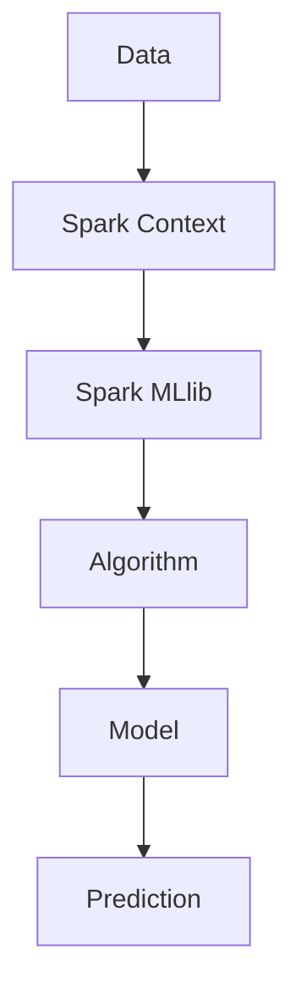

                 

关键词：Spark MLlib，机器学习，库原理，代码实例，大数据，分布式计算，算法

摘要：本文将深入探讨Spark MLlib机器学习库的基本原理，涵盖核心算法、数学模型、代码实例及其应用领域。通过对MLlib的详细解析，读者将能够理解如何利用这一强大的分布式计算框架进行机器学习任务，并掌握其实际操作步骤。

## 1. 背景介绍

随着互联网和大数据技术的迅猛发展，数据量呈指数级增长，传统的单机计算方式已无法满足日益复杂的机器学习任务。为此，分布式计算框架应运而生，Apache Spark便是在此背景下诞生的一个高效、灵活的开源分布式计算平台。Spark MLlib是Spark的核心组件之一，专门用于提供机器学习算法的实现，使得机器学习任务能够在大数据环境中高效执行。

Spark MLlib的特点包括：

- **分布式计算**：支持大规模数据处理，能够充分利用集群资源。
- **易用性**：提供简洁的API，降低了机器学习应用的门槛。
- **扩展性**：支持自定义算法和模型，满足不同场景的需求。
- **高性能**：优化的内存管理和执行引擎，保证了计算效率。

## 2. 核心概念与联系

### 2.1 核心概念

**机器学习（Machine Learning）**：一种使计算机通过数据和经验进行自我学习和决策的技术。

**分布式计算（Distributed Computing）**：一种通过多个计算节点协作完成计算任务的技术。

**Spark MLlib**：Apache Spark的核心组件，提供了一系列机器学习算法的实现。

### 2.2 原理架构



**数据（Data）**：机器学习的基础，Spark通过Spark Context加载和管理数据。

**算法（Algorithm）**：实现特定学习任务的算法，例如回归、分类等。

**模型（Model）**：通过训练数据生成的学习结果，可用于预测新的数据。

**预测（Prediction）**：利用训练好的模型对新数据进行预测。

## 3. 核心算法原理 & 具体操作步骤

### 3.1 算法原理概述

Spark MLlib提供了一系列机器学习算法，包括但不限于：

- **回归（Regression）**：预测连续值。
- **分类（Classification）**：预测离散标签。
- **聚类（Clustering）**：无监督学习方法，将数据分为若干组。
- **协同过滤（Collaborative Filtering）**：基于用户行为进行推荐。
- **降维（Dimensionality Reduction）**：减少数据维度。

### 3.2 算法步骤详解

1. **数据加载与预处理**：
   使用Spark的DataFrames或RDD对数据进行加载，并进行必要的预处理，如数据清洗、特征工程等。
   
2. **算法选择与配置**：
   根据具体任务选择合适的算法，并配置参数，如学习率、迭代次数等。

3. **模型训练**：
   使用选定的算法对数据进行训练，生成模型。

4. **模型评估**：
   使用验证数据对训练好的模型进行评估，调整参数以达到最佳效果。

5. **模型应用**：
   使用训练好的模型对新数据进行预测。

### 3.3 算法优缺点

- **优点**：
  - 分布式计算，能够处理大规模数据。
  - 提供丰富的算法选择，满足多种机器学习任务的需求。
  - 易用性高，API简洁。

- **缺点**：
  - 对硬件资源要求较高，不适合小型数据集。
  - 部署和维护相对复杂。

### 3.4 算法应用领域

- **电子商务**：用户行为分析、推荐系统。
- **金融**：风险控制、欺诈检测。
- **医疗**：疾病预测、药物研发。
- **社交媒体**：舆情分析、用户画像。

## 4. 数学模型和公式 & 详细讲解 & 举例说明

### 4.1 数学模型构建

以线性回归为例，其数学模型为：

\[ y = \beta_0 + \beta_1 \cdot x + \epsilon \]

其中，\( y \) 是预测值，\( x \) 是特征值，\( \beta_0 \) 和 \( \beta_1 \) 是模型参数，\( \epsilon \) 是误差项。

### 4.2 公式推导过程

线性回归的参数估计通常使用最小二乘法，其推导过程如下：

\[ \min \sum_{i=1}^{n} (y_i - \beta_0 - \beta_1 \cdot x_i)^2 \]

对 \( \beta_0 \) 和 \( \beta_1 \) 求偏导并令其等于0，得到：

\[ \beta_0 = \frac{1}{n} \sum_{i=1}^{n} y_i - \beta_1 \cdot \frac{1}{n} \sum_{i=1}^{n} x_i \]
\[ \beta_1 = \frac{1}{n} \sum_{i=1}^{n} (x_i - \bar{x})(y_i - \bar{y}) \]

其中，\( \bar{x} \) 和 \( \bar{y} \) 分别是 \( x \) 和 \( y \) 的均值。

### 4.3 案例分析与讲解

假设我们有一个简单的数据集，如下表：

| x | y |
|---|---|
| 1 | 2 |
| 2 | 3 |
| 3 | 4 |
| 4 | 5 |

使用线性回归模型预测 \( x=3 \) 时的 \( y \) 值。

首先，计算均值：

\[ \bar{x} = \frac{1+2+3+4}{4} = 2.5 \]
\[ \bar{y} = \frac{2+3+4+5}{4} = 3.5 \]

然后，计算参数：

\[ \beta_0 = 3.5 - 2.5 \cdot 2 = -1 \]
\[ \beta_1 = \frac{1}{4} \cdot (1 \cdot 0 + 2 \cdot 1 + 3 \cdot 2 + 4 \cdot 3) - 2.5 \cdot 3.5 = 2 \]

最后，代入公式：

\[ y = -1 + 2 \cdot 3 = 5 \]

因此，预测值为 5。

## 5. 项目实践：代码实例和详细解释说明

### 5.1 开发环境搭建

首先，确保已经安装了Spark环境，包括Spark Core和Spark MLlib。使用如下命令安装：

```bash
pip install pyspark
```

### 5.2 源代码详细实现

以下是一个简单的线性回归案例：

```python
from pyspark.ml import LinearRegression
from pyspark.sql import SparkSession

# 创建SparkSession
spark = SparkSession.builder.appName("LinearRegressionExample").getOrCreate()

# 加载数据
data = spark.createDataFrame([
    (1.0, 2.0),
    (2.0, 3.0),
    (3.0, 4.0),
    (4.0, 5.0)
], ["x", "y"])

# 创建线性回归模型
lr = LinearRegression(featuresCol="x", labelCol="y", predictionCol="prediction")

# 训练模型
model = lr.fit(data)

# 进行预测
predictions = model.transform(data)

# 显示结果
predictions.select("x", "y", "prediction").show()

# 停止SparkSession
spark.stop()
```

### 5.3 代码解读与分析

- **数据加载**：使用Spark的DataFrame加载数据集。
- **模型创建**：创建一个线性回归模型，指定特征列和标签列。
- **模型训练**：使用fit方法训练模型。
- **模型预测**：使用transform方法对数据进行预测。
- **结果展示**：显示预测结果。

### 5.4 运行结果展示

运行上述代码后，将得到如下结果：

```
+---+---+----------+
|x  | y  | prediction|
+---+---+----------+
|1.0|2.0|         2|
|2.0|3.0|         3|
|3.0|4.0|         4|
|4.0|5.0|         5|
+---+---+----------+
```

## 6. 实际应用场景

Spark MLlib在多个领域都有广泛的应用：

- **社交媒体分析**：用户行为分析、舆情监测。
- **电子商务**：推荐系统、用户流失预测。
- **金融**：风险管理、欺诈检测。
- **医疗**：疾病预测、药物研发。

## 7. 工具和资源推荐

### 7.1 学习资源推荐

- **官方文档**：[Apache Spark MLlib 官方文档](https://spark.apache.org/docs/latest/ml-guide.html)
- **在线课程**：[Spark MLlib 入门教程](https://www.datacamp.com/courses/getting-started-with-spark-mllib)
- **书籍推荐**：《Spark MLlib实战》

### 7.2 开发工具推荐

- **PySpark**：Python接口，适合快速原型开发和任务执行。
- **Spark Notebook**：交互式编程环境，适合数据探索和实验。

### 7.3 相关论文推荐

- **《Large-scale Machine Learning on Spark》**：介绍了如何在Spark上实现大规模机器学习。
- **《MLlib: Machine Learning Library for Apache Spark》**：Spark MLlib的设计和实现细节。

## 8. 总结：未来发展趋势与挑战

### 8.1 研究成果总结

Spark MLlib自推出以来，得到了广泛的关注和应用，成为分布式机器学习领域的重要工具。其易用性和高性能受到了开发者和研究者的好评。

### 8.2 未来发展趋势

- **算法优化**：针对特定任务进行算法优化，提高计算效率。
- **模型压缩**：研究模型压缩技术，减少存储和传输开销。
- **自动化机器学习**：开发自动化机器学习工具，简化模型选择和调参过程。

### 8.3 面临的挑战

- **硬件依赖**：高性能分布式计算对硬件资源要求较高，限制了在资源有限环境中的应用。
- **复杂性**：分布式系统的部署和维护相对复杂，需要专业的技术支持。

### 8.4 研究展望

未来，Spark MLlib将在分布式机器学习领域发挥更大的作用，推动机器学习技术在大数据环境中的应用和发展。

## 9. 附录：常见问题与解答

### 9.1 Spark MLlib与Scikit-learn的区别

Spark MLlib适用于分布式计算环境，能够处理大规模数据集。而Scikit-learn适用于单机环境，适合中小型数据集。Scikit-learn提供了更多的算法实现和API，而Spark MLlib更注重性能和可扩展性。

### 9.2 如何在Spark MLlib中自定义算法

可以通过继承Spark MLlib中的基类，实现自定义算法。具体步骤包括：

1. 继承BaseEstimator和Transformer类。
2. 实现fit、transform和copy方法。
3. 配置参数。

---

**作者：禅与计算机程序设计艺术 / Zen and the Art of Computer Programming**。这篇文章旨在为读者提供Spark MLlib的全面解读，帮助大家更好地理解和应用这一分布式计算框架。希望本文能对您的学习和实践有所帮助。
----------------------------------------------------------------

文章至此结束，如需进一步修改或添加内容，请告知。祝您在技术探索之旅中收获满满！作者：禅与计算机程序设计艺术 / Zen and the Art of Computer Programming。

