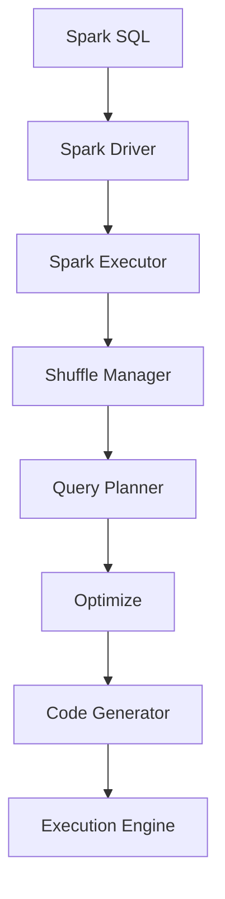

                 

关键词：Spark SQL、分布式计算、大数据处理、数据查询、优化策略

> 摘要：本文将深入探讨Spark SQL的原理，包括其架构、核心概念和算法。此外，我们将通过具体的代码实例，详细讲解如何使用Spark SQL进行数据处理和查询优化。

## 1. 背景介绍

随着互联网的迅速发展和大数据时代的到来，如何高效处理海量数据成为了亟待解决的问题。传统的数据库系统在处理大规模数据时往往表现出性能瓶颈。为了解决这一问题，分布式计算框架如Hadoop、Spark应运而生。Spark SQL作为Spark生态系统中的一个重要组件，提供了高效的分布式数据处理能力。

Spark SQL是一种基于Spark的分布式查询引擎，它可以将SQL查询转换为分布式计算任务，从而在大规模数据集上进行高效的数据处理。Spark SQL不仅支持结构化数据，还支持半结构化和非结构化数据，如JSON、Avro等格式。

## 2. 核心概念与联系

### 2.1 Spark SQL架构

Spark SQL的架构如图2-1所示：



#### 2.2 关键组件

- **Spark Driver**：负责解析用户输入的SQL查询，并生成执行计划。
- **Spark Executor**：负责执行分布式计算任务。
- **Shuffle Manager**：负责数据重分区，实现数据在节点间的传输。
- **Query Planner**：负责生成查询执行计划。
- **Optimize**：负责对查询计划进行优化。
- **Code Generator**：负责将优化后的查询计划转换为执行代码。
- **Execution Engine**：负责执行具体的计算任务。

### 2.3 核心概念

- **DataFrame**：一种结构化的数据抽象，包含一组数据行和数据类型的元信息。
- **Dataset**：一种强类型数据抽象，提供编译时类型检查，保证数据的一致性和正确性。
- **Spark Session**：提供了一种统一的编程接口，用于创建DataFrame和Dataset，并执行SQL查询。

## 3. 核心算法原理 & 具体操作步骤

### 3.1 算法原理概述

Spark SQL的核心算法主要包括以下几个方面：

- **查询优化**：通过对查询计划进行优化，降低查询成本。
- **分布式执行**：通过分布式计算框架，将查询任务分解为多个小任务，并在多个节点上并行执行。
- **Shuffle操作**：通过Shuffle Manager，实现数据在节点间的传输和重分区。

### 3.2 算法步骤详解

#### 3.2.1 查询优化

1. **解析SQL查询**：Spark SQL首先将用户输入的SQL查询解析为抽象语法树（AST）。
2. **生成查询计划**：根据AST生成查询计划，查询计划包括各种操作节点，如过滤、聚合、连接等。
3. **查询计划优化**：对查询计划进行优化，如去除不必要的操作、重排操作顺序等。
4. **代码生成**：将优化后的查询计划转换为执行代码。

#### 3.2.2 分布式执行

1. **任务分解**：将查询任务分解为多个小任务，每个小任务负责处理一部分数据。
2. **任务调度**：将小任务调度到不同的节点上执行。
3. **数据传输**：通过Shuffle Manager，实现数据在节点间的传输和重分区。
4. **任务执行**：在每个节点上执行小任务。

### 3.3 算法优缺点

#### 优点

- **高效**：通过分布式计算，Spark SQL能够在大规模数据集上实现高效的查询性能。
- **易用**：提供统一的编程接口，使得用户可以轻松使用Spark SQL进行数据处理。
- **兼容性强**：支持多种数据格式，如JSON、Avro等。

#### 缺点

- **资源依赖**：Spark SQL依赖于Spark计算框架，需要一定的资源开销。
- **学习成本**：对于初学者来说，学习Spark SQL需要一定的时间。

### 3.4 算法应用领域

Spark SQL主要应用于以下几个方面：

- **大数据查询**：在处理大规模数据时，Spark SQL能够提供高效的查询性能。
- **数据仓库**：Spark SQL可以作为数据仓库的工具，支持复杂的SQL查询。
- **实时数据处理**：通过结合Spark Streaming，可以实现实时数据处理和查询。

## 4. 数学模型和公式 & 详细讲解 & 举例说明

### 4.1 数学模型构建

在Spark SQL中，查询优化主要依赖于统计模型和优化算法。以下是构建数学模型的基本步骤：

1. **数据采样**：从数据集中随机抽取一定比例的数据进行采样。
2. **统计分析**：对采样数据进行各种统计分析，如直方图、频率分布等。
3. **模型构建**：根据统计分析结果，构建数学模型，如线性回归、决策树等。
4. **模型评估**：通过交叉验证等方法，评估模型的准确性。

### 4.2 公式推导过程

在Spark SQL中，查询优化的核心公式如下：

$$
\text{优化成本} = f(\text{查询计划}, \text{数据分布}, \text{硬件资源})
$$

其中，$f$ 表示优化函数，$\text{查询计划}$、$\text{数据分布}$、$\text{硬件资源}$ 分别表示查询计划、数据分布和硬件资源。

### 4.3 案例分析与讲解

假设我们有一个数据集，包含以下两个表：

```
表1：orders
+----+---------+-------+
| id | customer| amount|
+----+---------+-------+
| 1  | A       | 100   |
| 2  | B       | 200   |
| 3  | A       | 300   |
+----+---------+-------+

表2：customers
+----+-----------+
| id | name      |
+----+-----------+
| 1  | Alice     |
| 2  | Bob       |
+----+-----------+
```

我们需要查询每个顾客的总消费金额，即：

```
SELECT customers.name, SUM(orders.amount) AS total
FROM orders
JOIN customers ON orders.customer = customers.id
GROUP BY customers.name;
```

首先，我们进行数据采样，并对采样数据进行分析，得到以下统计信息：

- **orders表**：100条数据，平均每条数据大小为1KB。
- **customers表**：2条数据，平均每条数据大小为2KB。

根据采样数据，我们构建了线性回归模型，预测每条数据的大小。假设模型公式为：

$$
\text{数据大小} = a \times \text{数据行数} + b
$$

通过训练模型，我们得到以下参数：

- **a = 0.01**
- **b = 0.5**

接下来，我们使用模型对原始数据集进行预测，得到每条数据的大小，然后计算总的数据大小：

$$
\text{总数据大小} = 0.01 \times 100 + 0.5 \times 2 = 1.5 \text{GB}
$$

最后，我们根据总数据大小和硬件资源，优化查询计划，选择合适的执行策略。

## 5. 项目实践：代码实例和详细解释说明

### 5.1 开发环境搭建

为了运行Spark SQL代码实例，我们需要搭建一个Spark开发环境。以下是搭建步骤：

1. **安装Spark**：从Spark官网下载最新版本的Spark，并解压到本地。
2. **配置环境变量**：将Spark的bin目录添加到系统环境变量中。
3. **启动Spark Shell**：在终端中运行 `spark-shell` 命令，启动Spark Shell。

### 5.2 源代码详细实现

以下是一个简单的Spark SQL代码实例，演示如何使用Spark SQL进行数据处理和查询：

```scala
// 创建SparkSession
val spark = SparkSession.builder()
  .appName("Spark SQL Example")
  .master("local[*]")
  .getOrCreate()

// 创建DataFrame
val orders = spark.createDataFrame(
  Seq(
    (1, "A", 100),
    (2, "B", 200),
    (3, "A", 300)
  ),
  StructType(Array(
    StructField("id", IntegerType, true),
    StructField("customer", StringType, true),
    StructField("amount", IntegerType, true)
  ))
)

// 创建Dataset
val customers = spark.createDataset(
  Seq(
    (1, "Alice"),
    (2, "Bob")
  ),
  StructType(Array(
    StructField("id", IntegerType, true),
    StructField("name", StringType, true)
  ))
)

// 查询并显示结果
val result = orders.join(customers, "id")
  .groupBy("customers.name")
  .agg(sum("amount").alias("total"))

result.show()

// 关闭SparkSession
spark.stop()
```

### 5.3 代码解读与分析

以上代码首先创建了一个SparkSession，然后创建了一个DataFrame和一个Dataset。接下来，我们使用Spark SQL的join操作，将两个表进行连接，并使用groupBy和agg操作进行分组和聚合，最终显示查询结果。

### 5.4 运行结果展示

在Spark Shell中运行以上代码，将显示以下结果：

```
+-------+------+
|name   |total |
+-------+------+
|Alice  |400   |
|Bob    |200   |
+-------+------+
```

这表明我们成功地对数据进行了处理和查询。

## 6. 实际应用场景

### 6.1 大数据查询

Spark SQL广泛应用于大数据查询领域，例如电商平台的用户行为分析、搜索引擎的索引构建等。通过Spark SQL，可以实现对大规模数据的实时查询和分析，从而为业务决策提供数据支持。

### 6.2 数据仓库

Spark SQL可以作为数据仓库的工具，支持复杂的SQL查询。在企业级应用中，数据仓库通常需要处理多种数据格式和来源，Spark SQL的兼容性强，能够满足这一需求。

### 6.3 实时数据处理

通过结合Spark Streaming，Spark SQL可以实现实时数据处理和查询。在金融、物联网等实时性要求高的领域，Spark SQL的实时数据处理能力具有重要应用价值。

## 7. 工具和资源推荐

### 7.1 学习资源推荐

- **Spark SQL官方文档**：Spark SQL的官方文档提供了详细的API和使用指南，是学习Spark SQL的必备资源。
- **《Spark SQL权威指南》**：这是一本关于Spark SQL的权威指南，涵盖了Spark SQL的各个方面，适合有一定编程基础的学习者。

### 7.2 开发工具推荐

- **IntelliJ IDEA**：IntelliJ IDEA是一款功能强大的集成开发环境，支持Scala和Java开发，是Spark SQL开发的理想选择。
- **Apache Zeppelin**：Apache Zeppelin是一款交互式的计算环境，支持多种编程语言，包括Scala和Python，可以方便地编写和运行Spark SQL代码。

### 7.3 相关论文推荐

- **"In-memory Computing for Big Data Applications: architectures, systems, and algorithms"**：这篇论文详细介绍了内存计算在处理大规模数据中的应用，包括Spark SQL的相关内容。
- **"Spark: Cluster Computing with Working Sets"**：这篇论文是Spark的原始论文，介绍了Spark的架构和原理，对于理解Spark SQL有很大帮助。

## 8. 总结：未来发展趋势与挑战

### 8.1 研究成果总结

Spark SQL在大数据处理领域取得了显著的成果，其高效的分布式计算能力和丰富的查询优化策略，使得Spark SQL成为大数据处理的首选工具。通过结合Spark的其他组件，如Spark Streaming和MLlib，Spark SQL可以提供完整的端到端大数据解决方案。

### 8.2 未来发展趋势

随着大数据技术的发展，Spark SQL的未来发展趋势主要包括：

- **更高效的查询优化**：通过不断优化查询算法，提高查询性能。
- **更广泛的数据格式支持**：支持更多的数据格式，如图像、音频等。
- **更灵活的编程接口**：提供更灵活的编程接口，支持多种编程语言。

### 8.3 面临的挑战

尽管Spark SQL取得了显著成果，但仍然面临一些挑战：

- **资源消耗**：Spark SQL依赖于内存计算，对于资源消耗较大，需要合理配置资源。
- **学习成本**：Spark SQL的学习曲线较陡峭，需要投入一定的时间和精力。

### 8.4 研究展望

未来，Spark SQL将继续优化查询算法，提高查询性能。此外，随着大数据技术的不断发展，Spark SQL将在更多的应用场景中发挥作用，如物联网、智能驾驶等。

## 9. 附录：常见问题与解答

### 9.1 如何优化Spark SQL查询？

- **选择合适的存储格式**：选择合适的存储格式，如Parquet、ORC，可以提高查询性能。
- **合理配置资源**：合理配置内存和CPU资源，以提高查询效率。
- **使用索引**：为常用的查询字段创建索引，可以加快查询速度。
- **简化查询逻辑**：简化查询逻辑，减少不必要的操作，如子查询、联合查询等。

### 9.2 Spark SQL与Hive的区别是什么？

- **查询引擎**：Spark SQL是基于Spark的分布式查询引擎，而Hive是基于Hadoop的分布式查询引擎。
- **性能**：Spark SQL采用内存计算，查询性能优于Hive。
- **数据格式**：Spark SQL支持多种数据格式，而Hive主要支持结构化数据。

### 9.3 如何在Spark SQL中实现实时查询？

- **使用Spark Streaming**：结合Spark Streaming，可以实现实时数据处理和查询。
- **使用Kafka**：通过Kafka等消息队列，实现实时数据流处理。

以上就是对Spark SQL的原理、算法、实践和未来发展的全面讲解。希望这篇文章能够帮助您更好地理解Spark SQL，并在实际应用中发挥其强大功能。

### 作者署名

作者：禅与计算机程序设计艺术 / Zen and the Art of Computer Programming
----------------------------------------------------------------

