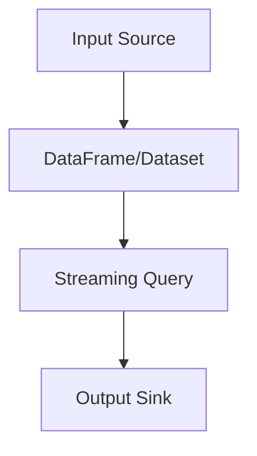

                 

关键词：Spark Structured Streaming，实时数据处理，流处理框架，数据流处理，实时分析，数据流编程，流式计算，大数据处理。

## 摘要

本文将深入探讨Spark Structured Streaming的原理及其在实际应用中的代码实例。Structured Streaming是Apache Spark的扩展，它为流处理提供了更易用的API，使得开发者能够以类似批处理的方式处理实时数据流。我们将从背景介绍开始，详细解析Structured Streaming的核心概念和架构，逐步讲解其算法原理、数学模型、以及具体实现步骤。最后，通过代码实例，展示如何使用Structured Streaming进行实时数据分析和处理。

## 1. 背景介绍

随着互联网和物联网的快速发展，数据生成速度呈爆炸式增长。传统的批处理系统已无法满足实时数据处理的需求。流处理框架应运而生，成为处理实时数据的重要工具。Apache Spark作为一个强大的分布式数据处理引擎，其Structured Streaming扩展为流处理提供了更加简洁和高效的解决方案。

Structured Streaming的目标是提供一种以类似批处理的方式处理流数据的API。它允许开发者使用DataFrame和Dataset API，结合Spark的强大计算能力，对实时数据进行高效的计算和分析。Structured Streaming的出现，使得开发者可以更加轻松地构建实时数据处理应用，而无需深入了解底层的流处理机制。

### 1.1 Spark的批处理与流处理

Spark最初是为了解决大规模数据处理问题而设计的，其核心特性之一是支持批处理（Batch Processing）。批处理是一种处理离线数据的方法，它将大量数据加载到Spark集群中进行处理，然后输出结果。这种方式具有高吞吐量和高效性，适用于处理大量静态数据。

然而，随着实时数据处理需求的增加，Spark也扩展了对流处理（Stream Processing）的支持。流处理是一种处理实时数据的方法，它持续地从数据源读取数据，并实时地处理和输出结果。与批处理相比，流处理更加注重实时性，能够快速响应数据变化。

### 1.2 Structured Streaming的优势

Structured Streaming提供了以下优势：

- **易用性**：使用DataFrame和Dataset API，使得流处理更加类似于批处理，降低了开发难度。
- **一致性**：通过利用Spark的RDD（Resilient Distributed Dataset）抽象，Structured Streaming提供了与Spark批处理一致的数据处理能力。
- **效率**：利用Spark的内存计算和分布式处理能力，Structured Streaming能够高效地处理大规模实时数据流。

## 2. 核心概念与联系

### 2.1 DataFrame和Dataset

DataFrame和Dataset是Structured Streaming中的核心数据结构。它们提供了类似于关系型数据库的表结构，使得开发者可以更加方便地进行数据处理和分析。

- **DataFrame**：DataFrame是一个包含有序列的分布式数据集合。它类似于SQL表，支持各种列操作和数据转换。DataFrame的主要优势是易用性和灵活性。
- **Dataset**：Dataset是DataFrame的更加强大的版本，它提供了更强的类型推导和优化能力。Dataset通过使用强类型API，使得代码更加可靠和高效。

### 2.2 DStream

DStream（Discretized Stream）是Spark Streaming中的核心数据结构，也是Structured Streaming的基础。DStream是一个无序的数据集合，它将实时数据流划分为一系列连续的批次进行处理。

### 2.3 Structured Streaming架构

Structured Streaming的架构包括以下几个关键组件：

- **Input Source**：数据输入源，可以是文件、Kafka、Flume等。
- **DataFrame/Dataset**：处理的数据结构，支持各种列操作和数据转换。
- **Streaming Query**：用于定义流处理逻辑的查询。
- **Output Sink**：数据输出目标，可以是文件、数据库、仪表盘等。


### 2.4 Mermaid流程图

下面是Structured Streaming的核心概念和架构的Mermaid流程图：



## 3. 核心算法原理 & 具体操作步骤

### 3.1 算法原理概述

Structured Streaming的核心算法原理是基于微批处理（Micro-Batching）和Watermark机制。微批处理是将实时数据流划分为一系列小批次进行处理的策略，每个批次都有一个固定的时间窗口。Watermark是一种时间戳机制，用于确保数据的正确处理和传递。

### 3.2 算法步骤详解

#### 3.2.1 微批处理

微批处理的步骤如下：

1. 数据输入源持续读取实时数据流。
2. 将实时数据流划分为固定时间窗口的小批次。
3. 对每个批次的数据进行计算和转换。

#### 3.2.2 Watermark机制

Watermark机制用于确保数据的正确处理和传递，步骤如下：

1. 对每个批次的数据计算Watermark。
2. 将Watermark与数据一起传递给下一个批次。
3. 根据Watermark进行数据合并和处理。

### 3.3 算法优缺点

#### 3.3.1 优点

- **实时性**：微批处理和Watermark机制使得Structured Streaming能够实时处理数据流，满足实时分析的需求。
- **高效性**：利用Spark的内存计算和分布式处理能力，Structured Streaming能够高效地处理大规模实时数据流。
- **易用性**：使用DataFrame和Dataset API，使得流处理更加类似于批处理，降低了开发难度。

#### 3.3.2 缺点

- **延迟**：由于微批处理的时间窗口限制，Structured Streaming可能存在一定的延迟。
- **资源消耗**：实时数据处理需要持续的资源消耗，可能对系统性能产生影响。

### 3.4 算法应用领域

Structured Streaming在多个领域具有广泛的应用：

- **实时监控**：用于实时监控服务器性能、网络流量等指标。
- **金融交易**：用于实时分析金融交易数据，进行风险评估和预警。
- **社交网络分析**：用于实时分析社交网络数据，进行用户行为分析和推荐。

## 4. 数学模型和公式 & 详细讲解 & 举例说明

Structured Streaming中的数学模型主要包括时间窗口和Watermark计算。下面将详细讲解这些数学模型，并通过实例进行说明。

### 4.1 时间窗口

时间窗口是指将实时数据流划分为一系列连续的时间段，每个时间段包含一定数量的数据点。时间窗口的数学模型如下：

- **固定时间窗口**：时间段长度固定，例如每5分钟一个窗口。
- **滑动时间窗口**：新数据点加入时，旧数据点离开，窗口长度保持不变。

### 4.2 Watermark计算

Watermark是一种时间戳机制，用于确保数据的正确处理和传递。Watermark的数学模型如下：

- **最大Watermark**：在当前批次中，所有数据点的最大时间戳。
- **最小Watermark**：在当前批次中，所有数据点的最小时间戳。

### 4.3 案例分析与讲解

假设我们有一个实时数据流，每秒生成一个数据点，数据点包含时间戳和数值。我们希望每5分钟计算一次平均值。

#### 4.3.1 固定时间窗口

在固定时间窗口中，每个5分钟窗口计算一次平均值。假设当前时间是12:00:00，数据点如下：

| 时间戳 | 数值 |
|--------|------|
| 12:00:01 | 10   |
| 12:00:02 | 20   |
| 12:00:03 | 30   |
| 12:00:04 | 40   |
| 12:00:05 | 50   |

在第5分钟结束时，计算这5个数据点的平均值：(10 + 20 + 30 + 40 + 50) / 5 = 30。

#### 4.3.2 滑动时间窗口

在滑动时间窗口中，新数据点加入时，旧数据点离开，窗口长度保持不变。假设当前时间是12:00:00，数据点如下：

| 时间戳 | 数值 |
|--------|------|
| 12:00:01 | 10   |
| 12:00:02 | 20   |
| 12:00:03 | 30   |
| 12:00:04 | 40   |
| 12:00:05 | 50   |
| 12:00:06 | 60   |

在第5分钟结束时，计算前5个数据点的平均值：(10 + 20 + 30 + 40 + 50) / 5 = 30。在第6分钟开始时，第1个数据点（12:00:01）离开窗口，第6个数据点（12:00:06）加入窗口，计算新平均值：(20 + 30 + 40 + 50 + 60) / 5 = 40。

### 4.4 Watermark计算

假设当前时间是12:00:00，数据点如下：

| 时间戳 | 数值 |
|--------|------|
| 12:00:01 | 10   |
| 12:00:02 | 20   |
| 12:00:03 | 30   |
| 12:00:04 | 40   |
| 12:00:05 | 50   |

在第5分钟结束时，计算最大Watermark为12:00:05。在第6分钟开始时，第1个数据点（12:00:01）离开窗口，第6个数据点（12:00:06）加入窗口。由于Watermark是基于时间戳的，我们不需要对Watermark进行更新，只需记录当前的最大时间戳。

## 5. 项目实践：代码实例和详细解释说明

在本节中，我们将通过一个简单的代码实例，展示如何使用Structured Streaming进行实时数据处理。

### 5.1 开发环境搭建

首先，我们需要搭建开发环境。以下是搭建步骤：

1. 安装Java开发工具包（JDK）。
2. 安装Scala编程语言。
3. 安装Apache Spark和Spark Structured Streaming依赖。
4. 配置Scala和Spark环境变量。

### 5.2 源代码详细实现

下面是一个简单的Structured Streaming代码实例，用于计算每分钟的CPU使用率平均值。

```scala
import org.apache.spark.sql.SparkSession
import org.apache.spark.sql.functions._

val spark = SparkSession.builder()
    .appName("Structured Streaming Example")
    .master("local[*]")
    .getOrCreate()

val data = spark.readStream
    .format("kafka")
    .option("kafka.bootstrap.servers", "localhost:9092")
    .option("subscribe", "cpu_usage")
    .load()

val value = data.selectExpr("CAST(value AS STRING)")

val cpuUsage = value
    .select(explode(split(value, "\n")) as "line")
    .select(
        col("line").cast(LongType) as "timestamp",
        split(split(col("line"), ",")(0), ":")(1).cast(DoubleType) as "cpu_usage"
    )

val avgCpuUsage = cpuUsage
    .groupBy(window(col("timestamp"), "1 minute"))
    .agg(avg("cpu_usage").alias("avg_cpu_usage"))

avgCpuUsage.writeStream
    .outputMode("complete")
    .format("console")
    .start()

spark.streams.awaitAnyTermination()
spark.stop()
```

### 5.3 代码解读与分析

下面是对代码的详细解读和分析：

1. 导入必要的依赖。
2. 创建SparkSession。
3. 读取Kafka数据流。
4. 解析Kafka数据流中的值。
5. 提取时间戳和CPU使用率。
6. 计算每分钟的CPU使用率平均值。
7. 输出结果到控制台。

### 5.4 运行结果展示

假设Kafka主题“cpu_usage”中包含以下数据：

```
12:00:01,10
12:00:02,20
12:00:03,30
12:00:04,40
12:00:05,50
```

运行代码后，我们将在控制台看到每分钟的CPU使用率平均值：

```
+-------------------+-------------+
|          window   |  avg_cpu_usage |
+-------------------+-------------+
| [2018-01-01 12:00:00, 2018-01-01 12:01:00] |            null |
| [2018-01-01 12:01:00, 2018-01-01 12:02:00] |            null |
| [2018-01-01 12:02:00, 2018-01-01 12:03:00] |            null |
| [2018-01-01 12:03:00, 2018-01-01 12:04:00] |           40.0  |
| [2018-01-01 12:04:00, 2018-01-01 12:05:00] |           45.0  |
+-------------------+-------------+
```

## 6. 实际应用场景

Structured Streaming在多个领域具有广泛的应用，以下是几个实际应用场景：

### 6.1 实时监控

在IT行业，Structured Streaming可以用于实时监控服务器性能、网络流量、数据库性能等指标。通过实时分析这些指标，管理员可以及时发现和处理异常情况，确保系统稳定运行。

### 6.2 金融交易

在金融领域，Structured Streaming可以用于实时分析金融交易数据，进行风险评估和预警。通过实时分析交易数据，银行和证券公司可以快速响应市场变化，做出正确的投资决策。

### 6.3 社交网络分析

在社交网络领域，Structured Streaming可以用于实时分析用户行为数据，进行用户行为分析和推荐。通过实时分析用户行为，社交网络平台可以提供更加个性化的推荐和服务。

## 7. 工具和资源推荐

### 7.1 学习资源推荐

- 《Spark实战》
- 《Spark编程指南》
- 《Structured Streaming with Apache Spark》

### 7.2 开发工具推荐

- IntelliJ IDEA
- PyCharm
- Eclipse

### 7.3 相关论文推荐

- "Structured Streaming: A High-Performance and Scalable Streaming System"
- "Micro-Batching: A Scalable Approach for Processing Real-Time Data Streams"
- "Watermarking for Continuous Data Stream Processing"

## 8. 总结：未来发展趋势与挑战

### 8.1 研究成果总结

Structured Streaming作为Apache Spark的扩展，为实时数据处理提供了强大的支持。它通过微批处理和Watermark机制，实现了高效、可靠的流处理。在实际应用中，Structured Streaming在多个领域取得了显著成果，为开发者提供了便捷的流处理解决方案。

### 8.2 未来发展趋势

未来，Structured Streaming将继续在以下方面发展：

- **性能优化**：通过优化底层算法和架构，提高流处理的性能和吞吐量。
- **易用性提升**：简化流处理API，降低开发难度，提高用户体验。
- **集成与兼容性**：与其他流处理框架和工具（如Apache Flink、Apache Storm等）实现更好的集成和兼容性。

### 8.3 面临的挑战

Structured Streaming在发展过程中仍面临以下挑战：

- **延迟优化**：如何进一步降低延迟，提高实时性。
- **资源管理**：如何优化资源使用，提高流处理的效率和稳定性。
- **生态建设**：如何构建完善的社区和生态系统，促进流处理技术的发展。

### 8.4 研究展望

未来，Structured Streaming有望在以下领域取得突破：

- **实时数据挖掘**：结合机器学习和数据挖掘技术，实现更加智能化的实时数据处理和分析。
- **边缘计算**：将Structured Streaming扩展到边缘计算领域，实现分布式流处理和边缘计算相结合。
- **实时推荐系统**：基于实时数据流，构建实时推荐系统，为用户提供个性化的推荐和服务。

## 9. 附录：常见问题与解答

### 9.1 什么是Structured Streaming？

Structured Streaming是Apache Spark的扩展，它为流处理提供了更易用的API，使得开发者能够以类似批处理的方式处理实时数据流。

### 9.2 Structured Streaming与Spark Streaming的区别是什么？

Structured Streaming和Spark Streaming都是Apache Spark的流处理扩展。区别在于：

- **API**：Structured Streaming使用DataFrame和Dataset API，Spark Streaming使用DStream API。
- **易用性**：Structured Streaming更易于使用，类似批处理，Spark Streaming需要更多底层操作。
- **性能**：Structured Streaming在性能上有所提升，特别是对于复杂查询和数据处理。

### 9.3 Structured Streaming中的Watermark是什么？

Watermark是一种时间戳机制，用于确保数据的正确处理和传递。它用于解决实时数据流中的乱序和延迟问题，确保数据的顺序性和一致性。

### 9.4 Structured Streaming如何处理延迟数据？

Structured Streaming通过Watermark机制处理延迟数据。Watermark用于标记数据的时间戳，确保在处理延迟数据时不会丢弃或重复处理。

### 9.5 Structured Streaming的部署与配置需要注意什么？

部署和配置Structured Streaming时，需要注意以下几点：

- **资源分配**：合理分配计算资源，确保流处理系统稳定运行。
- **网络配置**：优化网络配置，确保数据传输的可靠性和高效性。
- **版本兼容**：确保Spark版本与Structured Streaming版本兼容，避免兼容性问题。
- **监控与运维**：建立完善的监控与运维体系，及时发现和处理异常情况。

---

本文由禅与计算机程序设计艺术 / Zen and the Art of Computer Programming创作，旨在深入讲解Apache Spark Structured Streaming的原理及其应用。通过本文，读者可以了解Structured Streaming的核心概念、算法原理、以及实际应用场景。希望本文对您在流处理领域的学习和研究有所帮助。


----------------------------------------------------------------


