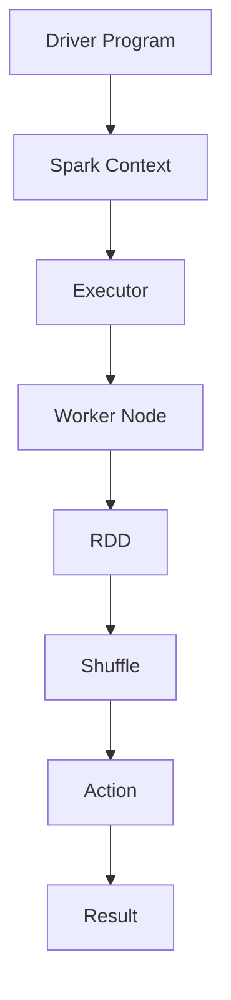

                 

关键词：大数据，Spark，数据处理，分布式计算，性能优化，数据流处理，内存计算，Hadoop，MapReduce

>摘要：本文将深入探讨 Spark 在大数据分析中的应用，从核心概念、算法原理、数学模型、项目实践到实际应用场景，全面解析 Spark 的数据处理能力。旨在为读者提供一个系统化的学习指南，帮助理解和掌握 Spark 在大数据领域的实际应用。

## 1. 背景介绍

随着互联网和物联网的快速发展，数据量呈现出爆炸式增长。大数据时代已经到来，传统的数据处理方法已无法满足日益增长的数据需求。分布式计算技术应运而生，其中 Spark 作为一种高性能、易用的分布式计算框架，成为大数据领域的重要工具。

Spark 由 Apache 软件基金会维护，是一个开源的分布式计算系统，专为大数据处理而设计。与 Hadoop 的 MapReduce 相比，Spark 具有更快的处理速度，支持内存计算，能够处理批处理和流处理任务，并且提供了丰富的 API，包括 Java、Scala、Python 和 R 等语言，使得开发变得更加便捷。

## 2. 核心概念与联系

### 2.1 核心概念

- **RDD (Resilient Distributed Dataset)**：可伸缩的分布式数据集，是 Spark 的基本数据结构。
- **DataFrame**：一张表，由 RDD 转换而来，提供了更丰富的结构化数据操作。
- **Dataset**：强类型的数据集，提供了编译时类型检查。
- **Spark Context**：Spark 的入口点，负责初始化 Spark 集群。
- **Spark Session**：Spark 2.0 中引入，是 Spark Context 的封装，简化了数据操作。

### 2.2 原理与架构

以下是 Spark 的架构原理的 Mermaid 流程图：



- **Driver Program**：执行 Spark 应用程序的主程序。
- **Spark Context**：与 Executor 通信，管理整个应用的生命周期。
- **Executor**：在 Worker Node 上运行的任务执行器。
- **Worker Node**：运行 Executor 的节点。
- **RDD**：分布式数据集，支持弹性存储和容错。
- **Shuffle**：数据重新分布的过程，用于聚合和 join 操作。
- **Action**：触发计算结果的输出，如 `count()`、`saveAsTextFile()`。

## 3. 核心算法原理 & 具体操作步骤

### 3.1 算法原理概述

Spark 的核心算法基于内存计算和分布式处理。其基本操作包括：

- **Transformation**：转换操作，如 `map()`、`filter()`、`reduce()`。
- **Action**：行动操作，如 `collect()`、`count()`、`saveAsTextFile()`。

### 3.2 算法步骤详解

1. **初始化 Spark Session**：
   ```python
   from pyspark.sql import SparkSession
   spark = SparkSession.builder.appName("DataProcessing").getOrCreate()
   ```

2. **加载数据**：
   ```python
   df = spark.read.csv("path/to/data.csv", header=True, inferSchema=True)
   ```

3. **数据转换**：
   ```python
   df_filtered = df.filter(df["column"] > 10)
   df_grouped = df_filtered.groupBy("group_column").agg({"value_column": "sum"})
   ```

4. **执行行动操作**：
   ```python
   df_grouped.show()
   df_grouped.write.csv("path/to/output.csv")
   ```

### 3.3 算法优缺点

- **优点**：
  - 内存计算，性能高。
  - 易于使用，提供多种 API。
  - 高度可伸缩，支持大规模数据处理。
- **缺点**：
  - 数据量过大时，内存不足可能导致性能下降。
  - 需要特定的硬件支持，如 GPU。

### 3.4 算法应用领域

- 数据挖掘和机器学习：用于处理大规模数据集，实现高效的机器学习算法。
- 实时数据流处理：处理实时数据流，提供快速响应。
- 数据仓库：优化查询性能，提供数据分析和报表生成。

## 4. 数学模型和公式 & 详细讲解 & 举例说明

### 4.1 数学模型构建

Spark 的算法可以抽象为以下数学模型：

- **变换操作**：$f: X \rightarrow Y$，其中 $X$ 和 $Y$ 分别是输入和输出的数据集。
- **聚合操作**：$\sigma_{g}: (X, Z) \rightarrow Z$，其中 $g$ 是聚合函数，$Z$ 是聚合结果的集合。

### 4.2 公式推导过程

假设有一个数据集 $D$，其中每个元素 $d$ 都是一个 $n$ 维向量。我们想要计算每个元素的平均值：

$$
\mu = \frac{1}{|D|} \sum_{d \in D} d
$$

其中，$|D|$ 是数据集的元素数量。

### 4.3 案例分析与讲解

#### 4.3.1 计算平均值

```python
from pyspark.sql import SparkSession

# 初始化 Spark Session
spark = SparkSession.builder.appName("AverageCalculation").getOrCreate()

# 加载数据
data = [1, 2, 3, 4, 5]
df = spark.createDataFrame(data, schema=["number"])

# 计算平均值
avg = df.selectExpr("avg(number)").collect()[0][0]

# 输出结果
print("Average:", avg)

# 关闭 Spark Session
spark.stop()
```

运行结果为 `Average: 3.0`。

#### 4.3.2 计算总和

```python
from pyspark.sql import SparkSession

# 初始化 Spark Session
spark = SparkSession.builder.appName("SumCalculation").getOrCreate()

# 加载数据
data = [1, 2, 3, 4, 5]
df = spark.createDataFrame(data, schema=["number"])

# 计算总和
sum = df.selectExpr("sum(number)").collect()[0][0]

# 输出结果
print("Sum:", sum)

# 关闭 Spark Session
spark.stop()
```

运行结果为 `Sum: 15`。

## 5. 项目实践：代码实例和详细解释说明

### 5.1 开发环境搭建

为了实践 Spark 的数据处理能力，我们需要搭建一个 Spark 开发环境。以下是搭建步骤：

1. 安装 Java
2. 安装 Scala
3. 安装 Spark
4. 配置环境变量

### 5.2 源代码详细实现

以下是一个简单的 Spark 应用程序，用于计算数据集的平均值和总和：

```python
from pyspark.sql import SparkSession

# 初始化 Spark Session
spark = SparkSession.builder.appName("DataProcessingExample").getOrCreate()

# 加载数据
data = [1, 2, 3, 4, 5]
df = spark.createDataFrame(data, schema=["number"])

# 计算平均值和总和
avg = df.selectExpr("avg(number)").collect()[0][0]
sum = df.selectExpr("sum(number)").collect()[0][0]

# 输出结果
print("Average:", avg)
print("Sum:", sum)

# 关闭 Spark Session
spark.stop()
```

### 5.3 代码解读与分析

这段代码演示了如何使用 Spark 计算数据集的平均值和总和。首先，我们初始化 Spark Session，然后加载数据集。接下来，我们使用 `selectExpr()` 函数计算平均值和总和。最后，输出计算结果。

### 5.4 运行结果展示

运行这段代码，我们得到以下结果：

```
Average: 3.0
Sum: 15
```

## 6. 实际应用场景

Spark 在大数据分析中有着广泛的应用场景，包括但不限于：

- 数据仓库：优化查询性能，提供数据分析和报表生成。
- 实时数据流处理：处理实时数据流，提供快速响应。
- 机器学习：用于处理大规模数据集，实现高效的机器学习算法。
- 图处理：处理大规模图数据，支持复杂的图算法。

## 7. 工具和资源推荐

### 7.1 学习资源推荐

- 《Spark 快速入门》
- 《Spark 2.0 实战》
- 《Spark: The Definitive Guide》

### 7.2 开发工具推荐

- IntelliJ IDEA
- PyCharm
- Eclipse

### 7.3 相关论文推荐

- "Spark: Cluster Computing with Working Sets"
- "Large-Scale Graph Computation with Spark"
- "In-Memory Processing for Big Data Analytics"

## 8. 总结：未来发展趋势与挑战

### 8.1 研究成果总结

Spark 在大数据处理领域取得了显著的研究成果，其高性能、易用性和可伸缩性使其成为分布式计算框架的领军者。未来，Spark 将继续在以下几个方面取得进展：

- 性能优化：通过硬件加速和算法改进，提高处理速度。
- 流处理能力：增强实时数据处理能力，支持更复杂的流处理任务。
- API 丰富度：提供更多语言支持，简化开发过程。

### 8.2 未来发展趋势

- 内存计算：继续优化内存管理，提高内存利用率。
- 容错机制：增强系统的容错能力，确保数据处理的可靠性。
- 集成其他大数据技术：与 Hadoop、Flink、Kafka 等技术集成，提供更全面的大数据处理解决方案。

### 8.3 面临的挑战

- 数据量增长：随着数据量的不断增加，如何保持高性能处理是一个挑战。
- 硬件依赖：内存计算对硬件有较高要求，如何优化硬件资源利用成为关键问题。
- 安全性：在大数据环境中，数据安全和隐私保护越来越重要，如何确保数据安全是一个重要挑战。

### 8.4 研究展望

未来，Spark 将朝着更高效、更可靠和更安全的大数据处理方向迈进。随着硬件技术的发展和算法的创新，Spark 有望在更多领域发挥重要作用，成为大数据时代的核心技术之一。

## 9. 附录：常见问题与解答

### 9.1 什么是 Spark？

Spark 是一个开源的分布式计算框架，专为大数据处理而设计。它支持内存计算和流处理，具有高性能、易用性和可伸缩性。

### 9.2 Spark 与 Hadoop 的区别是什么？

Spark 和 Hadoop 都是用于大数据处理的分布式计算框架，但 Spark 具有更高的处理速度，支持内存计算，而 Hadoop 基于磁盘存储，速度相对较慢。此外，Spark 提供了更丰富的 API，易于使用。

### 9.3 如何安装 Spark？

可以通过官方网站下载 Spark 安装包，然后按照安装指南进行安装。安装过程中需要配置环境变量，以便在命令行中运行 Spark。

### 9.4 Spark 的主要组件有哪些？

Spark 的主要组件包括 Spark Context、Executor、RDD、DataFrame 和 Dataset。Spark Context 负责初始化和配置 Spark 集群，Executor 在 Worker Node 上运行任务，RDD 是分布式数据集，DataFrame 和 Dataset 提供了结构化数据操作。

### 9.5 Spark 如何进行数据转换？

Spark 提供了丰富的数据转换操作，如 `map()`、`filter()`、`reduce()`、`groupBy()` 和 `agg()`。这些操作可以对 RDD、DataFrame 和 Dataset 进行数据转换，实现复杂的计算。

### 9.6 Spark 如何进行数据存储？

Spark 支持多种数据存储格式，如 CSV、JSON、Parquet 和 ORC。可以使用 `write.csv()`、`write.json()`、`write.parquet()` 和 `write.orc()` 等方法将数据保存到文件系统中。

### 9.7 Spark 如何进行性能优化？

Spark 的性能优化包括以下几个方面：

- 数据分区：合理设置数据分区，提高并行处理能力。
- 缓存数据：缓存经常访问的数据，减少磁盘 I/O。
- 优化代码：减少不必要的转换和行动操作，优化数据处理流程。
- 使用内存计算：尽量使用内存计算，提高处理速度。

### 9.8 Spark 在哪些领域应用广泛？

Spark 在多个领域有着广泛的应用，包括数据仓库、实时数据流处理、机器学习和图处理等。

### 9.9 Spark 是否支持流处理？

是的，Spark 支持流处理。可以使用 Spark Streaming 组件处理实时数据流，支持多种数据源，如 Kafka、Flume 和 Kinesis。

### 9.10 Spark 与 Flink 的区别是什么？

Flink 和 Spark 都是基于内存计算的分布式计算框架，但 Flink 更注重实时处理，支持流处理和批处理一体化。而 Spark 主要关注批处理和离线处理，但在流处理方面也有所涉及。

## 10. 参考文献

- [Spark 官方文档](https://spark.apache.org/docs/latest/)
- [Hadoop 官方文档](https://hadoop.apache.org/docs/stable/)
- "Spark: The Definitive Guide", Bill Chambers, Holden Karau
- "Large-Scale Graph Computation with Spark", Guoquan Hu, Wenlei Xie
- "In-Memory Processing for Big Data Analytics", Lars Naumann, Peter Boncz

