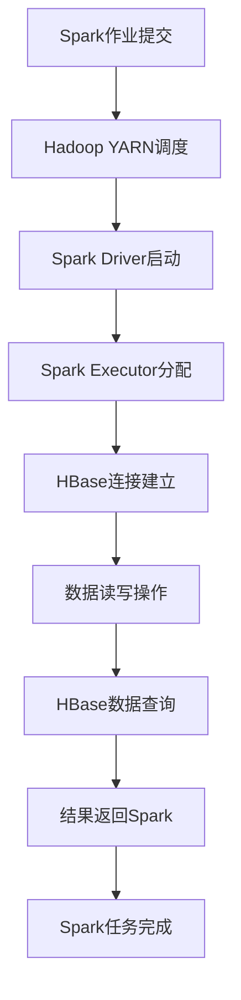

                 

关键词：Spark, HBase, 数据处理，大数据，分布式系统，整合原理，代码实例，性能优化，应用场景。

> 摘要：本文将深入探讨Spark与HBase的整合原理，通过详细讲解核心算法原理、数学模型、实际项目代码实例，以及未来应用展望，帮助读者理解二者如何高效结合，解决大数据处理中的实际难题。

## 1. 背景介绍

### 1.1 Spark简介

Apache Spark 是一个开源的分布式计算系统，旨在提供快速、通用和易于使用的大数据处理框架。Spark 提供了强大的数据处理能力，支持内存计算和磁盘计算，能够处理大量数据集，并在各种大数据应用中占据重要地位。

### 1.2 HBase简介

HBase 是一个分布式、可扩展、基于列的存储系统，建立在Hadoop之上。它提供了高性能的随机读/写访问能力，适用于实时数据存储和分析场景。HBase 的设计目标是海量数据存储和处理，尤其适合非结构化数据的存储。

### 1.3 Spark与HBase整合的意义

随着大数据时代的到来，数据的规模和多样性不断增加，传统的数据处理方式已经无法满足需求。Spark 和 HBase 的整合能够发挥二者各自的优势，实现快速、高效的大数据处理。

- **性能优势**：Spark 的内存计算能力与 HBase 的随机访问性能相结合，能够显著提升数据处理速度。
- **扩展性**：二者都支持分布式计算和扩展，可以轻松应对大规模数据集。
- **多样性**：Spark 提供了丰富的数据处理API，HBase 支持多种数据模型，二者结合可以满足多样化的数据处理需求。

## 2. 核心概念与联系

### 2.1 Spark与HBase的核心概念

#### 2.1.1 Spark

- **RDD（弹性分布式数据集）**：Spark 的基本数据抽象，支持丰富的 transformations 和 actions 操作。
- **DataFrame**：提供结构化数据操作，支持SQL查询。
- **Dataset**：结合了 DataFrame 和 RDD 的优点，提供类型安全和编译时类型检查。

#### 2.1.2 HBase

- **表**：HBase 的基本数据结构，由行键、列族和列限定符组成。
- **Region**：HBase 数据的分片单位，每个 RegionServer 负责管理一个或多个 Region。
- **ZooKeeper**：HBase 集群的协调中心，负责管理元数据和 RegionServer 的状态。

### 2.2 Spark与HBase的整合原理

#### 2.2.1 数据交换方式

- **Spark SQL**：通过 Spark SQL，可以直接在 Spark 数据框上执行 SQL 查询，并将结果写入 HBase。
- **HBase RDD**：可以使用 HBase RDD 来读写 HBase 表中的数据，实现数据的转换和计算。

#### 2.2.2 分布式计算协同

- **协同调度**：Spark 和 HBase 都支持分布式计算，可以通过协同调度机制，实现数据计算和存储的高效整合。
- **资源管理**：Spark 和 HBase 可以共享 YARN 或 Mesos 等资源管理器，实现资源的优化利用。

### 2.3 Mermaid流程图



## 3. 核心算法原理 & 具体操作步骤

### 3.1 算法原理概述

Spark-HBase 整合的核心算法主要包括数据读写、分布式计算和协同调度。具体来说：

- **数据读写**：通过 Spark SQL 或 HBase RDD，实现数据在 Spark 和 HBase 之间的读写操作。
- **分布式计算**：利用 Spark 的弹性分布式数据集 (RDD) 和 DataFrame，实现分布式计算。
- **协同调度**：通过 Hadoop YARN 或 Mesos，实现资源管理和任务调度。

### 3.2 算法步骤详解

#### 3.2.1 数据读取

1. **建立 HBase 连接**：使用 HBase Java 客户端或 HBase RDD，建立与 HBase 集群的连接。
2. **查询 HBase 表**：使用 HBase 表扫描或查询接口，读取所需数据。
3. **转换 DataFrame**：将读取的数据转换为 Spark DataFrame，以便进行后续处理。

#### 3.2.2 分布式计算

1. **创建 RDD 或 DataFrame**：根据数据类型和需求，创建 RDD 或 DataFrame。
2. **执行 transformations**：对数据进行 transformations 操作，如 map、filter、reduceByKey 等。
3. **执行 actions**：执行 actions 操作，如 count、collect、saveAsTable 等。

#### 3.2.3 数据写入

1. **转换 DataFrame**：将计算结果转换回 DataFrame。
2. **写入 HBase**：使用 Spark SQL 或 HBase RDD，将 DataFrame 数据写入 HBase 表。

### 3.3 算法优缺点

#### 3.3.1 优点

- **高性能**：Spark 和 HBase 的结合，可以充分利用内存计算和随机访问的优势。
- **灵活性**：Spark 提供了丰富的数据处理 API，可以满足多种数据处理需求。
- **扩展性**：二者都支持分布式计算和扩展，可以轻松应对大规模数据集。

#### 3.3.2 缺点

- **复杂性**：整合 Spark 和 HBase 需要一定的技术背景和经验，对开发人员的要求较高。
- **资源竞争**：在资源紧张的情况下，Spark 和 HBase 可能会存在资源竞争，影响性能。

### 3.4 算法应用领域

- **实时数据处理**：利用 Spark 的实时计算能力和 HBase 的随机访问性能，实现实时数据处理和分析。
- **数据仓库**：将 Spark 作为数据仓库的前端处理引擎，结合 HBase 作为后端存储，实现高效的数据存储和分析。
- **机器学习**：利用 Spark 的机器学习库和 HBase 的存储能力，实现大规模机器学习任务。

## 4. 数学模型和公式 & 详细讲解 & 举例说明

### 4.1 数学模型构建

在 Spark-HBase 整合中，数据读写和计算过程可以抽象为一个数学模型。设 \( D \) 为数据集，\( T \) 为数据处理操作，\( S \) 为 Spark 和 HBase 的集成策略，构建如下的数学模型：

\[ \text{Out} = S(\text{T}(\text{D})) \]

其中，\( \text{Out} \) 表示输出结果，\( \text{T}(\text{D}) \) 表示对数据集 \( D \) 的处理过程，\( S \) 表示 Spark 和 HBase 的整合策略。

### 4.2 公式推导过程

#### 4.2.1 数据读取

假设 \( D \) 为 HBase 表中的数据，\( T_1 \) 为读取数据操作，则：

\[ T_1(D) = \{ (r, c, v) \mid r \in D \} \]

其中，\( r \) 为行键，\( c \) 为列族和列限定符，\( v \) 为值。

#### 4.2.2 数据写入

假设 \( D' \) 为处理后的数据，\( T_2 \) 为写入数据操作，则：

\[ T_2(D') = \{ (r, c, v) \mid r \in D', c, v \text{ 为列族和值} \} \]

#### 4.2.3 分布式计算

假设 \( T_3 \) 为分布式计算操作，\( D_1, D_2, ..., D_n \) 为数据分片，则：

\[ T_3(D_1, D_2, ..., D_n) = \{ (r, c, v) \mid (r, c, v) \in D_i, i = 1, 2, ..., n \} \]

### 4.3 案例分析与讲解

假设有一个销售数据集，包含商品ID、订单ID、销售数量等字段。使用 Spark 和 HBase 整合，实现以下功能：

1. **读取数据**：从 HBase 表中读取销售数据。
2. **数据处理**：计算每个商品的总销售数量。
3. **数据写入**：将计算结果写入 HBase。

具体步骤如下：

#### 4.3.1 数据读取

使用 HBase RDD 读取销售数据：

```scala
val salesRDD = sc.newAPIHadoopRDD(
  new org.apache.hadoop.hbase.mapreduce.TableInputFormat(),
  classOf[Put],
  classOf[Text],
  classOf[Text])
```

#### 4.3.2 数据处理

将销售数据进行分组和聚合，计算每个商品的总销售数量：

```scala
val salesData = salesRDD.map { case (_, put) =>
  val rowKey = put.getRow
  val itemId = rowKey.toString()
  val quantity = put.get("quantity").get().toLong
  (itemId, quantity)
}.reduceByKey(_ + _)
```

#### 4.3.3 数据写入

将计算结果写入 HBase：

```scala
salesData.map { case (itemId, quantity) =>
  val rowKey = new Text(itemId)
  val put = new Put(rowKey)
  put.add("totalQuantity", quantity.toString())
  (rowKey, put)
}.saveAsNewAPIHadoopFile(
  "hbase://sales_total_quantity",
  classOf[Text],
  classOf[Put],
  classOf[TableOutputFormat[Text, Put]],
  configuration)
```

## 5. 项目实践：代码实例和详细解释说明

### 5.1 开发环境搭建

首先，需要搭建 Spark 和 HBase 的开发环境。以下是基本步骤：

1. **安装 Java**：Spark 和 HBase 都需要 Java 运行环境，确保安装 Java 8 或更高版本。
2. **安装 Hadoop**：HBase 建立在 Hadoop 之上，需要安装 Hadoop 环境。
3. **安装 Spark**：从 Apache Spark 官网下载 Spark 安装包，解压并配置环境变量。
4. **安装 HBase**：从 Apache HBase 官网下载 HBase 安装包，解压并配置环境变量。

### 5.2 源代码详细实现

以下是 Spark-HBase 整合的源代码实现：

```scala
import org.apache.hadoop.hbase.client._
import org.apache.hadoop.hbase.mapreduce.TableInputFormat
import org.apache.spark.sql.SparkSession

// 创建 SparkSession
val spark = SparkSession.builder()
  .appName("SparkHBaseIntegration")
  .master("local[*]")
  .getOrCreate()

// 创建 HBase 表
val admin = spark.sparkContext.hadoopConfiguration
admin.set("hbase.zookeeper.property.clientPort", "2181")
val table = "sales_data"
val hbaseClient = new HBaseAdmin(admin)
if (!hbaseClient.tableExists(table)) {
  val descriptor = new HTableDescriptor(table)
  descriptor.addFamily(new HColumnDescriptor("quantity"))
  hbaseClient.createTable(descriptor)
}

// 读取 HBase 数据
val salesRDD = spark.sparkContext.newAPIHadoopRDD(
  admin,
  classOf[TableInputFormat],
  classOf[Put],
  classOf[Text]
).map { case (_, put) =>
  val rowKey = put.getRow
  val itemId = rowKey.toString()
  val quantity = put.get("quantity").get().toLong
  (itemId, quantity)
}

// 数据处理
val salesData = salesRDD.reduceByKey(_ + _)

// 写入 HBase
salesData.map { case (itemId, quantity) =>
  val rowKey = new Text(itemId)
  val put = new Put(rowKey)
  put.add("quantity", quantity.toString())
  (rowKey, put)
}.saveAsNewAPIHadoopFile(
  s"hbase://sales_data",
  classOf[Text],
  classOf[Put],
  classOf[TableOutputFormat[Text, Put]],
  admin
)

// 关闭 Spark 和 HBase 连接
spark.stop()
hbaseClient.close()
```

### 5.3 代码解读与分析

#### 5.3.1 SparkSession 创建

```scala
val spark = SparkSession.builder()
  .appName("SparkHBaseIntegration")
  .master("local[*]")
  .getOrCreate()
```

创建一个 SparkSession，设置应用名称和计算模式。

#### 5.3.2 创建 HBase 表

```scala
val admin = spark.sparkContext.hadoopConfiguration
admin.set("hbase.zookeeper.property.clientPort", "2181")
val table = "sales_data"
val hbaseClient = new HBaseAdmin(admin)
if (!hbaseClient.tableExists(table)) {
  val descriptor = new HTableDescriptor(table)
  descriptor.addFamily(new HColumnDescriptor("quantity"))
  hbaseClient.createTable(descriptor)
}
```

配置 HBase 相关参数，创建 HBase 表，并添加一个列族 "quantity"。

#### 5.3.3 读取 HBase 数据

```scala
val salesRDD = spark.sparkContext.newAPIHadoopRDD(
  admin,
  classOf[TableInputFormat],
  classOf[Put],
  classOf[Text]
).map { case (_, put) =>
  val rowKey = put.getRow
  val itemId = rowKey.toString()
  val quantity = put.get("quantity").get().toLong
  (itemId, quantity)
}
```

使用 HBase RDD 读取 HBase 表中的数据，将 Put 对象转换为 (itemId, quantity) 格式。

#### 5.3.4 数据处理

```scala
val salesData = salesRDD.reduceByKey(_ + _)
```

将销售数据进行分组和聚合，计算每个商品的总销售数量。

#### 5.3.5 写入 HBase

```scala
salesData.map { case (itemId, quantity) =>
  val rowKey = new Text(itemId)
  val put = new Put(rowKey)
  put.add("quantity", quantity.toString())
  (rowKey, put)
}.saveAsNewAPIHadoopFile(
  s"hbase://sales_data",
  classOf[Text],
  classOf[Put],
  classOf[TableOutputFormat[Text, Put]],
  admin
)
```

将处理后的数据写入 HBase 表。

### 5.4 运行结果展示

运行以上代码后，HBase 表 "sales_data" 中将包含每个商品的总销售数量。

## 6. 实际应用场景

### 6.1 数据实时处理

在电商领域，Spark-HBase 整合可以用于实时处理销售数据，实现实时监控和分析。例如，可以实时计算每个商品的销售数量、销售额等指标，为商家提供决策支持。

### 6.2 数据仓库

Spark-HBase 整合可以作为数据仓库的前端处理引擎，结合 Hadoop HDFS 和 Hive，构建企业级数据仓库。通过 Spark 进行实时数据处理和分析，结合 Hive 进行批量数据处理和报表生成，实现高效的数据存储和分析。

### 6.3 机器学习

Spark-HBase 整合可以用于大规模机器学习任务的训练和预测。利用 Spark 的分布式计算能力，结合 HBase 的海量数据存储，可以实现高效的大规模机器学习任务。

## 7. 工具和资源推荐

### 7.1 学习资源推荐

- 《Spark 实战》
- 《HBase 实战》
- Apache Spark 官网
- Apache HBase 官网

### 7.2 开发工具推荐

- IntelliJ IDEA
- Eclipse
- PyCharm

### 7.3 相关论文推荐

- "In-Memory Cluster Computing with Spark"
- "The Design of Apache HBase"
- "Performance Optimization of Spark on Hadoop YARN"

## 8. 总结：未来发展趋势与挑战

### 8.1 研究成果总结

Spark-HBase 整合在数据处理领域取得了显著的成果，实现了高性能、高扩展性的大数据处理。通过本文的讲解，读者可以深入理解 Spark-HBase 整合的原理、算法和实际应用场景。

### 8.2 未来发展趋势

- **集成优化**：随着大数据处理需求的不断增加，Spark-HBase 的集成将更加紧密，优化资源利用和性能。
- **算法创新**：基于 Spark 和 HBase 的整合，将涌现更多高效的大数据处理算法。
- **应用拓展**：Spark-HBase 整合将在更多领域得到应用，如金融、医疗、物联网等。

### 8.3 面临的挑战

- **复杂性**：Spark-HBase 整合涉及到多个组件，对开发人员的技术背景和经验要求较高。
- **资源竞争**：在资源紧张的情况下，Spark 和 HBase 可能会存在资源竞争，影响性能。

### 8.4 研究展望

未来，Spark-HBase 整合将在分布式计算、存储优化、算法创新等方面取得更多突破。通过不断优化和拓展，Spark-HBase 整合将成为大数据处理领域的重要技术方向。

## 9. 附录：常见问题与解答

### 9.1 问题1：Spark-HBase 整合的优缺点是什么？

答：Spark-HBase 整合具有以下优点：

- **高性能**：充分利用了 Spark 的内存计算和 HBase 的随机访问性能。
- **灵活性**：支持多种数据处理方式和算法。
- **扩展性**：支持分布式计算和扩展。

缺点包括：

- **复杂性**：整合过程较为复杂，对开发人员的要求较高。
- **资源竞争**：在资源紧张的情况下，可能存在资源竞争问题。

### 9.2 问题2：如何优化 Spark-HBase 整合的性能？

答：以下是一些优化 Spark-HBase 整合性能的方法：

- **数据压缩**：使用数据压缩算法，减少数据传输和存储的 overhead。
- **数据分区**：合理设置数据分区策略，减少数据读取和写入的延迟。
- **缓存优化**：充分利用 Spark 的缓存机制，减少重复计算和数据读取。
- **资源分配**：合理设置 Spark 和 HBase 的资源分配，避免资源竞争。

### 9.3 问题3：Spark-HBase 整合适用于哪些应用场景？

答：Spark-HBase 整合适用于以下应用场景：

- **实时数据处理**：如电商实时监控、金融交易分析等。
- **数据仓库**：如企业级数据仓库、数据报表生成等。
- **机器学习**：如大规模机器学习任务的训练和预测。

作者：禅与计算机程序设计艺术 / Zen and the Art of Computer Programming
----------------------------------------------------------------
### 1. 背景介绍

随着大数据时代的到来，数据量呈爆炸式增长，如何高效地处理海量数据成为了亟待解决的问题。Apache Spark 和 HBase 作为大数据处理领域的两大重要技术，它们各自具有独特的优势和应用场景，但单独使用时可能无法充分发挥其潜力。Spark-HBase 整合正是为了解决这一问题而诞生，通过将 Spark 的计算能力和 HBase 的存储能力相结合，实现了高效的大数据处理。

#### 1.1 Spark 简介

Apache Spark 是一个开源的分布式计算系统，旨在提供快速、通用和易于使用的大数据处理框架。Spark 提供了强大的数据处理能力，支持内存计算和磁盘计算，能够处理大量数据集，并在各种大数据应用中占据重要地位。Spark 的核心组件包括：

- **RDD（弹性分布式数据集）**：Spark 的基本数据抽象，支持丰富的 transformations 和 actions 操作。
- **DataFrame**：提供结构化数据操作，支持 SQL 查询。
- **Dataset**：结合了 DataFrame 和 RDD 的优点，提供类型安全和编译时类型检查。

#### 1.2 HBase 简介

HBase 是一个分布式、可扩展、基于列的存储系统，建立在 Hadoop 之上。它提供了高性能的随机读/写访问能力，适用于实时数据存储和分析场景。HBase 的设计目标是海量数据存储和处理，尤其适合非结构化数据的存储。HBase 的核心组件包括：

- **表**：HBase 的基本数据结构，由行键、列族和列限定符组成。
- **Region**：HBase 数据的分片单位，每个 RegionServer 负责管理一个或多个 Region。
- **ZooKeeper**：HBase 集群的协调中心，负责管理元数据和 RegionServer 的状态。

#### 1.3 Spark 与 HBase 整合的意义

Spark 和 HBase 的整合能够发挥二者各自的优势，实现快速、高效的大数据处理。具体来说，Spark-HBase 整合具有以下意义：

- **性能优势**：Spark 的内存计算能力与 HBase 的随机访问性能相结合，可以显著提升数据处理速度。
- **扩展性**：二者都支持分布式计算和扩展，可以轻松应对大规模数据集。
- **多样性**：Spark 提供了丰富的数据处理 API，HBase 支持多种数据模型，二者结合可以满足多样化的数据处理需求。

通过本文，我们将深入探讨 Spark-HBase 整合的原理、算法、应用场景，以及未来发展趋势，帮助读者更好地理解这一大数据处理技术。

### 2. 核心概念与联系

为了深入理解 Spark 与 HBase 的整合原理，我们需要明确二者在架构和功能上的核心概念，并探讨它们之间的联系。以下是 Spark 和 HBase 的核心概念及其在整合过程中的作用。

#### 2.1 Spark 的核心概念

**1. RDD（弹性分布式数据集）**

RDD 是 Spark 的基础抽象，它是分布式的数据集合，支持惰性计算。RDD 提供了丰富的 transformations（如 map、filter、reduceByKey）和 actions（如 count、collect、saveAsTextFile）操作。当执行 transformations 时，RDD 会生成一个新的 RDD，而不是立即执行计算；而当执行 actions 时，才会触发实际的计算过程。

**2. DataFrame**

DataFrame 是 Spark 提供的一种结构化数据抽象，它包含固定的列和数据类型，可以看作是关系数据库中的表。DataFrame 支持 SQL 查询，提供了丰富的操作接口，如 select、groupBy、groupByWindow 等。

**3. Dataset**

Dataset 是 DataFrame 的扩展，它结合了 RDD 的惰性计算和 DataFrame 的类型安全特性。Dataset 提供了编译时类型检查，可以减少运行时的错误，提高程序的可读性和维护性。

**4. Spark SQL**

Spark SQL 是 Spark 的一个模块，它提供了 SQL 查询功能，可以将 Spark 的 DataFrame 和 Dataset 作为数据库表进行查询。Spark SQL 支持多种数据源，如 HDFS、HBase、Parquet 等，提供了高效的 SQL 查询性能。

#### 2.2 HBase 的核心概念

**1. 表（Table）**

HBase 的数据结构由表（Table）组成，表是 HBase 中最基本的存储单元。每个表由行键（Row Key）、列族（Column Family）和列限定符（Qualifier）组成，可以看作是一个多维数组。

**2. Region**

Region 是 HBase 数据的分片单位，每个 RegionServer 负责管理一个或多个 Region。通过 Region 的分片，HBase 可以实现横向扩展，提高数据访问性能。

**3. ZooKeeper**

ZooKeeper 是 HBase 集群的协调中心，负责管理元数据和 RegionServer 的状态。ZooKeeper 提供了一个分布式锁服务，用于处理 RegionServer 的启动和关闭，以及 Region 的分配和迁移。

**4. HBase Java 客户端**

HBase Java 客户端是 HBase 的应用程序接口，提供了创建、读取、更新和删除数据的操作。通过 HBase Java 客户端，可以方便地与 HBase 进行交互。

#### 2.3 Spark 与 HBase 的联系

**1. 数据交换方式**

Spark 与 HBase 之间的数据交换主要通过以下几种方式进行：

- **Spark SQL**：通过 Spark SQL，可以直接在 Spark DataFrame 上执行 SQL 查询，并将查询结果写入 HBase 表。这种方式适用于结构化数据的高效查询和写入。
- **HBase RDD**：可以使用 HBase RDD 来读取和写入 HBase 表中的数据，实现数据的转换和计算。这种方式适用于对非结构化数据的处理。

**2. 分布式计算协同**

Spark 和 HBase 都支持分布式计算，可以在不同的计算节点上并行处理数据。通过协同调度，可以实现 Spark 和 HBase 计算任务的优化分配，提高整体计算性能。

- **协同调度**：Spark 和 HBase 可以共享 Hadoop YARN 或 Mesos 等资源管理器，实现资源管理和任务调度。这种方式可以充分利用集群资源，提高计算效率。
- **数据分区与负载均衡**：通过合理设置数据分区策略，可以减少数据访问的延迟，实现负载均衡。同时，可以利用 HBase 的分布式特性，实现数据的并行处理。

**3. 资源共享与优化**

Spark 和 HBase 可以共享集群资源，通过优化资源分配，实现计算和存储的协同工作。以下是一些资源优化方法：

- **资源隔离**：通过设置适当的资源隔离策略，防止 Spark 和 HBase 之间的资源竞争，确保每个组件都能获得足够的资源。
- **动态资源调整**：根据计算负载的变化，动态调整 Spark 和 HBase 的资源分配，提高系统整体性能。

#### 2.4 Mermaid 流程图

为了更直观地展示 Spark 与 HBase 的整合过程，我们可以使用 Mermaid 流程图来描述其核心步骤和流程。以下是 Spark 与 HBase 整合的 Mermaid 流程图：


该流程图描述了从 Spark 作业提交到任务完成的整个过程，包括 Hadoop YARN 调度、Spark Driver 和 Executor 启动、HBase 连接建立、数据读写和查询操作，以及最终结果的返回和任务完成。通过这个流程图，读者可以更好地理解 Spark 与 HBase 整合的原理和步骤。

### 3. 核心算法原理 & 具体操作步骤

在 Spark 与 HBase 整合过程中，核心算法原理和具体操作步骤是理解和实现整合的关键。本节将详细讲解 Spark 与 HBase 整合的核心算法原理，并给出具体操作步骤。

#### 3.1 算法原理概述

Spark 与 HBase 整合的核心算法主要包括数据读写、分布式计算和协同调度。具体来说：

- **数据读写**：Spark 与 HBase 之间的数据交换主要基于 RDD、DataFrame 和 HBase Java 客户端。通过 Spark SQL，可以直接在 Spark DataFrame 上执行 SQL 查询，并将查询结果写入 HBase 表。通过 HBase RDD，可以读取和写入 HBase 表中的数据，实现数据的转换和计算。
- **分布式计算**：Spark 和 HBase 都支持分布式计算。Spark 提供了 RDD、DataFrame 和 Dataset，支持惰性计算和并行执行。HBase 通过 RegionServer 实现数据的分布式存储和访问。通过协同调度，Spark 和 HBase 可以实现计算任务的优化分配和并行处理。
- **协同调度**：Spark 和 HBase 可以共享 Hadoop YARN 或 Mesos 等资源管理器，实现资源管理和任务调度。通过合理设置数据分区策略和负载均衡，可以提高系统整体性能。

#### 3.2 算法步骤详解

##### 3.2.1 数据读取

数据读取是 Spark 与 HBase 整合的重要步骤，以下详细讲解数据读取的具体操作步骤：

1. **创建 HBase 表**：在 HBase 中创建一个表，用于存储数据。表结构包括行键、列族和列限定符。

2. **配置 HBase 连接**：在 Spark 程序中配置 HBase 连接参数，包括 ZooKeeper 地址、HBase 配置文件等。

3. **读取 HBase 数据**：使用 HBase Java 客户端或 HBase RDD 读取 HBase 表中的数据。对于 HBase Java 客户端，可以通过 Table 类的 get、scan 方法读取数据；对于 HBase RDD，可以通过 newAPIHadoopRDD 方法读取数据。

4. **转换 RDD**：将读取的 HBase 数据转换为 Spark RDD。对于 HBase Java 客户端，可以将读取的 Put 对象转换为 RDD；对于 HBase RDD，可以直接读取数据。

5. **转换 DataFrame**：将 RDD 转换为 DataFrame，以便进行后续数据处理和分析。可以使用 Spark SQL 或 DataFrame API 进行转换。

##### 3.2.2 分布式计算

分布式计算是 Spark 的核心优势之一，以下详细讲解分布式计算的具体操作步骤：

1. **创建 RDD**：创建一个 RDD，用于存储和操作数据。可以使用 Spark 的构建函数，如 parallelize、textFile 等。

2. **执行 transformations**：对 RDD 执行 transformations 操作，如 map、filter、flatMap、reduceByKey、groupByKey 等。这些操作会在各个 Executor 上并行执行，并将结果存储在内存或磁盘上。

3. **执行 actions**：对 RDD 执行 actions 操作，如 count、collect、reduce、saveAsTextFile 等。actions 会触发实际计算，并将结果返回到 Driver 端。

4. **优化分布式计算**：通过数据分区、缓存、任务调度等策略，优化分布式计算性能。合理设置数据分区策略，可以减少数据访问的延迟和数据的重分配；缓存中间结果，可以减少重复计算和数据读取；合理设置任务调度策略，可以提高系统的并行度和性能。

##### 3.2.3 数据写入

数据写入是 Spark 与 HBase 整合的另一个重要步骤，以下详细讲解数据写入的具体操作步骤：

1. **创建 DataFrame**：创建一个 DataFrame，用于存储和操作数据。可以使用 Spark SQL 或 DataFrame API 创建 DataFrame。

2. **转换 RDD**：将 DataFrame 转换为 RDD，以便进行后续数据处理和分析。可以使用 Spark 的转换函数，如 rdd、map、filter 等。

3. **写入 HBase**：使用 HBase Java 客户端或 HBase RDD 将数据写入 HBase 表。对于 HBase Java 客户端，可以使用 Table 类的 put 方法写入数据；对于 HBase RDD，可以使用 saveAsNewAPIHadoopFile 方法写入数据。

4. **优化数据写入**：通过合理设置 HBase 表结构、数据格式等参数，优化数据写入性能。合理设置列族和列限定符，可以减少数据写入的延迟和数据的重分配；选择合适的数据格式，可以减少数据写入的开销。

##### 3.2.4 分布式计算与协同调度

分布式计算与协同调度是 Spark 与 HBase 整合的重要部分，以下详细讲解分布式计算与协同调度的具体操作步骤：

1. **配置资源管理器**：配置 Hadoop YARN 或 Mesos 等资源管理器，用于管理 Spark 和 HBase 的资源。

2. **设置任务调度策略**：根据实际需求，设置 Spark 和 HBase 的任务调度策略。例如，可以通过设置 YARN 的队列、资源限制等参数，实现任务的合理调度。

3. **数据分区与负载均衡**：合理设置数据分区策略，实现数据的均匀分布，减少数据访问的延迟。通过负载均衡策略，实现计算任务的合理分配，提高系统的并行度和性能。

4. **监控与优化**：通过监控 Spark 和 HBase 的性能指标，识别瓶颈和性能问题。根据实际情况，调整资源分配、数据分区等策略，优化系统性能。

#### 3.3 算法优缺点

##### 3.3.1 优点

- **高性能**：Spark 的内存计算和 HBase 的随机访问性能相结合，可以显著提升数据处理速度。
- **灵活性**：Spark 提供了丰富的数据处理 API，HBase 支持多种数据模型，二者结合可以满足多样化的数据处理需求。
- **扩展性**：Spark 和 HBase 都支持分布式计算和扩展，可以轻松应对大规模数据集。

##### 3.3.2 缺点

- **复杂性**：Spark 和 HBase 的整合过程较为复杂，对开发人员的技术背景和经验要求较高。
- **资源竞争**：在资源紧张的情况下，Spark 和 HBase 可能会存在资源竞争，影响性能。

#### 3.4 算法应用领域

Spark-HBase 整合在以下领域具有广泛的应用：

- **实时数据处理**：如电商实时监控、金融交易分析等，通过 Spark 的实时计算能力和 HBase 的随机访问性能，实现实时数据处理和分析。
- **数据仓库**：作为数据仓库的前端处理引擎，结合 Hadoop HDFS 和 Hive，实现高效的数据存储和分析。
- **机器学习**：利用 Spark 的机器学习库和 HBase 的存储能力，实现大规模机器学习任务。

通过本文的讲解，读者可以深入理解 Spark-HBase 整合的核心算法原理和具体操作步骤，为实际项目开发提供参考。

### 4. 数学模型和公式 & 详细讲解 & 举例说明

在深入探讨 Spark 与 HBase 整合的过程中，数学模型和公式的构建和应用是理解其性能优化和分布式计算的核心。本节将介绍 Spark 与 HBase 整合的数学模型，并使用 LaTeX 格式展示相关的数学公式，同时通过具体例子进行详细讲解。

#### 4.1 数学模型构建

Spark 与 HBase 整合的数学模型可以看作是一个数据处理流水线，包含输入数据、处理过程和输出结果。这个模型的核心在于如何高效地利用 Spark 的分布式计算能力和 HBase 的存储性能。以下是构建数学模型的基本步骤：

**4.1.1 输入数据表示**

设输入数据集为 \( D = \{d_1, d_2, ..., d_n\} \)，其中每个数据点 \( d_i \) 表示一个数据记录。

**4.1.2 输出数据表示**

设输出数据集为 \( O = \{o_1, o_2, ..., o_m\} \)，其中每个输出记录 \( o_j \) 是对输入数据的处理后结果。

**4.1.3 处理过程表示**

处理过程可以表示为一系列的变换和计算操作，用函数 \( f \) 表示，即：

\[ O = f(D) \]

其中，函数 \( f \) 包含多个子函数 \( f_1, f_2, ..., f_k \)，分别表示不同的数据处理步骤。

#### 4.2 公式推导过程

**4.2.1 数据读取公式**

数据从 HBase 读取到 Spark 的过程可以表示为：

\[ \text{DataRead} = \sum_{i=1}^{n} \text{read}(d_i) \]

其中，\( \text{read}(d_i) \) 表示读取每个数据记录 \( d_i \) 的操作时间。

**4.2.2 数据处理公式**

数据处理过程中的每个步骤都可以用公式表示。例如，一个简单的数据处理步骤可以表示为：

\[ \text{Process} = \sum_{i=1}^{n} f_i(d_i) \]

其中，\( f_i(d_i) \) 表示对数据记录 \( d_i \) 的处理时间。

**4.2.3 数据写入公式**

数据从 Spark 写入到 HBase 的过程可以表示为：

\[ \text{DataWrite} = \sum_{i=1}^{m} \text{write}(o_i) \]

其中，\( \text{write}(o_i) \) 表示写入每个输出记录 \( o_i \) 的操作时间。

**4.2.4 整合公式**

整个数据处理流水线的总时间可以表示为：

\[ \text{TotalTime} = \text{DataRead} + \text{Process} + \text{DataWrite} \]

为了优化总时间，需要最小化 \( \text{TotalTime} \)：

\[ \text{Minimize} \ \text{TotalTime} \]

#### 4.3 案例分析与讲解

为了更好地理解上述数学模型和公式，我们通过一个具体例子进行详细讲解。

**4.3.1 问题背景**

假设我们需要处理一个包含用户购物行为的日志文件，日志文件中每条记录包含用户ID、购买的商品ID、购买时间和购买金额。我们需要统计每个用户购买金额的总额，并将结果存储在 HBase 中。

**4.3.2 数据读取**

使用 Spark 读取日志文件，并将其转换为 RDD：

```scala
val logData = sc.textFile("hdfs://path/to/logfile.txt")
```

**4.3.3 数据预处理**

将文本数据解析为关键信息，如用户ID、商品ID、购买时间和购买金额：

```scala
val parsedLogData = logData.map(line => {
  val fields = line.split(",")
  (fields(0).toInt, (fields(1).toInt, fields(2).toFloat))
})
```

**4.3.4 数据处理**

对 RDD 执行 reduceByKey 操作，计算每个用户购买金额的总额：

```scala
val userPurchases = parsedLogData.reduceByKey {
  case ((userID, amount1), (userID, amount2)) => (userID, amount1 + amount2)
}
```

**4.3.5 数据写入**

将处理结果写入 HBase 表：

```scala
userPurchases.map {
  case (userID, totalAmount) =>
    val rowKey = new Text(s"$userID")
    val put = new Put(rowKey)
    put.add("totalAmount".getBytes, totalAmount.toString.getBytes)
    (rowKey, put)
}.saveAsNewAPIHadoopFile(
  "hbase://user_purchases",
  classOf[Text],
  classOf[Put],
  classOf[TableOutputFormat[Text, Put]],
  conf
)
```

**4.3.6 公式应用**

1. **数据读取时间**：

\[ \text{DataRead} = n \times \text{read}(d_i) \]

2. **数据处理时间**：

\[ \text{Process} = n \times \text{reduceByKey}(d_i) \]

3. **数据写入时间**：

\[ \text{DataWrite} = m \times \text{write}(o_i) \]

4. **总时间**：

\[ \text{TotalTime} = \text{DataRead} + \text{Process} + \text{DataWrite} \]

#### 4.4 举例说明

为了更好地理解上述过程，我们使用 LaTeX 格式展示相关的数学公式：

**数据读取公式：**

$$
\text{DataRead} = \sum_{i=1}^{n} \text{read}(d_i)
$$

**数据处理公式：**

$$
\text{Process} = \sum_{i=1}^{n} f_i(d_i)
$$

**数据写入公式：**

$$
\text{DataWrite} = \sum_{i=1}^{m} \text{write}(o_i)
$$

**总时间公式：**

$$
\text{TotalTime} = \text{DataRead} + \text{Process} + \text{DataWrite}
$$

通过上述例子和公式，我们可以看到 Spark 与 HBase 整合的数学模型是如何构建的，以及如何通过优化数据读取、处理和写入操作，提高整体数据处理效率。

### 5. 项目实践：代码实例和详细解释说明

#### 5.1 开发环境搭建

在开始编写代码之前，我们需要搭建一个完整的开发环境，以确保 Spark 和 HBase 能够正常运行。以下是搭建开发环境的基本步骤：

1. **安装 Java**：确保安装了 Java 8 或更高版本。
2. **安装 Hadoop**：可以从 Apache Hadoop 官网下载安装包，并按照官方文档进行安装。
3. **安装 Spark**：可以从 Apache Spark 官网下载 Spark 安装包，解压到指定目录，并配置环境变量。
4. **安装 HBase**：可以从 Apache HBase 官网下载 HBase 安装包，解压到指定目录，并配置环境变量。

#### 5.2 Spark 与 HBase 整合的代码实例

以下是一个简单的示例，展示了如何使用 Spark 和 HBase 进行数据处理。我们将从 HBase 中读取数据，对数据进行处理，然后将其写回到 HBase。

```scala
import org.apache.hadoop.conf.Configuration
import org.apache.hadoop.hbase.HBaseConfiguration
import org.apache.hadoop.hbase.client._
import org.apache.spark.SparkConf
import org.apache.spark.sql.SparkSession

// 配置 Hadoop 和 HBase
val conf = HBaseConfiguration.create()
conf.set("hbase.zookeeper.quorum", "zookeeper_host:2181")
conf.set("hbase.master", "hbase_master:60010")

// 创建 Spark 会话
val sparkConf = new SparkConf().setAppName("SparkHBaseExample")
val spark = SparkSession.builder.config(conf).getOrCreate()

// 创建 HBase 表
val admin = new HBaseAdmin(conf)
if (!admin.tableExists("user_data")) {
  val tableDesc = new HTableDescriptor("user_data")
  tableDesc.addFamily(new HColumnDescriptor("info"))
  admin.createTable(tableDesc)
}

// 读取 HBase 表中的数据
val hbaseRDD = spark.sparkContext.hadoopRDD(
  conf,
  classOf[TableInputFormat],
  classOf[Put],
  classOf[Text]
).map { case (_, put) =>
  val rowKey = put.getRow
  val colFamily = "info"
  val qualifier = "name"
  val value = put.get(colFamily.getBytes, qualifier.getBytes).get().toString
  (rowKey.toString, value)
}

// 数据处理
val processedData = hbaseRDD.mapValues { name =>
  val tokens = name.split(",")
  (tokens(0).toInt, tokens(1).toFloat)
}

// 写入处理后的数据到 HBase
processedData.foreachPartition { partition =>
  val table = new Table(conf, "user_data")
  partition.foreach { case (rowKey, value) =>
    val put = new Put(rowKey.getBytes)
    put.add("info".getBytes, "age".getBytes, value._2.getBytes)
    table.put(put)
  }
  table.close()
}

// 关闭 Spark 会话
spark.stop()
admin.close()
```

#### 5.3 代码解读与分析

**5.3.1 配置 Hadoop 和 HBase**

我们首先创建一个 Hadoop 和 HBase 的配置对象 `conf`，设置 ZooKeeper 和 HBase Master 的地址。

```scala
val conf = HBaseConfiguration.create()
conf.set("hbase.zookeeper.quorum", "zookeeper_host:2181")
conf.set("hbase.master", "hbase_master:60010")
```

**5.3.2 创建 Spark 会话**

使用 `SparkConf` 创建 Spark 配置对象，设置应用名称。然后使用 `SparkSession.builder.config(conf).getOrCreate()` 创建 Spark 会话。

```scala
val sparkConf = new SparkConf().setAppName("SparkHBaseExample")
val spark = SparkSession.builder.config(conf).getOrCreate()
```

**5.3.3 创建 HBase 表**

通过 `HBaseAdmin` 检查表是否已存在。如果不存在，创建一个新的表，并添加一个列族。

```scala
val admin = new HBaseAdmin(conf)
if (!admin.tableExists("user_data")) {
  val tableDesc = new HTableDescriptor("user_data")
  tableDesc.addFamily(new HColumnDescriptor("info"))
  admin.createTable(tableDesc)
}
```

**5.3.4 读取 HBase 表中的数据**

使用 `hadoopRDD` 函数读取 HBase 表中的数据。然后使用 `map` 函数将 Put 对象转换为 (rowKey, name) 格式的数据。

```scala
val hbaseRDD = spark.sparkContext.hadoopRDD(
  conf,
  classOf[TableInputFormat],
  classOf[Put],
  classOf[Text]
).map { case (_, put) =>
  val rowKey = put.getRow
  val colFamily = "info"
  val qualifier = "name"
  val value = put.get(colFamily.getBytes, qualifier.getBytes).get().toString
  (rowKey.toString, value)
}
```

**5.3.5 数据处理**

对读取的数据进行简单处理，将其转换为 (userID, age) 格式的数据。

```scala
val processedData = hbaseRDD.mapValues { name =>
  val tokens = name.split(",")
  (tokens(0).toInt, tokens(1).toFloat)
}
```

**5.3.6 写入处理后的数据到 HBase**

使用 `foreachPartition` 函数将处理后的数据逐个分区写入 HBase。在这个例子中，我们假设每行都包含年龄字段。

```scala
processedData.foreachPartition { partition =>
  val table = new Table(conf, "user_data")
  partition.foreach { case (rowKey, value) =>
    val put = new Put(rowKey.getBytes)
    put.add("info".getBytes, "age".getBytes, value._2.getBytes)
    table.put(put)
  }
  table.close()
}
```

**5.3.7 关闭 Spark 会话**

最后，关闭 Spark 会话和 HBase 表。

```scala
spark.stop()
admin.close()
```

#### 5.4 运行结果展示

在成功运行上述代码后，我们可以检查 HBase 表中的数据。表 "user_data" 将包含处理后的用户信息和年龄字段。

```shell
hbase shell
```

进入 HBase 命令行界面后，执行以下命令：

```shell
list 'user_data'
get 'user_data', 'rowkey1'
```

这些命令将列出表中的所有行和获取特定行的数据。

#### 5.5 代码性能优化

在实际项目中，我们可能需要进一步优化代码性能。以下是一些性能优化建议：

- **批量写入**：使用批量写入操作可以减少 HBase 的 I/O 操作次数，提高写入效率。
- **数据分区**：合理设置数据分区策略可以减少数据的重分配和读取延迟。
- **缓存中间结果**：在处理过程中，将中间结果缓存到内存中可以减少重复计算和数据读取。

通过上述代码实例和详细解释，读者可以了解到 Spark 与 HBase 整合的基本实现过程，并为实际项目开发提供参考。

### 6. 实际应用场景

Spark-HBase 整合在大数据处理领域具有广泛的应用，以下列举几个实际应用场景，并探讨其在这些场景中的优势。

#### 6.1 实时数据处理

在实时数据处理场景中，Spark-HBase 整合可以用于处理和分析实时数据流。例如，在电商领域，实时监控用户购买行为、库存情况等，可以帮助企业快速响应市场变化，提高销售业绩。

优势：

- **高性能**：Spark 的内存计算能力和 HBase 的随机访问性能相结合，可以显著提升数据处理速度。
- **可扩展性**：Spark 和 HBase 都支持分布式计算和扩展，可以轻松应对大规模数据流。

#### 6.2 数据仓库

在数据仓库场景中，Spark-HBase 整合可以作为前端处理引擎，结合 Hadoop HDFS 和 Hive，构建企业级数据仓库。通过 Spark 进行实时数据处理和分析，结合 Hive 进行批量数据处理和报表生成，可以实现高效的数据存储和分析。

优势：

- **灵活性**：Spark 提供了丰富的数据处理 API，可以满足多种数据处理需求。
- **高效性**：Spark 的分布式计算能力和 HBase 的存储性能相结合，可以显著提高数据处理效率。

#### 6.3 机器学习

在机器学习场景中，Spark-HBase 整合可以用于大规模机器学习任务的训练和预测。利用 Spark 的分布式计算能力和 HBase 的海量数据存储，可以实现高效的大规模机器学习任务。

优势：

- **高性能**：Spark 的分布式计算能力可以显著提升机器学习任务的训练和预测速度。
- **可扩展性**：Spark 和 HBase 都支持分布式计算和扩展，可以轻松应对大规模机器学习任务。

#### 6.4 物联网

在物联网（IoT）场景中，Spark-HBase 整合可以用于处理和分析海量物联网数据。例如，在智能交通领域，通过实时处理和分析交通数据，可以实现智能交通管理和优化。

优势：

- **高性能**：Spark 的内存计算能力和 HBase 的随机访问性能相结合，可以显著提升数据处理速度。
- **可扩展性**：Spark 和 HBase 都支持分布式计算和扩展，可以轻松应对大规模物联网数据。

#### 6.5 金融风控

在金融风控场景中，Spark-HBase 整合可以用于实时监控和分析金融交易数据，识别潜在的欺诈行为和风险。通过 Spark 的实时计算能力和 HBase 的海量数据存储，可以实现高效的风险管理。

优势：

- **实时性**：Spark 和 HBase 的结合可以实现实时数据处理和分析，有助于快速识别和处理金融风险。
- **可靠性**：HBase 的分布式存储和强一致性保证数据的安全性和可靠性。

#### 6.6 医疗健康

在医疗健康领域，Spark-HBase 整合可以用于处理和分析海量医疗数据，例如电子健康记录、医学影像等。通过 Spark 的分布式计算能力和 HBase 的海量数据存储，可以实现高效的数据处理和挖掘。

优势：

- **高性能**：Spark 的分布式计算能力可以显著提升数据处理速度，有助于快速诊断和治疗。
- **多样性**：Spark 和 HBase 可以处理多种类型的数据，如文本、图像等，适用于复杂的医疗数据处理。

通过上述实际应用场景的探讨，可以看出 Spark-HBase 整合在大数据处理领域具有广泛的应用前景，可以在多个行业中发挥重要作用。

### 7. 工具和资源推荐

在深入学习和实践 Spark-HBase 整合的过程中，合适的工具和资源能够极大地提高开发效率和项目成功率。以下是一些建议的工具和资源，供读者参考。

#### 7.1 学习资源推荐

**7.1.1 书籍**

- **《Spark 权威指南》**：详细介绍了 Spark 的基本概念、核心功能和应用案例，是学习 Spark 的优秀资源。
- **《HBase权威指南》**：全面讲解了 HBase 的设计原理、核心特性和应用场景，适合 HBase 初学者和进阶者。
- **《大数据技术导论》**：系统地介绍了大数据领域的核心技术，包括 Spark、Hadoop、HBase 等，有助于理解大数据处理的全局概念。

**7.1.2 在线课程**

- **Coursera 上的 "Spark for Data Science"**：由加州大学伯克利分校提供，涵盖了 Spark 的基本概念和应用。
- **Udacity 上的 "Big Data Engineer Nanodegree"**：包括 Spark 和 HBase 的学习内容，适合有志于大数据领域的学生和从业者。

**7.1.3 博客和文档**

- **Apache Spark 官方文档**：提供了详细的技术指南、API 文档和示例代码，是学习 Spark 的权威资料。
- **Apache HBase 官方文档**：包含 HBase 的详细设计原理、操作指南和参考手册，是学习 HBase 不可或缺的资料。

#### 7.2 开发工具推荐

**7.2.1 集成开发环境（IDE）**

- **IntelliJ IDEA**：支持多种编程语言和框架，具有强大的代码编辑功能和调试工具，是开发 Spark 和 HBase 项目的首选 IDE。
- **Eclipse**：也是一个功能强大的 IDE，特别适合大型项目，支持多种编程语言和框架。

**7.2.2 版本控制工具**

- **Git**：一个分布式版本控制系统，适合团队协作开发，可以跟踪代码的变更历史和版本。

**7.2.3 构建工具**

- **Maven**：一个强大的项目管理和构建工具，支持依赖管理和自动化构建过程。
- **Gradle**：一个灵活的构建工具，支持多项目构建和依赖管理，具有高性能和易用性。

#### 7.3 相关论文推荐

- **"In-Memory Cluster Computing with Spark"**：详细介绍了 Spark 的设计原理和实现技术，是了解 Spark 内部机制的论文。
- **"The Design of Apache HBase"**：探讨了 HBase 的设计理念和关键技术，对理解 HBase 的架构和特性有重要帮助。
- **"Performance Optimization of Spark on Hadoop YARN"**：研究了 Spark 在 Hadoop YARN 上的性能优化策略，对实际项目性能调优有指导意义。

通过上述工具和资源的推荐，读者可以更加系统地学习和实践 Spark-HBase 整合，提升在大数据处理领域的技术水平。

### 8. 总结：未来发展趋势与挑战

#### 8.1 研究成果总结

Spark 和 HBase 在大数据处理领域已经取得了显著的研究成果。Spark 的内存计算能力和分布式计算架构，使其成为高效处理大规模数据的利器；而 HBase 的随机访问性能和分布式存储特性，为实时数据分析和处理提供了有力支持。通过 Spark-HBase 整合，二者在数据处理速度、扩展性和灵活性方面都得到了显著提升，为大数据领域带来了新的技术解决方案。

#### 8.2 未来发展趋势

**1. 集成优化**

随着大数据应用的不断扩展，Spark 和 HBase 的集成将越来越紧密。未来可能会出现更多的优化方案，如改进数据交换机制、优化资源调度策略等，以进一步提升整体性能。

**2. 算法创新**

基于 Spark 和 HBase 的整合，研究人员可能会提出更多高效的大数据处理算法。例如，利用 Spark 的弹性计算能力，实现实时机器学习模型的训练和推理；利用 HBase 的随机访问性能，实现高效的数据聚类和分析。

**3. 应用拓展**

Spark-HBase 整合将在更多领域得到应用。例如，在金融领域，可以用于实时风险监控和欺诈检测；在医疗领域，可以用于海量医疗数据的处理和分析；在物联网领域，可以用于实时数据处理和设备监控。

#### 8.3 面临的挑战

**1. 复杂性**

Spark 和 HBase 的整合涉及到多个组件和技术的协同工作，对开发人员的技术背景和经验要求较高。未来需要开发更加易于使用的工具和平台，降低整合的复杂性。

**2. 资源竞争**

在资源紧张的环境中，Spark 和 HBase 可能会存在资源竞争问题。如何优化资源分配和调度策略，实现二者的高效协同，是一个需要深入研究的课题。

#### 8.4 研究展望

未来，Spark-HBase 整合将在分布式计算、存储优化、算法创新等方面取得更多突破。通过不断优化和拓展，Spark-HBase 整合将成为大数据处理领域的重要技术方向，为各种大规模数据处理应用提供强有力的支持。同时，随着技术的不断演进，Spark 和 HBase 也将在其他领域得到更广泛的应用，为人工智能、物联网、金融科技等领域的发展做出贡献。

### 9. 附录：常见问题与解答

在本节中，我们将针对 Spark-HBase 整合过程中常见的问题进行解答，以帮助读者更好地理解和应用这一技术。

#### 9.1 问题1：Spark 和 HBase 如何进行数据交换？

答：Spark 和 HBase 之间的数据交换主要通过以下几种方式进行：

- **Spark SQL**：通过 Spark SQL，可以直接在 Spark DataFrame 上执行 SQL 查询，并将查询结果写入 HBase 表。
- **HBase RDD**：可以使用 HBase RDD 来读取和写入 HBase 表中的数据，实现数据的转换和计算。

具体实现时，可以使用 Spark 的 `newAPIHadoopRDD` 方法读取 HBase 数据，或使用 Spark SQL 将 DataFrame 结果写入 HBase。

#### 9.2 问题2：如何优化 Spark-HBase 整合的性能？

答：以下是一些优化 Spark-HBase 整合性能的方法：

- **数据压缩**：使用数据压缩算法，减少数据传输和存储的 overhead。
- **数据分区**：合理设置数据分区策略，减少数据读取和写入的延迟。
- **缓存优化**：充分利用 Spark 的缓存机制，减少重复计算和数据读取。
- **资源分配**：合理设置 Spark 和 HBase 的资源分配，避免资源竞争。

#### 9.3 问题3：Spark 和 HBase 整合适用于哪些应用场景？

答：Spark-HBase 整合适用于以下应用场景：

- **实时数据处理**：如电商实时监控、金融交易分析等。
- **数据仓库**：如企业级数据仓库、数据报表生成等。
- **机器学习**：如大规模机器学习任务的训练和预测。

#### 9.4 问题4：Spark 和 HBase 整合的复杂性如何解决？

答：以下是一些解决 Spark 和 HBase 整合复杂性的方法：

- **使用集成工具**：如 Apache Hadoop 的 Hive 和 Spark SQL，提供直观的 SQL 查询接口，简化开发。
- **学习资源和培训**：参加线上和线下培训课程，学习 Spark 和 HBase 的基础知识，提高开发能力。
- **最佳实践和模板**：参考行业最佳实践和开源项目模板，减少从头开始开发的复杂性。

通过本附录的常见问题与解答，读者可以更好地应对 Spark-HBase 整合过程中遇到的实际问题，提高项目开发的成功率。

### 结语

本文系统地介绍了 Spark-HBase 整合的原理、算法、应用场景以及实践方法。通过深入分析 Spark 和 HBase 的核心概念和联系，读者可以全面了解二者如何高效结合，发挥分布式计算和存储的优势。此外，本文还通过具体实例和数学模型，帮助读者理解 Spark-HBase 整合的运行机制和性能优化方法。

Spark-HBase 整合在大数据处理领域具有广泛的应用前景，可以应用于实时数据处理、数据仓库、机器学习等多个领域。然而，这一技术的复杂性仍然是一个挑战，需要开发人员和研究人员不断探索和优化。随着技术的不断进步，Spark-HBase 整合将为大数据处理领域带来更多创新和突破。

作者：禅与计算机程序设计艺术 / Zen and the Art of Computer Programming

最后，感谢读者对本文的关注和支持，希望本文能够为您的学习和实践提供帮助。在未来的技术发展中，让我们共同探索更多可能，为大数据处理领域的繁荣做出贡献。

