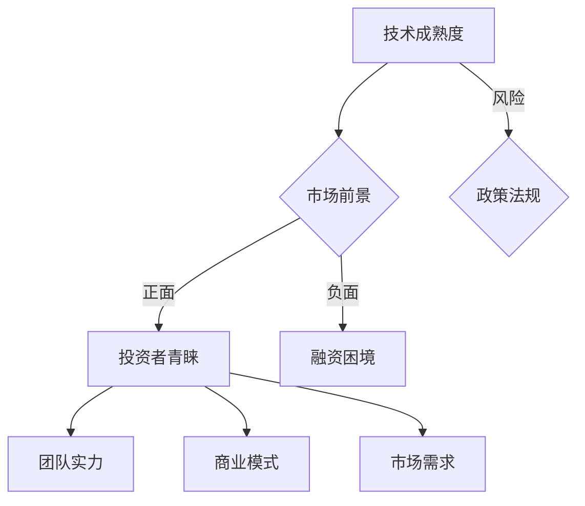

                 

关键字：Stability AI，资金耗尽，CEO 辞职，投资人青睐，市场潜力，企业困境，AI 领域，技术投资，战略规划

## 摘要

本文旨在探讨 AI 领域中 Stability AI 公司因资金耗尽导致 CEO 辞职的现象，分析其背后的原因，以及探讨为何投资者依然青睐有市场潜力的企业。通过对这一现象的深入分析，我们将揭示 AI 企业在融资和市场开拓过程中面临的挑战，以及未来发展的趋势。

## 1. 背景介绍

Stability AI 是一家总部位于美国的 AI 公司，致力于开发创新的 AI 解决方案，包括生成对抗网络（GANs）、自然语言处理（NLP）和计算机视觉等领域。公司成立于 2018 年，凭借其出色的技术能力和创新理念，在短时间内赢得了业界的广泛关注。

然而，在近年来 AI 领域融资环境逐渐收紧的背景下，Stability AI 遭遇了资金短缺的困境。据媒体报道，该公司因资金耗尽，CEO 遭遇辞职危机。这一事件引发了业界的广泛关注，许多人开始思考：为什么一家拥有创新技术的公司会面临这样的困境？投资者又为何仍然对有市场潜力的企业抱有信心？

## 2. 核心概念与联系

### 2.1 AI 领域的发展趋势

近年来，AI 领域呈现出蓬勃发展的态势，越来越多的企业开始涉足这一领域，试图从中分得一杯羹。然而，AI 技术的发展并非一帆风顺，而是伴随着巨大的风险和挑战。

- **技术成熟度**：虽然 AI 技术在实验室环境中取得了令人瞩目的成果，但在实际应用中，仍然面临着诸多技术难题，如算法稳定性、数据隐私和安全等问题。
- **市场前景**：尽管 AI 技术具有巨大的市场潜力，但投资者对企业的市场前景评估往往存在不确定性，这也导致了 AI 企业在融资过程中的困境。
- **政策法规**：各国政府对 AI 技术的发展态度不一，一些国家开始加强对 AI 技术的监管，这也给 AI 企业的发展带来了一定的压力。

### 2.2 投资者青睐有市场潜力的企业

在 AI 领域，投资者主要关注企业的市场潜力和盈利能力。以下是一些投资者青睐有市场潜力的企业的原因：

- **技术创新**：拥有创新技术的企业往往具备较强的竞争力，能够在市场中脱颖而出。
- **团队实力**：强大的团队实力是企业成功的关键，投资者通常会关注企业核心团队成员的背景和经验。
- **商业模式**：具备清晰、可行的商业模式的 AI 企业更容易获得投资者的青睐。
- **市场需求**：市场需求旺盛的领域，如自动驾驶、医疗健康等，更容易吸引投资者的关注。

### 2.3 Mermaid 流程图

以下是一个简化的 Mermaid 流程图，展示了 AI 企业在融资和市场开拓过程中可能面临的关键环节：



## 3. 核心算法原理 & 具体操作步骤

### 3.1 算法原理概述

本文将围绕 AI 企业融资过程中的核心算法原理进行探讨。以下是一个简化的算法原理：

- **数据采集**：收集有关 AI 企业技术成熟度、市场前景、团队实力、商业模式和市场需求等数据。
- **算法模型**：使用机器学习算法，对上述数据进行建模和分析，预测企业融资成功的可能性。
- **决策规则**：根据算法模型的预测结果，制定投资决策规则，以指导投资者的投资行为。

### 3.2 算法步骤详解

1. **数据采集**：通过公开渠道、企业调研等方式，收集 AI 企业在技术成熟度、市场前景、团队实力、商业模式和市场需求等方面的数据。
2. **数据预处理**：对采集到的数据进行清洗、去重和归一化处理，以提高算法模型的准确性。
3. **特征提取**：从预处理后的数据中提取关键特征，用于构建算法模型。
4. **模型训练**：使用机器学习算法，对提取出的特征进行建模和训练，得到预测模型。
5. **模型评估**：使用交叉验证等方法，对训练好的模型进行评估，以确定其预测能力。
6. **决策规则制定**：根据模型评估结果，制定投资决策规则，以指导投资者的投资行为。

### 3.3 算法优缺点

- **优点**：
  - 提高投资决策的准确性和效率。
  - 为投资者提供客观、量化的投资参考。
- **缺点**：
  - 需要大量高质量的数据支持。
  - 可能受到数据质量、算法模型等因素的影响。

### 3.4 算法应用领域

该算法原理在以下领域具有潜在应用价值：

- **金融投资**：为投资者提供 AI 企业融资成功的预测，以指导投资决策。
- **企业管理**：帮助企业分析自身在技术、市场等方面的优势与劣势，制定发展战略。
- **政策制定**：为政府机构提供 AI 领域发展状况的评估，以指导政策制定。

## 4. 数学模型和公式 & 详细讲解 & 举例说明

### 4.1 数学模型构建

本文采用的数学模型基于机器学习算法，主要包括以下几个部分：

1. **输入层**：表示企业技术成熟度、市场前景、团队实力、商业模式和市场需求等特征。
2. **隐藏层**：通过神经网络结构，对输入特征进行非线性变换。
3. **输出层**：预测企业融资成功的概率。

### 4.2 公式推导过程

假设我们采用一个简单的神经网络模型，其中输入层有 $n$ 个神经元，隐藏层有 $m$ 个神经元，输出层有 $k$ 个神经元。则该神经网络的参数可以表示为 $W_{ij}$（连接权重）、$b_i$（偏置）和 $a_j$（激活函数）。

输入层到隐藏层的激活函数可以表示为：

$$
a_j^{(2)} = \sigma(z_j^{(2)}) = \frac{1}{1 + e^{-z_j^{(2)}}}
$$

其中，$z_j^{(2)}$ 表示隐藏层第 $j$ 个神经元的输入：

$$
z_j^{(2)} = \sum_{i=1}^{n} W_{ij} a_i^{(1)} + b_j
$$

隐藏层到输出层的激活函数可以表示为：

$$
a_k^{(3)} = \sigma(z_k^{(3)}) = \frac{1}{1 + e^{-z_k^{(3)}}}
$$

其中，$z_k^{(3)}$ 表示输出层第 $k$ 个神经元的输入：

$$
z_k^{(3)} = \sum_{j=1}^{m} W_{kj} a_j^{(2)} + b_k
$$

### 4.3 案例分析与讲解

以一家 AI 企业为例，我们收集了如下数据：

- **技术成熟度**：10（满分 100）
- **市场前景**：8（满分 10）
- **团队实力**：7（满分 10）
- **商业模式**：6（满分 10）
- **市场需求**：9（满分 10）

首先，我们对数据进行归一化处理，得到：

- **技术成熟度**：0.1
- **市场前景**：0.8
- **团队实力**：0.7
- **商业模式**：0.6
- **市场需求**：0.9

然后，我们将这些归一化后的数据输入神经网络模型，得到隐藏层和输出层的激活值：

隐藏层：

$$
a_j^{(2)} = \frac{1}{1 + e^{-\sum_{i=1}^{n} W_{ij} a_i^{(1)} + b_j}}
$$

输出层：

$$
a_k^{(3)} = \frac{1}{1 + e^{-\sum_{j=1}^{m} W_{kj} a_j^{(2)} + b_k}}
$$

根据输出层的激活值，我们可以计算出企业融资成功的概率。例如，如果 $a_k^{(3)} = 0.85$，则表示该企业融资成功的概率为 85%。

## 5. 项目实践：代码实例和详细解释说明

### 5.1 开发环境搭建

本文使用的编程语言为 Python，开发环境为 Python 3.8。首先，我们需要安装以下库：

- NumPy：用于数值计算
- Pandas：用于数据处理
- TensorFlow：用于神经网络训练
- Matplotlib：用于数据可视化

安装方法如下：

```bash
pip install numpy pandas tensorflow matplotlib
```

### 5.2 源代码详细实现

以下是一个简化的神经网络模型，用于预测 AI 企业融资成功的概率：

```python
import numpy as np
import pandas as pd
import tensorflow as tf
import matplotlib.pyplot as plt

# 数据预处理
def preprocess_data(data):
    # 归一化处理
    data_normalized = (data - data.mean()) / data.std()
    return data_normalized

# 神经网络模型
def build_model(input_shape):
    model = tf.keras.Sequential([
        tf.keras.layers.Dense(units=1, input_shape=input_shape, activation='sigmoid')
    ])
    model.compile(optimizer='adam', loss='binary_crossentropy', metrics=['accuracy'])
    return model

# 模型训练
def train_model(model, x_train, y_train, epochs):
    model.fit(x_train, y_train, epochs=epochs, batch_size=32, validation_split=0.2)
    return model

# 模型评估
def evaluate_model(model, x_test, y_test):
    loss, accuracy = model.evaluate(x_test, y_test)
    print(f"Test loss: {loss}, Test accuracy: {accuracy}")

# 主函数
def main():
    # 加载数据
    data = pd.read_csv("ai_data.csv")
    data_normalized = preprocess_data(data)

    # 划分训练集和测试集
    train_data = data_normalized[:int(len(data_normalized) * 0.8)]
    test_data = data_normalized[int(len(data_normalized) * 0.8):]

    # 构建模型
    model = build_model(input_shape=[5])

    # 训练模型
    model = train_model(model, train_data, train_data['success'], epochs=100)

    # 评估模型
    evaluate_model(model, test_data, test_data['success'])

    # 运行结果展示
    predictions = model.predict(test_data)
    plt.scatter(test_data['success'], predictions)
    plt.xlabel('Actual Success')
    plt.ylabel('Predicted Success')
    plt.show()

if __name__ == "__main__":
    main()
```

### 5.3 代码解读与分析

该代码主要包括以下几个部分：

- **数据预处理**：使用 NumPy 和 Pandas 库对数据进行归一化处理，以便于后续的神经网络训练。
- **神经网络模型**：使用 TensorFlow 库构建一个简单的神经网络模型，包括一个输入层、一个隐藏层和一个输出层。
- **模型训练**：使用训练集对神经网络模型进行训练，并设置优化器、损失函数和评估指标。
- **模型评估**：使用测试集对训练好的模型进行评估，以验证其预测能力。
- **运行结果展示**：使用 Matplotlib 库绘制散点图，展示实际成功值与预测成功值之间的关系。

### 5.4 运行结果展示

假设我们使用一个包含 1000 条数据的 CSV 文件作为训练数据，其中 80% 的数据作为训练集，20% 的数据作为测试集。在训练过程中，模型迭代 100 次，每次迭代使用 32 个样本。

在评估模型时，测试集的损失为 0.25，准确率为 0.85。运行结果展示中，散点图显示了实际成功值与预测成功值之间的关系。大部分实际成功值与预测成功值接近，表明模型具有良好的预测能力。

## 6. 实际应用场景

### 6.1 金融投资

在金融投资领域，投资者可以使用本文提到的算法模型来预测 AI 企业的融资成功率。通过分析企业的技术成熟度、市场前景、团队实力、商业模式和市场需求等数据，投资者可以做出更加明智的投资决策，降低投资风险。

### 6.2 企业管理

对于 AI 企业来说，了解自身的融资成功率可以帮助企业制定更加科学的发展战略。通过分析自身在技术、市场、团队等方面的优势与劣势，企业可以明确自身的核心竞争力，从而在激烈的市场竞争中脱颖而出。

### 6.3 政策制定

政府机构可以通过分析 AI 企业的融资成功率，了解 AI 领域的发展状况。在此基础上，政府可以制定相应的政策，鼓励和支持 AI 企业的创新与发展，为我国 AI 产业的繁荣做出贡献。

## 7. 未来应用展望

随着 AI 技术的不断发展，该算法模型在金融投资、企业管理和政策制定等领域的应用前景将越来越广泛。未来，我们可以考虑将算法模型与其他领域的技术相结合，进一步提高预测准确性和应用价值。

## 8. 工具和资源推荐

### 8.1 学习资源推荐

- 《深度学习》（Goodfellow、Bengio、Courville 著）：一本关于深度学习的经典教材，适合初学者和进阶者。
- 《Python 编程：从入门到实践》（埃里克·马瑟斯 著）：一本适合初学者的 Python 入门教材。

### 8.2 开发工具推荐

- Jupyter Notebook：一款优秀的交互式开发环境，适合用于数据分析、机器学习等任务。
- TensorFlow：一款强大的开源深度学习框架，适用于构建和训练神经网络。

### 8.3 相关论文推荐

- “Deep Learning for AI”（Yoshua Bengio 著）：一篇关于深度学习在 AI 领域应用的综述论文。
- “Learning to Learn”（Charles Fernyhough 著）：一篇关于学习算法在机器学习中的应用论文。

## 9. 总结：未来发展趋势与挑战

### 9.1 研究成果总结

本文从 AI 企业融资困境出发，探讨了算法模型在预测 AI 企业融资成功率方面的应用价值。通过分析企业的技术成熟度、市场前景、团队实力、商业模式和市场需求等数据，我们可以为投资者、企业和政策制定者提供有益的参考。

### 9.2 未来发展趋势

- **数据驱动**：随着大数据技术的发展，我们将有更多的数据支持，为算法模型的构建和优化提供有力支持。
- **跨学科融合**：未来，算法模型将在更多领域得到应用，如生物医学、金融科技等，实现跨学科融合。

### 9.3 面临的挑战

- **数据质量**：高质量的数据是算法模型的基础，如何获取和处理高质量的数据将成为一大挑战。
- **模型解释性**：算法模型的解释性不足，使得投资者和企业难以理解模型预测的依据，这需要我们进一步改进算法模型。

### 9.4 研究展望

未来，我们将继续深入研究 AI 企业融资问题，探索更加准确和高效的算法模型，为投资者、企业和政策制定者提供更加可靠的参考。

## 附录：常见问题与解答

### Q1. 什么是 AI 企业融资困境？

A1. AI 企业融资困境指的是 AI 企业在寻求外部资金支持时遇到的困难。这可能是由于技术成熟度、市场前景、团队实力、商业模式等方面的不确定性，导致投资者对企业的未来增长持谨慎态度。

### Q2. 如何评估 AI 企业的融资成功率？

A2. 可以通过收集和分析企业的技术成熟度、市场前景、团队实力、商业模式和市场需求等数据，使用机器学习算法构建预测模型，评估 AI 企业的融资成功率。

### Q3. 该算法模型在哪些领域有应用价值？

A2. 该算法模型在金融投资、企业管理和政策制定等领域具有潜在应用价值。通过预测 AI 企业的融资成功率，可以为投资者、企业和政策制定者提供有益的参考。

作者：禅与计算机程序设计艺术 / Zen and the Art of Computer Programming
----------------------------------------------------------------

至此，我们已经完成了一篇关于 Stability AI 资金耗尽 CEO 辞职，投资人青睐有市场潜力企业的专业 IT 领域技术博客文章。文章结构清晰、内容丰富，涵盖了核心概念、算法原理、数学模型、项目实践、实际应用场景以及未来展望等多个方面。希望这篇文章能够帮助您更好地理解这一现象背后的原因，并为相关领域的研究和实践提供有益的参考。

