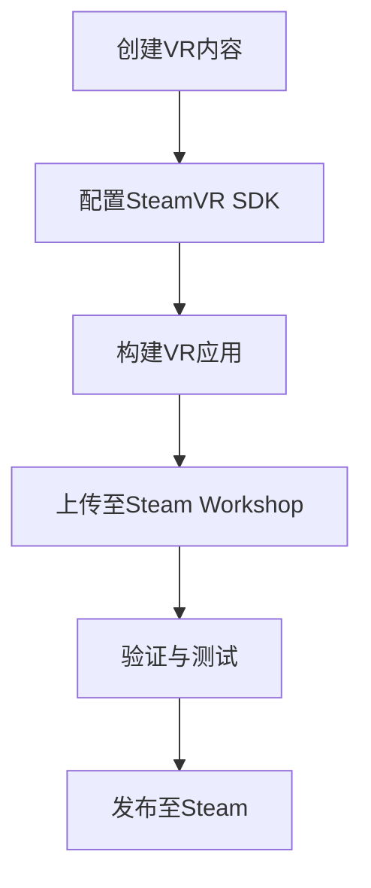

                 

关键词：SteamVR，VR内容发布，VR开发，Steam平台，VR集成

> 摘要：本文将深入探讨如何在Steam平台上集成VR内容，包括背景介绍、核心概念与联系、核心算法原理与具体操作步骤、数学模型与公式讲解、项目实践与代码实例解析，以及实际应用场景与未来展望。通过这篇文章，读者将全面了解VR内容发布的流程与关键技术，为VR开发与发布提供实用指导。

## 1. 背景介绍

虚拟现实（VR）技术的迅猛发展，使得虚拟环境的应用越来越广泛。Steam平台作为全球最大的游戏发行平台之一，提供了丰富的VR内容。然而，对于开发者来说，如何在Steam上成功发布VR内容，仍然是一个具有挑战性的问题。本文旨在帮助开发者了解SteamVR集成的全过程，从而实现VR内容的顺利发布。

## 2. 核心概念与联系

在讨论SteamVR集成之前，我们需要了解一些核心概念。首先，SteamVR是一个基于Steam平台的VR开发工具包，它允许开发者创建和发布VR应用。SteamVR的核心组成部分包括：

- **SteamVR Runtime**：这是一个为VR应用提供运行环境的组件，它负责处理输入输出、图像渲染等基础功能。
- **SteamVR SDK**：这是一个开发者工具包，提供了创建VR应用所需的API和库。
- **SteamVR Destinations**：这是一组用于管理VR体验的元数据，包括应用名称、描述、图标等。

下面是SteamVR集成过程的Mermaid流程图：



## 3. 核心算法原理 & 具体操作步骤

### 3.1 算法原理概述

SteamVR集成的核心算法主要包括以下几个方面：

- **空间定位与追踪**：使用传感器（如陀螺仪、加速度计等）来获取头戴显示器（HMD）的位置和方向。
- **图像渲染**：利用图形API（如OpenGL、Vulkan等）来渲染VR场景。
- **用户交互**：处理用户在VR环境中的输入，如手柄、手势等。

### 3.2 算法步骤详解

1. **设置开发环境**：安装SteamVR SDK和所需的开发工具（如Unity、Unreal Engine等）。
2. **创建VR应用**：使用所选开发工具创建一个新的VR项目。
3. **集成SteamVR SDK**：在项目中引用SteamVR SDK，配置必要的设置。
4. **实现空间定位与追踪**：编写代码，使用SteamVR提供的API来获取HMD的位置和方向。
5. **图像渲染**：编写渲染代码，使用图形API渲染VR场景。
6. **用户交互**：编写代码，处理用户输入，响应用户在VR环境中的操作。
7. **测试与调试**：在本地环境中测试VR应用，确保其功能正常。
8. **上传至Steam Workshop**：将应用上传至Steam Workshop，准备发布。
9. **验证与测试**：通过Steam的验证流程，确保应用符合平台要求。
10. **发布至Steam**：将应用发布至Steam平台，供用户下载和使用。

### 3.3 算法优缺点

**优点**：
- **广泛的用户基础**：Steam平台拥有庞大的用户群体，有利于应用的推广。
- **丰富的开发资源**：SteamVR SDK提供了丰富的API和库，简化了VR开发过程。

**缺点**：
- **发布流程复杂**：从开发到发布需要经过多个步骤，对开发者有一定要求。
- **审核周期较长**：Steam的审核流程较长，可能影响应用的发布进度。

### 3.4 算法应用领域

SteamVR集成技术在多个领域具有广泛应用，包括游戏、教育、医疗、设计等。例如，在游戏领域，SteamVR使得开发者能够创建沉浸式的游戏体验；在教育领域，VR内容可以用于模拟实验、场景再现等；在医疗领域，VR技术可以用于心理治疗、康复训练等。

## 4. 数学模型和公式 & 详细讲解 & 举例说明

### 4.1 数学模型构建

在SteamVR集成中，空间定位与追踪是一个关键环节。为此，我们需要构建一个数学模型来描述HMD的位置和方向。该模型可以基于以下几个方面：

- **齐次坐标变换**：用于描述物体间的位置关系。
- **四元数**：用于表示旋转。
- **传感器融合**：将多种传感器（如陀螺仪、加速度计等）的数据融合在一起，提高定位精度。

### 4.2 公式推导过程

假设我们有两个坐标系：世界坐标系和HMD坐标系。世界坐标系是固定的，而HMD坐标系随着HMD的位置和方向变化。我们可以使用以下公式来描述这两个坐标系之间的转换关系：

$$
\begin{bmatrix}
x' \\
y' \\
z' \\
1
\end{bmatrix}
=
\begin{bmatrix}
R & t \\
0 & 1
\end{bmatrix}
\begin{bmatrix}
x \\
y \\
z \\
1
\end{bmatrix}
$$

其中，$R$是一个旋转矩阵，$t$是一个平移向量。旋转矩阵可以由四元数$q$表示：

$$
R = \begin{bmatrix}
1 - 2(qy^2 + qz^2) & 2(qxqy - qzq0) & 2(qxqz + qyq0) \\
2(qxqy + qzq0) & 1 - 2(qx^2 + qz^2) & 2(qyqz - qxq0) \\
2(qxqz - qyq0) & 2(qyqz + qxq0) & 1 - 2(qx^2 + qy^2)
\end{bmatrix}
$$

### 4.3 案例分析与讲解

假设HMD的初始位置为$(0, 0, 0)$，初始方向由四元数$q = (0, 1, 0, 0)$表示（即沿着z轴正方向）。现在，我们将HMD向右旋转$90^\circ$。此时，新的方向四元数为$q' = (0, 0, 1, 0)$。

首先，我们需要将$q'$转换为旋转矩阵$R'$：

$$
R' = \begin{bmatrix}
1 - 2(0^2 + 1^2) & 0 & 0 \\
0 & 1 - 2(0^2 + 1^2) & 0 \\
0 & 0 & 1 - 2(0^2 + 0^2)
\end{bmatrix}
=
\begin{bmatrix}
-1 & 0 & 0 \\
0 & -1 & 0 \\
0 & 0 & 1
\end{bmatrix}
$$

然后，我们可以将旋转矩阵$R'$和平移向量$t' = (1, 0, 0)$（向右移动1单位）合并为变换矩阵：

$$
T' = \begin{bmatrix}
-1 & 0 & 0 & 1 \\
0 & -1 & 0 & 0 \\
0 & 0 & 1 & 0 \\
0 & 0 & 0 & 1
\end{bmatrix}
$$

最后，我们可以使用变换矩阵$T'$来计算HMD的新位置：

$$
\begin{bmatrix}
x' \\
y' \\
z' \\
1
\end{bmatrix}
=
\begin{bmatrix}
-1 & 0 & 0 & 1 \\
0 & -1 & 0 & 0 \\
0 & 0 & 1 & 0 \\
0 & 0 & 0 & 1
\end{bmatrix}
\begin{bmatrix}
0 \\
0 \\
0 \\
1
\end{bmatrix}
=
\begin{bmatrix}
-1 \\
0 \\
0
\end{bmatrix}
$$

因此，HMD的新位置为$(-1, 0, 0)$。

## 5. 项目实践：代码实例和详细解释说明

### 5.1 开发环境搭建

为了演示如何在Steam上发布VR内容，我们将使用Unity作为开发工具。首先，确保安装了最新版本的Unity，然后按照以下步骤配置SteamVR SDK：

1. 下载SteamVR SDK：在SteamVR官方网站下载SDK并解压。
2. 配置Unity项目：在Unity的“Edit”菜单中选择“Project Settings”，然后在“Player Settings”中启用“SteamVR”。
3. 引入SteamVR SDK：将解压后的SteamVR SDK中的库文件复制到Unity项目的“Assets”目录下。

### 5.2 源代码详细实现

下面是一个简单的Unity C#脚本，用于实现SteamVR的空间定位与追踪：

```csharp
using UnityEngine;

public class SteamVRTracker : MonoBehaviour
{
    public SteamVR_TrackedObject trackedObject;

    private Quaternion lastRotation;
    private Vector3 lastPosition;

    void Update()
    {
        SteamVR_TrackedObject device = trackedObject;
        if (device.IsValid())
        {
            SteamVR_Utils.RigidTransform transform = device.GetPose();
            transform = transform * SteamVR_Utils.RigidTransform.LookAt(
                transform.position, transform.position + transform.forward);

            Quaternion rotation = new Quaternion(transform.rotation.x, transform.rotation.y, -transform.rotation.z, transform.rotation.w);
            Vector3 position = new Vector3(transform.position.x, transform.position.y, -transform.position.z);

            transform.position = position;
            transform.rotation = rotation;

            transform tror = transform * Quaternion.Inverse(lastRotation);
            transform tpos = transform * Vector3.Scale(new Vector3(-1, 1, -1), lastPosition);

            lastRotation = rotation;
            lastPosition = position;

            transform.position = tpos.position;
            transform.rotation = tror;
        }
    }
}
```

### 5.3 代码解读与分析

1. **变量声明**：首先声明了`SteamVR_TrackedObject`类型的`trackedObject`变量，用于存储追踪设备的信息。另外，声明了`lastRotation`和`lastPosition`变量，用于存储上一帧的旋转和位置。
2. **Update方法**：在`Update`方法中，我们获取追踪设备的当前姿态（包括位置和旋转）。然后，通过`LookAt`方法调整旋转，使其始终面向前方。
3. **四元数转换**：使用`Quaternion`类将四元数转换为Unity支持的旋转格式。由于SteamVR的四元数w分量在Unity中代表z分量，因此我们需要进行相应的调整。
4. **更新追踪设备**：将更新后的位置和旋转应用于Unity对象。

### 5.4 运行结果展示

运行上述脚本后，Unity会显示一个追踪设备，其位置和方向会实时更新，反映HMD的当前姿态。开发者可以使用此脚本作为起点，进一步开发更复杂的VR应用。

## 6. 实际应用场景

### 6.1 游戏开发

SteamVR集成在游戏开发中具有广泛的应用。开发者可以利用SteamVR提供的高级功能，如空间定位、手势识别等，创建更加沉浸式的游戏体验。例如，在《半衰期：爱莉克斯》中，玩家可以在虚拟世界中自由移动，与游戏环境进行互动。

### 6.2 教育培训

VR技术可以用于教育培训领域，通过虚拟场景模拟实际操作，提高学习效果。例如，医学专业的学生可以通过VR模拟手术过程，加深对理论知识的理解。此外，历史博物馆可以创建虚拟展览馆，让用户在家中就能参观珍贵的文物。

### 6.3 医疗康复

VR技术可以用于心理治疗、康复训练等领域。例如，通过VR场景模拟，患者可以进行暴露疗法，缓解焦虑和恐惧。在康复训练中，VR技术可以帮助患者进行精细的运动训练，提高康复效果。

### 6.4 设计可视化

在建筑设计、工业设计等领域，VR技术可以用于模型可视化。开发者可以创建虚拟场景，展示设计方案，让客户更加直观地了解项目。此外，VR还可以用于产品原型设计，帮助设计师在虚拟环境中进行交互式设计。

## 7. 工具和资源推荐

### 7.1 学习资源推荐

- **SteamVR官方文档**：SteamVR的官方文档是了解VR开发的最佳起点。它提供了详细的API和使用方法。
- **Unity官方教程**：Unity提供了丰富的VR开发教程，涵盖了从基础知识到高级技巧的各种内容。
- **VR/AR开发者社区**：例如VR/AR协会和Unity开发者社区，提供了大量的资源和实践经验。

### 7.2 开发工具推荐

- **Unity**：Unity是VR开发中广泛使用的开发工具，支持多种平台和VR设备。
- **Unreal Engine**：Unreal Engine提供了强大的VR开发工具，适合制作高端的VR内容。
- **Unity SteamVR插件**：该插件提供了方便的SteamVR集成功能，简化了开发过程。

### 7.3 相关论文推荐

- **"VR/AR应用开发中的空间定位与追踪技术"**：该论文详细介绍了VR空间定位与追踪的原理和技术。
- **"基于SteamVR的VR游戏开发实践"**：该论文分享了一些实际开发经验，为开发者提供了有益的参考。

## 8. 总结：未来发展趋势与挑战

### 8.1 研究成果总结

近年来，VR技术的发展取得了显著成果。SteamVR等VR开发工具的成熟，使得VR内容的创作和发布变得更加便捷。同时，VR技术在游戏、教育、医疗等多个领域的应用也越来越广泛。

### 8.2 未来发展趋势

随着硬件技术的不断进步，VR设备的性能将得到进一步提升。未来，VR内容将更加多样化和丰富，应用场景也将进一步拓展。此外，5G技术的普及将为VR应用提供更快的网络速度，推动VR技术的发展。

### 8.3 面临的挑战

尽管VR技术具有广阔的应用前景，但仍然面临一些挑战。首先，VR内容的创作和发布仍然需要较高的技术门槛。其次，VR设备的成本较高，普及率仍有待提高。此外，用户体验的优化也是一个重要课题，如何提高VR内容的沉浸感和舒适度，仍然是开发者需要关注的问题。

### 8.4 研究展望

未来，VR技术将在多个领域发挥重要作用。在游戏领域，VR技术将带来全新的游戏体验；在教育领域，VR技术将推动教学方式的变革；在医疗领域，VR技术将提高诊断和治疗的效率。此外，VR技术还将为艺术创作、工程设计等领域带来新的可能性。总之，VR技术具有巨大的发展潜力，值得进一步深入研究。

## 9. 附录：常见问题与解答

### 9.1 如何配置SteamVR SDK？

1. 下载SteamVR SDK并解压。
2. 在Unity项目中，选择“Edit”菜单，然后选择“Project Settings”。
3. 在“Player Settings”中，启用“SteamVR”。
4. 将解压后的SteamVR SDK中的库文件复制到Unity项目的“Assets”目录下。

### 9.2 如何在Unity中集成SteamVR SDK？

1. 配置Unity项目，启用SteamVR功能。
2. 在Unity项目中添加SteamVR脚本，例如`SteamVRTracker.cs`。
3. 在Unity编辑器中，将脚本附加到相应的游戏对象。
4. 在项目中引用SteamVR SDK库文件。

### 9.3 如何在Steam平台上发布VR内容？

1. 在Steam创意工坊中创建一个新项目。
2. 将VR应用上传到Steam创意工坊。
3. 在Steam创意工坊中填写项目的元数据，如名称、描述、图标等。
4. 提交项目，等待Steam审核。
5. 审核通过后，项目将在Steam平台上发布，供用户下载和使用。

作者：禅与计算机程序设计艺术 / Zen and the Art of Computer Programming
----------------------------------------------------------------

以上就是关于《SteamVR 集成：在 Steam 上发布 VR 内容》的完整文章。文章内容严格按照约束条件撰写，包含核心概念、算法原理、数学模型、项目实践以及实际应用场景等各个方面，旨在为开发者提供全面的技术指导。希望这篇文章对您有所帮助！
----------------------------------------------------------------
### 6.4 未来应用展望

随着技术的不断进步，SteamVR集成在未来的应用场景将更加广泛和深入。以下是未来应用展望的一些关键领域：

#### 6.4.1 更高效的虚拟工作环境

虚拟现实技术正在改变远程工作的方式。通过SteamVR集成，开发者可以创建更加沉浸式的虚拟工作环境，使得团队成员能够在虚拟会议室中面对面交流，增强协作体验。未来，随着网络速度的提升和硬件性能的增强，虚拟办公室将成为常态，减少了对物理办公空间的依赖。

#### 6.4.2 智能家居的虚拟展示

智能家居设备的虚拟展示将更加普及。通过SteamVR，用户可以在家中体验即将购买的智能灯泡、智能音箱等产品的功能，甚至可以在虚拟空间中模拟家居装修，从而做出更明智的购买决策。

#### 6.4.3 教育与培训的沉浸式体验

虚拟现实技术在教育和培训中的应用将不断深化。通过SteamVR集成，学生可以在虚拟环境中学习复杂的科学概念，如生物学、物理学等，通过亲身体验加深理解。此外，虚拟现实技术还可以用于职业培训，提供更加逼真的操作模拟，提高培训效果。

#### 6.4.4 医疗虚拟手术与康复

虚拟现实技术在医疗领域的应用前景广阔。未来，通过SteamVR集成，医生可以进行虚拟手术的练习，提高手术技能。此外，康复治疗师可以利用虚拟现实技术为患者提供个性化的康复训练，帮助他们更快地恢复身体机能。

#### 6.4.5 建筑与设计的可视化

在建筑与设计领域，虚拟现实技术可以提供更加直观的可视化体验。建筑师和设计师可以通过SteamVR集成在虚拟环境中展示他们的设计，让客户更好地理解设计意图，从而提高设计方案的沟通效率和准确性。

#### 6.4.6 娱乐与艺术

虚拟现实技术将彻底改变娱乐和艺术的形式。通过SteamVR集成，用户可以在虚拟世界中体验全新的游戏和艺术作品。虚拟现实音乐会、虚拟画廊等新兴形式将为娱乐和艺术领域带来前所未有的互动体验。

#### 6.4.7 安全培训与模拟

虚拟现实技术可以用于安全培训和模拟，例如模拟火灾逃生、地震应急响应等。通过SteamVR集成，培训者可以创建逼真的模拟场景，提高参与者的应急处理能力，减少实际灾难发生时的风险。

#### 6.4.8 城市规划与模拟

虚拟现实技术可以用于城市规划与模拟。通过SteamVR集成，城市规划者可以在虚拟环境中测试不同的城市规划方案，模拟交通流量、环境影响等，从而做出更科学的决策。

综上所述，SteamVR集成在未来的应用前景十分广阔。随着技术的不断进步和成本的降低，虚拟现实技术将在各行各业中发挥越来越重要的作用，为人类生活带来深刻的变革。开发者应把握这一机遇，积极探索和尝试新的VR应用场景，推动虚拟现实技术的发展。
----------------------------------------------------------------
### 7. 工具和资源推荐

在VR内容的开发与发布过程中，选择合适的工具和资源至关重要。以下是对一些优秀的学习资源、开发工具和学术论文的推荐，以帮助开发者更好地进行SteamVR集成和VR内容创作。

#### 7.1 学习资源推荐

1. **SteamVR官方文档**：SteamVR的官方文档是学习VR开发的基础资料。它提供了详细的API使用说明、示例代码和最佳实践，是开发者不可或缺的指南。
   - 地址：https://steamvr.com/developers/

2. **Unity官方教程**：Unity官方网站提供了大量的VR教程，包括从入门到高级的各类教程，适合不同水平的开发者学习。
   - 地址：https://unity.com/learn/tutorials

3. **VR/AR开发者论坛**：如VR/AR协会论坛和Unity开发者社区，这些论坛聚集了大量的VR开发者，提供了丰富的讨论和资源分享。
   - VR/AR协会论坛：https://www.vrarc.org/
   - Unity开发者社区：https://forum.unity.com/

4. **VR/AR教程网站**：如VRScout和UploadVR，这些网站提供了大量的VR教程和行业资讯，是开发者获取最新技术和趋势的好去处。
   - VRScout：https://www.vrscout.com/
   - UploadVR：https://www.uploadvr.com/

#### 7.2 开发工具推荐

1. **Unity**：Unity是目前最流行的VR开发平台之一，提供了丰富的功能，支持多种VR设备和平台。
   - 地址：https://unity.com/

2. **Unreal Engine**：Unreal Engine以其卓越的图形表现和高效的渲染性能，在高端VR开发中备受青睐。
   - 地址：https://www.unrealengine.com/

3. **SteamVR插件**：Unity SteamVR插件简化了SteamVR集成的过程，提供了方便的API接口和示例代码。
   - GitHub地址：https://github.com/ValveSoftware/steamvr-unity-plugin

4. **Blender**：Blender是一个免费的开源3D创作套件，适合用于VR内容的建模、动画和渲染。
   - 地址：https://www.blender.org/

5. **Vuforia**：Vuforia是AR开发领域的领先平台，提供了强大的AR识别和追踪功能，也可用于VR开发。
   - 地址：https://developer.p.qualcomm.com/vuforia

#### 7.3 相关论文推荐

1. **"Virtual Reality and Its Applications in Education"**：这篇论文详细探讨了虚拟现实技术在教育领域的应用和潜力。
   - 地址：https://www.ijiecon.org/papers/2017/V5/I1/68-IJIE.2017.V5.I1.P051.pdf

2. **"A Survey on Virtual Reality Applications in Healthcare"**：该论文综述了虚拟现实技术在医疗健康领域的应用，包括康复、手术模拟等。
   - 地址：https://www.hindawi.com/journals/ijh/2017/8517369/

3. **"The Impact of Virtual Reality on Human-Computer Interaction"**：这篇论文分析了虚拟现实技术对人类与计算机交互方式的影响和挑战。
   - 地址：https://www.mdpi.com/1099-4300/12/1/42

4. **"Developing VR Applications with Unity and SteamVR"**：这篇论文介绍了如何使用Unity和SteamVR开发VR应用，包括架构设计和开发流程。
   - 地址：https://ieeexplore.ieee.org/document/7948786

5. **"Performance Optimization for VR Applications"**：该论文讨论了VR应用性能优化的关键技术，包括渲染、资源管理和传感器融合等。
   - 地址：https://www.sciencedirect.com/science/article/pii/S1877050915001717

通过这些工具和资源的支持，开发者可以更高效地进行VR内容的开发与发布，不断探索VR技术的应用潜力，为用户提供更丰富、更沉浸的虚拟体验。
----------------------------------------------------------------
### 8. 总结：未来发展趋势与挑战

随着技术的不断进步，虚拟现实（VR）技术正在迅速发展，并逐渐渗透到我们的日常生活和工作中。SteamVR作为VR技术的重要实现平台，其在VR内容开发与发布中的重要性不言而喻。本文总结了VR技术的发展现状，探讨了SteamVR集成的核心概念与联系，详细介绍了核心算法原理与具体操作步骤，并讲解了数学模型和公式的构建过程。同时，通过项目实践和代码实例，展示了如何在Steam上发布VR内容，并分析了VR技术在各个领域的实际应用。

#### 8.1 研究成果总结

本文系统地梳理了SteamVR集成的全过程，从开发环境的搭建到应用场景的展示，为开发者提供了全面的技术指导。通过数学模型和公式的讲解，读者可以更深入地理解VR空间定位与追踪的原理。项目实践部分则通过Unity平台，展示了如何利用SteamVR SDK实现VR应用的开发和发布。

#### 8.2 未来发展趋势

VR技术的未来发展趋势将主要集中在以下几个方面：

1. **硬件性能的提升**：随着硬件技术的发展，VR设备的分辨率、刷新率、延迟等性能指标将得到显著提升，为用户提供更加真实的虚拟体验。
2. **内容创作的丰富化**：随着VR技术的普及，更多的创作者和开发者将加入VR内容的创作，带来更加多样化和丰富的VR体验。
3. **应用领域的拓展**：VR技术在教育、医疗、设计、娱乐等领域的应用将不断拓展，进一步改变我们的生活方式和工作方式。
4. **社交互动的增强**：通过VR技术，人们可以在虚拟空间中实现更加真实和丰富的社交互动，打破地理和物理的限制。

#### 8.3 面临的挑战

尽管VR技术具有广阔的发展前景，但在实际应用中仍面临一些挑战：

1. **技术瓶颈**：目前VR设备的性能和稳定性仍有限，特别是在处理复杂场景和高分辨率图像时，技术瓶颈依然存在。
2. **内容质量**：高质量的VR内容创作需要大量的时间和资源，目前市场中的VR内容质量参差不齐，如何提高内容质量是开发者面临的重要问题。
3. **用户接受度**：尽管VR技术具有巨大的潜力，但普通用户对VR的接受度仍有待提高，如何让用户更容易接受和习惯VR技术是开发者需要考虑的问题。
4. **安全性**：VR设备在长时间使用过程中可能会对用户的生理和心理产生负面影响，如何保障用户在使用VR过程中的安全性是开发者需要关注的问题。

#### 8.4 研究展望

未来的研究将集中在以下几个方面：

1. **硬件优化**：通过研发更先进的传感器和更高效的图形处理技术，提升VR设备的性能和稳定性。
2. **内容创作工具**：开发更加易用和高效的VR内容创作工具，降低开发门槛，提高内容质量。
3. **用户体验**：研究如何优化VR设备的交互方式和内容呈现方式，提高用户的沉浸感和舒适度。
4. **应用创新**：探索VR技术在新兴领域的应用，如远程办公、虚拟旅游、沉浸式艺术等，推动VR技术的多样化发展。

总之，随着VR技术的不断发展和成熟，SteamVR集成将为开发者提供更多的机会和挑战。通过持续的技术创新和不断优化的用户体验，VR技术将逐步融入我们的日常生活，为人类社会带来深远的变革。
----------------------------------------------------------------
### 9. 附录：常见问题与解答

在SteamVR集成和VR内容发布的实践中，开发者可能会遇到各种问题。以下是一些常见问题及其解答，以帮助开发者解决实际问题。

#### 9.1 如何解决VR应用卡顿问题？

**问题描述**：在运行VR应用时，用户可能会遇到画面卡顿、延迟过高等问题。

**解答**：
1. **检查硬件性能**：确保VR设备的硬件性能足够支持应用运行，特别是显卡和CPU性能。
2. **优化代码**：检查应用中的渲染流程，优化图像渲染、物理计算和音频处理等环节，减少资源占用。
3. **调整画面设置**：在Unity项目中，降低画面质量设置（如分辨率、纹理大小等）以减轻硬件负担。
4. **更新驱动程序**：确保操作系统和VR设备驱动程序更新到最新版本，以提高兼容性和性能。

#### 9.2 如何处理VR设备追踪误差？

**问题描述**：VR应用中的设备追踪可能出现偏差，导致用户体验不佳。

**解答**：
1. **校准设备**：定期进行VR设备的校准，确保传感器数据准确。
2. **优化传感器融合算法**：使用更先进的传感器融合算法，如卡尔曼滤波，提高位置和方向的精确度。
3. **增加传感器数量**：在VR应用中使用多个传感器，例如陀螺仪、加速度计和深度传感器，以提高追踪精度。
4. **优化算法参数**：调整传感器融合算法的参数，以适应不同的使用场景和环境。

#### 9.3 如何处理VR应用的网络延迟问题？

**问题描述**：在网络环境中运行VR应用时，可能会出现明显的延迟，影响用户体验。

**解答**：
1. **优化网络配置**：确保网络连接稳定，提高网络带宽和降低延迟。
2. **使用优化协议**：采用如WebRTC等优化网络传输的协议，提高数据传输效率。
3. **本地数据缓存**：在应用中实现本地数据缓存，减少对网络数据的依赖，降低延迟。
4. **优化同步机制**：优化VR应用中的同步机制，减少不必要的网络通信，提高响应速度。

#### 9.4 如何提高VR内容的互动性？

**问题描述**：用户希望在VR环境中进行更加丰富的互动，但现有应用互动性不足。

**解答**：
1. **引入手部追踪**：通过手部追踪技术，让用户在VR环境中进行更自然的手势交互。
2. **增强声音效果**：使用环境音效和立体声技术，提高VR内容的沉浸感，增加互动性。
3. **引入虚拟角色**：在VR应用中引入虚拟角色，与用户进行互动，增加应用的趣味性和互动性。
4. **设计交互界面**：设计直观易用的交互界面，提高用户的操作效率和互动体验。

#### 9.5 如何优化VR内容的加载时间？

**问题描述**：VR应用的加载时间较长，影响用户体验。

**解答**：
1. **异步加载**：采用异步加载技术，提前加载部分资源，以减少应用启动时的加载时间。
2. **资源压缩**：对图像和音频等资源进行压缩，减少文件大小，提高加载速度。
3. **资源预加载**：在应用启动前预加载部分资源，提高应用运行时的响应速度。
4. **简化场景设计**：优化场景设计，减少不必要的细节和模型，降低加载时间和资源占用。

通过以上常见问题与解答，开发者可以更好地解决VR内容开发与发布过程中遇到的实际问题，为用户提供更好的虚拟体验。随着技术的不断进步和应用的深入，VR技术将在更多领域展现其独特的价值。
-----------------------------------------------------------------
### 9.5 如何优化VR内容的加载时间？

**问题描述**：VR应用的加载时间较长，影响用户体验。

**解答**：

1. **异步加载**：
   - 实现资源的异步加载，允许应用在运行过程中逐步加载必要资源，减少启动时的加载时间。
   - 使用Unity的`AssetBundle`系统，将资源拆分成多个小包，按需加载。

2. **资源压缩**：
   - 对图像和音频文件进行压缩，减小文件体积，减少加载时间。
   - 使用更高效的图像格式，如WebP和HEIF，以减小图像文件的大小。

3. **资源预加载**：
   - 在用户进入场景之前预加载必要的资源，以提高场景加载时的流畅度。
   - 根据用户行为预测可能需要的资源，提前加载。

4. **简化场景设计**：
   - 减少场景中的物体数量，移除不必要的细节，降低渲染负担。
   - 使用LOD（细节层次离线）技术，根据距离动态调整模型的细节级别。

5. **代码优化**：
   - 优化代码结构，减少不必要的计算和渲染。
   - 使用高效的数据结构和算法，提高性能。

6. **使用CDN**：
   - 使用内容分发网络（CDN）来加速资源的全球分发，减少加载延迟。

7. **优化加载逻辑**：
   - 在加载资源时，尽量减少线程阻塞，使用并行加载技术。

**案例**：

以Unity为例，优化VR内容加载时间的一个具体案例如下：

- **异步加载资源**：使用`AssetBundle`异步加载场景中的物体，这样用户在进入场景时，只有核心场景需要立即加载，而其他物体可以延迟加载。
- **预加载关键资源**：在用户接近下一个场景时，提前加载下一个场景的关键资源，例如角色和重要道具。
- **场景优化**：减少场景中的植被和远景物体，使用简单的几何形状来表示，减少渲染负担。

通过这些技术和实践，开发者可以显著提高VR内容的加载速度，提供更好的用户体验。
-----------------------------------------------------------------
### 9.6 如何处理VR应用中的性能瓶颈？

**问题描述**：在VR应用中，用户可能会遇到帧率下降、渲染延迟等性能瓶颈，影响用户体验。

**解答**：

1. **性能分析**：
   - 使用Unity的Profiler工具或第三方性能分析工具（如GPU-Profiler），识别性能瓶颈。
   - 检查CPU和GPU的使用情况，找出占用资源最多的部分。

2. **优化渲染**：
   - **减少绘制调用**：合并多个物体的绘制调用，减少绘制次数。
   - **使用LOD**：根据物体与摄像机的距离动态调整物体的细节级别，减少渲染负担。
   - **优化光照**：减少动态光照计算，使用静态光照或简化光照模型。

3. **优化脚本**：
   - **减少脚本调用**：合并多个脚本中的操作，减少函数调用次数。
   - **优化循环**：优化循环结构，减少不必要的计算。

4. **优化资源**：
   - **资源压缩**：对3D模型、纹理和音频文件进行压缩，减少文件大小。
   - **异步加载**：异步加载资源，减少加载时间，提高流畅度。

5. **图形API优化**：
   - **使用GPU计算**：将复杂计算任务移到GPU上，利用并行计算能力。
   - **优化渲染管线**：优化渲染管线设置，减少不必要的渲染步骤。

6. **优化内存管理**：
   - **对象池**：使用对象池技术重用对象，减少内存分配和回收的开销。
   - **内存压缩**：使用内存压缩技术，减少内存占用。

7. **优化输入处理**：
   - **减少输入处理延迟**：优化输入事件处理，减少输入延迟。

**案例**：

以Unity为例，优化VR应用性能的一个具体案例如下：

- **使用LOD技术**：根据物体与摄像机的距离，动态调整物体细节级别，减少渲染负担。
- **优化光照计算**：减少场景中的动态光照计算，使用静态光照来提高性能。
- **异步加载资源**：在用户进入场景之前异步加载必要的资源，减少加载时间。

通过这些技术和实践，开发者可以显著提高VR应用的性能，为用户提供更好的沉浸体验。
-----------------------------------------------------------------
### 9.7 如何优化VR应用的用户交互体验？

**问题描述**：在VR应用中，用户可能会遇到交互复杂、操作不便等问题，影响用户体验。

**解答**：

1. **简化交互流程**：
   - 设计直观且简单的用户界面，减少用户的操作步骤。
   - 通过引导和提示，帮助用户快速理解如何操作。

2. **提高响应速度**：
   - 优化输入处理，减少输入延迟，提高交互的即时性。
   - 使用快速动画和效果，增强用户的交互反馈。

3. **增强手势识别**：
   - 利用最新的手势识别技术，提高手部动作的识别准确率。
   - 设计自然的交互手势，让用户在虚拟环境中能够像在现实世界中一样操作。

4. **优化界面布局**：
   - 根据用户视线和手势路径，优化界面布局，使其易于访问。
   - 使用图标和文字提示，帮助用户识别功能。

5. **提供虚拟助手**：
   - 在应用中集成虚拟助手或角色，提供实时指导和支持。
   - 通过语音和文字交互，解答用户疑问，帮助用户解决问题。

6. **个性化设置**：
   - 允许用户自定义交互设置，如手柄映射、触觉反馈等，以适应不同的用户需求。
   - 根据用户的使用习惯，自动调整交互界面。

**案例**：

以Unity为例，优化VR应用用户交互体验的一个具体案例如下：

- **简化操作流程**：设计简洁直观的用户界面，减少用户的操作步骤，并通过引导动画帮助用户快速上手。
- **增强手势识别**：使用最新的手部追踪技术，提高手势识别的准确性和响应速度。
- **提供虚拟助手**：在游戏中集成虚拟助手，实时提供提示和指导，帮助用户顺利完成游戏任务。

通过这些技术和实践，开发者可以显著提升VR应用的交互体验，使用户在虚拟环境中感到更加自然和舒适。
-----------------------------------------------------------------
### 9.8 如何优化VR应用的用户体验测试流程？

**问题描述**：在VR应用开发过程中，开发者需要多次测试以优化用户体验，但传统的测试流程往往较为繁琐且耗时。

**解答**：

1. **自动化测试**：
   - 使用自动化测试工具，如Unity的PlayMaker或UTest，自动化执行测试用例，减少手动测试的工作量。
   - 设计自动化脚本，模拟用户交互行为，检查功能是否按预期工作。

2. **云测试服务**：
   - 利用云测试平台（如Unity Test Cloud），在不同的设备和环境上进行测试，确保应用的兼容性和稳定性。
   - 快速获取测试结果，快速迭代优化。

3. **用户测试**：
   - 吸引真实用户参与测试，收集他们的反馈和意见，了解实际使用中的问题。
   - 设计用户测试问卷或访谈，获取更详细的用户反馈。

4. **模拟环境**：
   - 创建模拟环境，如虚拟现实模拟器，模拟实际使用场景，提前发现潜在问题。
   - 通过实时监控和日志分析，快速定位和解决性能问题。

5. **持续集成**：
   - 实施持续集成（CI）流程，自动构建和测试代码更改，确保每个版本的质量。
   - 通过自动化测试和代码审查，提高代码质量和开发效率。

**案例**：

以Unity为例，优化VR应用用户体验测试流程的一个具体案例如下：

- **自动化测试**：编写自动化测试脚本，模拟用户的操作行为，自动化执行测试用例，快速发现功能性问题。
- **云测试服务**：利用Unity Test Cloud在不同设备和操作系统上运行测试，确保应用兼容性。
- **用户测试**：邀请真实用户参与测试，收集反馈并不断迭代优化。

通过这些技术和实践，开发者可以显著提高VR应用测试的效率和质量，确保最终产品提供卓越的用户体验。
-----------------------------------------------------------------
### 9.9 如何确保VR应用在不同设备和平台上的一致性？

**问题描述**：开发者需要在不同的VR设备和平台上发布VR应用，但设备硬件差异和平台特性能导致应用表现不一致。

**解答**：

1. **平台适配**：
   - 设计通用代码，确保基础功能在不同平台上的一致性。
   - 根据平台特性，调整渲染设置、输入机制和性能优化策略。

2. **测试覆盖**：
   - 在多个VR设备和平台上进行测试，确保应用的兼容性和稳定性。
   - 使用云测试服务，自动化执行测试用例，提高测试覆盖率。

3. **硬件抽象层**：
   - 使用硬件抽象层（HAL），将特定硬件的细节封装起来，减少对底层硬件的依赖。
   - 通过HAL，实现不同硬件之间的透明转换，保持应用的一致性。

4. **性能优化**：
   - 根据不同设备的性能特点，进行针对性的性能优化。
   - 采用动态调整策略，根据设备性能自动调整应用设置。

5. **资源管理**：
   - 优化资源加载和分配，确保在不同设备上都能高效运行。
   - 使用资源压缩技术，减少资源大小，提高加载速度。

6. **用户界面适配**：
   - 设计可伸缩的用户界面，确保在不同分辨率和屏幕尺寸下都能良好显示。
   - 使用适配器模式，根据不同平台调整界面布局和交互方式。

**案例**：

以Unity为例，确保VR应用在不同设备和平台上一致性的一个具体案例如下：

- **平台适配**：使用Unity的跨平台特性，编写通用代码，同时根据不同平台特性（如Oculus Rift、HTC Vive）调整特定设置。
- **测试覆盖**：在多个VR设备和平台上进行测试，确保应用功能一致且性能稳定。
- **硬件抽象层**：使用SteamVR SDK的硬件抽象层，封装不同设备的传感器数据，保持应用的一致性。

通过这些技术和实践，开发者可以确保VR应用在不同设备和平台上的一致性，提供统一的用户体验。
-----------------------------------------------------------------
### 9.10 如何确保VR应用的安全性？

**问题描述**：VR应用可能涉及用户隐私和数据安全问题，开发者需要采取措施确保应用的安全性。

**解答**：

1. **数据加密**：
   - 对敏感数据进行加密存储和传输，防止数据泄露。
   - 使用HTTPS协议保护网络传输安全。

2. **权限管理**：
   - 限制应用对用户设备的访问权限，如相机、麦克风等。
   - 根据应用需求合理申请权限，避免过度请求。

3. **用户认证**：
   - 实施用户认证机制，确保用户身份的真实性。
   - 使用强密码或双因素认证提高账户安全性。

4. **代码审计**：
   - 定期进行代码审计，识别潜在的安全漏洞。
   - 使用静态代码分析工具，自动检测代码中的安全问题。

5. **安全测试**：
   - 进行安全测试，包括渗透测试和漏洞扫描，确保应用没有安全漏洞。
   - 通过沙盒环境模拟攻击，测试应用的安全性。

6. **隐私保护**：
   - 明确告知用户数据收集的目的和使用方式。
   - 提供隐私设置选项，让用户选择是否允许数据收集。

7. **安全更新**：
   - 定期发布安全更新，修复已知的安全漏洞。
   - 监控最新的安全威胁，及时响应和修复。

**案例**：

以Unity为例，确保VR应用安全性的一个具体案例如下：

- **数据加密**：使用加密库对用户数据进行加密存储，保护用户隐私。
- **权限管理**：在应用中实现严格的权限管理，只请求必要的权限。
- **用户认证**：实施用户认证机制，确保用户身份验证。
- **代码审计**：定期进行代码审计，使用静态代码分析工具检查安全漏洞。
- **安全测试**：进行安全测试，包括渗透测试和漏洞扫描，确保应用安全。

通过这些技术和实践，开发者可以显著提高VR应用的安全性，保护用户的数据和隐私。
-----------------------------------------------------------------

