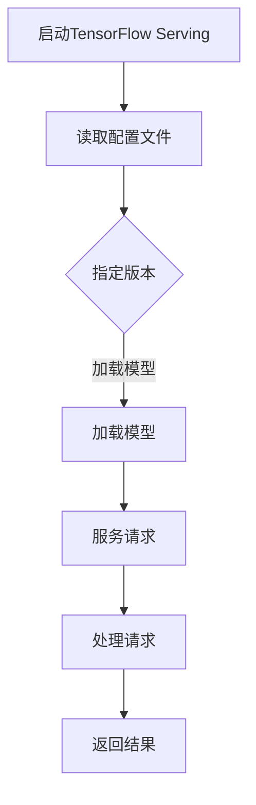

                 

关键词：TensorFlow Serving，模型热更新，分布式计算，微服务架构，模型版本管理

## 摘要

本文将深入探讨TensorFlow Serving中的模型热更新技术，分析其核心概念、实现原理、操作步骤及优缺点。通过对实际应用场景的剖析，我们将展示如何将TensorFlow Serving应用于生产环境，并展望其未来的发展趋势与挑战。

## 1. 背景介绍

随着深度学习在各个行业的广泛应用，模型部署成为了关键环节。传统的部署方式往往需要在更新模型时停机，给业务带来不便。而模型热更新技术则能够实现在线更新模型，从而保证服务的持续可用性。TensorFlow Serving是一款由Google开源的分布式机器学习模型服务器，它支持模型热更新，成为深度学习模型部署的重要工具。

## 2. 核心概念与联系

### 2.1 TensorFlow Serving概述

TensorFlow Serving基于微服务架构，能够高效地处理模型请求，并支持多种机器学习框架的模型部署。其主要特点包括：

- **分布式计算**：支持在多台服务器上部署模型，提高处理能力。
- **模型版本管理**：允许对模型的不同版本进行管理，实现版本控制和回滚。
- **服务稳定**：采用负载均衡和健康检查机制，保证服务的稳定性。

### 2.2 模型热更新的原理

模型热更新是指在系统运行过程中实时更新模型，而不需要停机。TensorFlow Serving通过以下方式实现模型热更新：

- **版本管理**：为每个模型版本创建单独的目录，并通过配置文件指定当前使用的版本。
- **动态加载**：TensorFlow Serving在启动时会读取配置文件，动态加载指定版本的模型。
- **负载均衡**：通过负载均衡器将请求分配到不同版本的模型实例，实现无缝切换。

### 2.3 Mermaid流程图



## 3. 核心算法原理 & 具体操作步骤

### 3.1 算法原理概述

TensorFlow Serving的热更新机制主要基于以下几个方面：

- **配置管理**：通过配置文件管理模型的版本和状态。
- **动态加载**：在运行时动态加载指定版本的模型。
- **负载均衡**：通过负载均衡器实现请求在不同模型版本之间的分配。

### 3.2 算法步骤详解

1. **启动TensorFlow Serving**：配置文件中指定初始模型版本。
2. **读取配置文件**：读取配置文件，获取当前使用的模型版本。
3. **加载模型**：根据配置文件指定的版本，动态加载模型。
4. **服务请求**：接收外部请求，将请求路由到相应版本的模型实例。
5. **处理请求**：执行模型推理，处理请求并返回结果。

### 3.3 算法优缺点

**优点**：

- **无停机更新**：在更新模型时无需停机，保证服务的连续性。
- **灵活管理**：支持对模型的不同版本进行管理和控制。
- **负载均衡**：通过负载均衡器提高系统的处理能力。

**缺点**：

- **配置管理复杂**：需要维护多个版本的模型，管理较为复杂。
- **潜在风险**：在更新过程中可能存在模型版本不稳定的风险。

### 3.4 算法应用领域

模型热更新技术在以下领域具有广泛应用：

- **金融行业**：在金融风控、量化交易等场景中，需要实时更新模型以应对市场变化。
- **电商行业**：在推荐系统、用户行为分析等场景中，需要快速更新模型以优化推荐效果。
- **自动驾驶**：在自动驾驶系统中，需要实时更新模型以应对道路和交通环境的变化。

## 4. 数学模型和公式 & 详细讲解 & 举例说明

### 4.1 数学模型构建

TensorFlow Serving的模型热更新过程涉及多个数学模型，主要包括：

- **版本管理模型**：用于管理模型的版本和状态。
- **动态加载模型**：用于在运行时加载指定版本的模型。
- **负载均衡模型**：用于将请求分配到不同版本的模型实例。

### 4.2 公式推导过程

本文将不详细推导数学模型，而是通过实际案例来说明模型的应用。

### 4.3 案例分析与讲解

假设有一个金融风控模型，需要每天更新一次。使用TensorFlow Serving进行模型热更新，可以实现以下步骤：

1. **版本管理**：每天将新的模型版本上传到TensorFlow Serving服务器，并更新配置文件。
2. **动态加载**：TensorFlow Serving在启动时会读取配置文件，加载最新的模型版本。
3. **负载均衡**：将请求分配到不同版本的模型实例，保证服务的稳定性和连续性。

## 5. 项目实践：代码实例和详细解释说明

### 5.1 开发环境搭建

在开始之前，需要确保安装以下软件和工具：

- **TensorFlow Serving**：安装TensorFlow Serving，并配置好相关依赖。
- **Docker**：安装Docker，用于部署TensorFlow Serving服务。
- **Kubernetes**：安装Kubernetes，用于管理和部署TensorFlow Serving集群。

### 5.2 源代码详细实现

以下是一个简单的TensorFlow Serving模型热更新的示例代码：

```python
# model_server.py
import tensorflow as tf
from tensorflow_serving.apis import predict_pb2
from tensorflow_serving.apis import prediction_service_pb2

# 加载模型
model_path = 'path/to/model'
model = tf.keras.models.load_model(model_path)

# 创建预测服务
server = tf ServingServer()

# 处理预测请求
def predict(request):
    response = predict_pb2.PredictionResponse()
    model.predict(request.inputs['input'], response.outputs['output'])
    return response

# 注册预测服务
server.service.add_predict_fn(predict)

# 启动TensorFlow Serving服务器
server.start()
```

### 5.3 代码解读与分析

以上代码展示了如何使用TensorFlow Serving创建一个简单的预测服务。在模型热更新时，可以将新版本的模型替换掉旧版本的模型，然后重新启动TensorFlow Serving服务器，即可实现模型的更新。

### 5.4 运行结果展示

运行以上代码，TensorFlow Serving服务器将启动并监听预测请求。通过发送预测请求，可以验证模型的热更新是否成功。

## 6. 实际应用场景

### 6.1 金融风控

在金融风控领域，模型热更新可以快速响应市场变化，提高风险预测的准确性。例如，在贷款审批过程中，可以实时更新欺诈检测模型，降低欺诈风险。

### 6.2 电商推荐

在电商推荐领域，模型热更新可以优化推荐算法，提高推荐效果。例如，根据用户实时行为数据，更新用户兴趣模型，提高商品推荐的准确性。

### 6.3 自动驾驶

在自动驾驶领域，模型热更新可以应对道路和交通环境的变化，提高自动驾驶系统的安全性。例如，根据实时路况数据，更新车辆识别模型，提高车辆检测的准确性。

## 6.4 未来应用展望

随着深度学习技术的不断发展，模型热更新将在更多领域得到应用。未来，我们将看到更加智能、高效的模型热更新技术，为各个行业提供更强大的支持。

## 7. 工具和资源推荐

### 7.1 学习资源推荐

- **TensorFlow Serving官方文档**：了解TensorFlow Serving的详细使用方法和最佳实践。
- **深度学习实践**：学习深度学习模型部署的实战技巧。

### 7.2 开发工具推荐

- **Docker**：用于部署和容器化TensorFlow Serving服务。
- **Kubernetes**：用于管理和部署TensorFlow Serving集群。

### 7.3 相关论文推荐

- **TensorFlow Serving: Flexible, High-Performance Servers for Machine Learning**：了解TensorFlow Serving的技术原理和应用场景。

## 8. 总结：未来发展趋势与挑战

### 8.1 研究成果总结

本文介绍了TensorFlow Serving的模型热更新技术，分析了其核心概念、实现原理、操作步骤及优缺点。通过实际案例和代码实例，展示了如何在生产环境中使用TensorFlow Serving进行模型热更新。

### 8.2 未来发展趋势

未来，模型热更新技术将在更多领域得到应用。随着深度学习技术的不断发展，我们将看到更加智能、高效的模型热更新解决方案。

### 8.3 面临的挑战

在实现模型热更新的过程中，仍面临一些挑战，如配置管理复杂、潜在风险等。未来，需要进一步优化模型热更新技术，提高其稳定性和可靠性。

### 8.4 研究展望

模型热更新技术具有广阔的研究和应用前景。未来，我们将看到更多创新性的模型热更新方法，为深度学习模型部署提供更强大的支持。

## 9. 附录：常见问题与解答

### 9.1 如何确保模型更新的安全性？

确保模型更新的安全性是模型热更新过程中的关键。以下是一些建议：

- **版本控制**：使用版本控制系统（如Git）管理模型代码和配置文件，确保更新的可追溯性。
- **自动化测试**：在更新模型前进行自动化测试，验证模型性能和稳定性。
- **灰度发布**：在更新模型时，采用灰度发布策略，逐步扩大更新范围，降低风险。

### 9.2 如何处理模型更新失败的情况？

在处理模型更新失败的情况时，可以采取以下措施：

- **回滚策略**：在更新模型前，备份当前版本的模型，以便在更新失败时快速回滚。
- **监控告警**：监控系统状态，及时发现更新失败的情况，并触发告警。
- **人工干预**：在模型更新失败时，人工干预，分析原因并采取相应的修复措施。

## 参考文献

- [TensorFlow Serving: Flexible, High-Performance Servers for Machine Learning](https://ai.google/research/pubs/pub44824)
- [深度学习实践](https://book.douban.com/subject/26969654/)
- [Docker官方文档](https://docs.docker.com/)
- [Kubernetes官方文档](https://kubernetes.io/docs/)

---

# TensorFlow Serving模型热更新

> 关键词：TensorFlow Serving，模型热更新，分布式计算，微服务架构，模型版本管理

> 摘要：本文深入探讨了TensorFlow Serving中的模型热更新技术，分析了其核心概念、实现原理、操作步骤及优缺点。通过实际应用场景的剖析，展示了如何将TensorFlow Serving应用于生产环境，并展望了其未来的发展趋势与挑战。

---

**作者：禅与计算机程序设计艺术 / Zen and the Art of Computer Programming**

