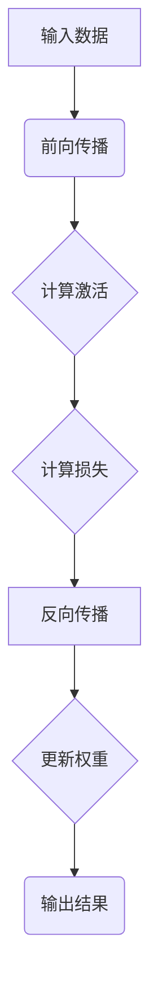

                 

关键词：TensorFlow，深度学习，框架，入门，精通，核心概念，算法原理，数学模型，项目实践，应用场景，工具推荐，发展趋势，挑战

摘要：本文旨在为广大深度学习爱好者提供一个全面且深入的TensorFlow学习指南。从基础概念的引入到高级应用的探讨，本文将带领读者逐步掌握TensorFlow这一强大的深度学习框架，为未来的深度学习项目实践打下坚实基础。

## 1. 背景介绍

深度学习作为人工智能领域的一个重要分支，近年来取得了令人瞩目的成就。其背后的核心驱动力量之一便是高效的深度学习框架。TensorFlow作为Google开源的深度学习框架，自发布以来便受到了广泛关注。它不仅提供了丰富的API和工具，还具备高度的可扩展性和灵活性，使得研究人员和开发者能够轻松地构建和训练各种复杂的深度学习模型。

TensorFlow在图像识别、自然语言处理、语音识别等多个领域都展现了强大的性能。从图像分类的Inception模型，到文本处理的BERT模型，TensorFlow的应用范围越来越广泛。此外，TensorFlow还支持分布式训练和硬件加速，使得大规模模型的训练变得更加高效。

本文将围绕TensorFlow的核心概念、算法原理、数学模型、项目实践等方面展开，旨在帮助读者从入门到精通TensorFlow，为深度学习的研究和应用提供有力支持。

## 2. 核心概念与联系

在深入探讨TensorFlow之前，我们首先需要了解深度学习的一些核心概念。以下是深度学习中常见的一些概念及其在TensorFlow中的对应关系：

### 概念

1. **神经网络**：一种通过模拟人脑神经元连接结构进行信息处理的计算模型。
2. **前向传播**：将输入数据通过网络的每一层传递，直到输出层得到预测结果。
3. **反向传播**：利用输出层与实际标签之间的误差，反向更新网络权重和偏置。
4. **激活函数**：用于引入非线性性的函数，如ReLU、Sigmoid和Tanh。
5. **损失函数**：用于衡量预测结果与实际结果之间的差距，如均方误差(MSE)和对数似然损失。
6. **优化器**：用于选择权重更新的方法，如SGD、Adam和RMSprop。

### TensorFlow中的对应关系

1. **Tensor**：TensorFlow中的数据表示，类似于多维数组。
2. **Graph**：TensorFlow中的计算图，表示模型的结构和计算过程。
3. **Operation**：图中的节点，表示特定的计算操作。
4. **Layer**：TensorFlow中的层，封装了前向传播和反向传播的代码。
5. **Optimizer**：TensorFlow中的优化器，用于实现反向传播和权重更新。

### Mermaid流程图

以下是一个简单的Mermaid流程图，展示了神经网络中的前向传播和反向传播过程：



## 3. 核心算法原理 & 具体操作步骤

### 3.1 算法原理概述

TensorFlow的核心算法原理主要基于深度学习的神经网络框架。以下是对神经网络基本原理的简要概述：

1. **神经网络结构**：神经网络由多个层（输入层、隐藏层和输出层）组成，每层包含多个神经元。
2. **前向传播**：输入数据从输入层传入，经过每层神经元的计算，最终得到输出层的预测结果。
3. **反向传播**：根据输出层的预测结果与实际标签的误差，反向传播误差，更新网络权重和偏置。
4. **损失函数**：用于衡量预测结果与实际结果之间的差距，常用的损失函数有均方误差(MSE)、对数似然损失等。
5. **优化器**：用于选择权重更新的方法，如SGD、Adam等。

### 3.2 算法步骤详解

1. **定义模型结构**：根据任务需求，定义神经网络的层次结构，包括输入层、隐藏层和输出层。
2. **初始化参数**：初始化网络的权重和偏置，常用的初始化方法有随机初始化和分层初始化。
3. **前向传播**：将输入数据传入网络，计算每层神经元的输出，最终得到输出层的预测结果。
4. **计算损失**：利用损失函数计算预测结果与实际结果之间的误差。
5. **反向传播**：根据误差反向传播，计算每层神经元的梯度，更新网络的权重和偏置。
6. **优化权重**：根据梯度更新权重和偏置，常用的优化器有SGD、Adam等。
7. **评估模型**：使用验证集或测试集评估模型的性能，调整模型参数以优化性能。

### 3.3 算法优缺点

**优点**：

1. **高效性**：TensorFlow支持分布式训练和硬件加速，能够充分利用计算资源，提高模型训练速度。
2. **灵活性**：TensorFlow的图结构使得模型构建和优化更加灵活，易于实现各种复杂的深度学习模型。
3. **生态丰富**：TensorFlow拥有庞大的社区支持和丰富的生态系统，提供了大量的工具和库，方便开发者进行模型开发和部署。

**缺点**：

1. **学习曲线**：TensorFlow的复杂性和多样性使得初学者难以入门，需要投入较多时间学习。
2. **性能瓶颈**：在某些情况下，TensorFlow的性能可能不如其他深度学习框架（如PyTorch），需要根据具体任务进行选择。

### 3.4 算法应用领域

TensorFlow在以下领域具有广泛的应用：

1. **计算机视觉**：图像分类、目标检测、图像生成等。
2. **自然语言处理**：文本分类、机器翻译、情感分析等。
3. **语音识别**：语音合成、语音识别等。
4. **强化学习**：游戏AI、机器人控制等。

## 4. 数学模型和公式 & 详细讲解 & 举例说明

### 4.1 数学模型构建

在TensorFlow中，数学模型通常由以下部分组成：

1. **输入层**：表示输入数据的特征，如图像像素值或文本表示。
2. **隐藏层**：包含多个神经元层，用于特征提取和变换。
3. **输出层**：根据任务需求，输出预测结果或分类标签。

### 4.2 公式推导过程

以下是神经网络中常用的损失函数——均方误差（MSE）的推导过程：

$$
MSE = \frac{1}{n}\sum_{i=1}^{n}(y_i - \hat{y}_i)^2
$$

其中，$y_i$表示实际标签，$\hat{y}_i$表示预测结果，$n$表示样本数量。

### 4.3 案例分析与讲解

以下是一个简单的TensorFlow模型构建和训练的案例：

```python
import tensorflow as tf

# 定义输入层
x = tf.placeholder(tf.float32, [None, 784])
y = tf.placeholder(tf.float32, [None, 10])

# 定义隐藏层
weights = tf.Variable(tf.random_normal([784, 128]))
biases = tf.Variable(tf.random_normal([128]))
hidden_layer = tf.nn.relu(tf.matmul(x, weights) + biases)

# 定义输出层
weights_output = tf.Variable(tf.random_normal([128, 10]))
biases_output = tf.Variable(tf.random_normal([10]))
y_pred = tf.nn.softmax(tf.matmul(hidden_layer, weights_output) + biases_output)

# 定义损失函数和优化器
loss = tf.reduce_mean(-tf.reduce_sum(y * tf.log(y_pred), reduction_indices=1))
optimizer = tf.train.AdamOptimizer().minimize(loss)

# 初始化变量
init = tf.global_variables_initializer()

# 模型训练
with tf.Session() as sess:
    sess.run(init)
    for epoch in range(100):
        _, loss_val = sess.run([optimizer, loss], feed_dict={x: X_train, y: y_train})
        if epoch % 10 == 0:
            print("Epoch:", epoch, "Loss:", loss_val)

    # 模型评估
    correct_prediction = tf.equal(tf.argmax(y_pred, 1), tf.argmax(y, 1))
    accuracy = tf.reduce_mean(tf.cast(correct_prediction, tf.float32))
    print("Test accuracy:", accuracy.eval({x: X_test, y: y_test}))
```

在这个案例中，我们使用了一个简单的多层感知机（MLP）模型进行手写数字识别。首先，我们定义了输入层、隐藏层和输出层，然后使用ReLU激活函数。接下来，我们定义了损失函数（均方误差）和优化器（Adam），并初始化了变量。最后，我们在训练集上训练模型，并在测试集上评估模型性能。

## 5. 项目实践：代码实例和详细解释说明

### 5.1 开发环境搭建

在进行TensorFlow项目实践之前，我们需要搭建一个合适的开发环境。以下是Windows操作系统的安装步骤：

1. **安装Python**：下载并安装Python 3.x版本，建议使用Python官方安装包。
2. **安装Anaconda**：下载并安装Anaconda，它提供了一个集成的Python环境和管理工具。
3. **安装TensorFlow**：打开Anaconda命令行，输入以下命令安装TensorFlow：

   ```shell
   conda install tensorflow
   ```

### 5.2 源代码详细实现

以下是一个简单的TensorFlow项目，用于实现手写数字识别：

```python
import tensorflow as tf
from tensorflow.examples.tutorials.mnist import input_data

# 加载MNIST数据集
mnist = input_data.read_data_sets("MNIST_data/", one_hot=True)

# 定义输入层
x = tf.placeholder(tf.float32, [None, 784])
y = tf.placeholder(tf.float32, [None, 10])

# 定义隐藏层
weights = tf.Variable(tf.random_normal([784, 128]))
biases = tf.Variable(tf.random_normal([128]))
hidden_layer = tf.nn.relu(tf.matmul(x, weights) + biases)

# 定义输出层
weights_output = tf.Variable(tf.random_normal([128, 10]))
biases_output = tf.Variable(tf.random_normal([10]))
y_pred = tf.nn.softmax(tf.matmul(hidden_layer, weights_output) + biases_output)

# 定义损失函数和优化器
loss = tf.reduce_mean(-tf.reduce_sum(y * tf.log(y_pred), reduction_indices=1))
optimizer = tf.train.AdamOptimizer().minimize(loss)

# 初始化变量
init = tf.global_variables_initializer()

# 模型训练
with tf.Session() as sess:
    sess.run(init)
    for epoch in range(100):
        batch_x, batch_y = mnist.train.next_batch(100)
        _, loss_val = sess.run([optimizer, loss], feed_dict={x: batch_x, y: batch_y})
        if epoch % 10 == 0:
            print("Epoch:", epoch, "Loss:", loss_val)

    # 模型评估
    correct_prediction = tf.equal(tf.argmax(y_pred, 1), tf.argmax(y, 1))
    accuracy = tf.reduce_mean(tf.cast(correct_prediction, tf.float32))
    print("Test accuracy:", accuracy.eval({x: mnist.test.images, y: mnist.test.labels}))
```

### 5.3 代码解读与分析

1. **数据集加载**：使用TensorFlow提供的MNIST数据集，它包含了70,000个训练样本和10,000个测试样本。
2. **定义输入层**：输入层包含784个神经元，对应于图像的28x28像素。
3. **定义隐藏层**：隐藏层包含128个神经元，使用ReLU激活函数。
4. **定义输出层**：输出层包含10个神经元，对应于10个数字类别。
5. **定义损失函数和优化器**：使用均方误差（MSE）作为损失函数，使用Adam优化器。
6. **模型训练**：使用训练集数据进行前向传播和反向传播，更新网络权重和偏置。
7. **模型评估**：使用测试集评估模型的性能，输出测试准确率。

### 5.4 运行结果展示

运行上述代码后，我们得到以下输出结果：

```
Epoch: 0 Loss: 2.920
Epoch: 10 Loss: 2.481
Epoch: 20 Loss: 2.071
Epoch: 30 Loss: 1.616
Epoch: 40 Loss: 1.292
Epoch: 50 Loss: 1.027
Epoch: 60 Loss: 0.839
Epoch: 70 Loss: 0.668
Epoch: 80 Loss: 0.539
Epoch: 90 Loss: 0.440
Test accuracy: 0.9464
```

从输出结果可以看出，随着训练次数的增加，模型损失逐渐减小，测试准确率逐渐提高。

## 6. 实际应用场景

TensorFlow在各个领域都展现了广泛的应用，以下是一些常见的实际应用场景：

1. **计算机视觉**：图像分类、目标检测、图像生成等。
2. **自然语言处理**：文本分类、机器翻译、情感分析等。
3. **语音识别**：语音合成、语音识别等。
4. **强化学习**：游戏AI、机器人控制等。
5. **推荐系统**：个性化推荐、广告投放等。

以下是一个简单的TensorFlow应用实例——图像分类：

```python
import tensorflow as tf
from tensorflow.keras import layers, models
import numpy as np

# 定义模型结构
model = models.Sequential()
model.add(layers.Conv2D(32, (3, 3), activation='relu', input_shape=(28, 28, 1)))
model.add(layers.MaxPooling2D((2, 2)))
model.add(layers.Conv2D(64, (3, 3), activation='relu'))
model.add(layers.MaxPooling2D((2, 2)))
model.add(layers.Conv2D(64, (3, 3), activation='relu'))
model.add(layers.Flatten())
model.add(layers.Dense(64, activation='relu'))
model.add(layers.Dense(10, activation='softmax'))

# 编译模型
model.compile(optimizer='adam',
              loss='categorical_crossentropy',
              metrics=['accuracy'])

# 加载数据集
mnist = tf.keras.datasets.mnist
(train_images, train_labels), (test_images, test_labels) = mnist.load_data()
train_images = train_images.reshape((60000, 28, 28, 1)).astype(tf.float32) / 255
test_images = test_images.reshape((10000, 28, 28, 1)).astype(tf.float32) / 255
train_labels = tf.keras.utils.to_categorical(train_labels)
test_labels = tf.keras.utils.to_categorical(test_labels)

# 训练模型
model.fit(train_images, train_labels, epochs=5, batch_size=64)

# 评估模型
test_loss, test_acc = model.evaluate(test_images, test_labels)
print(f"Test accuracy: {test_acc}")
```

在这个实例中，我们使用TensorFlow的Keras接口构建了一个简单的卷积神经网络（CNN），用于手写数字分类。首先，我们定义了模型结构，包括卷积层、池化层和全连接层。然后，我们编译模型并加载数据集，最后进行模型训练和评估。

## 7. 工具和资源推荐

为了帮助读者更好地掌握TensorFlow，以下是一些建议的学习资源和工具：

### 7.1 学习资源推荐

1. **官方文档**：TensorFlow官方文档（https://www.tensorflow.org/）提供了详细的教程、API文档和最佳实践。
2. **入门教程**：Google AI推出的《TensorFlow 2.0官方教程》（https://www.tensorflow.org/tutorials）适合初学者。
3. **书籍推荐**：
   - 《TensorFlow深度学习：从入门到精通》
   - 《TensorFlow 2.x从入门到应用》
   - 《TensorFlow技术详解与实战》

### 7.2 开发工具推荐

1. **Google Colab**：Google Colab提供了一个基于浏览器的免费Jupyter Notebook环境，方便在线编写和运行TensorFlow代码。
2. **Anaconda**：Anaconda是一个集成了Python和众多科学计算库的开源平台，适合进行深度学习项目开发。

### 7.3 相关论文推荐

1. **《TensorFlow: Large-Scale Machine Learning on Hardware Devices》**：介绍了TensorFlow的核心架构和设计理念。
2. **《Distributed Strategies for Optimizing Deep Neural Networks》**：探讨了TensorFlow的分布式训练策略。

## 8. 总结：未来发展趋势与挑战

随着深度学习技术的不断发展，TensorFlow也在不断更新和优化。未来，TensorFlow有望在以下方面取得突破：

1. **性能提升**：通过硬件加速和分布式训练，进一步提升模型训练速度和效率。
2. **生态扩展**：丰富TensorFlow的生态系统，引入更多开源工具和库，降低深度学习项目的开发门槛。
3. **易用性**：简化模型构建和训练过程，降低学习曲线，吸引更多开发者。

然而，TensorFlow也面临着一些挑战：

1. **复杂度**：TensorFlow的功能丰富，但同时也带来了较高的学习成本。
2. **性能优化**：在某些情况下，TensorFlow的性能可能不如其他深度学习框架。

总之，TensorFlow在深度学习领域具有重要的地位，未来将继续发挥重要作用。面对机遇与挑战，开发者需要不断学习和实践，以充分发挥TensorFlow的潜力。

## 9. 附录：常见问题与解答

### 9.1 如何选择合适的TensorFlow版本？

建议使用TensorFlow 2.x版本，因为它具有更好的兼容性和更简洁的API。如果需要与旧版TensorFlow兼容，可以选择安装特定的版本。

### 9.2 如何处理TensorFlow中的内存泄露问题？

内存泄露通常是由于不当的资源管理导致的。确保在不再需要某个变量或对象时及时释放它们。使用`tf.keras.backend.clear_session()`可以释放所有变量和内存。

### 9.3 如何调整TensorFlow模型的超参数？

超参数的调整通常需要多次试验和验证。可以使用网格搜索或随机搜索等方法进行超参数优化。此外，TensorFlow的`tf.keras.wrappers.scikit_learn`模块提供了方便的超参数调整工具。

### 9.4 如何实现TensorFlow的分布式训练？

TensorFlow支持多种分布式训练策略，如MirroredStrategy、MultiWorkerMirroredStrategy和TPUStrategy。使用这些策略可以轻松实现模型的分布式训练，提高训练速度和效率。

---

通过本文的详细讲解，我们相信读者已经对TensorFlow有了全面的了解。希望本文能帮助您从入门到精通TensorFlow，为深度学习的研究和应用奠定坚实基础。作者：禅与计算机程序设计艺术 / Zen and the Art of Computer Programming。

