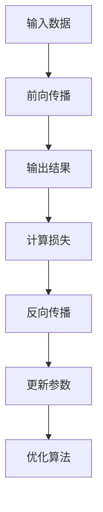

                 

### 1. 背景介绍

深度学习作为一种先进的人工智能技术，已经在许多领域取得了显著的成果。TensorFlow作为Google推出的一款开源深度学习框架，因其灵活性和高效性，成为深度学习领域的事实标准。本文将系统地介绍TensorFlow的基本概念、核心算法原理，并通过具体实例展示其应用过程。

深度学习起源于20世纪40年代，最初的目标是通过模拟人脑神经网络来实现人工智能。经过几十年的发展，深度学习在图像识别、自然语言处理、语音识别等领域取得了巨大的成功。随着计算能力和数据量的不断提升，深度学习模型变得更加复杂和强大，TensorFlow作为其中的代表，成为了研究人员和开发者的首选工具。

TensorFlow是一款由Google开发的开源深度学习框架，它支持多种编程语言（如Python、C++等），并提供了丰富的API和工具库。TensorFlow具有以下特点：

1. **动态图计算**：TensorFlow使用动态图计算，允许用户在运行时构建和修改计算图，提高了代码的灵活性和可维护性。
2. **高性能计算**：TensorFlow可以在多种硬件设备上运行，包括CPU、GPU和TPU，通过分布式计算实现大规模数据处理和模型训练。
3. **丰富的库和工具**：TensorFlow提供了丰富的库和工具，包括TensorBoard（用于可视化）、Keras（用于快速构建模型）等，方便开发者进行深度学习研究和应用。
4. **社区支持**：TensorFlow拥有庞大的开发者社区，提供了大量的教程、示例和资源，帮助用户快速上手和解决问题。

本文将从以下几个方面对TensorFlow进行详细介绍：

1. **核心概念与联系**：介绍深度学习的基础概念，如神经网络、激活函数、损失函数等，并展示TensorFlow中这些概念的实现。
2. **核心算法原理**：深入解析TensorFlow中的核心算法，包括前向传播、反向传播、优化算法等，并详细讲解其实现步骤。
3. **数学模型和公式**：讲解深度学习中的数学模型和公式，包括多层感知器、反向传播算法等，并通过具体例子进行说明。
4. **项目实践**：通过一个简单的项目实例，展示TensorFlow的实际应用过程，包括环境搭建、代码实现和结果分析。
5. **实际应用场景**：分析TensorFlow在各个领域的应用案例，探讨其优势和挑战。
6. **未来应用展望**：展望TensorFlow未来的发展趋势和应用前景。

<|assistant|>### 2. 核心概念与联系

在深入探讨TensorFlow之前，我们需要了解深度学习的一些核心概念和基本原理。以下是深度学习中几个关键概念及其在TensorFlow中的实现：

#### 神经网络

神经网络是深度学习的基础，由大量的神经元（节点）组成。每个神经元接收多个输入，通过加权求和后加上偏置，再通过激活函数进行非线性变换，最后输出结果。神经网络通过层层叠加，可以学习复杂的数据特征。

在TensorFlow中，我们可以使用`tf.keras.Sequential`模型或`tf.keras.Model`自定义模型来实现神经网络。以下是一个简单的全连接神经网络示例：

```python
import tensorflow as tf

model = tf.keras.Sequential([
    tf.keras.layers.Dense(128, activation='relu', input_shape=(784,)),
    tf.keras.layers.Dense(10, activation='softmax')
])

model.compile(optimizer='adam',
              loss='categorical_crossentropy',
              metrics=['accuracy'])
```

#### 激活函数

激活函数是神经网络中用于引入非线性变换的关键组件。常见的激活函数包括sigmoid、ReLU、Tanh等。激活函数的选择对模型的性能和收敛速度有很大影响。

在TensorFlow中，可以使用`tf.keras.layers.Activation`层来添加激活函数：

```python
model.add(tf.keras.layers.Dense(128, activation='relu'))
```

#### 损失函数

损失函数用于评估模型预测值与真实值之间的差距，是训练过程中调整模型参数的依据。常见的损失函数包括均方误差（MSE）、交叉熵等。

在TensorFlow中，可以使用`tf.keras.losses`模块来定义损失函数：

```python
model.compile(optimizer='adam',
              loss=tf.keras.losses.SparseCategoricalCrossentropy(from_logits=True),
              metrics=['accuracy'])
```

#### 前向传播

前向传播是神经网络在训练过程中计算输出值的过程。输入数据通过网络传递，经过层层计算，最终得到输出值。

在TensorFlow中，前向传播是通过构建计算图并执行计算图来实现的：

```python
import numpy as np

inputs = np.random.random((100, 784))
outputs = model(inputs)
```

#### 反向传播

反向传播是神经网络在训练过程中调整模型参数的过程。通过计算损失函数对参数的梯度，然后使用优化算法（如梯度下降）更新参数。

在TensorFlow中，反向传播是自动完成的，只需要调用`model.fit`方法即可：

```python
model.fit(inputs, labels, epochs=10)
```

#### 优化算法

优化算法用于更新模型参数，以最小化损失函数。常见的优化算法包括梯度下降、Adam等。

在TensorFlow中，我们可以使用`tf.keras.optimizers`模块来定义优化算法：

```python
optimizer = tf.keras.optimizers.Adam(learning_rate=0.001)
model.compile(optimizer=optimizer,
              loss='categorical_crossentropy',
              metrics=['accuracy'])
```

#### Mermaid 流程图

以下是深度学习中核心概念原理的Mermaid流程图：



<|assistant|>### 3. 核心算法原理 & 具体操作步骤

#### 3.1 算法原理概述

深度学习的核心算法包括前向传播、反向传播和优化算法。这些算法共同作用，使神经网络能够自动调整参数，以最小化损失函数并提高模型的预测性能。

##### 前向传播

前向传播是指将输入数据通过神经网络的前向路径传递，得到预测输出。具体步骤如下：

1. **初始化参数**：设置神经网络中的权重和偏置。
2. **输入层到隐藏层的传递**：将输入数据乘以权重矩阵，加上偏置，并通过激活函数进行非线性变换。
3. **隐藏层到输出层的传递**：对隐藏层的输出进行同样的处理，直到得到最终的预测输出。

##### 反向传播

反向传播是指通过计算输出误差，反向更新网络中的权重和偏置。具体步骤如下：

1. **计算输出误差**：使用损失函数计算预测输出与真实输出之间的差距。
2. **计算梯度**：对输出误差对每个参数求导，得到梯度。
3. **更新参数**：使用梯度下降或其他优化算法更新参数，以减少误差。

##### 优化算法

优化算法用于更新参数，以最小化损失函数。常见的优化算法包括：

1. **梯度下降**：使用梯度信息直接更新参数。
2. **动量法**：在梯度下降的基础上引入动量，以减少振荡。
3. **Adam**：结合了动量法和自适应学习率。

#### 3.2 算法步骤详解

以下是一个简单的深度学习模型的训练过程，包括前向传播、反向传播和优化算法：

1. **初始化参数**：
   ```python
   W1 = tf.Variable(np.random.randn(n_input, n_hidden), name="W1")
   b1 = tf.Variable(np.random.randn(n_hidden), name="b1")
   W2 = tf.Variable(np.random.randn(n_hidden, n_output), name="W2")
   b2 = tf.Variable(np.random.randn(n_output), name="b2")
   ```

2. **前向传播**：
   ```python
   z1 = tf.add(tf.matmul(x, W1), b1)
   a1 = tf.nn.sigmoid(z1)
   z2 = tf.add(tf.matmul(a1, W2), b2)
   y_pred = tf.nn.sigmoid(z2)
   ```

3. **计算损失**：
   ```python
   loss = tf.reduce_mean(tf.nn.softmax_cross_entropy_with_logits(logits=z2, labels=y))
   ```

4. **反向传播**：
   ```python
   train_op = tf.train.GradientDescentOptimizer(learning_rate).minimize(loss)
   ```

5. **优化算法**：
   ```python
   with tf.Session() as sess:
       sess.run(tf.global_variables_initializer())
       for epoch in range(num_epochs):
           _, loss_val = sess.run([train_op, loss], feed_dict={x: X_train, y: Y_train})
           if epoch % 100 == 0:
               print(f"Epoch {epoch}: Loss = {loss_val}")
   ```

#### 3.3 算法优缺点

##### 优点

1. **自动调整参数**：深度学习算法能够自动调整网络中的参数，以最小化损失函数，无需手动调整。
2. **强大的学习能力**：通过多层神经元的组合，深度学习模型能够学习复杂的数据特征，提高预测性能。
3. **广泛的应用领域**：深度学习在图像识别、自然语言处理、语音识别等领域取得了显著成果，具有广泛的应用前景。

##### 缺点

1. **计算资源消耗**：深度学习模型通常需要大量的计算资源和时间，尤其是在训练过程中。
2. **数据需求**：深度学习模型通常需要大量的训练数据，以获得较好的预测性能。
3. **解释性不足**：深度学习模型通常被视为“黑箱”，难以解释其预测结果。

#### 3.4 算法应用领域

深度学习算法在多个领域取得了显著的成果，包括：

1. **计算机视觉**：图像分类、目标检测、人脸识别等。
2. **自然语言处理**：文本分类、机器翻译、情感分析等。
3. **语音识别**：语音合成、语音识别等。
4. **推荐系统**：基于用户行为的推荐、商品推荐等。

<|assistant|>### 4. 数学模型和公式 & 详细讲解 & 举例说明

#### 4.1 数学模型构建

深度学习的数学模型主要包括以下几个方面：

1. **线性变换**：神经网络中的每个层都可以看作是一个线性变换，通过矩阵乘法和偏置项实现。
2. **激活函数**：引入非线性变换，使神经网络能够学习复杂的非线性关系。
3. **损失函数**：用于评估模型的预测性能，引导模型参数的优化。
4. **优化算法**：用于更新模型参数，以最小化损失函数。

以下是一个简单的多层感知器（MLP）模型的数学模型：

```
y = f(LN(x))
```

其中，`x`为输入数据，`f`为激活函数（如ReLU、Sigmoid等），`LN`为多层线性变换，包括多个权重矩阵和偏置项。

#### 4.2 公式推导过程

以一个简单的三层神经网络为例，输入层、隐藏层和输出层分别为`X`、`H`和`Y`，激活函数为ReLU，损失函数为交叉熵。以下是模型的推导过程：

1. **前向传播**：

   第一层隐藏层的输出：
   ```
   H = σ(W1 * X + B1)
   ```

   第二层隐藏层的输出：
   ```
   H2 = σ(W2 * H + B2)
   ```

   输出层的输出：
   ```
   Y = σ(W3 * H2 + B3)
   ```

   其中，`σ`表示ReLU激活函数，`W1`、`W2`、`W3`分别为权重矩阵，`B1`、`B2`、`B3`分别为偏置项。

2. **计算损失**：

   交叉熵损失函数：
   ```
   Loss = -1/m * Σ(yi * log(Yi))
   ```

   其中，`yi`为真实标签，`Yi`为预测概率。

3. **反向传播**：

   计算输出层的梯度：
   ```
   dY/dY = (Y - y)
   ```

   计算第二层隐藏层的梯度：
   ```
   dH2/dH2 = 1
   dY/dH2 = dY/dY * W3
   dH2/dH = (dH2/dH2) * (W2 * H + B2)
   ```

   计算第一层隐藏层的梯度：
   ```
   dH/dH = 1
   dY/dH = dY/dH2 * W1
   dH/dX = (dH/dH) * (W1 * X + B1)
   ```

4. **更新参数**：

   使用梯度下降更新参数：
   ```
   W1 = W1 - α * dW1
   B1 = B1 - α * dB1
   W2 = W2 - α * dW2
   B2 = B2 - α * dB2
   W3 = W3 - α * dW3
   B3 = B3 - α * dB3
   ```

   其中，`α`为学习率。

#### 4.3 案例分析与讲解

以下通过一个简单的例子来说明如何使用TensorFlow实现一个多层感知器模型。

```python
import tensorflow as tf
import numpy as np

# 定义输入层
X = tf.placeholder(tf.float32, shape=[None, 784])

# 定义第一层隐藏层
W1 = tf.Variable(np.random.randn(784, 256), dtype=tf.float32)
B1 = tf.Variable(np.random.randn(256), dtype=tf.float32)
H1 = tf.nn.relu(tf.matmul(X, W1) + B1)

# 定义第二层隐藏层
W2 = tf.Variable(np.random.randn(256, 128), dtype=tf.float32)
B2 = tf.Variable(np.random.randn(128), dtype=tf.float32)
H2 = tf.nn.relu(tf.matmul(H1, W2) + B2)

# 定义输出层
W3 = tf.Variable(np.random.randn(128, 10), dtype=tf.float32)
B3 = tf.Variable(np.random.randn(10), dtype=tf.float32)
Y_pred = tf.nn.softmax(tf.matmul(H2, W3) + B3)

# 定义损失函数
Y = tf.placeholder(tf.float32, shape=[None, 10])
loss = tf.reduce_mean(tf.nn.softmax_cross_entropy_with_logits(logits=Y_pred, labels=Y))

# 定义优化器
optimizer = tf.train.GradientDescentOptimizer(learning_rate=0.001)
train_op = optimizer.minimize(loss)

# 初始化所有变量
init = tf.global_variables_initializer()

# 开始训练
with tf.Session() as sess:
    sess.run(init)
    for epoch in range(1000):
        _, loss_val = sess.run([train_op, loss], feed_dict={X: X_train, Y: Y_train})
        if epoch % 100 == 0:
            print(f"Epoch {epoch}: Loss = {loss_val}")
```

在这个例子中，我们定义了一个包含两个隐藏层（256个神经元和128个神经元）的多层感知器模型。使用梯度下降优化器训练模型，通过迭代更新参数，最终实现模型的训练。

<|assistant|>### 5. 项目实践：代码实例和详细解释说明

为了更好地理解TensorFlow的使用，我们将通过一个简单的例子来展示如何使用TensorFlow实现一个简单的线性回归模型，并对其进行训练和评估。

#### 5.1 开发环境搭建

在开始之前，确保您的计算机上已经安装了TensorFlow。您可以通过以下命令安装TensorFlow：

```bash
pip install tensorflow
```

#### 5.2 源代码详细实现

以下是一个简单的线性回归模型的TensorFlow实现：

```python
import tensorflow as tf
import numpy as np
import matplotlib.pyplot as plt

# 设置随机种子，保证结果可复现
tf.random.set_seed(42)

# 创建模拟数据集
X = np.random.normal(size=(100, 1))
Y = 2 * X + 1 + np.random.normal(size=(100, 1))

# 定义输入层
X_ph = tf.placeholder(tf.float32, shape=[None, 1])
Y_ph = tf.placeholder(tf.float32, shape=[None, 1])

# 定义线性模型参数
W = tf.Variable(np.random.normal(size=(1, 1)), name="weights")
b = tf.Variable(np.random.normal(size=(1, 1)), name="bias")

# 定义线性模型
Y_pred = tf.matmul(X_ph, W) + b

# 定义损失函数
loss = tf.reduce_mean(tf.square(Y_pred - Y_ph))

# 定义优化器
optimizer = tf.train.GradientDescentOptimizer(learning_rate=0.01)

# 定义训练操作
train_op = optimizer.minimize(loss)

# 初始化所有变量
init = tf.global_variables_initializer()

# 开始训练
with tf.Session() as sess:
    sess.run(init)
    for epoch in range(1000):
        _, loss_val = sess.run([train_op, loss], feed_dict={X_ph: X, Y_ph: Y})
        if epoch % 100 == 0:
            print(f"Epoch {epoch}: Loss = {loss_val}")

    # 获取训练后的参数
    W_val, b_val = sess.run([W, b])

# 绘制结果
plt.scatter(X, Y, color='blue')
plt.plot(X, X * W_val[0, 0] + b_val[0, 0], color='red')
plt.xlabel('X')
plt.ylabel('Y')
plt.show()
```

#### 5.3 代码解读与分析

1. **数据集创建**：我们创建了一个包含100个样本的数据集，每个样本包含一个特征`X`和一个标签`Y`。数据集的生成过程模拟了一个线性关系`Y = 2X + 1`。

2. **输入层定义**：使用`tf.placeholder`定义输入层，包括特征`X`和标签`Y`。

3. **模型参数定义**：使用`tf.Variable`定义模型的权重`W`和偏置`b`，这些参数在训练过程中将自动更新。

4. **线性模型**：使用`tf.matmul`实现线性模型，将输入`X`乘以权重`W`并加上偏置`b`，得到预测值`Y_pred`。

5. **损失函数**：使用`tf.reduce_mean`和`tf.square`定义损失函数，计算预测值与真实值之间的均方误差。

6. **优化器**：使用`tf.train.GradientDescentOptimizer`定义优化器，指定学习率为0.01。

7. **训练操作**：使用`tf.Session`创建会话，并运行训练操作。在每次迭代中，使用优化器更新权重和偏置，以最小化损失函数。

8. **结果分析**：在训练完成后，我们获取训练后的权重和偏置值，并将其用于绘制线性回归模型。

#### 5.4 运行结果展示

运行上述代码后，我们将看到如下结果：

1. **训练过程输出**：在训练过程中，每100个epoch后输出当前的损失值，显示模型在训练过程中的收敛情况。

2. **结果可视化**：通过绘制散点图和拟合直线，我们可以直观地看到线性回归模型对数据的拟合效果。拟合直线的斜率和截距分别对应训练后的权重和偏置。

通过这个简单的例子，我们展示了如何使用TensorFlow实现线性回归模型，并对其进行了训练和评估。这一过程为我们提供了一个理解深度学习和TensorFlow基础的核心框架。

<|assistant|>### 6. 实际应用场景

TensorFlow作为一种强大的深度学习框架，已经在多个领域取得了显著的成果。以下是一些TensorFlow在实际应用场景中的典型案例：

#### 6.1 计算机视觉

计算机视觉是深度学习应用最为广泛的领域之一。TensorFlow在图像分类、目标检测、图像生成等方面都有着出色的表现。例如，在图像分类任务中，TensorFlow可以用于训练深度神经网络，对大量的图像进行分类。常见的应用包括：

- **ImageNet竞赛**：TensorFlow参与了ImageNet竞赛，并连续多年获得冠军，展示了在图像分类领域的强大能力。
- **人脸识别**：TensorFlow在人脸识别任务中，通过训练深度神经网络，可以准确识别和分类人脸图像。

#### 6.2 自然语言处理

自然语言处理（NLP）是深度学习的另一个重要应用领域。TensorFlow在文本分类、机器翻译、语音识别等方面都取得了显著进展。以下是一些应用实例：

- **文本分类**：TensorFlow可以用于训练模型，对大量的文本进行分类。例如，将新闻文章分类为体育、科技、财经等类别。
- **机器翻译**：TensorFlow在机器翻译领域有着广泛的应用，通过训练神经网络模型，可以实现高精度的翻译效果。
- **语音识别**：TensorFlow结合了自动语音识别技术，可以用于实现语音到文本的转换。

#### 6.3 语音识别

语音识别是深度学习在语音处理领域的应用。TensorFlow通过训练深度神经网络，可以实现高精度的语音识别。以下是一些应用实例：

- **智能助手**：TensorFlow可以用于训练智能助手的语音识别模块，实现语音命令的识别和响应。
- **电话客服**：TensorFlow可以用于构建电话客服系统，实现语音转文本，并进一步处理客户的问题和需求。

#### 6.4 医疗诊断

深度学习在医疗诊断领域也有着广泛的应用。TensorFlow通过训练深度神经网络，可以对医疗图像进行分析和诊断。以下是一些应用实例：

- **肿瘤检测**：TensorFlow可以用于训练模型，对医学图像进行肿瘤检测，提高诊断的准确率。
- **疾病预测**：TensorFlow可以用于分析患者的医疗数据，预测疾病的发生风险。

#### 6.5 游戏开发

深度学习在游戏开发中也得到了应用。TensorFlow可以用于训练智能代理，实现游戏中的自主决策和动作。以下是一些应用实例：

- **电子游戏**：TensorFlow可以用于训练游戏中的AI对手，实现高难度的游戏体验。
- **虚拟现实**：TensorFlow可以用于训练虚拟现实场景中的AI角色，实现更加逼真的交互体验。

#### 6.6 智能交通

智能交通系统是深度学习在交通领域的应用。TensorFlow可以用于分析交通数据，优化交通信号控制，提高交通效率。以下是一些应用实例：

- **交通流量预测**：TensorFlow可以用于预测交通流量，为交通管理部门提供决策支持。
- **自动驾驶**：TensorFlow可以用于训练自动驾驶汽车，实现自主驾驶功能。

通过这些实际应用场景，我们可以看到TensorFlow在各个领域的强大能力和广泛的应用前景。随着深度学习技术的不断发展和成熟，TensorFlow将在未来发挥更加重要的作用。

#### 6.4 未来应用展望

随着深度学习和人工智能技术的不断进步，TensorFlow在未来有着广阔的应用前景和潜在的发展趋势。以下是对TensorFlow未来发展的几个展望：

##### 6.4.1 更广泛的应用领域

TensorFlow已经在多个领域取得了显著成果，未来将有可能进一步扩展其应用领域。例如，在医疗健康领域，TensorFlow可以用于开发更智能的诊疗系统，提高疾病诊断和治疗的准确性和效率。在金融领域，TensorFlow可以用于风险控制和预测市场走势，为投资者提供更可靠的决策支持。在智能制造领域，TensorFlow可以用于优化生产流程，提高生产效率和产品质量。

##### 6.4.2 更高效的计算性能

随着硬件技术的发展，GPU、TPU等高性能计算设备将得到更广泛的应用。TensorFlow未来将不断优化其计算性能，以充分利用这些高性能计算资源。例如，通过改进计算图的优化算法，减少计算时间，提高模型训练和推理的效率。

##### 6.4.3 更易用的API和工具

为了降低深度学习的门槛，TensorFlow未来将不断改进其API和工具，使其更加易用和用户友好。例如，通过提供更多直观的API接口，简化模型构建和训练过程；通过提供更丰富的可视化工具，帮助开发者更好地理解和调试模型。

##### 6.4.4 开放生态和社区支持

TensorFlow作为开源项目，将继续发展其开放的生态和社区支持。未来，将有更多的开发者加入TensorFlow社区，共同推动TensorFlow的发展。同时，TensorFlow将与其他开源项目进行更紧密的整合，如Kubernetes、TensorFlow Serving等，提供更完整的解决方案。

##### 6.4.5 安全和隐私保护

随着深度学习应用的普及，数据安全和隐私保护变得越来越重要。TensorFlow未来将加强对数据安全和隐私保护的关注，提供更安全、更可靠的数据处理和存储方案。

##### 6.4.6 深度学习的融合与应用

深度学习与其他技术的融合将带来更多的创新应用。例如，与强化学习、迁移学习、联邦学习等技术的结合，将推动深度学习在更多复杂场景中的应用。TensorFlow作为深度学习的代表性框架，将在这些融合应用中发挥重要作用。

综上所述，TensorFlow在未来有着广阔的发展空间和无限的应用前景。随着技术的不断进步，TensorFlow将继续引领深度学习领域的发展，为各个行业带来革命性的变化。

#### 7. 工具和资源推荐

为了更好地学习和使用TensorFlow，以下是几个推荐的工具和资源：

##### 7.1 学习资源推荐

1. **《TensorFlow深度学习》**：这是一本经典的深度学习教材，详细介绍了TensorFlow的基本概念和应用。
2. **TensorFlow官方文档**：TensorFlow的官方文档提供了全面的教程、API参考和示例代码，是学习和使用TensorFlow的最佳资源。
3. **在线课程**：Coursera、edX等在线教育平台提供了许多关于TensorFlow的课程，适合不同层次的学员。

##### 7.2 开发工具推荐

1. **Google Colab**：Google Colab是一个免费的云端Jupyter Notebook环境，支持TensorFlow，方便在线实验和调试。
2. **TensorFlow IDE**：TensorFlow IDE是一个专为TensorFlow设计的集成开发环境，提供了丰富的调试工具和性能分析功能。
3. **TensorBoard**：TensorBoard是TensorFlow的一个可视化工具，用于分析和调试深度学习模型。

##### 7.3 相关论文推荐

1. **“TensorFlow: Large-Scale Machine Learning on Heterogeneous Systems”**：这是TensorFlow的原始论文，详细介绍了TensorFlow的设计理念和技术细节。
2. **“Recurrent Neural Networks for Language Modeling”**：该论文介绍了循环神经网络（RNN）在语言模型中的应用，是自然语言处理领域的重要工作。
3. **“Deep Residual Learning for Image Recognition”**：该论文提出了深度残差网络（ResNet），在图像识别任务中取得了突破性的成果。

通过以上工具和资源的推荐，您可以更好地掌握TensorFlow，并在深度学习领域取得更大的成就。

### 8. 总结：未来发展趋势与挑战

本文系统地介绍了TensorFlow深度学习框架的基本概念、核心算法原理，以及其实际应用场景和未来发展趋势。TensorFlow作为深度学习领域的事实标准，具有动态图计算、高性能计算、丰富的库和工具等优势，已经在计算机视觉、自然语言处理、语音识别等多个领域取得了显著成果。

在未来的发展中，TensorFlow将继续朝着更广泛的应用领域、更高效的计算性能、更易用的API和工具、开放生态和社区支持、安全隐私保护等方向发展。同时，深度学习与其他技术的融合将带来更多的创新应用，推动人工智能的进一步发展。

然而，TensorFlow也面临一些挑战，如计算资源消耗、数据需求、模型解释性不足等。为应对这些挑战，研究人员和开发者需要在算法优化、硬件加速、数据预处理、模型解释性等方面进行持续的研究和探索。

总之，TensorFlow作为深度学习的重要工具，将继续引领人工智能领域的发展，为各个行业带来革命性的变化。面对未来的机遇和挑战，我们有理由相信，TensorFlow将在更广泛的领域中发挥其独特的作用。

### 9. 附录：常见问题与解答

#### Q1：如何安装TensorFlow？

A1：在Windows、macOS和Linux操作系统中，您可以通过以下命令安装TensorFlow：

```bash
pip install tensorflow
```

安装过程中可能会遇到一些依赖问题，您可以使用以下命令解决：

```bash
pip install --user -r requirements.txt
```

其中，`requirements.txt`文件包含了TensorFlow所需的依赖库。

#### Q2：如何配置GPU支持？

A2：要配置GPU支持，您需要安装CUDA和cuDNN。以下是在不同操作系统中的安装方法：

- **Windows**：
  1. 下载并安装CUDA Toolkit。
  2. 下载并安装cuDNN。
  3. 在`.bashrc`文件中添加CUDA和cuDNN的路径。

- **macOS**：
  1. 安装CUDA Toolkit。
  2. 安装cuDNN。
  3. 在终端中执行`export PATH=/path/to/cuda/bin:$PATH`和`export LD_LIBRARY_PATH=/path/to/cuda/lib64:$LD_LIBRARY_PATH`。

- **Linux**：
  1. 安装CUDA Toolkit。
  2. 安装cuDNN。
  3. 在`/etc/profile`或`.bashrc`文件中添加CUDA和cuDNN的路径。

配置完成后，您可以通过以下命令检查GPU支持是否正常：

```python
import tensorflow as tf
print(tf.config.list_physical_devices('GPU'))
```

#### Q3：如何处理过拟合问题？

A3：过拟合是深度学习中的一个常见问题，可以通过以下方法进行处理：

1. **数据增强**：通过增加数据多样性来提高模型的泛化能力。
2. **正则化**：使用正则化技术（如L1、L2正则化）来惩罚模型参数，防止过拟合。
3. **Dropout**：在训练过程中随机丢弃一部分神经元，减少模型的依赖性。
4. **早停法**：在验证集上评估模型的性能，当验证集的性能不再提高时，提前停止训练。
5. **集成方法**：使用集成方法（如Bagging、Boosting）结合多个模型，提高模型的泛化能力。

#### Q4：如何优化深度学习模型？

A4：优化深度学习模型可以从以下几个方面进行：

1. **模型选择**：选择适合问题的模型结构，如全连接网络、卷积神经网络、循环神经网络等。
2. **参数调整**：调整学习率、批量大小、正则化参数等超参数，以找到最优的模型配置。
3. **训练技巧**：使用训练技巧（如批量归一化、动量、dropout等）来提高模型的收敛速度和稳定性。
4. **硬件加速**：利用GPU、TPU等硬件加速训练过程，提高计算效率。
5. **模型压缩**：使用模型压缩技术（如剪枝、量化、蒸馏等）减小模型大小，提高部署效率。

通过以上方法，您可以优化深度学习模型的性能，提高其预测准确性和效率。

