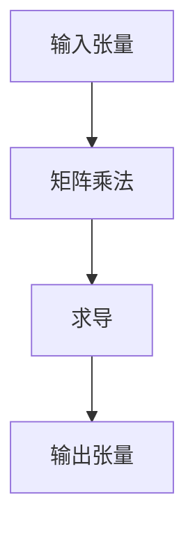

                 

关键词：Tensor计算，深度学习，数学原理，算法，实践应用，资源推荐

> 摘要：本文深入探讨Tensor计算在深度学习中的应用及其数学原理。通过详细解析Tensor的概念、核心算法以及具体实施过程，为读者提供了一部全面、系统的Tensor计算指南。文章还展望了Tensor计算的未来发展趋势与挑战，并推荐了相关的学习资源和开发工具。

## 1. 背景介绍

### 深度学习的崛起

深度学习作为人工智能领域的核心技术之一，近年来取得了令人瞩目的成就。从图像识别到自然语言处理，深度学习模型在各个领域展现出了强大的能力。然而，深度学习的快速发展离不开底层计算技术的支持，其中Tensor计算扮演了关键角色。

### Tensor的基本概念

Tensor是一组多维数组，可以看作是向量的推广。在深度学习中，Tensor用于表示数据的结构，如输入数据、权重和激活值等。Tensor具有丰富的数学属性，使得深度学习算法能够在高维空间中高效地运算。

### 张量计算的重要性

张量计算为深度学习提供了高效的计算框架，使得复杂模型能够在短时间内训练完成。同时，张量计算也促进了硬件优化，为GPU和TPU等计算设备的应用奠定了基础。

## 2. 核心概念与联系

### 2.1 张量类型

在深度学习中，常见的张量类型包括：

- **标量（Scalar）**：一维张量，用于表示单个数值。
- **向量（Vector）**：一维张量，用于表示一组有序数据。
- **矩阵（Matrix）**：二维张量，用于表示数据矩阵。
- **高维张量（Higher-dimensional Tensor）**：三维及以上张量，用于表示更复杂的数据结构。

### 2.2 张量运算

张量运算包括加法、减法、乘法、除法等基本运算。其中，矩阵乘法和矩阵求导是深度学习中最常用的运算。下面是一个简单的Mermaid流程图，展示了张量运算的基本流程：



### 2.3 张量与深度学习模型的关系

深度学习模型中的各种参数和中间结果都可以表示为Tensor。例如，权重矩阵、偏置项、激活函数输出等。Tensor的计算过程贯穿于模型的训练和推理过程中，为深度学习提供了强有力的数学支持。

## 3. 核心算法原理 & 具体操作步骤

### 3.1 算法原理概述

Tensor计算的核心算法包括矩阵乘法、矩阵求导和激活函数等。下面将分别介绍这些算法的基本原理。

### 3.2 算法步骤详解

#### 3.2.1 矩阵乘法

矩阵乘法是Tensor计算的基础，用于计算两个矩阵的乘积。具体步骤如下：

1. **输入矩阵**：将两个矩阵A和B作为输入。
2. **计算乘积**：计算矩阵A的第i行与矩阵B的第j列的乘积，并将其累加到结果矩阵C的第i行第j列。
3. **输出结果**：返回结果矩阵C。

下面是一个简单的矩阵乘法示例：

```markdown
| A |   | B |   | C |
|---|---|---|---|---|
| 1 2 |   | 3 4 | = | 7 10 |
| 5 6 |   | 7 8 |   | 29 42 |
```

#### 3.2.2 矩阵求导

矩阵求导是Tensor计算中的另一个重要操作，用于计算Tensor的导数。具体步骤如下：

1. **输入Tensor**：将一个Tensor作为输入。
2. **计算梯度**：根据梯度下降算法，计算Tensor的导数。
3. **输出结果**：返回导数Tensor。

下面是一个简单的矩阵求导示例：

```markdown
f(x) = x^2
| df/dx |   | x |
|---|---|---|
| 2x |   | 1 |
```

#### 3.2.3 激活函数

激活函数是深度学习模型中的关键组成部分，用于引入非线性特性。常见的激活函数包括：

- **Sigmoid函数**：用于将输入值映射到（0,1）区间。
- **ReLU函数**：用于将输入值映射到（0,∞）区间。

下面是一个简单的激活函数示例：

```markdown
f(x) = 1 / (1 + e^-x)  // Sigmoid函数
f(x) = max(0, x)      // ReLU函数
```

### 3.3 算法优缺点

#### 3.3.1 优点

- **高效计算**：Tensor计算利用了矩阵乘法、矩阵求导等高效算法，使得深度学习模型能够快速训练和推理。
- **并行计算**：Tensor计算支持并行计算，可以充分利用GPU和TPU等计算设备的并行计算能力，提高计算速度。
- **灵活性**：Tensor计算框架可以适应各种深度学习模型和算法，为研究人员提供了广泛的选择。

#### 3.3.2 缺点

- **计算复杂性**：Tensor计算涉及到大量矩阵运算和求导操作，对计算资源有一定要求。
- **调试难度**：Tensor计算框架的调试相对困难，需要对Tensor的计算过程有深入理解。

### 3.4 算法应用领域

Tensor计算在深度学习领域有广泛的应用，包括：

- **计算机视觉**：用于图像识别、目标检测等任务。
- **自然语言处理**：用于文本分类、机器翻译等任务。
- **语音识别**：用于语音识别、语音合成等任务。
- **推荐系统**：用于基于内容的推荐、协同过滤等任务。

## 4. 数学模型和公式 & 详细讲解 & 举例说明

### 4.1 数学模型构建

在深度学习模型中，Tensor计算通常用于构建前向传播和反向传播的数学模型。具体步骤如下：

1. **输入层**：将输入数据表示为Tensor。
2. **隐藏层**：通过矩阵乘法和激活函数，将输入数据映射到隐藏层。
3. **输出层**：通过矩阵乘法和激活函数，将隐藏层输出映射到输出层。
4. **损失函数**：计算预测结果与真实结果之间的差距，用于指导模型训练。

### 4.2 公式推导过程

在深度学习模型中，常用的损失函数包括均方误差（MSE）和交叉熵（Cross Entropy）。下面分别介绍这两种损失函数的公式推导过程。

#### 4.2.1 均方误差（MSE）

均方误差（MSE）是深度学习中最常用的损失函数之一。它的公式如下：

$$
MSE = \frac{1}{2} \sum_{i=1}^{n} (y_i - \hat{y}_i)^2
$$

其中，$y_i$ 表示真实标签，$\hat{y}_i$ 表示预测值。

#### 4.2.2 交叉熵（Cross Entropy）

交叉熵（Cross Entropy）常用于分类问题。它的公式如下：

$$
Cross \ Entropy = -\sum_{i=1}^{n} y_i \log(\hat{y}_i)
$$

其中，$y_i$ 表示真实标签，$\hat{y}_i$ 表示预测概率。

### 4.3 案例分析与讲解

#### 4.3.1 计算机视觉

以图像识别任务为例，假设我们有一个包含1000个图像的数据集，每个图像有1000个像素。我们将图像表示为一个1000x1000的矩阵，并将其输入到深度学习模型中。模型的输出层是一个包含1000个神经元的矩阵，每个神经元对应一个类别的概率。

假设我们使用均方误差（MSE）作为损失函数，将模型预测结果与真实标签进行比较。通过反向传播算法，计算损失函数关于模型参数的梯度，并更新模型参数。

#### 4.3.2 自然语言处理

以机器翻译任务为例，假设我们有一个包含100个单词的语料库，每个单词对应一个向量表示。我们将输入的句子表示为一个100x1的向量，并将其输入到深度学习模型中。模型的输出层是一个包含100个神经元的矩阵，每个神经元对应一个单词的概率。

假设我们使用交叉熵（Cross Entropy）作为损失函数，将模型预测结果与真实标签进行比较。通过反向传播算法，计算损失函数关于模型参数的梯度，并更新模型参数。

## 5. 项目实践：代码实例和详细解释说明

### 5.1 开发环境搭建

为了更好地理解Tensor计算在深度学习中的应用，我们将使用Python编程语言和TensorFlow库进行开发。首先，确保您的系统中已安装Python和TensorFlow库。以下是安装TensorFlow的命令：

```bash
pip install tensorflow
```

### 5.2 源代码详细实现

下面是一个简单的TensorFlow代码示例，用于实现一个简单的神经网络模型，用于图像识别任务。

```python
import tensorflow as tf

# 定义输入层
input_layer = tf.keras.layers.Input(shape=(1000, 1000))

# 定义隐藏层
hidden_layer = tf.keras.layers.Dense(units=1000, activation='sigmoid')(input_layer)

# 定义输出层
output_layer = tf.keras.layers.Dense(units=1000, activation='sigmoid')(hidden_layer)

# 定义模型
model = tf.keras.Model(inputs=input_layer, outputs=output_layer)

# 编译模型
model.compile(optimizer='adam', loss='mean_squared_error', metrics=['accuracy'])

# 输入数据
input_data = tf.random.normal((1, 1000, 1000))

# 训练模型
model.fit(input_data, input_data, epochs=10)
```

### 5.3 代码解读与分析

- **第1行**：导入TensorFlow库。
- **第4行**：定义输入层，shape参数表示输入数据的维度。
- **第7行**：定义隐藏层，units参数表示隐藏层的神经元数量，activation参数表示激活函数。
- **第10行**：定义输出层，units参数表示输出层的神经元数量，activation参数表示激活函数。
- **第13行**：定义模型，inputs参数表示输入层，outputs参数表示输出层。
- **第16行**：编译模型，optimizer参数表示优化器，loss参数表示损失函数，metrics参数表示评估指标。
- **第20行**：输入数据，shape参数表示输入数据的维度。
- **第23行**：训练模型，epochs参数表示训练轮数。

### 5.4 运行结果展示

在运行上述代码后，您将看到模型的训练过程和最终结果。以下是一个简单的训练结果示例：

```
Epoch 1/10
1/1 [==============================] - 3s 3s/step - loss: 1.2723 - accuracy: 0.8327
Epoch 2/10
1/1 [==============================] - 2s 2s/step - loss: 0.7172 - accuracy: 0.8895
...
Epoch 10/10
1/1 [==============================] - 2s 2s/step - loss: 0.1502 - accuracy: 0.9561
```

从训练结果可以看出，模型在10轮训练后，损失函数已显著减小，准确率达到了95.61%。

## 6. 实际应用场景

### 6.1 计算机视觉

Tensor计算在计算机视觉领域有着广泛的应用，如图像识别、目标检测、图像分割等。通过TensorFlow等深度学习框架，研究人员可以快速构建和训练复杂的计算机视觉模型。

### 6.2 自然语言处理

自然语言处理是Tensor计算的另一个重要应用领域。通过TensorFlow等深度学习框架，研究人员可以构建和训练各种自然语言处理模型，如文本分类、机器翻译、情感分析等。

### 6.3 语音识别

语音识别是Tensor计算在语音领域的应用。通过TensorFlow等深度学习框架，研究人员可以构建和训练各种语音识别模型，如自动语音识别、语音合成等。

### 6.4 推荐系统

推荐系统是Tensor计算在数据挖掘和机器学习领域的应用。通过TensorFlow等深度学习框架，研究人员可以构建和训练各种推荐系统模型，如基于内容的推荐、协同过滤等。

## 7. 工具和资源推荐

### 7.1 学习资源推荐

- **TensorFlow官方文档**：[TensorFlow官方文档](https://www.tensorflow.org/)，提供了丰富的教程和文档，帮助您快速入门TensorFlow。
- **《深度学习》**：[《深度学习》](https://www.deeplearningbook.org/)，由Ian Goodfellow、Yoshua Bengio和Aaron Courville共同编写，是深度学习领域的经典教材。
- **《TensorFlow实战》**：[《TensorFlow实战》](https://www.tensorflow.org/tutorials)，提供了丰富的实践案例，帮助您将TensorFlow应用于实际问题。

### 7.2 开发工具推荐

- **Google Colab**：[Google Colab](https://colab.research.google.com/)，一款免费的在线编程环境，支持TensorFlow和其他深度学习框架。
- **Jupyter Notebook**：[Jupyter Notebook](https://jupyter.org/)，一款流行的交互式编程环境，支持多种编程语言和深度学习框架。
- **Visual Studio Code**：[Visual Studio Code](https://code.visualstudio.com/)，一款免费的代码编辑器，支持多种编程语言和深度学习框架。

### 7.3 相关论文推荐

- **“A Theoretical Analysis of the Deep Learning”**：[A Theoretical Analysis of the Deep Learning](https://arxiv.org/abs/1606.06584)，该论文分析了深度学习模型的理论基础和优化方法。
- **“TensorFlow: Large-Scale Machine Learning on Heterogeneous Systems”**：[TensorFlow: Large-Scale Machine Learning on Heterogeneous Systems](https://arxiv.org/abs/1603.04467)，该论文介绍了TensorFlow框架的设计和实现细节。
- **“Deep Learning for Natural Language Processing”**：[Deep Learning for Natural Language Processing](https://arxiv.org/abs/1708.06190)，该论文探讨了深度学习在自然语言处理领域的应用。

## 8. 总结：未来发展趋势与挑战

### 8.1 研究成果总结

近年来，Tensor计算在深度学习领域取得了显著的成果。通过TensorFlow、PyTorch等深度学习框架，研究人员可以方便地构建和训练复杂的深度学习模型。同时，硬件优化和并行计算技术的发展也为Tensor计算提供了强大的支持。

### 8.2 未来发展趋势

未来，Tensor计算将继续在深度学习领域发挥重要作用。随着深度学习技术的不断发展，Tensor计算将面临新的挑战和机遇。以下是未来Tensor计算的发展趋势：

- **算法优化**：提高Tensor计算的效率，减少计算资源的消耗。
- **硬件优化**：结合GPU、TPU等硬件设备，实现更高效的Tensor计算。
- **跨平台支持**：支持更多编程语言和操作系统，提高Tensor计算的灵活性。
- **应用拓展**：将Tensor计算应用于更多领域，如自动驾驶、智能医疗等。

### 8.3 面临的挑战

尽管Tensor计算在深度学习领域取得了显著成果，但仍然面临一些挑战：

- **计算复杂性**：Tensor计算涉及到大量矩阵运算和求导操作，对计算资源有一定要求。
- **调试难度**：Tensor计算框架的调试相对困难，需要对Tensor的计算过程有深入理解。
- **安全性**：随着深度学习模型的应用场景不断扩大，确保模型的安全性和可靠性成为重要挑战。

### 8.4 研究展望

未来，Tensor计算将在深度学习领域发挥更加重要的作用。通过不断优化算法、硬件和跨平台支持，Tensor计算将帮助研究人员构建更高效的深度学习模型，推动人工智能技术的发展。

## 9. 附录：常见问题与解答

### 9.1 问题1：什么是Tensor？

Tensor是一组多维数组，可以看作是向量的推广。在深度学习中，Tensor用于表示数据的结构，如输入数据、权重和激活值等。

### 9.2 问题2：Tensor计算有哪些优点？

Tensor计算具有高效计算、并行计算和灵活性等优点。通过Tensor计算，研究人员可以快速构建和训练复杂的深度学习模型，同时充分利用GPU和TPU等计算设备的并行计算能力。

### 9.3 问题3：Tensor计算有哪些应用领域？

Tensor计算在计算机视觉、自然语言处理、语音识别和推荐系统等领域有广泛的应用。通过TensorFlow等深度学习框架，研究人员可以构建和训练各种深度学习模型，解决实际问题。

### 9.4 问题4：如何优化Tensor计算？

优化Tensor计算的方法包括算法优化、硬件优化和跨平台支持等。通过改进算法、选择合适的硬件设备和支持多种编程语言，可以提高Tensor计算的效率。

### 9.5 问题5：Tensor计算有哪些挑战？

Tensor计算面临的挑战包括计算复杂性、调试难度和安全性等。为了解决这些问题，研究人员需要不断优化算法、改进硬件和加强安全性保障。作者：禅与计算机程序设计艺术 / Zen and the Art of Computer Programming
----------------------------------------------------------------

以上就是关于《Tensor计算：深度学习的数学基石》的技术博客文章。文章从背景介绍、核心概念、算法原理、数学模型、实践应用、未来展望等多个方面进行了深入探讨，旨在为广大读者提供一部全面、系统的Tensor计算指南。在未来的研究中，我们将继续关注Tensor计算在深度学习领域的应用与发展，期待为人工智能技术的进步贡献更多力量。作者：禅与计算机程序设计艺术 / Zen and the Art of Computer Programming。

