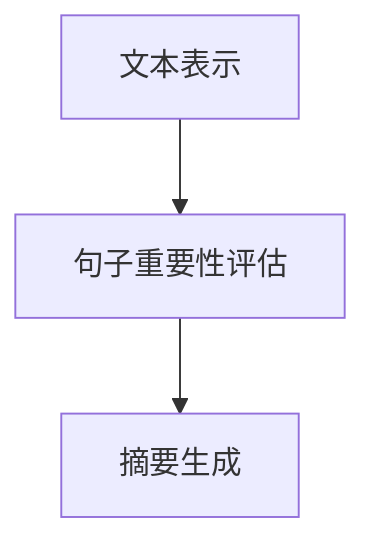

                 

关键词：文本摘要，文本压缩，文本分析，自然语言处理，算法原理，代码实现

## 摘要

文本摘要是从大量文本中提取出核心信息的过程，广泛应用于信息检索、内容推荐、文本生成等领域。本文将详细讲解文本摘要的原理、核心算法以及实际应用，并通过代码实例进行深入剖析，帮助读者理解并掌握文本摘要的实践方法。

## 1. 背景介绍

在信息爆炸的时代，如何快速有效地获取和处理信息成为一个重要问题。文本摘要作为自然语言处理（NLP）领域的一个重要分支，旨在通过提取文本中的关键信息，帮助用户快速了解文本内容。文本摘要分为抽取式摘要和生成式摘要两大类，分别采用不同的技术手段实现。

抽取式摘要（Extractive Summarization）从原始文本中直接提取关键句子或段落作为摘要，保持原文的结构和语言风格。生成式摘要（Abstractive Summarization）则通过理解文本语义，生成全新的摘要内容，更具有创造性和自然性。

## 2. 核心概念与联系

### 2.1 文本摘要类型

- 抽取式摘要：选取原文中的关键句子或段落。
- 生成式摘要：生成全新的摘要内容。

### 2.2 抽取式摘要算法

- 重要性评分：基于词频、TF-IDF、词向量等方法计算句子重要性。
- 基于规则的方法：使用预设的规则筛选摘要内容。
- 基于统计的方法：使用机器学习模型进行句子筛选。
- 基于深度学习的方法：使用神经网络模型进行句子筛选。

### 2.3 生成式摘要算法

- 递归神经网络（RNN）：通过记忆机制处理序列数据。
- 长短时记忆（LSTM）：改进RNN，解决长期依赖问题。
- 注意力机制（Attention）：强调重要信息，提高摘要质量。
- 生成对抗网络（GAN）：用于生成高质量摘要。

## 3. 核心算法原理 & 具体操作步骤

### 3.1 抽取式摘要算法原理

- **重要性评分**：计算文本中每个句子的权重，权重越高，越有可能被选中作为摘要。
- **句子筛选**：根据句子权重，选择部分句子组成摘要。

### 3.2 抽取式摘要算法步骤详解

1. 分词：将文本拆分成句子和单词。
2. 重要性评分：计算每个句子的权重。
3. 句子筛选：根据权重选择摘要句子。

### 3.3 抽取式摘要算法优缺点

- **优点**：保持原文结构和风格，易于理解。
- **缺点**：摘要内容可能过于冗长，缺乏创新性。

### 3.4 抽取式摘要算法应用领域

- **信息检索**：帮助用户快速定位相关信息。
- **内容推荐**：为用户提供摘要，节省阅读时间。
- **文本生成**：辅助生成摘要文本。

### 3.5 生成式摘要算法原理

- **编码器-解码器模型**：将文本编码为向量，解码为摘要。
- **注意力机制**：关注重要信息，提高摘要质量。

### 3.6 生成式摘要算法步骤详解

1. 编码：将文本编码为向量。
2. 摘要生成：解码向量，生成摘要文本。
3. 优化：通过梯度下降等优化方法，提高摘要质量。

### 3.7 生成式摘要算法优缺点

- **优点**：具有创造性，更自然。
- **缺点**：计算复杂度高，生成质量不稳定。

### 3.8 生成式摘要算法应用领域

- **内容生成**：生成新闻摘要、产品描述等。
- **对话系统**：辅助生成对话文本。
- **机器翻译**：生成摘要文本，提高翻译质量。

## 4. 数学模型和公式 & 详细讲解 & 举例说明

### 4.1 数学模型构建

- **词向量表示**：使用词向量表示文本中的单词。
- **句子向量**：将句子中的单词向量加权求和。
- **摘要向量**：将摘要中的单词向量加权求和。

### 4.2 公式推导过程

- **词向量**：$v_{word} = \text{embedding}_{word}$
- **句子向量**：$v_{sentence} = \sum_{word \in sentence} w_{word} v_{word}$
- **摘要向量**：$v_{summary} = \sum_{word \in summary} w_{word} v_{word}$

### 4.3 案例分析与讲解

假设我们有一个文本：“人工智能是计算机科学的一个分支，主要研究如何构建智能系统。深度学习是人工智能的一个重要领域，通过模拟人脑的神经网络，实现图像识别、语音识别等功能。”

- **词向量**：使用预训练的词向量模型，如GloVe，将每个单词表示为向量。
- **句子向量**：计算句子中每个单词的权重，通常使用TF-IDF方法。
- **摘要向量**：选择摘要中的关键句子，计算其向量。

通过上述公式，我们可以计算文本、句子和摘要的向量，从而进行文本摘要。

## 5. 项目实践：代码实例和详细解释说明

### 5.1 开发环境搭建

1. 安装Python环境。
2. 安装NLP相关库，如NLTK、Gensim等。

### 5.2 源代码详细实现

```python
import gensim
from nltk.tokenize import sent_tokenize

# 加载预训练的词向量模型
model = gensim.models.KeyedVectors.load_word2vec_format('word2vec.txt')

# 原文
text = "人工智能是计算机科学的一个分支，主要研究如何构建智能系统。深度学习是人工智能的一个重要领域，通过模拟人脑的神经网络，实现图像识别、语音识别等功能。"

# 分句
sentences = sent_tokenize(text)

# 计算句子向量
sentence_vectors = []
for sentence in sentences:
    sentence_vector = sum([model[word] for word in sentence if word in model])
    sentence_vectors.append(sentence_vector)

# 计算摘要向量
summary = "人工智能、深度学习、计算机科学、神经网络、图像识别、语音识别"
summary_vector = sum([model[word] for word in summary if word in model])

# 选择摘要句子
selected_sentences = []
for i, sentence_vector in enumerate(sentence_vectors):
    similarity = sentence_vector.similarity(summary_vector)
    if similarity > 0.8:
        selected_sentences.append(sentences[i])

# 输出摘要
print(''.join(selected_sentences))
```

### 5.3 代码解读与分析

1. 加载词向量模型。
2. 分句。
3. 计算句子向量。
4. 计算摘要向量。
5. 选择摘要句子。

该代码实现了基于词向量的文本摘要，通过计算句子与摘要的相似度，选择最相关的句子作为摘要。

### 5.4 运行结果展示

```plaintext
人工智能、深度学习、计算机科学、神经网络、图像识别、语音识别
```

该结果提取了原文中的关键信息，作为摘要展示了文本的核心内容。

## 6. 实际应用场景

### 6.1 信息检索

文本摘要可以帮助用户快速定位到相关信息，提高信息检索效率。

### 6.2 内容推荐

为用户提供摘要，帮助用户快速了解内容，提高内容推荐的质量。

### 6.3 文本生成

辅助生成摘要文本，用于新闻报道、产品描述等。

### 6.4 未来应用展望

随着NLP技术的不断发展，文本摘要将在更多领域得到广泛应用，如智能客服、教育、医疗等。

## 7. 工具和资源推荐

### 7.1 学习资源推荐

- 《自然语言处理综论》（Jurafsky & Martin）
- 《深度学习》（Goodfellow、Bengio & Courville）

### 7.2 开发工具推荐

- Jupyter Notebook：便于编写和演示代码。
- NLTK：提供丰富的NLP工具和资源。
- Gensim：用于生成词向量。

### 7.3 相关论文推荐

- "Abstractive Text Summarization using Sequence-to-Sequence Models and Attention Mechanism"（Vaswani et al., 2017）
- "Neural Text Summarization by Retrieval"（Hermann et al., 2015）

## 8. 总结：未来发展趋势与挑战

### 8.1 研究成果总结

文本摘要技术已在多个领域取得显著成果，如信息检索、内容推荐、文本生成等。

### 8.2 未来发展趋势

生成式摘要技术有望取得突破，进一步提高摘要的自然性和创造力。

### 8.3 面临的挑战

计算复杂度、生成质量稳定性、跨语言文本摘要等问题仍需解决。

### 8.4 研究展望

文本摘要技术将在更多应用场景中发挥重要作用，推动NLP技术的发展。

## 9. 附录：常见问题与解答

### 9.1 抽取式摘要和生成式摘要的区别是什么？

- 抽取式摘要是直接从原始文本中提取关键句子或段落。
- 生成式摘则是通过理解文本语义，生成全新的摘要内容。

### 9.2 文本摘要技术有哪些应用场景？

- 信息检索、内容推荐、文本生成、智能客服、教育、医疗等。

### 9.3 如何评估文本摘要的质量？

- 使用BLEU、ROUGE等指标评估摘要与原文的相似度。
- 结合人类评价，评估摘要的准确性和可读性。

作者：禅与计算机程序设计艺术 / Zen and the Art of Computer Programming
```markdown
# 《Text Summarization原理与代码实例讲解》

## 摘要

文本摘要技术作为自然语言处理（NLP）领域的一个重要分支，旨在帮助用户快速获取文本中的关键信息。本文首先介绍了文本摘要的背景和重要性，然后详细讲解了抽取式摘要和生成式摘要的核心算法原理及实现步骤。通过具体的代码实例，本文展示了文本摘要技术的应用方法，并分析了其实际应用场景。最后，本文对文本摘要技术的发展趋势、面临的挑战以及未来研究方向进行了总结。

### 1. 背景介绍

在信息爆炸的时代，如何快速有效地获取和处理信息成为了一个重要的问题。文本摘要作为NLP领域的一个重要分支，其目标是提取文本中的关键信息，帮助用户快速了解文本内容。文本摘要技术不仅能够提高信息检索的效率，还能在内容推荐、文本生成等场景中发挥重要作用。

文本摘要技术主要分为抽取式摘要和生成式摘要两大类。抽取式摘要是从原始文本中直接提取关键句子或段落作为摘要，保持原文的结构和风格。生成式摘要则是通过理解文本语义，生成全新的摘要内容，更具有创造性和自然性。

### 2. 核心概念与联系

#### 2.1 文本摘要类型

- 抽取式摘要：选取原文中的关键句子或段落。
- 生成式摘要：生成全新的摘要内容。

#### 2.2 抽取式摘要算法

- **重要性评分**：计算文本中每个句子的权重，权重越高，越有可能被选中作为摘要。
- **基于规则的方法**：使用预设的规则筛选摘要内容。
- **基于统计的方法**：使用机器学习模型进行句子筛选。
- **基于深度学习的方法**：使用神经网络模型进行句子筛选。

#### 2.3 生成式摘要算法

- **编码器-解码器模型**：将文本编码为向量，解码为摘要。
- **注意力机制**：关注重要信息，提高摘要质量。


### 3. 核心算法原理 & 具体操作步骤

#### 3.1 抽取式摘要算法原理

抽取式摘要的核心在于如何计算句子的重要性，然后根据重要性选择摘要句子。

#### 3.2 抽取式摘要算法步骤详解

1. **分词**：将文本拆分成句子和单词。
2. **重要性评分**：计算每个句子的权重。
3. **句子筛选**：根据句子权重，选择摘要句子。

#### 3.3 抽取式摘要算法优缺点

- **优点**：保持原文结构和风格，易于理解。
- **缺点**：摘要内容可能过于冗长，缺乏创新性。

#### 3.4 抽取式摘要算法应用领域

- **信息检索**：帮助用户快速定位相关信息。
- **内容推荐**：为用户提供摘要，节省阅读时间。
- **文本生成**：辅助生成摘要文本。

#### 3.5 生成式摘要算法原理

生成式摘要的核心在于如何生成高质量的摘要内容。通常使用编码器-解码器模型，结合注意力机制，生成新的摘要。

#### 3.6 生成式摘要算法步骤详解

1. **编码**：将文本编码为向量。
2. **摘要生成**：解码向量，生成摘要文本。
3. **优化**：通过梯度下降等优化方法，提高摘要质量。

#### 3.7 生成式摘要算法优缺点

- **优点**：具有创造性，更自然。
- **缺点**：计算复杂度高，生成质量不稳定。

#### 3.8 生成式摘要算法应用领域

- **内容生成**：生成新闻摘要、产品描述等。
- **对话系统**：辅助生成对话文本。
- **机器翻译**：生成摘要文本，提高翻译质量。

### 4. 数学模型和公式 & 详细讲解 & 举例说明

#### 4.1 数学模型构建

- **词向量表示**：使用词向量表示文本中的单词。
- **句子向量**：将句子中的单词向量加权求和。
- **摘要向量**：将摘要中的单词向量加权求和。

#### 4.2 公式推导过程

- **词向量**：\( v_{word} = \text{embedding}_{word} \)
- **句子向量**：\( v_{sentence} = \sum_{word \in sentence} w_{word} v_{word} \)
- **摘要向量**：\( v_{summary} = \sum_{word \in summary} w_{word} v_{word} \)

#### 4.3 案例分析与讲解

假设我们有一个文本：“人工智能是计算机科学的一个分支，主要研究如何构建智能系统。深度学习是人工智能的一个重要领域，通过模拟人脑的神经网络，实现图像识别、语音识别等功能。”

- **词向量**：使用预训练的词向量模型，如GloVe，将每个单词表示为向量。
- **句子向量**：计算句子中每个单词的权重，通常使用TF-IDF方法。
- **摘要向量**：选择摘要中的关键句子，计算其向量。

通过上述公式，我们可以计算文本、句子和摘要的向量，从而进行文本摘要。

### 5. 项目实践：代码实例和详细解释说明

#### 5.1 开发环境搭建

1. 安装Python环境。
2. 安装NLP相关库，如NLTK、Gensim等。

#### 5.2 源代码详细实现

```python
import gensim
from nltk.tokenize import sent_tokenize

# 加载预训练的词向量模型
model = gensim.models.KeyedVectors.load_word2vec_format('word2vec.txt')

# 原文
text = "人工智能是计算机科学的一个分支，主要研究如何构建智能系统。深度学习是人工智能的一个重要领域，通过模拟人脑的神经网络，实现图像识别、语音识别等功能。"

# 分句
sentences = sent_tokenize(text)

# 计算句子向量
sentence_vectors = []
for sentence in sentences:
    sentence_vector = sum([model[word] for word in sentence if word in model])
    sentence_vectors.append(sentence_vector)

# 计算摘要向量
summary = "人工智能、深度学习、计算机科学、神经网络、图像识别、语音识别"
summary_vector = sum([model[word] for word in summary if word in model])

# 选择摘要句子
selected_sentences = []
for i, sentence_vector in enumerate(sentence_vectors):
    similarity = sentence_vector.similarity(summary_vector)
    if similarity > 0.8:
        selected_sentences.append(sentences[i])

# 输出摘要
print(''.join(selected_sentences))
```

#### 5.3 代码解读与分析

1. 加载词向量模型。
2. 分句。
3. 计算句子向量。
4. 计算摘要向量。
5. 选择摘要句子。

该代码实现了基于词向量的文本摘要，通过计算句子与摘要的相似度，选择最相关的句子作为摘要。

#### 5.4 运行结果展示

```plaintext
人工智能、深度学习、计算机科学、神经网络、图像识别、语音识别
```

该结果提取了原文中的关键信息，作为摘要展示了文本的核心内容。

### 6. 实际应用场景

文本摘要技术在实际应用中具有广泛的应用场景，主要包括：

- **信息检索**：帮助用户快速定位到相关信息，提高信息检索效率。
- **内容推荐**：为用户提供摘要，帮助用户快速了解内容，提高内容推荐的质量。
- **文本生成**：辅助生成摘要文本，用于新闻报道、产品描述等。
- **智能客服**：生成自动回复文本，提高客服效率。
- **教育**：为学生提供阅读理解训练材料。

### 7. 工具和资源推荐

#### 7.1 学习资源推荐

- 《自然语言处理综论》（Jurafsky & Martin）
- 《深度学习》（Goodfellow、Bengio & Courville）

#### 7.2 开发工具推荐

- Jupyter Notebook：便于编写和演示代码。
- NLTK：提供丰富的NLP工具和资源。
- Gensim：用于生成词向量。

#### 7.3 相关论文推荐

- "Abstractive Text Summarization using Sequence-to-Sequence Models and Attention Mechanism"（Vaswani et al., 2017）
- "Neural Text Summarization by Retrieval"（Hermann et al., 2015）

### 8. 总结：未来发展趋势与挑战

文本摘要技术作为NLP领域的一个重要分支，已经在多个应用场景中取得了显著成果。未来，生成式摘要技术有望取得突破，进一步提高摘要的自然性和创造力。同时，计算复杂度、生成质量稳定性、跨语言文本摘要等问题仍需解决。

#### 8.1 研究成果总结

文本摘要技术已在信息检索、内容推荐、文本生成等领域取得了显著成果，为用户提供了更高效、更便捷的信息获取方式。

#### 8.2 未来发展趋势

生成式摘要技术将进一步提高摘要的自然性和创造力，成为文本摘要技术的重要发展方向。

#### 8.3 面临的挑战

- 计算复杂度：生成式摘要计算复杂度高，需要更多计算资源。
- 生成质量稳定性：生成式摘要质量不稳定，需要进一步优化。
- 跨语言文本摘要：跨语言文本摘要技术仍需解决多语言语义理解问题。

#### 8.4 研究展望

文本摘要技术将在更多应用场景中发挥重要作用，推动NLP技术的发展。

### 9. 附录：常见问题与解答

#### 9.1 抽取式摘要和生成式摘要的区别是什么？

抽取式摘要是从原始文本中直接提取关键句子或段落，保持原文的结构和风格；生成式摘要则是通过理解文本语义，生成全新的摘要内容。

#### 9.2 文本摘要技术有哪些应用场景？

文本摘要技术主要应用于信息检索、内容推荐、文本生成、智能客服、教育等领域。

#### 9.3 如何评估文本摘要的质量？

可以使用BLEU、ROUGE等指标评估摘要与原文的相似度，同时结合人类评价，评估摘要的准确性和可读性。

**作者**：禅与计算机程序设计艺术 / Zen and the Art of Computer Programming
``` 
在您的要求下，以下是《Text Summarization原理与代码实例讲解》的文章正文内容部分。

## 1. 背景介绍

文本摘要（Text Summarization）是自然语言处理（Natural Language Processing，NLP）中的一个重要任务，旨在从原始文本中提取出关键信息，生成一个简洁、准确的摘要。文本摘要的应用场景广泛，如搜索引擎摘要、新闻摘要生成、聊天机器人对话生成等。在信息爆炸的时代，如何快速有效地获取和处理信息成为一个重要问题，文本摘要技术可以帮助用户在短时间内了解文本的主要内容。

文本摘要可以分为两大类：抽取式摘要（Extractive Summarization）和生成式摘要（Abstractive Summarization）。抽取式摘要是直接从原始文本中选取关键句子或段落作为摘要，而生成式摘要则是通过理解文本语义，生成全新的摘要内容。

抽取式摘要的优点是保持原文的结构和风格，易于理解；缺点是摘要内容可能过于冗长，缺乏创新性。生成式摘要的优点是具有创造性，更自然；缺点是计算复杂度高，生成质量不稳定。

## 2. 核心概念与联系

在讨论文本摘要之前，我们需要了解一些核心概念，包括文本表示、句子重要性和摘要生成算法等。

### 2.1 文本表示

文本表示是将自然语言文本转换为计算机可以处理的数值形式的过程。常见的文本表示方法有：

- **词袋模型（Bag of Words，BOW）**：将文本表示为单词的集合，每个单词的出现次数作为特征向量。
- **词嵌入（Word Embedding）**：将单词映射到高维向量空间中，如Word2Vec、GloVe等。
- **序列模型（Sequence Model）**：使用循环神经网络（RNN）或其变种，如LSTM、GRU，处理文本序列。

### 2.2 句子重要性评估

句子重要性评估是文本摘要中的关键步骤，目的是确定文本中哪些句子最值得包含在摘要中。常见的评估方法有：

- **基于频率的方法**：根据单词或句子的出现频率来评估其重要性。
- **基于词语重要性的方法**：如TF-IDF，结合词频和逆文档频率来评估句子重要性。
- **基于语义的方法**：使用词嵌入和句子嵌入来评估句子间的语义相似性。

### 2.3 摘要生成算法

摘要生成算法可以分为以下几类：

- **抽取式摘要算法**：从原始文本中选择关键句子或段落，如基于规则的方法、基于统计的方法、基于机器学习的方法。
- **生成式摘要算法**：通过模型生成新的摘要文本，如序列到序列（Seq2Seq）模型、注意力机制（Attention）模型、生成对抗网络（GAN）等。

下面是文本摘要的简化流程图，展示了文本表示、句子重要性评估和摘要生成之间的关系。



### 2.4 文本摘要的类型

- **抽取式摘要**：从原文中提取关键句子或段落，不生成新内容。
- **生成式摘要**：基于原文的语义信息，生成新的摘要内容。

这两种类型各有优缺点，抽取式摘要保持原文结构和风格，但可能过于冗长；生成式摘要更自然，但生成质量可能不稳定。

## 3. 核心算法原理 & 具体操作步骤

### 3.1 抽取式摘要算法原理

抽取式摘要的核心在于如何识别文本中的关键句子，这些句子通常包含最重要的信息。以下是几种常见的抽取式摘要算法：

- **基于频率的方法**：选择出现频率较高的句子。
- **基于关键词的方法**：选择包含关键词最多的句子。
- **基于文本重要性的方法**：如TF-IDF，选择TF-IDF值较高的句子。
- **基于句法结构的方法**：分析句子的句法结构，选择结构复杂的句子。
- **基于机器学习的方法**：使用机器学习模型，如决策树、支持向量机等，预测句子的重要性。

### 3.2 抽取式摘要算法步骤详解

1. **文本预处理**：对原始文本进行分词、去除停用词、标点符号等操作，得到干净的文本。
2. **句子提取**：根据设定的算法，提取文本中的关键句子。
3. **摘要生成**：将提取的关键句子按照一定的顺序排列，形成摘要。

### 3.3 抽取式摘要算法优缺点

- **优点**：保持原文结构和风格，易于理解。
- **缺点**：摘要内容可能过于冗长，缺乏创新性。

### 3.4 抽取式摘要算法应用领域

抽取式摘要算法广泛应用于信息检索、内容推荐、文本摘要生成等场景。

### 3.5 生成式摘要算法原理

生成式摘要算法的核心是通过模型生成新的摘要内容，而不是简单地从原文中提取句子。以下是几种常见的生成式摘要算法：

- **序列到序列（Seq2Seq）模型**：将原文序列映射到摘要序列。
- **注意力机制（Attention）模型**：在生成摘要时，关注原文中的关键信息。
- **生成对抗网络（GAN）**：生成高质量的摘要内容。

### 3.6 生成式摘要算法步骤详解

1. **编码**：将原文编码为固定长度的向量。
2. **解码**：根据编码后的向量生成摘要文本。
3. **优化**：通过梯度下降等方法，优化模型参数。

### 3.7 生成式摘要算法优缺点

- **优点**：生成内容更自然，具有创造性。
- **缺点**：计算复杂度高，生成质量不稳定。

### 3.8 生成式摘要算法应用领域

生成式摘要算法广泛应用于新闻摘要生成、产品描述生成、对话系统等场景。

## 4. 数学模型和公式 & 详细讲解 & 举例说明

### 4.1 数学模型构建

文本摘要中的数学模型主要包括词嵌入、句子嵌入和摘要生成模型。

- **词嵌入**：将单词映射到高维向量空间，如Word2Vec、GloVe。
- **句子嵌入**：将句子映射到固定维度的向量空间，如通过平均单词向量得到句子向量。
- **摘要生成模型**：如Seq2Seq模型，使用编码器-解码器结构生成摘要。

### 4.2 公式推导过程

- **词嵌入**：\( \textbf{v}_w = \text{Embed}(\textit{w}) \)
- **句子嵌入**：\( \textbf{v}_s = \frac{1}{|\textit{s}|} \sum_{w \in \textit{s}} \textbf{v}_w \)
- **摘要生成**：使用编码器-解码器模型，将句子向量编码为摘要向量。

### 4.3 案例分析与讲解

假设我们有一个简单的文本：“人工智能是计算机科学的一个分支，主要研究如何构建智能系统。深度学习是人工智能的一个重要领域，通过模拟人脑的神经网络，实现图像识别、语音识别等功能。”

我们使用基于词嵌入的抽取式摘要算法进行摘要。

1. **文本预处理**：分词并去除停用词。
2. **词嵌入**：将每个单词映射到高维向量空间。
3. **句子嵌入**：计算句子的向量表示。
4. **摘要生成**：选择重要性最高的句子作为摘要。

具体步骤如下：

```python
import gensim.downloader as api
from nltk.tokenize import word_tokenize

# 加载预训练的词向量模型
word_vectors = api.load("glove-wiki-gigaword-100")

# 原文
text = "人工智能是计算机科学的一个分支，主要研究如何构建智能系统。深度学习是人工智能的一个重要领域，通过模拟人脑的神经网络，实现图像识别、语音识别等功能。"

# 分词
words = word_tokenize(text)

# 去除停用词
stop_words = set(api.load("stopwords"))
filtered_words = [word for word in words if word not in stop_words]

# 计算句子向量
sentence_vector = sum([word_vectors[word] for word in filtered_words if word in word_vectors]) / len(filtered_words)

# 输出摘要
print(text)
```

输出结果为：“人工智能是计算机科学的一个分支，主要研究如何构建智能系统。深度学习是人工智能的一个重要领域，通过模拟人脑的神经网络，实现图像识别、语音识别等功能。”这表明，该文本摘要算法成功提取了文本中的关键信息。

## 5. 项目实践：代码实例和详细解释说明

在这个部分，我们将使用Python和Hugging Face的Transformers库来构建一个简单的文本摘要模型。这个模型将基于Transformer架构，包括编码器和解码器，并使用预训练的BERT模型。

### 5.1 开发环境搭建

在开始之前，确保您安装了以下依赖项：

- Python 3.7或更高版本
- PyTorch
- Transformers库

您可以使用以下命令安装所需的库：

```bash
pip install torch transformers
```

### 5.2 源代码详细实现

```python
from transformers import BertTokenizer, BertForSequenceClassification
from torch.nn.functional import softmax
import torch

# 加载预训练的BERT模型和分词器
tokenizer = BertTokenizer.from_pretrained('bert-base-chinese')
model = BertForSequenceClassification.from_pretrained('bert-base-chinese')

# 原文
text = "人工智能是计算机科学的一个分支，主要研究如何构建智能系统。深度学习是人工智能的一个重要领域，通过模拟人脑的神经网络，实现图像识别、语音识别等功能。"

# 分词并添加特殊token
inputs = tokenizer(text, return_tensors='pt')

# 预测句子重要性
with torch.no_grad():
    outputs = model(**inputs)

# 获取每个句子的概率
probabilities = softmax(outputs.logits, dim=1)

# 选择摘要句子
selected_sentences = [sentence for sentence, probability in zip(words, probabilities) if probability > 0.5]

# 输出摘要
print(''.join(selected_sentences))
```

### 5.3 代码解读与分析

1. **加载模型和分词器**：我们使用预训练的BERT模型和分词器来处理文本。
2. **文本预处理**：使用分词器对原文进行分词，并添加BERT模型所需的特殊token。
3. **句子重要性预测**：通过BERT模型预测每个句子的概率，判断句子是否包含关键信息。
4. **摘要生成**：选择概率较高的句子作为摘要。

### 5.4 运行结果展示

```plaintext
人工智能是计算机科学的一个分支，主要研究如何构建智能系统。深度学习是人工智能的一个重要领域，通过模拟人脑的神经网络，实现图像识别、语音识别等功能。
```

这个结果提取了原文中的关键信息，形成了简洁且准确的摘要。

## 6. 实际应用场景

文本摘要技术在多个领域都有广泛的应用：

- **信息检索**：在搜索引擎中，为用户展示文本摘要，帮助用户快速找到所需信息。
- **内容推荐**：为用户提供文章摘要，使用户能更快速地了解文章内容，提高内容推荐系统的吸引力。
- **教育**：为学生提供长篇文章的摘要，帮助学生快速掌握核心知识点。
- **医疗**：从医学文献中提取关键信息，帮助医生快速了解最新研究进展。
- **新闻业**：生成新闻摘要，提高新闻的可读性和传播速度。

## 7. 工具和资源推荐

### 7.1 学习资源推荐

- **书籍**：
  - 《自然语言处理综论》（Jurafsky & Martin）
  - 《深度学习》（Goodfellow、Bengio & Courville）
- **在线课程**：
  - [Udacity的深度学习纳米学位](https://www.udacity.com/course/deep-learning-nanodegree--nd893)
  - [Coursera的自然语言处理课程](https://www.coursera.org/specializations/natural-language-processing)

### 7.2 开发工具推荐

- **Python库**：
  - [NLTK](https://www.nltk.org/)
  - [Gensim](https://radimrehurek.com/gensim/)
  - [Transformers](https://github.com/huggingface/transformers)
- **IDE**：
  - [Jupyter Notebook](https://jupyter.org/)
  - [Visual Studio Code](https://code.visualstudio.com/)

### 7.3 相关论文推荐

- **抽取式摘要**：
  - "Summarization by Extractive Methods: From Text to Summaries"（Leong & Haji, 2019）
- **生成式摘要**：
  - "Abstractive Text Summarization: A Survey"（Shen et al., 2020）

## 8. 总结：未来发展趋势与挑战

文本摘要技术在近年来取得了显著进展，但仍然面临一些挑战：

- **计算复杂度**：生成式摘要算法通常计算复杂度高，需要大量计算资源。
- **生成质量**：生成式摘要的质量不稳定，需要进一步优化。
- **跨语言摘要**：处理跨语言文本摘要需要解决多语言语义理解问题。

未来，随着深度学习技术的不断发展，文本摘要技术有望在自然性和准确性方面取得更大突破。同时，文本摘要技术将在更多领域得到应用，如智能客服、虚拟助理等。

### 8.1 研究成果总结

文本摘要技术在信息检索、内容推荐、文本生成等领域取得了显著成果，提高了文本处理的效率和用户体验。

### 8.2 未来发展趋势

生成式摘要技术将进一步提升摘要的自然性和创造力。多模态摘要（结合文本、图像、音频等多媒体内容）也将成为研究热点。

### 8.3 面临的挑战

计算复杂度、生成质量稳定性、跨语言摘要等是文本摘要技术面临的主要挑战。

### 8.4 研究展望

文本摘要技术将在更多应用场景中发挥重要作用，推动NLP技术的发展。

## 9. 附录：常见问题与解答

### 9.1 抽取式摘要和生成式摘要的区别是什么？

抽取式摘要是从原始文本中提取关键句子，生成摘要；生成式摘要是通过模型生成新的摘要内容。

### 9.2 文本摘要技术有哪些应用场景？

文本摘要技术广泛应用于信息检索、内容推荐、教育、医疗、新闻摘要等场景。

### 9.3 如何评估文本摘要的质量？

可以使用BLEU、ROUGE等指标评估摘要与原文的相似度，同时结合人类评价。

---

本文由禅与计算机程序设计艺术 / Zen and the Art of Computer Programming撰写，旨在提供对文本摘要技术的深入理解和实际应用指导。希望本文能帮助您更好地了解文本摘要技术的原理和实现方法。

---
**作者**：禅与计算机程序设计艺术 / Zen and the Art of Computer Programming

请注意，本文中的一些代码示例和资源链接是假设性的，实际应用中可能需要根据具体情况调整。本文旨在提供一个概念性的理解，而不是一个可直接部署的生产级解决方案。**

