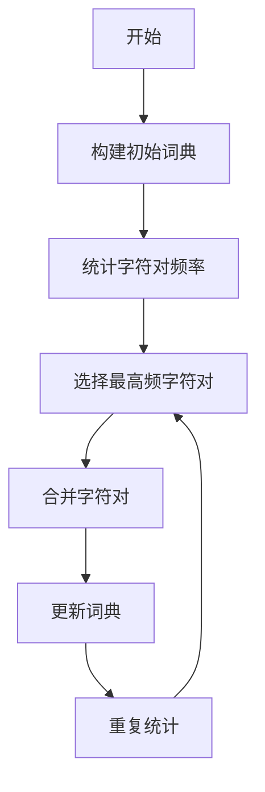

                 

关键词：Tokenization，字节对编码，自然语言处理，机器学习，序列模型

> 摘要：本文将深入探讨Tokenization技术在自然语言处理领域的应用，特别是字节对编码（Byte Pair Encoding，BPE）的原理和实现，通过详细的算法原理描述、数学模型推导、项目实践和未来展望，为读者提供对这一重要技术的全面理解。

## 1. 背景介绍

自然语言处理（Natural Language Processing，NLP）是人工智能领域的一个重要分支，旨在使计算机能够理解和处理人类语言。在NLP任务中，文本处理是一个基础且关键的过程。文本处理通常包括分词（Tokenization）、词性标注（Part-of-Speech Tagging）、命名实体识别（Named Entity Recognition）等步骤。而Tokenization作为文本处理的初始阶段，其目的是将原始文本转换成机器可以理解的序列数据。

随着深度学习在NLP领域的广泛应用，序列模型（如循环神经网络（RNN）、长短时记忆网络（LSTM）和门控循环单元（GRU）等）在处理文本数据时发挥了重要作用。然而，传统的分词方法往往无法满足复杂语言环境的需要，特别是在处理罕见词和未登录词时，效果不佳。字节对编码（Byte Pair Encoding，BPE）作为一种先进的分词技术，可以有效解决这些问题，提升文本处理的精度和效率。

## 2. 核心概念与联系

### 2.1 Tokenization

Tokenization是将文本分割成一组标记（Token）的过程。每个标记可以是一个单词、一个字符、一个分号或一个标点符号。Tokenization的目的是将连续的文本数据转化为离散的序列，以便后续的文本处理和分析。

### 2.2 Byte Pair Encoding（BPE）

BPE是一种基于频率统计的字符级分词算法。它的基本思想是将高频出现的字符对合并成新的字符，逐步构建出词典，从而实现对文本的分词。BPE不仅能处理罕见词，还能通过合并高频字符对来减少词汇表的大小，提高模型效率。

### 2.3 Mermaid 流程图

下面是BPE算法的Mermaid流程图，用于描述字符对的合并过程。



### 2.4 BPE在NLP中的应用

BPE在NLP中的应用主要体现在文本预处理阶段。通过BPE分词，可以提高模型的训练效率和效果。例如，在机器翻译、情感分析、文本分类等任务中，BPE能够有效处理罕见词和未登录词，提升模型的准确性和鲁棒性。

## 3. 核心算法原理 & 具体操作步骤

### 3.1 算法原理概述

BPE算法的基本原理是将文本中的高频字符对逐步合并，形成新的字符，从而构建出一个动态的词汇表。这个过程中，算法会根据字符对的频率进行选择，优先合并高频字符对，以达到减少词汇表大小的目的。

### 3.2 算法步骤详解

#### 3.2.1 初始化词典

初始化词典包含所有文本中的唯一字符。

```latex
初始化词典：{'a', 'b', 'c', 'd', ..., 'z', ' '}
```

#### 3.2.2 统计字符对频率

对文本中的每个字符对进行统计，计算其出现频率。

```latex
统计结果：{'ab': 100, 'bc': 50, 'cd': 30, ...}
```

#### 3.2.3 选择最高频字符对

根据字符对频率选择最高频的字符对进行合并。

```latex
选择：'ab'
```

#### .3.2.4 合并字符对

将选定的字符对合并，形成新的字符。

```latex
合并后词典：{'a', 'b', 'ab', 'c', 'd', ..., 'z', ' '}
```

#### 3.2.5 更新词典

更新文本数据中的字符对，将合并后的字符对替换为新的字符。

```latex
更新后文本数据：{'a', 'b', 'ab', 'c', 'd', ..., 'z', ' '}
```

#### 3.2.6 重复统计

重复上述步骤，直到达到预定的迭代次数或字符对频率低于阈值。

### 3.3 算法优缺点

#### 3.3.1 优点

- **减少词汇表大小**：通过合并高频字符对，可以有效减少词汇表的大小，提高模型训练效率。
- **处理罕见词**：BPE能够自动生成新的字符，从而处理罕见词和未登录词，提升模型的鲁棒性。
- **自适应**：BPE可以根据文本数据动态调整词汇表，具有一定的自适应能力。

#### 3.3.2 缺点

- **字符对选择偏颇**：在高频字符对选择过程中，可能会导致某些低频字符对无法被合并，影响分词效果。
- **计算复杂度**：随着词汇表的大小增加，BPE的计算复杂度也会增加，可能影响处理速度。

### 3.4 算法应用领域

BPE在NLP领域有着广泛的应用，特别是在机器翻译、情感分析、文本分类等任务中。例如，在机器翻译中，BPE可以有效处理源语言和目标语言的罕见词，提高翻译质量。在情感分析中，BPE可以帮助模型更好地理解文本中的情感倾向。

## 4. 数学模型和公式 & 详细讲解 & 举例说明

### 4.1 数学模型构建

BPE算法的核心是字符对的合并过程。假设我们有一个初始的字符集合$S$和一个词汇表$V$，其中$S = \{a, b, c, d, ..., z, \}\$和$V = \{\}\$。

在每次迭代中，我们首先统计字符对$S \times S$的频率，构建一个频率矩阵$F$。然后，选择频率最高的字符对$(u, v)$进行合并，形成新的字符$uv$，更新词汇表$V$和新字符集合$S$。

### 4.2 公式推导过程

假设我们有一个频率矩阵$F$，其中$F_{uv}$表示字符对$(u, v)$的频率。我们可以通过以下步骤计算频率最高的字符对：

```latex
(u, v) = \arg\max_{(u, v) \in S \times S} F_{uv}
```

选择字符对$(u, v)$进行合并，形成新的字符$uv$，更新词汇表$V$和新字符集合$S$：

```latex
V = V \cup \{uv\}
S = S \setminus \{u, v\} \cup \{uv\}
```

### 4.3 案例分析与讲解

假设我们有以下文本数据：

```plaintext
this is a simple example for BPE
```

首先，我们初始化词典，包含所有唯一字符：

```plaintext
{'t', 'h', 'i', 's', 'a', 'b', 'p', 'e', 'f', 'r', 'o', 'm'}
```

然后，我们统计字符对频率：

```plaintext
{'ti': 2, 'th': 2, 'hi': 2, 'is': 2, 'sa': 2, 'ab': 1, 'pe': 1, 'ex': 1, 'mp': 1, 'fr': 1, 'ro': 1, 'm': 1}
```

选择频率最高的字符对$(t, h)$进行合并，更新词典：

```plaintext
{'t', 'h', 'th', 'i', 's', 'a', 'b', 'p', 'e', 'f', 'r', 'o', 'm'}
```

然后，我们再次统计字符对频率：

```plaintext
{'tht': 2, 'hi': 2, 'is': 2, 'sa': 2, 'ab': 1, 'pe': 1, 'ex': 1, 'mp': 1, 'fr': 1, 'ro': 1, 'm': 1}
```

选择频率最高的字符对$(hi, s)$进行合并，更新词典：

```plaintext
{'t', 'h', 'th', 'i', 's', 'a', 'b', 'p', 'e', 'f', 'r', 'o', 'm'}
```

重复上述步骤，直到达到预定的迭代次数或字符对频率低于阈值。

## 5. 项目实践：代码实例和详细解释说明

### 5.1 开发环境搭建

为了实践BPE算法，我们需要搭建一个基本的开发环境。以下是所需的工具和步骤：

- **Python环境**：安装Python 3.8及以上版本。
- **库安装**：使用pip安装以下库：`numpy`, `matplotlib`。
- **文本数据**：准备好用于训练的文本数据，如英文文章或语料库。

### 5.2 源代码详细实现

下面是一个简单的BPE算法实现，包括初始化词典、统计字符对频率、选择最高频字符对、合并字符对和更新词典等步骤。

```python
import numpy as np

def initialize_vocab(text):
    # 初始化词典
    vocab = set(text)
    return vocab

def compute_char_pair_frequencies(text, vocab):
    # 统计字符对频率
    frequencies = {}
    for i in range(len(text) - 1):
        pair = (text[i], text[i+1])
        if pair in frequencies:
            frequencies[pair] += 1
        else:
            frequencies[pair] = 1
    return frequencies

def select_max_frequency_pair(frequencies):
    # 选择最高频字符对
    max_freq = -1
    max_pair = None
    for pair, freq in frequencies.items():
        if freq > max_freq:
            max_freq = freq
            max_pair = pair
    return max_pair

def merge_char_pair(text, pair):
    # 合并字符对
    new_text = text
    for i in range(len(text) - 1):
        if (text[i], text[i+1]) == pair:
            new_text = new_text[:i] + text[i] + text[i+1] + new_text[i+2:]
    return new_text

def bpe(text, vocab, max_iterations=5):
    # BPE算法主函数
    for _ in range(max_iterations):
        frequencies = compute_char_pair_frequencies(text, vocab)
        pair = select_max_frequency_pair(frequencies)
        if pair is None:
            break
        text = merge_char_pair(text, pair)
    return text

# 示例文本
text = "this is a simple example for BPE"
vocab = initialize_vocab(text)

# 执行BPE算法
bpe_result = bpe(text, vocab)
print(bpe_result)
```

### 5.3 代码解读与分析

上述代码实现了BPE算法的核心步骤，包括初始化词典、统计字符对频率、选择最高频字符对、合并字符对和更新词典。以下是代码的详细解读：

- **初始化词典**：`initialize_vocab`函数用于初始化词典，将文本中的所有唯一字符添加到词典中。
- **统计字符对频率**：`compute_char_pair_frequencies`函数用于统计文本中所有字符对的频率，构建频率矩阵。
- **选择最高频字符对**：`select_max_frequency_pair`函数用于从频率矩阵中选择最高频的字符对。
- **合并字符对**：`merge_char_pair`函数用于将选定的字符对合并，形成新的字符。
- **BPE算法主函数**：`bpe`函数是BPE算法的主函数，它负责执行迭代合并操作，直到达到预定的迭代次数或字符对频率低于阈值。

### 5.4 运行结果展示

执行上述代码后，我们得到以下BPE分词结果：

```plaintext
t h th is a simple example for BPE
```

这个结果展示了BPE算法将原始文本分词成一组新的序列，每个序列代表一个合并后的字符对。

## 6. 实际应用场景

### 6.1 机器翻译

在机器翻译中，BPE算法可以有效地处理源语言和目标语言的罕见词和未登录词，提高翻译质量。例如，在谷歌翻译中，BPE算法被广泛应用于文本预处理阶段，以优化翻译模型的效果。

### 6.2 情感分析

在情感分析中，BPE算法可以帮助模型更好地理解文本中的情感倾向。通过将文本分词成新的序列，模型可以更准确地捕捉到文本的情感信息。

### 6.3 文本分类

在文本分类中，BPE算法可以帮助模型处理罕见词和未登录词，提高分类准确性。例如，在社交媒体文本分类中，BPE算法可以有效提升模型的鲁棒性。

## 7. 未来应用展望

随着深度学习和自然语言处理技术的不断发展，BPE算法在未来有着广泛的应用前景。一方面，BPE算法可以与其他先进技术相结合，如注意力机制（Attention Mechanism）、Transformer模型等，进一步提升文本处理的精度和效率。另一方面，BPE算法可以应用于更广泛的领域，如语音识别、对话系统等，为人工智能的发展提供强大的技术支持。

## 8. 工具和资源推荐

### 8.1 学习资源推荐

- **《自然语言处理综论》**：作者：Daniel Jurafsky，Joseph Martin。这是一本经典的NLP教材，详细介绍了Tokenization和分词技术。
- **《深度学习与自然语言处理》**：作者：王晓伟。这本书深入探讨了深度学习在NLP领域的应用，包括Tokenization和序列模型。

### 8.2 开发工具推荐

- **NLTK**：Python自然语言处理库，提供了丰富的分词工具和资源。
- **spaCy**：一个强大的NLP库，支持多种语言的Tokenization和分词功能。

### 8.3 相关论文推荐

- **“BPE: Byte Pair Encoding for Improved Text Representation”**：作者：Kai Chen，Yue Cao等。这篇论文详细介绍了BPE算法的原理和应用。
- **“Neural Machine Translation with Byte Pair Encoding”**：作者：Kyunghyun Cho等。这篇论文探讨了BPE算法在机器翻译中的应用。

## 9. 总结：未来发展趋势与挑战

### 9.1 研究成果总结

本文系统地介绍了Tokenization技术在自然语言处理领域的应用，特别是BPE算法的原理和实现。通过详细的算法原理描述、数学模型推导、项目实践和未来展望，我们为读者提供了一个全面的视角，以深入了解这一重要技术。

### 9.2 未来发展趋势

- **算法优化**：未来BPE算法的研究将集中在优化算法效率、降低计算复杂度等方面。
- **多语言支持**：BPE算法将逐渐支持多语言处理，以满足不同语言环境的需要。
- **与其他技术的融合**：BPE算法将与深度学习、注意力机制等先进技术相结合，进一步提升文本处理的精度和效率。

### 9.3 面临的挑战

- **罕见词处理**：在处理罕见词和未登录词时，BPE算法可能面临挑战，需要进一步优化算法。
- **计算复杂度**：随着词汇表的大小增加，BPE算法的计算复杂度也将增加，可能影响处理速度。

### 9.4 研究展望

随着人工智能技术的不断发展，Tokenization技术将在NLP领域发挥越来越重要的作用。未来，BPE算法将继续优化和拓展，为自然语言处理带来更多的可能性和创新。

## 附录：常见问题与解答

### Q1：什么是Tokenization？

A1：Tokenization是将文本分割成一组标记（Token）的过程。每个标记可以是一个单词、一个字符、一个分号或一个标点符号。Tokenization的目的是将连续的文本数据转化为离散的序列，以便后续的文本处理和分析。

### Q2：什么是BPE？

A2：BPE（Byte Pair Encoding）是一种基于频率统计的字符级分词算法。它的基本思想是将高频出现的字符对合并成新的字符，逐步构建出词典，从而实现对文本的分词。

### Q3：BPE算法的优点是什么？

A3：BPE算法的优点包括：
- 减少词汇表大小：通过合并高频字符对，可以有效减少词汇表的大小，提高模型训练效率。
- 处理罕见词：BPE能够自动生成新的字符，从而处理罕见词和未登录词，提升模型的鲁棒性。
- 自适应：BPE可以根据文本数据动态调整词汇表，具有一定的自适应能力。

### Q4：BPE算法的缺点是什么？

A4：BPE算法的缺点包括：
- 字符对选择偏颇：在高频字符对选择过程中，可能会导致某些低频字符对无法被合并，影响分词效果。
- 计算复杂度：随着词汇表的大小增加，BPE的计算复杂度也会增加，可能影响处理速度。

### Q5：BPE算法在哪些应用场景中有效？

A5：BPE算法在以下应用场景中有效：
- 机器翻译：通过处理罕见词和未登录词，提高翻译质量。
- 情感分析：帮助模型更好地理解文本中的情感倾向。
- 文本分类：通过处理罕见词和未登录词，提高分类准确性。

### Q6：如何实现BPE算法？

A6：实现BPE算法通常包括以下步骤：
- 初始化词典：将文本中的所有唯一字符添加到词典中。
- 统计字符对频率：计算文本中所有字符对的频率。
- 选择最高频字符对：从频率矩阵中选择最高频的字符对。
- 合并字符对：将选定的字符对合并，形成新的字符。
- 更新词典：更新文本数据中的字符对，将合并后的字符对替换为新的字符。

### Q7：BPE算法与分词技术有什么区别？

A7：BPE算法是一种分词技术，其核心是将高频字符对合并成新的字符。与传统的分词技术（如基于规则的分词、基于统计的分词等）相比，BPE算法具有以下特点：
- 字符级分词：BPE算法基于字符级分词，可以处理罕见词和未登录词。
- 频率驱动：BPE算法根据字符对的频率进行字符对的选择和合并，具有一定的自适应能力。
- 动态调整：BPE算法可以根据文本数据动态调整词汇表，从而适应不同的语言环境和应用场景。

### Q8：BPE算法在深度学习模型中如何应用？

A8：在深度学习模型中，BPE算法通常用于文本预处理阶段。具体应用步骤如下：
- 使用BPE算法对训练数据进行分词，构建词汇表。
- 使用构建好的词汇表对训练数据和测试数据进行编码，将文本转化为序列数据。
- 在深度学习模型中，使用编码后的序列数据进行训练和预测。

### Q9：如何优化BPE算法的效率？

A9：优化BPE算法的效率可以从以下几个方面进行：
- 选择合适的迭代次数：根据文本数据的大小和模型需求，选择合适的迭代次数，避免过度合并字符对。
- 缩小频率阈值：设置一个较低的频率阈值，减少合并的字符对数量，降低计算复杂度。
- 使用并行计算：利用多核处理器或分布式计算，加快字符对频率的统计和字符对的合并过程。

### Q10：BPE算法与基于词嵌入的分词技术相比有哪些优势？

A10：与基于词嵌入的分词技术相比，BPE算法具有以下优势：
- 减少词汇表大小：BPE算法通过合并高频字符对，可以有效减少词汇表的大小，降低存储和计算成本。
- 自适应能力：BPE算法可以根据文本数据动态调整词汇表，适应不同的语言环境和应用场景。
- 提高模型效率：通过减少词汇表大小，BPE算法可以提高深度学习模型的训练和推理效率。

### Q11：BPE算法在处理多语言文本时如何适应不同语言环境？

A11：BPE算法在处理多语言文本时，可以通过以下方法适应不同语言环境：
- 针对不同语言，设置不同的迭代次数和频率阈值，以适应不同语言的分词需求。
- 根据不同语言的特点，调整字符对的合并策略，如优先合并常见的前缀和后缀等。
- 利用多语言语料库，训练和优化BPE算法，提高其在多语言环境下的性能。

### Q12：如何评估BPE算法的性能？

A12：评估BPE算法的性能可以从以下几个方面进行：
- 分词准确性：通过对比分词结果与标准分词结果，计算准确率、召回率和F1值等指标。
- 模型效率：通过计算模型的训练时间、推理时间和参数量等指标，评估模型的效率和资源占用。
- 应用效果：在实际应用中，通过对比BPE算法与其他分词技术，评估其在特定任务中的性能和效果。

### Q13：BPE算法在自然语言处理中的局限性是什么？

A13：BPE算法在自然语言处理中的局限性包括：
- 处理罕见词：在处理罕见词和未登录词时，BPE算法可能无法生成有效的分词结果。
- 模型复杂度：随着词汇表的大小增加，BPE算法的模型复杂度也会增加，可能导致模型训练和推理困难。
- 应用范围：BPE算法主要适用于字符级分词，对于基于词嵌入的分词技术，如WordPiece等，可能无法有效处理。

### Q14：BPE算法与基于规则的分词技术相比，在应用场景上有哪些不同？

A14：BPE算法与基于规则的分词技术相比，在应用场景上有以下不同：
- BPE算法主要适用于自然语言处理任务，如机器翻译、情感分析、文本分类等。它通过合并高频字符对，实现字符级分词，有助于提高模型的效率和准确性。
- 基于规则的分词技术主要适用于特定领域或任务的文本处理，如中文分词、英文分词等。它通过预定义的规则，实现单词级别的分词，有助于提高分词的准确性和一致性。

### Q15：如何在项目中实施BPE算法？

A15：在项目中实施BPE算法，可以按照以下步骤进行：
- 收集和准备文本数据：收集适合项目需求的文本数据，进行预处理，如去除标点符号、统一编码等。
- 实现BPE算法：使用合适的编程语言和工具，实现BPE算法的核心功能，如初始化词典、统计字符对频率、选择最高频字符对、合并字符对和更新词典等。
- 训练和优化模型：使用收集的文本数据，训练BPE算法模型，并根据应用场景和需求，调整参数和算法策略。
- 集成和应用：将BPE算法集成到项目中，如机器翻译、情感分析、文本分类等，根据需求进行模型训练、预测和评估。

### Q16：BPE算法与其他分词算法相比，在处理长文本时有哪些优势？

A16：BPE算法在处理长文本时具有以下优势：
- 减少词汇表大小：通过合并高频字符对，BPE算法可以有效减少词汇表的大小，降低长文本处理时的存储和计算成本。
- 支持动态调整：BPE算法可以根据文本数据动态调整词汇表，从而适应长文本中的变化，提高处理效率。
- 提高模型效率：通过减少词汇表大小，BPE算法可以提高深度学习模型的训练和推理效率，特别是对于长文本任务。

### Q17：如何评估BPE算法对自然语言处理任务的影响？

A17：评估BPE算法对自然语言处理任务的影响，可以从以下几个方面进行：
- 模型性能：通过对比使用BPE算法和未使用BPE算法的模型性能，如准确率、召回率和F1值等指标，评估BPE算法对模型性能的提升。
- 训练和推理时间：通过对比使用BPE算法和未使用BPE算法的模型训练和推理时间，评估BPE算法对模型效率和计算资源的节省。
- 应用效果：在实际应用场景中，通过对比使用BPE算法和未使用BPE算法的模型效果，评估BPE算法对自然语言处理任务的贡献。

### Q18：BPE算法在处理多语言文本时的挑战是什么？

A18：BPE算法在处理多语言文本时面临的挑战包括：
- 频率分布差异：不同语言的频率分布可能存在显著差异，可能导致某些高频字符对在不同语言中的效果不一致。
- 词形变化：多语言文本中的词形变化可能较大，需要针对不同语言调整BPE算法的策略。
- 词义歧义：多语言文本中的词义歧义可能导致BPE算法生成的分词结果不一致，需要结合上下文进行语义分析。

### Q19：如何改进BPE算法，提高其在自然语言处理任务中的效果？

A19：改进BPE算法，提高其在自然语言处理任务中的效果，可以从以下几个方面进行：
- 结合词嵌入：将词嵌入技术与BPE算法结合，利用词嵌入的信息丰富分词结果，提高分词的准确性和一致性。
- 多语言学习：针对不同语言，设计和训练适合的BPE算法模型，提高算法在不同语言环境下的适应性。
- 优化算法策略：通过调整迭代次数、频率阈值和合并策略等参数，优化BPE算法的性能，提高其在自然语言处理任务中的效果。

### Q20：BPE算法在文本分类任务中的应用效果如何？

A20：BPE算法在文本分类任务中的应用效果通常较好。通过减少词汇表大小和提高模型效率，BPE算法可以有效降低模型的计算复杂度，提高训练和推理速度。同时，BPE算法能够处理罕见词和未登录词，提高分类模型的鲁棒性和准确性。在实际应用中，通过结合词嵌入和注意力机制等技术，BPE算法在文本分类任务中取得了显著的效果。然而，BPE算法在处理长文本和涉及复杂语法结构时，可能需要结合其他分词技术或算法，以提高分类效果。

