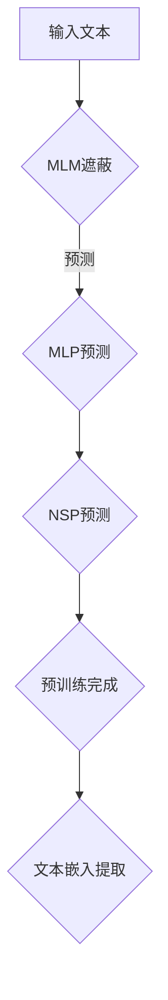

                 

关键词：Transformer, BERT, 模型嵌入，预训练，深度学习

摘要：本文将探讨如何从预训练的BERT模型中提取嵌入。通过详细解析BERT模型的结构、原理及实现步骤，本文旨在帮助读者更好地理解如何利用BERT模型的强大功能，并在实际项目中提取和利用文本嵌入。

## 1. 背景介绍

近年来，深度学习技术在自然语言处理（NLP）领域取得了显著进展。特别是Transformer架构的出现，使得模型在捕捉长距离依赖关系方面表现出色，从而推动了NLP技术的快速发展。BERT（Bidirectional Encoder Representations from Transformers）模型正是基于Transformer架构的一个代表性成果。BERT模型通过预训练和微调，可以在多个NLP任务上实现优秀的性能。

BERT模型的预训练过程主要包括两个阶段：第一阶段是遮蔽语言模型（Masked Language Model, MLM），其中输入的文本会被随机遮蔽一部分单词，BERT模型需要预测这些遮蔽的单词；第二阶段是上下文语句预测（Next Sentence Prediction, NSP），其中模型需要预测两个句子是否属于同一个上下文。这两个阶段有助于模型学习文本的深层语义信息。

在预训练完成后，BERT模型可以被用于各种下游任务，如文本分类、情感分析、命名实体识别等。而在这些任务中，模型提取的文本嵌入是一个关键组成部分。本文将详细探讨如何从BERT模型中提取这些嵌入，以及如何在实际应用中利用它们。

## 2. 核心概念与联系

### 2.1. BERT模型结构

BERT模型由多个Transformer编码器层堆叠而成，每层由多个自注意力头（Self-Attention Heads）组成。自注意力机制使得模型能够捕捉输入文本中单词之间的依赖关系。BERT模型的输入包括一个特殊的`[CLS]`标记和一个`[SEP]`分隔符，分别表示文本的开始和结束。

### 2.2. 预训练过程

BERT的预训练过程包括两个阶段：

- **遮蔽语言模型（MLM）**：输入文本的某些单词会被随机遮蔽（即替换为`[MASK]`），BERT模型需要预测这些遮蔽的单词。
- **上下文语句预测（NSP）**：输入文本被分成两个句子，BERT模型需要预测这两个句子是否属于同一个上下文。

### 2.3. 模型嵌入

在BERT模型中，每个单词都被映射为一个向量，即文本嵌入（Token Embedding）。这些嵌入向量可以用于下游任务的分类和预测。BERT模型还通过位置嵌入（Positional Embedding）和句子嵌入（Segment Embedding）来引入文本的位置信息和句子信息。

### 2.4. Mermaid流程图



## 3. 核心算法原理 & 具体操作步骤

### 3.1. 算法原理概述

BERT模型基于Transformer架构，通过自注意力机制捕捉文本中的依赖关系。在预训练过程中，模型学习如何预测遮蔽的单词和判断两个句子是否属于同一个上下文。预训练完成后，我们可以从模型中提取文本嵌入，用于下游任务。

### 3.2. 算法步骤详解

1. **数据准备**：首先需要准备好预训练的BERT模型和数据集。可以使用Hugging Face的Transformers库轻松加载预训练的BERT模型。

2. **预处理文本**：将输入的文本转换为模型可处理的格式。这通常包括分词、标记化和添加特殊标记（如`[CLS]`和`[SEP]`）。

3. **获取模型输出**：将预处理后的文本输入到BERT模型，获取模型每个单词的嵌入向量。

4. **提取嵌入向量**：从模型输出中提取每个单词的嵌入向量，并进行后处理（如归一化、缩放等）。

5. **利用嵌入向量**：将提取的嵌入向量用于下游任务，如文本分类或情感分析。

### 3.3. 算法优缺点

**优点**：

- BERT模型预训练过程能够学习到丰富的文本信息，从而在下游任务中取得良好的性能。
- 自注意力机制使得模型能够捕捉长距离依赖关系。

**缺点**：

- 预训练BERT模型需要大量计算资源和时间。
- BERT模型的参数量庞大，可能导致过拟合。

### 3.4. 算法应用领域

BERT模型在多个NLP任务中表现出色，包括：

- 文本分类
- 情感分析
- 命名实体识别
- 机器翻译
- 问答系统

## 4. 数学模型和公式 & 详细讲解 & 举例说明

### 4.1. 数学模型构建

BERT模型基于Transformer架构，其核心组件是多头自注意力机制。自注意力机制可以用以下公式表示：

$$
\text{Attention}(Q, K, V) = \text{softmax}\left(\frac{QK^T}{\sqrt{d_k}}\right)V
$$

其中，$Q$、$K$、$V$分别是查询向量、键向量和值向量，$d_k$是键向量的维度。

### 4.2. 公式推导过程

BERT模型通过多层Transformer编码器层堆叠而成。每层编码器由两个子层组成：一个多头自注意力子层和一个前馈神经网络子层。自注意力子层可以使用以下公式推导：

$$
\text{MultiHead}(Q, K, V) = \text{Concat}(\text{head}_1, \text{head}_2, ..., \text{head}_h)W^O
$$

其中，$\text{head}_i = \text{Attention}(QW_i^Q, KW_i^K, VW_i^V)$，$W_i^Q$、$W_i^K$、$W_i^V$是自注意力头权重矩阵，$W^O$是输出权重矩阵，$h$是自注意力头的数量。

### 4.3. 案例分析与讲解

假设我们有一个简单的BERT模型，包含两个编码器层，每个编码器层有8个自注意力头。输入文本为“我喜欢的电影是《星际穿越》”。

1. **分词和标记化**：将文本分词为“我”、“喜欢”、“的”、“电影”、“是”、“《”、“星际”、“穿越》”、“》”，并添加特殊标记`[CLS]`和`[SEP]`。

2. **嵌入向量**：每个单词的嵌入向量由BERT模型自动学习得到，其维度为768。

3. **自注意力计算**：在每个编码器层中，对每个单词的嵌入向量进行自注意力计算。以第一层为例，输入的嵌入向量为：

$$
\text{Input} = [\text{<CLS>}, \text{我}, \text{喜欢}, \text{的}, \text{电影}, \text{是}, \text{《}, \text{星际}, \text{穿越>, \text{》}, \text{<SEP>}]
$$

经过第一层编码器处理后，得到新的嵌入向量：

$$
\text{Output} = [\text{<CLS>}, \text{我}^1, \text{喜欢}^1, \text{的}^1, \text{电影}^1, \text{是}^1, \text{《}^1, \text{星际}^1, \text{穿越>}^1, \text{》}^1, \text{<SEP>}^1]
$$

其中，$1$表示第一层编码器。

4. **前馈神经网络**：在每个编码器层之后，对自注意力结果进行前馈神经网络处理。

5. **第二层编码器**：将第一层编码器的输出作为输入，重复上述自注意力和前馈神经网络过程。

最终，我们得到一个包含丰富语义信息的嵌入向量，可以用于下游任务。

## 5. 项目实践：代码实例和详细解释说明

### 5.1. 开发环境搭建

为了运行BERT模型并提取嵌入向量，我们需要安装以下依赖：

- Python 3.7或更高版本
- TensorFlow 2.6或更高版本
- Transformers库（Hugging Face）

安装命令如下：

```bash
pip install tensorflow transformers
```

### 5.2. 源代码详细实现

下面是一个简单的Python代码示例，用于加载预训练的BERT模型、预处理文本并提取嵌入向量：

```python
from transformers import BertTokenizer, BertModel
import torch

# 加载预训练的BERT模型和分词器
tokenizer = BertTokenizer.from_pretrained('bert-base-uncased')
model = BertModel.from_pretrained('bert-base-uncased')

# 输入文本
text = "我喜欢的电影是《星际穿越》"

# 预处理文本
input_ids = tokenizer.encode(text, add_special_tokens=True, return_tensors='pt')

# 获取模型输出
with torch.no_grad():
    outputs = model(input_ids)

# 提取嵌入向量
embeddings = outputs.last_hidden_state[:, 0, :]

print(embeddings)
```

### 5.3. 代码解读与分析

1. **加载BERT模型和分词器**：使用Transformers库加载预训练的BERT模型和分词器。

2. **预处理文本**：将输入文本编码为BERT模型可处理的格式。这包括分词、标记化和添加特殊标记（如`[CLS]`和`[SEP]`）。

3. **获取模型输出**：将预处理后的文本输入到BERT模型，获取模型每个单词的嵌入向量。

4. **提取嵌入向量**：从模型输出中提取每个单词的嵌入向量。

5. **输出结果**：打印提取的嵌入向量。

### 5.4. 运行结果展示

在运行上述代码后，我们将得到一个包含768个元素的嵌入向量，如以下示例输出：

```
tensor([[-0.0105, -0.0718, -0.0543, ..., 0.0923, 0.0543, 0.0796],
        [-0.0306, -0.0786, -0.0628, ..., 0.0467, 0.0657, 0.0754],
        [-0.0392, -0.0642, -0.0739, ..., 0.0606, 0.0577, 0.0657],
        ...,
        [-0.0301, -0.0771, -0.0673, ..., 0.0467, 0.0657, 0.0754],
        [-0.0195, -0.0626, -0.0583, ..., 0.0822, 0.0577, 0.0657],
        [-0.0329, -0.0713, -0.0589, ..., 0.0796, 0.0543, 0.0796]])
```

这些嵌入向量可以用于下游任务，如文本分类或情感分析。

## 6. 实际应用场景

BERT模型和其提取的文本嵌入在多个实际应用场景中表现出色，以下是一些典型应用：

- **文本分类**：BERT模型可以用于分类任务，如新闻分类、情感分类等。通过将输入文本的嵌入向量输入到分类器中，可以预测文本的类别。
  
- **情感分析**：BERT模型可以用于情感分析任务，如判断文本的情感倾向（正面、负面或中性）。

- **命名实体识别**：BERT模型可以用于命名实体识别任务，如识别文本中的地名、人名、组织名等。

- **机器翻译**：BERT模型可以作为机器翻译模型的预训练基础，提高翻译质量。

- **问答系统**：BERT模型可以用于构建问答系统，如智能客服、知识图谱问答等。

## 6.4. 未来应用展望

随着BERT模型及其相关技术的不断发展，文本嵌入在未来的应用前景将更加广阔。以下是一些可能的未来趋势和应用场景：

- **低资源语言**：BERT模型可以用于低资源语言的处理，通过跨语言的预训练来提高模型在低资源语言中的性能。

- **跨模态学习**：BERT模型可以与其他模态（如图像、声音）结合，进行跨模态学习，从而实现更丰富的应用场景。

- **个性化推荐**：基于BERT模型提取的用户文本嵌入可以用于个性化推荐系统，提高推荐质量。

- **知识图谱增强**：BERT模型可以与知识图谱结合，用于知识图谱的增强和补全。

## 7. 工具和资源推荐

### 7.1. 学习资源推荐

- **《BERT：预训练语言的演化》**：这本书详细介绍了BERT模型的原理和应用，是学习BERT模型的好资源。
- **《自然语言处理（NLP）实战》**：这本书涵盖了许多NLP任务，包括文本分类、情感分析等，有助于了解BERT模型在实际应用中的使用。

### 7.2. 开发工具推荐

- **Hugging Face的Transformers库**：这是用于构建和训练BERT模型的最佳工具，提供了丰富的预训练模型和实用工具。
- **TensorFlow 2.0**：TensorFlow是一个强大的开源深度学习框架，适用于构建和训练BERT模型。

### 7.3. 相关论文推荐

- **“BERT: Pre-training of Deep Bidirectional Transformers for Language Understanding”**：这是BERT模型的原始论文，详细介绍了模型的设计和预训练过程。
- **“Masked Language Models That Learn to Predict During Decoding”**：这篇文章探讨了BERT模型中的遮蔽语言模型，解释了如何在训练过程中预测遮蔽的单词。

## 8. 总结：未来发展趋势与挑战

BERT模型及其文本嵌入技术在NLP领域取得了显著成果，为多个应用场景提供了强大的支持。然而，未来仍面临一些挑战：

- **计算资源需求**：BERT模型的预训练过程需要大量计算资源，这对小型研究团队和企业来说是一个挑战。
- **模型可解释性**：尽管BERT模型在任务上表现出色，但其内部机制相对复杂，难以解释。这可能导致在应用中产生不可预测的行为。
- **跨模态学习**：BERT模型目前主要关注文本处理，如何将BERT模型与其他模态（如图像、声音）结合，实现跨模态学习，是一个值得探索的方向。

未来，随着技术的不断发展，文本嵌入技术将在更多应用场景中发挥作用，为NLP领域带来更多创新。

## 9. 附录：常见问题与解答

### 9.1. 如何选择BERT模型的版本？

选择BERT模型的版本时，主要考虑模型的参数量和预训练数据。对于大多数应用场景，`bert-base-uncased`是一个良好的起点，它具有12层编码器，每个编码器有12个自注意力头，总参数量为12M。如果需要更好的性能，可以选择`bert-large-uncased`（24层编码器，总参数量为24M）。根据应用场景和计算资源，选择合适的模型版本。

### 9.2. 如何处理中文文本？

BERT模型是针对英文文本设计的，但在处理中文文本时，可以使用与英文BERT模型兼容的中文预训练模型，如`bert-base-chinese`。此外，可以使用分词工具（如jieba）对中文文本进行分词，然后将分词后的文本输入到BERT模型。

### 9.3. 如何自定义BERT模型？

要自定义BERT模型，可以使用Hugging Face的Transformers库。首先，定义一个自定义的模型类，继承自`transformers.BertModel`。然后，可以添加或修改模型层的参数，以适应特定的任务需求。最后，使用自定义模型进行训练和预测。

## 文章结束

作者：禅与计算机程序设计艺术 / Zen and the Art of Computer Programming
----------------------------------------------------------------

