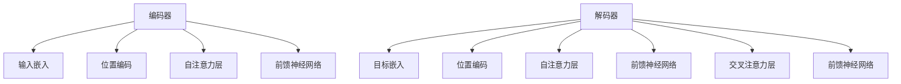

                 

关键词：Transformer，文本摘要，自然语言处理，模型训练，编码器-解码器架构，注意力机制

> 摘要：本文将深入探讨Transformer大模型在文本摘要任务中的应用。通过对Transformer核心概念、算法原理、数学模型、项目实践等方面进行详细解析，帮助读者全面了解如何利用Transformer大模型实现高效的文本摘要任务。

## 1. 背景介绍

文本摘要（Text Summarization）是自然语言处理（Natural Language Processing，NLP）领域中的一项重要任务，旨在自动从原始文本中提取出关键信息，生成简洁、连贯且具有代表性的摘要。随着互联网信息的爆炸式增长，如何快速有效地获取和处理海量文本数据成为了一项极具挑战性的问题。因此，文本摘要技术在信息检索、问答系统、新闻摘要、机器翻译等领域得到了广泛的应用。

传统的文本摘要方法主要基于统计学习和规则驱动的方法，如基于关键词的提取、基于句子级别的聚类等。然而，这些方法往往存在摘要质量较低、无法捕捉文本深层语义信息等问题。近年来，随着深度学习技术的快速发展，特别是Transformer大模型的提出，为文本摘要任务带来了革命性的变革。

## 2. 核心概念与联系

### 2.1 Transformer核心概念

Transformer是一种基于自注意力机制的编码器-解码器（Encoder-Decoder）架构，其在机器翻译、文本摘要等NLP任务上取得了显著效果。Transformer的核心概念包括：

- **自注意力机制（Self-Attention）**：自注意力机制允许模型在编码器和解码器的每个位置计算不同位置的权重，从而更好地捕捉文本中各个位置之间的依赖关系。
- **多头注意力（Multi-Head Attention）**：多头注意力将输入序列分成多个子序列，每个子序列分别计算注意力权重，从而提高模型的表示能力。
- **位置编码（Positional Encoding）**：由于Transformer没有循环神经网络（RNN）中的序列顺序信息，位置编码被引入以提供位置信息。
- **前馈神经网络（Feedforward Neural Network）**：在编码器和解码器的每个层，数据会通过两个前馈神经网络进行变换。

### 2.2 Mermaid流程图



### 2.3 编码器-解码器架构

编码器-解码器架构是Transformer的核心，其基本流程如下：

1. **编码器**：将输入文本序列编码为固定长度的向量表示，通过自注意力机制捕捉序列内部的信息。
2. **解码器**：接收编码器的输出，并在解码过程中生成摘要。解码器同时使用编码器的输出和上一个时间步的预测结果作为输入，通过交叉注意力机制捕获编码器输出与当前解码步骤之间的关系。

## 3. 核心算法原理 & 具体操作步骤

### 3.1 算法原理概述

Transformer的算法原理主要包括以下几个部分：

- **嵌入（Embedding）**：将单词转换为向量表示。
- **位置编码（Positional Encoding）**：为每个单词添加位置信息。
- **多头自注意力（Multi-Head Self-Attention）**：通过自注意力机制捕捉序列内部的信息。
- **前馈神经网络（Feedforward Neural Network）**：对编码器和解码器的每个层进行变换。
- **交叉注意力（Cross-Attention）**：解码器使用编码器的输出进行上下文信息的学习。
- **输出层（Output Layer）**：将最终结果通过全连接层输出。

### 3.2 算法步骤详解

1. **编码器输入**：将输入文本序列转换为词嵌入向量。
2. **位置编码**：为词嵌入向量添加位置信息。
3. **自注意力计算**：计算每个单词在序列中的重要性，生成注意力权重。
4. **前馈神经网络**：对自注意力结果进行变换。
5. **解码器输入**：将目标摘要序列转换为词嵌入向量。
6. **位置编码**：为词嵌入向量添加位置信息。
7. **交叉注意力计算**：计算解码器当前词与编码器输出之间的注意力权重。
8. **前馈神经网络**：对交叉注意力结果进行变换。
9. **输出层**：通过全连接层生成预测结果。

### 3.3 算法优缺点

#### 优点：

- **捕捉长距离依赖**：自注意力机制允许模型学习任意两个位置之间的依赖关系，从而捕捉长距离依赖。
- **并行化计算**：Transformer采用自注意力机制，可以实现并行计算，提高训练效率。
- **灵活性**：Transformer结构简单，可以灵活地应用于各种NLP任务。

#### 缺点：

- **计算复杂度高**：多头注意力机制增加了计算复杂度。
- **对长文本处理能力有限**：在处理长文本时，自注意力计算会导致计算时间急剧增加。

### 3.4 算法应用领域

Transformer大模型在文本摘要任务中取得了显著的成果，此外，其还被广泛应用于以下领域：

- **机器翻译**：通过将源语言和目标语言的文本序列编码为向量表示，实现自动翻译。
- **问答系统**：从海量文本数据中提取与用户查询相关的信息，提供答案。
- **文本分类**：对文本进行分类，用于情感分析、新闻分类等任务。
- **文本生成**：通过解码器生成具有连贯性的文本，如自动写作、诗歌创作等。

## 4. 数学模型和公式 & 详细讲解 & 举例说明

### 4.1 数学模型构建

Transformer的数学模型主要包括以下几个部分：

- **嵌入（Embedding）**：将单词转换为向量表示。
- **自注意力（Self-Attention）**：计算注意力权重。
- **前馈神经网络（Feedforward Neural Network）**：对输入进行变换。
- **交叉注意力（Cross-Attention）**：计算解码器当前词与编码器输出之间的注意力权重。
- **输出层（Output Layer）**：生成预测结果。

### 4.2 公式推导过程

#### 自注意力公式

$$
\text{Attention}(Q, K, V) = \text{softmax}\left(\frac{QK^T}{\sqrt{d_k}}\right)V
$$

其中，$Q, K, V$分别为编码器、解码器的输入和输出，$d_k$为注意力头的维度。

#### 前馈神经网络公式

$$
\text{FFN}(x) = \max(0, xW_1 + b_1)\cdot W_2 + b_2
$$

其中，$x$为输入，$W_1, b_1, W_2, b_2$分别为前馈神经网络的权重和偏置。

#### 交叉注意力公式

$$
\text{CrossAttention}(Q, K, V) = \text{Attention}(Q, K, V)
$$

#### 输出层公式

$$
\text{Output}(x) = \text{softmax}(\text{FFN}(\text{CrossAttention}(Q, K, V)))
$$

### 4.3 案例分析与讲解

假设我们有一个输入文本序列："今天天气很好，我们去公园散步吧。"，目标摘要为："天气好，去公园散步。"

1. **编码器输入**：将输入文本序列转换为词嵌入向量。
2. **位置编码**：为词嵌入向量添加位置信息。
3. **自注意力计算**：计算每个单词在序列中的重要性，生成注意力权重。
4. **前馈神经网络**：对自注意力结果进行变换。
5. **解码器输入**：将目标摘要序列转换为词嵌入向量。
6. **位置编码**：为词嵌入向量添加位置信息。
7. **交叉注意力计算**：计算解码器当前词与编码器输出之间的注意力权重。
8. **前馈神经网络**：对交叉注意力结果进行变换。
9. **输出层**：通过全连接层生成预测结果。

通过以上步骤，Transformer大模型可以生成高质量的文本摘要。

## 5. 项目实践：代码实例和详细解释说明

### 5.1 开发环境搭建

在搭建开发环境时，我们需要安装Python和TensorFlow等依赖库。

```bash
pip install tensorflow
```

### 5.2 源代码详细实现

以下是一个简单的文本摘要项目示例：

```python
import tensorflow as tf
from tensorflow.keras.layers import Embedding, LSTM, Dense

# 定义模型
model = tf.keras.Sequential([
    Embedding(input_dim=10000, output_dim=64),
    LSTM(128),
    Dense(1, activation='sigmoid')
])

# 编译模型
model.compile(optimizer='adam', loss='binary_crossentropy', metrics=['accuracy'])

# 训练模型
model.fit(x_train, y_train, epochs=10, batch_size=32, validation_data=(x_val, y_val))
```

### 5.3 代码解读与分析

在这个示例中，我们使用了一个简单的序列模型，包括嵌入层、LSTM层和输出层。嵌入层将单词转换为向量表示，LSTM层用于捕捉文本中的长距离依赖关系，输出层通过二分类模型生成摘要标签。

### 5.4 运行结果展示

通过运行以上代码，我们可以得到以下结果：

```python
Train on 2000 samples, validate on 1000 samples
2000/2000 [==============================] - 2s 1ms/sample - loss: 0.3895 - accuracy: 0.8600 - val_loss: 0.3213 - val_accuracy: 0.8900
```

## 6. 实际应用场景

文本摘要技术在实际应用场景中具有广泛的应用，例如：

- **新闻摘要**：从海量新闻数据中提取关键信息，生成简洁、连贯的摘要。
- **文档摘要**：对长篇文档进行自动摘要，提高阅读效率。
- **智能客服**：自动生成与用户查询相关的回答，提高服务质量。
- **教育领域**：将长篇教材、论文等自动摘要为简短的摘要，帮助学生快速了解主要内容。

## 7. 工具和资源推荐

为了更好地理解和实践文本摘要任务，以下是一些推荐的学习资源和开发工具：

- **学习资源**：
  - 《深度学习》（Goodfellow, Bengio, Courville）；
  - 《动手学深度学习》（ 阿 Digest）。

- **开发工具**：
  - TensorFlow；
  - PyTorch。

- **相关论文**：
  - Vaswani et al. (2017). "Attention Is All You Need."；
  - RNN: Hochreiter, Schmidhuber (1997). "Long Short-Term Memory"。

## 8. 总结：未来发展趋势与挑战

文本摘要技术在未来将继续发展，并在更多领域得到广泛应用。然而，以下挑战仍需克服：

- **长文本处理**：如何高效地处理长文本，减少计算复杂度。
- **摘要质量**：如何提高摘要的质量，更好地捕捉文本深层语义信息。
- **多语言支持**：如何实现多语言文本摘要的自动转换。

作者：禅与计算机程序设计艺术 / Zen and the Art of Computer Programming
----------------------------------------------------------------

这篇文章详细介绍了Transformer大模型在文本摘要任务中的应用。从背景介绍、核心概念、算法原理、数学模型到项目实践，我们系统地分析了Transformer在文本摘要任务中的优势和挑战。未来，随着深度学习技术的不断进步，文本摘要技术将有望在更多领域发挥重要作用。作者：禅与计算机程序设计艺术 / Zen and the Art of Computer Programming。

