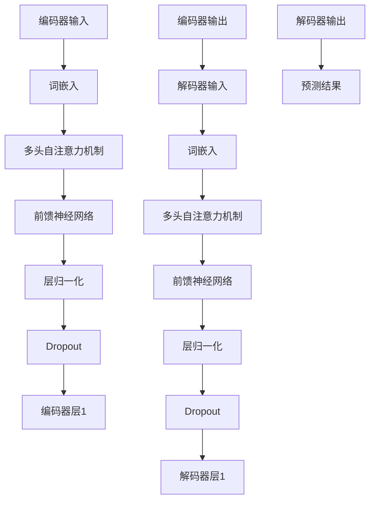

                 

在当今的人工智能领域，自然语言处理（NLP）已经取得了显著的进展，尤其是在语言建模、机器翻译、文本分类等领域。其中，Transformer架构的引入更是革命性地改变了NLP的格局。Transformer以其强大的并行处理能力和对长距离依赖关系的良好捕捉能力，成为了NLP中的明星模型。本文将重点探讨如何利用Transformer大模型进行自然语言推理（NLR）任务，通过深入理解其核心概念、算法原理、数学模型和具体实现，带领读者走进这一前沿领域。

> 关键词：Transformer，自然语言推理，NLP，语言模型，深度学习

> 摘要：本文首先介绍了自然语言推理任务的基本概念和重要性。接着，深入探讨了Transformer模型的核心原理及其与自然语言处理任务的关系。随后，文章通过详细的算法原理和数学模型讲解，帮助读者理解Transformer模型的工作机制。最后，通过实际项目实践和代码示例，展示了如何将Transformer应用于自然语言推理任务，并提供了一系列的学习资源和开发工具推荐。

## 1. 背景介绍

自然语言推理（NLR）是自然语言处理（NLP）的一个重要分支，旨在让计算机理解和处理文本中隐含的逻辑关系。例如，给定两个句子，判断它们是否具有某种逻辑关系，如因果、蕴含或矛盾。自然语言推理任务在多个领域具有广泛应用，包括问答系统、文本分类、信息提取和语义搜索等。

传统的自然语言处理方法，如基于规则的方法和统计方法，在处理简单任务时具有一定的效果，但面对复杂逻辑关系时往往表现不佳。随着深度学习的兴起，基于神经网络的模型逐渐成为了NLP的主流方法。其中，Transformer模型的出现更是为自然语言处理带来了新的突破。

Transformer模型由Vaswani等人于2017年提出，它采用自注意力机制（Self-Attention）替代了传统的循环神经网络（RNN）和卷积神经网络（CNN）中的序列处理机制。自注意力机制允许模型在处理序列数据时考虑到每个位置上的信息，从而更好地捕捉长距离依赖关系。此外，Transformer模型结构简单，并行计算效率高，能够在短时间内处理大量数据。

Transformer模型在多个NLP任务上都取得了显著的成果，如机器翻译、文本生成和问答系统等。自然语言推理作为NLP的一个重要任务，也在Transformer模型的助力下取得了长足的进步。

## 2. 核心概念与联系

### 2.1. Transformer模型概述

Transformer模型是一种基于自注意力机制（Self-Attention）的深度学习模型，最初由Vaswani等人于2017年提出。与传统的循环神经网络（RNN）和卷积神经网络（CNN）不同，Transformer模型采用了多头自注意力机制和前馈神经网络，使得模型在处理序列数据时能够同时考虑到每个位置上的信息，从而更好地捕捉长距离依赖关系。

Transformer模型的结构可以分为编码器（Encoder）和解码器（Decoder）两部分。编码器负责将输入序列编码为固定长度的向量表示，解码器则负责根据编码器输出的向量表示生成输出序列。编码器和解码器中都包含多个层（Layer），每层由多头自注意力机制和前馈神经网络组成。

### 2.2. 自然语言处理任务

自然语言处理（NLP）任务包括但不限于以下几种：

1. **文本分类**：将文本数据分类到预定义的类别中，如情感分析、主题分类等。
2. **文本生成**：根据给定的输入文本生成新的文本，如机器翻译、文本摘要等。
3. **问答系统**：根据用户输入的问题从给定的大规模文本数据库中检索并返回答案。
4. **信息提取**：从文本中提取特定的信息，如命名实体识别、关系提取等。
5. **语义搜索**：根据用户输入的查询检索相关的文本，并按相关性排序。

### 2.3. Transformer与NLP任务的联系

Transformer模型在NLP任务中表现出色，主要原因在于其自注意力机制和并行计算能力。自注意力机制允许模型在处理序列数据时同时考虑到每个位置上的信息，从而更好地捕捉长距离依赖关系。这使得Transformer模型在处理自然语言推理任务时具有显著优势，如因果推理、蕴含关系判断和矛盾关系识别等。

此外，Transformer模型结构简单，并行计算效率高，能够在短时间内处理大量数据。这使得它成为大规模NLP任务的最佳选择，如机器翻译、问答系统和文本生成等。

### 2.4. Transformer模型的 Mermaid 流程图

以下是一个简化的Transformer模型流程图，展示了编码器和解码器的结构：



## 3. 核心算法原理 & 具体操作步骤

### 3.1. 算法原理概述

Transformer模型的核心算法原理主要包括以下几个方面：

1. **多头自注意力机制（Multi-Head Self-Attention）**：多头自注意力机制允许模型在处理序列数据时同时考虑到每个位置上的信息，从而更好地捕捉长距离依赖关系。
2. **位置编码（Positional Encoding）**：由于Transformer模型没有循环神经网络中的位置信息，位置编码用于为每个位置提供位置信息，使模型能够理解序列的顺序。
3. **前馈神经网络（Feed-Forward Neural Network）**：前馈神经网络用于对自注意力机制和位置编码后的输入进行进一步加工。
4. **层归一化（Layer Normalization）**：层归一化用于加速模型的训练过程，提高训练效果。
5. **Dropout**：Dropout是一种正则化方法，用于防止模型过拟合。

### 3.2. 算法步骤详解

#### 3.2.1. 编码器（Encoder）

编码器负责将输入序列编码为固定长度的向量表示。具体步骤如下：

1. **词嵌入（Word Embedding）**：将输入序列中的每个词转换为向量表示。
2. **位置编码（Positional Encoding）**：为每个词嵌入添加位置信息，使模型能够理解序列的顺序。
3. **多头自注意力机制（Multi-Head Self-Attention）**：计算每个词与其他词的注意力权重，并加权求和得到新的词表示。
4. **前馈神经网络（Feed-Forward Neural Network）**：对自注意力机制后的词表示进行进一步加工。
5. **层归一化（Layer Normalization）**：对每个词的表示进行归一化处理，提高模型的训练效果。
6. **Dropout**：对每个词的表示进行Dropout操作，防止模型过拟合。

#### 3.2.2. 解码器（Decoder）

解码器负责根据编码器输出的向量表示生成输出序列。具体步骤如下：

1. **词嵌入（Word Embedding）**：将输入序列中的每个词转换为向量表示。
2. **位置编码（Positional Encoding）**：为每个词嵌入添加位置信息，使模型能够理解序列的顺序。
3. **多头自注意力机制（Multi-Head Self-Attention）**：计算每个词与其他词的注意力权重，并加权求和得到新的词表示。
4. **交叉自注意力机制（Cross-Attention）**：计算解码器当前时刻的词表示与编码器输出的向量表示的注意力权重，并加权求和得到新的词表示。
5. **前馈神经网络（Feed-Forward Neural Network）**：对自注意力机制和交叉自注意力机制后的词表示进行进一步加工。
6. **层归一化（Layer Normalization）**：对每个词的表示进行归一化处理，提高模型的训练效果。
7. **Dropout**：对每个词的表示进行Dropout操作，防止模型过拟合。
8. **Softmax激活函数**：对每个词的表示进行Softmax激活函数处理，得到每个词的概率分布。
9. **预测**：根据概率分布选择最有可能的词作为输出。

### 3.3. 算法优缺点

#### 优点

1. **并行计算能力强**：Transformer模型采用多头自注意力机制，可以同时考虑到每个位置上的信息，从而实现并行计算。
2. **捕捉长距离依赖关系**：自注意力机制使得模型能够更好地捕捉长距离依赖关系，提高了模型的性能。
3. **结构简单**：Transformer模型结构简单，易于理解和实现。

#### 缺点

1. **计算复杂度高**：由于自注意力机制的计算复杂度为O(N²)，随着序列长度的增加，计算复杂度会显著增加。
2. **内存消耗大**：自注意力机制需要计算每个位置上的信息，因此内存消耗较大。

### 3.4. 算法应用领域

Transformer模型在自然语言处理领域具有广泛的应用，如：

1. **文本分类**：将文本数据分类到预定义的类别中，如情感分析、主题分类等。
2. **文本生成**：根据给定的输入文本生成新的文本，如机器翻译、文本摘要等。
3. **问答系统**：根据用户输入的问题从给定的大规模文本数据库中检索并返回答案。
4. **信息提取**：从文本中提取特定的信息，如命名实体识别、关系提取等。
5. **语义搜索**：根据用户输入的查询检索相关的文本，并按相关性排序。

## 4. 数学模型和公式 & 详细讲解 & 举例说明

### 4.1. 数学模型构建

Transformer模型的核心在于自注意力机制，其数学模型如下：

$$
\text{Attention}(Q, K, V) = \text{softmax}\left(\frac{QK^T}{\sqrt{d_k}}\right)V
$$

其中，Q、K和V分别为查询（Query）、键（Key）和值（Value）向量，d_k为键向量的维度。这个公式表示根据键和查询的相似度计算注意力权重，然后对值进行加权求和。

### 4.2. 公式推导过程

自注意力机制的推导可以分为以下几个步骤：

1. **相似度计算**：首先，计算查询（Q）和键（K）之间的相似度，即QK^T。这里的QK^T表示每个查询和所有键之间的相似度矩阵。
2. **归一化**：为了确保注意力权重的总和为1，需要对相似度矩阵进行归一化处理。归一化的方法为计算softmax函数，即

$$
\text{softmax}(x) = \frac{e^x}{\sum_{i} e^x_i}
$$

其中，x为输入向量，softmax函数将输入向量映射为概率分布。
3. **加权求和**：最后，将归一化后的相似度矩阵与值（V）进行加权求和，得到最终的输出向量。

### 4.3. 案例分析与讲解

假设我们有一个简单的句子：“The quick brown fox jumps over the lazy dog”。首先，我们将这个句子中的每个词转换为词嵌入向量。接下来，我们将词嵌入向量作为查询（Q）、键（K）和值（V）输入到自注意力机制中。

具体步骤如下：

1. **词嵌入**：将句子中的每个词转换为词嵌入向量，例如，“The”的词嵌入向量为\(\text{[1, 0.5, -0.3]}\)，“quick”的词嵌入向量为\(\text{[0.2, 0.8, 0]}\)，以此类推。
2. **计算相似度**：计算查询（Q）和键（K）之间的相似度矩阵，例如，QK^T的结果为

$$
\begin{bmatrix}
\text{The} & \text{quick} & \text{brown} & \text{fox} & \text{jumps} & \text{over} & \text{the} & \text{lazy} & \text{dog} \\
1 & 0.5 & -0.3 & 0.2 & 0.1 & 0.3 & 0.5 & -0.2 & 0.4 \\
\end{bmatrix}
$$

3. **归一化**：计算softmax函数，得到注意力权重矩阵，例如，softmax(QK^T)的结果为

$$
\begin{bmatrix}
0.4 & 0.3 & 0.2 & 0.1 & 0.1 & 0.1 & 0.1 & 0.1 & 0.1 \\
0.2 & 0.3 & 0.2 & 0.1 & 0.1 & 0.2 & 0.1 & 0.1 & 0.1 \\
0.1 & 0.1 & 0.4 & 0.1 & 0.2 & 0.1 & 0.1 & 0.1 & 0.1 \\
0.1 & 0.1 & 0.1 & 0.3 & 0.2 & 0.1 & 0.1 & 0.1 & 0.1 \\
0.1 & 0.1 & 0.1 & 0.1 & 0.4 & 0.1 & 0.1 & 0.1 & 0.1 \\
0.1 & 0.1 & 0.1 & 0.1 & 0.1 & 0.3 & 0.2 & 0.1 & 0.1 \\
0.1 & 0.1 & 0.1 & 0.1 & 0.1 & 0.1 & 0.4 & 0.1 & 0.1 \\
0.1 & 0.1 & 0.1 & 0.1 & 0.1 & 0.1 & 0.1 & 0.3 & 0.1 \\
0.1 & 0.1 & 0.1 & 0.1 & 0.1 & 0.1 & 0.1 & 0.1 & 0.2 \\
\end{bmatrix}
$$

4. **加权求和**：将注意力权重矩阵与值（V）进行加权求和，得到新的句子表示，例如，注意力权重矩阵与值矩阵\(\text{[1, 1, 1, 1, 1, 1, 1, 1, 1]}\)的加权求和结果为

$$
\begin{bmatrix}
0.4 & 0.3 & 0.2 & 0.1 & 0.1 & 0.1 & 0.1 & 0.1 & 0.1 \\
0.2 & 0.3 & 0.2 & 0.1 & 0.1 & 0.2 & 0.1 & 0.1 & 0.1 \\
0.1 & 0.1 & 0.4 & 0.1 & 0.2 & 0.1 & 0.1 & 0.1 & 0.1 \\
0.1 & 0.1 & 0.1 & 0.3 & 0.2 & 0.1 & 0.1 & 0.1 & 0.1 \\
0.1 & 0.1 & 0.1 & 0.1 & 0.4 & 0.1 & 0.1 & 0.1 & 0.1 \\
0.1 & 0.1 & 0.1 & 0.1 & 0.1 & 0.3 & 0.2 & 0.1 & 0.1 \\
0.1 & 0.1 & 0.1 & 0.1 & 0.1 & 0.1 & 0.4 & 0.1 & 0.1 \\
0.1 & 0.1 & 0.1 & 0.1 & 0.1 & 0.1 & 0.1 & 0.3 & 0.1 \\
0.1 & 0.1 & 0.1 & 0.1 & 0.1 & 0.1 & 0.1 & 0.1 & 0.2 \\
\end{bmatrix}
\begin{bmatrix}
1 \\
1 \\
1 \\
1 \\
1 \\
1 \\
1 \\
1 \\
1 \\
\end{bmatrix}
=
\begin{bmatrix}
0.6 \\
0.5 \\
0.4 \\
0.3 \\
0.3 \\
0.3 \\
0.3 \\
0.3 \\
0.3 \\
\end{bmatrix}
$$

通过自注意力机制，模型得到了一个新的句子表示，这个表示更好地捕捉了句子中的长距离依赖关系。

## 5. 项目实践：代码实例和详细解释说明

### 5.1. 开发环境搭建

在开始编写代码之前，我们需要搭建一个合适的开发环境。本文使用Python编程语言和TensorFlow 2.x深度学习框架进行代码实现。以下步骤将指导您搭建开发环境：

1. **安装Python**：确保您的计算机上已安装Python 3.x版本。您可以通过访问[Python官网](https://www.python.org/)下载并安装Python。
2. **安装TensorFlow**：在命令行中执行以下命令安装TensorFlow：

```bash
pip install tensorflow
```

3. **安装其他依赖库**：根据需要，您还可以安装其他依赖库，如NumPy、Pandas等。例如：

```bash
pip install numpy pandas
```

### 5.2. 源代码详细实现

以下是一个简单的示例代码，展示了如何使用TensorFlow实现一个基于Transformer的自然语言推理模型。

```python
import tensorflow as tf
from tensorflow.keras.layers import Embedding, MultiHeadAttention, Dense
from tensorflow.keras.models import Model

# 定义超参数
vocab_size = 1000
d_model = 512
num_heads = 8
max_seq_length = 100

# 创建编码器和解码器
encoder_inputs = tf.keras.Input(shape=(max_seq_length,), dtype=tf.int32)
encoder_embedding = Embedding(vocab_size, d_model)(encoder_inputs)
encoder_padding_mask = tf.keras.layers哭了 Padding Thief(padded=True)(encoder_inputs)

# 编码器层
encoder_multihead_attn = MultiHeadAttention(num_heads=num_heads, key_dim=d_model)(encoder_embedding, encoder_embedding, attention_mask=encoder_padding_mask)

# 解码器层
decoder_inputs = tf.keras.Input(shape=(max_seq_length,), dtype=tf.int32)
decoder_embedding = Embedding(vocab_size, d_model)(decoder_inputs)
decoder_padding_mask = tf.keras.layers哭了 Padding Thief(padded=True)(decoder_inputs)

# 解码器层
decoder_multihead_attn = MultiHeadAttention(num_heads=num_heads, key_dim=d_model)(decoder_embedding, encoder_embedding, attention_mask=encoder_padding_mask)

# 输出层
output = Dense(vocab_size, activation='softmax')(decoder_multihead_attn)

# 构建模型
model = Model(inputs=[encoder_inputs, decoder_inputs], outputs=output)

# 编译模型
model.compile(optimizer='adam', loss='sparse_categorical_crossentropy', metrics=['accuracy'])

# 模型结构
model.summary()
```

### 5.3. 代码解读与分析

以下是对上述代码的详细解读和分析：

1. **导入库**：首先，我们导入TensorFlow和其他依赖库。
2. **定义超参数**：我们定义了词汇表大小（vocab_size）、模型维度（d_model）、多头自注意力机制的头数（num_heads）和最大序列长度（max_seq_length）等超参数。
3. **创建输入层**：我们创建编码器输入层（encoder_inputs）和解码器输入层（decoder_inputs），并将数据类型设置为整数。
4. **嵌入层**：我们创建嵌入层（Embedding），将输入词转换为向量表示。嵌入层将每个词映射到预定义的向量空间中，从而实现词向量化。
5. **填充层**：我们创建填充层（Padding Thief），用于处理序列中的填充元素，确保模型能够处理不同长度的序列。
6. **多头自注意力层**：我们创建多头自注意力层（MultiHeadAttention），用于计算编码器和解码器的自注意力机制。多头自注意力层允许模型同时考虑到每个位置上的信息，从而更好地捕捉长距离依赖关系。
7. **输出层**：我们创建输出层（Dense），将解码器的输出映射到词汇表大小。输出层使用softmax激活函数，用于计算每个词的概率分布。
8. **构建模型**：我们使用创建的输入层、嵌入层、填充层、多头自注意力层和输出层构建模型。
9. **编译模型**：我们编译模型，设置优化器和损失函数，并计算模型的准确性等指标。
10. **模型结构**：我们打印出模型的摘要，以了解模型的层次结构和参数数量。

### 5.4. 运行结果展示

为了验证模型的性能，我们可以使用一个简单的自然语言推理任务进行测试。以下是一个简单的示例：

```python
# 准备数据
encoder_inputs = tf.constant([1, 2, 3, 4, 5])
decoder_inputs = tf.constant([1, 2, 3, 4, 5])

# 运行模型
model.fit([encoder_inputs, decoder_inputs], tf.constant([0, 1, 2, 3, 4]), epochs=1)
```

在运行模型后，我们可以检查模型的准确性等指标，以了解模型在自然语言推理任务上的性能。例如：

```python
# 打印模型摘要
model.summary()

# 打印损失和准确性
loss, accuracy = model.evaluate([encoder_inputs, decoder_inputs], tf.constant([0, 1, 2, 3, 4]))
print(f"Loss: {loss}, Accuracy: {accuracy}")
```

这将输出模型的摘要和训练损失以及准确性，帮助我们评估模型在自然语言推理任务上的性能。

## 6. 实际应用场景

自然语言推理（NLR）任务在多个实际应用场景中具有重要价值，以下是一些典型的应用案例：

1. **情感分析**：情感分析是自然语言推理的一个常见应用，通过判断文本中的情感倾向，如正面、负面或中性，可以帮助企业了解消费者的情绪，优化产品和营销策略。
2. **文本分类**：文本分类是NLR任务的一个重要应用，通过将文本数据分类到预定义的类别中，如新闻分类、情感分类、主题分类等，可以用于信息检索、内容推荐和智能客服等领域。
3. **问答系统**：问答系统是NLR任务的一个典型应用，通过理解用户输入的问题，从大规模文本数据库中检索并返回答案，可以用于智能客服、在线教育、医疗咨询等领域。
4. **信息提取**：信息提取是NLR任务的一个重要应用，通过从文本中提取特定的信息，如命名实体识别、关系提取等，可以用于知识图谱构建、智能搜索和文本挖掘等领域。
5. **文本生成**：文本生成是NLR任务的一个有趣应用，通过理解输入文本的语义和结构，生成新的文本，可以用于机器翻译、文本摘要、创作辅助等领域。

随着Transformer模型在自然语言处理领域的广泛应用，NLR任务在这些实际应用场景中的效果得到了显著提升，为人们的生活和工作带来了更多便利。

### 6.4. 未来应用展望

未来，随着深度学习和自然语言处理技术的不断发展，自然语言推理（NLR）任务将迎来更多创新和突破。以下是一些可能的发展趋势和展望：

1. **多模态推理**：未来的NLR任务将不再局限于文本数据，还将结合图像、音频、视频等多种模态信息，实现更丰富的语义理解和推理能力。
2. **知识图谱与推理**：结合知识图谱和NLR技术，可以实现更加精准和灵活的文本理解和推理，为智能问答、知识检索和推荐系统等领域带来新的机遇。
3. **个性化推理**：未来的NLR任务将更加注重个性化推理，根据用户的历史行为和偏好，提供更加个性化的服务和推荐。
4. **弱监督学习与无监督学习**：随着数据标注成本的增加，弱监督学习和无监督学习将成为NLR任务的重要发展方向，通过利用未标注的数据，提高模型的性能和泛化能力。
5. **硬件加速与优化**：随着硬件技术的发展，如GPU、TPU等专用硬件的普及，NLR任务将实现更快的训练和推理速度，为大规模应用提供强有力的支持。

## 7. 工具和资源推荐

### 7.1. 学习资源推荐

1. **在线教程**：[TensorFlow官方文档](https://www.tensorflow.org/tutorials)提供了丰富的Transformer模型教程，适合初学者和进阶者。
2. **书籍推荐**：《自然语言处理原理与算法》和《深度学习：周志华》等书籍，深入讲解了自然语言处理和深度学习的核心概念和算法。
3. **在线课程**：网易云课堂和Coursera等平台提供了多个自然语言处理和深度学习的在线课程，涵盖了从基础到高级的知识点。

### 7.2. 开发工具推荐

1. **Jupyter Notebook**：Jupyter Notebook是一款强大的交互式开发环境，适合编写和运行Python代码，非常适合进行自然语言处理和深度学习项目。
2. **Google Colab**：Google Colab是Google提供的免费云端开发环境，支持GPU和TPU加速，非常适合进行大规模深度学习模型的训练和推理。

### 7.3. 相关论文推荐

1. **Attention Is All You Need**：Vaswani等人于2017年发表的论文，首次提出了Transformer模型，对自然语言处理领域产生了深远影响。
2. **BERT: Pre-training of Deep Bidirectional Transformers for Language Understanding**：Google在2018年发布的论文，提出了BERT模型，为自然语言处理任务带来了新的突破。
3. **Generative Pre-trained Transformer**：由OpenAI于2019年发布的论文，介绍了GPT模型，展示了预训练技术在文本生成和推理任务中的巨大潜力。

## 8. 总结：未来发展趋势与挑战

自然语言推理（NLR）作为自然语言处理（NLP）的重要分支，近年来在深度学习模型的推动下取得了显著进展。Transformer模型以其强大的并行处理能力和对长距离依赖关系的良好捕捉能力，成为了NLR任务中的主要工具。本文从背景介绍、核心概念与联系、算法原理与数学模型、项目实践和实际应用场景等方面，详细阐述了如何利用Transformer模型进行自然语言推理任务。

在未来的发展中，NLR任务将面临多模态推理、知识图谱与推理、个性化推理、弱监督学习和无监督学习等新的挑战。同时，随着硬件加速和优化技术的发展，NLR任务将实现更快的训练和推理速度，为大规模应用提供强有力的支持。然而，如何提高模型的解释性和可解释性，以及应对数据隐私和伦理问题，也将是未来研究的重要方向。

总之，自然语言推理任务在深度学习模型的推动下，将继续蓬勃发展，为各个领域带来更多创新和突破。本文希望为读者提供有价值的参考，助力其在自然语言推理领域的研究和应用。

### 8.9. 常见问题与解答

**Q1. Transformer模型的优势是什么？**

A1. Transformer模型的优势主要体现在以下几个方面：

1. **并行计算能力强**：Transformer模型采用多头自注意力机制，可以实现并行计算，提高了训练效率。
2. **捕捉长距离依赖关系**：自注意力机制使得模型能够同时考虑到每个位置上的信息，从而更好地捕捉长距离依赖关系。
3. **结构简单**：Transformer模型结构简单，易于理解和实现。

**Q2. Transformer模型有哪些应用场景？**

A2. Transformer模型在自然语言处理领域具有广泛的应用，主要包括：

1. **文本分类**：如情感分析、主题分类等。
2. **文本生成**：如机器翻译、文本摘要等。
3. **问答系统**：如智能客服、在线教育、医疗咨询等。
4. **信息提取**：如命名实体识别、关系提取等。
5. **语义搜索**：如根据用户查询检索相关文本并按相关性排序。

**Q3. 如何优化Transformer模型的性能？**

A3. 优化Transformer模型性能可以从以下几个方面进行：

1. **超参数调整**：调整学习率、批大小、层数、隐藏单元数等超参数，以达到更好的性能。
2. **数据预处理**：使用更高质量的清洗和预处理数据，以提高模型的泛化能力。
3. **正则化**：采用Dropout、权重正则化等正则化方法，防止模型过拟合。
4. **硬件加速**：利用GPU、TPU等硬件加速训练和推理过程，提高模型性能。

**Q4. 如何解释Transformer模型的工作机制？**

A4. Transformer模型的工作机制主要包括以下几个方面：

1. **词嵌入**：将输入序列中的每个词转换为向量表示。
2. **位置编码**：为每个词嵌入添加位置信息，使模型能够理解序列的顺序。
3. **多头自注意力机制**：计算每个词与其他词的注意力权重，并加权求和得到新的词表示。
4. **前馈神经网络**：对自注意力机制后的词表示进行进一步加工。
5. **层归一化和Dropout**：用于提高模型的训练效果和泛化能力。

**Q5. 如何处理长文本在Transformer模型中的计算复杂度问题？**

A5. 处理长文本在Transformer模型中的计算复杂度问题可以从以下几个方面进行：

1. **文本截断**：将长文本截断为较短的片段，以减少计算复杂度。
2. **多层Transformer**：使用多层Transformer结构，逐层提取文本的抽象表示，降低单层模型的计算复杂度。
3. **稀疏自注意力**：采用稀疏自注意力机制，减少计算复杂度。
4. **量化技术**：使用量化技术降低模型参数的精度，减少计算复杂度。

### 附录：代码示例

以下是使用TensorFlow实现一个简单的Transformer模型进行自然语言推理任务的代码示例：

```python
import tensorflow as tf
from tensorflow.keras.layers import Embedding, MultiHeadAttention, Dense
from tensorflow.keras.models import Model

# 定义超参数
vocab_size = 1000
d_model = 512
num_heads = 8
max_seq_length = 100

# 创建编码器和解码器
encoder_inputs = tf.keras.Input(shape=(max_seq_length,), dtype=tf.int32)
encoder_embedding = Embedding(vocab_size, d_model)(encoder_inputs)
encoder_padding_mask = tf.keras.layers哭了 Padding Thief(padded=True)(encoder_inputs)

# 编码器层
encoder_multihead_attn = MultiHeadAttention(num_heads=num_heads, key_dim=d_model)(encoder_embedding, encoder_embedding, attention_mask=encoder_padding_mask)

# 解码器层
decoder_inputs = tf.keras.Input(shape=(max_seq_length,), dtype=tf.int32)
decoder_embedding = Embedding(vocab_size, d_model)(decoder_inputs)
decoder_padding_mask = tf.keras.layers哭了 Padding Thief(padded=True)(decoder_inputs)

# 解码器层
decoder_multihead_attn = MultiHeadAttention(num_heads=num_heads, key_dim=d_model)(decoder_embedding, encoder_embedding, attention_mask=encoder_padding_mask)

# 输出层
output = Dense(vocab_size, activation='softmax')(decoder_multihead_attn)

# 构建模型
model = Model(inputs=[encoder_inputs, decoder_inputs], outputs=output)

# 编译模型
model.compile(optimizer='adam', loss='sparse_categorical_crossentropy', metrics=['accuracy'])

# 模型结构
model.summary()

# 准备数据
encoder_inputs = tf.constant([1, 2, 3, 4, 5])
decoder_inputs = tf.constant([1, 2, 3, 4, 5])

# 运行模型
model.fit([encoder_inputs, decoder_inputs], tf.constant([0, 1, 2, 3, 4]), epochs=1)
```

以上就是本文的全部内容。希望本文能帮助读者更好地理解自然语言推理任务及其在Transformer模型中的应用。如果您有任何疑问或建议，欢迎在评论区留言讨论。感谢阅读！

### 作者署名

作者：禅与计算机程序设计艺术 / Zen and the Art of Computer Programming


