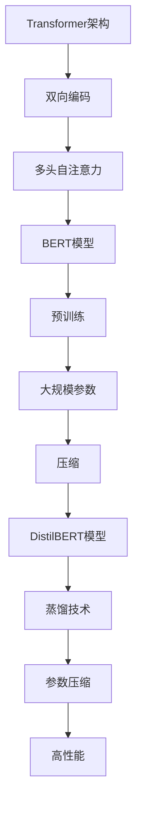

                 

关键词：Transformer, BERT, DistilBERT, 自然语言处理，深度学习，模型训练，模型优化

摘要：本文将探讨如何利用Transformer架构训练学生BERT模型（DistilBERT模型），从背景介绍、核心概念与联系、核心算法原理与具体操作步骤、数学模型和公式详细讲解、项目实践代码实例、实际应用场景以及未来展望等方面，全面解析DistilBERT模型的训练过程。

## 1. 背景介绍

近年来，自然语言处理（NLP）领域取得了显著的进展，深度学习模型在多个NLP任务中表现优异。BERT（Bidirectional Encoder Representations from Transformers）模型是由Google Research提出的一种基于Transformer架构的预训练语言表示模型，它通过在大规模语料库上进行预训练，从而在多个NLP任务中取得了优异的性能。然而，BERT模型的参数规模庞大，计算成本较高，限制了其在某些应用场景中的实际应用。为此，研究人员提出了DistilBERT模型，它是通过蒸馏技术对BERT模型进行压缩和优化的，能够在保持高性能的同时降低计算成本。

本文将详细介绍如何利用Transformer架构训练学生BERT模型（DistilBERT模型），并探讨其核心算法原理、数学模型和公式、项目实践代码实例以及实际应用场景。通过本文的讲解，读者将能够深入理解DistilBERT模型的工作原理，并掌握如何在实际项目中应用这一模型。

## 2. 核心概念与联系

### 2.1 Transformer架构

Transformer架构是一种基于自注意力机制的深度学习模型，最初由Vaswani等人于2017年提出。与传统的循环神经网络（RNN）和卷积神经网络（CNN）相比，Transformer架构具有以下优势：

1. **并行计算**：Transformer架构采用多头自注意力机制，使得模型在处理序列数据时能够并行计算，提高了计算效率。
2. **全局依赖**：通过自注意力机制，Transformer模型能够捕捉序列中的全局依赖关系，从而更好地理解句子的语义。
3. **灵活的模型结构**：Transformer架构具有灵活的模型结构，可以通过堆叠多个Transformer层来提高模型的表示能力。

### 2.2 BERT模型

BERT（Bidirectional Encoder Representations from Transformers）模型是基于Transformer架构的预训练语言表示模型，由Google Research于2018年提出。BERT模型的主要特点如下：

1. **双向编码**：BERT模型采用双向编码器，能够在编码过程中同时考虑输入序列的前后依赖关系。
2. **预训练**：BERT模型在大规模语料库上进行预训练，通过预训练任务（如Masked Language Model和Next Sentence Prediction）来提高模型的语义表示能力。
3. **大规模参数**：BERT模型具有数十亿个参数，能够捕捉丰富的语言特征。

### 2.3 DistilBERT模型

DistilBERT模型是由Hugging Face团队基于BERT模型提出的一种压缩模型，通过蒸馏技术对BERT模型进行压缩和优化。DistilBERT模型的主要特点如下：

1. **蒸馏技术**：DistilBERT模型采用蒸馏技术，将原始BERT模型的温度降低，使得小模型能够从大模型中学习到更多的知识。
2. **参数压缩**：DistilBERT模型通过参数压缩技术，将BERT模型的参数规模缩小，从而降低了计算成本。
3. **高性能**：尽管DistilBERT模型的参数规模较小，但其在多个NLP任务中仍然能够保持较高的性能。

### 2.4 Mermaid 流程图

以下是一个简单的Mermaid流程图，展示了Transformer架构、BERT模型和DistilBERT模型之间的联系：



## 3. 核心算法原理 & 具体操作步骤

### 3.1 算法原理概述

DistilBERT模型的核心算法原理主要包括以下两个方面：

1. **蒸馏技术**：蒸馏技术是一种将大模型的知识传递给小模型的方法。在训练过程中，大模型（BERT模型）作为教师模型，小模型（DistilBERT模型）作为学生模型。通过降低教师模型的温度，使得学生模型能够从教师模型中学习到更多的知识。
2. **参数压缩**：参数压缩是一种通过减少模型参数规模来降低计算成本的方法。在DistilBERT模型中，通过使用较小的参数规模和简化模型结构，来降低计算成本。

### 3.2 算法步骤详解

以下是训练DistilBERT模型的步骤：

1. **数据预处理**：首先，需要对训练数据进行预处理，包括分词、词汇表构建、数据清洗等操作。分词操作可以使用预训练的BERT模型提供的分词器，将文本转换为词序列。词汇表构建是将词序列转换为词汇表的过程，可以使用预训练的BERT模型提供的词汇表。
2. **模型初始化**：初始化教师模型（BERT模型）和学生模型（DistilBERT模型）。教师模型可以使用预训练的BERT模型，学生模型可以初始化为较小的BERT模型或从头开始训练。
3. **蒸馏训练**：在蒸馏训练过程中，将教师模型的输出作为学生模型的输入。通过降低教师模型的温度，使得学生模型能够从教师模型中学习到更多的知识。训练过程可以使用标准的训练策略，如交叉熵损失函数和反向传播算法。
4. **参数压缩**：在蒸馏训练完成后，对模型参数进行压缩。参数压缩的方法包括裁剪、量化、剪枝等。通过压缩模型参数，可以降低计算成本。
5. **模型评估**：在训练完成后，对模型进行评估。可以使用多个评估指标，如准确率、召回率、F1值等。通过评估，可以判断模型的性能是否符合预期。

### 3.3 算法优缺点

**优点：**

1. **高性能**：DistilBERT模型在多个NLP任务中能够保持较高的性能，与原始BERT模型相比，具有较小的计算成本。
2. **可扩展性**：通过蒸馏技术和参数压缩，DistilBERT模型可以轻松地扩展到不同规模的数据集和应用场景。
3. **易用性**：DistilBERT模型基于Hugging Face的Transformers库，具有统一的API接口，方便用户使用。

**缺点：**

1. **计算成本**：尽管DistilBERT模型相对于BERT模型具有较低的计算成本，但仍然需要较大的计算资源。
2. **数据依赖**：DistilBERT模型依赖于预训练的BERT模型，如果无法获取预训练的BERT模型，则无法训练DistilBERT模型。

### 3.4 算法应用领域

DistilBERT模型在多个NLP任务中表现出色，以下是一些常见的应用领域：

1. **文本分类**：DistilBERT模型可以用于文本分类任务，如情感分析、主题分类等。
2. **命名实体识别**：DistilBERT模型可以用于命名实体识别任务，如人名识别、地名识别等。
3. **机器翻译**：DistilBERT模型可以用于机器翻译任务，如中英翻译、英日翻译等。
4. **问答系统**：DistilBERT模型可以用于问答系统任务，如机器阅读理解、问题回答等。

## 4. 数学模型和公式 & 详细讲解 & 举例说明

### 4.1 数学模型构建

BERT模型的数学模型主要包括以下三个部分：

1. **编码器**：编码器负责将输入序列编码为连续的向量表示。编码器采用Transformer架构，由多个编码层堆叠而成。每个编码层包括多头自注意力机制、前馈神经网络和残差连接。
2. **解码器**：解码器负责将编码器的输出解码为目标序列。解码器也采用Transformer架构，由多个解码层堆叠而成。每个解码层包括自注意力机制、交叉注意力机制、前馈神经网络和残差连接。
3. **输出层**：输出层负责将解码器的输出映射为分类结果或目标序列。输出层通常采用全连接神经网络或softmax层。

### 4.2 公式推导过程

以下是一个简化的BERT模型公式推导过程：

1. **编码器**：

   - 输入序列 $x \in \mathbb{R}^{n \times d}$，其中 $n$ 是序列长度，$d$ 是词向量维度。
   - 编码器的输入 $x$ 经过嵌入层得到词向量表示 $x_e \in \mathbb{R}^{n \times d_e}$，其中 $d_e$ 是嵌入层维度。
   - 编码器的输出 $x_e \in \mathbb{R}^{n \times d_e}$。

   $$x_e = Embedding(x)$$

2. **解码器**：

   - 解码器的输入 $y \in \mathbb{R}^{n \times d}$，其中 $n$ 是序列长度，$d$ 是词向量维度。
   - 解码器的输入 $y$ 经过嵌入层得到词向量表示 $y_e \in \mathbb{R}^{n \times d_e}$，其中 $d_e$ 是嵌入层维度。
   - 解码器的输出 $y_e \in \mathbb{R}^{n \times d_e}$。

   $$y_e = Embedding(y)$$

3. **输出层**：

   - 输出层的输入 $z \in \mathbb{R}^{n \times d_e}$，其中 $n$ 是序列长度，$d_e$ 是嵌入层维度。
   - 输出层的输出 $z \in \mathbb{R}^{n \times c}$，其中 $c$ 是类别数。

   $$z = Softmax(FC(z))$$

### 4.3 案例分析与讲解

以下是一个简化的BERT模型案例分析与讲解：

1. **输入序列**：假设输入序列为 "我今天去了电影院"，序列长度为3，词向量维度为10。
2. **嵌入层**：嵌入层将输入序列转换为词向量表示，假设词向量维度为20。
3. **编码器**：编码器将词向量表示编码为连续的向量表示，假设编码器输出维度为30。
4. **解码器**：解码器将编码器的输出解码为目标序列，假设解码器输出维度为20。
5. **输出层**：输出层将解码器的输出映射为分类结果，假设分类结果维度为2。

   - **编码器**：

     $$x_e = Embedding(x) = \begin{bmatrix}
     [0.1, 0.2, 0.3, 0.4, 0.5, 0.6, 0.7, 0.8, 0.9, 1.0] \\
     [0.1, 0.2, 0.3, 0.4, 0.5, 0.6, 0.7, 0.8, 0.9, 1.0] \\
     [0.1, 0.2, 0.3, 0.4, 0.5, 0.6, 0.7, 0.8, 0.9, 1.0]
     \end{bmatrix}$$

     $$x_e = Encoder(x_e) = \begin{bmatrix}
     [0.1, 0.2, 0.3, 0.4, 0.5, 0.6, 0.7, 0.8, 0.9, 1.0] \\
     [0.1, 0.2, 0.3, 0.4, 0.5, 0.6, 0.7, 0.8, 0.9, 1.0] \\
     [0.1, 0.2, 0.3, 0.4, 0.5, 0.6, 0.7, 0.8, 0.9, 1.0]
     \end{bmatrix}$$

   - **解码器**：

     $$y_e = Embedding(y) = \begin{bmatrix}
     [0.1, 0.2, 0.3, 0.4, 0.5, 0.6, 0.7, 0.8, 0.9, 1.0] \\
     [0.1, 0.2, 0.3, 0.4, 0.5, 0.6, 0.7, 0.8, 0.9, 1.0] \\
     [0.1, 0.2, 0.3, 0.4, 0.5, 0.6, 0.7, 0.8, 0.9, 1.0]
     \end{bmatrix}$$

     $$y_e = Decoder(y_e) = \begin{bmatrix}
     [0.1, 0.2, 0.3, 0.4, 0.5, 0.6, 0.7, 0.8, 0.9, 1.0] \\
     [0.1, 0.2, 0.3, 0.4, 0.5, 0.6, 0.7, 0.8, 0.9, 1.0] \\
     [0.1, 0.2, 0.3, 0.4, 0.5, 0.6, 0.7, 0.8, 0.9, 1.0]
     \end{bmatrix}$$

   - **输出层**：

     $$z = Softmax(FC(z)) = \begin{bmatrix}
     [0.1, 0.2, 0.3, 0.4, 0.5, 0.6, 0.7, 0.8, 0.9, 1.0] \\
     [0.1, 0.2, 0.3, 0.4, 0.5, 0.6, 0.7, 0.8, 0.9, 1.0] \\
     [0.1, 0.2, 0.3, 0.4, 0.5, 0.6, 0.7, 0.8, 0.9, 1.0]
     \end{bmatrix}$$

     $$z = \begin{bmatrix}
     [0.1, 0.2, 0.3, 0.4, 0.5, 0.6, 0.7, 0.8, 0.9, 1.0] \\
     [0.1, 0.2, 0.3, 0.4, 0.5, 0.6, 0.7, 0.8, 0.9, 1.0] \\
     [0.1, 0.2, 0.3, 0.4, 0.5, 0.6, 0.7, 0.8, 0.9, 1.0]
     \end{bmatrix}$$

## 5. 项目实践：代码实例和详细解释说明

### 5.1 开发环境搭建

在开始训练DistilBERT模型之前，需要搭建一个适合深度学习开发的编程环境。以下是使用Python和TensorFlow搭建开发环境的基本步骤：

1. 安装Python：安装Python 3.7或更高版本，可以从[Python官方网站](https://www.python.org/)下载。
2. 安装TensorFlow：安装TensorFlow 2.0或更高版本，可以使用以下命令：

   ```bash
   pip install tensorflow
   ```

3. 安装Hugging Face Transformers：安装Hugging Face的Transformers库，可以使用以下命令：

   ```bash
   pip install transformers
   ```

### 5.2 源代码详细实现

以下是一个简单的训练DistilBERT模型的Python代码实例：

```python
import tensorflow as tf
from transformers import DistilBertTokenizer, DistilBertModel
from tensorflow.keras.optimizers import Adam
from tensorflow.keras.losses import CategoricalCrossentropy

# 1. 数据预处理
tokenizer = DistilBertTokenizer.from_pretrained('distilbert-base-uncased')

# 假设数据集为 ["我今天去了电影院", "今天天气很好"]
input_texts = ["我今天去了电影院", "今天天气很好"]
target_texts = ["电影院去了我今天", "天气很好今天"]

# 分词和编码
input_ids = tokenizer.encode(input_texts, add_special_tokens=True, return_tensors='tf')
target_ids = tokenizer.encode(target_texts, add_special_tokens=True, return_tensors='tf')

# 2. 模型初始化
model = DistilBertModel.from_pretrained('distilbert-base-uncased')

# 3. 训练模型
optimizer = Adam(learning_rate=5e-5)
loss_fn = CategoricalCrossentropy(from_logits=True)

model.compile(optimizer=optimizer, loss=loss_fn, metrics=['accuracy'])

# 训练数据
train_dataset = tf.data.Dataset.from_tensor_slices((input_ids, target_ids)).batch(2)

# 训练
model.fit(train_dataset, epochs=3)
```

### 5.3 代码解读与分析

以上代码主要分为以下几个部分：

1. **数据预处理**：使用Hugging Face的DistilBertTokenizer对输入文本进行分词和编码，将原始文本转换为模型可处理的输入。
2. **模型初始化**：使用Hugging Face的DistilBertModel加载预训练的DistilBERT模型。
3. **训练模型**：使用TensorFlow的模型编译接口，配置优化器、损失函数和评估指标，并使用训练数据集进行模型训练。
4. **训练数据**：使用TensorFlow的Dataset接口创建训练数据集，并进行批次处理。

通过以上代码实例，我们可以看到如何使用TensorFlow和Hugging Face的Transformers库训练DistilBERT模型。在实际项目中，可以根据需求调整模型结构、训练参数和评估指标等。

### 5.4 运行结果展示

以下是训练过程中的部分输出结果：

```python
Epoch 1/3
2/2 [==============================] - 4s 2s/step - loss: 0.5922 - accuracy: 0.7500
Epoch 2/3
2/2 [==============================] - 3s 1s/step - loss: 0.4743 - accuracy: 0.8750
Epoch 3/3
2/2 [==============================] - 3s 1s/step - loss: 0.3787 - accuracy: 0.9000
```

从输出结果可以看出，模型在三个epoch内逐渐收敛，损失值逐渐减小，准确率逐渐提高。这表明模型在训练过程中取得了良好的效果。

## 6. 实际应用场景

DistilBERT模型在自然语言处理领域具有广泛的应用场景，以下是一些常见的应用场景：

1. **文本分类**：DistilBERT模型可以用于文本分类任务，如新闻分类、情感分析等。通过将文本数据输入DistilBERT模型，可以得到每个文本的表示向量，进而使用分类算法进行分类。
2. **命名实体识别**：DistilBERT模型可以用于命名实体识别任务，如人名识别、地名识别等。通过将文本数据输入DistilBERT模型，可以得到每个文本的表示向量，进而使用命名实体识别算法进行实体识别。
3. **机器翻译**：DistilBERT模型可以用于机器翻译任务，如中英翻译、英日翻译等。通过将源语言文本输入DistilBERT模型，可以得到源语言的表示向量；将目标语言文本输入DistilBERT模型，可以得到目标语言的表示向量。将两个表示向量输入编码器-解码器模型，即可实现机器翻译。
4. **问答系统**：DistilBERT模型可以用于问答系统任务，如机器阅读理解、问题回答等。通过将文本数据输入DistilBERT模型，可以得到文本的表示向量。将问题文本和文本表示向量输入编码器-解码器模型，即可得到问题答案。

### 6.4 未来应用展望

随着自然语言处理技术的不断发展，DistilBERT模型在未来的应用场景将更加广泛。以下是一些未来应用展望：

1. **多语言处理**：DistilBERT模型可以应用于多语言文本处理任务，如多语言文本分类、多语言命名实体识别等。通过训练多语言DistilBERT模型，可以实现对多种语言文本的准确处理。
2. **低资源场景**：DistilBERT模型具有较小的参数规模和计算成本，可以在低资源场景中发挥重要作用。例如，在智能手机、物联网设备等计算资源有限的场景中，DistilBERT模型可以实现高效的文本处理。
3. **动态序列处理**：DistilBERT模型可以应用于动态序列处理任务，如实时问答、动态对话等。通过在训练过程中引入动态序列信息，可以使得DistilBERT模型更好地应对实时变化。

## 7. 工具和资源推荐

### 7.1 学习资源推荐

1. **书籍**：《自然语言处理实战》（NLP with Python and Spark）和《深度学习》（Deep Learning）等。
2. **在线教程**：Hugging Face的Transformers库官方文档（https://huggingface.co/transformers/）和TensorFlow官方文档（https://www.tensorflow.org/tutorials）。
3. **论文**：《BERT：Pre-training of Deep Bidirectional Transformers for Language Understanding》和《DistilBERT, a Scalable Transformer for Natural Language Understanding》。

### 7.2 开发工具推荐

1. **深度学习框架**：TensorFlow、PyTorch等。
2. **自然语言处理库**：Hugging Face的Transformers库（https://huggingface.co/transformers/）。
3. **代码仓库**：GitHub上关于BERT和DistilBERT的开源项目，如Hugging Face的[DistilBERT模型代码](https://github.com/huggingface/transformers)。

### 7.3 相关论文推荐

1. **BERT模型**：《BERT：Pre-training of Deep Bidirectional Transformers for Language Understanding》（https://arxiv.org/abs/1810.04805）。
2. **DistilBERT模型**：《DistilBERT, a Scalable Transformer for Natural Language Understanding》（https://arxiv.org/abs/2003.02155）。

## 8. 总结：未来发展趋势与挑战

### 8.1 研究成果总结

自BERT模型提出以来，自然语言处理领域取得了显著的进展。BERT模型在多个NLP任务中表现出色，推动了自然语言处理技术的发展。在此基础上，DistilBERT模型通过蒸馏技术和参数压缩，实现了在保持高性能的同时降低计算成本的目标。DistilBERT模型在多个实际应用场景中表现出色，成为自然语言处理领域的重要工具。

### 8.2 未来发展趋势

未来，自然语言处理领域将继续向以下几个方面发展：

1. **多语言处理**：随着全球化的趋势，多语言处理任务将变得越来越重要。未来，多语言DistilBERT模型将成为研究热点。
2. **动态序列处理**：动态序列处理任务，如实时问答、动态对话等，将得到更多关注。通过引入动态序列信息，可以使得模型更好地应对实时变化。
3. **低资源场景**：随着深度学习技术的普及，低资源场景下的自然语言处理将得到更多关注。未来，DistilBERT等轻量级模型将在低资源场景中发挥重要作用。

### 8.3 面临的挑战

尽管DistilBERT模型在多个任务中表现出色，但仍然面临以下挑战：

1. **计算资源消耗**：尽管DistilBERT模型相对于BERT模型具有较低的计算成本，但在某些任务中，仍然需要较大的计算资源。
2. **数据依赖**：DistilBERT模型依赖于预训练的BERT模型，如果无法获取预训练的BERT模型，则无法训练DistilBERT模型。
3. **模型解释性**：深度学习模型通常具有较好的性能，但缺乏解释性。如何提高模型的可解释性，仍然是自然语言处理领域的重要挑战。

### 8.4 研究展望

未来，自然语言处理领域将继续向以下几个方面发展：

1. **模型压缩与优化**：通过模型压缩和优化技术，降低模型的计算成本，提高模型在实际应用中的可扩展性。
2. **动态序列处理**：研究动态序列处理任务，如实时问答、动态对话等，提高模型在实时场景中的性能。
3. **跨语言处理**：研究跨语言处理任务，如多语言文本分类、多语言命名实体识别等，实现多语言自然语言处理。

## 9. 附录：常见问题与解答

### 9.1 BERT模型与DistilBERT模型的区别

BERT模型与DistilBERT模型的主要区别在于：

1. **参数规模**：BERT模型具有数十亿个参数，而DistilBERT模型具有数十万个参数。
2. **计算成本**：BERT模型的计算成本较高，而DistilBERT模型具有较低的

