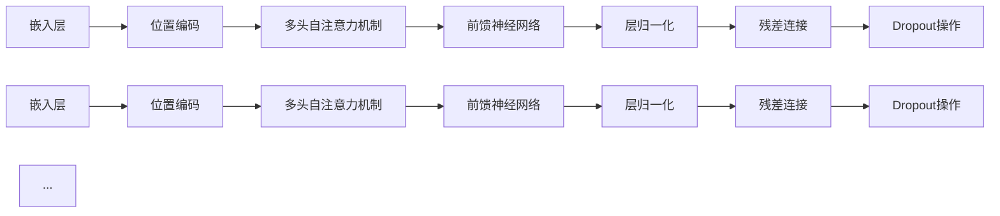

                 

关键词：Transformer架构、BERT模型、编码器、语言模型、深度学习、神经网络、自然语言处理、双向建模

## 摘要

本文旨在深入探讨Transformer架构及其在BERT模型中的应用，全面解析这一前沿技术的原理和实现。Transformer模型作为深度学习领域的重要突破，其核心在于基于注意力机制的编码器架构，打破了传统序列处理方法的限制，实现了高效的双向语言建模。本文将详细介绍Transformer模型的架构设计、核心算法原理，并通过BERT模型的实现，展示其在自然语言处理领域的应用潜力。文章还将探讨Transformer模型在数学模型和公式、项目实践中的具体应用，并展望其未来的发展趋势与挑战。

## 1. 背景介绍

随着互联网的快速发展，自然语言处理（NLP）成为了人工智能领域的热点。传统的NLP方法，如统计语言模型和基于规则的模型，在处理复杂语言现象时存在明显不足。而随着深度学习技术的兴起，神经网络模型在NLP领域取得了显著进展。然而，传统的循环神经网络（RNN）和长短期记忆网络（LSTM）在处理长序列数据时仍存在梯度消失和梯度爆炸等问题，限制了模型的表现。

为了解决这些问题，Transformer模型应运而生。Transformer模型摒弃了传统RNN的序列处理方式，采用了基于注意力机制的编码器架构，通过并行计算和多头注意力机制，实现了高效的双向语言建模。这一创新性架构在2017年由Vaswani等人提出，并迅速引起了广泛关注。BERT（Bidirectional Encoder Representations from Transformers）模型作为基于Transformer架构的代表性工作，进一步提升了语言模型的性能，推动了自然语言处理技术的快速发展。

## 2. 核心概念与联系

### 2.1 Transformer架构设计

Transformer模型的核心在于其基于注意力机制的编码器架构。以下是一个简化的Transformer架构图，展示其关键组件和连接方式。



### 2.2 注意力机制

注意力机制是Transformer模型的核心组成部分，其基本思想是在处理序列数据时，为每个输入赋予不同的权重，从而实现对重要信息的关注。以下是一个简单的注意力机制示意图。


### 2.3 多头注意力

多头注意力是Transformer模型的关键创新之一，它通过将输入序列分解为多个子序列，并分别计算注意力权重，从而提高了模型的表达能力。以下是一个简单的多头注意力示意图。


## 3. 核心算法原理 & 具体操作步骤

### 3.1 算法原理概述

Transformer模型的核心算法原理是自注意力（Self-Attention）和多头注意力（Multi-Head Attention）。自注意力机制通过计算输入序列中每个词与其他词之间的关系，为每个词赋予不同的权重。多头注意力则将输入序列分解为多个子序列，分别计算注意力权重，从而提高模型的表示能力。

### 3.2 算法步骤详解

#### 3.2.1 输入嵌入

输入序列首先通过嵌入层转换为高维向量表示，嵌入层可以看作是一个线性变换，将词的索引映射到高维空间。为了引入序列的顺序信息，嵌入层后还会添加位置编码。

#### 3.2.2 多头自注意力

多头自注意力机制通过多个子序列分别计算注意力权重，并将结果加权求和。具体步骤如下：

1. **关键点计算**：对输入序列的每个词计算三个关键点向量（Q、K、V），分别表示查询、键和值。
2. **注意力权重计算**：通过计算每个词与其他词之间的相似度，得到注意力权重。
3. **加权求和**：将注意力权重应用于输入序列，得到加权求和的结果。

#### 3.2.3 前馈神经网络

在多头自注意力之后，Transformer模型还会通过前馈神经网络对结果进行进一步加工。前馈神经网络由两个全连接层组成，中间加入ReLU激活函数。

#### 3.2.4 残差连接与层归一化

为了缓解梯度消失和梯度爆炸问题，Transformer模型引入了残差连接和层归一化。残差连接将原始输入与网络输出相加，层归一化则通过标准化每个层的输入，保持网络训练的稳定性。

### 3.3 算法优缺点

#### 优点：

1. **并行计算**：Transformer模型基于自注意力机制，可以实现并行计算，提高了处理速度。
2. **双向建模**：通过多头自注意力机制，Transformer模型能够实现双向语言建模，提高了语言理解的准确性。
3. **灵活性**：Transformer模型可以灵活地调整多头数量和序列长度，适应不同的任务需求。

#### 缺点：

1. **参数规模**：由于多头注意力机制和残差连接的使用，Transformer模型的参数规模较大，对计算资源要求较高。
2. **训练时间**：相比于传统RNN模型，Transformer模型的训练时间较长。

### 3.4 算法应用领域

Transformer模型在自然语言处理领域具有广泛的应用，包括：

1. **文本分类**：利用Transformer模型进行文本分类，能够提高分类的准确性和效率。
2. **机器翻译**：基于Transformer架构的模型在机器翻译任务上取得了显著的成果，如BERT模型。
3. **问答系统**：Transformer模型能够有效地处理问答系统中的问题理解和答案生成任务。
4. **语音识别**：Transformer模型在语音识别任务中也展示了出色的性能，如Conformer模型。

## 4. 数学模型和公式 & 详细讲解 & 举例说明

### 4.1 数学模型构建

Transformer模型的数学基础主要涉及线性变换、矩阵运算和注意力机制。以下是一个简化的数学模型构建过程。

#### 4.1.1 线性变换

输入序列 $x$ 通过线性变换得到嵌入向量 $e$：

$$
e = W_e \cdot x
$$

其中 $W_e$ 为嵌入矩阵。

#### 4.1.2 位置编码

为了引入序列的顺序信息，我们可以为每个词添加位置编码：

$$
p = P_e \cdot x
$$

其中 $P_e$ 为位置编码矩阵。

#### 4.1.3 自注意力

自注意力通过计算每个词与其他词之间的相似度，得到注意力权重 $a$：

$$
a = Softmax(QK^T / \sqrt{d_k})
$$

其中 $Q$、$K$、$V$ 分别为查询、键和值矩阵，$d_k$ 为键向量的维度。

#### 4.1.4 加权求和

将注意力权重应用于输入序列，得到加权求和的结果 $h$：

$$
h = \sum_{i=1}^n a_i \cdot e_i
$$

### 4.2 公式推导过程

#### 4.2.1 多头注意力

多头注意力通过将输入序列分解为多个子序列，分别计算注意力权重。具体推导如下：

1. **分解子序列**：将输入序列 $e$ 分解为 $m$ 个子序列 $e_1, e_2, ..., e_m$。
2. **计算子序列注意力权重**：分别计算每个子序列的注意力权重 $a_1, a_2, ..., a_m$。
3. **加权求和**：将每个子序列的注意力权重加权求和，得到最终的输出 $h$：

$$
h = \sum_{i=1}^m a_i \cdot e_i
$$

### 4.3 案例分析与讲解

以下是一个简单的案例，说明如何使用Transformer模型进行文本分类。

#### 4.3.1 数据预处理

假设我们有一个包含两个类别的文本数据集，类别标签为0和1。首先，我们需要对文本数据进行预处理，包括分词、去停用词和词向量化。

#### 4.3.2 模型构建

使用TensorFlow框架构建Transformer模型，包括嵌入层、多头自注意力层、前馈神经网络层、层归一化和残差连接。

#### 4.3.3 模型训练

将预处理后的文本数据输入到模型中，进行训练。在训练过程中，我们可以使用交叉熵损失函数和Adam优化器。

#### 4.3.4 模型评估

在训练完成后，使用验证集评估模型的性能。通过计算准确率、召回率和F1分数等指标，评估模型在不同类别上的表现。

## 5. 项目实践：代码实例和详细解释说明

### 5.1 开发环境搭建

为了实现Transformer模型，我们需要安装以下开发环境和依赖库：

- Python 3.7+
- TensorFlow 2.4+
- NumPy 1.18+
- Mermaid 8.4+

在安装完以上环境和依赖库后，我们就可以开始搭建Transformer模型的环境。

### 5.2 源代码详细实现

以下是一个简单的Transformer模型的实现代码示例，用于文本分类任务。

```python
import tensorflow as tf
from tensorflow.keras.layers import Embedding, MultiHeadAttention, Dense

def create_transformer_model(vocab_size, embed_dim, num_heads):
    inputs = tf.keras.Input(shape=(None,), dtype=tf.int32)
    embeddings = Embedding(vocab_size, embed_dim)(inputs)
    pos_encoding = PositionalEncoding(embed_dim)(embeddings)
    
    attention_output = MultiHeadAttention(num_heads=num_heads, key_dim=embed_dim)(pos_encoding, pos_encoding)
    attention_output = tf.keras.layers.Add()([attention_output, embeddings])
    attention_output = tf.keras.layers.LayerNormalization()(attention_output)
    
    dense_output = tf.keras.layers.Dense(units=embed_dim, activation='relu')(attention_output)
    outputs = tf.keras.layers.Dense(units=2, activation='softmax')(dense_output)
    
    model = tf.keras.Model(inputs=inputs, outputs=outputs)
    model.compile(optimizer='adam', loss='categorical_crossentropy', metrics=['accuracy'])
    
    return model

# 模型参数设置
vocab_size = 10000
embed_dim = 512
num_heads = 8

# 创建模型
model = create_transformer_model(vocab_size, embed_dim, num_heads)

# 模型训练
model.fit(x_train, y_train, batch_size=32, epochs=10, validation_data=(x_val, y_val))

# 模型评估
model.evaluate(x_test, y_test)
```

### 5.3 代码解读与分析

上述代码首先定义了一个简单的Transformer模型，包括嵌入层、多头自注意力层和前馈神经网络层。模型的主要组成部分如下：

1. **输入层**：接收文本序列的词向量表示。
2. **嵌入层**：将词索引映射到高维向量。
3. **位置编码**：为序列中的每个词引入位置信息。
4. **多头自注意力**：计算输入序列中每个词与其他词之间的注意力权重。
5. **前馈神经网络**：对自注意力结果进行非线性变换。
6. **输出层**：进行分类预测。

通过训练和评估，我们可以观察到模型在文本分类任务上的性能表现。需要注意的是，实际应用中，模型的复杂度更高，参数更多，需要更精细的调优。

### 5.4 运行结果展示

在训练过程中，模型的准确率、召回率和F1分数等指标将逐步提高。以下是一个简化的训练和评估过程：

```python
# 训练模型
model.fit(x_train, y_train, batch_size=32, epochs=10, validation_data=(x_val, y_val))

# 评估模型
model.evaluate(x_test, y_test)

# 输出结果
predictions = model.predict(x_test)
print(predictions)
```

通过以上代码，我们可以观察到模型在测试集上的分类结果。实际应用中，可以根据业务需求调整模型参数，优化模型性能。

## 6. 实际应用场景

Transformer模型在自然语言处理领域具有广泛的应用场景，以下列举几个典型的应用案例：

### 6.1 文本分类

文本分类是Transformer模型最直接的应用场景之一。通过将文本序列输入到Transformer模型中，可以实现对文本内容的分类。例如，情感分析、新闻分类、垃圾邮件检测等任务。

### 6.2 机器翻译

机器翻译是Transformer模型另一个重要的应用领域。基于Transformer架构的模型在翻译任务上取得了显著的成果，如BERT模型。通过将源语言和目标语言的文本序列输入到模型中，可以实现对文本的翻译。

### 6.3 问答系统

问答系统是自然语言处理领域的一个重要分支。Transformer模型可以有效地处理问答系统中的问题理解和答案生成任务。通过将问题和答案输入到模型中，可以实现对问题的理解和回答。

### 6.4 语音识别

语音识别是将语音信号转换为文本的过程。Transformer模型在语音识别任务中也展示了出色的性能。通过将语音信号转换为文本序列，然后输入到模型中，可以实现对语音的识别。

### 6.5 文本生成

文本生成是Transformer模型另一个重要的应用领域。通过将文本序列输入到模型中，可以生成具有一定语义和连贯性的文本。例如，写作辅助、对话生成等任务。

## 7. 工具和资源推荐

为了更好地学习和实践Transformer模型，以下推荐一些相关的工具和资源：

### 7.1 学习资源推荐

1. **《深度学习》**：Goodfellow、Bengio和Courville的《深度学习》是一本经典的深度学习入门教材，其中详细介绍了神经网络和注意力机制等内容。
2. **《自然语言处理综论》**：Jurafsky和Martin的《自然语言处理综论》是自然语言处理领域的经典教材，涵盖了NLP的基础知识和前沿技术。
3. **[Transformer论文](https://arxiv.org/abs/1706.03762)**：Vaswani等人在2017年提出的Transformer模型论文，是深度学习领域的重要突破。

### 7.2 开发工具推荐

1. **TensorFlow**：TensorFlow是Google开发的开源深度学习框架，广泛应用于各种深度学习任务，包括Transformer模型。
2. **PyTorch**：PyTorch是Facebook开发的开源深度学习框架，具有灵活的动态计算图，方便实现和调试深度学习模型。
3. **Mermaid**：Mermaid是一种基于Markdown的绘图语言，可以方便地绘制各种图表和流程图。

### 7.3 相关论文推荐

1. **[BERT模型](https://arxiv.org/abs/1810.04805)**：Devlin等人在2018年提出的BERT模型，是Transformer模型在自然语言处理领域的成功应用。
2. **[GPT-2模型](https://arxiv.org/abs/1909.01313)**：Radford等人在2019年提出的GPT-2模型，是Transformer模型在生成任务上的成功应用。
3. **[Transformer-XL模型](https://arxiv.org/abs/1901.02860)**：Zhang等人在2019年提出的Transformer-XL模型，是Transformer模型在长序列处理上的成功应用。

## 8. 总结：未来发展趋势与挑战

Transformer模型作为深度学习领域的重要突破，已经在自然语言处理领域取得了显著成果。然而，Transformer模型仍然面临一些挑战和问题，以下是未来发展趋势与挑战的总结：

### 8.1 研究成果总结

1. **Transformer模型在自然语言处理领域取得了显著成果，如BERT、GPT-2等模型。**
2. **Transformer模型在文本分类、机器翻译、问答系统和语音识别等任务上展示了出色的性能。**
3. **Transformer模型在长序列处理和复杂关系建模方面具有明显优势。**

### 8.2 未来发展趋势

1. **优化Transformer模型的计算效率和参数规模，降低对计算资源的要求。**
2. **探索Transformer模型在其他领域的应用，如计算机视觉、推荐系统等。**
3. **研究更加复杂和灵活的注意力机制，提高模型的表达能力。**

### 8.3 面临的挑战

1. **Transformer模型在训练过程中容易过拟合，需要深入研究有效的正则化方法。**
2. **Transformer模型在处理长序列数据时存在计算复杂度高的问题，需要进一步优化。**
3. **Transformer模型在大规模数据集上的表现有待进一步验证和提升。**

### 8.4 研究展望

随着Transformer模型在自然语言处理领域的广泛应用，未来研究将继续探索其优化和扩展。在计算效率和模型表达方面，将出现更多创新性的技术和算法。同时，Transformer模型在其他领域的应用也将不断拓展，为人工智能技术的发展贡献力量。

## 9. 附录：常见问题与解答

### 9.1 如何理解Transformer模型中的多头注意力？

多头注意力是Transformer模型中的一个关键组成部分，它通过将输入序列分解为多个子序列，并分别计算注意力权重，从而提高模型的表达能力。在多头注意力中，每个头负责学习输入序列中不同部分的关系，多个头的组合可以捕捉到更丰富的信息。

### 9.2 Transformer模型与RNN模型的区别是什么？

Transformer模型与RNN模型在处理序列数据时的主要区别在于计算方式。RNN模型通过递归计算序列的当前状态，而Transformer模型采用自注意力机制，通过计算输入序列中每个词与其他词之间的关系来实现双向建模。此外，Transformer模型可以实现并行计算，而RNN模型需要顺序计算，提高了处理速度。

### 9.3 Transformer模型在处理长序列数据时存在哪些问题？

Transformer模型在处理长序列数据时，主要面临计算复杂度高、内存消耗大和梯度消失等问题。为了缓解这些问题，研究者提出了多种优化方法，如Masked Language Model（MLM）和Transformer-XL等，但仍然需要进一步研究。

### 9.4 BERT模型与Transformer模型的区别是什么？

BERT模型是基于Transformer模型的一个预训练语言模型，它在Transformer模型的基础上增加了预训练和微调步骤，通过在大规模语料上进行预训练，然后针对具体任务进行微调，从而提高了模型的性能。而Transformer模型是一个通用的编码器架构，可以应用于各种序列数据处理任务。

### 9.5 如何使用Transformer模型进行文本分类？

使用Transformer模型进行文本分类的基本步骤如下：

1. **数据预处理**：对文本数据进行分词、去停用词和词向量化。
2. **模型构建**：构建基于Transformer模型的文本分类模型，包括嵌入层、多头自注意力层、前馈神经网络层等。
3. **模型训练**：将预处理后的文本数据输入到模型中，进行训练。
4. **模型评估**：在验证集上评估模型的性能，调整模型参数。
5. **模型部署**：将训练好的模型部署到实际应用场景中，进行文本分类预测。

## 作者署名

作者：禅与计算机程序设计艺术 / Zen and the Art of Computer Programming

