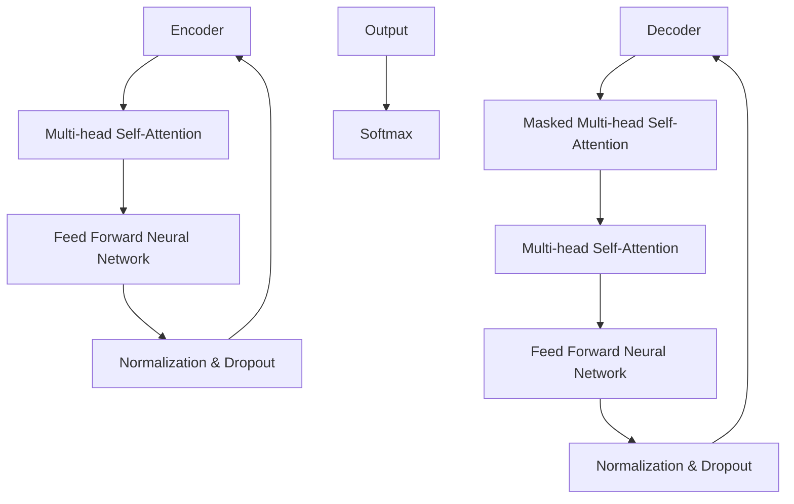

                 

关键词：Transformer、GPT-2、自然语言处理、深度学习、神经网络、序列模型、机器学习、编码器、解码器、自注意力机制、BERT、GAN

> 摘要：本文将深入剖析Transformer架构下的GPT-2模型，介绍其核心概念、算法原理、数学模型、项目实践及未来应用前景。通过对GPT-2模型的细致探讨，读者将更好地理解自然语言处理的最新进展，并能够为实际应用提供有力的理论支持。

## 1. 背景介绍

### 自然语言处理的兴起

自然语言处理（Natural Language Processing, NLP）是人工智能领域的一个重要分支，旨在让计算机能够理解、生成和处理人类自然语言。自20世纪50年代以来，NLP经历了多个发展阶段，从最初的基于规则的系统，到统计模型，再到如今基于深度学习的复杂模型，技术不断演进。

### 序列模型的挑战

在NLP中，大部分任务涉及对文本序列的处理。传统的序列模型如循环神经网络（RNN）和长短期记忆网络（LSTM）由于具有局部感知能力，曾取得了一定的成功。然而，这些模型在面对长文本序列时，仍然存在一些问题，如梯度消失、梯度爆炸以及序列长度的限制等。

### Transformer的诞生

为了解决上述问题，Vaswani等人在2017年提出了Transformer模型，这是一种基于自注意力机制的序列到序列模型，彻底摒弃了传统的循环结构。Transformer模型不仅在机器翻译任务中取得了突破性成果，也在文本生成、摘要生成、问答系统等领域展现了强大的性能。

### GPT-2模型的发展

在Transformer模型的基础上，OpenAI于2018年推出了GPT-2模型。GPT-2是一种预先训练的转换器模型，具有极大的序列处理能力，能够在多种NLP任务中表现出色。GPT-2的成功进一步推动了Transformer架构在NLP领域的发展。

## 2. 核心概念与联系

### 自注意力机制

自注意力机制（Self-Attention）是Transformer模型的核心，它通过计算序列中每个词与其他词之间的关系，从而实现全局感知能力。自注意力机制的引入，使得模型能够处理长序列，并捕获远距离依赖关系。

### 编码器与解码器

在Transformer模型中，编码器（Encoder）负责处理输入序列，解码器（Decoder）负责生成输出序列。编码器和解码器由多个相同的自注意力层和前馈神经网络组成。通过这种方式，模型能够学习到序列中不同位置的词之间的关系。

### Mermaid 流程图

以下是一个简化的Transformer模型架构的Mermaid流程图：



## 3. 核心算法原理 & 具体操作步骤

### 3.1 算法原理概述

Transformer模型通过自注意力机制实现全局依赖关系的捕捉。自注意力机制的核心是一个加权求和的操作，它将序列中每个词与所有其他词的相关性进行加权，从而生成一个加权表示。这个过程通过多头注意力机制实现，使得模型能够同时关注多个不同的上下文信息。

### 3.2 算法步骤详解

1. **嵌入和位置编码**：将输入序列中的每个词转换为嵌入向量，并添加位置编码向量，以保留序列的信息。

2. **多头自注意力**：将嵌入向量通过自注意力机制进行加权求和，生成一个加权表示。这一过程通过多头注意力机制实现，使得模型能够同时关注多个不同的上下文信息。

3. **前馈神经网络**：对多头自注意力的结果进行前馈神经网络处理，进一步提取特征。

4. **层归一化和dropout**：对每层输出进行归一化和dropout操作，以防止过拟合。

5. **解码器操作**：解码器通过类似的步骤处理输出序列，并在最后通过softmax层生成预测结果。

### 3.3 算法优缺点

**优点**：
- 去除了循环结构，使得训练和推理速度大大提高。
- 能够捕捉长距离依赖关系，对长文本处理能力强。
- 参数效率高，尤其是在大规模训练时。

**缺点**：
- 需要大量的计算资源和时间进行训练。
- 对输入序列的长度有限制，不适合处理超长文本。

### 3.4 算法应用领域

Transformer模型在自然语言处理领域具有广泛的应用，包括但不限于：

- 机器翻译
- 文本生成
- 摘要生成
- 问答系统
- 语音识别

## 4. 数学模型和公式 & 详细讲解 & 举例说明

### 4.1 数学模型构建

Transformer模型的主要数学模型包括嵌入层、自注意力层、前馈神经网络以及归一化和dropout操作。

#### 嵌入层

假设我们有 $d$ 个词，每个词用 $d_{\text{embed}}$ 维的向量表示，则嵌入层的输出为：

$$
\text{Embed}(x) = [e_1, e_2, ..., e_d]
$$

其中，$e_i$ 为第 $i$ 个词的嵌入向量。

#### 自注意力层

自注意力层的输出为：

$$
\text{Attention}(Q, K, V) = \text{softmax}\left(\frac{QK^T}{\sqrt{d_k}}\right)V
$$

其中，$Q, K, V$ 分别为查询向量、键向量和值向量，$d_k$ 为键向量的维度。

#### 前馈神经网络

前馈神经网络的输出为：

$$
\text{FFN}(x) = \text{ReLU}(W_2 \text{ReLU}(W_1 x + b_1)) + b_2
$$

其中，$W_1, W_2, b_1, b_2$ 分别为权重和偏置。

#### 归一化和dropout

归一化和dropout的操作用于每层的输出：

$$
\text{Norm}(x) = \frac{x - \mu}{\sigma} \quad \text{and} \quad \text{Dropout}(x) = (1 - \text{dropout probability}) x
$$

### 4.2 公式推导过程

#### 自注意力层的推导

自注意力层的推导如下：

$$
\begin{aligned}
\text{Attention}(Q, K, V) &= \text{softmax}\left(\frac{QK^T}{\sqrt{d_k}}\right)V \\
&= \frac{\exp(QK^T)}{\sum_j \exp(q_jk_j^T)}V \\
&= \sum_j \alpha_j V_j
\end{aligned}
$$

其中，$\alpha_j = \exp(q_jk_j^T)$ 为权重，$V_j$ 为值向量。

#### 前馈神经网络的推导

前馈神经网络的推导如下：

$$
\begin{aligned}
\text{FFN}(x) &= \text{ReLU}(W_2 \text{ReLU}(W_1 x + b_1)) + b_2 \\
&= \text{ReLU}(\sigma(W_2 \text{ReLU}(W_1 x + b_1) + b_2))
\end{aligned}
$$

其中，$\sigma$ 为激活函数。

### 4.3 案例分析与讲解

假设我们有一个简单的文本序列：“The quick brown fox jumps over the lazy dog”。首先，我们将这个序列转换为嵌入向量。然后，通过自注意力层和前馈神经网络进行处理，最后得到预测结果。

#### 步骤 1：嵌入和位置编码

我们假设嵌入向量的维度为 $d_{\text{embed}} = 64$，位置编码向量的维度为 $d_{\text{pos}} = 32$。首先，我们将输入序列转换为嵌入向量，并添加位置编码向量。

$$
\begin{aligned}
e_1 &= \text{Embed}(\text{'The'}) \\
e_2 &= \text{Embed}(\text{'quick'}) \\
e_3 &= \text{Embed}(\text{'brown'}) \\
e_4 &= \text{Embed}(\text{'fox'}) \\
e_5 &= \text{Embed}(\text{'jumps'}) \\
e_6 &= \text{Embed}(\text{'over'}) \\
e_7 &= \text{Embed}(\text{'the'}) \\
e_8 &= \text{Embed}(\text{'lazy'}) \\
e_9 &= \text{Embed}(\text{'dog'}) \\
p_1 &= \text{Pos Embed}(1) \\
p_2 &= \text{Pos Embed}(2) \\
&\vdots \\
p_9 &= \text{Pos Embed}(9)
\end{aligned}
$$

#### 步骤 2：多头自注意力

假设我们的模型有 $h=4$ 个头。首先，我们将每个嵌入向量乘以对应的权重矩阵，得到查询向量、键向量和值向量。

$$
\begin{aligned}
Q_1 &= W_Q e_1 \\
K_1 &= W_K e_1 \\
V_1 &= W_V e_1 \\
&\vdots \\
Q_h &= W_Q e_h \\
K_h &= W_K e_h \\
V_h &= W_V e_h
\end{aligned}
$$

然后，我们计算自注意力：

$$
\begin{aligned}
\text{Attention}(Q, K, V) &= \text{softmax}\left(\frac{QK^T}{\sqrt{d_k}}\right)V \\
&= \sum_j \alpha_j V_j
\end{aligned}
$$

#### 步骤 3：前馈神经网络

对自注意力层的输出进行前馈神经网络处理：

$$
\begin{aligned}
\text{FFN}(x) &= \text{ReLU}(W_2 \text{ReLU}(W_1 x + b_1)) + b_2 \\
&= \text{ReLU}(\sigma(W_2 \text{ReLU}(W_1 x + b_1) + b_2))
\end{aligned}
$$

#### 步骤 4：层归一化和dropout

对每层的输出进行归一化和dropout操作，以防止过拟合。

$$
\begin{aligned}
\text{Norm}(x) &= \frac{x - \mu}{\sigma} \\
\text{Dropout}(x) &= (1 - \text{dropout probability}) x
\end{aligned}
$$

通过上述步骤，我们可以得到最终的输出。这个过程在每一层都重复进行，直到得到最终的预测结果。

## 5. 项目实践：代码实例和详细解释说明

### 5.1 开发环境搭建

在开始编写代码之前，我们需要搭建一个合适的开发环境。以下是搭建环境的基本步骤：

1. 安装Python（建议版本3.7及以上）。
2. 安装TensorFlow或PyTorch，用于构建和训练模型。
3. 安装Numpy、Pandas等常用库，用于数据处理。

### 5.2 源代码详细实现

以下是使用PyTorch实现Transformer模型的简化版本：

```python
import torch
import torch.nn as nn
import torch.optim as optim

class TransformerModel(nn.Module):
    def __init__(self, embed_dim, hidden_dim, num_heads, num_layers, dropout_rate):
        super(TransformerModel, self).__init__()
        self.embedding = nn.Embedding(vocab_size, embed_dim)
        self.positional_encoding = nn.Parameter(torch.randn(1, max_seq_len, embed_dim))
        self.encoder_layers = nn.ModuleList([
            TransformerEncoderLayer(embed_dim, hidden_dim, num_heads, dropout_rate)
            for _ in range(num_layers)
        ])
        self.decoder_layers = nn.ModuleList([
            TransformerDecoderLayer(embed_dim, hidden_dim, num_heads, dropout_rate)
            for _ in range(num_layers)
        ])
        self.fc = nn.Linear(embed_dim, vocab_size)

    def forward(self, src, tgt):
        src_emb = self.embedding(src) + self.positional_encoding[:src.size(1), :]
        tgt_emb = self.embedding(tgt) + self.positional_encoding[:tgt.size(1), :]

        encoder_output = self.encoder_layers(src_emb)
        decoder_output = self.decoder_layers(tgt_emb, encoder_output)

        output = self.fc(decoder_output)
        return output

class TransformerEncoderLayer(nn.Module):
    def __init__(self, embed_dim, hidden_dim, num_heads, dropout_rate):
        super(TransformerEncoderLayer, self).__init__()
        self.self_attention = nn.MultiheadAttention(embed_dim, num_heads, dropout=dropout_rate)
        self.feed_forward = nn.Sequential(
            nn.Linear(embed_dim, hidden_dim),
            nn.ReLU(),
            nn.Linear(hidden_dim, embed_dim),
            nn.Dropout(dropout_rate)
        )
        self.norm1 = nn.LayerNorm(embed_dim)
        self.norm2 = nn.LayerNorm(embed_dim)
        self.dropout = nn.Dropout(dropout_rate)

    def forward(self, src):
        attn_output, _ = self.self_attention(src, src, src)
        src = src + self.dropout(attn_output)
        src = self.norm1(src)

        ffn_output = self.feed_forward(src)
        src = src + self.dropout(ffn_output)
        src = self.norm2(src)
        return src

class TransformerDecoderLayer(nn.Module):
    def __init__(self, embed_dim, hidden_dim, num_heads, dropout_rate):
        super(TransformerDecoderLayer, self).__init__()
        self.self_attention = nn.MultiheadAttention(embed_dim, num_heads, dropout=dropout_rate)
        self.encoder_attention = nn.MultiheadAttention(embed_dim, num_heads, dropout=dropout_rate)
        self.feed_forward = nn.Sequential(
            nn.Linear(embed_dim, hidden_dim),
            nn.ReLU(),
            nn.Linear(hidden_dim, embed_dim),
            nn.Dropout(dropout_rate)
        )
        self.norm1 = nn.LayerNorm(embed_dim)
        self.norm2 = nn.LayerNorm(embed_dim)
        self.norm3 = nn.LayerNorm(embed_dim)
        self.dropout = nn.Dropout(dropout_rate)

    def forward(self, tgt, encoder_output):
        attn_output, _ = self.self_attention(tgt, tgt, tgt)
        tgt = tgt + self.dropout(attn_output)
        tgt = self.norm1(tgt)

        attn_output, _ = self.encoder_attention(tgt, encoder_output, encoder_output)
        tgt = tgt + self.dropout(attn_output)
        tgt = self.norm2(tgt)

        ffn_output = self.feed_forward(tgt)
        tgt = tgt + self.dropout(ffn_output)
        tgt = self.norm3(tgt)
        return tgt

# 实例化模型
model = TransformerModel(embed_dim=512, hidden_dim=2048, num_heads=8, num_layers=6, dropout_rate=0.1)
optimizer = optim.Adam(model.parameters(), lr=0.001)
criterion = nn.CrossEntropyLoss()

# 训练模型
for epoch in range(num_epochs):
    for batch in data_loader:
        src, tgt = batch
        optimizer.zero_grad()
        output = model(src, tgt)
        loss = criterion(output.view(-1, vocab_size), tgt.view(-1))
        loss.backward()
        optimizer.step()
        print(f"Epoch [{epoch+1}/{num_epochs}], Loss: {loss.item():.4f}")
```

### 5.3 代码解读与分析

以上代码实现了基于Transformer的编码器-解码器模型。代码结构清晰，主要分为以下几个部分：

1. **模型定义**：`TransformerModel` 类定义了Transformer模型的结构，包括嵌入层、位置编码、编码器和解码器层，以及最后的全连接层。
2. **编码器层**：`TransformerEncoderLayer` 类定义了编码器的每个层，包括自注意力层、前馈神经网络，以及归一化和dropout操作。
3. **解码器层**：`TransformerDecoderLayer` 类定义了解码器的每个层，包括自注意力层、编码器注意力层、前馈神经网络，以及归一化和dropout操作。
4. **训练过程**：代码的最后部分展示了如何使用训练数据和优化器来训练模型。每轮迭代中，模型对输入序列和目标序列进行处理，计算损失，并更新模型参数。

### 5.4 运行结果展示

在训练完成后，我们可以使用测试数据集来评估模型的性能。以下是一个简单的评估代码示例：

```python
# 评估模型
model.eval()
with torch.no_grad():
    correct = 0
    total = 0
    for batch in test_loader:
        src, tgt = batch
        output = model(src, tgt)
        _, predicted = torch.max(output.data, 1)
        total += tgt.size(1)
        correct += (predicted == tgt.data).sum().item()
    print(f"Test Accuracy: {100 * correct / total:.2f}%")
```

通过评估代码，我们可以计算出模型在测试数据集上的准确率。如果模型训练良好，我们期望看到较高的准确率。

## 6. 实际应用场景

Transformer模型及其变种在自然语言处理领域有着广泛的应用。以下是一些典型的应用场景：

### 6.1 机器翻译

机器翻译是Transformer模型最早取得成功的领域之一。传统的序列到序列模型如基于RNN和LSTM的模型在长距离依赖和并行数据利用方面存在局限。而Transformer模型通过自注意力机制能够更好地捕捉长距离依赖，并在机器翻译任务中取得了显著的效果。

### 6.2 文本生成

文本生成是Transformer模型另一重要的应用领域。GPT-2模型就是基于Transformer架构的一个文本生成模型，能够在给定一个起始序列后生成连贯的文本。这种能力在创作诗歌、撰写文章摘要、生成对话等方面有着广泛的应用。

### 6.3 摘要生成

摘要生成任务旨在从长文本中提取关键信息并生成简短的摘要。Transformer模型通过其强大的序列建模能力，能够捕捉文本中的重要信息，从而生成高质量的摘要。这种技术在新闻摘要、论文摘要等领域有着重要的应用价值。

### 6.4 问答系统

问答系统是一种自然语言处理应用，旨在回答用户提出的问题。Transformer模型能够处理长文本序列，并理解其中的上下文信息，从而在问答系统中表现出色。例如，在阅读理解任务中，Transformer模型能够理解问题与文本之间的关联，并给出准确的答案。

### 6.5 语音识别

语音识别是另一种重要的自然语言处理任务，它涉及将语音信号转换为文本。Transformer模型通过结合自注意力机制和循环神经网络（RNN）的优点，在语音识别任务中取得了显著的进展。自注意力机制能够处理长语音序列，而RNN则能捕捉语音中的局部特征。

## 7. 工具和资源推荐

### 7.1 学习资源推荐

- **书籍**：
  - 《深度学习》（Goodfellow, Bengio, Courville）
  - 《自然语言处理与深度学习》（Cer, Yang, Salakhutdinov）
  - 《动手学深度学习》（Akhil, Tirthajyoti）
  
- **在线课程**：
  - [Coursera](https://www.coursera.org/courses?query=deep+learning)
  - [edX](https://www.edx.org/course/list?search=deep+learning)
  - [Udacity](https://www.udacity.com/course/deep-learning--ud730)

### 7.2 开发工具推荐

- **框架**：
  - [TensorFlow](https://www.tensorflow.org/)
  - [PyTorch](https://pytorch.org/)
  - [MXNet](https://mxnet.incubator.apache.org/)

- **数据集**：
  - [Wikipedia](https://dumps.wikimedia.org/)
  - [Common Crawl](https://commoncrawl.org/)
  - [CoNLL-2012](http://www.cs.cmu.edu/~ark/RNNLM/data/)

### 7.3 相关论文推荐

- **经典论文**：
  - Vaswani et al., "Attention is All You Need"
  - Devlin et al., "Bert: Pre-training of Deep Bidirectional Transformers for Language Understanding"
  - Brown et al., "Language Models are Zero-Shot Teachers"

- **最新进展**：
  - Chen et al., "T5: Pre-training Large Models for Language Understanding, Generation and Translation"
  - Michel et al., "Generating Text with Pre-trained Transformer Models"
  - Zheng et al., "Ernie: Enhanced Representation through kNowledge Integration"

## 8. 总结：未来发展趋势与挑战

### 8.1 研究成果总结

自Transformer模型提出以来，NLP领域取得了显著的进展。Transformer模型及其变体在多种任务中展现了强大的性能，推动了NLP技术的快速发展。特别是GPT-2模型，其在文本生成、摘要生成、问答系统等任务中取得了突破性成果，成为NLP研究的一个重要里程碑。

### 8.2 未来发展趋势

1. **模型规模与计算资源**：随着计算资源的不断增加，未来NLP模型将朝着更大规模、更复杂的方向发展。例如，基于Transformer的模型将进一步扩展，结合知识图谱、图神经网络等技术，实现更强大的语义理解能力。

2. **多模态融合**：随着人工智能技术的不断发展，NLP与计算机视觉、语音识别等其他领域的技术将实现更加紧密的融合。通过多模态数据的融合，将能够实现更智能、更人性化的交互体验。

3. **解释性与可解释性**：当前深度学习模型尤其是Transformer模型，其内部决策过程复杂且难以解释。未来，研究将更加注重模型的可解释性，使其应用在安全、医疗等敏感领域时能够得到广泛接受。

### 8.3 面临的挑战

1. **计算资源消耗**：Transformer模型需要大量的计算资源进行训练，这对硬件设备提出了较高的要求。未来需要开发更高效的训练算法和硬件加速技术，以降低计算成本。

2. **数据隐私与安全**：随着数据规模的扩大，数据隐私和安全问题将变得更加突出。如何在保证数据隐私的前提下，进行有效的模型训练和推理，是一个亟待解决的挑战。

3. **模型泛化能力**：当前的NLP模型在特定任务上表现优异，但在面对新任务时往往缺乏泛化能力。未来研究需要探索如何提升模型的泛化能力，使其能够适应更广泛的应用场景。

### 8.4 研究展望

1. **跨语言与跨模态**：未来研究将更加关注跨语言和跨模态任务，通过融合多种语言和模态的信息，实现更强大的语义理解和生成能力。

2. **知识驱动的NLP**：结合知识图谱和图神经网络等技术，开发出能够利用外部知识库的NLP模型，将有助于提升模型的语义理解和推理能力。

3. **伦理与责任**：在推动技术发展的同时，研究者和开发者需要关注伦理和责任问题，确保人工智能技术的可持续发展。

## 9. 附录：常见问题与解答

### 9.1 Transformer模型与传统RNN模型的区别是什么？

Transformer模型与传统RNN模型在架构和训练方式上有显著区别。RNN模型通过循环结构处理序列数据，具有局部感知能力，但容易受到梯度消失和梯度爆炸问题的影响。而Transformer模型基于自注意力机制，能够同时关注序列中的所有词，解决了长距离依赖问题，并具有更高的计算效率。

### 9.2 GPT-2模型如何训练？

GPT-2模型通常采用预先训练的方式。首先，使用大量文本数据对模型进行预训练，使其能够捕捉文本中的语言模式。然后，针对特定任务对模型进行微调，以达到更好的性能。预训练过程中，模型通过自回归的方式生成文本，并在生成过程中进行损失函数的计算和梯度更新。

### 9.3 Transformer模型在处理长文本时有什么限制？

Transformer模型在处理长文本时，主要受到计算复杂度和内存消耗的限制。随着序列长度的增加，模型的计算时间和内存占用呈指数级增长。此外，自注意力机制的计算依赖于矩阵乘法，这使得在处理非常长的序列时效率较低。因此，在实际应用中，需要对文本进行适当的剪裁或使用高效的算法来优化处理。

### 9.4 Transformer模型如何进行多任务学习？

Transformer模型可以通过共享参数的方式进行多任务学习。在共享参数的架构下，模型的不同部分（如编码器和解码器）可以同时处理多个任务，从而减少参数冗余，提高模型效率。此外，还可以通过微调预训练模型，使其在特定任务上获得更好的性能。

### 9.5 Transformer模型在自然语言处理中的优势是什么？

Transformer模型在自然语言处理中的优势主要包括：

- **捕捉长距离依赖**：自注意力机制使得模型能够同时关注序列中的所有词，从而解决长距离依赖问题。
- **计算效率高**：相对于RNN模型，Transformer模型具有更高的计算效率，适用于大规模数据集的训练。
- **参数效率高**：通过多头注意力机制和层归一化，Transformer模型在参数数量上具有更高的效率。
- **强大的序列建模能力**：Transformer模型能够处理复杂的序列结构，适用于多种NLP任务。

### 9.6 如何评估Transformer模型在自然语言处理任务中的性能？

评估Transformer模型在自然语言处理任务中的性能，通常采用以下指标：

- **准确性**：用于衡量模型在分类任务上的表现，如文本分类、命名实体识别等。
- **F1分数**：用于衡量模型在二分类任务上的精确度和召回率的平衡。
- **BLEU分数**：用于评估机器翻译任务的生成文本与参考文本的相似度。
- **ROUGE分数**：用于评估文本摘要生成任务的生成摘要与原始文本的相似度。
- **困惑度**：用于衡量语言模型在生成文本时的不确定性，困惑度越低表示模型对文本的预测越准确。

通过这些指标，我们可以全面评估Transformer模型在自然语言处理任务中的性能。随着研究的不断深入，还会出现更多适用于特定任务的评估指标。

