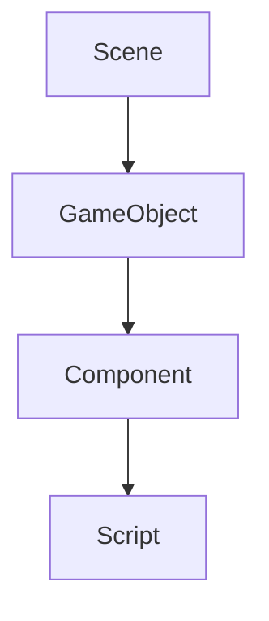

                 

Unity 游戏开发引擎是一款全球领先的游戏开发平台，广泛应用于各类游戏开发项目。无论是独立开发者还是大型游戏工作室，Unity 都以其强大的功能和易用性赢得了广泛赞誉。在这篇文章中，我们将深入探讨如何使用 Unity 开发一款 3D 游戏，包括核心概念、算法原理、数学模型、项目实践以及未来发展趋势。

## 关键词

- Unity 游戏开发
- 3D 游戏创建
- 游戏引擎技术
- 游戏编程
- 游戏设计

## 摘要

本文将介绍如何使用 Unity 游戏开发引擎创建 3D 游戏。我们将详细解析 Unity 的核心概念、算法原理和数学模型，并通过一个实际项目实践来展示如何编写代码和实现游戏功能。此外，还将探讨 Unity 在实际应用场景中的表现，以及未来的发展趋势和挑战。

## 1. 背景介绍

Unity 作为一款跨平台的游戏开发引擎，自 2005 年首次发布以来，已经成为了游戏开发领域的标杆。Unity 的易用性和强大的功能使其成为了独立开发者和大公司开发游戏的首选工具。Unity 支持多种编程语言，如 C# 和 JavaScript，提供了一套完整的开发环境，包括编辑器、调试器和性能分析工具。

Unity 的核心功能包括：

- **多平台发布**：Unity 支持发布到各种平台，如 Windows、MacOS、Linux、iOS 和 Android 等。
- **可视化编辑器**：Unity 的编辑器提供了强大的可视化工具，使得游戏制作更加直观和高效。
- **脚本编程**：Unity 使用 C# 作为主要脚本语言，同时支持 JavaScript、Boo、Python 和 Perl 等其他语言。
- **物理引擎**：Unity 内置了物理引擎，可以轻松实现复杂的物理效果。
- **图形渲染**：Unity 提供了高效的图形渲染功能，支持多种渲染技术，如阴影、反射和光线追踪等。

## 2. 核心概念与联系

Unity 游戏开发涉及多个核心概念，包括场景（Scene）、游戏对象（Game Object）、组件（Component）、脚本（Script）等。下面是一个简化的 Mermaid 流程图，展示了这些概念之间的关系。



### 2.1 场景（Scene）

场景是 Unity 中游戏世界的基本构建块。每个场景可以包含多个游戏对象，用于定义游戏世界中的所有元素。场景在 Unity 编辑器中创建，并可以在运行时加载和卸载。

### 2.2 游戏对象（Game Object）

游戏对象是游戏世界中的实体，可以是任何东西，如角色、道具、摄像机等。每个游戏对象都可以附加多个组件，这些组件定义了游戏对象的特定功能。

### 2.3 组件（Component）

组件是 Unity 中实现特定功能的模块。例如，`Rigidbody` 组件用于实现物理效果，`MeshFilter` 组件用于定义游戏对象的形状，`Camera` 组件用于控制摄像机的视角。

### 2.4 脚本（Script）

脚本是用 C# 等编程语言编写的代码，用于控制游戏对象的逻辑和行为。通过脚本，可以实现复杂的游戏逻辑、用户交互和游戏机制。

## 3. 核心算法原理 & 具体操作步骤

### 3.1 算法原理概述

Unity 游戏开发中的核心算法主要涉及物理引擎、图形渲染、碰撞检测和动画系统等方面。下面将简要介绍这些算法的原理。

### 3.2 算法步骤详解

#### 3.2.1 物理引擎

Unity 的物理引擎基于牛顿力学，使用物理引擎可以模拟现实世界中的物理现象。以下是一些基本的物理引擎步骤：

1. 创建物理对象：通过 `Rigidbody` 组件创建物理对象。
2. 应用力：通过 `ApplyForce` 方法为对象施加力。
3. 解算碰撞：Unity 自动处理碰撞检测和碰撞响应。

#### 3.2.2 图形渲染

Unity 的图形渲染系统使用 GPU 加速，支持多种渲染技术。以下是一些基本的图形渲染步骤：

1. 创建摄像机：通过 `Camera` 组件创建摄像机。
2. 定义渲染目标：设置摄像机的渲染目标，如屏幕或纹理。
3. 渲染场景：Unity 自动处理场景的渲染，包括光源、阴影和后处理效果。

#### 3.2.3 碰撞检测

碰撞检测用于检测游戏对象之间的碰撞。以下是一些基本的碰撞检测步骤：

1. 添加碰撞器：通过 `Collider` 组件为游戏对象添加碰撞器。
2. 检测碰撞：使用 `Physics.Raycast` 或 `Physics.OverlapSphere` 方法检测碰撞。
3. 处理碰撞：根据碰撞结果执行特定的逻辑，如改变游戏对象的运动状态。

#### 3.2.4 动画系统

Unity 的动画系统用于实现角色动画和特效动画。以下是一些基本的动画系统步骤：

1. 创建动画控制器：通过 `Animator` 组件创建动画控制器。
2. 添加动画状态机：定义动画状态机，用于控制动画的切换和播放。
3. 添加动画剪辑：将动画剪辑附加到动画状态机中，用于实现特定的动画效果。

### 3.3 算法优缺点

物理引擎、图形渲染、碰撞检测和动画系统各有优缺点。物理引擎可以实现复杂的物理现象，但计算成本较高；图形渲染使用 GPU 加速，性能优秀，但渲染复杂场景时计算量大；碰撞检测用于确保游戏对象的交互逻辑，但需要进行频繁的检测和计算；动画系统可以实现流畅的动画效果，但需要定义大量的动画剪辑和状态。

### 3.4 算法应用领域

Unity 的核心算法广泛应用于各类游戏开发项目，包括：

- **2D 游戏**：物理引擎和图形渲染技术用于实现平台跳跃、滚动和障碍物等游戏机制。
- **3D 游戏**：图形渲染技术用于实现真实感场景和角色，物理引擎用于实现角色动作和道具效果。
- **虚拟现实（VR）**：图形渲染技术用于实现沉浸式体验，物理引擎用于实现角色和场景的交互。
- **增强现实（AR）**：图形渲染技术用于实现虚拟物体与现实世界的叠加，碰撞检测用于确保虚拟物体与现实世界的交互。

## 4. 数学模型和公式 & 详细讲解 & 举例说明

### 4.1 数学模型构建

Unity 游戏开发中的数学模型主要包括向量、矩阵、变换和几何形状等。以下是一个简化的数学模型构建过程：

1. **向量**：表示游戏对象的位置、速度和方向。
2. **矩阵**：表示游戏对象的变换，包括旋转、缩放和位移。
3. **变换**：表示游戏对象的变换关系，包括平移、旋转和缩放。
4. **几何形状**：表示游戏对象的几何形状，如球体、立方体和网格等。

### 4.2 公式推导过程

以下是一个简单的向量变换公式推导过程：

1. **向量加法**：表示两个向量的和，公式为 `a + b = (a_x + b_x, a_y + b_y, a_z + b_z)`。
2. **向量减法**：表示两个向量的差，公式为 `a - b = (a_x - b_x, a_y - b_y, a_z - b_z)`。
3. **向量乘法**：表示向量的点积和叉积，公式为 `a · b = a_x * b_x + a_y * b_y + a_z * b_z` 和 `a × b = (a_y * b_z - a_z * b_y, a_z * b_x - a_x * b_z, a_x * b_y - a_y * b_x)`。

### 4.3 案例分析与讲解

以下是一个简单的案例，用于展示如何使用向量变换公式实现游戏对象的位置更新：

1. **初始位置**：游戏对象的位置向量 `position = (1, 2, 3)`。
2. **移动向量**：游戏对象的移动向量 `move = (4, 5, 6)`。
3. **更新位置**：使用向量加法公式 `new_position = position + move`。
4. **结果**：游戏对象的新位置向量 `new_position = (5, 7, 9)`。

## 5. 项目实践：代码实例和详细解释说明

### 5.1 开发环境搭建

为了使用 Unity 开发 3D 游戏，我们需要安装以下开发环境：

1. **Unity Hub**：Unity 的官方安装和管理工具。
2. **Unity 编辑器**：Unity 的可视化编辑器，用于创建和编辑游戏项目。
3. **Visual Studio**：用于编写和调试 C# 脚本。

安装完成后，创建一个新的 Unity 项目，选择 3D 游戏模板。

### 5.2 源代码详细实现

以下是一个简单的 3D 游戏项目示例，包括一个角色和场景：

```csharp
using UnityEngine;

public class PlayerMovement : MonoBehaviour
{
    public float speed = 5.0f;

    private Rigidbody rb;

    private void Start()
    {
        rb = GetComponent<Rigidbody>();
    }

    private void Update()
    {
        float moveHorizontal = Input.GetAxis("Horizontal");
        float moveVertical = Input.GetAxis("Vertical");

        Vector3 movement = new Vector3(moveHorizontal, 0.0f, moveVertical) * speed;

        rb.AddForce(movement);
    }
}
```

### 5.3 代码解读与分析

1. **使用 Rigidbody 组件**：角色对象使用 `Rigidbody` 组件，用于实现物理效果。
2. **获取输入**：使用 `Input.GetAxis` 方法获取玩家输入。
3. **计算移动向量**：根据玩家输入计算移动向量。
4. **应用力**：使用 `Rigidbody.AddForce` 方法为角色对象施加力，实现移动。

### 5.4 运行结果展示

在 Unity 编辑器中运行项目，玩家可以通过键盘输入控制角色的移动，实现一个简单的 3D 游戏场景。

## 6. 实际应用场景

Unity 游戏开发引擎在实际应用场景中表现出色，以下是一些常见的应用场景：

- **游戏开发**：Unity 广泛应用于各类游戏开发项目，从简单的 2D 游戏到复杂的 3D 游戏，Unity 都能够提供强大的支持。
- **教育领域**：Unity 用于教育领域，帮助学生和教师学习游戏设计和开发技能。
- **虚拟现实（VR）**：Unity 提供了强大的 VR 开发工具，使得 VR 应用变得容易实现。
- **增强现实（AR）**：Unity 的 AR 工具使得开发 AR 应用变得更加简单和高效。
- **模拟和仿真**：Unity 用于模拟和仿真各种场景，如建筑模拟、医学模拟等。

## 7. 工具和资源推荐

### 7.1 学习资源推荐

1. **Unity 官方文档**：Unity 官方文档提供了丰富的学习资源，包括教程、API 文档和开发指南。
2. **Unity 教程**：网络上有很多免费的 Unity 教程，适合不同水平的开发者。
3. **游戏开发书籍**：推荐一些经典的 Unity 游戏开发书籍，如《Unity 游戏开发实战》和《Unity 游戏开发教程》等。

### 7.2 开发工具推荐

1. **Visual Studio**：Unity 的官方推荐开发环境，提供了强大的代码编辑和调试功能。
2. **Unity Hub**：Unity 的官方安装和管理工具，方便开发者管理多个 Unity 版本。
3. **Unity Collaborate**：Unity 的云协作工具，用于团队协作和版本控制。

### 7.3 相关论文推荐

1. **Unity 性能优化研究**：探讨 Unity 游戏的性能优化策略。
2. **Unity 的物理引擎实现**：分析 Unity 物理引擎的实现原理。
3. **Unity 的图形渲染技术**：研究 Unity 的图形渲染技术，如光线追踪和实时渲染等。

## 8. 总结：未来发展趋势与挑战

Unity 游戏开发引擎在未来的发展趋势中将继续保持其领先地位，主要表现在以下几个方面：

- **更高效的性能优化**：Unity 将继续优化性能，以适应更复杂的游戏场景和更高的帧率要求。
- **更强大的图形渲染技术**：Unity 将引入更多先进的图形渲染技术，如光线追踪和实时渲染等，以提供更逼真的游戏体验。
- **更广泛的平台支持**：Unity 将支持更多平台，包括虚拟现实（VR）和增强现实（AR）等新兴领域。
- **更强大的 AI 支持**：Unity 将集成更多 AI 功能，为游戏开发提供智能化的解决方案。

然而，Unity 面临的挑战也不容忽视，包括：

- **性能瓶颈**：随着游戏场景的复杂度增加，Unity 的性能优化面临挑战。
- **开发成本**：Unity 的开发成本较高，对于独立开发者来说可能是一个障碍。
- **市场竞争力**：Unity 面临来自其他游戏开发引擎的激烈竞争，需要不断创新和优化。

总之，Unity 游戏开发引擎在未来的发展中将继续引领游戏开发领域，为开发者提供强大的支持和丰富的功能。

## 9. 附录：常见问题与解答

### 9.1 Unity 如何处理多线程？

Unity 使用 Unity Thread Pool 来管理多线程。在 Unity 中，可以使用 `Coroutine` 和 `yield return` 语句来实现异步操作。此外，Unity 的脚本运行在 Unity 主线程中，但可以通过 `UnityThread` 类来进行线程间的通信。

### 9.2 Unity 如何处理资源加载？

Unity 使用 Asset Bundles 和资源管理器来处理资源加载。通过将资源打包成 Asset Bundles，可以实现按需加载和卸载资源，从而优化游戏的性能。

### 9.3 Unity 如何实现动画？

Unity 使用 Animator 和动画控制器来实现动画。Animator 可以控制动画的播放、切换和混合，而动画控制器用于定义动画状态机。通过将动画剪辑附加到动画控制器中，可以实现角色的各种动作和特效。

### 9.4 Unity 如何实现物理效果？

Unity 使用物理引擎来实现物理效果。通过为游戏对象添加 `Rigidbody` 或 `Collider` 组件，可以实现碰撞检测、运动模拟和物理效果。物理引擎的计算过程是自动的，开发者只需定义物理对象和力即可。

### 9.5 Unity 如何实现多人游戏？

Unity 使用 Network 组件来实现多人游戏。通过使用 `UNET` 或 `MLAPI`，可以实现游戏对象的网络同步和多人交互。开发者需要实现客户端与服务器的通信，以实现实时的多人游戏体验。

## 作者署名

作者：禅与计算机程序设计艺术 / Zen and the Art of Computer Programming

