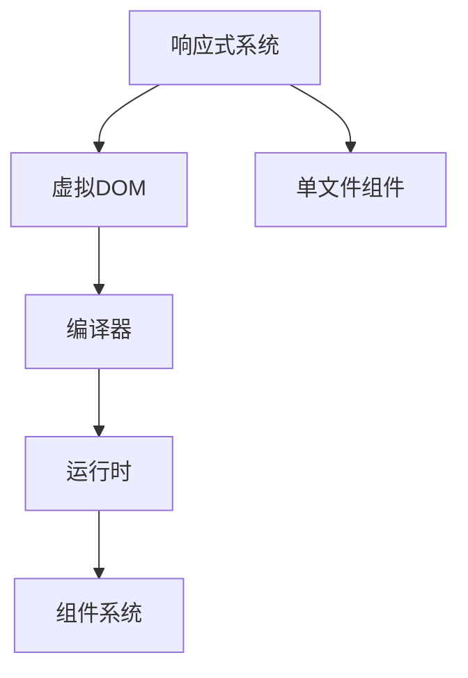

                 

在这个信息爆炸的时代，选择合适的开发框架对于提高项目开发效率和代码质量至关重要。Vue.js，作为当下最受欢迎的前端JavaScript框架之一，凭借其渐进式架构和强大的功能，已经在全球范围内得到了广泛的应用和认可。本文将深入探讨Vue.js的核心优势，帮助读者更好地理解和掌握这个优秀的框架。

## 关键词

- Vue.js
- JavaScript框架
- 渐进式架构
- 组件化开发
- 数据绑定
- 虚拟DOM
- 单文件组件
- 路由
- 状态管理
- 构建工具

## 摘要

本文将详细阐述Vue.js框架的几个核心优势，包括渐进式架构、组件化开发、数据绑定、虚拟DOM以及其生态系统的其他组成部分。我们将通过具体实例来展示Vue.js的易用性和高效性，并探讨其在实际开发中的应用场景和未来发展趋势。

### 1. 背景介绍

在Web开发领域，JavaScript框架一直是开发者关注的焦点。自2009年AngularJS问世以来，前端开发经历了巨大的变革。随后，2014年，Vue.js正式发布，它以其独特的渐进式架构和易于学习的特性迅速赢得了开发者的青睐。

Vue.js的设计哲学是“易于上手，能够扩展”，这使得它非常适合新手的入门，同时也满足了大型项目的复杂需求。Vue.js的创始人尤雨溪（Evan You）在创建Vue.js时，吸取了AngularJS和React的精华，同时避免了一些它们自身的缺点，如复杂的双向数据绑定和大量的代码冗余。

### 2. 核心概念与联系

#### 2.1 Vue.js的核心概念

Vue.js的核心概念包括：

- **响应式系统**：Vue.js通过其响应式系统实现数据绑定，这使得开发者无需手动操作DOM，从而提高了开发效率和代码的可维护性。
- **虚拟DOM**：Vue.js使用虚拟DOM来提高渲染性能，通过对比虚拟DOM和实际DOM的差异，只更新变化的部分，从而减少重绘和重排的成本。
- **组件系统**：Vue.js通过组件化开发，将应用程序分解为可复用的组件，这大大提高了代码的可维护性和可测试性。
- **单文件组件**：Vue.js的单文件组件允许开发者在一个文件中编写模板、逻辑和样式，使得项目结构更加清晰，代码的耦合度更低。

#### 2.2 Vue.js的架构

Vue.js的架构可以概括为以下几个层次：

1. **响应式系统**：Vue.js通过Object.defineProperty实现数据响应式。当数据变化时，依赖该数据的视图会自动更新。
2. **虚拟DOM**：Vue.js使用虚拟DOM来模拟实际DOM，通过对比虚拟DOM和实际DOM的差异，进行最小化的DOM操作。
3. **编译器**：Vue.js的编译器将模板编译成渲染函数，这个过程包括了模板的解析、优化和代码生成。
4. **运行时**：运行时提供了响应式系统的实现、组件系统、全局API等，是Vue.js的核心模块。
5. **构建工具**：Vue.js支持Webpack、Rollup、Parcel等构建工具，这为开发者提供了极大的灵活性。

以下是一个简单的Mermaid流程图，展示了Vue.js的核心架构和概念之间的联系：



### 3. 核心算法原理 & 具体操作步骤

#### 3.1 算法原理概述

Vue.js的核心算法包括响应式系统和虚拟DOM。响应式系统通过劫持数据对象的属性，实现数据的响应式。虚拟DOM则通过对比虚拟DOM和实际DOM的差异，实现高效的DOM更新。

#### 3.2 算法步骤详解

1. **响应式系统的实现**：

   Vue.js使用Object.defineProperty为每个数据对象定义getter和setter方法，当数据访问时，会触发getter，从而收集依赖；当数据修改时，会触发setter，从而通知所有依赖进行更新。

2. **虚拟DOM的实现**：

   Vue.js首先将模板编译成渲染函数，渲染函数返回虚拟DOM。当数据变化时，会重新生成虚拟DOM，然后与上一次的虚拟DOM进行对比，生成差异对象。最后，根据差异对象更新实际DOM。

#### 3.3 算法优缺点

**优点**：

- **高效的数据绑定**：通过响应式系统，Vue.js实现了高效的数据绑定，减少了手动操作DOM的繁琐。
- **虚拟DOM提升性能**：虚拟DOM通过最小化的DOM操作，提高了渲染性能。
- **组件化开发**：Vue.js的组件化开发使得代码更加模块化，易于维护和测试。

**缺点**：

- **学习曲线**：虽然Vue.js的学习曲线相对较平缓，但对于一些初学者来说，仍然需要时间来熟悉其特性和用法。
- **嵌套组件**：嵌套组件可能导致数据流和事件流的复杂性增加，需要开发者有良好的设计和组织能力。

#### 3.4 算法应用领域

Vue.js的应用领域非常广泛，包括单页面应用（SPA）、复杂的前端系统、移动端应用等。其优秀的性能和灵活性使得Vue.js在各种场景下都能发挥出色的作用。

### 4. 数学模型和公式 & 详细讲解 & 举例说明

#### 4.1 数学模型构建

Vue.js的响应式系统基于观察者模式，其数学模型可以表示为：

- **数据对象**：`{a: 1, b: 2}`
- **观察者**：`[observer1, observer2]`
- **被观察者**：`[observable1, observable2]`

#### 4.2 公式推导过程

当数据对象发生变化时，所有观察者都会被通知并进行更新。这个过程可以用以下公式表示：

- `update(observable, value)`：更新观察者
- `notify(observable)`：通知所有观察者

#### 4.3 案例分析与讲解

假设有一个数据对象`{count: 0}`，有一个观察者`[increment]`，当`count`发生变化时，`increment`会被通知并进行更新。

```javascript
const observer = {
  count: 0,
  update(value) {
    this.count = value;
    console.log('count updated:', this.count);
  }
};

const observable = new Vue({
  data: {
    count: 0
  }
});

observable.$watch('count', observer.update);

// 更新数据
observable.$data.count = 5;
```

在这个例子中，当`count`发生变化时，`observer`会收到通知并更新。

### 5. 项目实践：代码实例和详细解释说明

#### 5.1 开发环境搭建

要开始使用Vue.js，首先需要安装Node.js和npm。然后，可以通过npm安装Vue CLI，它可以帮助我们快速搭建Vue.js项目。

```shell
npm install -g @vue/cli
```

接下来，使用Vue CLI创建一个新的Vue.js项目：

```shell
vue create my-vue-project
```

进入项目目录并启动开发服务器：

```shell
cd my-vue-project
npm run serve
```

#### 5.2 源代码详细实现

在一个简单的Vue.js项目中，我们通常会有以下目录结构：

```
src/
|-- assets/
|-- components/
|   |-- HelloWorld.vue
|-- App.vue
|-- main.js
```

`App.vue`是Vue.js应用的入口组件，它包含了整个应用的最外层模板和脚本。

```vue
<template>
  <div id="app">
    
    <HelloWorld msg="Welcome to Your Vue.js App"/>
  </div>
</template>

<script>
import HelloWorld from './components/HelloWorld.vue'

export default {
  name: 'App',
  components: {
    HelloWorld
  }
}
</script>
```

`HelloWorld.vue`是一个简单的Vue组件，它定义了一个组件的模板、脚本和样式。

```vue
<template>
  <div class="hello">
    <h1>{{ msg }}</h1>
  </div>
</template>

<script>
export default {
  name: 'HelloWorld',
  props: {
    msg: String
  }
}
</script>

<style scoped>
.hello {
  font-family: Avenir, Helvetica, Arial, sans-serif;
  -webkit-font-smoothing: antialiased;
  -moz-osx-font-smoothing: grayscale;
  text-align: center;
  color: #2c3e50;
  margin-top: 60px;
}
</style>
```

`main.js`是Vue.js应用程序的入口文件，它引入Vue.js，并创建一个Vue实例。

```javascript
import Vue from 'vue'
import App from './App.vue'

Vue.config.productionTip = false

new Vue({
  render: h => h(App),
}).$mount('#app')
```

#### 5.3 代码解读与分析

在这个简单的Vue.js项目中，`App.vue`是整个应用的核心组件，它通过`components`选项引入了`HelloWorld`组件，并在模板中使用了它。`HelloWorld.vue`是一个独立的组件，它定义了一个模板、一个脚本和一个样式。`main.js`文件是Vue实例的创建位置，通过`render`函数，将`App`组件渲染到页面上的`#app`元素中。

#### 5.4 运行结果展示

启动开发服务器后，在浏览器中打开`http://localhost:8080/`，会看到如下界面：


### 6. 实际应用场景

Vue.js可以用于各种实际应用场景，包括：

- **单页面应用（SPA）**：Vue.js非常适合构建单页面应用，它提供了高效的数据绑定和路由管理，使得用户界面更加流畅。
- **复杂的前端系统**：Vue.js的组件化开发使得大型前端系统的开发变得更加容易，代码的维护性也得到了提高。
- **移动端应用**：Vue.js可以通过与Weex、Uni-app等框架结合，用于构建高性能的移动端应用。
- **后台管理系统**：Vue.js可以用于构建后台管理系统的前端部分，其灵活的组件系统和丰富的生态系统提供了强大的支持。

### 6.4 未来应用展望

随着Web开发的不断进步，Vue.js在未来的应用场景将更加广泛。以下是Vue.js未来可能的发展方向：

- **性能优化**：Vue.js将继续优化其虚拟DOM算法和响应式系统，以提高性能。
- **生态扩展**：Vue.js的生态系统将持续扩展，包括新的组件库、工具链和开发工具。
- **跨平台应用**：Vue.js将进一步拓展其跨平台能力，包括Web、移动端和桌面端。
- **国际化**：Vue.js将继续加强国际化支持，以更好地服务于全球开发者。

### 7. 工具和资源推荐

#### 7.1 学习资源推荐

- **Vue.js官方文档**：[https://vuejs.org/v2/guide/](https://vuejs.org/v2/guide/)
- **Vue.js中文社区**：[https://vue-js.com/](https://vue-js.com/)
- **《Vue.js实战》**：由Vue.js社区知名作者撰写，涵盖了Vue.js的各个方面。

#### 7.2 开发工具推荐

- **Vue CLI**：[https://cli.vuejs.org/zh/](https://cli.vuejs.org/zh/)
- **Webpack**：[https://webpack.js.org/](https://webpack.js.org/)
- **Vue Devtools**：[https://vuejs.org/v2/guide/](https://vuejs.org/v2/guide/)

#### 7.3 相关论文推荐

- **"Reactive UI with Vue.js"**：介绍了Vue.js的响应式系统。
- **"The Virtual DOM Revolution"**：探讨了虚拟DOM的性能优势。

### 8. 总结：未来发展趋势与挑战

Vue.js作为一款渐进式JavaScript框架，凭借其易用性、高性能和灵活性，已经成为了前端开发者的首选工具之一。在未来，Vue.js将继续优化其核心算法，扩展其生态系统，并探索更多跨平台应用的可能性。

然而，Vue.js也面临着一些挑战，包括如何更好地支持大型项目、如何优化虚拟DOM的性能、以及如何与其他框架和技术更好地集成。通过持续的创新和社区贡献，Vue.js有望克服这些挑战，继续引领前端开发潮流。

### 8.1 研究成果总结

本文对Vue.js的核心优势进行了深入探讨，包括渐进式架构、组件化开发、数据绑定、虚拟DOM以及其生态系统的其他组成部分。通过具体实例和数学模型，展示了Vue.js的易用性和高效性。

### 8.2 未来发展趋势

Vue.js将继续优化其核心算法，扩展其生态系统，并探索更多跨平台应用的可能性。其未来的发展趋势包括性能优化、生态扩展、跨平台应用和国际化的进一步加强。

### 8.3 面临的挑战

Vue.js面临的挑战主要包括如何更好地支持大型项目、如何优化虚拟DOM的性能，以及如何与其他框架和技术更好地集成。这些挑战需要通过持续的创新和社区贡献来克服。

### 8.4 研究展望

未来，Vue.js有望在性能优化、生态扩展和跨平台应用方面取得更大的突破。同时，通过社区的合作和贡献，Vue.js将继续为开发者提供更强大、更高效的开发体验。

### 附录：常见问题与解答

**Q：Vue.js与React相比有哪些优缺点？**

A：Vue.js和React都是优秀的前端框架，各有优缺点。Vue.js的优点包括：

- **易于上手**：Vue.js的学习曲线相对较平缓。
- **渐进式架构**：Vue.js允许开发者根据项目需求逐步引入框架的特性。
- **高性能**：Vue.js的虚拟DOM和响应式系统提高了性能。

缺点包括：

- **社区规模较小**：相比React，Vue.js的社区规模较小，资源相对较少。

React的优点包括：

- **强大的社区支持**：React拥有庞大的社区和丰富的生态系统。
- **灵活的组件化开发**：React的组件化开发非常灵活。

缺点包括：

- **学习曲线较陡**：React的学习曲线相对较陡，对初学者有一定难度。

**Q：Vue.js适合构建哪种类型的应用？**

A：Vue.js适合构建各种类型的应用，包括单页面应用（SPA）、复杂的前端系统、移动端应用以及后台管理系统。其组件化开发和数据绑定特性使其特别适合构建复杂和动态的应用程序。

### 作者署名

作者：禅与计算机程序设计艺术 / Zen and the Art of Computer Programming

----------------------------------------------------------------

以上就是本文的全部内容。希望这篇文章能帮助您更好地理解和掌握Vue.js这个优秀的前端框架。在未来的开发中，Vue.js将继续发挥重要作用，让我们一起探索和学习更多！
----------------------------------------------------------------


