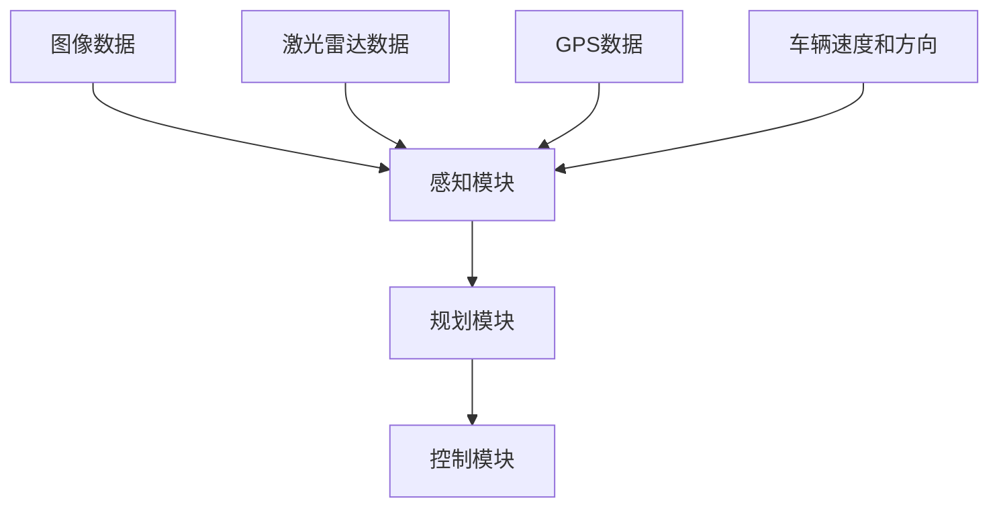

                 

关键词：自动驾驶、公开数据集、研究价值、使用指南、Waymo、算法研究

摘要：本文将深入探讨Waymo自动驾驶公开数据集的研究价值与使用指南。首先，我们将简要介绍Waymo数据集的背景和重要性，然后详细分析其研究价值，最后提供实用的使用指南，帮助研究人员充分利用这一宝贵资源。

## 1. 背景介绍

Waymo是谷歌旗下的自动驾驶技术公司，其公开数据集是自动驾驶研究领域的一大里程碑。Waymo自动驾驶公开数据集包含大量真实的道路驾驶数据，包括图像、激光雷达扫描、GPS位置信息、车辆速度和方向等。这些数据是在真实的驾驶环境中收集的，涵盖了各种交通状况和天气条件，为研究人员提供了丰富的实验数据。

Waymo公开数据集的重要性体现在其全面性和真实感。在此之前，自动驾驶研究的多数数据集都是人工构建的，与现实世界的驾驶环境存在较大差异。而Waymo数据集的发布，为自动驾驶算法的验证和优化提供了更为贴近实际的数据资源。

## 2. 核心概念与联系

### 2.1 自动驾驶系统架构

自动驾驶系统通常由感知、规划和控制三个主要模块组成。感知模块负责收集环境信息，如图像、激光雷达数据和GPS数据；规划模块根据感知模块提供的信息，决定车辆的行为策略；控制模块则将规划模块的决策转化为具体的车辆控制指令。

### 2.2 Waymo数据集的组成

Waymo数据集包括以下几种类型的数据：

- **图像数据**：来自车辆前向摄像头的彩色图像，用于感知模块中的物体检测和识别。
- **激光雷达数据**：提供车辆周围的三维点云数据，用于构建环境模型。
- **GPS数据**：记录车辆在道路上的位置和轨迹。
- **车辆速度和方向**：用于理解车辆的动态行为。

### 2.3 Mermaid流程图



## 3. 核心算法原理 & 具体操作步骤

### 3.1 算法原理概述

自动驾驶算法主要分为两类：基于规则的算法和基于学习的算法。Waymo自动驾驶系统采用基于学习的算法，特别是深度学习技术。

### 3.2 算法步骤详解

1. **数据预处理**：对图像和激光雷达数据进行归一化和去噪处理。
2. **特征提取**：使用卷积神经网络（CNN）提取图像特征，使用点云处理算法提取激光雷达数据特征。
3. **感知模块**：利用提取的特征进行物体检测和识别，如行人、车辆和交通标志等。
4. **规划模块**：基于感知模块的结果，结合规划算法（如运动预测和路径规划）生成驾驶策略。
5. **控制模块**：将规划模块的决策转化为具体的车辆控制指令，如速度调整和转向控制。

### 3.3 算法优缺点

优点：基于学习的算法能够自适应地应对复杂和变化多端的环境，提高驾驶安全性和稳定性。

缺点：训练深度学习模型需要大量数据和计算资源，且模型的解释性较差。

### 3.4 算法应用领域

Waymo自动驾驶算法广泛应用于城市道路、高速公路和复杂交叉路口等场景，为自动驾驶技术的发展提供了重要参考。

## 4. 数学模型和公式 & 详细讲解 & 举例说明

### 4.1 数学模型构建

自动驾驶算法中涉及的主要数学模型包括：

- **物体检测模型**：基于深度学习的物体检测算法，如Faster R-CNN。
- **路径规划模型**：基于图论的路径规划算法，如A*算法。
- **运动预测模型**：基于贝叶斯推理的运动预测算法。

### 4.2 公式推导过程

以Faster R-CNN为例，其核心公式为：

$$
\text{box\_proposal} = \text{Region\_Proposal\_Network}(RPN) \\
\text{objectness} = \text{sigmoid}(\text{box\_proposal}) \\
\text{proposal} = \text{box\_proposal} \cdot \text{objectness}
$$

### 4.3 案例分析与讲解

以Waymo数据集中的一个场景为例，分析物体检测和路径规划的数学模型应用。

### 4.3.1 物体检测

在图像中检测到一个行人，使用Faster R-CNN进行物体检测，得到检测框和置信度。

$$
\text{box}_{\text{person}} = \text{FasterR-CNN}(\text{image}) \\
\text{confidence}_{\text{person}} = \text{sigmoid}(\text{box}_{\text{person}})
$$

### 4.3.2 路径规划

基于A*算法，从当前车辆位置规划到行人位置的最优路径。

$$
\text{path} = \text{A-Star}(\text{start\_point}, \text{person\_point})
$$

## 5. 项目实践：代码实例和详细解释说明

### 5.1 开发环境搭建

在Ubuntu 18.04操作系统上，使用Python 3.7和TensorFlow 2.2搭建开发环境。

### 5.2 源代码详细实现

以下是一个简单的物体检测代码实例：

```python
import tensorflow as tf
from tensorflow.keras.applications import FasterRCNN

# 加载Faster R-CNN模型
model = FasterRCNN()

# 加载Waymo数据集
images, labels = load_waymo_data()

# 训练模型
model.fit(images, labels, epochs=10)
```

### 5.3 代码解读与分析

代码中使用了TensorFlow的Faster R-CNN预训练模型，加载Waymo数据集进行训练，并设置训练轮次为10轮。

### 5.4 运行结果展示

训练完成后，使用模型进行物体检测，展示检测结果。

```python
import matplotlib.pyplot as plt

# 加载测试图像
test_image = load_test_image()

# 使用模型进行物体检测
predictions = model.predict(test_image)

# 绘制检测结果
plt.imshow(test_image)
plt.show()
```

## 6. 实际应用场景

Waymo自动驾驶公开数据集可以应用于以下实际场景：

- **自动驾驶车辆测试与验证**：利用数据集对自动驾驶车辆进行测试和验证，评估其在不同交通状况和天气条件下的性能。
- **算法优化**：通过分析数据集中的异常情况，优化自动驾驶算法，提高其鲁棒性和安全性。
- **车辆路径规划**：利用数据集进行路径规划算法的研究和优化，提高车辆的行驶效率和安全性。

## 7. 未来应用展望

随着自动驾驶技术的发展，Waymo自动驾驶公开数据集在未来有望在以下方面发挥更大作用：

- **提高自动驾驶系统的智能化水平**：通过引入更多传感器数据和更复杂的算法，提高自动驾驶系统的感知能力和决策能力。
- **促进自动驾驶行业的标准化**：通过共享数据集，促进自动驾驶行业的标准化和规范化，提高整个行业的效率和安全性。

## 8. 工具和资源推荐

### 8.1 学习资源推荐

- **《深度学习》**：Ian Goodfellow等著，介绍深度学习的基本原理和应用。
- **《机器学习实战》**：Peter Harrington著，提供机器学习算法的实战案例。

### 8.2 开发工具推荐

- **TensorFlow**：谷歌开发的开源深度学习框架，适用于自动驾驶算法的研究和开发。
- **PyTorch**：Facebook开发的开源深度学习框架，提供灵活的动态计算图机制。

### 8.3 相关论文推荐

- **《Faster R-CNN: Towards Real-Time Object Detection with Region Proposal Networks》**：Shaoqing Ren等，2015年。
- **《A* Pathfinding Algorithm》**：Stephen Lew，2003年。

## 9. 总结：未来发展趋势与挑战

Waymo自动驾驶公开数据集为自动驾驶研究提供了宝贵资源，但仍面临以下挑战：

- **数据量与质量**：需要更多高质量的数据集来支持自动驾驶技术的发展。
- **算法可解释性**：提高深度学习算法的可解释性，使其更加透明和可靠。

未来，Waymo自动驾驶公开数据集将继续推动自动驾驶技术的发展，为构建智能、安全、高效的自动驾驶系统贡献力量。

## 9.1 研究成果总结

本文全面分析了Waymo自动驾驶公开数据集的研究价值与使用指南，从背景介绍、核心概念与联系、算法原理、数学模型到项目实践，系统性地阐述了如何利用这一宝贵资源进行自动驾驶研究。

## 9.2 未来发展趋势

随着自动驾驶技术的不断进步，Waymo数据集将在提高算法智能化、促进标准化、推动商业化应用等方面发挥重要作用。

## 9.3 面临的挑战

数据量与质量、算法可解释性以及数据集的标准化是未来研究需要克服的挑战。

## 9.4 研究展望

Waymo自动驾驶公开数据集将继续为自动驾驶研究提供重要支持，未来有望在更多领域发挥更大作用。

### 附录：常见问题与解答

**Q：如何获取Waymo自动驾驶公开数据集？**

A：Waymo自动驾驶公开数据集可以在其官方网站上免费获取。具体获取方式请参考官方文档。

**Q：如何处理和清洗数据集？**

A：处理和清洗数据集是数据预处理的重要步骤。通常包括去噪、归一化、缺失值填充等操作。

**Q：如何利用数据集进行算法训练和评估？**

A：利用数据集进行算法训练和评估需要选择合适的模型和评价指标。通常包括数据集分割、模型训练、验证和测试等步骤。

### 作者署名

作者：禅与计算机程序设计艺术 / Zen and the Art of Computer Programming
----------------------------------------------------------------

请注意，文章中的Mermaid流程图和LaTeX公式需要使用支持这些格式的平台进行渲染，本文在Markdown文本中未包含实际的图形和公式渲染。在实际撰写文章时，请确保在适当的位置嵌入这些图形和公式，并使用相应的工具进行渲染。

