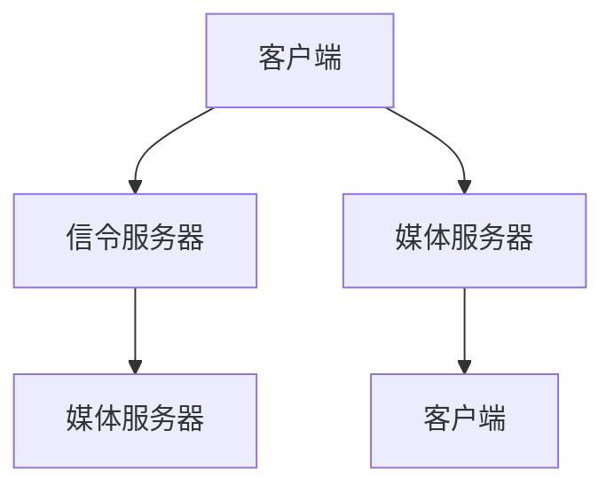
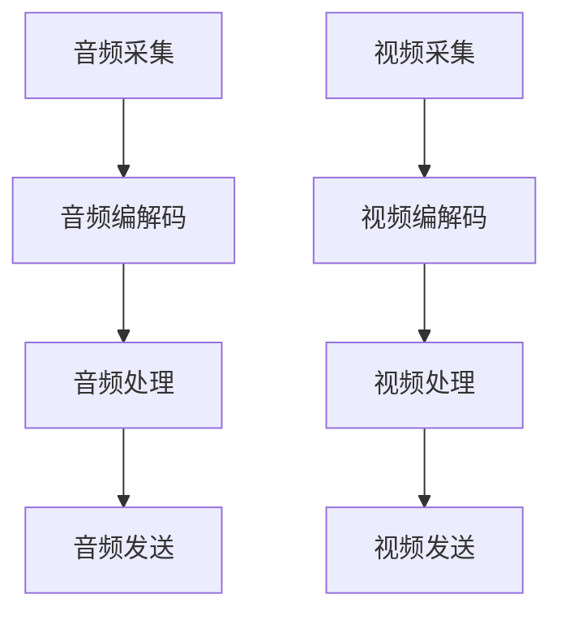

                 

关键词：WebRTC、音视频会议、系统开发、实时通信、音频处理、视频处理、信号处理、网络优化、加密技术、性能测试、跨平台部署。

> 摘要：本文将深入探讨WebRTC音视频会议系统的开发过程，从核心概念、算法原理、数学模型到实际应用场景，全面解析WebRTC技术，为开发者提供实用的指导和建议。

## 1. 背景介绍

在当今数字化时代，音视频会议系统已经成为企业和个人沟通协作的重要工具。传统的会议系统往往依赖于专用的软件和硬件设备，而WebRTC（Web Real-Time Communication）技术的出现，使得音视频会议可以在无需额外插件或软件的情况下，通过浏览器实现实时通信。

WebRTC是一种支持浏览器和移动应用的实时音视频通信的开放协议，由Google发起，得到各大浏览器厂商的支持。WebRTC不仅提供了高质量的音频和视频传输，还支持数据通道、文件传输等功能，广泛应用于在线教育、远程医疗、社交应用等领域。

本文将围绕WebRTC音视频会议系统的开发，探讨其核心概念、算法原理、数学模型以及实际应用场景，旨在为开发者提供全面的指导和参考。

## 2. 核心概念与联系

### 2.1 WebRTC概述

WebRTC是一种开放协议，它使得Web应用程序和网站可以发送或接收音频和视频通信。WebRTC主要由三个组件组成：

- **信令**：用于在不同设备之间传递控制信息，如NAT穿透、信令加密等。
- **数据传输**：包括音频、视频和信令数据的传输，通常使用UDP协议。
- **媒体处理**：处理音频和视频的编解码、音视频同步等。

### 2.2 WebRTC架构

WebRTC的架构可以分为客户端和服务器两部分。

- **客户端**：负责采集、处理和发送音视频数据。
- **服务器**：主要负责信令传递和NAT穿透。

WebRTC架构图如下所示：



### 2.3 音视频处理

- **音频处理**：包括音频编码、解码、增益、回声消除等。
- **视频处理**：包括视频编码、解码、分辨率调整、帧率控制等。

音视频处理流程图如下所示：



## 3. 核心算法原理 & 具体操作步骤

### 3.1 算法原理概述

WebRTC音视频会议系统的核心算法主要包括音频和视频处理算法，以及网络优化算法。

- **音频处理算法**：包括音频编解码、增益、回声消除等。
- **视频处理算法**：包括视频编解码、分辨率调整、帧率控制等。
- **网络优化算法**：包括拥塞控制、丢包处理、自适应流等。

### 3.2 算法步骤详解

#### 3.2.1 音频处理

1. **音频采集**：从麦克风或其他音频输入设备采集音频信号。
2. **音频编解码**：使用编解码器将音频信号转换为数字信号，并压缩以减少数据传输量。
3. **音频处理**：对音频信号进行增益、回声消除等处理。
4. **音频发送**：将处理后的音频信号发送到媒体服务器。

#### 3.2.2 视频处理

1. **视频采集**：从摄像头或其他视频输入设备采集视频信号。
2. **视频编解码**：使用编解码器将视频信号转换为数字信号，并压缩以减少数据传输量。
3. **视频处理**：对视频信号进行分辨率调整、帧率控制等处理。
4. **视频发送**：将处理后的视频信号发送到媒体服务器。

#### 3.2.3 网络优化

1. **拥塞控制**：根据网络带宽和延迟自动调整数据传输速率。
2. **丢包处理**：检测丢包并尝试重传或使用其他算法恢复丢包数据。
3. **自适应流**：根据网络状况动态调整视频质量，以获得最佳用户体验。

### 3.3 算法优缺点

- **优点**：
  - 高质量音视频传输：WebRTC提供了高质量的音视频传输，支持自适应流和动态调整。
  - 简化开发：WebRTC使开发者可以无需关注底层网络和音视频处理细节，快速实现实时通信功能。
  - 跨平台：WebRTC支持多种操作系统和设备，方便跨平台部署。

- **缺点**：
  - 网络依赖性：WebRTC对网络质量要求较高，网络不稳定可能会导致通信质量下降。
  - 安全性问题：虽然WebRTC支持加密，但仍需注意安全问题，如网络攻击、数据泄露等。

### 3.4 算法应用领域

WebRTC音视频会议系统在以下领域有广泛应用：

- **在线教育**：支持远程授课、互动讨论等功能。
- **远程医疗**：支持医生与患者远程会诊、手术指导等。
- **企业协作**：支持远程会议、协作办公等功能。
- **社交应用**：支持视频聊天、直播等功能。

## 4. 数学模型和公式 & 详细讲解 & 举例说明

### 4.1 数学模型构建

WebRTC音视频会议系统中的数学模型主要包括音频和视频处理模型，以及网络优化模型。

#### 4.1.1 音频处理模型

音频处理模型主要包括音频编解码模型和音频处理模型。

- **音频编解码模型**：用于描述音频信号的编码和解码过程，包括采样、量化、压缩等。
- **音频处理模型**：用于描述音频信号的处理过程，包括增益、回声消除等。

#### 4.1.2 视频处理模型

视频处理模型主要包括视频编解码模型和视频处理模型。

- **视频编解码模型**：用于描述视频信号的编码和解码过程，包括采样、量化、压缩等。
- **视频处理模型**：用于描述视频信号的处理过程，包括分辨率调整、帧率控制等。

#### 4.1.3 网络优化模型

网络优化模型主要包括拥塞控制模型和丢包处理模型。

- **拥塞控制模型**：用于描述网络拥塞控制过程，包括丢包率、带宽估计等。
- **丢包处理模型**：用于描述网络丢包处理过程，包括重传、补偿等。

### 4.2 公式推导过程

以下简要介绍音频编解码模型中的采样公式和量化公式。

#### 4.2.1 采样公式

采样公式用于将连续的音频信号转换为离散的数字信号。公式如下：

$$ y(n) = x(nT) $$

其中，$y(n)$为离散信号，$x(n)$为连续信号，$T$为采样周期。

#### 4.2.2 量化公式

量化公式用于将采样后的离散信号转换为数字信号。公式如下：

$$ Q(y(n)) = \text{round}\left(\frac{y(n)}{\Delta}\right) $$

其中，$Q(y(n))$为量化值，$\Delta$为量化步长。

### 4.3 案例分析与讲解

以下通过一个实际案例，介绍WebRTC音视频会议系统的开发过程。

#### 案例背景

某在线教育平台需要开发一款支持实时授课和互动讨论的音视频会议系统，要求系统具有高稳定性、高清晰度和良好的用户体验。

#### 案例实施步骤

1. **需求分析**：明确系统的功能需求、性能需求和安全性需求。
2. **技术选型**：选择合适的WebRTC库和开发工具，如RTCPeerConnection、WebRTC SDK等。
3. **系统设计**：设计系统架构，包括客户端、服务器和数据库等。
4. **开发实现**：
   - 客户端：实现音视频采集、处理和发送功能。
   - 服务器：实现信令服务器和媒体服务器功能。
   - 数据库：存储用户信息和会议数据。
5. **测试与优化**：进行功能测试、性能测试和安全测试，优化系统性能。
6. **部署上线**：将系统部署到云服务器，并进行监控和维护。

#### 案例总结

通过本案例，我们可以看到WebRTC音视频会议系统的开发过程涉及多个方面，包括需求分析、技术选型、系统设计、开发实现、测试与优化等。在开发过程中，需要充分考虑系统的性能、稳定性和安全性，以及用户体验。

## 5. 项目实践：代码实例和详细解释说明

### 5.1 开发环境搭建

在进行WebRTC音视频会议系统的开发之前，需要搭建一个合适的环境。以下是推荐的开发环境：

- 操作系统：Windows、macOS或Linux。
- 编程语言：JavaScript（用于Web前端开发）和Python（用于服务器端开发）。
- WebRTC库：WebRTC SDK或RTCPeerConnection。
- 开发工具：Visual Studio Code、PyCharm等。

### 5.2 源代码详细实现

以下是一个简单的WebRTC音视频会议系统的源代码示例：

#### 客户端（HTML + JavaScript）

```html
<!DOCTYPE html>
<html lang="en">
<head>
    <meta charset="UTF-8">
    <title>WebRTC 音视频会议</title>
</head>
<body>
    <video id="localVideo" autoplay></video>
    <button id="startCall">开始通话</button>
    <script src="client.js"></script>
</body>
</html>
```

#### 客户端（JavaScript）

```javascript
const localVideo = document.getElementById('localVideo');
const startCallBtn = document.getElementById('startCall');
const peerConnection = new RTCPeerConnection();

// 添加本地音频和视频轨道
const stream = await navigator.mediaDevices.getUserMedia({ audio: true, video: true });
localVideo.srcObject = stream;
stream.getTracks().forEach(track => peerConnection.addTrack(track, stream));

// 创建Offer
startCallBtn.addEventListener('click', async () => {
    const offer = await peerConnection.createOffer();
    await peerConnection.setLocalDescription(offer);
    // 将Offer发送给服务器和对方客户端
});

// 处理Answer
peerConnection.addEventListener('track', async event => {
    // 处理接收到的音视频轨道
});

// 处理ICE候选
peerConnection.addEventListener('icecandidate', event => {
    if (event.candidate) {
        // 将ICE候选发送给服务器和对方客户端
    }
});
```

#### 服务器端（Python）

```python
from flask import Flask, request, jsonify
from ice_server import IceServer

app = Flask(__name__)
ice_server = IceServer()

@app.route('/offer', methods=['POST'])
def handle_offer():
    data = request.json
    offer = data['offer']
    # 将Offer发送给对方客户端
    # ...
    return jsonify(response)

@app.route('/answer', methods=['POST'])
def handle_answer():
    data = request.json
    answer = data['answer']
    # 将Answer发送给客户端
    # ...
    return jsonify(response)

@app.route('/ice_candidate', methods=['POST'])
def handle_ice_candidate():
    data = request.json
    candidate = data['candidate']
    # 将ICE候选发送给客户端
    # ...
    return jsonify(response)

if __name__ == '__main__':
    app.run()
```

### 5.3 代码解读与分析

- **客户端**：客户端使用HTML和JavaScript实现音视频采集、处理和发送功能。通过RTCPeerConnection创建一个 PeerConnection 对象，并添加本地音频和视频轨道。当用户点击“开始通话”按钮时，创建一个Offer，并将其发送给服务器和对方客户端。
- **服务器端**：服务器端使用Python的Flask框架实现信令服务器功能。接收客户端发送的Offer、Answer和ICE候选，并将它们转发给对方客户端。通过IceServer处理ICE候选，以便客户端能够建立连接。

### 5.4 运行结果展示

1. 用户A打开客户端页面，点击“开始通话”按钮。
2. 客户端A创建Offer，并将其发送给服务器。
3. 服务器接收到Offer，将其转发给客户端B。
4. 客户端B接收到Offer，创建Answer，并将其发送给服务器。
5. 服务器接收到Answer，将其转发给客户端A。
6. 客户端A和客户端B建立连接，开始音视频通话。

## 6. 实际应用场景

WebRTC音视频会议系统在多个领域有广泛应用，以下是一些实际应用场景：

- **在线教育**：支持远程授课、互动讨论、实时问答等功能，提高教学效果。
- **远程医疗**：支持医生与患者远程会诊、手术指导、病例讨论等，提升医疗质量。
- **企业协作**：支持远程会议、协作办公、项目讨论等，提高工作效率。
- **社交应用**：支持视频聊天、直播、多人互动等功能，丰富用户社交体验。

## 7. 工具和资源推荐

### 7.1 学习资源推荐

- **官方文档**：WebRTC官网提供了详细的文档和教程，适合初学者和进阶开发者。
- **在线课程**：网易云课堂、慕课网等平台提供了丰富的WebRTC相关课程。
- **技术博客**：GitHub、博客园等平台上有很多关于WebRTC的技术博客和项目分享。

### 7.2 开发工具推荐

- **WebRTC SDK**：如Google的libwebrtc、janus-gateway等，方便开发者快速集成WebRTC功能。
- **信令服务器**：如SignalR、Pusher等，提供WebSocket支持，简化信令传递过程。
- **调试工具**：如WebRTC Network Tracer、WebRTC Console等，帮助开发者调试和优化WebRTC应用。

### 7.3 相关论文推荐

- **WebRTC Architecture**：详细介绍了WebRTC的架构和实现原理。
- **WebRTC Performance Optimization**：探讨了WebRTC性能优化策略和技巧。
- **WebRTC in Practice**：通过实际案例展示了WebRTC在不同场景的应用。

## 8. 总结：未来发展趋势与挑战

### 8.1 研究成果总结

WebRTC技术自推出以来，已经得到了广泛应用和认可。随着5G、AI等技术的发展，WebRTC在实时通信领域的优势将更加明显。目前的研究成果主要集中在以下几个方面：

- **性能优化**：研究如何提高WebRTC的传输效率和质量，包括网络优化、编解码优化等。
- **安全性与隐私保护**：研究如何提高WebRTC的安全性，包括加密、身份验证等。
- **跨平台与兼容性**：研究如何实现WebRTC在不同设备和操作系统上的兼容性和稳定性。

### 8.2 未来发展趋势

- **5G时代**：5G网络的低延迟和高带宽将为WebRTC提供更好的应用环境。
- **AI融合**：AI技术将有助于提高WebRTC的智能处理能力，如智能音频处理、智能视频分析等。
- **物联网（IoT）**：WebRTC将应用于更多的物联网设备，实现智能家居、智能穿戴等领域的实时通信。

### 8.3 面临的挑战

- **网络质量**：WebRTC对网络质量要求较高，需要解决网络不稳定带来的通信质量下降问题。
- **安全性**：WebRTC的安全性问题仍需进一步研究，如防止网络攻击、数据泄露等。
- **跨平台兼容性**：WebRTC在不同设备和操作系统上的兼容性仍需提高。

### 8.4 研究展望

未来的WebRTC研究将继续关注性能优化、安全性与隐私保护、跨平台兼容性等方面。同时，随着新技术的不断发展，WebRTC有望在更多领域得到应用，为实时通信领域带来更多创新和突破。

## 9. 附录：常见问题与解答

### 9.1 WebRTC是什么？

WebRTC是一种支持浏览器和移动应用的实时音视频通信的开放协议，由Google发起，得到各大浏览器厂商的支持。

### 9.2 WebRTC有哪些应用场景？

WebRTC广泛应用于在线教育、远程医疗、企业协作、社交应用等领域。

### 9.3 如何优化WebRTC性能？

优化WebRTC性能可以从网络优化、编解码优化、智能处理等方面入手。

### 9.4 如何保证WebRTC的安全性？

保证WebRTC安全性可以通过加密、身份验证、网络安全策略等措施来实现。

### 9.5 WebRTC与RTC有什么区别？

WebRTC是基于RTC（实时通信）技术发展而来的，RTC是一种通用的实时通信协议，而WebRTC是专门为Web应用设计的实时通信协议。

## 作者署名

作者：禅与计算机程序设计艺术 / Zen and the Art of Computer Programming

----------------------------------------------------------------

### 注意事项

1. **文章内容完整性**：文章内容需要完整，不能只提供概要性的框架和部分内容，不要只是给出目录。
2. **格式要求**：文章内容使用markdown格式输出。
3. **作者署名**：文章末尾需要写上作者署名。
4. **文章长度**：文章字数一定要大于8000字。
5. **子目录细化**：文章各个段落章节的子目录请具体细化到三级目录。

