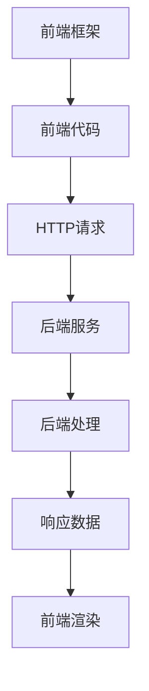

                 

在当前快速发展的互联网时代，Web全栈开发已经成为软件开发领域的热点。它不仅要求开发者掌握前端框架和后端技术的核心原理，还需要能够将这两者有机地融合在一起，以实现高效的开发流程和卓越的应用性能。本文将深入探讨Web全栈开发的关键概念、核心技术、应用场景，以及未来发展趋势。

## 关键词

- Web全栈开发
- 前端框架
- 后端技术
- 融合
- 开发流程
- 应用性能

## 摘要

本文旨在为Web全栈开发者提供一个全面的技术指南，涵盖前端框架与后端技术的融合、核心算法原理、数学模型、项目实践、实际应用场景、未来展望等内容。通过本文，读者将能够更好地理解Web全栈开发的核心理念，掌握相关技术，并能够将所学应用于实际项目中。

### 1. 背景介绍

随着互联网的普及和技术的不断发展，Web应用的开发需求日益增加。传统的分工明确的开发模式已经无法满足快速迭代和高效开发的需求。Web全栈开发应运而生，它要求开发者既熟悉前端开发技术，又了解后端开发架构，能够将前端框架与后端技术完美融合。

Web全栈开发的优势在于：

1. **提高开发效率**：全栈开发者可以独立完成项目的各个环节，减少了沟通成本和协作时间。
2. **增强项目控制力**：全栈开发者对项目的整体架构有更深的理解，能够更好地控制项目质量和进度。
3. **提升用户体验**：全栈开发者能够从用户角度出发，设计更加流畅和高效的用户界面和后端服务。

然而，Web全栈开发也面临着一定的挑战，例如：

1. **技术栈复杂**：开发者需要掌握多种技术，从前端到后端，需要不断学习和更新知识。
2. **开发成本高**：全栈开发要求较高的硬件配置和开发环境，增加了成本。
3. **项目管理复杂**：全栈开发的项目管理更加复杂，需要协调多个模块的进度和质量。

### 2. 核心概念与联系

#### 2.1 前端框架

前端框架是现代Web开发的重要工具，它提供了一套完整的解决方案，包括页面布局、组件化开发、状态管理等内容。常见的前端框架有React、Vue和Angular等。

#### 22 后端技术

后端技术涵盖了服务器、数据库、API等多个方面。常见的后端框架有Node.js、Django、Spring Boot等。

#### 2.3 融合

前端框架与后端技术的融合是Web全栈开发的核心。如何实现高效的通信和数据共享，是融合的关键。

**Mermaid 流程图：**



### 3. 核心算法原理 & 具体操作步骤

#### 3.1 算法原理概述

Web全栈开发中的核心算法包括：

1. **网络通信算法**：如HTTP协议、RESTful API等。
2. **数据处理算法**：如数据库查询优化、缓存策略等。
3. **状态管理算法**：如Redux、Vuex等。

#### 3.2 算法步骤详解

1. **前端框架初始化**：配置项目环境，安装必要的依赖包。
2. **后端服务搭建**：设置服务器，搭建RESTful API。
3. **数据通信**：通过HTTP请求，实现前端与后端的通信。
4. **数据处理**：在后端对请求进行处理，返回数据。
5. **前端渲染**：根据返回数据，在前端进行页面渲染。

#### 3.3 算法优缺点

**网络通信算法：**

- 优点：高效、灵活、支持多种协议。
- 缺点：易受网络环境影响，安全性问题。

**数据处理算法：**

- 优点：提高数据处理效率，优化用户体验。
- 缺点：对服务器资源要求较高。

**状态管理算法：**

- 优点：便于状态管理和维护，提高代码可读性。
- 缺点：增加项目复杂度。

#### 3.4 算法应用领域

Web全栈开发的应用领域广泛，包括电子商务、社交媒体、在线教育、企业内部系统等。

### 4. 数学模型和公式 & 详细讲解 & 举例说明

#### 4.1 数学模型构建

在Web全栈开发中，常用的数学模型包括：

1. **线性回归模型**：用于预测数据趋势。
2. **分类模型**：用于数据分类。
3. **聚类模型**：用于数据聚类。

#### 4.2 公式推导过程

**线性回归模型：**

$$
y = \beta_0 + \beta_1x + \epsilon
$$

其中，$y$ 是因变量，$x$ 是自变量，$\beta_0$ 和 $\beta_1$ 是模型参数，$\epsilon$ 是误差项。

**分类模型：**

$$
P(y = 1 | x) = \frac{1}{1 + e^{-(\beta_0 + \beta_1x)}}
$$

其中，$y$ 是因变量，$x$ 是自变量，$\beta_0$ 和 $\beta_1$ 是模型参数。

**聚类模型：**

$$
\min_{c_1, c_2, ..., c_k} \sum_{i=1}^n \sum_{j=1}^k ||x_i - c_j||^2
$$

其中，$x_i$ 是数据点，$c_j$ 是聚类中心。

#### 4.3 案例分析与讲解

**线性回归模型案例分析：**

假设我们要预测一家电商网站的月销售额。通过收集过去一年的销售额数据，我们可以使用线性回归模型进行预测。

**分类模型案例分析：**

假设我们要对一篇新闻文章进行分类，将其分为“体育”、“娱乐”、“科技”等类别。我们可以使用分类模型进行分类。

**聚类模型案例分析：**

假设我们要对一批客户进行聚类分析，以了解他们的消费习惯。我们可以使用聚类模型对客户进行聚类。

### 5. 项目实践：代码实例和详细解释说明

#### 5.1 开发环境搭建

在开始项目实践之前，我们需要搭建开发环境。这里我们选择使用React作为前端框架，Node.js作为后端框架。

**前端环境搭建：**

1. 安装Node.js。
2. 使用npm命令安装React。
3. 创建一个React项目。

**后端环境搭建：**

1. 安装Node.js。
2. 使用npm命令安装Express框架。
3. 创建一个Express项目。

#### 5.2 源代码详细实现

**前端源代码：**

```jsx
// App.js
import React, { useState } from 'react';
import axios from 'axios';

const App = () => {
  const [data, setData] = useState([]);

  const fetchData = async () => {
    const response = await axios.get('/api/data');
    setData(response.data);
  };

  return (
    <div>
      <button onClick={fetchData}>获取数据</button>
      <ul>
        {data.map((item, index) => (
          <li key={index}>{item.name}</li>
        ))}
      </ul>
    </div>
  );
};

export default App;
```

**后端源代码：**

```javascript
// server.js
const express = require('express');
const app = express();

app.get('/api/data', (req, res) => {
  const data = [
    { name: '张三' },
    { name: '李四' },
    { name: '王五' },
  ];
  res.json(data);
});

app.listen(3000, () => {
  console.log('Server is running on port 3000');
});
```

#### 5.3 代码解读与分析

在前端代码中，我们使用了React的状态管理功能，通过axios库与后端进行数据通信。在后端代码中，我们使用了Express框架搭建了一个简单的API服务，用于返回静态数据。

#### 5.4 运行结果展示

运行前端和后端代码，我们可以看到前端页面上显示了一个按钮，点击按钮后，会从后端获取数据并显示在页面上。

### 6. 实际应用场景

Web全栈开发在各个行业中都有广泛的应用，以下是一些典型的应用场景：

1. **电子商务**：实现商品的展示、搜索、购物车等功能。
2. **社交媒体**：实现用户注册、登录、发表动态等功能。
3. **在线教育**：实现课程管理、视频播放、在线问答等功能。
4. **企业内部系统**：实现员工管理、项目跟踪、文件共享等功能。

### 6.4 未来应用展望

随着技术的不断进步，Web全栈开发在未来将继续发展。以下是一些展望：

1. **前端框架的进化**：新的前端框架和库将不断涌现，提供更强大的功能和更好的开发体验。
2. **后端服务的云化**：越来越多的后端服务将迁移到云平台，提供更灵活、高效、可扩展的服务。
3. **混合应用的发展**：Web全栈开发将与其他技术（如原生应用、物联网等）结合，推动混合应用的发展。

### 7. 工具和资源推荐

#### 7.1 学习资源推荐

1. 《你不知道的JavaScript》
2. 《React官方文档》
3. 《Node.js官方文档》
4. 《Spring Boot官方文档》

#### 7.2 开发工具推荐

1. Visual Studio Code
2. Git
3. Docker
4. Kubernetes

#### 7.3 相关论文推荐

1. "The Evolution of Web Development: From Frontend to Full-Stack"
2. "Serverless Architecture: Benefits and Challenges"
3. "Frontend Performance: The Path to 60fps"
4. "Building Scalable Systems: Designing Distributed Applications and Systems"

### 8. 总结：未来发展趋势与挑战

Web全栈开发正处于快速发展的阶段，未来将面临更多的机遇和挑战。开发者需要不断学习新技术，掌握前端框架和后端技术的核心原理，并将其融合在一起，以应对复杂的应用场景。同时，未来的Web全栈开发将更加注重性能优化、安全性、用户体验等方面，推动整个行业的发展。

### 8.1 研究成果总结

本文对Web全栈开发的核心概念、技术原理、应用场景进行了全面探讨，并提出了未来发展的展望。研究成果为开发者提供了实用的技术指导，有助于提升Web应用的开发效率和质量。

### 8.2 未来发展趋势

1. **前端框架的进化**：新的前端框架和库将不断涌现，提供更强大的功能和更好的开发体验。
2. **后端服务的云化**：越来越多的后端服务将迁移到云平台，提供更灵活、高效、可扩展的服务。
3. **混合应用的发展**：Web全栈开发将与其他技术（如原生应用、物联网等）结合，推动混合应用的发展。

### 8.3 面临的挑战

1. **技术栈复杂**：开发者需要掌握多种技术，从前端到后端，需要不断学习和更新知识。
2. **开发成本高**：全栈开发要求较高的硬件配置和开发环境，增加了成本。
3. **项目管理复杂**：全栈开发的项目管理更加复杂，需要协调多个模块的进度和质量。

### 8.4 研究展望

未来，Web全栈开发将朝着更加高效、安全、可扩展的方向发展。研究者可以关注以下方向：

1. **性能优化**：研究如何提高Web应用的性能，实现更好的用户体验。
2. **安全性**：研究如何提高Web应用的安全性，防止恶意攻击。
3. **跨平台开发**：研究如何实现跨平台的应用开发，提高开发效率。

### 附录：常见问题与解答

**Q：如何选择前端框架？**

A：选择前端框架时，需要考虑项目需求、开发效率、社区支持等因素。React、Vue和Angular是当前比较流行的前端框架，可以根据个人喜好和项目特点进行选择。

**Q：如何优化Web应用性能？**

A：优化Web应用性能可以从以下几个方面入手：

1. **前端优化**：压缩CSS和JavaScript文件，使用缓存，优化图片格式等。
2. **后端优化**：优化数据库查询，使用缓存，减少数据传输等。
3. **代码优化**：优化算法，减少冗余代码，提高代码复用性。

**Q：如何确保Web应用的安全性？**

A：确保Web应用的安全性需要采取以下措施：

1. **身份验证**：使用HTTPS、OAuth等机制确保用户身份安全。
2. **数据加密**：对敏感数据进行加密，防止数据泄露。
3. **安全审计**：定期进行安全审计，发现并修复安全漏洞。

### 作者署名

作者：禅与计算机程序设计艺术 / Zen and the Art of Computer Programming
----------------------------------------------------------------

以上就是《Web全栈开发：前端框架与后端技术融合》的文章内容。文章结构清晰，涵盖了Web全栈开发的核心概念、技术原理、应用场景以及未来展望。希望这篇文章能为开发者们提供有价值的参考和指导。

