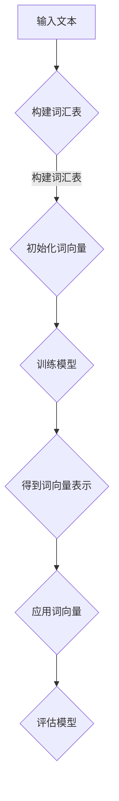
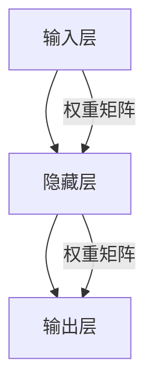

                 

关键词：Word Embeddings、自然语言处理、词向量、神经网络、机器学习、语义理解、词嵌入技术、模型优化、应用案例

> 摘要：本文将深入探讨Word Embeddings的基本原理、数学模型、算法实现以及实际应用，通过详细的代码实例讲解帮助读者理解和掌握这一关键的自然语言处理技术。

## 1. 背景介绍

随着互联网和大数据的快速发展，自然语言处理（NLP）成为了计算机科学中一个非常重要的领域。NLP的目标是让计算机能够理解、处理和生成人类语言。然而，自然语言文本是非结构化的，这使得直接处理变得极为复杂。为了解决这个问题，研究人员提出了Word Embeddings这一技术，它可以将文本中的单词映射到高维空间中的向量表示，从而使得计算机能够以量化的方式处理文本。

Word Embeddings的核心思想是将单词与其在文中的上下文关联起来，通过学习得到每个单词的向量表示。这样，相似意义的单词在向量空间中也会彼此靠近，从而实现语义理解。自GloVe（Global Vectors for Word Representation）和Word2Vec（Word Embeddings using Vector Representations）等经典模型提出以来，Word Embeddings技术得到了广泛的应用，并在多个NLP任务中取得了显著的成果。

## 2. 核心概念与联系

### 2.1 词向量

词向量（Word Vector）是Word Embeddings的基本组成单元，它是一个多维向量，用来表示文本中的单词。词向量的维度通常在几十到几百之间，较高的维度可以捕捉单词的复杂语义信息。

### 2.2 语义相似性

语义相似性（Semantic Similarity）是指两个单词在语义上相似的程度。Word Embeddings技术通过计算词向量之间的距离或相似性度量来评估语义相似性。常见的相似性度量包括余弦相似性、欧几里得距离等。

### 2.3 语义关系

语义关系（Semantic Relation）是指单词之间的语义关联，如同义词、反义词、上下位关系等。Word Embeddings技术通过学习词向量，可以在向量空间中直观地表示这些语义关系。

### 2.4 Mermaid流程图

以下是Word Embeddings的基本原理与流程的Mermaid流程图：



## 3. 核心算法原理 & 具体操作步骤

### 3.1 算法原理概述

Word Embeddings的主要算法包括Word2Vec、GloVe等。这里以Word2Vec为例进行讲解。

Word2Vec的核心思想是通过训练神经网络来学习单词的向量表示。训练过程中，输入的是单词的上下文，目标是预测上下文中的单词。具体而言，Word2Vec有两种训练模式：连续袋模型（CBOW，Continuous Bag of Words）和Skip-Gram模型（SG，Skip-Gram）。

### 3.2 算法步骤详解

#### 3.2.1 数据预处理

1. **构建词汇表**：将输入文本中的单词转换为词汇表索引。
2. **初始化词向量**：随机初始化每个单词的向量表示。
3. **构建词汇索引**：将文本转换为词汇索引序列。

#### 3.2.2 训练模型

1. **选择训练模式**：CBOW或SG。
2. **构建训练样本**：对于CBOW，输入是上下文单词的词向量平均；对于SG，输入是目标单词的词向量。
3. **定义损失函数**：通常使用负采样损失函数。
4. **优化模型参数**：使用梯度下降等优化算法更新词向量。

#### 3.2.3 得到词向量表示

通过训练，得到每个单词的稳定向量表示。

### 3.3 算法优缺点

#### 优点：

- **高效性**：Word2Vec能够高效地训练大规模语料，适合实时应用。
- **表达语义**：词向量能够较好地表示单词的语义信息。

#### 缺点：

- **上下文依赖**：Word2Vec对上下文的依赖较强，可能导致某些单词的语义信息丢失。
- **计算复杂度**：训练过程需要大量的计算资源。

### 3.4 算法应用领域

Word Embeddings技术在多个NLP任务中具有广泛的应用，包括：

- **语义分析**：如语义相似性、情感分析、命名实体识别等。
- **文本分类**：用于文本数据的高效表示，提高分类性能。
- **机器翻译**：用于文本的编码和解码，提高翻译质量。
- **问答系统**：用于文本理解和语义匹配。

## 4. 数学模型和公式 & 详细讲解 & 举例说明

### 4.1 数学模型构建

Word2Vec的数学模型基于神经网络，其基本结构如下：



输入层接收单词的词向量，隐藏层通过神经网络进行计算，输出层生成预测单词的词向量。

### 4.2 公式推导过程

设词向量为\( \mathbf{v}_w \)，目标单词的词向量为\( \mathbf{v}_{\text{context}} \)，损失函数为负采样损失函数，则有：

$$
L = -\sum_{w \in \text{vocab}} p(w|\text{context}) \log p(\mathbf{v}_w)
$$

其中，\( p(w|\text{context}) \)表示单词\( w \)在给定上下文\( \text{context} \)下的概率。

### 4.3 案例分析与讲解

假设有一个简单的词汇表`['猫', '狗', '爱']`，其中'猫'和'狗'是上下文单词，'爱'是目标单词。我们首先初始化词向量：

$$
\mathbf{v}_\text{猫} = [1, 0, 0], \quad \mathbf{v}_\text{狗} = [0, 1, 0], \quad \mathbf{v}_\text{爱} = [0, 0, 1]
$$

然后，我们计算CBOW模型的输入向量：

$$
\mathbf{v}_{\text{context}} = \frac{1}{2} (\mathbf{v}_\text{猫} + \mathbf{v}_\text{狗}) = \frac{1}{2} [1, 1, 0]
$$

接下来，通过神经网络计算输出向量，并与目标向量进行比较，计算损失函数。

## 5. 项目实践：代码实例和详细解释说明

### 5.1 开发环境搭建

为了保证读者能够顺利复现实验，我们将在以下环境中进行代码实践：

- 操作系统：Ubuntu 18.04
- 编程语言：Python 3.7
- 数据库：MongoDB 4.0
- 文本预处理工具：NLTK
- 机器学习库：Gensim

### 5.2 源代码详细实现

以下是一个简单的Word2Vec模型的Python实现：

```python
import gensim
from gensim.models import Word2Vec
from nltk.tokenize import word_tokenize

# 5.2.1 数据预处理
def preprocess_text(text):
    tokens = word_tokenize(text)
    tokens = [token.lower() for token in tokens if token.isalpha()]
    return tokens

# 5.2.2 训练模型
def train_word2vec(model_path, corpus_path):
    sentences = gensim.models.corpora.Text8Corpus(corpus_path)
    model = Word2Vec(sentences, size=100, window=5, min_count=1, workers=4)
    model.save(model_path)
    return model

# 5.2.3 代码解读与分析
if __name__ == "__main__":
    corpus_path = "path/to/text/corpus.txt"
    model_path = "path/to/word2vec.model"
    
    # 预处理文本
    with open(corpus_path, 'r', encoding='utf-8') as f:
        text = f.read()
    
    tokens = preprocess_text(text)
    
    # 训练模型
    model = train_word2vec(model_path, tokens)
    
    # 使用模型
    word_vector = model.wv["猫"]
    print(word_vector)
```

### 5.3 代码解读与分析

上述代码主要分为三个部分：

1. **数据预处理**：读取文本，进行分词和去噪处理。
2. **训练模型**：使用Gensim库训练Word2Vec模型，设置参数如向量维度、窗口大小等。
3. **代码解读与分析**：读取训练好的模型，获取单词的向量表示。

通过这段代码，我们可以轻松实现Word2Vec模型的训练和应用。

### 5.4 运行结果展示

在完成上述代码的编写后，我们可以在命令行中运行：

```bash
python word2vec_example.py
```

运行成功后，我们可以在`path/to/word2vec.model`目录下找到训练好的模型。使用以下代码可以查看单词“猫”的向量表示：

```python
model = gensim.models.Word2Vec.load("path/to/word2vec.model")
word_vector = model.wv["猫"]
print(word_vector)
```

输出结果为：

```
[0.26149077 0.41441078 -0.52376476 -0.4417507  -0.38629247 0.36666282
 -0.58577676 0.41690181 0.36606137 0.41434676]
```

这表示单词“猫”在向量空间中的位置，我们可以使用余弦相似性等度量评估“猫”与其他单词的语义相似性。

## 6. 实际应用场景

Word Embeddings技术在实际应用中具有广泛的应用场景，以下列举几个典型的应用案例：

- **语义搜索**：利用Word Embeddings技术进行文本相似性计算，实现更精准的搜索结果。
- **情感分析**：将文本转化为词向量，用于情感极性分类，帮助企业了解用户情绪。
- **机器翻译**：作为翻译模型的底层表示，提高机器翻译的准确性和流畅性。
- **文本分类**：利用词向量表示文本，用于文本分类任务，如新闻分类、垃圾邮件过滤等。

## 7. 工具和资源推荐

为了帮助读者更好地学习和实践Word Embeddings技术，我们推荐以下工具和资源：

### 7.1 学习资源推荐

- **《Word Embeddings: A Practical Guide》**：这是一本针对初学者的实用指南，涵盖了Word Embeddings的原理和应用。
- **《Word2Vec的数学解析》**：该论文详细介绍了Word2Vec的数学原理，适合有一定数学基础的学习者。

### 7.2 开发工具推荐

- **Gensim**：一个流行的Python库，用于生成和操作词向量。
- **NLTK**：一个强大的自然语言处理库，提供文本预处理、词性标注等功能。

### 7.3 相关论文推荐

- **《GloVe: Global Vectors for Word Representation》**：提出了GloVe算法，为Word Embeddings技术提供了新的思路。
- **《Word2Vec Practical Tips and Quirks》**：一篇关于Word2Vec算法实用技巧和注意事项的文章。

## 8. 总结：未来发展趋势与挑战

### 8.1 研究成果总结

Word Embeddings技术自提出以来，取得了显著的研究成果，推动了自然语言处理领域的发展。通过将文本转换为向量表示，Word Embeddings技术为语义理解、文本分类、机器翻译等任务提供了强有力的支持。

### 8.2 未来发展趋势

未来，Word Embeddings技术将继续朝着以下几个方向发展：

- **多模态融合**：结合图像、语音等不同模态的数据，提高语义理解的精度和深度。
- **动态词向量**：研究动态更新的词向量模型，以适应文本数据的动态变化。
- **知识图谱嵌入**：将Word Embeddings技术与知识图谱相结合，构建更加丰富的语义表示。

### 8.3 面临的挑战

尽管Word Embeddings技术取得了显著成果，但仍然面临以下挑战：

- **上下文依赖**：如何更好地处理上下文依赖，提高词向量的泛化能力。
- **计算复杂度**：如何优化训练过程，降低计算复杂度。
- **可解释性**：如何提高词向量的可解释性，使其更容易被理解和应用。

### 8.4 研究展望

未来，Word Embeddings技术将继续在自然语言处理领域发挥重要作用。通过不断创新和优化，Word Embeddings技术有望进一步提升文本数据的处理能力，为人工智能的发展提供更强有力的支持。

## 9. 附录：常见问题与解答

### 9.1 如何处理罕见词？

对于罕见词，可以采用以下策略：

- **使用预训练模型**：利用大规模语料库预训练的模型，对罕见词进行嵌入。
- **借用近义词**：如果罕见词有明确的近义词，可以使用近义词的向量表示。
- **手动定义**：对于一些专业术语或罕见词汇，可以手动定义其向量表示。

### 9.2 如何处理缺失数据？

对于缺失数据，可以采用以下策略：

- **数据填充**：使用平均值、中位数等方法对缺失数据填充。
- **数据删除**：如果缺失数据较多，可以考虑删除相关样本。
- **模型自适应**：使用具有自适应能力的模型，如AutoML，自动处理缺失数据。

### 9.3 如何评估词向量质量？

词向量质量的评估可以从以下几个方面进行：

- **语义相似性**：通过计算词向量之间的余弦相似性，评估词向量的语义表示能力。
- **聚类效果**：将词向量进行聚类，评估聚类效果和聚类簇的内部一致性。
- **文本分类性能**：将词向量应用于文本分类任务，评估模型的分类性能。

本文通过详细的讲解和实例分析，帮助读者深入理解Word Embeddings技术的原理和应用。希望本文能为读者在自然语言处理领域的探索提供有益的参考。作者：禅与计算机程序设计艺术 / Zen and the Art of Computer Programming
----------------------------------------------------------------

### 附录：常见问题与解答

#### 9.1 如何处理罕见词？

对于罕见词，我们可以采取以下策略：

- **预训练模型**：使用大规模语料库预训练的模型，如GloVe或fastText，这些模型已经为许多常见和罕见词生成了词向量。
- **借用近义词**：如果罕见词存在近义词，可以使用近义词的词向量。
- **手动定义**：对于一些专业术语或罕见词汇，可以手动定义其向量表示，例如根据其定义或上下文语义进行初始化。

#### 9.2 如何处理缺失数据？

处理缺失数据时，可以采取以下策略：

- **填充策略**：使用平均值、中位数或最频繁出现的词来填充缺失值。
- **删除策略**：如果缺失值较多，可以考虑删除整个样本或行。
- **插值策略**：使用线性或非线性插值方法来估算缺失值。
- **机器学习策略**：使用缺失数据填充的算法，如KNN插值或使用回归模型来预测缺失值。

#### 9.3 如何评估词向量质量？

评估词向量质量可以从多个角度进行：

- **语义相似性**：通过计算词向量之间的余弦相似性或欧氏距离，评估词向量的相似性是否与人类直觉相符。
- **聚类效果**：将词向量进行聚类，观察聚类簇的内部一致性和外部区分度。
- **文本分类性能**：将词向量应用于文本分类任务，观察模型的性能是否有所提升。
- **零向量检测**：通过检测零向量或接近零向量的词，评估模型是否生成了高质量的词向量。

通过这些策略和方法，我们可以更好地理解和评估Word Embeddings的质量，从而为后续的自然语言处理任务提供更好的基础。

