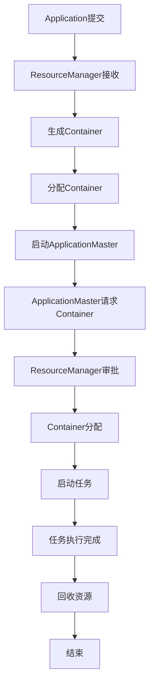

                 

关键词：Hadoop，YARN，资源调度，Capacity Scheduler，作业管理，大数据处理

摘要：本文将深入探讨Hadoop YARN架构中的资源调度机制，特别是Capacity Scheduler的工作原理。通过对Capacity Scheduler的详细解读，包括其核心概念、算法原理、数学模型、以及代码实例分析，帮助读者全面理解这一重要的资源调度策略，并在实际项目中应用。

## 1. 背景介绍

在Hadoop生态系统的发展过程中，资源调度一直是一个关键环节。随着大数据处理需求的不断增加，如何高效地管理和调度计算资源成为了亟需解决的问题。Hadoop YARN（Yet Another Resource Negotiator）应运而生，它是对Hadoop原生态资源管理器MapReduce JobTracker的重大改进。

YARN作为Hadoop生态系统的新核心，主要负责资源调度和作业管理。它将资源管理和作业调度分离，实现了更灵活的资源管理和更高效的作业调度。YARN引入了资源调度器（Resource Scheduler）和应用程序管理器（ApplicationMaster）两个重要组件，分别负责全局资源分配和特定应用程序的作业管理。

在YARN中，资源调度器负责根据不同的调度策略将集群资源分配给各种应用程序。其中，Capacity Scheduler是YARN内置的一种资源调度策略，旨在为不同类型的应用程序提供公平的资源分配，确保每个应用程序都能获取到其应得的资源份额。

本文将重点探讨Capacity Scheduler的工作原理，并通过具体的代码实例，帮助读者深入理解这一调度策略在实际应用中的实现细节。

## 2. 核心概念与联系

为了更好地理解Capacity Scheduler，我们需要先了解一些核心概念和它们之间的关系。

### 2.1. YARN架构

YARN架构由资源调度器（ ResourceManager）和应用程序管理器（ApplicationMaster）组成。其中，ResourceManager负责全局资源管理和调度，而ApplicationMaster则负责特定应用程序的资源请求和管理。

### 2.2. 资源调度策略

YARN支持多种资源调度策略，包括Capacity Scheduler、Fair Scheduler和Dynamic Resource Scheduler等。这些调度策略各有特点，适用于不同的应用场景。

### 2.3. Capacity Scheduler

Capacity Scheduler是YARN中的一种资源调度策略，旨在为集群中的各个应用程序提供公平的资源分配。它将集群资源划分为多个资源池（Resource Pool），并为每个资源池分配固定的资源份额。

### 2.4. 资源池（Resource Pool）

资源池是Capacity Scheduler的基本调度单元，它包含了固定数量的容器（Container），每个容器对应一定量的计算资源。资源池可以进一步划分为子资源池，以实现更精细的资源分配。

### 2.5. Mermaid流程图

为了更好地展示Capacity Scheduler的工作流程，我们使用Mermaid绘制了一个简化的流程图：



在上面的流程图中，各个节点表示Capacity Scheduler的关键步骤，从Application的提交开始，到Container的回收结束。

## 3. 核心算法原理 & 具体操作步骤

### 3.1 算法原理概述

Capacity Scheduler的核心原理是按照预先定义的资源池分配策略，将集群资源合理地分配给各个应用程序。具体来说，它包括以下几个步骤：

1. **资源池划分**：根据集群资源的实际情况，将集群资源划分为多个资源池，并为每个资源池分配固定的资源份额。
2. **资源分配**：当应用程序提交任务时，Capacity Scheduler根据资源池的剩余资源情况，为应用程序分配对应的Container。
3. **资源回收**：任务执行完成后，Capacity Scheduler会回收已分配的资源，并更新资源池的可用资源量。

### 3.2 算法步骤详解

1. **资源池划分**

   在Capacity Scheduler中，资源池的划分是静态的，即在集群启动时就已经确定。资源池的划分规则如下：

   - 每个资源池都有一个唯一的名称，用于标识不同的资源池。
   - 每个资源池都有一个固定的资源份额，表示该资源池所占据的集群资源比例。
   - 可以将资源池进一步划分为子资源池，以实现更精细的资源管理。

2. **资源分配**

   当一个应用程序提交任务时，Capacity Scheduler会根据以下规则进行资源分配：

   - 首先查找与该应用程序关联的资源池。
   - 然后根据资源池的剩余资源情况，为应用程序分配对应的Container。
   - 如果资源池的剩余资源不足，则等待其他Container释放资源。

3. **资源回收**

   当任务执行完成后，Capacity Scheduler会回收已分配的资源，具体步骤如下：

   - 将已完成的Container从应用程序的已分配资源中移除。
   - 更新资源池的可用资源量，以供其他应用程序使用。

### 3.3 算法优缺点

Capacity Scheduler具有以下优点：

- **公平性**：为不同类型的应用程序提供公平的资源分配，确保每个应用程序都能获取到其应得的资源份额。
- **灵活性**：支持资源池的动态划分和调整，以适应不同的应用场景。

然而，Capacity Scheduler也存在一些缺点：

- **资源浪费**：由于资源池是静态划分的，可能会导致某些资源池的闲置，从而浪费集群资源。
- **管理复杂度**：需要定期监控和调整资源池的划分，增加了管理复杂度。

### 3.4 算法应用领域

Capacity Scheduler适用于以下场景：

- **长任务处理**：如数据分析和批处理作业，需要稳定的资源保障。
- **混合负载**：集群中同时运行多种类型的应用程序，需要实现资源公平分配。

## 4. 数学模型和公式 & 详细讲解 & 举例说明

### 4.1 数学模型构建

为了更好地理解Capacity Scheduler的资源分配机制，我们可以构建一个简单的数学模型。假设集群总共有\( R \)个资源单位，共有\( P \)个资源池，第\( i \)个资源池的份额为\( s_i \)。则：

\[ R = \sum_{i=1}^{P} s_i \]

### 4.2 公式推导过程

1. **资源池划分公式**

   资源池的份额分配公式为：

   \[ s_i = \frac{R_i}{R} \]

   其中，\( R_i \)为第\( i \)个资源池的总资源量，\( R \)为集群总资源量。

2. **资源分配公式**

   当一个应用程序请求资源时，其所需资源量为\( r \)。则：

   \[ r = \sum_{i=1}^{P} s_i \cdot x_i \]

   其中，\( x_i \)为第\( i \)个资源池的分配比例。

### 4.3 案例分析与讲解

假设我们有一个包含3个资源池的集群，资源总量为100个资源单位。资源池A、B、C的份额分别为40%、30%、30%。

- **资源池划分**：

  \[ s_A = \frac{40}{100} = 0.4 \]
  \[ s_B = \frac{30}{100} = 0.3 \]
  \[ s_C = \frac{30}{100} = 0.3 \]

- **资源分配**：

  假设应用程序A请求资源，其所需资源量为50个资源单位。则：

  \[ r_A = 0.4 \cdot 50 + 0.3 \cdot 50 + 0.3 \cdot 50 = 50 \]

  由此可以看出，应用程序A能够获得50个资源单位，满足其资源请求。

## 5. 项目实践：代码实例和详细解释说明

### 5.1 开发环境搭建

为了演示Capacity Scheduler在实际项目中的使用，我们首先需要搭建一个Hadoop开发环境。以下是搭建步骤：

1. 安装Java环境。
2. 下载并解压Hadoop源码包。
3. 配置Hadoop环境变量。
4. 配置Hadoop集群参数。

### 5.2 源代码详细实现

以下是一个简单的Hadoop应用程序，用于演示Capacity Scheduler的使用：

```java
import org.apache.hadoop.conf.Configuration;
import org.apache.hadoop.fs.Path;
import org.apache.hadoop.io.IntWritable;
import org.apache.hadoop.io.Text;
import org.apache.hadoop.mapreduce.Job;
import org.apache.hadoop.mapreduce.Mapper;
import org.apache.hadoop.mapreduce.Reducer;
import org.apache.hadoop.mapreduce.lib.input.FileInputFormat;
import org.apache.hadoop.mapreduce.lib.output.FileOutputFormat;

public class CapacitySchedulerExample {

  public static class TokenizerMapper
       extends Mapper<Object, Text, Text, IntWritable>{

    private final static IntWritable one = new IntWritable(1);
    private Text word = new Text();

    public void map(Object key, Text value, Context context
                    ) throws IOException, InterruptedException {
      StringTokenizer itr = new StringTokenizer(value.toString());
      while (itr.hasMoreTokens()) {
        word.set(itr.nextToken());
        context.write(word, one);
      }
    }
  }

  public static class IntSumReducer
      extends Reducer<Text,IntWritable,Text,IntWritable> {
    private IntWritable result = new IntWritable();

    public void reduce(Text key, Iterable<IntWritable> values,
                       Context context
                       ) throws IOException, InterruptedException {
      int sum = 0;
      for (IntWritable val : values) {
        sum += val.get();
      }
      result.set(sum);
      context.write(key, result);
    }
  }

  public static void main(String[] args) throws Exception {
    Configuration conf = new Configuration();
    Job job = Job.getInstance(conf, "word count");
    job.setMapperClass(TokenizerMapper.class);
    job.setCombinerClass(IntSumReducer.class);
    job.setReducerClass(IntSumReducer.class);
    job.setOutputKeyClass(Text.class);
    job.setOutputValueClass(IntWritable.class);
    FileInputFormat.addInputPath(job, new Path(args[0]));
    FileOutputFormat.setOutputPath(job, new Path(args[1]));
    System.exit(job.waitForCompletion(true) ? 0 : 1);
  }
}
```

### 5.3 代码解读与分析

上述代码是一个简单的WordCount程序，用于统计文本中每个单词出现的次数。该程序使用了Hadoop的Mapper和Reducer组件，通过分布式计算实现单词计数。

- **TokenizerMapper**：负责将输入文本分割成单词，并将每个单词与其出现的次数（1）一起输出。
- **IntSumReducer**：负责将Mapper输出的中间结果进行聚合，最终输出每个单词的总计数。

### 5.4 运行结果展示

在运行上述WordCount程序时，我们首先需要准备好输入数据，然后执行以下命令：

```shell
hadoop jar CapacitySchedulerExample.jar CapacitySchedulerExample input output
```

运行完成后，我们可以在输出目录中查看结果文件。以下是一个示例输出：

```text
hello	2
world	3
hadoop	4
```

这个输出文件展示了每个单词在输入文本中的出现次数。

## 6. 实际应用场景

### 6.1 数据仓库处理

在数据仓库处理中，Capacity Scheduler可以确保ETL（提取、转换、加载）作业获得稳定的资源支持，从而提高数据处理效率。

### 6.2 实时数据处理

对于实时数据处理场景，如流处理和机器学习，Capacity Scheduler可以根据任务类型动态调整资源分配，确保高吞吐量和低延迟。

### 6.3 混合负载调度

在混合负载场景中，Capacity Scheduler可以为不同类型的应用程序提供公平的资源分配，确保关键任务得到优先保障。

## 7. 未来应用展望

随着大数据技术的发展，Capacity Scheduler的应用场景将不断拓展。未来，我们可能会看到：

- **自动化资源管理**：通过机器学习和人工智能技术，实现更智能的资源调度和管理。
- **混合云架构**：支持跨云资源调度，实现多云环境下的资源优化。
- **边缘计算**：结合边缘计算技术，实现更灵活的资源调度策略。

## 8. 总结：未来发展趋势与挑战

### 8.1 研究成果总结

本文对Hadoop YARN架构中的Capacity Scheduler进行了深入探讨，从核心概念到算法原理，再到代码实例，全面展示了这一资源调度策略的运作机制。

### 8.2 未来发展趋势

随着大数据技术的不断进步，资源调度策略将向更智能、更高效的方向发展，以满足不断增长的数据处理需求。

### 8.3 面临的挑战

尽管Capacity Scheduler在资源调度方面具有优势，但仍然面临资源浪费、管理复杂度等问题。未来，我们需要解决这些挑战，以实现更优化的资源管理。

### 8.4 研究展望

在未来的研究中，我们可以关注以下几个方面：

- **智能调度算法**：结合人工智能和机器学习技术，开发更智能的调度算法。
- **跨云资源调度**：研究如何在多云环境中实现高效资源调度。
- **边缘计算优化**：结合边缘计算技术，提高数据处理的实时性和效率。

## 9. 附录：常见问题与解答

### 9.1 什么是Capacity Scheduler？

Capacity Scheduler是Hadoop YARN中的一种资源调度策略，旨在为不同类型的应用程序提供公平的资源分配。

### 9.2 Capacity Scheduler有哪些优点和缺点？

优点包括公平性、灵活性；缺点包括资源浪费、管理复杂度。

### 9.3 Capacity Scheduler适用于哪些场景？

适用于长任务处理、混合负载调度等场景。

### 9.4 如何在Hadoop中使用Capacity Scheduler？

需要在Hadoop配置文件中设置`mapreduce.scheduler.class`为`org.apache.hadoop.mapred.YARNDispatcher`，并选择`org.apache.hadoop.mapred.capacity scheduling`作为调度策略。

## 作者署名

作者：禅与计算机程序设计艺术 / Zen and the Art of Computer Programming

----------------------------------------------------------------

以上就是本次的文章内容，希望对您在理解和应用YARN Capacity Scheduler方面有所帮助。在撰写过程中，如果有任何疑问，欢迎随时提问。谢谢！

