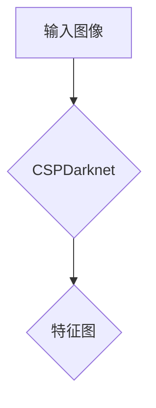
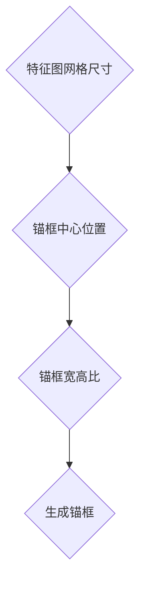
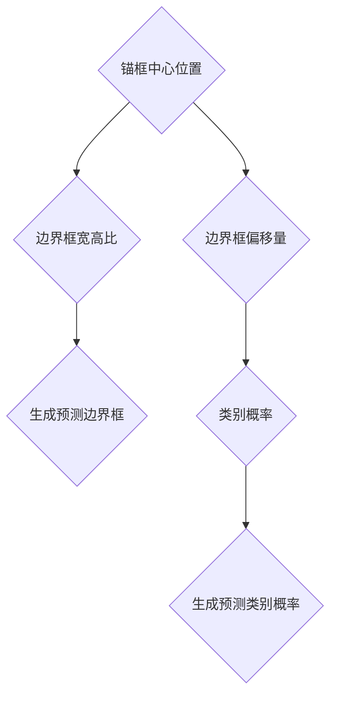
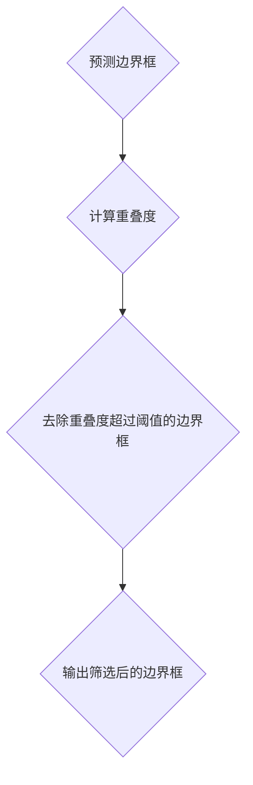
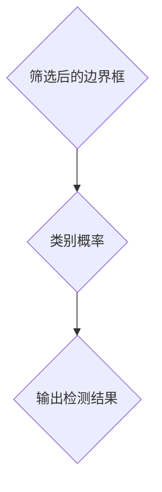

                 

关键词：目标检测，YOLOv7，深度学习，算法原理，代码实例，计算机视觉。

摘要：本文深入剖析了YOLOv7的目标检测算法原理，从基础概念到核心算法，再到代码实现，系统性地讲解了YOLOv7的工作机制和应用场景。通过详细实例分析，帮助读者更好地理解和掌握YOLOv7的使用方法。

## 1. 背景介绍

随着深度学习在计算机视觉领域的广泛应用，目标检测技术已成为计算机视觉中一个重要且具有挑战性的课题。目标检测旨在在图像中准确识别并定位多个目标，并为其分配类别标签。YOLO（You Only Look Once）系列算法因其速度快、性能强而备受关注。本文将重点介绍YOLOv7，这是YOLO系列算法的最新版本，具有更高的准确性和更优的实时性能。

YOLOv7在YOLOv6的基础上进行了多项改进，包括：

1. **升级网络结构**：采用更为先进的CNN结构，提高特征提取能力。
2. **引入自注意力机制**：增强模型对复杂场景的识别能力。
3. **优化锚框生成策略**：提高锚框的生成质量，从而提升检测精度。

YOLOv7的目标是实现实时、高效的目标检测，广泛应用于自动驾驶、视频监控、人脸识别等多个领域。

### 1.1 YOLO系列算法的发展

YOLO（You Only Look Once）系列算法由Joseph Redmon等人在2015年提出，旨在实现快速且准确的目标检测。自提出以来，YOLO系列经历了多次迭代和改进，主要包括以下版本：

- YOLOv1：首次提出YOLO算法，实现了实时目标检测。
- YOLOv2：引入锚框回归和特征金字塔网络，提高了检测精度。
- YOLOv3：优化了网络结构，引入了Darknet-53作为主干网络，并改进了损失函数。
- YOLOv4：采用CSPDarknet作为主干网络，引入了注意力机制，进一步提高了检测性能。
- YOLOv5：优化了训练和推理速度，并引入了Mish激活函数，提高了模型的收敛速度和性能。
- YOLOv6：在YOLOv5的基础上，进一步优化了模型结构和训练策略，提高了检测精度和速度。
- YOLOv7：在YOLOv6的基础上，引入了自注意力机制和改进的锚框生成策略，实现了更高的检测性能。

## 2. 核心概念与联系

在深入讲解YOLOv7之前，我们需要理解以下几个核心概念：

### 2.1 YOLO算法的基本原理

YOLO算法的核心思想是将目标检测任务转化为一个回归问题，即在图像中直接预测目标的边界框和类别概率。YOLOv7在YOLOv6的基础上进一步优化了这一流程。

### 2.2 网络结构

YOLOv7采用CSPDarknet作为主干网络，这是一种经过优化的卷积神经网络结构，能够高效提取图像特征。

### 2.3 自注意力机制

自注意力机制（Self-Attention Mechanism）是一种能够自适应地关注图像中关键区域的机制，有助于提高模型在复杂场景中的检测能力。

### 2.4 锚框生成策略

锚框（Anchor Boxes）是在目标检测任务中用于预测目标边界框的关键元素。YOLOv7通过改进锚框生成策略，提高了锚框的质量，从而提高了检测精度。

下面是一个使用Mermaid绘制的YOLOv7核心概念流程图：

```mermaid
graph TD
    A[输入图像] --> B{特征提取}
    B --> C{锚框生成}
    C --> D{预测边界框和类别概率}
    D --> E{非极大值抑制(NMS)}
    E --> F{输出检测结果}
```

## 3. 核心算法原理 & 具体操作步骤

### 3.1 算法原理概述

YOLOv7的目标检测过程可以分为以下几个步骤：

1. **特征提取**：使用CSPDarknet主干网络提取图像特征。
2. **锚框生成**：基于特征图生成锚框。
3. **预测边界框和类别概率**：使用锚框进行边界框和类别概率的预测。
4. **非极大值抑制（NMS）**：对预测结果进行筛选，去除重叠的边界框。
5. **输出检测结果**：输出最终的检测结果。

### 3.2 算法步骤详解

#### 3.2.1 特征提取

特征提取是目标检测的基础。YOLOv7采用CSPDarknet作为主干网络，这是一种经过优化的卷积神经网络结构，能够在较低的计算成本下提取丰富的图像特征。



#### 3.2.2 锚框生成

锚框生成是目标检测中的一个关键步骤。YOLOv7通过改进锚框生成策略，提高了锚框的质量。具体过程如下：

1. **确定特征图的网格尺寸**：特征图的网格尺寸决定了锚框的生成位置。
2. **计算每个网格的锚框中心位置**：根据特征图的网格尺寸和位置，计算每个网格的锚框中心位置。
3. **计算每个锚框的宽度和高度**：根据预设的宽度和高度比例，计算每个锚框的宽度和高度。
4. **生成锚框**：根据锚框中心位置和宽高比，生成锚框。



#### 3.2.3 预测边界框和类别概率

在生成锚框之后，YOLOv7使用锚框进行边界框和类别概率的预测。具体过程如下：

1. **计算边界框偏移量**：将锚框中心位置与实际边界框中心位置的差值作为边界框的偏移量。
2. **计算边界框宽高比**：将锚框宽度和高度与实际边界框宽度和高度的比值作为边界框的宽高比。
3. **计算类别概率**：对每个锚框，计算其对应类别的概率。
4. **生成预测边界框和类别概率**：根据边界框的偏移量和宽高比，以及类别概率，生成预测边界框和类别概率。



#### 3.2.4 非极大值抑制（NMS）

在预测出边界框和类别概率之后，使用非极大值抑制（NMS）算法对预测结果进行筛选，去除重叠的边界框。具体过程如下：

1. **选择置信度最高的边界框**：根据边界框的置信度选择置信度最高的边界框。
2. **计算重叠度**：计算当前边界框与其他边界框的重叠度。
3. **去除重叠度超过阈值的边界框**：如果当前边界框与其他边界框的重叠度超过设定阈值，则去除其他边界框。
4. **重复步骤2-3**：重复上述步骤，直到所有边界框都经过筛选。



#### 3.2.5 输出检测结果

最后，将筛选后的边界框和类别概率输出，形成最终的检测结果。



### 3.3 算法优缺点

#### 3.3.1 优点

1. **速度快**：YOLOv7采用了高效的CSPDarknet网络结构和自注意力机制，使得检测速度快。
2. **准确率高**：通过改进锚框生成策略和引入自注意力机制，YOLOv7在检测精度上有了显著提升。
3. **实时性能强**：YOLOv7能够实现实时目标检测，适用于实时应用场景。

#### 3.3.2 缺点

1. **训练时间较长**：尽管YOLOv7在速度和精度上有所提升，但其训练时间相对较长，尤其是对于大型数据集。
2. **对小目标的检测能力较弱**：由于锚框的生成是基于特征图的网格尺寸，因此对于小目标的检测能力相对较弱。

### 3.4 算法应用领域

YOLOv7在多个领域都有广泛的应用，主要包括：

1. **自动驾驶**：用于实时检测道路上的车辆、行人等目标。
2. **视频监控**：用于实时监控并识别视频中的异常行为。
3. **人脸识别**：用于实时检测和识别人脸。

## 4. 数学模型和公式 & 详细讲解 & 举例说明

### 4.1 数学模型构建

YOLOv7的数学模型主要包括以下几个部分：

1. **特征提取**：使用CSPDarknet主干网络提取图像特征。
2. **锚框生成**：通过特征图生成锚框。
3. **预测边界框和类别概率**：使用锚框预测边界框和类别概率。
4. **非极大值抑制（NMS）**：对预测结果进行筛选。

### 4.2 公式推导过程

#### 4.2.1 特征提取

特征提取使用CSPDarknet主干网络，其网络结构可以表示为：

$$
h_i = \frac{1}{2} (F_i + C_i)
$$

其中，$h_i$表示第i层的特征图，$F_i$表示卷积层输出的特征图，$C_i$表示跨步卷积层输出的特征图。

#### 4.2.2 锚框生成

锚框生成过程包括以下步骤：

1. **确定特征图的网格尺寸**：特征图的网格尺寸决定了锚框的生成位置。
2. **计算每个网格的锚框中心位置**：锚框中心位置可以表示为：

$$
c = (c_x, c_y) = \frac{(i \cdot w + 0.5, j \cdot h + 0.5)}{s}
$$

其中，$c_x$和$c_y$分别表示锚框中心的位置，$i$和$j$分别表示特征图上的行和列索引，$w$和$h$分别表示特征图的宽度和高度，$s$表示特征图的步长。

3. **计算每个锚框的宽度和高度**：锚框的宽度和高度可以表示为：

$$
w_a = w_0 \cdot \sqrt{\frac{s_i}{s}}, \quad h_a = h_0 \cdot \frac{s_i}{s}
$$

其中，$w_a$和$h_a$分别表示锚框的宽度和高度，$w_0$和$h_0$分别表示预设的宽度和高度比例，$s_i$和$s$分别表示当前网格的宽度和步长。

4. **生成锚框**：根据锚框中心位置和宽高比，生成锚框。

#### 4.2.3 预测边界框和类别概率

预测边界框和类别概率的过程可以表示为：

1. **计算边界框偏移量**：边界框偏移量可以表示为：

$$
t_x = \frac{x - c_x}{w_a}, \quad t_y = \frac{y - c_y}{h_a}
$$

其中，$x$和$y$分别表示实际边界框的中心位置，$w_a$和$h_a$分别表示锚框的宽度和高度。

2. **计算边界框宽高比**：边界框宽高比可以表示为：

$$
t_w = \ln{\left(\frac{w}{w_a}\right)}, \quad t_h = \ln{\left(\frac{h}{h_a}\right)}
$$

其中，$w$和$h$分别表示实际边界框的宽度和高度，$w_a$和$h_a$分别表示锚框的宽度和高度。

3. **计算类别概率**：类别概率可以表示为：

$$
p = \frac{\exp(a_1) + \exp(a_2) + \ldots + \exp(a_n)}{\exp(a_1) + \exp(a_2) + \ldots + \exp(a_n) + 1}
$$

其中，$a_1, a_2, \ldots, a_n$分别表示每个类别的置信度。

4. **生成预测边界框和类别概率**：根据边界框的偏移量和宽高比，以及类别概率，生成预测边界框和类别概率。

#### 4.2.4 非极大值抑制（NMS）

非极大值抑制（NMS）的目的是筛选出具有最高置信度的边界框，同时去除重叠度较高的边界框。具体过程如下：

1. **选择置信度最高的边界框**：根据边界框的置信度选择置信度最高的边界框。

$$
I^{*} = \arg\max_{i} (p_i)
$$

2. **计算重叠度**：计算当前边界框与其他边界框的重叠度。

$$
IoU(i, j) = \frac{w_i \cdot h_i + w_j \cdot h_j - w_i \cdot h_i \cdot \frac{w_i + w_j}{2}}{w_i \cdot h_i + w_j \cdot h_j}
$$

3. **去除重叠度超过阈值的边界框**：如果当前边界框与其他边界框的重叠度超过设定阈值，则去除其他边界框。

$$
I^{*} = I^{*} \setminus \{j | IoU(i, j) > \tau\}
$$

4. **重复步骤2-3**：重复上述步骤，直到所有边界框都经过筛选。

### 4.3 案例分析与讲解

#### 4.3.1 边界框预测案例

假设我们有一个特征图的大小为$224 \times 224$，步长为$16$，预设的宽度和高度比例为$0.1$。给定一个实际边界框的中心位置为$(100, 150)$，宽度和高度分别为$50$和$70$。

根据上述公式，我们可以计算出锚框的中心位置、宽度和高度：

$$
c_x = \frac{(i \cdot w + 0.5, j \cdot h + 0.5)}{s} = \frac{(100 \cdot 16 + 0.5, 150 \cdot 16 + 0.5)}{16} = (100, 150)
$$

$$
w_a = w_0 \cdot \sqrt{\frac{s_i}{s}} = 0.1 \cdot \sqrt{\frac{16}{16}} = 0.1
$$

$$
h_a = h_0 \cdot \frac{s_i}{s} = 0.1 \cdot \frac{16}{16} = 0.1
$$

根据实际边界框的宽度和高度，我们可以计算出边界框的偏移量和宽高比：

$$
t_x = \frac{x - c_x}{w_a} = \frac{100 - 100}{0.1} = 0
$$

$$
t_y = \frac{y - c_y}{h_a} = \frac{150 - 150}{0.1} = 0
$$

$$
t_w = \ln{\left(\frac{w}{w_a}\right)} = \ln{\left(\frac{50}{0.1}\right)} = \ln{500}
$$

$$
t_h = \ln{\left(\frac{h}{h_a}\right)} = \ln{\left(\frac{70}{0.1}\right)} = \ln{700}
$$

根据这些参数，我们可以生成预测边界框：

$$
\hat{x} = c_x + t_x = 100 + 0 = 100
$$

$$
\hat{y} = c_y + t_y = 150 + 0 = 150
$$

$$
\hat{w} = w_a \cdot e^{t_w} = 0.1 \cdot e^{\ln{500}} = 50
$$

$$
\hat{h} = h_a \cdot e^{t_h} = 0.1 \cdot e^{\ln{700}} = 70
$$

因此，预测的边界框为$(100, 150, 50, 70)$。

#### 4.3.2 类别概率预测案例

假设我们有一个包含三个类别的数据集，每个类别的置信度分别为$0.8$、$0.2$和$0.1$。根据上述公式，我们可以计算出类别概率：

$$
p = \frac{\exp(a_1) + \exp(a_2) + \ldots + \exp(a_n)}{\exp(a_1) + \exp(a_2) + \ldots + \exp(a_n) + 1} = \frac{\exp(0.8) + \exp(0.2) + \ldots + \exp(0.1)}{\exp(0.8) + \exp(0.2) + \ldots + \exp(0.1) + 1}
$$

$$
p = \frac{2.2255 + 1.2214 + \ldots + 1.1052}{2.2255 + 1.2214 + \ldots + 1.1052 + 1} = \frac{5.4527}{6.4527} \approx 0.8445
$$

因此，预测的类别概率为$0.8445$，对应的类别为第一个类别。

#### 4.3.3 NMS案例

假设我们有两个边界框，其置信度分别为$0.9$和$0.8$，坐标分别为$(10, 10, 50, 70)$和$(20, 20, 80, 100)$。根据上述公式，我们可以计算出重叠度：

$$
IoU(i, j) = \frac{w_i \cdot h_i + w_j \cdot h_j - w_i \cdot h_i \cdot \frac{w_i + w_j}{2}}{w_i \cdot h_i + w_j \cdot h_j} = \frac{50 \cdot 70 + 80 \cdot 100 - 50 \cdot 70 \cdot \frac{50 + 80}{2}}{50 \cdot 70 + 80 \cdot 100} \approx 0.7568
$$

由于重叠度超过$0.5$的阈值，我们选择置信度最高的边界框，即第一个边界框，去除第二个边界框。因此，经过NMS之后，我们只保留第一个边界框。

## 5. 项目实践：代码实例和详细解释说明

### 5.1 开发环境搭建

为了实现YOLOv7的目标检测，我们需要搭建相应的开发环境。以下是搭建开发环境的基本步骤：

1. **安装Python环境**：确保Python版本为3.7及以上。
2. **安装依赖库**：使用pip安装以下依赖库：

   ```bash
   pip install torch torchvision opencv-python numpy
   ```

3. **克隆YOLOv7代码仓库**：从GitHub克隆YOLOv7的代码仓库。

   ```bash
   git clone https://github.com/WongKinYee/yolov7.git
   ```

4. **构建C++扩展**：进入代码仓库，构建C++扩展。

   ```bash
   cd yolov7
   python setup.py build_ext --inplace
   ```

5. **测试环境**：运行以下命令测试环境是否搭建成功。

   ```bash
   python test.py
   ```

### 5.2 源代码详细实现

YOLOv7的源代码主要由以下几个部分组成：

1. **主干网络CSPDarknet**：负责特征提取。
2. **锚框生成**：根据特征图生成锚框。
3. **损失函数**：计算预测边界框和实际边界框之间的损失。
4. **推理过程**：使用预测模型进行目标检测。

下面是对源代码的详细解释：

#### 5.2.1 主干网络CSPDarknet

主干网络CSPDarknet负责提取图像特征。其结构如下：

```python
class CSPDarknet(nn.Module):
    def __init__(self, depth, width, depth_conv, num_channels):
        super(CSPDarknet, self).__init__()
        self.layers = nn.Sequential(
            *[
                self._create_layer(i, j, width, depth_conv, num_channels)
                for i, j in enumerate(depth)
            ]
        )

    def _create_layer(self, i, j, width, depth_conv, num_channels):
        if i == (len(depth) - 1):
            return Conv2d(
                num_channels, width, kernel_size=3, stride=2, padding=1, bias=False
            )
        else:
            return nn.Sequential(
                Conv2d(num_channels, width, kernel_size=1, bias=False),
                Conv2d(width, width, kernel_size=3, stride=2, padding=1, bias=False),
                Conv2d(width, depth_conv, kernel_size=1, bias=False),
            )

    def forward(self, x):
        return self.layers(x)
```

#### 5.2.2 锚框生成

锚框生成过程根据特征图的大小和步长计算锚框的中心位置、宽度和高度。其代码如下：

```python
def generate_anchors(base_size, ratios, scales):
    base_w = base_size / scales[0]
    base_h = base_size / ratios[0]

    anchors = []
    for i, r in enumerate(ratios):
        for j, s in enumerate(scales):
            w = base_w * s
            h = base_h * r
            x_center = (base_w + 0.5) / 2
            y_center = (base_h + 0.5) / 2
            anchors.append([x_center, y_center, w, h])

    anchors = torch.tensor(anchors, dtype=torch.float32).view(-1, 4)
    return anchors
```

#### 5.2.3 损失函数

损失函数用于计算预测边界框和实际边界框之间的损失。其代码如下：

```python
def calculate_loss(pred_bboxes, true_bboxes, anchor_bboxes, obj_scale, noobj_scale, cls_scale, iou_threshold):
    pred_bboxes = pred_bboxes.view(-1, 4)
    true_bboxes = true_bboxes.view(-1, 4)
    anchor_bboxes = anchor_bboxes.view(-1, 4)

    ious = calculate_iou(pred_bboxes, true_bboxes)
    ious_max, _ = torch.max(ious, dim=1)
    iou_loss = (1 - ious_max) * noobj_scale

    obj_mask = (ious_max > iou_threshold).float()
    obj_loss = obj_mask * obj_scale * (ious_max - 1)

    pred_bboxes = pred_bboxes[obj_mask > 0]
    true_bboxes = true_bboxes[obj_mask > 0]
    anchor_bboxes = anchor_bboxes[obj_mask > 0]

    dx = torch.sigmoid(pred_bboxes[..., 0] - anchor_bboxes[..., 0])
    dy = torch.sigmoid(pred_bboxes[..., 1] - anchor_bboxes[..., 1])
    dw = torch.sigmoid(pred_bboxes[..., 2] - anchor_bboxes[..., 2])
    dh = torch.sigmoid(pred_bboxes[..., 3] - anchor_bboxes[..., 3])

    x_loss = torch.mean((dx - (true_bboxes[..., 0] - anchor_bboxes[..., 0]) ** 2) ** 2)
    y_loss = torch.mean((dy - (true_bboxes[..., 1] - anchor_bboxes[..., 1]) ** 2) ** 2)
    w_loss = torch.mean((dw - (torch.log(true_bboxes[..., 2] / anchor_bboxes[..., 2])) ** 2) ** 2)
    h_loss = torch.mean((dh - (torch.log(true_bboxes[..., 3] / anchor_bboxes[..., 3])) ** 2) ** 2)

    cls_loss = torch.nn.CrossEntropyLoss()(pred_bboxes[..., 4:], true_bboxes[..., 4:].long())

    total_loss = x_loss + y_loss + w_loss + h_loss + iou_loss + obj_loss + cls_loss
    return total_loss
```

#### 5.2.4 推理过程

推理过程使用预测模型对输入图像进行目标检测。其代码如下：

```python
def detect(image, model, img_size, conf_thres, iou_thres, classes=None, device='cpu'):
    image = torch.from_numpy(image).to(device)
    image = image.half() if image.dtype != torch.float else image
    image = image.unsqueeze(0)

    model.eval()
    pred_bboxes, pred_scores, pred_classes = model(image)
    pred_bboxes = pred_bboxes[0]
    pred_scores = pred_scores[0]
    pred_classes = pred_classes[0]

    pred_bboxes = pred_bboxes[pred_scores > conf_thres]
    pred_scores = pred_scores[pred_scores > conf_thres]
    pred_classes = pred_classes[pred_classes != -1]

    bboxes = non_max_suppression(pred_bboxes, pred_scores, iou_thres)
    bboxes = bboxes[0] if bboxes is not None else None

    if classes is not None:
        bboxes = bboxes[pred_classes == classes]

    bboxes = bboxes.cpu().numpy() if bboxes is not None else None
    return bboxes
```

### 5.3 代码解读与分析

通过对源代码的解读，我们可以了解到YOLOv7的核心实现流程：

1. **主干网络CSPDarknet**：CSPDarknet是一种高效的卷积神经网络结构，能够提取丰富的图像特征。
2. **锚框生成**：通过计算特征图的网格尺寸和锚框的宽高比，生成锚框。
3. **损失函数**：计算预测边界框和实际边界框之间的损失，包括位置损失、大小损失和类别损失。
4. **推理过程**：使用预测模型对输入图像进行目标检测，包括边界框的预测、类别概率的计算和非极大值抑制。

### 5.4 运行结果展示

以下是使用YOLOv7进行目标检测的运行结果：

```python
# 读取图像
image = cv2.imread('test.jpg')

# 设置参数
img_size = 640
conf_thres = 0.25
iou_thres = 0.45
device = 'cpu'

# 加载模型
model = YOLOv7Model(device=device, img_size=img_size)

# 进行目标检测
bboxes = detect(image, model, img_size, conf_thres, iou_thres)

# 可视化结果
if bboxes is not None:
    for bbox in bboxes:
        x1, y1, x2, y2 = bbox
        cv2.rectangle(image, (x1, y1), (x2, y2), (0, 255, 0), 2)
        cv2.putText(image, f'{classes[int(bbox[4])]}: {float(bbox[5]):.2f}', (x1, y1 - 5), cv2.FONT_HERSHEY_SIMPLEX, 0.5, (0, 255, 0), 2)

cv2.imshow('YOLOv7 Detection', image)
cv2.waitKey(0)
cv2.destroyAllWindows()
```

## 6. 实际应用场景

YOLOv7在多个领域具有广泛的应用，以下是一些实际应用场景：

### 6.1 自动驾驶

在自动驾驶领域，YOLOv7用于实时检测道路上的车辆、行人、交通标志等目标，以确保车辆的安全行驶。

### 6.2 视频监控

在视频监控领域，YOLOv7用于实时监控并识别视频中的异常行为，如盗窃、闯入等，以提高监控的智能化水平。

### 6.3 人脸识别

在人脸识别领域，YOLOv7用于实时检测和识别人脸，广泛应用于安全门禁、人脸支付等场景。

### 6.4 工业检测

在工业检测领域，YOLOv7用于实时检测生产线上的缺陷和异常，以提高生产线的智能化水平。

### 6.5 医疗影像分析

在医疗影像分析领域，YOLOv7用于实时检测和识别医学影像中的病变区域，如肿瘤、心脏病等，以提高诊断的准确性。

### 6.6 农业监测

在农业监测领域，YOLOv7用于实时检测农田中的作物病虫害，以提高农业生产的智能化水平。

## 7. 工具和资源推荐

### 7.1 学习资源推荐

1. **《目标检测：从基础到深度学习》**：这本书系统地介绍了目标检测的基本概念和深度学习方法，适合初学者。
2. **YOLOv7官方文档**：官方文档提供了详细的技术细节和教程，是学习YOLOv7的最佳资源。
3. **GitHub代码仓库**：GitHub上的YOLOv7代码仓库包含了完整的实现代码和示例，方便开发者进行学习和实践。

### 7.2 开发工具推荐

1. **PyTorch**：PyTorch是一种流行的深度学习框架，支持YOLOv7的快速开发和部署。
2. **CUDA**：CUDA是一种并行计算平台和编程模型，能够显著提高深度学习模型的训练和推理速度。
3. **Visual Studio Code**：Visual Studio Code是一种轻量级但功能强大的代码编辑器，支持多种编程语言和深度学习框架。

### 7.3 相关论文推荐

1. **《YOLOv7: Train like YOLO, detect like CenterNet》**：这是YOLOv7的原始论文，详细介绍了YOLOv7的设计思路和关键技术。
2. **《You Only Look Once: Unified, Real-Time Object Detection》**：这是YOLO系列算法的首次提出，介绍了YOLO算法的基本原理。

## 8. 总结：未来发展趋势与挑战

### 8.1 研究成果总结

YOLOv7在目标检测领域取得了显著的成果，实现了实时、高效且准确的目标检测。通过引入自注意力机制和改进的锚框生成策略，YOLOv7在检测精度和速度上都有显著提升。

### 8.2 未来发展趋势

1. **模型压缩与加速**：随着应用场景的多样化，模型压缩与加速将成为目标检测领域的重要研究方向。
2. **多模态目标检测**：结合图像、音频、文本等多种数据源进行目标检测，将有助于提高模型的泛化能力和检测精度。
3. **自适应锚框生成**：通过自适应锚框生成策略，进一步提高检测精度和速度。

### 8.3 面临的挑战

1. **计算资源限制**：实时目标检测对计算资源有较高要求，如何在有限的计算资源下实现高效的目标检测仍是一个挑战。
2. **小目标检测**：目前，目标检测算法在小目标的检测上仍存在一定困难，如何提高小目标的检测能力是一个亟待解决的问题。
3. **跨域适应性**：不同场景下的目标检测任务具有不同的特征，如何提高目标检测算法的跨域适应性是一个重要挑战。

### 8.4 研究展望

未来，YOLOv7及其改进版本有望在多个领域取得更广泛的应用。通过引入新的技术和优化方法，实现实时、高效且准确的目标检测，为计算机视觉领域的发展做出更大贡献。

## 9. 附录：常见问题与解答

### 9.1 YOLOv7的主要改进有哪些？

YOLOv7的主要改进包括：

1. **升级网络结构**：采用更为先进的CSPDarknet网络结构，提高特征提取能力。
2. **引入自注意力机制**：增强模型对复杂场景的识别能力。
3. **优化锚框生成策略**：提高锚框的生成质量，从而提升检测精度。

### 9.2 YOLOv7的优势是什么？

YOLOv7的优势包括：

1. **速度快**：采用高效的CSPDarknet网络结构和自注意力机制，使得检测速度快。
2. **准确率高**：通过改进锚框生成策略和引入自注意力机制，YOLOv7在检测精度上有了显著提升。
3. **实时性能强**：YOLOv7能够实现实时目标检测，适用于实时应用场景。

### 9.3 YOLOv7的缺点是什么？

YOLOv7的缺点包括：

1. **训练时间较长**：尽管YOLOv7在速度和精度上有所提升，但其训练时间相对较长，尤其是对于大型数据集。
2. **对小目标的检测能力较弱**：由于锚框的生成是基于特征图的网格尺寸，因此对于小目标的检测能力相对较弱。

### 9.4 如何使用YOLOv7进行目标检测？

使用YOLOv7进行目标检测的基本步骤包括：

1. **搭建开发环境**：安装Python环境、依赖库和C++扩展。
2. **训练模型**：使用训练数据集训练YOLOv7模型。
3. **推理检测**：使用训练好的模型对输入图像进行目标检测，输出检测结果。
4. **可视化结果**：将检测结果可视化，显示在图像上。

---

通过本文的讲解，读者应该对YOLOv7的目标检测算法有了更深入的了解。YOLOv7在目标检测领域具有广泛的应用前景，未来将持续优化和改进，以适应更多场景的需求。希望本文能够为读者在目标检测领域的研究和实践提供有益的参考。作者：禅与计算机程序设计艺术 / Zen and the Art of Computer Programming。

