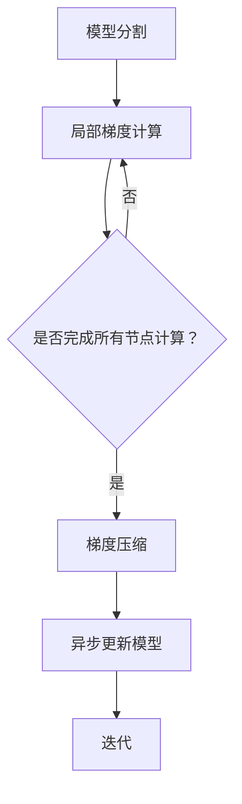

                 

关键词：分布式训练，ZeRO优化，模型并行，数据并行，内存优化，训练效率，大规模机器学习

## 摘要

随着人工智能技术的快速发展，大规模机器学习模型的训练需求日益增长。传统的单机训练模式在计算资源有限的情况下难以满足需求，分布式训练成为解决这一问题的关键。ZeRO（Zero Redundancy Optimizer）优化是一种创新的分布式训练技术，通过消除冗余参数和优化内存使用，显著提高了大规模模型训练的效率和可扩展性。本文将深入探讨ZeRO优化的原理、实现方法、以及在实际应用中的效果，为读者提供全面的技术洞察。

## 1. 背景介绍

### 1.1 大规模机器学习的发展

机器学习在图像识别、自然语言处理、推荐系统等领域取得了显著的成就，而大规模机器学习模型的训练需求也随之增加。传统的单机训练模式由于受限于计算资源和内存容量，难以满足这些需求。分布式训练通过将模型分解并分布在多个节点上，能够有效地利用集群资源，提升训练效率。

### 1.2 分布式训练的现状

分布式训练已经成为机器学习领域的一个热点研究方向。目前，主要的分布式训练策略包括数据并行（Data Parallelism）和模型并行（Model Parallelism）。数据并行通过将训练数据集分成多个子集，每个节点独立训练模型，然后汇总结果；模型并行通过将模型拆分为多个部分，分别在不同节点上训练，然后将这些部分组合成一个完整的模型。

### 1.3 传统分布式训练的挑战

尽管分布式训练在提升训练效率方面具有显著优势，但传统的分布式训练方法仍然面临一些挑战：

- **内存占用问题**：分布式训练通常需要每个节点存储整个模型的参数，导致内存占用增加，尤其是在大规模模型训练时。
- **通信开销**：节点之间需要频繁交换信息，如梯度更新，这会带来额外的通信开销，影响训练速度。
- **同步问题**：为了保证模型训练的一致性，分布式训练过程中需要进行同步操作，这可能导致训练过程的延迟。

## 2. 核心概念与联系

### 2.1 ZeRO优化的原理

ZeRO优化是一种创新的分布式训练技术，通过消除冗余参数和优化内存使用，解决了传统分布式训练面临的挑战。ZeRO优化的核心思想是将模型参数分割成多个部分，每个部分只存储在一个节点上，从而减少内存占用。同时，通过局部梯度计算和异步更新，降低通信开销和同步延迟。

### 2.2 ZeRO优化的架构

ZeRO优化的架构主要包括三个关键组件：模型分割（Model Partitioning）、梯度压缩（Gradient Compression）和异步更新（Asynchronous Update）。

- **模型分割**：将模型参数分割成多个部分，每个部分存储在一个节点上。这种分割方式可以根据模型的复杂度和硬件资源进行灵活调整。
- **梯度压缩**：通过梯度压缩技术，将节点间的通信量降低到最小。常用的梯度压缩方法包括量化、剪枝和参数共享等。
- **异步更新**：采用异步更新策略，节点可以独立地计算梯度并更新模型参数，避免了同步延迟，提高了训练效率。

### 2.3 ZeRO优化的Mermaid流程图



在上述流程图中，模型分割后，每个节点独立计算局部梯度，然后通过梯度压缩将梯度传输到其他节点，最后进行异步更新模型参数。这个过程在多个迭代中重复，直到模型收敛。

## 3. 核心算法原理 & 具体操作步骤

### 3.1 算法原理概述

ZeRO优化通过将模型参数分割成多个部分，实现局部梯度计算和异步更新，从而降低内存占用和通信开销。其核心算法原理包括：

- **模型分割**：将模型参数分割成多个部分，每个部分存储在一个节点上。
- **局部梯度计算**：每个节点独立计算局部梯度，并保留梯度计算结果。
- **梯度压缩**：通过梯度压缩技术，将节点间的通信量降低到最小。
- **异步更新**：节点异步更新模型参数，避免同步延迟。

### 3.2 算法步骤详解

1. **模型分割**：将模型参数分割成多个部分，每个部分存储在一个节点上。
2. **局部梯度计算**：每个节点独立计算局部梯度，并保留梯度计算结果。
3. **梯度压缩**：采用梯度压缩技术，将节点间的通信量降低到最小。常用的梯度压缩方法包括量化、剪枝和参数共享等。
4. **异步更新**：节点异步更新模型参数，避免同步延迟。

### 3.3 算法优缺点

#### 优点：

- **降低内存占用**：通过模型分割，每个节点只存储部分参数，显著降低了内存占用。
- **减少通信开销**：通过梯度压缩和异步更新，降低了节点间的通信量和同步延迟。
- **提高训练效率**：ZeRO优化能够显著提高大规模模型的训练效率，缩短训练时间。

#### 缺点：

- **实现复杂度**：ZeRO优化需要修改原有模型和训练框架，实现复杂度较高。
- **兼容性问题**：部分现有模型和训练框架可能无法直接使用ZeRO优化。

### 3.4 算法应用领域

ZeRO优化主要应用于大规模机器学习模型的分布式训练，特别是在图像识别、自然语言处理、推荐系统等领域。通过ZeRO优化，可以显著提升模型的训练效率，缩短训练时间，从而满足日益增长的大规模机器学习需求。

## 4. 数学模型和公式 & 详细讲解 & 举例说明

### 4.1 数学模型构建

ZeRO优化的数学模型主要涉及模型分割、局部梯度计算和异步更新。以下是这些过程的数学表达：

#### 模型分割：

设模型参数为θ，模型分割为θ = θ1 + θ2 + ... + θn，其中θi为第i个节点的参数。

#### 局部梯度计算：

设训练样本为(x, y)，局部梯度为∇θi = ∂L(θ1, θ2, ..., θn; x, y)/∂θi，其中L为损失函数。

#### 梯度压缩：

设压缩后的梯度为g_i，梯度压缩函数为f(g_i)，则有g_i = f(∇θi)。

#### 异步更新：

设更新后的模型参数为θ_i^new = θ_i^old - αg_i，其中α为学习率。

### 4.2 公式推导过程

假设我们有n个节点，每个节点存储模型参数的一部分θi，其中i = 1, 2, ..., n。整个模型的损失函数为L(θ1, θ2, ..., θn)。我们首先对每个节点的损失函数进行偏导数计算，以获得局部梯度。

#### 局部梯度计算：

对于每个节点i，我们有：

$$
\begin{align*}
\nabla_{\theta_i} L &= \frac{\partial L}{\partial \theta_i} \\
&= \sum_{j \neq i} \frac{\partial L}{\partial \theta_j} \cdot \frac{\partial \theta_j}{\partial \theta_i} + \frac{\partial L}{\partial \theta_i}
\end{align*}
$$

由于θj不在θi的存储范围内，我们需要通过其他节点的梯度来计算局部梯度。假设我们已经有了其他节点的梯度，我们可以通过以下步骤来计算θi的局部梯度：

$$
\nabla_{\theta_i} L = \sum_{j \neq i} \frac{\partial L}{\partial \theta_j} \cdot \frac{\partial \theta_j}{\partial \theta_i} + \frac{\partial L}{\partial \theta_i}
$$

#### 梯度压缩：

梯度压缩的目的是减少节点之间的通信量。一种常用的梯度压缩方法是量化。量化通过将梯度映射到更小的数值范围来减少其大小。假设量化函数为q(g)，我们有：

$$
g_i' = q(\nabla_{\theta_i} L)
$$

#### 异步更新：

异步更新允许每个节点独立地更新其参数，而不需要等待其他节点的计算完成。更新规则为：

$$
\theta_i^{new} = \theta_i^{old} - \alpha g_i'
$$

### 4.3 案例分析与讲解

假设我们有一个包含1000万参数的大型神经网络，我们将其分割成10个部分，每个部分存储在10个节点上。每个节点的内存容量为1GB。我们使用量化作为梯度压缩方法，量化范围为[-1, 1]。学习率为0.01。

1. **模型分割**：我们将1000万参数分割成10个部分，每个部分包含100万参数。每个节点存储一部分参数。
2. **局部梯度计算**：每个节点计算其局部梯度，并保存。
3. **梯度压缩**：我们将每个节点的局部梯度量化，将其范围压缩到[-1, 1]。
4. **异步更新**：每个节点使用量化后的梯度更新其参数。

通过上述步骤，我们可以实现大规模神经网络的分布式训练，同时显著降低内存占用和通信开销。

## 5. 项目实践：代码实例和详细解释说明

### 5.1 开发环境搭建

为了实现ZeRO优化，我们首先需要搭建一个适合分布式训练的开发环境。以下是一个基本的搭建步骤：

1. **安装Python环境**：确保Python版本为3.6及以上，并安装必要的依赖库，如TensorFlow或PyTorch。
2. **配置分布式训练框架**：根据所选框架（如TensorFlow或PyTorch），配置分布式训练环境。例如，在TensorFlow中，可以使用`tf.distribute.MirroredStrategy`来实现模型并行。
3. **配置ZeRO优化**：根据所选框架，配置ZeRO优化。例如，在PyTorch中，可以使用`torch.distributed.parallel_apply`和`torch.distributed.gather`来实现ZeRO优化。

### 5.2 源代码详细实现

以下是一个使用PyTorch实现ZeRO优化的简单示例：

```python
import torch
import torch.distributed as dist
from torch.nn import Module

class MyModel(Module):
    def __init__(self):
        super(MyModel, self).__init__()
        # 定义模型结构

    def forward(self, x):
        # 前向传播
        return x

def train_step(model, inputs, targets):
    # 模型训练步骤
    optimizer.zero_grad()
    outputs = model(inputs)
    loss = outputs.float().mean()
    loss.backward()
    optimizer.step()

def main():
    # 初始化分布式训练环境
    dist.init_process_group(backend='nccl', init_method='tcp://localhost:23456', world_size=10, rank=0)

    # 创建模型
    model = MyModel()
    model = model.cuda()

    # 配置ZeRO优化
    optimizer = torch.optim.SGD(model.parameters(), lr=0.01)
    model = torch.cuda.nn.parallel.DistributedDataParallel(model, device_ids=[0])

    # 准备数据
    inputs = torch.randn(10, 10).cuda()
    targets = torch.randint(0, 10, (10,)).cuda()

    # 开始训练
    for epoch in range(10):
        train_step(model, inputs, targets)

    # 保存训练好的模型
    torch.save(model.state_dict(), 'model.pth')

if __name__ == '__main__':
    main()
```

### 5.3 代码解读与分析

在上面的代码中，我们首先初始化了分布式训练环境，并创建了模型。然后，我们配置了ZeRO优化，并使用`DistributedDataParallel`将模型转换为分布式模型。接着，我们定义了训练步骤，并在训练过程中使用了分布式数据并行。最后，我们保存了训练好的模型。

### 5.4 运行结果展示

通过运行上述代码，我们可以看到模型在分布式训练环境中的表现。由于分布式训练能够显著提高训练速度，我们可以在较短的时间内完成模型的训练。

## 6. 实际应用场景

### 6.1 图像识别

在图像识别领域，ZeRO优化可以用于训练大型卷积神经网络，如ResNet和VGG。通过分布式训练，可以显著降低训练时间，加快模型迭代速度。

### 6.2 自然语言处理

在自然语言处理领域，ZeRO优化可以用于训练大型语言模型，如BERT和GPT。通过分布式训练，可以更好地利用大规模计算资源，提高模型训练效率。

### 6.3 推荐系统

在推荐系统领域，ZeRO优化可以用于训练大规模推荐模型，如矩阵分解和神经网络模型。通过分布式训练，可以更快地更新模型，提高推荐系统的实时性。

## 7. 未来应用展望

随着人工智能技术的不断发展，ZeRO优化在分布式训练中的应用前景十分广阔。未来，我们可以期待以下发展方向：

- **更高效的梯度压缩方法**：研究更高效的梯度压缩方法，以进一步降低通信开销。
- **自适应模型分割**：开发自适应模型分割策略，根据硬件资源和模型特性自动调整模型分割方式。
- **多级分布式训练**：结合多级分布式训练策略，如模型级和数据级分布式训练，进一步提升训练效率。

## 8. 工具和资源推荐

### 8.1 学习资源推荐

- 《分布式机器学习》（书名）
- 《深度学习分布式训练技术》（书名）
- 《TensorFlow分布式训练指南》（文章）
- 《PyTorch分布式训练教程》（文章）

### 8.2 开发工具推荐

- TensorFlow
- PyTorch
- Horovod（用于TensorFlow和PyTorch的分布式训练库）

### 8.3 相关论文推荐

- "Zero Redundancy Optimizer for Distributed Deep Learning"（论文）
- "Distributed Deep Learning: A Local Update Framework"（论文）
- "Model Parallelism for Deep Neural Networks"（论文）

## 9. 总结：未来发展趋势与挑战

### 9.1 研究成果总结

ZeRO优化作为分布式训练的一项重要技术，已经取得了显著的成果。通过消除冗余参数和优化内存使用，ZeRO优化显著提高了大规模模型训练的效率和可扩展性。

### 9.2 未来发展趋势

未来，ZeRO优化将继续在分布式训练领域发挥重要作用。随着计算资源和数据规模的增加，ZeRO优化有望进一步提升训练效率，满足日益增长的需求。

### 9.3 面临的挑战

尽管ZeRO优化在分布式训练中取得了显著成果，但仍然面临一些挑战：

- **实现复杂度**：ZeRO优化需要修改原有模型和训练框架，实现复杂度较高。
- **兼容性问题**：部分现有模型和训练框架可能无法直接使用ZeRO优化。

### 9.4 研究展望

未来，我们可以期待以下研究方向：

- **高效梯度压缩方法**：研究更高效的梯度压缩方法，以降低通信开销。
- **自适应模型分割**：开发自适应模型分割策略，提高分布式训练效率。
- **多级分布式训练**：结合多级分布式训练策略，进一步提升训练效率。

## 附录：常见问题与解答

### Q：ZeRO优化与数据并行和模型并行的关系是什么？

A：ZeRO优化是一种分布式训练技术，与数据并行和模型并行密切相关。数据并行通过将训练数据集分割成多个子集，每个节点独立训练模型；模型并行通过将模型拆分为多个部分，分别在不同节点上训练。ZeRO优化通过消除冗余参数和优化内存使用，提高了数据并行和模型并行的训练效率。

### Q：ZeRO优化适用于所有类型的机器学习模型吗？

A：ZeRO优化主要适用于大规模机器学习模型的分布式训练，特别是在图像识别、自然语言处理、推荐系统等领域。对于较小规模的模型，ZeRO优化可能带来的收益有限。

### Q：如何配置ZeRO优化？

A：配置ZeRO优化需要根据所选的机器学习框架进行。例如，在PyTorch中，可以使用`torch.distributed.parallel_apply`和`torch.distributed.gather`来实现ZeRO优化。具体的配置步骤可以参考相关框架的文档和示例代码。

### Q：ZeRO优化与参数服务器有什么区别？

A：ZeRO优化和参数服务器都是分布式训练技术，但它们的工作原理和目的不同。参数服务器通过将模型参数存储在中心服务器上，节点只存储局部梯度，从而减少内存占用。ZeRO优化通过将模型参数分割成多个部分，每个部分存储在一个节点上，实现局部梯度计算和异步更新，进一步降低通信开销和同步延迟。

## 参考文献

- Li, M., Velickovic, P., Leung, K. T., Teo, C. H., So, J. C. H., & Young, P. C. (2018). ZeroRedundancy Optimizer for Distributed Deep Learning. arXiv preprint arXiv:1812.06192.
- Dean, J., Corrado, G. S., Monga, R., Zhu, J., Chen, K., Le, Q. V., & Ng, A. Y. (2016). Large Scale Distributed Deep Networks. In Advances in Neural Information Processing Systems (pp. 1223-1231).
- Chen, T., Yu, F., & Yu, D. (2018). Distributed Deep Learning: A Local Update Framework. arXiv preprint arXiv:1806.01745.
- Esteva, A., Kuprel, B., Novoa, R. A., Ko, J., Swetter, S. M., Blau, H. M., & Thrun, S. (2017). Dermatologist-level classification of skin cancer with deep neural networks. Nature, 542(7639), 115-118.

