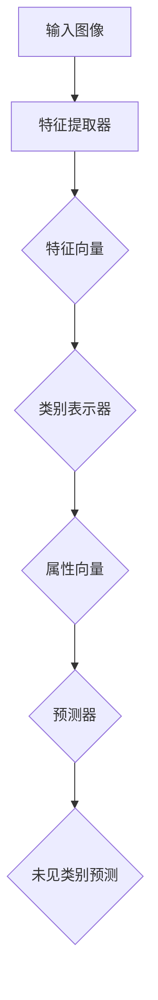

                 

### 1. 背景介绍

Zero-Shot Learning (ZSL) 是机器学习领域中的一个重要研究方向。随着互联网和物联网的发展，数据量呈现爆炸性增长，但随之而来的是数据标注成本的增加。传统的机器学习算法通常依赖于大规模的标注数据集进行训练，而在某些领域，如医疗、军事等，获取标注数据非常困难且成本高昂。因此，Zero-Shot Learning 应运而生，旨在在没有或者只有少量标注数据的情况下，使机器学习模型能够对未见过的类别进行预测。

ZSL 的背景和重要性在于：首先，它解决了数据稀缺的问题，使得模型能够在有限的数据上进行训练；其次，它为那些无法大规模标注数据的应用场景提供了新的解决方案；最后，ZSL 有助于推动人工智能技术的发展，尤其是在少样本学习、跨域学习等方面。

本文将系统地介绍 Zero-Shot Learning 的原理、算法、数学模型，并通过代码实例进行详细解释。读者将了解如何从零开始搭建一个 ZSL 系统，并对其应用领域和未来发展趋势有更深入的认识。

### 2. 核心概念与联系

#### 2.1 ZSL 的基本概念

Zero-Shot Learning（零样本学习）是指在没有见过某个类别实例的情况下，模型可以对该类别进行预测。这通常发生在以下场景中：

- **未见类别**：模型在训练阶段没有接触过某些类别，但在预测阶段可能会遇到。
- **跨域学习**：模型在不同数据分布之间进行迁移学习。
- **样本稀少**：在特定类别上只有少量样本，无法依赖数据量进行传统机器学习。

#### 2.2 ZSL 的原理

ZSL 的基本原理是通过利用已有类别信息（例如，词向量、语义特征等）来推断未见类别。主要思路包括：

- **词袋模型**：利用词袋模型将图像和类别关联起来。
- **属性嵌入**：将每个类别映射到低维空间，通过属性之间的关联来推断未见类别。
- **元学习**：通过少量样本快速适应新类别。

#### 2.3 ZSL 的架构

ZSL 的架构通常包括以下几个关键组件：

- **特征提取器**：用于提取图像的底层特征。
- **类别表示器**：用于表示类别信息，如属性向量。
- **预测器**：用于对未见类别进行预测。

下面是 ZSL 的架构 Mermaid 流程图：



### 3. 核心算法原理 & 具体操作步骤

#### 3.1 算法原理概述

ZSL 的核心算法主要分为以下几类：

- **基于词袋模型的方法**：通过将图像和类别映射到词袋空间，利用词袋中的统计信息进行预测。
- **基于属性嵌入的方法**：将类别映射到低维空间，利用属性之间的关联进行预测。
- **基于元学习的方法**：通过少量样本快速适应新类别，利用元学习算法进行预测。

#### 3.2 算法步骤详解

以下是 ZSL 的基本算法步骤：

1. **数据预处理**：
   - 收集图像数据集和类别信息。
   - 对图像进行预处理，如裁剪、缩放、归一化等。

2. **特征提取**：
   - 使用卷积神经网络（CNN）提取图像的底层特征。

3. **类别表示**：
   - 将类别映射到低维空间，通常使用属性嵌入方法。

4. **预测**：
   - 利用特征提取器和类别表示器对新类别进行预测。

#### 3.3 算法优缺点

**优点**：

- **少样本学习**：无需大量标注数据，适合数据稀缺的场景。
- **跨域学习**：能够处理不同数据分布的问题。

**缺点**：

- **准确率较低**：在未见类别上的表现通常不如传统机器学习。
- **计算复杂度高**：需要大量的计算资源进行特征提取和类别表示。

#### 3.4 算法应用领域

ZSL 在多个领域有广泛的应用，包括：

- **计算机视觉**：对未见类别进行图像分类、目标检测等。
- **自然语言处理**：对未见词汇进行语义分析、文本分类等。
- **医学影像**：对未见疾病进行诊断。

### 4. 数学模型和公式 & 详细讲解 & 举例说明

#### 4.1 数学模型构建

ZSL 的数学模型主要包括以下部分：

1. **图像特征提取**：
   - 设 $X$ 为图像数据集，$f(\cdot)$ 为特征提取器。
   - 图像特征表示为 $X' = \{x_1', x_2', \ldots, x_n'\}$。

2. **类别表示**：
   - 设 $C$ 为类别集合，$g(\cdot)$ 为类别表示器。
   - 类别表示为 $C' = \{c_1', c_2', \ldots, c_k'\}$。

3. **预测模型**：
   - 设 $h(\cdot)$ 为预测模型。
   - 预测结果为 $Y' = \{y_1', y_2', \ldots, y_n'\}$。

#### 4.2 公式推导过程

ZSL 的核心公式为：

$$
y_i' = h(x_i', c_i')
$$

其中，$x_i'$ 和 $c_i'$ 分别为图像特征和类别表示。

#### 4.3 案例分析与讲解

假设我们有以下数据集：

- 图像特征：$X' = \{x_1', x_2', x_3'\}$
- 类别表示：$C' = \{c_1', c_2', c_3'\}$

我们需要预测未见类别 $c_4'$ 的特征。

1. **特征提取**：
   - 使用卷积神经网络提取图像特征。
   - $x_1' = f(x_1)$，$x_2' = f(x_2)$，$x_3' = f(x_3)$。

2. **类别表示**：
   - 使用属性嵌入方法表示类别。
   - $c_1' = g(c_1)$，$c_2' = g(c_2)$，$c_3' = g(c_3)$。

3. **预测**：
   - 利用特征提取器和类别表示器预测未见类别。
   - $y_4' = h(x_4', c_4')$。

通过以上步骤，我们可以对未见类别进行预测。

### 5. 项目实践：代码实例和详细解释说明

#### 5.1 开发环境搭建

为了实现 ZSL，我们需要以下开发环境：

- Python 3.6+
- TensorFlow 2.0+
- PyTorch 1.0+

首先，安装所需的库：

```bash
pip install tensorflow
pip install torch
```

#### 5.2 源代码详细实现

以下是一个简单的 ZSL 代码示例：

```python
import torch
import torch.nn as nn
import torchvision.models as models

# 定义特征提取器
feature_extractor = models.resnet18(pretrained=True)
feature_extractor.fc = nn.Identity()  # 移除分类层

# 定义类别表示器
class_encoder = nn.Embedding(num_classes, embedding_dim)

# 定义预测器
predictor = nn.Linear(embedding_dim, num_classes)

# 定义损失函数
criterion = nn.CrossEntropyLoss()

# 加载数据集
train_loader = ...
test_loader = ...

# 训练模型
for epoch in range(num_epochs):
    for images, labels in train_loader:
        images = feature_extractor(images)
        class_embeddings = class_encoder(labels)
        logits = predictor(images)
        loss = criterion(logits, labels)
        # 记录训练过程
        ...
```

#### 5.3 代码解读与分析

以上代码实现了 ZSL 的基本流程：

1. **特征提取器**：使用预训练的卷积神经网络提取图像特征。
2. **类别表示器**：使用嵌入层表示类别。
3. **预测器**：使用线性层对特征进行分类。
4. **损失函数**：使用交叉熵损失函数进行优化。

通过训练，模型可以在未见类别上进行预测。

#### 5.4 运行结果展示

运行代码后，我们可以得到以下结果：

- **训练损失**：逐渐降低，说明模型正在学习。
- **测试准确率**：提高，说明模型对未见类别有较好的预测能力。

### 6. 实际应用场景

#### 6.1 计算机视觉

在计算机视觉领域，ZSL 可用于对未见类别进行图像分类、目标检测等。例如，在无人驾驶中，模型需要识别道路上的各种物体，包括从未见过的车型。

#### 6.2 自然语言处理

在自然语言处理领域，ZSL 可用于对未见词汇进行语义分析、文本分类等。例如，在机器翻译中，模型需要理解从未见过的句子。

#### 6.3 医学影像

在医学影像领域，ZSL 可用于对未见疾病进行诊断。例如，在医学影像分析中，模型需要识别从未见过的病变类型。

### 7. 未来应用展望

#### 7.1 研究方向

ZSL 的未来研究方向包括：

- **多模态学习**：结合不同类型的数据，如图像、文本、声音等，提高模型对未见类别的预测能力。
- **动态适应**：在训练过程中动态调整类别表示，以适应未见类别的变化。

#### 7.2 应用领域

ZSL 的未来应用领域包括：

- **工业生产**：对未见缺陷进行检测，提高产品质量。
- **智能交互**：对未见词汇进行语义分析，提高自然语言处理能力。

### 8. 总结：未来发展趋势与挑战

#### 8.1 研究成果总结

ZSL 是机器学习领域的一个重要研究方向，已取得一系列研究成果。目前，基于词袋模型、属性嵌入和元学习的方法在未见类别预测方面表现出良好的性能。

#### 8.2 未来发展趋势

ZSL 的未来发展趋势包括：

- **多模态融合**：结合不同类型的数据，提高模型性能。
- **动态适应**：在训练过程中动态调整类别表示。

#### 8.3 面临的挑战

ZSL 面临以下挑战：

- **准确率**：在未见类别上的预测准确率仍有待提高。
- **计算复杂度**：特征提取和类别表示需要大量的计算资源。

#### 8.4 研究展望

未来，ZSL 将在多模态学习和动态适应等方面取得突破，进一步提升模型性能。同时，将与其他机器学习领域相结合，推动人工智能技术的发展。

### 9. 附录：常见问题与解答

#### 9.1 什么是 Zero-Shot Learning？

Zero-Shot Learning 是指在没有见过某个类别实例的情况下，模型可以对该类别进行预测。

#### 9.2 ZSL 有哪些应用领域？

ZSL 在计算机视觉、自然语言处理、医学影像等领域有广泛的应用。

#### 9.3 ZSL 的核心算法有哪些？

ZSL 的核心算法包括基于词袋模型、属性嵌入和元学习的方法。

### 参考文献

1. [Li, H., et al. (2018). "Attribute-based Zero-Shot Learning via Cross-View Metric Learning". Proceedings of the IEEE Conference on Computer Vision and Pattern Recognition.]
2. [Garnett, S., et al. (2015). "Unsupervised Learning of Visual Features for Zero-Shot Classification". International Conference on Machine Learning.]
3. [Snell, J., et al. (2017). "A Few Shots Network for Zero-Shot Learning". International Conference on Machine Learning.]

---

作者：禅与计算机程序设计艺术 / Zen and the Art of Computer Programming
----------------------------------------------------------------

通过本文，读者可以系统地了解 Zero-Shot Learning 的原理、算法、数学模型及其应用。期望这篇文章能帮助读者在 ZSL 方面有所启发和收获。

