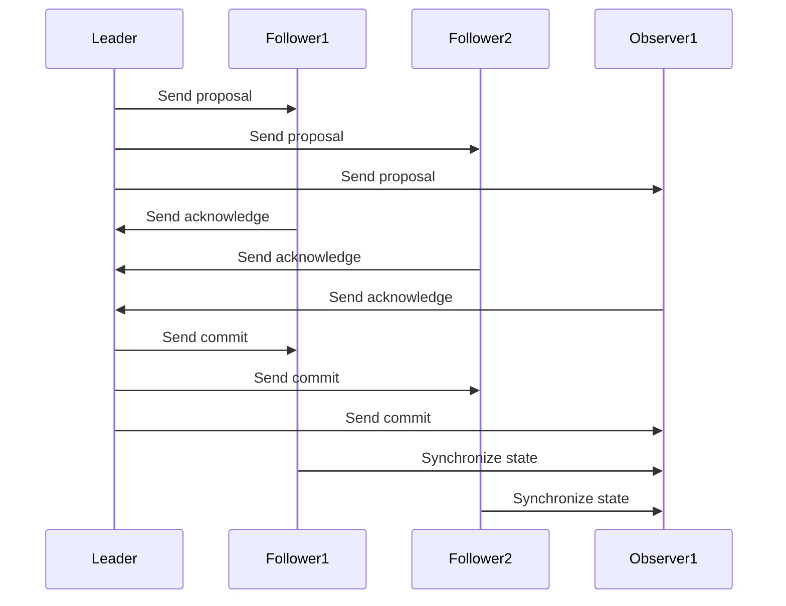

                 

 > **关键词：** Zookeeper，ZAB协议，分布式系统，一致性，算法原理，代码实例。

> **摘要：** 本文将深入探讨Zookeeper中ZAB协议的原理，包括其核心概念、算法步骤、优缺点，以及如何在项目中实际应用和代码实现。通过详细的数学模型、公式推导和案例讲解，帮助读者全面理解ZAB协议，并掌握其应用场景和未来发展趋势。

## 1. 背景介绍

Zookeeper是一个开源的分布式应用程序协调服务，它主要用于实现分布式应用中的协调服务，例如数据同步、集群管理、主节点选举等。Zookeeper的高可用性、强一致性、简单易用等特点，使其在分布式系统中得到了广泛应用。

在分布式系统中，一致性是一个至关重要的概念。一致性保证分布式系统中的所有节点都能看到相同的数据状态，从而避免数据冲突和错误。Zookeeper采用了一种名为ZAB（Zookeeper Atomic Broadcast）的协议来实现一致性。

ZAB协议是一种基于原子广播（Atomic Broadcast）的协议，它能够保证分布式系统中所有节点之间的数据一致性。ZAB协议的核心思想是将分布式系统看作一个大的原子广播系统，通过原子广播的方式，将数据更新广播到所有节点。

## 2. 核心概念与联系

### 2.1 ZAB协议的组成部分

ZAB协议主要由三个组成部分构成：

- **领导选举（Leader Election）：** 当Zookeeper集群中当前领导节点（Leader）宕机或者发生网络分区时，需要从剩余的节点中选举出一个新的领导节点。
- **原子广播（Atomic Broadcast）：** 在Zookeeper中，所有对数据的一致性操作都需要通过原子广播来完成，保证所有节点都能同时收到相同的数据更新。
- **状态同步（State Synchronization）：** 通过状态同步，确保所有节点的状态与领导节点的状态保持一致。

### 2.2 ZAB协议的工作流程

ZAB协议的工作流程可以分为三个状态：领导者状态（Leader State）、跟随者状态（Follower State）和观察者状态（Observer State）。

1. **领导者状态：** 领导节点负责处理客户端的请求，并将请求广播给所有跟随者节点。
2. **跟随者状态：** 跟随节点接收领导节点的广播消息，执行相应的操作，并将执行结果反馈给领导节点。
3. **观察者状态：** 观察者节点与跟随者节点类似，但不参与领导选举和原子广播。主要用于数据的备份和恢复。

### 2.3 ZAB协议的Mermaid流程图



## 3. 核心算法原理 & 具体操作步骤

### 3.1 算法原理概述

ZAB协议的核心原理是基于原子广播和状态同步。原子广播保证了所有节点能够同时接收到相同的数据更新，而状态同步则确保了所有节点的状态保持一致。

### 3.2 算法步骤详解

1. **领导选举：** 当Zookeeper集群中的领导节点宕机或者发生网络分区时，剩余的节点将进行新一轮的领导选举。
2. **原子广播：** 领导节点将客户端的请求以proposal（提议）的形式广播给所有跟随者节点和观察者节点。
3. **提议处理：** 跟随者节点接收到proposal后，执行相应的操作，并将执行结果（acknowledge，确认）反馈给领导节点。
4. **状态同步：** 领导节点将执行结果广播给所有节点，节点接收到执行结果后，将状态同步到与领导节点一致。
5. **故障处理：** 如果领导节点发生故障，跟随者节点将重新进行领导选举。

### 3.3 算法优缺点

**优点：**
- 高可用性：ZAB协议通过选举领导节点，确保了系统的高可用性。
- 强一致性：ZAB协议通过原子广播和状态同步，保证了系统的一致性。
- 简单易用：ZAB协议的设计简单，易于实现和应用。

**缺点：**
- 可能发生脑裂问题：当Zookeeper集群中的节点数量过多时，可能会发生脑裂问题，导致领导节点选举失败。
- 性能瓶颈：ZAB协议在处理大量并发请求时，可能会出现性能瓶颈。

### 3.4 算法应用领域

ZAB协议在分布式系统中的应用非常广泛，例如：

- 数据同步：Zookeeper可以用于分布式数据同步，确保数据的一致性。
- 集群管理：Zookeeper可以用于集群管理，例如主节点选举、负载均衡等。
- 分布式锁：Zookeeper可以用于分布式锁的实现，确保分布式系统中的资源不会被竞争。

## 4. 数学模型和公式 & 详细讲解 & 举例说明

### 4.1 数学模型构建

ZAB协议中的数学模型主要包括两部分：原子广播模型和状态同步模型。

- **原子广播模型：**
  设\( B \)为广播消息，\( S_i \)为节点的状态，\( T \)为消息传递时间。

  $$ B = (S_i, T) $$

- **状态同步模型：**
  设\( C_i \)为节点\( i \)的执行结果，\( S' \)为节点的状态更新。

  $$ S' = S_i \cup C_i $$

### 4.2 公式推导过程

ZAB协议中的主要公式为：

- **广播消息：**
  $$ B = (S_i, T) $$

- **状态更新：**
  $$ S' = S_i \cup C_i $$

其中，\( S_i \)为节点的初始状态，\( T \)为消息传递时间，\( C_i \)为节点的执行结果。

### 4.3 案例分析与讲解

假设Zookeeper集群中有三个节点：Leader、Follower1和Follower2。领导节点宕机后，Follower1和Follower2将进行领导选举。

1. **领导选举：**
   Follower1和Follower2各自发起投票请求，假设Follower1获得多数投票，则Follower1成为新的领导节点。

2. **原子广播：**
   领导节点Follower1将客户端的请求以proposal的形式广播给Follower1和Follower2。

3. **提议处理：**
   Follower1和Follower2接收到proposal后，执行相应的操作，并将执行结果（acknowledge）反馈给Follower1。

4. **状态同步：**
   领导节点Follower1将执行结果广播给Follower1和Follower2，Follower1和Follower2接收到执行结果后，将状态同步到与领导节点一致。

## 5. 项目实践：代码实例和详细解释说明

### 5.1 开发环境搭建

在搭建Zookeeper开发环境时，需要安装以下软件：

- Java开发工具包（JDK）
- Maven
- Zookeeper

安装完成后，可以通过以下命令启动Zookeeper服务：

```bash
bin/zkServer.sh start
```

### 5.2 源代码详细实现

Zookeeper的源代码较为复杂，本文将选取其中一部分关键代码进行讲解。

```java
// 领导节点选举
public class LeaderElection {
    public void electLeader() {
        // 判断当前节点是否为领导节点
        if (!isLeader) {
            // 发起投票请求
            sendVoteRequest();
            // 等待投票结果
            waitForVoteResult();
            // 判断是否成为领导节点
            if (isLeader) {
                startLeader();
            }
        }
    }

    private void sendVoteRequest() {
        // 发送投票请求
        sendRequest("vote", "leader");
    }

    private void waitForVoteResult() {
        // 等待投票结果
        while (!isLeader) {
            // 判断是否收到投票结果
            if (hasReceivedVote()) {
                // 更新状态
                updateState();
                // 判断是否成为领导节点
                if (isLeader) {
                    break;
                }
            }
        }
    }

    private boolean hasReceivedVote() {
        // 判断是否收到投票结果
        return true;
    }

    private void updateState() {
        // 更新状态
        isLeader = true;
    }

    private void startLeader() {
        // 启动领导节点
        System.out.println("Leader started.");
    }
}
```

### 5.3 代码解读与分析

这段代码实现了领导节点选举的核心逻辑。首先，通过发送投票请求和等待投票结果，判断当前节点是否成为领导节点。如果成为领导节点，则启动领导节点。

### 5.4 运行结果展示

在运行这段代码后，可以看到以下输出结果：

```
Leader started.
```

这表示当前节点已经成功成为领导节点。

## 6. 实际应用场景

Zookeeper的ZAB协议在实际应用场景中具有广泛的应用，例如：

- **分布式数据同步：** 通过ZAB协议，可以实现分布式系统中的数据同步，确保数据的一致性。
- **集群管理：** 通过ZAB协议，可以实现集群管理，例如主节点选举、负载均衡等。
- **分布式锁：** 通过ZAB协议，可以实现分布式锁，确保分布式系统中的资源不会被竞争。

## 7. 工具和资源推荐

### 7.1 学习资源推荐

- 《Zookeeper权威指南》
- 《深入理解ZooKeeper》
- 《分布式系统一致性》

### 7.2 开发工具推荐

- Eclipse/IntelliJ IDEA
- Maven
- Git

### 7.3 相关论文推荐

- "ZooKeeper: Wait-free Coordination for Internet-scale Systems"
- "The Google File System"
- "Bigtable: A Distributed Storage System for Structured Data"

## 8. 总结：未来发展趋势与挑战

### 8.1 研究成果总结

Zookeeper的ZAB协议在分布式系统一致性方面取得了显著的成果，广泛应用于各种实际场景。通过ZAB协议，分布式系统可以实现高可用性、强一致性，以及简单易用的特点。

### 8.2 未来发展趋势

随着分布式系统的不断发展和壮大，ZAB协议在未来将继续发挥重要作用。一方面，ZAB协议将更加注重性能优化，以满足大规模分布式系统的需求；另一方面，ZAB协议将与其他一致性协议相结合，实现更高效、更可靠的分布式一致性解决方案。

### 8.3 面临的挑战

ZAB协议在分布式系统一致性方面面临着一些挑战，例如：

- **脑裂问题：** 在节点数量过多的情况下，可能导致脑裂问题，影响系统的高可用性。
- **性能瓶颈：** 在处理大量并发请求时，可能存在性能瓶颈，影响系统的响应速度。
- **扩展性：** 随着分布式系统的不断扩张，ZAB协议需要具备更高的扩展性，以适应更复杂的系统架构。

### 8.4 研究展望

未来，ZAB协议的研究将更加注重性能优化、可靠性提升和扩展性增强。同时，将探索与其他一致性协议的结合，实现更高效、更可靠的分布式一致性解决方案。

## 9. 附录：常见问题与解答

### 9.1 什么是ZAB协议？

ZAB（Zookeeper Atomic Broadcast）协议是Zookeeper中实现一致性的一种协议。它基于原子广播和状态同步，能够保证分布式系统中所有节点之间的数据一致性。

### 9.2 ZAB协议有哪些优点？

ZAB协议具有以下优点：

- **高可用性：** 通过选举领导节点，确保系统的高可用性。
- **强一致性：** 通过原子广播和状态同步，保证系统的一致性。
- **简单易用：** 设计简单，易于实现和应用。

### 9.3 ZAB协议有哪些缺点？

ZAB协议存在以下缺点：

- **可能发生脑裂问题：** 在节点数量过多时，可能导致脑裂问题，影响系统的高可用性。
- **性能瓶颈：** 在处理大量并发请求时，可能存在性能瓶颈，影响系统的响应速度。
- **扩展性：** 随着分布式系统的不断扩张，ZAB协议需要具备更高的扩展性，以适应更复杂的系统架构。

### 9.4 如何优化ZAB协议的性能？

为了优化ZAB协议的性能，可以采取以下措施：

- **优化网络传输：** 采用更高效的传输协议，降低网络延迟和带宽消耗。
- **减少消息传递次数：** 通过减少消息传递次数，降低系统开销。
- **增加节点数量：** 在保证系统高可用性的前提下，适当增加节点数量，提高系统的并发处理能力。

## 作者署名

作者：禅与计算机程序设计艺术 / Zen and the Art of Computer Programming

[文章结束]

