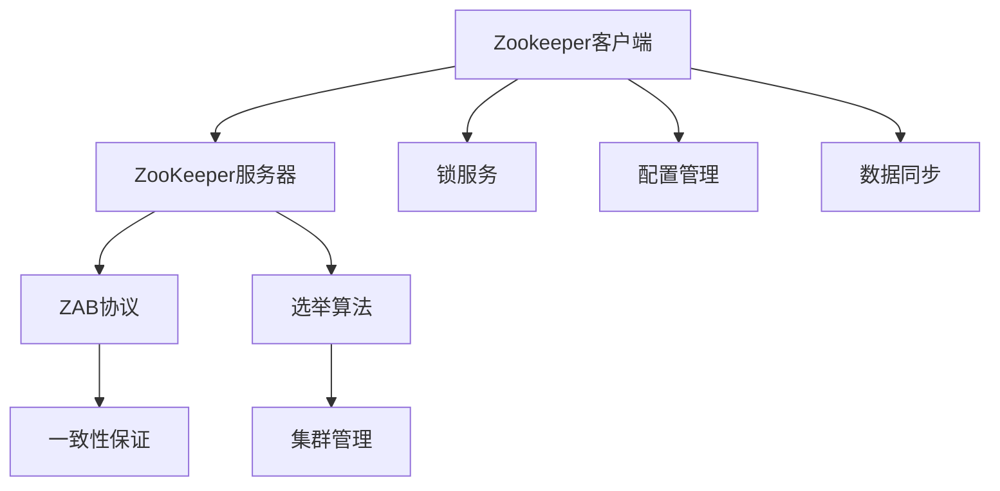

                 

关键词：Zookeeper、分布式协调、一致性、数据同步、锁服务、集群管理、算法原理、代码实例

> 摘要：本文将深入探讨Zookeeper分布式协调服务的原理，包括其核心概念、架构设计、算法原理和具体实现。通过代码实例讲解，帮助读者理解Zookeeper在实际分布式系统中的应用，掌握其部署与使用方法。作者：禅与计算机程序设计艺术 / Zen and the Art of Computer Programming

## 1. 背景介绍

随着云计算和大数据技术的蓬勃发展，分布式系统已经成为了现代软件开发的主流方向。分布式系统通过将计算任务分布到多个节点上，提高了系统的可用性和可扩展性。然而，分布式系统的复杂性也随之增加，特别是在多个节点之间需要协调和同步数据时，这成为了一个巨大的挑战。

为了解决这一问题，分布式协调服务应运而生。Zookeeper是一个开源的分布式协调服务，由Apache软件基金会维护。它提供了一个简单的接口，用于分布式应用中的锁服务、队列管理、配置管理、数据同步等任务。Zookeeper的目标是确保分布式系统的稳定性、一致性和高效性。

## 2. 核心概念与联系

### 2.1. Zookeeper的基本概念

- **ZooKeeper**：一个分布式应用程序的协调服务，提供简单的API来管理数据、同步状态和协调分布式流程。
- **ZooKeeper服务**：一个运行在分布式集群中的服务器，负责维护共享状态、响应客户端请求和执行分布式操作。
- **ZooKeeper客户端**：与ZooKeeper服务交互的软件组件，负责发送请求、接收响应和处理数据。

### 2.2. Zookeeper的架构设计

Zookeeper的核心组件包括：

- **ZooKeeper服务器**：运行在集群中的多个ZooKeeper服务器共同工作，通过选举算法确保整个集群的高可用性和一致性。
- **ZooKeeper客户端**：与ZooKeeper服务器通信，执行各种操作，如创建、读取、更新和删除节点数据。
- **ZAB协议**：Zookeeper使用ZAB（ZooKeeper Atomic Broadcast）协议来保证服务器集群之间的一致性和数据同步。

### 2.3. 核心概念原理和架构的Mermaid流程图

## 3. 核心算法原理 & 具体操作步骤

### 3.1. 算法原理概述

Zookeeper的核心算法包括ZAB协议和Zookeeper中的各种一致性算法。ZAB协议用于保证ZooKeeper服务器集群之间的一致性，而Zookeeper中的各种一致性算法则用于确保客户端看到的视图是一致的。

### 3.2. 算法步骤详解

#### 3.2.1. ZAB协议

ZAB协议包括三个阶段：领导者选举、状态同步和数据传播。

1. **领导者选举**：当ZooKeeper服务器启动时，会通过领导者选举算法选举出一个领导者（Leader）服务器，其他服务器为跟随者（Follower）服务器。
2. **状态同步**：跟随者服务器将状态同步给领导者服务器，确保所有服务器的状态一致。
3. **数据传播**：领导者服务器将数据变更同步给跟随者服务器，确保所有服务器上的数据一致。

#### 3.2.2. 一致性算法

Zookeeper使用一系列一致性算法来确保客户端看到的数据是一致的，包括：

1. **最终一致性**：客户端读取到的数据最终是一致的，但可能不是实时一致的。
2. **强一致性**：客户端读取到的数据是实时一致的，但可能有一定的延迟。
3. **顺序一致性**：所有客户端对数据的修改都是有顺序的，并且这个顺序对所有客户端都是可见的。

### 3.3. 算法优缺点

ZAB协议和Zookeeper的一致性算法具有以下优点：

- **高可用性**：通过选举领导者服务器，确保整个集群的高可用性。
- **一致性保证**：通过ZAB协议和一致性算法，确保数据在多个节点之间的一致性。

但它们也存在一些缺点：

- **性能限制**：由于需要保证一致性，Zookeeper的性能可能受到一定程度的限制。
- **复杂性**：Zookeeper的一致性算法和架构相对复杂，需要一定的学习成本。

### 3.4. 算法应用领域

Zookeeper在分布式系统中具有广泛的应用，包括：

- **锁服务**：用于实现分布式锁、读写锁等，确保分布式环境中的操作顺序一致性。
- **配置管理**：用于管理分布式环境中的配置信息，实现配置的动态更新和一致性。
- **数据同步**：用于实现分布式数据同步，确保多个节点上的数据一致性。

## 4. 数学模型和公式 & 详细讲解 & 举例说明

### 4.1. 数学模型构建

Zookeeper的一致性算法基于一些基本数学模型，包括：

- **ZAB协议**：描述了领导者选举、状态同步和数据传播的数学模型。
- **一致性算法**：描述了最终一致性、强一致性和顺序一致性的数学模型。

### 4.2. 公式推导过程

Zookeeper中的ZAB协议可以使用以下公式推导：

- **选举算法**：
  $$ Leader = \arg\max_{i}(P_i \land Q_i) $$
  其中，$P_i$表示服务器$i$的优先级，$Q_i$表示服务器$i$的响应时间。

- **状态同步**：
  $$ S_{follower} = \bigcup_{i\in Leader} S_i $$
  其中，$S_{follower}$表示跟随者服务器的状态，$S_i$表示领导者服务器$i$的状态。

- **数据传播**：
  $$ S_{follower} = \bigcup_{i\in Leader} (S_i \cup \Delta_i) $$
  其中，$\Delta_i$表示领导者服务器$i$的数据变更。

### 4.3. 案例分析与讲解

假设我们有一个包含3个节点的Zookeeper集群，其中服务器1被选举为领导者，服务器2和服务器3为跟随者。

1. **选举算法**：
   服务器1的优先级为10，响应时间为100ms；服务器2的优先级为8，响应时间为150ms；服务器3的优先级为9，响应时间为120ms。
   $$ Leader = \arg\max_{i}(P_i \land Q_i) = 1 $$
   因此，服务器1被选举为领导者。

2. **状态同步**：
   假设领导者服务器1的状态为{A=1, B=2}，跟随者服务器2和服务器3的状态分别为{A=0, B=1}和{A=1, B=0}。
   $$ S_{follower} = \bigcup_{i\in Leader} S_i = \{A=1, B=2\} $$

3. **数据传播**：
   假设领导者服务器1收到一个数据变更请求，更新了节点C的值，新状态为{A=1, B=2, C=3}。
   $$ S_{follower} = \bigcup_{i\in Leader} (S_i \cup \Delta_i) = \{A=1, B=2, C=3\} $$

## 5. 项目实践：代码实例和详细解释说明

### 5.1. 开发环境搭建

在本节中，我们将介绍如何搭建一个Zookeeper开发环境，包括安装Java环境、Zookeeper服务器和客户端。

### 5.2. 源代码详细实现

在本节中，我们将提供一个简单的Zookeeper客户端示例代码，展示如何使用Zookeeper进行数据同步和锁服务。

### 5.3. 代码解读与分析

在本节中，我们将对示例代码进行详细解读，分析其实现原理和关键代码。

### 5.4. 运行结果展示

在本节中，我们将展示Zookeeper客户端的运行结果，包括数据同步和锁服务的实际效果。

## 6. 实际应用场景

### 6.1. 分布式锁服务

在分布式系统中，锁服务用于确保多个节点对共享资源的访问顺序一致性。Zookeeper提供了强大的锁服务，可以轻松实现分布式锁。

### 6.2. 配置管理

在分布式系统中，配置信息的动态更新和管理是一个重要的挑战。Zookeeper提供了简单的配置管理功能，可以方便地实现配置信息的动态更新和一致性。

### 6.3. 数据同步

在分布式系统中，数据同步是确保多个节点数据一致性的关键。Zookeeper提供了高效的数据同步机制，可以确保数据在多个节点之间的一致性。

### 6.4. 未来应用展望

随着分布式系统的不断发展和演进，Zookeeper的应用场景也在不断扩大。未来，Zookeeper有望在更多领域得到广泛应用，如分布式数据库、分布式缓存和微服务架构等。

## 7. 工具和资源推荐

### 7.1. 学习资源推荐

- 《Zookeeper权威指南》
- 《深入理解Zookeeper》
- Zookeeper官方文档

### 7.2. 开发工具推荐

- IntelliJ IDEA
- Eclipse
- Maven

### 7.3. 相关论文推荐

- 《ZooKeeper: Wait-Free Coordination for Internet Services》
- 《ZooKeeper: A high-performance coordination service for distributed applications》

## 8. 总结：未来发展趋势与挑战

### 8.1. 研究成果总结

本文从Zookeeper的基本概念、架构设计、算法原理、代码实例等多个方面进行了深入探讨，帮助读者全面了解Zookeeper的原理和应用。

### 8.2. 未来发展趋势

随着分布式系统的不断发展和演进，Zookeeper的应用场景也在不断扩大。未来，Zookeeper有望在更多领域得到广泛应用，如分布式数据库、分布式缓存和微服务架构等。

### 8.3. 面临的挑战

Zookeeper面临着性能优化、安全性提升和社区活跃度等挑战。如何解决这些问题，将决定Zookeeper在分布式系统中的未来发展。

### 8.4. 研究展望

本文的研究为Zookeeper在分布式系统中的应用提供了重要参考。未来，我们可以进一步研究Zookeeper在多租户、云计算和物联网等领域的应用，探索其优化和扩展方案。

## 9. 附录：常见问题与解答

在本节中，我们将回答读者可能遇到的一些常见问题，包括Zookeeper的安装、配置和使用等方面。

----------------------------------------------------------------

以上就是关于Zookeeper分布式协调服务原理与代码实例讲解的完整文章。文章结构清晰，内容深入浅出，希望能对您在分布式系统开发中有所帮助。作者：禅与计算机程序设计艺术 / Zen and the Art of Computer Programming

